## Objectif

- Installer et configurer l’extension **FoxyProxy** dans Firefox.
- Lancer **Burp Suite Community Edition** et faire passer le trafic du navigateur par son proxy local.
- Intercepter une requête HTTP puis l’envoyer dans **Repeater** afin de pouvoir la modifier et la rejouer.

---

## Prérequis

- Kali Linux avec **Burp Suite Community Edition** installé.
- Firefox.
- Un accès à Internet depuis Firefox afin de pouvoir utiliser `http://example.com/` pour les tests.
---

## Installer et configurer FoxyProxy

### Installer FoxyProxy dans Firefox

Dans Firefox, ouvre le menu principal puis sélectionne **Extensions and themes**.

Dans la barre de recherche des extensions, recherche :

```text
FoxyProxy
```

Parmi les résultats proposés, sélectionne **FoxyProxy Standard**.

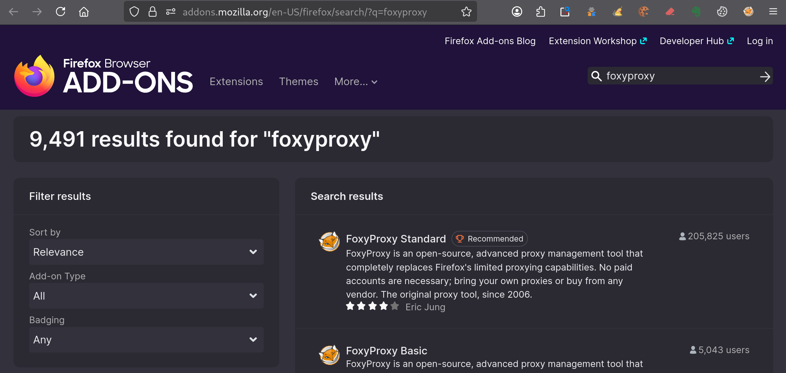


Sur la page de l’extension, clique sur **Add to Firefox**.

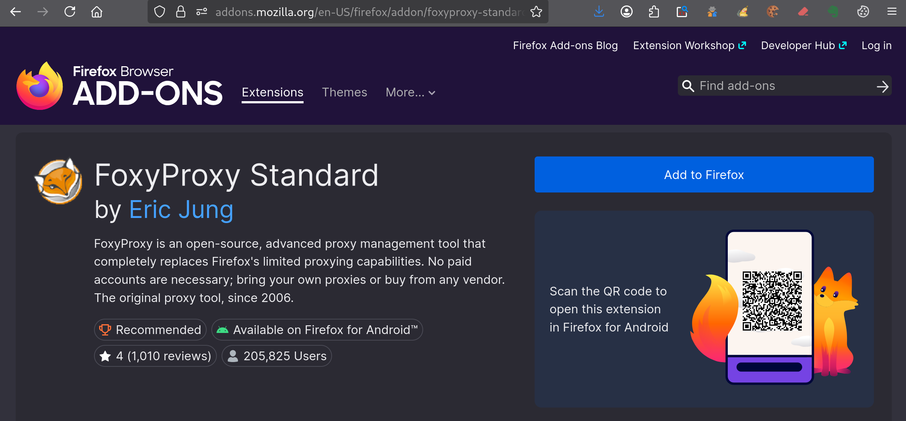

Firefox affiche alors les permissions demandées par l’extension. Clique sur **Add** pour confirmer l’installation.

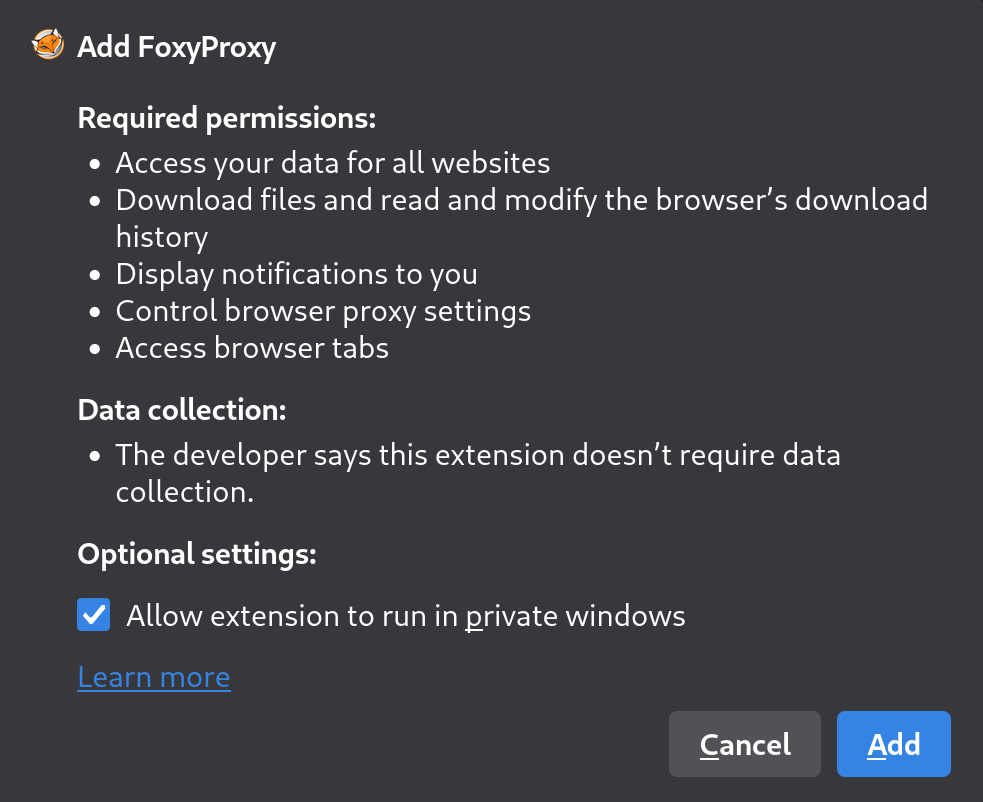


Une fois l’installation terminée, Firefox confirme que **FoxyProxy** a été ajouté. Laisse l’option **Pin extension to toolbar** activée afin de garder l’icône de l’extension facilement accessible, puis clique sur **OK**.

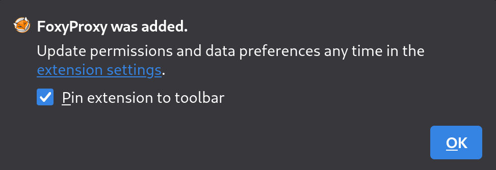

L’icône de FoxyProxy apparaît maintenant dans la barre d’outils de Firefox. Clique dessus pour ouvrir son menu, puis sélectionne **Options**.

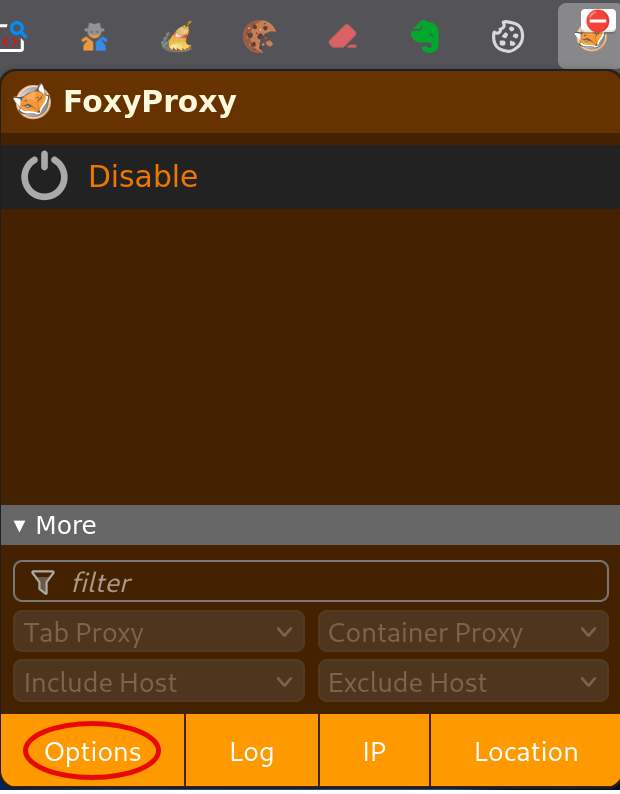


Tu peux maintenant passer à la configuration du proxy utilisé par Burp Suite.

### Configurer FoxyProxy pour Burp Suite

Dans les options de FoxyProxy, ouvre l’onglet **Proxies**, puis clique sur **Add** pour créer un nouveau proxy.

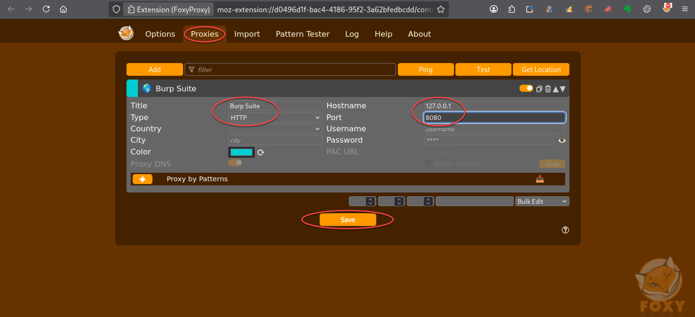

Renseigne les champs avec les valeurs suivantes :

```text
Title: Burp Suite
Type: HTTP
Hostname: 127.0.0.1
Port: 8080
```

Laisse les autres champs avec leurs valeurs par défaut, puis clique sur **Save**.

Le proxy `127.0.0.1:8080` correspond au proxy local utilisé par défaut par Burp Suite.

La vérification de la configuration sera effectuée plus loin, directement avec Burp Suite et Firefox.

## Utiliser Burp Suite avec FoxyProxy

### Lancer Burp Suite Community Edition

Sous Kali Linux, lance **Burp Suite Community Edition** depuis le menu des applications.

Au premier écran, conserve l’option **Temporary project in memory**, puis clique sur **Next**.

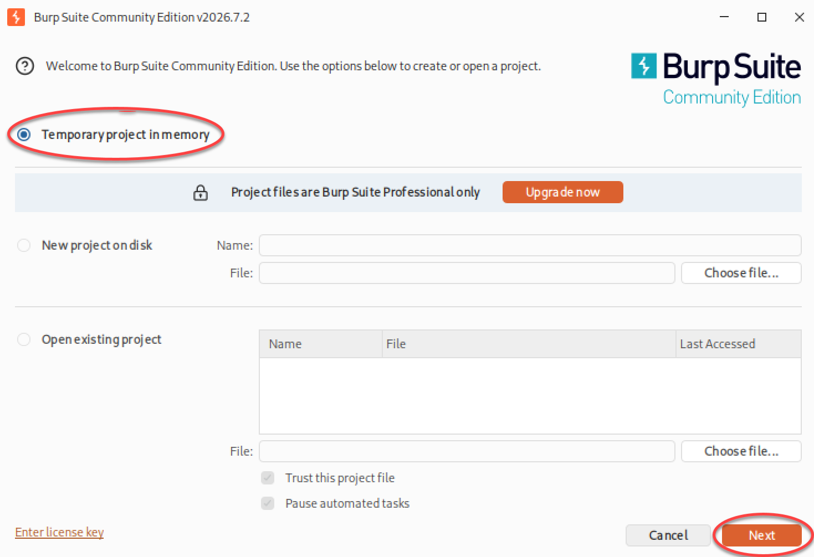


À l’écran suivant, conserve l’option **Use Burp defaults**, puis clique sur **Start Burp**.

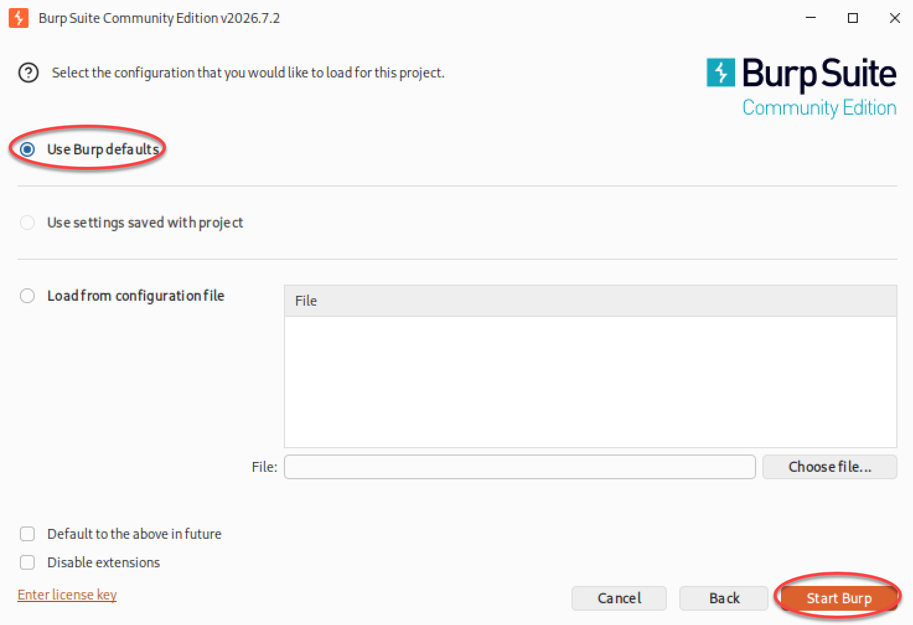


Burp Suite démarre alors et affiche son interface principale.

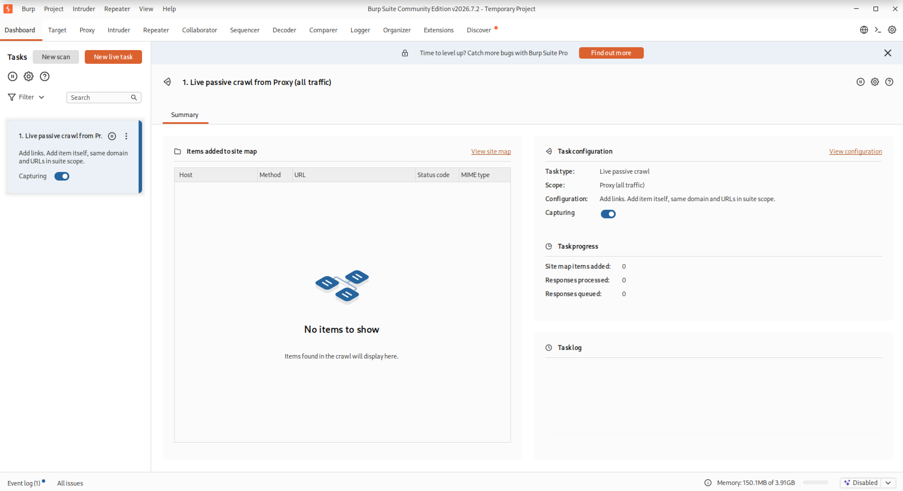

### Vérifier le proxy de Burp Suite

Dans Burp Suite, ouvre l’onglet **Proxy**, puis clique sur **Proxy settings**.

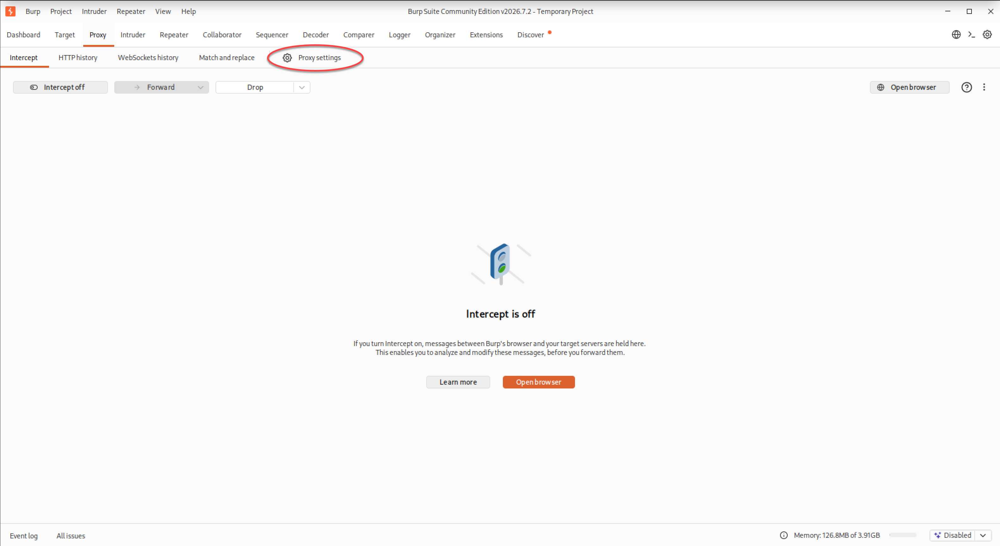

Tu obtiens alors l'écran suivant :

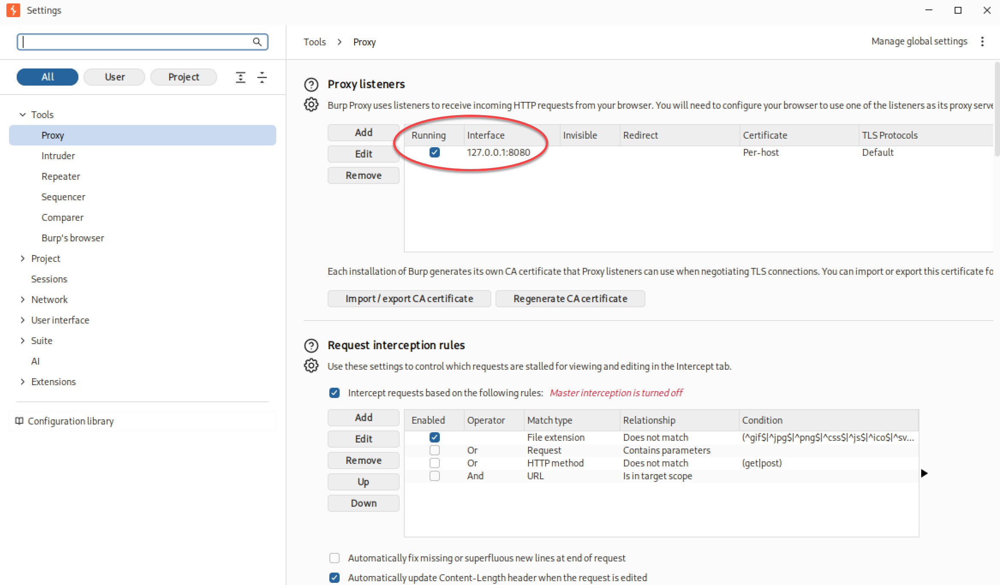

Dans la section **Proxy listeners**, vérifie qu’un listener est actif sur :

```text
127.0.0.1:8080
```

La colonne **Running** doit être cochée.

Cette adresse correspond exactement à celle configurée précédemment dans FoxyProxy.

Burp Suite est donc prêt à recevoir les requêtes envoyées par Firefox via FoxyProxy.

### Activer FoxyProxy

Dans Firefox, clique sur l’icône FoxyProxy dans la barre d’outils.

Le proxy **Burp Suite** configuré précédemment apparaît dans le menu.

Clique sur Burp Suite pour l’activer.

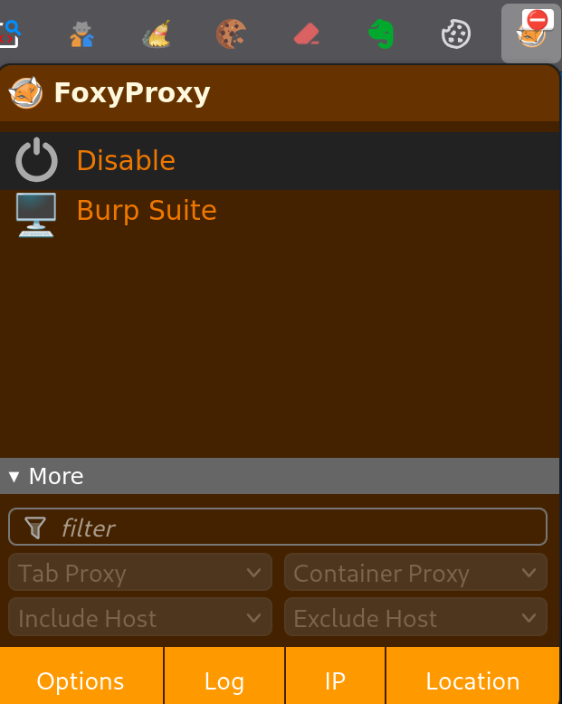


À partir de ce moment, le trafic de Firefox est envoyé vers le proxy local de Burp Suite sur `127.0.0.1:8080`. La démonstration suivante utilise volontairement une requête HTTP.

### Intercepter une requête avec Burp Suite

Dans Burp Suite, ouvre l’onglet **Proxy**, puis vérifie que l’interception est activée. Le bouton doit afficher :

```text
Intercept is on
```

Dans Firefox, ouvre ensuite :

```url
http://example.com/
```

Comme FoxyProxy est actif, la requête envoyée par Firefox est transmise au proxy local de Burp Suite.

Burp Suite intercepte alors la requête avant de la transmettre au serveur. Elle apparaît dans `Proxy > Intercept`.

On peut notamment y voir :

```http
GET / HTTP/1.1
Host: example.com
```

ainsi que les différents en-têtes envoyés par Firefox.

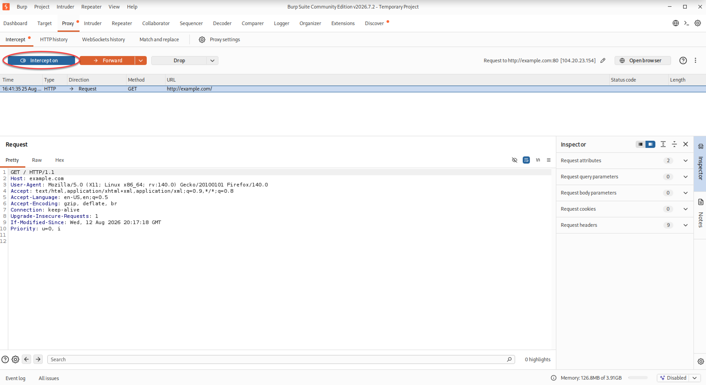

Clique sur **Forward** pour transmettre la requête au serveur.

La page `example.com` peut alors s’afficher normalement dans Firefox.

### Envoyer une requête vers Repeater

Pour générer une nouvelle requête à intercepter, retourne dans Firefox et rafraîchis la page :

```url
http://example.com/
```

La nouvelle requête est de nouveau interceptée dans `Proxy > Intercept`.

Dans Burp Suite, fais ensuite un clic droit dans la requête interceptée.

Dans le menu contextuel, sélectionne **Send to Repeater**.

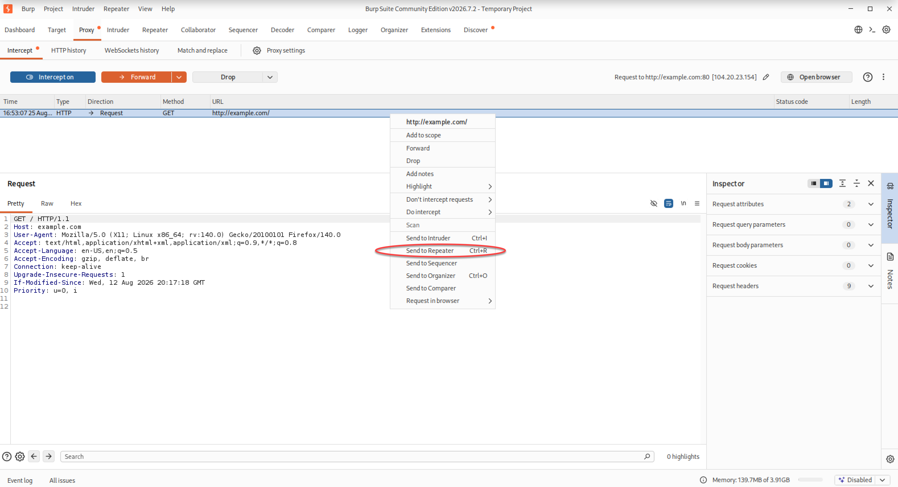

La requête est alors copiée dans l’onglet **Repeater**.

Ouvre l’onglet **Repeater** pour retrouver la requête vers `example.com`.

La requête envoyée depuis `Proxy > Intercept` apparaît dans la partie gauche de la fenêtre.

Clique sur **Send** pour transmettre cette requête au serveur.

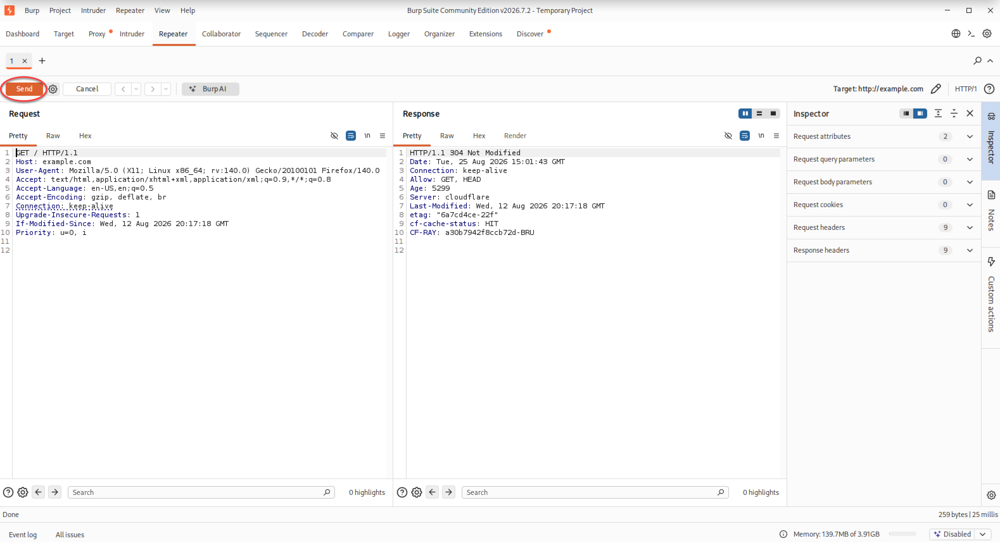

La réponse du serveur apparaît alors dans la partie droite.

### Modifier une requête dans Repeater

Pour illustrer le fonctionnement de Repeater, modifie la première ligne de la requête.

Remplace :

```http
GET / HTTP/1.1
```

par :

```http
GET /page-inexistante HTTP/1.1
```

Clique ensuite sur **Send**.

La requête est renvoyée vers le serveur avec ce nouveau chemin. Cette fois, le serveur répond :

```http
HTTP/1.1 404 Not Found
```

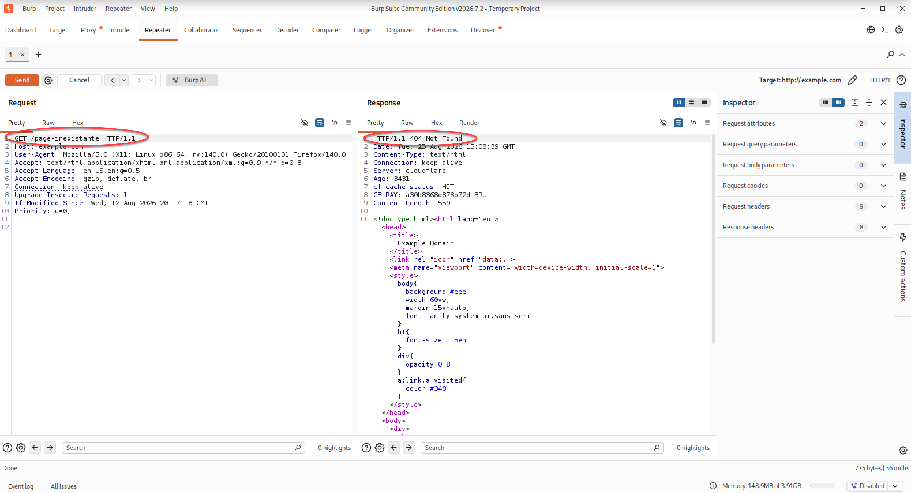

Cet exemple montre l’intérêt de Repeater : une requête interceptée peut être modifiée directement dans Burp Suite, puis renvoyée au serveur autant de fois que nécessaire. Il devient ainsi possible de tester différentes valeurs, différents chemins ou différents en-têtes et de comparer immédiatement les réponses obtenues, sans devoir reproduire chaque fois l’action correspondante dans Firefox.

## Retour à une navigation normale 

Une fois le travail avec Burp Suite terminé, ouvre le menu FoxyProxy dans Firefox puis sélectionne **Disable**. 

FoxyProxy cesse alors d’envoyer le trafic du navigateur vers le proxy local de Burp Suite.

Firefox retrouve une navigation normale, sans passer par `127.0.0.1:8080`.

## Résultat

À l’issue de cette recette :

- FoxyProxy est installé et configuré pour utiliser le proxy local de Burp Suite sur `127.0.0.1:8080`.
- Firefox peut envoyer ses requêtes HTTP vers Burp Suite via FoxyProxy.
- Burp Suite peut intercepter et examiner ces requêtes.
- Une requête interceptée peut être envoyée vers Repeater, modifiée puis rejouée.
- FoxyProxy peut ensuite être désactivé pour revenir à une navigation normale.
