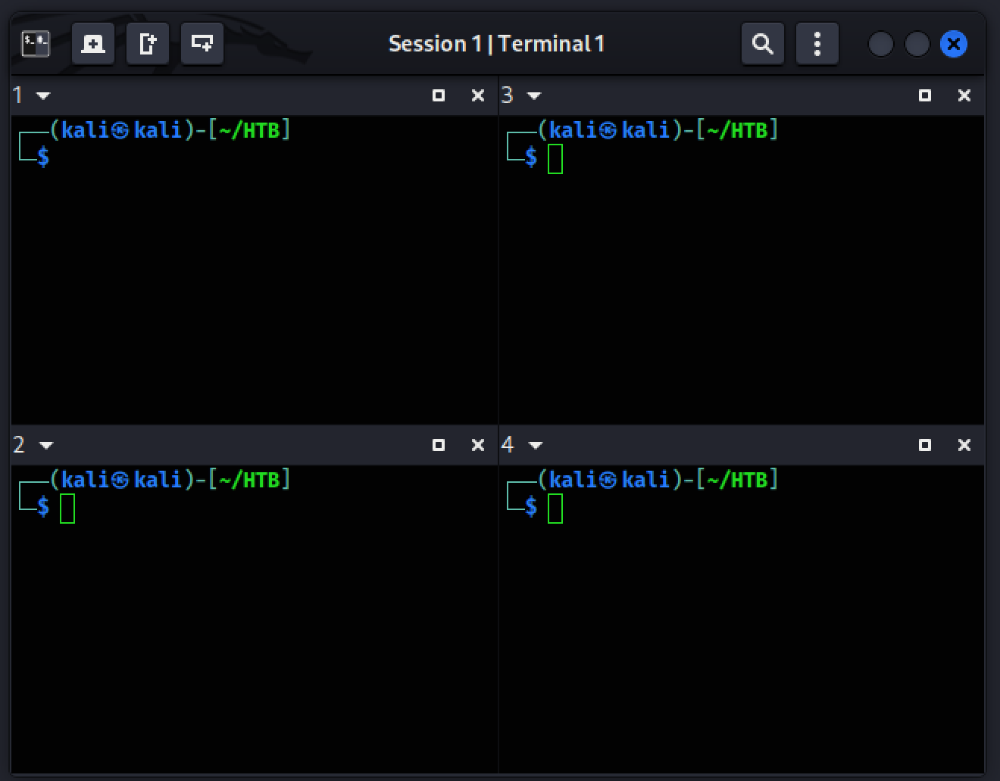

---

title: "Tilix : configurer un workspace CTF à 4 fenêtres sous Kali Linux"
description: "Mettre en place un workspace Tilix à 4 terminaux sous Kali Linux pour la résolution de challenges CTF."
tags: ["recettes","tools","tilix","kali","terminal"]
categories: ["Mes recettes"]
date: 2026-01-18T16:10:20+01:00
draft: false
---

## Objectif
Tilix est un émulateur de terminal moderne pour Linux, conçu pour travailler efficacement avec plusieurs terminaux dans une même fenêtre.

Cette recette explique **comment démarrer un workspace Tilix à 4 fenêtres via un raccourci sur le bureau**, lequel lance Tilix directement avec **une session prédéfinie à 4 terminaux**, **qui te donne un environnement de travail prêt à l’emploi** pour la résolution de challenges CTF sous Kali Linux.



---

## Prérequis
### Vérifier que Tilix est installé

Dans un terminal :

```bash
tilix --version
```

### Si Tilix n’est pas installé :

```bash
sudo apt update
sudo apt install tilix
```

---

## Étapes

### Créer le répertoire de configuration Tilix

Tilix stocke les sessions utilisateur dans un répertoire dédié.
 Commence par le créer s’il n’existe pas :

```
mkdir -p ~/.config/tilix/sessions
```

Ce répertoire contiendra le fichier de session définissant le workspace à 4 fenêtres.

### Créer le fichier de session `tilix4.json`

Crée ensuite le fichier de configuration de la session :

```bash
nano ~/.config/tilix/sessions/tilix4.json
```

Copie et colle le contenu suivant :

```json
{
    "child": {
        "child1": {
            "child1": {
                "directory": "",
                "height": 230,
                "profile": "2b7c4080-0ddd-46c5-8f23-563fd3ba789d",
                "readOnly": false,
                "synchronizedInput": true,
                "type": "Terminal",
                "uuid": "04ee3a6e-4b55-47f5-a986-fd7934b6cb54",
                "width": 321
            },
            "child2": {
                "directory": "",
                "height": 230,
                "profile": "2b7c4080-0ddd-46c5-8f23-563fd3ba789d",
                "readOnly": false,
                "synchronizedInput": true,
                "type": "Terminal",
                "uuid": "4db11159-7e7a-4566-b714-e86609a4b284",
                "width": 321
            },
            "orientation": 1,
            "position": 49,
            "ratio": 0.498915401301518457,
            "type": "Paned"
        },
        "child2": {
            "child1": {
                "directory": "",
                "height": 230,
                "profile": "2b7c4080-0ddd-46c5-8f23-563fd3ba789d",
                "readOnly": false,
                "synchronizedInput": true,
                "type": "Terminal",
                "uuid": "b4e2d695-ce72-49af-a422-c40288582008",
                "width": 320
            },
            "child2": {
                "directory": "",
                "height": 230,
                "profile": "2b7c4080-0ddd-46c5-8f23-563fd3ba789d",
                "readOnly": false,
                "synchronizedInput": true,
                "type": "Terminal",
                "uuid": "165e50a1-4d15-4675-8481-eaf9881c7d39",
                "width": 320
            },
            "orientation": 1,
            "position": 49,
            "ratio": 0.498915401301518457,
            "type": "Paned"
        },
        "orientation": 0,
        "position": 50,
        "ratio": 0.5,
        "type": "Paned"
    },
    "height": 461,
    "name": "Session",
    "synchronizedInput": false,
    "type": "Session",
    "uuid": "3505e43f-6c40-469c-ae33-16e4dfbbab62",
    "version": "1.0",
    "width": 642
}
```


### Tester la session Tilix en ligne de commande

Avant d’aller plus loin, vérifie que la session est valide.

Dans un terminal :

```bash
tilix --session=~/.config/tilix/sessions/tilix4.json
```

Si tout est correct :

- Tilix s’ouvre avec **4 fenêtres prédéfinies**
- Aucune erreur n’est affichée

Ferme ensuite Tilix avant de passer à l’étape suivante.

### Créer le raccourci bureau pour lancer le workspace

L’objectif est maintenant de lancer ce workspace **en un clic**, avec un répertoire de travail adapté.

Crée un fichier de raccourci sur le bureau :

```bash
nano ~/Bureau/Tilix-CTF.desktop
```
ou, si ton système est en anglais :
 ```bash
 nano ~/Desktop/Tilix-CTF.desktop
 ```

Ajoute le contenu suivant (en adaptant le répertoire de démarrage si nécessaire) :

```
[Desktop Entry]
Type=Application
Name=Tilix – Workspace CTF (4 fenêtres)
Comment=Lancer Tilix avec une session 4 fenêtres prédéfinie
Exec=bash -c 'cd ~/HTB && tilix --session=~/.config/tilix/sessions/tilix4.json'
Terminal=false
Icon=tilix
Categories=Utility;TerminalEmulator;
```

Rends le raccourci exécutable :

```bash
chmod +x ~/Bureau/Tilix-CTF.desktop
```

ou, si ton système est en anglais :

```bash
chmod +x ~/Desktop/Tilix-CTF.desktop
```


### Tester le raccourci bureau

- Double-clique sur le raccourci **Tilix – Workspace CTF (4 fenêtres)**
- Tilix doit s’ouvrir :
  - avec la **session 4 fenêtres**
  - directement dans le répertoire `~/HTB/`

- Lors du premier double-clic sur le raccourci :

  - une fenêtre s’ouvre indiquant que le fichier provient d’une source non fiable

  - choisis **Faire confiance et lancer** (ou équivalent)

- Cette opération n'est à effectuer **qu'une seule fois**.

### Option — Activer le thème sombre dans Tilix

Si Tilix ne s’ouvre pas en mode sombre, deux méthodes sont possibles.

 - Via les menus Tilix

   - Menu ☰ → **Preferences**

   - Onglet **Appearance**

   - Activer le thème sombre (Dark)

 - Via la ligne de commande

   Tu peux aussi forcer le thème sombre globalement avec :

	 ```

 	gsettings set com.gexperts.Tilix.Settings theme-variant 'dark'
 	 ```

 ​	Le changement est immédiat au prochain lancement de Tilix.

