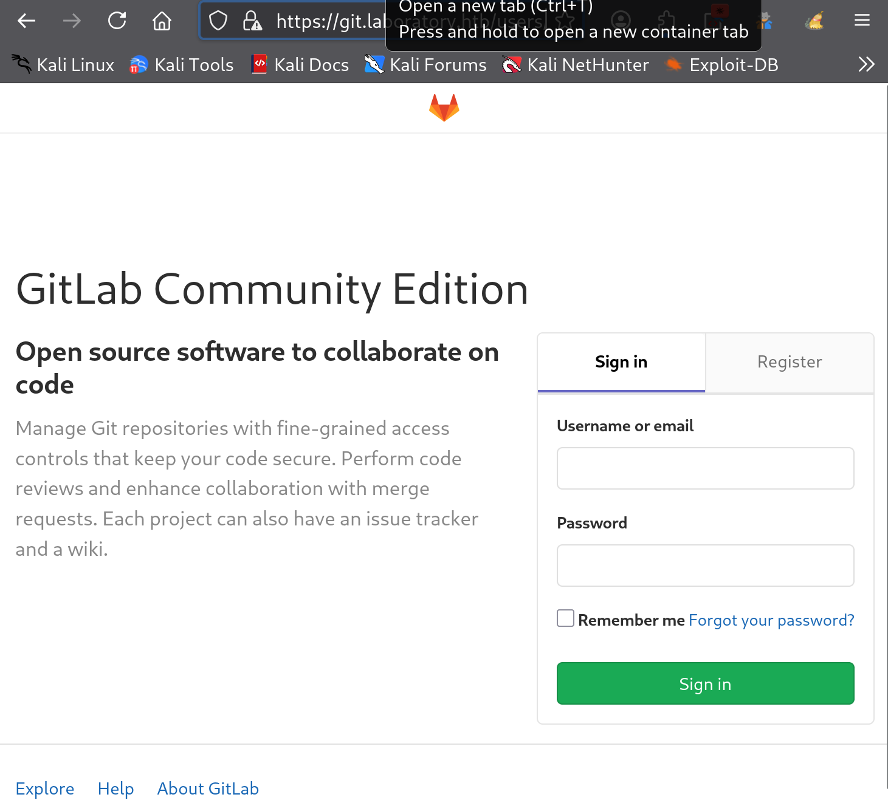

---
# === Archetype writeups – v1 (stable) ===
# === Archetype: writeups (Page Bundle) ===
# Copié vers content/writeups/<nom_ctf>/index.md

# H1 SEO (via title, pas dans le markdown)
title: "Laboratory — HTB Easy Writeup & Walkthrough"
linkTitle: "Laboratory"
slug: "laboratory"
date: 2026-05-29T09:54:27+02:00
#lastmod: 2026-05-29T09:54:27+02:00
draft: true

# --- PaperMod / navigation ---
type: "writeups"
summary: "Summary générique de machine CTF"
description: "Description générique de machine CTF"
tags: ["Hack The Box","HTB Easy","linux-privesc"]
categories: ["Mes writeups"]

# Ajouter ensuite uniquement des tags techniques réellement utilisés dans le writeup,
# par exemple :
# - prise de pied : "Web", "SSH", "FTP"
# - faille : "XSS", "LFI", "RCE", "Path Traversal", "Shellshock"
# - techno / produit : "Grafana", "Chamilo", "CMS Made Simple", "js2py"
# - CVE : "CVE-2021-43798"
# - pivot : "Credential Reuse"
# - privesc spécifique : "sudo", "Docker", "Cron", "ACL", "PATH Hijacking", "tmux", "npbackup", "pspy64"

# --- TOC & mise en page ---
ShowToc: true
TocOpen: true
# toc_droite: 1

# --- Cover / images (Page Bundle) ---
cover:
  image: "image.png"
  alt: "Laboratory"
  caption: ""
  relative: true
  hidden: false
  hiddenInList: false
  hiddenInSingle: false

# --- Paramètres CTF (placeholders à éditer après création) ---
ctf:
  platform: "Hack The Box"
  machine: "Laboratory"
  difficulty: "Easy"
  target_ip: "10.129.x.x"
  skills: ["Enumeration","Web","Privilege Escalation"]
  time_spent: "2h"
  # vpn_ip: "10.10.14.xx"
  # notes: "Points d'attention…"

# --- Options diverses ---
# weight: 10
# ShowBreadCrumbs: true
# ShowPostNavLinks: true

# --- SEO Reminders (à compléter après création) ---
# 1) Titre :
#    - Doit contenir : Nom Machine + HTB Easy + Writeup
# 2) Description :
#    - Résumé 130–160 caractères
#    - Style “Mix Parfait” : pédagogique + technique
#    - Exemple : "Writeup de <machine> (HTB Easy) : énumération claire, analyse de la vulnérabilité et escalade structurée."
# 3) ALT (image de couverture) :
#    - Mixer vulnérabilité + pédagogie + progression
#    - Exemple : "Machine <machine> HTB Easy vulnérable à <faille>, expliquée étape par étape jusqu'à l'escalade."
# 4) Tags :
#    - Toujours ["Easy"]
#    - Ajouter d'autres selon le thème : ["web","shellshock","heartbleed","enum"]
# 5) Structure :
#    - H1 = titre
#    - Description = meta description + preview social
#    - ALT = SEO image + accessibilité

# --- SEO CHECKLIST (à valider avant publication) ---

# [ ] 1) Titre (title + H1)
#     - Contient : Nom Machine + HTB Easy + Writeup
#     - Unique sur le site
#     - Lisible hors contexte HTB

# [ ] 2) Description (meta)
#     - 130–160 caractères
#     - Pas générique
#     - Ton pédagogique + technique
#     - Exemple :
#       "Writeup de <machine> (HTB Easy) : énumération claire,
#        compréhension de la vulnérabilité et escalade structurée."

# [ ] 3) Image de couverture
#     - Présente (ou fallback)
#     - Nom explicite
#     - Dimensions cohérentes

# [ ] 4) ALT de l’image
#     - Décrit la machine + l’approche
#     - Pédagogique (pas juste technique)
#     - Exemple :
#       "Machine <machine> HTB Easy exploitée étape par étape,
#        de l’énumération à l’escalade de privilèges."

# [ ] 5) Tags
#     - Toujours inclure la difficulté (ex: "Easy")
#     - Ajouter uniquement des tags techniques réels

# [ ] 6) Structure du contenu
#     - Un seul H1
#     - Sections claires et hiérarchisées
#     - Pas de sections SEO artificielles

---

<!-- ====================================================================
Tableau d'infos (modèle) — Remplacer les valeurs entre <...> après création.
Aucun templating Hugo dans le corps, pour éviter les erreurs d'archetype.
====================================================================
| Champ          | Valeur |
|----------------|--------|
| **Plateforme** | <Hack The Box> |
| **Machine**    | <Laboratory> |
| **Difficulté** | <Easy / Medium / Hard> |
| **Cible**      | <10.129.x.x> |
| **Durée**      | <2h> |
| **Compétences**| <Enumeration, Web, Privilege Escalation> |

---
-->
## Introduction

- Contexte (source, thème, objectif).
- Hypothèses initiales (services attendus, techno probable).
- Objectifs : obtenir `user.txt` puis `root.txt`.

---

## Énumération



### Scan initial

Le scan TCP complet (`scans_nmap/full_tcp_scan.txt`) montre les ports ouverts suivants :

```bash
# Nmap 7.99 scan initiated [date] as: /usr/lib/nmap/nmap --privileged -Pn -p- --min-rate 5000 -T4 -oN scans_nmap/laboratory/full_tcp_scan.txt laboratory.htb
Nmap scan report for laboratory.htb (10.129.x.x)
Host is up (0.088s latency).
Not shown: 65532 filtered tcp ports (no-response)
PORT    STATE SERVICE
22/tcp  open  ssh
80/tcp  open  http
443/tcp open  https

# Nmap done at [date] -- 1 IP address (1 host up) scanned in 27.00 seconds
```

### Scan FTP/SMB (si services détectés)

Après le scan initial, le script enchaîne automatiquement avec une phase d’énumération ciblée **FTP/SMB** si l’un des services suivants est détecté :

- **FTP** sur le port **21**
- **SMB** sur le port **139** et/ou **445**

Les résultats sont enregistrés dans (`scans_nmap/enum_ftp_smb_scan.txt`) :

```bash
# mon-nmap — ENUM FTP / SMB
# Target : laboratory.htb
# Date   : [date]

Aucun service FTP (21) ni SMB (139/445) détecté.
Ports ouverts détectés : 22,80,443
```


### Scan agressif

Le script enchaîne ensuite automatiquement sur un scan agressif orienté vulnérabilités.

Ce scan fournit des informations détaillées sur les services et versions détectés.

Les résultats sont enregistrés dans (`scans_nmap/aggressive_vuln_scan.txt`) :

```bash
[+] Scan agressif orienté vulnérabilités (CTF-perfect LEGACY) pour laboratory.htb
[+] Commande utilisée :
    nmap -Pn -A -sV -p"22,80,443" --script="(http-vuln-* or http-shellshock or ssl-heartbleed or ssl-cert) and not (http-vuln-cve2017-1001000 or http-sql-injection or sslv2 or ssl-dh-params)" --script-timeout=30s -T4 "laboratory.htb"

# Nmap 7.99 scan initiated [date] as: /usr/lib/nmap/nmap --privileged -Pn -A -sV -p22,80,443 "--script=(http-vuln-* or http-shellshock or ssl-heartbleed or ssl-cert) and not (http-vuln-cve2017-1001000 or http-sql-injection or sslv2 or ssl-dh-params)" --script-timeout=30s -T4 -oN scans_nmap/laboratory/aggressive_vuln_scan_raw.txt laboratory.htb
Nmap scan report for laboratory.htb (10.129.x.x)
Host is up (0.039s latency).

PORT    STATE SERVICE  VERSION
22/tcp  open  ssh      OpenSSH 8.2p1 Ubuntu 4ubuntu0.1 (Ubuntu Linux; protocol 2.0)
80/tcp  open  http     Apache httpd 2.4.41
|_http-server-header: Apache/2.4.41 (Ubuntu)
443/tcp open  ssl/http Apache httpd 2.4.41
|_http-server-header: Apache/2.4.41 (Ubuntu)
| ssl-cert: Subject: commonName=laboratory.htb
| Subject Alternative Name: DNS:git.laboratory.htb
| Issuer: commonName=laboratory.htb
| Public Key type: rsa
| Public Key bits: 4096
| Signature Algorithm: sha256WithRSAEncryption
| Not valid before: 2020-07-05T10:39:28
| Not valid after:  2024-03-03T10:39:28
| MD5:     2873 91a5 5022 f323 4b95 df98 b61a eb6c
| SHA-1:   0875 3a7e eef6 8f50 0349 510d 9fbf abc3 c70a a1ca
|_SHA-256: e164 6bfd 66bd 8821 2fff 8c99 3c25 bc59 3e85 154e dc00 6551 2015 9530 84da 3aba
Warning: OSScan results may be unreliable because we could not find at least 1 open and 1 closed port
Device type: general purpose|router
Running (JUST GUESSING): Linux 4.X|5.X|2.6.X|3.X (97%), MikroTik RouterOS 7.X (90%)
OS CPE: cpe:/o:linux:linux_kernel:4 cpe:/o:linux:linux_kernel:5 cpe:/o:linux:linux_kernel:2.6 cpe:/o:linux:linux_kernel:3 cpe:/o:linux:linux_kernel:6 cpe:/o:mikrotik:routeros:7 cpe:/o:linux:linux_kernel:5.6.3
Aggressive OS guesses: Linux 4.15 - 5.19 (97%), Linux 5.0 - 5.14 (97%), Linux 2.6.32 - 3.13 (91%), Linux 3.10 - 4.11 (91%), Linux 3.2 - 4.14 (91%), Linux 4.15 (91%), Linux 5.14 - 6.8 (91%), Linux 2.6.32 - 3.10 (91%), Linux 4.19 - 5.15 (91%), Linux 4.19 (90%)
No exact OS matches for host (test conditions non-ideal).
Network Distance: 2 hops
Service Info: OS: Linux; CPE: cpe:/o:linux:linux_kernel

TRACEROUTE (using port 443/tcp)
HOP RTT      ADDRESS
1   53.93 ms 10.10.16.1
2   53.98 ms laboratory.htb (10.129.6.88)

OS and Service detection performed. Please report any incorrect results at https://nmap.org/submit/ .
# Nmap done at [date] -- 1 IP address (1 host up) scanned in 24.88 seconds

```


### Scan ciblé CMS

Le script exécute ensuite un scan ciblé CMS (scans_nmap/cms_vuln_scan.txt).

```bash
# Nmap 7.99 scan initiated [date] as: /usr/lib/nmap/nmap --privileged -Pn -sV -p22,80,443 --script=http-wordpress-enum,http-wordpress-brute,http-wordpress-users,http-drupal-enum,http-drupal-enum-users,http-joomla-brute,http-generator,http-robots.txt,http-title,http-headers,http-methods,http-enum,http-devframework,http-cakephp-version,http-php-version,http-config-backup,http-backup-finder,http-sitemap-generator --script-timeout=30s -T4 -oN scans_nmap/laboratory/cms_vuln_scan.txt laboratory.htb
Nmap scan report for laboratory.htb (10.129.x.x)
Host is up (0.063s latency).

PORT    STATE SERVICE  VERSION
22/tcp  open  ssh      OpenSSH 8.2p1 Ubuntu 4ubuntu0.1 (Ubuntu Linux; protocol 2.0)
80/tcp  open  http     Apache httpd 2.4.41
|_http-title: Did not follow redirect to https://laboratory.htb/
| http-methods: 
|_  Supported Methods: GET HEAD POST OPTIONS
|_http-server-header: Apache/2.4.41 (Ubuntu)
| http-sitemap-generator: 
|   Directory structure:
|   Longest directory structure:
|     Depth: 0
|     Dir: /
|   Total files found (by extension):
|_    
| http-headers: 
|   Date: Fri, 29 May 2026 08:10:55 GMT
|   Server: Apache/2.4.41 (Ubuntu)
|   Location: https://laboratory.htb/
|   Content-Length: 287
|   Connection: close
|   Content-Type: text/html; charset=iso-8859-1
|   
|_  (Request type: GET)
|_http-devframework: Couldn't determine the underlying framework or CMS. Try increasing 'httpspider.maxpagecount' value to spider more pages.
443/tcp open  ssl/http Apache httpd 2.4.41
|_http-server-header: Apache/2.4.41 (Ubuntu)
|_http-title: The Laboratory
| http-headers: 
|   Date: Fri, 29 May 2026 08:10:55 GMT
|   Server: Apache/2.4.41 (Ubuntu)
|   Last-Modified: Sun, 05 Jul 2020 16:42:54 GMT
|   ETag: "1c56-5a9b4731c5f80"
|   Accept-Ranges: bytes
|   Content-Length: 7254
|   Vary: Accept-Encoding
|   Connection: close
|   Content-Type: text/html
|   
|_  (Request type: HEAD)
| http-enum: 
|_  /images/: Potentially interesting directory w/ listing on 'apache/2.4.41 (ubuntu)'
|_http-devframework: Couldn't determine the underlying framework or CMS. Try increasing 'httpspider.maxpagecount' value to spider more pages.
| http-methods: 
|_  Supported Methods: POST OPTIONS HEAD GET
| http-sitemap-generator: 
|   Directory structure:
|     /
|       Other: 1; html: 1
|     /assets/
|       Other: 1
|     /assets/css/
|       css: 1
|     /assets/js/
|       Other: 1; js: 5
|     /icons/
|       gif: 1
|     /images/
|       jpg: 2; mp4: 1; png: 1
|   Longest directory structure:
|     Depth: 2
|     Dir: /assets/js/
|   Total files found (by extension):
|_    Other: 3; css: 1; gif: 1; html: 1; jpg: 2; js: 5; mp4: 1; png: 1
Service Info: OS: Linux; CPE: cpe:/o:linux:linux_kernel

Service detection performed. Please report any incorrect results at https://nmap.org/submit/ .
# Nmap done at [date] -- 1 IP address (1 host up) scanned in 32.53 seconds

```


### Scan UDP rapide

Le script lance également un scan UDP rapide afin de détecter d’éventuels services supplémentaires (`scans_nmap/udp_vuln_scan.txt`).

```bash
# Nmap 7.99 scan initiated [date] as: /usr/lib/nmap/nmap --privileged -n -Pn -sU --top-ports 20 -T4 -oN scans_nmap/laboratory/udp_vuln_scan.txt laboratory.htb
Nmap scan report for laboratory.htb (10.129.x.x)
Host is up.

PORT      STATE         SERVICE
53/udp    open|filtered domain
67/udp    open|filtered dhcps
68/udp    open|filtered dhcpc
69/udp    open|filtered tftp
123/udp   open|filtered ntp
135/udp   open|filtered msrpc
137/udp   open|filtered netbios-ns
138/udp   open|filtered netbios-dgm
139/udp   open|filtered netbios-ssn
161/udp   open|filtered snmp
162/udp   open|filtered snmptrap
445/udp   open|filtered microsoft-ds
500/udp   open|filtered isakmp
514/udp   open|filtered syslog
520/udp   open|filtered route
631/udp   open|filtered ipp
1434/udp  open|filtered ms-sql-m
1900/udp  open|filtered upnp
4500/udp  open|filtered nat-t-ike
49152/udp open|filtered unknown

# Nmap done at [date] -- 1 IP address (1 host up) scanned in 3.11 seconds

```


### Énumération des chemins web
Pour la découverte des chemins web, tu utilises généralement le script dédié .

Malheureusement, les résultats de `mon-recoweb` ne sont pas exploitables ici, car le serveur retourne massivement des réponses HTTP `302`.

Une réponse `302` indique une redirection. Or, si presque tous les chemins testés sont redirigés, il devient impossible de distinguer proprement un vrai répertoire d’un faux positif.

Le test avec `--fc 302` confirme ce comportement : une fois les redirections exclues, le résultat devient vide. Cela montre que les résultats précédents étaient principalement dus aux redirections, et non à de vraies découvertes web.

Dans ce contexte, `mon-recoweb` n’apporte donc pas de découverte web fiable.

### Recherche de vhosts

Pour compléter l’énumération web, tu recherches ensuite d’éventuels virtual hosts avec le script dédié .

Le résultat n’est toutefois pas exploitable directement.

Sur le port `80`, les baselines effectuées avec des noms d’hôtes aléatoires retournent toutes une réponse `302` identique. Le fuzzing remonte alors presque toute la wordlist comme résultat potentiel, ce qui correspond à des faux positifs.

Sur le port `443`, le comportement est encore plus clair : des noms d’hôtes aléatoires retournent tous une réponse `200` identique, avec la même taille et le même nombre de mots. Le script détecte donc un comportement de type wildcard et saute le fuzzing, car la réponse ne permet pas de distinguer un vrai virtual host d’un nom inventé.

Dans ce contexte, `mon-subdomains` ne permet pas d’identifier de virtual host fiable.

## Prise pied

Le scan agressif donne déjà deux informations utiles sur le service web exposé par la machine :

```bash
| http-enum:
|   /images/: Potentially interesting directory w/ listing on 'apache/2.4.29 (ubuntu)'
|   /assets/: Potentially interesting directory w/ listing on 'apache/2.4.29 (ubuntu)'

| ssl-cert:
| Subject Alternative Name:
|   DNS:git.laboratory.htb

```

Les répertoires `/images` et `/assets` peuvent être explorés, mais l’information la plus importante ici est la présence d’un vhost HTTPS :

```url
https://git.laboratory.htb
```

Avant de poursuivre l’exploitation, tu vérifies que l’interface GitLab répond correctement. Sur cette machine, GitLab peut parfois retourner une erreur `502`, notamment après un reset ou lorsque le service n’est pas encore complètement disponible.

Tu utilises donc une petite boucle `curl` pour tester régulièrement la réponse de `https://git.laboratory.htb/`. La commande affiche le code HTTP, extrait le titre de la page lorsqu’il est présent, puis s’arrête dès que GitLab ne répond plus en `502` ou en `000`.


```bash
while true; do
  code=$(curl -k -s -o /tmp/gitlab-check.html -w "%{http_code}" https://git.laboratory.htb/)
  title=$(grep -oP '(?<=<title>).*?(?=</title>)' /tmp/gitlab-check.html 2>/dev/null)

  echo "$(date '+%H:%M:%S') - HTTP $code - ${title:-no title}"

  if [ "$code" != "502" ] && [ "$code" != "000" ]; then
    echo "[+] GitLab semble répondre : https://git.laboratory.htb/"
    break
  fi

  sleep 30
done
```

Hack The Box indique que le service GitLab peut prendre jusqu’à 5 minutes avant d’être pleinement disponible. Il est donc normal d’obtenir temporairement des erreurs `502` après un reset de la machine.


Voici par exemple une attente typique avant que GitLab réponde correctement :

```text
17:38:12 - HTTP 000 - GitLab is not responding (502)
17:38:45 - HTTP 000 - GitLab is not responding (502)
17:39:08 - HTTP 000 - GitLab is not responding (502)
17:39:38 - HTTP 502 - GitLab is not responding (502)
17:39:58 - HTTP 502 - GitLab is not responding (502)
17:41:19 - HTTP 502 - GitLab is not responding (502)
17:41:49 - HTTP 302 - no title
[+] GitLab semble répondre : https://git.laboratory.htb/
```

Ici, le passage en `HTTP 302` indique que le service répond à nouveau. Tu peux alors poursuivre l’exploitation de `https://git.laboratory.htb/`.



> Si GitLab ne répond toujours pas après environ 5 à 6 minutes, le plus simple est de faire un reset de la machine. Dans ce cas, pense aussi à mettre à jour `/etc/hosts` avec la nouvelle adresse IP attribuée par Hack The Box.


## Escalade de privilèges



### Observation avec pspy64

Une autre vérification classique consiste à surveiller les processus exécutés sur la machine afin d’identifier d’éventuelles tâches automatiques lancées par `root`.

Pour cela, tu ouvres une deuxième session SSH et tu utilises l’outil `pspy64`.

Comme expliqué dans la recette , l’objectif est de lancer d’abord l’observation des tâches root puis de continuer l’énumération dans une autre session.

Tu télécharges ensuite l’outil dans un répertoire accessible en écriture :

```bash
cd /dev/shm
wget http://10.10.x.x:8000/pspy64
chmod +x pspy64
./pspy64
```

L’objectif est notamment de détecter :

- des scripts exécutés automatiquement par `root`
- des tâches cron personnalisées
- des commandes exécutées périodiquement
- des accès à des fichiers sensibles
- des binaires exécutés avec des chemins relatifs

Tu laisses ensuite `pspy64` tourner en arrière-plan pendant la suite de l’énumération afin d’observer d’éventuelles tâches exécutées automatiquement par `root`.

### Sudo -l

Comme souvent lors d’une phase d’escalade de privilèges Linux, tu commences par vérifier les permissions sudo de l’utilisateur courant :

```
ssh_user@planning:~$ sudo -l
[sudo] password for ssh_user: 
Sorry, user ssh_user may not run sudo on planning.
```

L’utilisateur `ssh_user` ne possède donc aucun droit sudo exploitable.

### Exploration du contexte utilisateur

Avant d’aller plus loin, tu vérifies le contexte dans lequel tu te trouves :

```
whoami
id
pwd
uname -a
hostname
```

Résultat :

```
ssh_user
uid=1000(ssh_user) gid=1000(ssh_user) groups=1000(ssh_user)
/home/ssh_user
Linux planning 6.8.0-59-generic #61-Ubuntu SMP PREEMPT_DYNAMIC Fri Apr 11 23:16:11 UTC 2025 x86_64 x86_64 x86_64 GNU/Linux
planning
```

Cette étape permet notamment de confirmer :

- l’utilisateur courant
- les groupes associés
- le noyau Linux utilisé
- le nom de la machine
- le répertoire de travail actuel

### Recherche de binaires SUID

Tu poursuis l’énumération en recherchant les **binaires SUID**, qui permettent parfois d’exécuter certaines commandes avec les privilèges de leur propriétaire.

```
find / -perm -4000 -type f 2>/dev/null
```

La liste obtenue ne contient que des binaires système classiques tels que :

```
/usr/bin/passwd
/usr/bin/chsh
/usr/bin/chfn
/usr/bin/sudo
/usr/bin/newgrp
...
```

Ces résultats ne révèlent aucun binaire SUID inhabituel ni piste exploitable immédiate.

### Analyse des Linux capabilities

Tu vérifies ensuite si certains binaires disposent de **capabilities Linux**, qui permettent à un programme d’effectuer certaines actions privilégiées sans être exécuté en root ou via un binaire SUID.

La vérification se fait avec la commande suivante :

```
getcap -r / 2>/dev/null
```

Résultat :

```
/usr/lib/x86_64-linux-gnu/gstreamer1.0/gstreamer-1.0/gst-ptp-helper cap_net_bind_service,cap_net_admin,cap_sys_nice=ep
/usr/bin/ping cap_net_raw=ep
/usr/bin/mtr-packet cap_net_raw=ep
```

Ces résultats ne révèlent aucune capability inhabituelle ni piste exploitable immédiate.

### Analyse complémentaire avec suid3num.py

Pour compléter l’analyse des binaires SUID, tu utilises l’outil `suid3num.py`, qui permet d’identifier rapidement :

- les binaires SUID intéressants
- leur présence éventuelle dans GTFOBins

Tu le télécharges et l’exécutes depuis un répertoire en mémoire (`/dev/shm`) :

```
cd /dev/shm
wget http://10.10.x.x:8000/suid3num.py
python3 suid3num.py
```

L’analyse confirme principalement la présence de binaires système classiques :

```
/usr/bin/passwd
/usr/bin/sudo
/usr/bin/su
/usr/bin/mount
/usr/bin/umount
...
```

L’outil confirme que :

- tous les binaires SUID présents sont standards
- aucun binaire personnalisé n’est identifié
- aucun binaire exploitable via GTFOBins n’est détecté

Cette vérification confirme que la piste des SUID ne mène à rien dans ce cas précis.

### Inspection des tâches cron

Tu vérifies ensuite les **tâches planifiées (cron)**, car certains scripts exécutés automatiquement par le système peuvent être modifiables par un utilisateur et permettre une élévation de privilèges.

Les crons système peuvent être consultés avec :

```
cat /etc/crontab
```

Résultat :

```
17 * * * * root cd / && run-parts --report /etc/cron.hourly
25 6 * * * root test -x /usr/sbin/anacron || { cd / && run-parts --report /etc/cron.daily; }
47 6 * * 7 root test -x /usr/sbin/anacron || { cd / && run-parts --report /etc/cron.weekly; }
52 6 1 * * root test -x /usr/sbin/anacron || { cd / && run-parts --report /etc/cron.monthly; }
```

Aucune tâche personnalisée ni script modifiable par l’utilisateur `ssh_user` n’apparaît ici.

### Analyse des services locaux

Tu vérifies ensuite les ports en écoute sur la machine afin d’identifier d’éventuels services accessibles uniquement depuis localhost.

```
netstat -tulpn
```

Résultat :

### Conclusion de l’énumération manuelle

### Analyse avec linpeas.sh
Dans **LinPEAS**, les vulnérabilités potentielles sont classées et surlignées par couleur.


---

## Conclusion

- Récapitulatif de la chaîne d'attaque (du scan à root).
- Vulnérabilités exploitées & combinaisons.
- Conseils de mitigation et détection.
- Points d'apprentissage personnels.

---

## Pièces jointes (optionnel)

- Scripts, one-liners, captures, notes.  
- Arbo conseillée : `files/<nom_ctf>/…`

