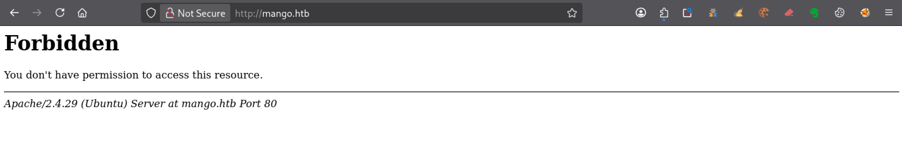
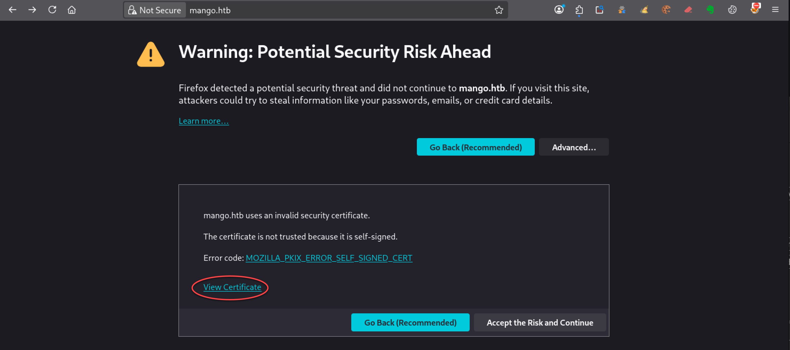
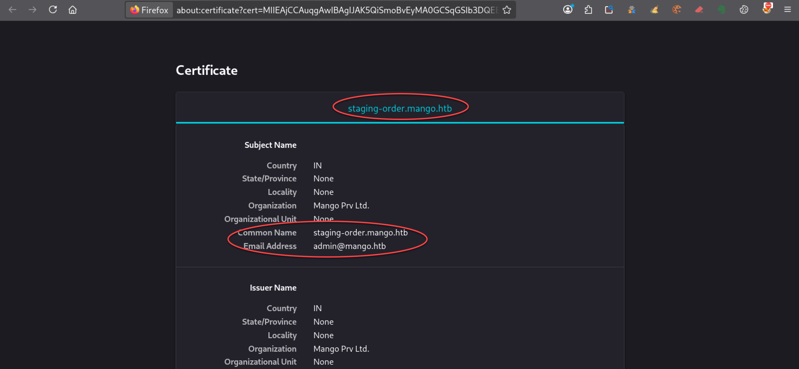
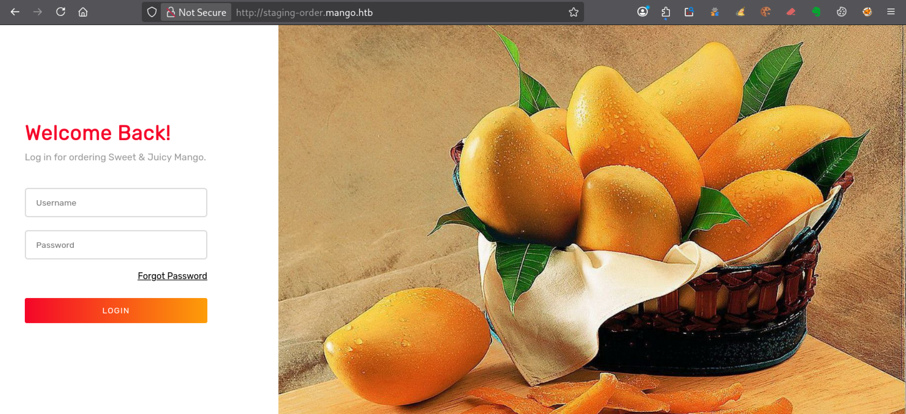
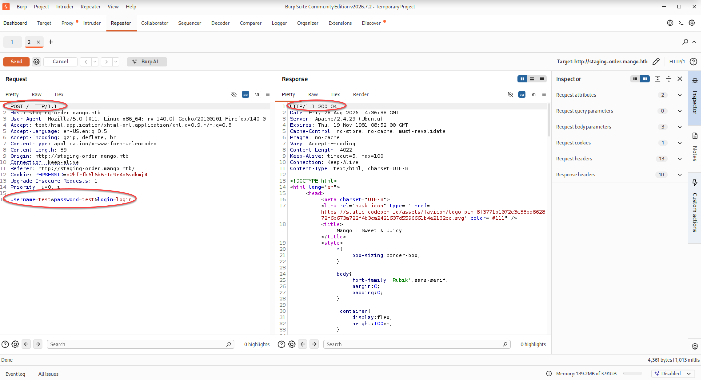
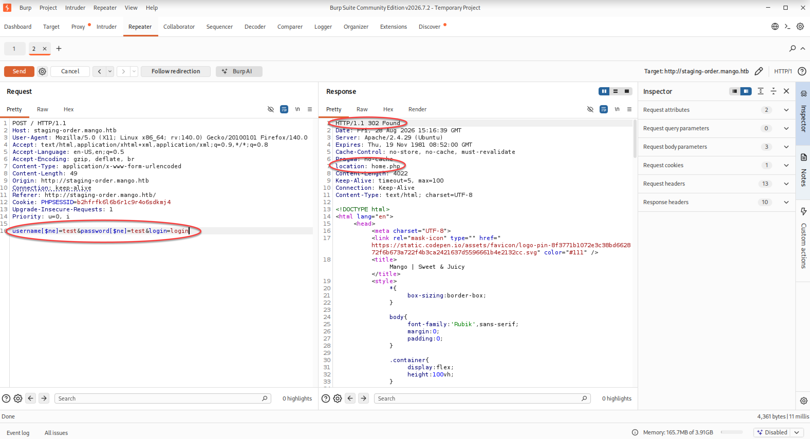
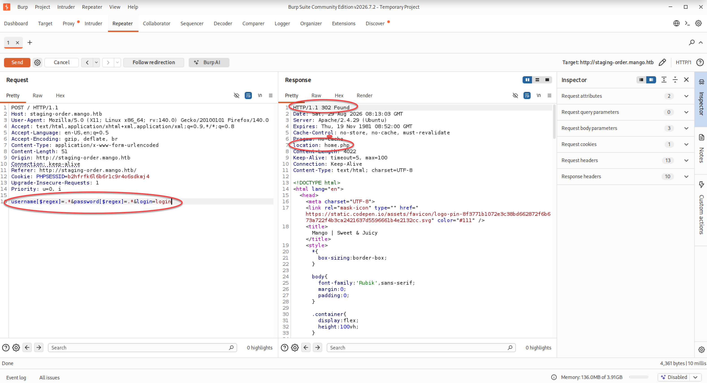

---
# === Archetype writeups – v1 (stable) ===
# === Archetype: writeups (Page Bundle) ===
# Copié vers content/writeups/<nom_ctf>/index.md

# H1 SEO (via title, pas dans le markdown)
title: "Mango — HTB Medium Writeup & Walkthrough"
linkTitle: "Mango"
slug: "mango"
date: 2026-08-11T16:19:44+02:00
#lastmod: 2026-08-11T16:19:44+02:00
draft: true

# --- PaperMod / navigation ---
type: "writeups"
summary: "Summary générique de machine CTF"
description: "Description générique de machine CTF"
tags: ["Hack The Box","HTB Medium","linux-privesc"]
categories: ["Mes writeups"]

# Ajouter ensuite uniquement des tags techniques réellement utilisés dans le writeup,
# par exemple :
# - prise de pied : "Web", "SSH", "FTP"
# - faille : "XSS", "LFI", "RCE", "Path Traversal", "Shellshock"
# - techno / produit : "Grafana", "Chamilo", "CMS Made Simple", "js2py"
# - CVE : "CVE-2021-43798"
# - pivot : "Credential Reuse"
# - privesc spécifique : "sudo", "Docker", "Cron", "ACL", "PATH Hijacking", "tmux", "npbackup", "pspy64"

# --- TOC & mise en page ---
ShowToc: true
TocOpen: true
# toc_droite: 1

# --- Cover / images (Page Bundle) ---
cover:
  image: "image.png"
  alt: "Mango"
  caption: ""
  relative: true
  hidden: false
  hiddenInList: false
  hiddenInSingle: false

# --- Paramètres CTF (placeholders à éditer après création) ---
ctf:
  platform: "Hack The Box"
  machine: "Mango"
  difficulty: "Medium"
  target_ip: "10.129.x.x"
  skills: ["Enumeration","Web","Privilege Escalation"]
  time_spent: "Plusieurs sessions"
  # vpn_ip: "10.10.14.xx"
  # notes: "Points d'attention…"

# --- Options diverses ---
# weight: 10
# ShowBreadCrumbs: true
# ShowPostNavLinks: true

# --- SEO Reminders (à compléter après création) ---
# 1) Titre :
#    - Doit contenir : Nom Machine + HTB Easy ou Medium + Writeup
# 2) Description :
#    - Résumé 130–160 caractères
#    - Style “Mix Parfait” : pédagogique + technique
#    - Exemple : "Writeup de <machine> (HTB Easy ou Medium) : énumération claire, analyse de la vulnérabilité et escalade structurée."
# 3) ALT (image de couverture) :
#    - Mixer vulnérabilité + pédagogie + progression
#    - Exemple : "Machine <machine> HTB Easy ou Medium vulnérable à <faille>, expliquée étape par étape jusqu'à l'escalade."
# 4) Tags :
#    - Toujours ["Easy ou Medium"]
#    - Ajouter d'autres selon le thème : ["web","shellshock","heartbleed","enum"]
# 5) Structure :
#    - H1 = titre
#    - Description = meta description + preview social
#    - ALT = SEO image + accessibilité

# --- SEO CHECKLIST (à valider avant publication) ---

# [ ] 1) Titre (title + H1)
#     - Contient : Nom Machine + HTB Easy ou Medium + Writeup
#     - Unique sur le site
#     - Lisible hors contexte HTB

# [ ] 2) Description (meta)
#     - 130–160 caractères
#     - Pas générique
#     - Ton pédagogique + technique
#     - Exemple :
#       "Writeup de <machine> (HTB Easy ou Medium) : énumération claire,
#        compréhension de la vulnérabilité et escalade structurée."

# [ ] 3) Image de couverture
#     - Présente (ou fallback)
#     - Nom explicite
#     - Dimensions cohérentes

# [ ] 4) ALT de l’image
#     - Décrit la machine + l’approche
#     - Pédagogique (pas juste technique)
#     - Exemple :
#       "Machine <machine> HTB Easy ou Medium exploitée étape par étape,
#        de l’énumération à l’escalade de privilèges."

# [ ] 5) Tags
#     - Toujours inclure la difficulté (ex: "Easy ou Medium")
#     - Ajouter uniquement des tags techniques réels

# [ ] 6) Structure du contenu
#     - Un seul H1
#     - Sections claires et hiérarchisées
#     - Pas de sections SEO artificielles

---

<!-- ====================================================================
Tableau d'infos (modèle) — Remplacer les valeurs entre <...> après création.
Aucun templating Hugo dans le corps, pour éviter les erreurs d'archetype.
====================================================================
| Champ          | Valeur |
|----------------|--------|
| **Plateforme** | <Hack The Box> |
| **Machine**    | <Mango> |
| **Difficulté** | <Easy / Medium / Hard> |
| **Cible**      | <10.129.x.x> |
| **Durée**      | <2h> |
| **Compétences**| <Enumeration, Web, Privilege Escalation> |

---
-->
## Introduction

- Contexte (source, thème, objectif).
- Hypothèses initiales (services attendus, techno probable).
- Objectifs : obtenir `user.txt` puis `root.txt`.

---

## Énumération



### Scan initial

Le scan TCP complet (`scans_nmap/mango/full_tcp_scan.txt`) montre les ports ouverts suivants :

```bash
# Nmap 7.99 scan initiated [date] as: /usr/lib/nmap/nmap --privileged -Pn -p- --min-rate 5000 -T4 -oN scans_nmap/mango/full_tcp_scan.txt mango.htb
Nmap scan report for mango.htb (10.129.x.x)
Host is up (0.0076s latency).
Not shown: 65532 closed tcp ports (reset)
PORT    STATE SERVICE
22/tcp  open  ssh
80/tcp  open  http
443/tcp open  https

# Nmap done at [date] -- 1 IP address (1 host up) scanned in 6.66 seconds
```

### Scan FTP/SMB

Après le scan initial, le script vérifie la présence éventuelle de services **FTP** ou **SMB** afin de lancer une énumération ciblée si nécessaire :

- **FTP** sur le port **21**
- **SMB** sur le port **139** et/ou **445**

Les résultats sont enregistrés dans (`scans_nmap/mango/enum_ftp_smb_scan.txt`) :

```bash
# mon-nmap — ENUM FTP / SMB
# Target : mango.htb
# Date   : [date]

Aucun service FTP (21) ni SMB (139/445) détecté.
Ports ouverts détectés : 22,80,443
```


### Scan agressif

Le script enchaîne ensuite automatiquement sur un scan agressif orienté vulnérabilités.

Ce scan fournit des informations détaillées sur les services et versions détectés.

Les résultats sont enregistrés dans (`scans_nmap/mango/aggressive_vuln_scan.txt`) :

```bash
[+] Scan agressif orienté vulnérabilités (CTF-perfect LEGACY) pour mango.htb
[+] Commande utilisée :
    nmap -Pn -A -sV -p"22,80,443" --script="(http-vuln-* or http-shellshock or ssl-heartbleed or ssl-cert) and not (http-vuln-cve2017-1001000 or http-sql-injection or sslv2 or ssl-dh-params)" --script-timeout=30s -T4 "mango.htb"

# Nmap 7.99 scan initiated [date] as: /usr/lib/nmap/nmap --privileged -Pn -A -sV -p22,80,443 "--script=(http-vuln-* or http-shellshock or ssl-heartbleed or ssl-cert) and not (http-vuln-cve2017-1001000 or http-sql-injection or sslv2 or ssl-dh-params)" --script-timeout=30s -T4 -oN scans_nmap/mango/aggressive_vuln_scan_raw.txt mango.htb
Nmap scan report for mango.htb (10.129.229.185)
Host is up (0.0078s latency).

PORT    STATE SERVICE  VERSION
22/tcp  open  ssh      OpenSSH 7.6p1 Ubuntu 4ubuntu0.3 (Ubuntu Linux; protocol 2.0)
80/tcp  open  http     Apache httpd 2.4.29
|_http-server-header: Apache/2.4.29 (Ubuntu)
443/tcp open  ssl/http Apache httpd 2.4.29
|_http-server-header: Apache/2.4.29 (Ubuntu)
| ssl-cert: Subject: commonName=staging-order.mango.htb/organizationName=Mango Prv Ltd./stateOrProvinceName=None/countryName=IN
| Issuer: commonName=staging-order.mango.htb/organizationName=Mango Prv Ltd./stateOrProvinceName=None/countryName=IN
| Public Key type: rsa
| Public Key bits: 2048
| Signature Algorithm: sha256WithRSAEncryption
| Not valid before: 2019-09-27T14:21:19
| Not valid after:  2020-09-26T14:21:19
| MD5:     b797 d14d 485f eac3 5cc6 2fed bb7a 2ce6
| SHA-1:   b329 9eca 2892 af1b 5895 053b f30e 861f 1c03 db95
|_SHA-256: 6500 52b6 7923 042d c2c9 fca7 1d44 3087 3615 850c e4d4 1e15 a4bd 7f5c fb57 aa58
Warning: OSScan results may be unreliable because we could not find at least 1 open and 1 closed port
Device type: general purpose
Running: Linux 3.X|4.X
OS CPE: cpe:/o:linux:linux_kernel:3 cpe:/o:linux:linux_kernel:4
OS details: Linux 3.2 - 4.14
Network Distance: 2 hops
Service Info: Host: 10.129.229.185; OS: Linux; CPE: cpe:/o:linux:linux_kernel

TRACEROUTE (using port 80/tcp)
HOP RTT     ADDRESS
1   7.15 ms 10.10.14.1
2   7.90 ms mango.htb (10.129.229.185)

OS and Service detection performed. Please report any incorrect results at https://nmap.org/submit/ .
# Nmap done at [date] -- 1 IP address (1 host up) scanned in 20.29 seconds

```


### Scan ciblé CMS

Le script exécute ensuite un scan ciblé CMS (`scans_nmap/mango/cms_vuln_scan.txt`).

```bash
# Nmap 7.99 scan initiated [date] as: /usr/lib/nmap/nmap --privileged -Pn -sV -p22,80,443 --script=http-wordpress-enum,http-wordpress-brute,http-wordpress-users,http-drupal-enum,http-drupal-enum-users,http-joomla-brute,http-generator,http-robots.txt,http-title,http-headers,http-methods,http-enum,http-devframework,http-cakephp-version,http-php-version,http-config-backup,http-backup-finder,http-sitemap-generator --script-timeout=30s -T4 -oN scans_nmap/mango/cms_vuln_scan.txt mango.htb
Nmap scan report for mango.htb (10.129.x.x)
Host is up (0.0069s latency).

PORT    STATE SERVICE  VERSION
22/tcp  open  ssh      OpenSSH 7.6p1 Ubuntu 4ubuntu0.3 (Ubuntu Linux; protocol 2.0)
80/tcp  open  http     Apache httpd 2.4.29
| http-headers: 
|   Date: Tue, 11 Aug 2026 14:34:45 GMT
|   Server: Apache/2.4.29 (Ubuntu)
|   Content-Length: 274
|   Connection: close
|   Content-Type: text/html; charset=iso-8859-1
|   
|_  (Request type: GET)
| http-sitemap-generator: 
|   Directory structure:
|   Longest directory structure:
|     Depth: 0
|     Dir: /
|   Total files found (by extension):
|_    
|_http-devframework: Couldn't determine the underlying framework or CMS. Try increasing 'httpspider.maxpagecount' value to spider more pages.
|_http-title: 403 Forbidden
| http-methods: 
|_  Supported Methods: GET POST OPTIONS HEAD
|_http-server-header: Apache/2.4.29 (Ubuntu)
443/tcp open  ssl/http Apache httpd 2.4.29
|_http-server-header: Apache/2.4.29 (Ubuntu)
| http-methods: 
|_  Supported Methods: GET HEAD POST OPTIONS
|_http-title: Mango | Search Base
|_http-devframework: Couldn't determine the underlying framework or CMS. Try increasing 'httpspider.maxpagecount' value to spider more pages.
| http-headers: 
|   Date: Tue, 11 Aug 2026 14:34:45 GMT
|   Server: Apache/2.4.29 (Ubuntu)
|   Connection: close
|   Content-Type: text/html; charset=UTF-8
|   
|_  (Request type: HEAD)
| http-sitemap-generator: 
|   Directory structure:
|     /
|       Other: 1; php: 1
|   Longest directory structure:
|     Depth: 0
|     Dir: /
|   Total files found (by extension):
|_    Other: 1; php: 1
Service Info: Host: 10.129.229.185; OS: Linux; CPE: cpe:/o:linux:linux_kernel

Service detection performed. Please report any incorrect results at https://nmap.org/submit/ .
# Nmap done at [date] -- 1 IP address (1 host up) scanned in 18.09 seconds

```


### Scan UDP rapide

Le script lance également un scan UDP rapide afin de détecter d’éventuels services supplémentaires (`scans_nmap/mango/udp_vuln_scan.txt`).

```bash
# Nmap 7.99 scan initiated [date] as: /usr/lib/nmap/nmap --privileged -n -Pn -sU --top-ports 20 -T4 -oN scans_nmap/mango/udp_vuln_scan.txt mango.htb
Warning: 10.129.x.x giving up on port because retransmission cap hit (6).
Nmap scan report for mango.htb (10.129.229.185)
Host is up (0.0073s latency).

PORT      STATE         SERVICE
53/udp    closed        domain
67/udp    closed        dhcps
68/udp    open|filtered dhcpc
69/udp    open|filtered tftp
123/udp   closed        ntp
135/udp   open|filtered msrpc
137/udp   closed        netbios-ns
138/udp   closed        netbios-dgm
139/udp   closed        netbios-ssn
161/udp   closed        snmp
162/udp   open|filtered snmptrap
445/udp   open|filtered microsoft-ds
500/udp   closed        isakmp
514/udp   closed        syslog
520/udp   open|filtered route
631/udp   closed        ipp
1434/udp  closed        ms-sql-m
1900/udp  closed        upnp
4500/udp  closed        nat-t-ike
49152/udp closed        unknown

# Nmap done at [date] -- 1 IP address (1 host up) scanned in 10.18 seconds

```


### Énumération des chemins web

La découverte des chemins web est réalisée avec le script dédié .

```bash
mon-recoweb mango.htb

# Résultats dans le répertoire scans_recoweb/
#  - scans_recoweb/mango/RESULTS_SUMMARY.txt     ← vue d’ensemble des découvertes
#  - scans_recoweb/mango/dirb.log
#  - scans_recoweb/mango/dirb_hits.txt
#  - scans_recoweb/mango/ffuf_dirs.txt
#  - scans_recoweb/mango/ffuf_dirs_hits.txt
#  - scans_recoweb/mango/ffuf_files.txt
#  - scans_recoweb/mango/ffuf_files_hits.txt
#  - scans_recoweb/mango/ffuf_dirs.json
#  - scans_recoweb/mango/ffuf_files.json

```

Le fichier `RESULTS_SUMMARY.txt` regroupe les chemins découverts, ce qui évite de devoir parcourir l’ensemble des logs générés.

```bash
===== mon-recoweb — RÉSUMÉ DES RÉSULTATS =====
Commande principale : /home/kali/.local/bin/mes-scripts/mon-recoweb
Script              : mon-recoweb v2.2.3

Cible        : mango.htb
Périmètre    : /
Date début   : [date]

Commandes exécutées (exactes) :

[dirb — découverte initiale]
dirb http://mango.htb/ /usr/share/wordlists/dirb/common.txt -r | tee scans_recoweb/mango.htb/dirb.log

[ffuf — énumération des répertoires]
ffuf -u http://mango.htb/FUZZ -w /usr/share/seclists/Discovery/Web-Content/raft-medium-directories.txt -t 30 -timeout 10 -fc 404 -of json -o scans_recoweb/mango.htb/ffuf_dirs.json 2>&1 | tee scans_recoweb/mango.htb/ffuf_dirs.log

[ffuf — énumération des fichiers]
ffuf -u http://mango.htb/FUZZ -w /usr/share/seclists/Discovery/Web-Content/raft-medium-files.txt -t 30 -timeout 10 -fc 404 -of json -o scans_recoweb/mango.htb/ffuf_files.json 2>&1 | tee scans_recoweb/mango.htb/ffuf_files.log

Processus de génération des résultats :
- Les sorties JSON produites par ffuf constituent la source de vérité.
- Les entrées pertinentes sont extraites via jq (URL, code HTTP, taille de réponse).
- Les réponses assimilables à des soft-404 sont filtrées par comparaison des tailles et des codes HTTP.
- Les URLs finales sont reconstruites à partir du périmètre scanné (racine du site ou sous-répertoire ciblé).
- Les résultats sont normalisés sous la forme :
    http://cible/chemin (CODE:xxx|SIZE:yyy)
- Les chemins sont ensuite classés par type :
    • répertoires (/chemin/)
    • fichiers (/chemin.ext)
- Le fichier RESULTS_SUMMARY.txt est généré par agrégation finale, sans retraitement manuel,
  garantissant la reproductibilité complète du scan.

----------------------------------------------------

=== Résultat global (agrégé) ===

http://mango.htb/. (CODE:403|SIZE:274)
http://mango.htb/.htaccess.bak (CODE:403|SIZE:274)
http://mango.htb/.htaccess (CODE:403|SIZE:274)
http://mango.htb/.htc (CODE:403|SIZE:274)
http://mango.htb/.ht (CODE:403|SIZE:274)
http://mango.htb/.htgroup (CODE:403|SIZE:274)
http://mango.htb/.htm (CODE:403|SIZE:274)
http://mango.htb/.html (CODE:403|SIZE:274)
http://mango.htb/.htpasswd (CODE:403|SIZE:274)
http://mango.htb/.htpasswds (CODE:403|SIZE:274)
http://mango.htb/.htuser (CODE:403|SIZE:274)
http://mango.htb/.php (CODE:403|SIZE:274)
http://mango.htb/server-status (CODE:403|SIZE:274)
http://mango.htb/server-status/ (CODE:403|SIZE:274)
http://mango.htb/wp-forum.phps (CODE:403|SIZE:274)

=== Détails par outil ===

[DIRB]
http://mango.htb/server-status (CODE:403|SIZE:274)

[FFUF — DIRECTORIES]
http://mango.htb/server-status/ (CODE:403|SIZE:274)

[FFUF — FILES]
http://mango.htb/. (CODE:403|SIZE:274)
http://mango.htb/.htaccess.bak (CODE:403|SIZE:274)
http://mango.htb/.htaccess (CODE:403|SIZE:274)
http://mango.htb/.htc (CODE:403|SIZE:274)
http://mango.htb/.ht (CODE:403|SIZE:274)
http://mango.htb/.htgroup (CODE:403|SIZE:274)
http://mango.htb/.htm (CODE:403|SIZE:274)
http://mango.htb/.html (CODE:403|SIZE:274)
http://mango.htb/.htpasswd (CODE:403|SIZE:274)
http://mango.htb/.htpasswds (CODE:403|SIZE:274)
http://mango.htb/.htuser (CODE:403|SIZE:274)
http://mango.htb/.php (CODE:403|SIZE:274)
http://mango.htb/wp-forum.phps (CODE:403|SIZE:274)
```


### Recherche de vhosts

Enfin, la présence éventuelle de vhosts est vérifiée à l’aide du script .

```bash
=== mon-subdomains mango.htb START ===
Script       : mon-subdomains
Version      : mon-subdomains 2.0.1
Date         : [date]
Domaine      : mango.htb
IP           : 10.129.x.x
Mode         : large
Master       : /usr/share/wordlists/htb-dns-vh-5000.txt
Codes        : 200,301,302,401,403  (strict=1)

VHOST totaux : 0
  - (aucun)

--- Détails par port ---
Port 80 (http)
  Baseline#1: code=403 size=285 words=28 (Host=xhd6cuu5su.mango.htb)
  Baseline#2: code=403 size=285 words=28 (Host=ey54p6ea13.mango.htb)
  Baseline#3: code=403 size=285 words=28 (Host=axp9ov4x8a.mango.htb)
  VHOST (0)
    - (fuzzing sauté : wildcard probable)
    - (explication : réponse identique quel que soit Host → vhost-fuzzing non discriminant)

Port 443 (https)
  Baseline#1: code=200 size=5152 words=514 (Host=fil38p7c7r.mango.htb)
  Baseline#2: code=200 size=5152 words=514 (Host=hr6xat8fzp.mango.htb)
  Baseline#3: code=200 size=5152 words=514 (Host=lgaqrdxz03.mango.htb)
  VHOST (0)
    - (fuzzing sauté : wildcard probable)
    - (explication : réponse identique quel que soit Host → vhost-fuzzing non discriminant)


=== mon-subdomains mango.htb END ===
```

Si aucun vhost distinct n’est identifié, ce fichier confirme l’absence de résultats supplémentaires.

## Prise pied

L’énumération a révélé peu de services accessibles : SSH sur le port `22` et deux services web sur les ports `80` et `443`. Avec peu d’autres pistes immédiates à explorer, tu peux commencer par examiner le comportement de ces services web dans le navigateur.

### Analyse des services web

#### Navigation en HTTP sur le port 80

En ouvrant `http://mango.htb` dans le navigateur, le serveur Apache répond avec une page `403 Forbidden`.



Le service web est donc bien accessible sur le port `80`, mais le contenu demandé n’est pas disponible avec cette URL. Cette réponse indique qu’Apache traite bien la requête, même si l’accès au contenu est refusé.

#### Navigation en HTTPS sur le port 443

Tu examines ensuite le service HTTPS en ouvrant `https://mango.htb`.

Cette fois, Firefox interrompt la navigation et affiche un avertissement de sécurité indiquant que le certificat présenté par le serveur n’est pas considéré comme fiable.



#### Analyse de l’avertissement du certificat TLS

En cliquant sur `Advanced...`, Firefox affiche davantage d’informations sur l’erreur et précise que le certificat utilisé par `mango.htb` est auto-signé.

La page propose alors notamment l’option `View Certificate`.

Plutôt que de poursuivre immédiatement vers le site avec `Accept the Risk and Continue`, tu peux cliquer sur `View Certificate` afin d’examiner les informations contenues dans le certificat TLS.

#### Inspection du certificat dans le navigateur

Firefox ouvre alors le certificat dans un nouvel onglet.



Dans la section `Subject Name`, le champ `Common Name` contient :

```
staging-order.mango.htb
```

Une adresse e-mail apparaît également :

```
admin@mango.htb
```

#### Identification d’un autre nom d’hôte

Le certificat révèle donc le nom d’hôte suivant :

```text
staging-order.mango.htb
```

Cette information n’est pas totalement nouvelle : elle avait déjà été relevée lors du scan Nmap agressif effectué pendant l’énumération.

Le certificat permet toutefois de confirmer visuellement que ce nom d’hôte est bien associé au serveur web de la cible.

La présence de `staging-order.mango.htb` constitue alors une nouvelle piste à tester.

#### Ajout du nouvel hôte dans `/etc/hosts`

Pour pouvoir résoudre ce nouveau nom d’hôte vers l’adresse IP de la machine cible, tu l’ajoutes dans `/etc/hosts` :

```bash
sudo nano /etc/hosts
```

et complètes la ligne associée à la cible avec :

```text
10.129.x.x mango.htb staging-order.mango.htb
```

Tu peux ensuite tester directement l’accès à ce nouvel hôte dans le navigateur.

### Analyse de l’application web découverte

Une fois `staging-order.mango.htb` ajouté dans `/etc/hosts`, tu peux ouvrir directement l’adresse suivante dans le navigateur :

```text
http://staging-order.mango.htb/
```

Le serveur présente cette fois une véritable application web, avec une page d’authentification demandant un nom d’utilisateur et un mot de passe.



#### Observation de la page de connexion

Tu peux commencer par effectuer quelques tentatives de connexion directement depuis le navigateur avec des identifiants quelconques, par exemple :

```text
test:test
```

puis :

```text
admin:test
```

Dans les deux cas, aucun message d’erreur particulier n’est affiché et tu es simplement renvoyé vers la page de connexion.

Le comportement de l’application ne permet donc pas de distinguer, à ce stade, un nom d’utilisateur valide d’un nom d’utilisateur inexistant.

Pour comprendre plus précisément la manière dont le formulaire communique avec le serveur, tu peux maintenant examiner la requête d’authentification avec Burp Suite.

#### Analyse de la requête d’authentification avec Burp Suite

Pour examiner précisément les données envoyées par le formulaire de connexion, tu peux intercepter une tentative d’authentification avec Burp Suite.

La configuration de Burp Suite Community Edition avec FoxyProxy est décrite dans la recette suivante :



Une fois Burp Suite lancé et FoxyProxy activé dans Firefox, vérifie que l’interception est active dans `Proxy > Intercept`, puis retourne sur :

```url
http://staging-order.mango.htb/
```

et effectue une nouvelle tentative de connexion avec les identifiants :

```
test:test
```

La requête peut ensuite être envoyée dans **Repeater** afin de l’examiner et de la rejouer facilement.

Burp montre que le formulaire envoie une requête `POST` vers `/` :

```
POST / HTTP/1.1
Host: staging-order.mango.htb
Content-Type: application/x-www-form-urlencoded
```

Les valeurs saisies dans le formulaire sont transmises dans le corps de la requête :

```
username=test&password=test&login=login
```




La réponse `200 OK` confirme le comportement déjà observé directement dans le navigateur : après une tentative d’authentification invalide, l’application renvoie simplement la page de connexion, sans fournir de message d’erreur particulier.

La requête étant maintenant reproductible dans Repeater, tu peux commencer à modifier les valeurs de `username` et `password` afin d’observer le comportement de l’application.

Face à un formulaire d’authentification, une démarche classique consiste à tester si les paramètres transmis au serveur sont vulnérables à une injection. C’est donc la première piste que tu peux explorer ici.

### Recherche de vulnérabilités dans le formulaire d’authentification

Classiquement, face à un formulaire d’authentification, tu peux commencer par tester une injection SQL dans les paramètres `username` et `password` depuis Burp Suite Repeater.

#### Tests SQLi

L’objectif est de comparer les réponses obtenues avec une condition vraie et une condition fausse afin de repérer une éventuelle différence de comportement.

Commence par une condition vraie :

```text
username=' OR '1'='1' -- -&password=test&login=login
```

puis par une condition volontairement fausse :

```text
username=' OR '1'='2' -- -&password=test&login=login
```

La séquence :

```
-- -
```

permet de transformer la suite de la requête en commentaire SQL. La vérification du mot de passe peut ainsi ne plus être prise en compte.

Avec la tentative initiale `test:test`, la réponse était un `200 OK` et **Render** affiche simplement de nouveau la page de connexion.

En envoyant successivement les deux injections SQL précédentes, le résultat reste identique : le serveur répond toujours avec un `200 OK` et la page de connexion est à nouveau affichée.

Les conditions vraie et fausse ne produisent donc aucune différence observable.

Cela ne prouve pas l’absence de toute injection, mais rend la piste d’une SQLi classique moins probable.

Lorsque les tests SQL classiques ne donnent aucun résultat, une démarche logique consiste à poursuivre l’analyse en envisageant d’autres types de bases de données et d’autres mécanismes de traitement des paramètres.

Les bases NoSQL, notamment MongoDB, utilisent des opérateurs et une syntaxe différents de ceux des bases relationnelles. Un formulaire d’authentification qui ne réagit pas à une SQLi classique peut donc se comporter différemment lorsqu’il reçoit des opérateurs NoSQL.

Tu peux alors tester si les paramètres `username` et `password` acceptent ce type de syntaxe.

#### Tests NoSQLi

Une injection NoSQL consiste à modifier les paramètres envoyés à l’application afin qu’ils soient interprétés non plus comme de simples valeurs, mais comme des conditions utilisées par la base de données. 

Contrairement à une injection SQL classique, on ne cherche donc pas forcément à insérer une portion de requête complète. 

On peut essayer d’utiliser des **opérateurs** qui modifient la condition de recherche. 

Parmi eux, `$ne` signifie « not equal », c’est-à-dire « différent de ».

#### Test de l’opérateur `$ne`

L’idée est de remplacer une valeur simple par une condition. Par exemple, au lieu d’envoyer :

```text
username=test&password=test&login=login
```

tu peux essayer :

```
username[$ne]=test&password[$ne]=test&login=login
```

Cette syntaxe demande en substance à l’application de rechercher une entrée dont le nom d’utilisateur n’est pas `test` et dont le mot de passe n’est pas `test`.

Si l’application interprète directement ces paramètres comme des opérateurs NoSQL, la condition devrait correspondre à un compte existant.

Il faut alors observer si la réponse du serveur diffère de celles obtenues avec les tentatives précédentes.



Le comportement change cette fois nettement : la réponse du serveur n’est plus un `200 OK`, mais un :

```http
HTTP/1.1 302 Found
Location: home.php
```

Cette redirection vers `home.php` indique que l’application considère la condition comme valide et poursuit le processus d’authentification.

Le contraste avec les tentatives précédentes est important : les identifiants incorrects et les tests d’injection SQL renvoyaient systématiquement la page de connexion avec un `200 OK`, alors que l’utilisation de `$ne` provoque ici une redirection `302`.

Ce changement de comportement constitue un indice fort que les paramètres du formulaire sont interprétés comme des opérateurs NoSQL.

#### Confirmation avec l’opérateur `$regex`

Pour confirmer que l’application interprète bien les paramètres comme des opérateurs NoSQL, tu peux effectuer un second test avec `$regex`.

L’opérateur `$regex` permet de vérifier si une valeur correspond à une expression régulière.

Par exemple :

```text
username[$regex]=.*&password[$regex]=.*&login=login
```

L’expression :

```
.*
```

signifie « n’importe quelle suite de caractères ».

Si l’application interprète ces paramètres comme des opérateurs NoSQL, cette condition devrait correspondre à un nom d’utilisateur et à un mot de passe existants.



Le serveur répond à nouveau avec :

```
HTTP/1.1 302 Found
Location: home.php
```

On retrouve donc exactement le même changement de comportement qu’avec `$ne`.

L’obtention d’une redirection `302` avec deux opérateurs différents confirme que le formulaire d’authentification est vulnérable à une injection NoSQL.

À partir de maintenant, la réponse `200 OK` peut être considérée comme un échec d’authentification, tandis qu’une réponse `302 Found` avec une redirection vers `home.php` indique qu’une condition injectée a été acceptée par l’application.

### Extraction des identifiants par injection NoSQL

La vulnérabilité étant confirmée, l’objectif n’est plus seulement de contourner l’authentification, mais d’exploiter les différences de réponse pour retrouver progressivement des informations valides.

L’opérateur `$regex` est particulièrement intéressant pour cela, car il permet de tester si une valeur commence par un caractère donné, puis d’affiner progressivement la recherche.

La réponse du serveur servira alors d’indicateur :

- `200 OK` : la condition testée ne correspond pas ;
- `302 Found` : la condition correspond à une valeur valide.

#### Stratégie

L’opérateur `$regex` peut maintenant être utilisé pour tester progressivement le contenu du paramètre `username`.

Commence par vérifier si un nom d’utilisateur commence par la lettre `a` :

```text
username[$regex]=^a&password[$regex]=.*&login=login
```

Le caractère `^` indique le début de la chaîne. L’expression `^a` signifie donc « commence par `a` ».

Avec ce test, le serveur répond par une redirection :

```
HTTP/1.1 302 Found
Location: home.php
```

Cela indique qu’au moins un nom d’utilisateur commence par la lettre `a`.

Tu peux maintenant effectuer exactement le même test avec la lettre `b` :

```
username[$regex]=^b&password[$regex]=.*&login=login
```

Cette fois, le serveur répond avec un `200 OK` et renvoie la page de connexion.

La différence est donc exploitable :

- `^a` → `302 Found` : au moins un utilisateur commence par `a` ;
- `^b` → `200 OK` : aucun utilisateur ne commence par `b`.

À partir de ce principe, tu peux tester successivement toutes les lettres afin d’identifier les premières lettres des différents noms d’utilisateur présents dans l’application.

Une fois une première lettre trouvée, il suffit de poursuivre caractère par caractère. Par exemple, si `^a` fonctionne, tu peux ensuite tester `^aa`, `^ab`, `^ac`, etc., jusqu’à identifier la deuxième lettre correcte, puis recommencer pour les caractères suivants.

Cette méthode permet ainsi de reconstituer progressivement tous les noms d’utilisateur existants.

Une fois un nom d’utilisateur complet identifié, tu peux appliquer exactement le même principe au paramètre `password`.

Par exemple, pour tester si le mot de passe de l’utilisateur `admin` commence par la lettre `a` :

```
username=admin&password[$regex]=^a&login=login
```

Si la réponse est un `302 Found`, le premier caractère du mot de passe est correct. Sinon, tu continues avec `^b`, `^c`, etc.

Dès qu’un caractère est trouvé, tu conserves le préfixe valide et tu recherches le caractère suivant. Par exemple, si `^a` fonctionne, tu peux tester :

```
username=admin&password[$regex]=^aa&login=login
```

puis :

```
username=admin&password[$regex]=^ab&login=login
```

et ainsi de suite jusqu’à reconstituer le mot de passe complet.

La stratégie est donc la même pour les deux types d’informations :

1. identifier les noms d’utilisateur ;
2. pour chaque utilisateur trouvé, extraire son mot de passe caractère par caractère ;
3. répéter l’opération jusqu’à obtenir l’ensemble des identifiants présents dans l’application.

Cette méthode fonctionne manuellement, mais devient rapidement fastidieuse. Il est donc logique de l’automatiser avec un script.

#### Script

#### Résultats

### Connexion SSH

#### Validation des identifiants récupérés

#### Premier accès à la machine

### Passage vers un second compte utilisateur

#### Recherche de `user.txt`

#### Analyse des permissions de `/home/admin`

#### Réutilisation des identifiants récupérés

#### Accès au compte `admin`

#### Lecture de `user.txt`

---

## Escalade de privilèges




### Observation passive avec pspy64

```bash
./pspy64
```

Si système 32 bits :

```bash
./pspy32
```

### Vérification sudo

```bash
sudo -l
```

### Exploration du contexte utilisateur

```bash
whoami
id
pwd
uname -a
hostname
find /home /opt -type f -readable 2>/dev/null
```

### Capabilities

```bash
getcap -r / 2>/dev/null
```
Les capabilities permettent d’accorder à un programme certains privilèges normalement réservés à root, sans lui attribuer l’ensemble de ses droits.

### SUID

```bash
python3 suid3num.py
```

Alternative :

```bash
find / -perm -4000 -type f 2>/dev/null
```

Un binaire SUID s’exécute avec les privilèges de son propriétaire plutôt qu’avec ceux de l’utilisateur qui le lance.

### Services locaux

```bash
ss -tulnp
```

Alternative :

```bash
netstat -tulnp
```

Cette commande affiche les sockets TCP et UDP en écoute ainsi que leurs adresses et leurs ports. Elle permettra notamment de repérer les services accessibles uniquement depuis la machine locale.

### Recherche d’un service derrière un port local

Exemple avec le port `8080` :

```bash
grep -r ':8080' /etc 2>/dev/null
```

Recherche élargie :

```bash
grep -r '8080' /etc 2>/dev/null
```

### Tunnel SSH vers un service local

Exemple avec un service local sur `127.0.0.1:8080` :

```bash
ssh -L 8080:127.0.0.1:8080 user@target
```

Accès depuis Kali :

```text
http://localhost:8080
```

### Linpeas

```bash
./linpeas.sh
```

### Dernier recours : le kernel

```bash
uname -a
./les.sh
```

### Conclusion de l’énumération privilege escalation

À la fin de cette phase, tu peux résumer les pistes testées :

* sudo
* contexte utilisateur
* fichiers lisibles
* capabilities
* SUID
* cron et timers
* services locaux
* LinPEAS
* kernel

Dans ce cas précis, la piste exploitable est :

```text
<résumer ici la piste réellement exploitée>
```

### Exploitation de la piste identifiée

Tu exploites ensuite la mauvaise configuration identifiée pendant l’énumération.

```bash
<commandes d’exploitation>
```

Tu confirmes l’élévation de privilèges :

```bash
whoami
id
hostname
```

Résultat attendu :

```text
root
uid=0(root) gid=0(root) groups=0(root)
machine
```

### root.txt

Une fois root, tu peux lire le flag final :

```bash
cat /root/root.txt
```

Cette étape termine l’escalade de privilèges.

## Conclusion

- Récapitulatif de la chaîne d'attaque (du scan à root).
- Vulnérabilités exploitées & combinaisons.
- Conseils de mitigation et détection.
- Points d'apprentissage personnels.

---

## Pièces jointes (optionnel)

- Scripts, one-liners, captures, notes.  
- Arbo conseillée : `files/<nom_ctf>/…`

