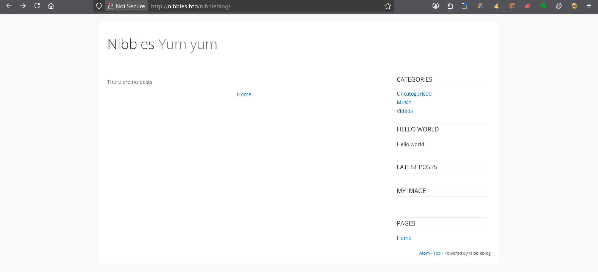
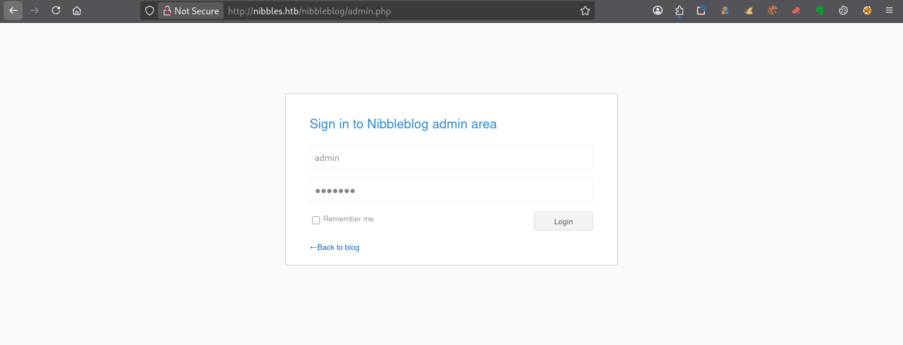
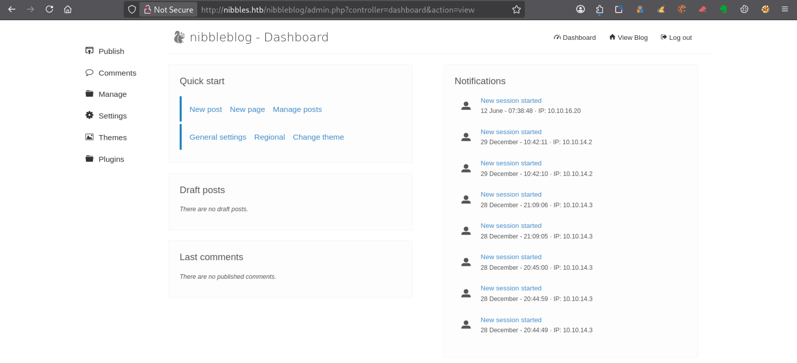

---
# === Archetype writeups – v1 (stable) ===
# === Archetype: writeups (Page Bundle) ===
# Copié vers content/writeups/<nom_ctf>/index.md

# H1 SEO (via title, pas dans le markdown)
title: "Nibbles — HTB Easy Writeup & Walkthrough"
linkTitle: "Nibbles"
slug: "nibbles"
date: 2026-06-11T09:48:42+02:00
#lastmod: 2026-06-11T09:48:42+02:00
draft: true

# --- PaperMod / navigation ---
type: "writeups"
summary: "Summary générique de machine CTF"
description: "Description générique de machine CTF"
tags: ["Hack The Box","HTB Easy","linux-privesc"]
categories: ["Mes writeups"]

# Ajouter ensuite uniquement des tags techniques réellement utilisés dans le writeup,
# par exemple :
# - prise de pied : "Web", "SSH", "FTP"
# - faille : "XSS", "LFI", "RCE", "Path Traversal", "Shellshock"
# - techno / produit : "Grafana", "Chamilo", "CMS Made Simple", "js2py"
# - CVE : "CVE-2021-43798"
# - pivot : "Credential Reuse"
# - privesc spécifique : "sudo", "Docker", "Cron", "ACL", "PATH Hijacking", "tmux", "npbackup", "pspy64"

# --- TOC & mise en page ---
ShowToc: true
TocOpen: true
# toc_droite: 1

# --- Cover / images (Page Bundle) ---
cover:
  image: "image.png"
  alt: "Nibbles"
  caption: ""
  relative: true
  hidden: false
  hiddenInList: false
  hiddenInSingle: false

# --- Paramètres CTF (placeholders à éditer après création) ---
ctf:
  platform: "Hack The Box"
  machine: "Nibbles"
  difficulty: "Easy"
  target_ip: "10.129.x.x"
  skills: ["Enumeration","Web","Privilege Escalation"]
  time_spent: "2h"
  # vpn_ip: "10.10.14.xx"
  # notes: "Points d'attention…"

# --- Options diverses ---
# weight: 10
# ShowBreadCrumbs: true
# ShowPostNavLinks: true

# --- SEO Reminders (à compléter après création) ---
# 1) Titre :
#    - Doit contenir : Nom Machine + HTB Easy + Writeup
# 2) Description :
#    - Résumé 130–160 caractères
#    - Style “Mix Parfait” : pédagogique + technique
#    - Exemple : "Writeup de <machine> (HTB Easy) : énumération claire, analyse de la vulnérabilité et escalade structurée."
# 3) ALT (image de couverture) :
#    - Mixer vulnérabilité + pédagogie + progression
#    - Exemple : "Machine <machine> HTB Easy vulnérable à <faille>, expliquée étape par étape jusqu'à l'escalade."
# 4) Tags :
#    - Toujours ["Easy"]
#    - Ajouter d'autres selon le thème : ["web","shellshock","heartbleed","enum"]
# 5) Structure :
#    - H1 = titre
#    - Description = meta description + preview social
#    - ALT = SEO image + accessibilité

# --- SEO CHECKLIST (à valider avant publication) ---

# [ ] 1) Titre (title + H1)
#     - Contient : Nom Machine + HTB Easy + Writeup
#     - Unique sur le site
#     - Lisible hors contexte HTB

# [ ] 2) Description (meta)
#     - 130–160 caractères
#     - Pas générique
#     - Ton pédagogique + technique
#     - Exemple :
#       "Writeup de <machine> (HTB Easy) : énumération claire,
#        compréhension de la vulnérabilité et escalade structurée."

# [ ] 3) Image de couverture
#     - Présente (ou fallback)
#     - Nom explicite
#     - Dimensions cohérentes

# [ ] 4) ALT de l’image
#     - Décrit la machine + l’approche
#     - Pédagogique (pas juste technique)
#     - Exemple :
#       "Machine <machine> HTB Easy exploitée étape par étape,
#        de l’énumération à l’escalade de privilèges."

# [ ] 5) Tags
#     - Toujours inclure la difficulté (ex: "Easy")
#     - Ajouter uniquement des tags techniques réels

# [ ] 6) Structure du contenu
#     - Un seul H1
#     - Sections claires et hiérarchisées
#     - Pas de sections SEO artificielles

---

<!-- ====================================================================
Tableau d'infos (modèle) — Remplacer les valeurs entre <...> après création.
Aucun templating Hugo dans le corps, pour éviter les erreurs d'archetype.
====================================================================
| Champ          | Valeur |
|----------------|--------|
| **Plateforme** | <Hack The Box> |
| **Machine**    | <Nibbles> |
| **Difficulté** | <Easy / Medium / Hard> |
| **Cible**      | <10.129.x.x> |
| **Durée**      | <2h> |
| **Compétences**| <Enumeration, Web, Privilege Escalation> |

---
-->
## Introduction

- Contexte (source, thème, objectif).
- Hypothèses initiales (services attendus, techno probable).
- Objectifs : obtenir `user.txt` puis `root.txt`.

---

## Énumération



### Scan initial

Le scan TCP complet (`scans_nmap/full_tcp_scan.txt`) montre les ports ouverts suivants :

```bash
# Nmap 7.99 scan initiated [date] as: /usr/lib/nmap/nmap --privileged -Pn -p- --min-rate 5000 -T4 -oN scans_nmap/nibbles/full_tcp_scan.txt nibbles.htb
Nmap scan report for nibbles.htb (10.129.x.x)
Host is up (0.028s latency).
Not shown: 65533 closed tcp ports (reset)
PORT   STATE SERVICE
22/tcp open  ssh
80/tcp open  http

# Nmap done at [date] -- 1 IP address (1 host up) scanned in 6.86 seconds
```

### Scan FTP/SMB (si services détectés)

Après le scan initial, le script enchaîne automatiquement avec une phase d’énumération ciblée **FTP/SMB** si l’un des services suivants est détecté :

- **FTP** sur le port **21**
- **SMB** sur le port **139** et/ou **445**

Les résultats sont enregistrés dans (`scans_nmap/enum_ftp_smb_scan.txt`) :

```bash
# mon-nmap — ENUM FTP / SMB
# Target : nibbles.htb
# Date   :[date]

Aucun service FTP (21) ni SMB (139/445) détecté.
Ports ouverts détectés : 22,80

```


### Scan agressif

Le script enchaîne ensuite automatiquement sur un scan agressif orienté vulnérabilités.

Ce scan fournit des informations détaillées sur les services et versions détectés.

Les résultats sont enregistrés dans (`scans_nmap/aggressive_vuln_scan.txt`) :

```bash
[+] Scan agressif orienté vulnérabilités (CTF-perfect LEGACY) pour nibbles.htb
[+] Commande utilisée :
    nmap -Pn -A -sV -p"22,80" --script="(http-vuln-* or http-shellshock or ssl-heartbleed or ssl-cert) and not (http-vuln-cve2017-1001000 or http-sql-injection or sslv2 or ssl-dh-params)" --script-timeout=30s -T4 "nibbles.htb"

# Nmap 7.99 scan initiated [date] as: /usr/lib/nmap/nmap --privileged -Pn -A -sV -p22,80 "--script=(http-vuln-* or http-shellshock or ssl-heartbleed or ssl-cert) and not (http-vuln-cve2017-1001000 or http-sql-injection or sslv2 or ssl-dh-params)" --script-timeout=30s -T4 -oN scans_nmap/nibbles/aggressive_vuln_scan_raw.txt nibbles.htb
Nmap scan report for nibbles.htb (10.129.x.x)
Host is up (0.013s latency).

PORT   STATE SERVICE VERSION
22/tcp open  ssh     OpenSSH 7.2p2 Ubuntu 4ubuntu2.2 (Ubuntu Linux; protocol 2.0)
80/tcp open  http    Apache httpd 2.4.18 ((Ubuntu))
|_http-server-header: Apache/2.4.18 (Ubuntu)
Warning: OSScan results may be unreliable because we could not find at least 1 open and 1 closed port
Device type: general purpose
Running: Linux 3.X|4.X
OS CPE: cpe:/o:linux:linux_kernel:3 cpe:/o:linux:linux_kernel:4
OS details: Linux 3.2 - 4.14
Network Distance: 2 hops
Service Info: OS: Linux; CPE: cpe:/o:linux:linux_kernel

TRACEROUTE (using port 22/tcp)
HOP RTT      ADDRESS
1   13.44 ms 10.10.x.1
2   7.41 ms  nibbles.htb (10.129.x.x)

OS and Service detection performed. Please report any incorrect results at https://nmap.org/submit/ .
# Nmap done at [date] -- 1 IP address (1 host up) scanned in 15.04 seconds

```


### Scan ciblé CMS

Le script exécute ensuite un scan ciblé CMS (scans_nmap/cms_vuln_scan.txt).

```bash
# Nmap 7.99 scan initiated [date] as: /usr/lib/nmap/nmap --privileged -Pn -sV -p22,80 --script=http-wordpress-enum,http-wordpress-brute,http-wordpress-users,http-drupal-enum,http-drupal-enum-users,http-joomla-brute,http-generator,http-robots.txt,http-title,http-headers,http-methods,http-enum,http-devframework,http-cakephp-version,http-php-version,http-config-backup,http-backup-finder,http-sitemap-generator --script-timeout=30s -T4 -oN scans_nmap/nibbles/cms_vuln_scan.txt nibbles.htb
Nmap scan report for nibbles.htb (10.129.x.x)
Host is up (0.013s latency).

PORT   STATE SERVICE VERSION
22/tcp open  ssh     OpenSSH 7.2p2 Ubuntu 4ubuntu2.2 (Ubuntu Linux; protocol 2.0)
80/tcp open  http    Apache httpd 2.4.18 ((Ubuntu))
|_http-devframework: Couldn't determine the underlying framework or CMS. Try increasing 'httpspider.maxpagecount' value to spider more pages.
| http-sitemap-generator: 
|   Directory structure:
|     /
|       Other: 1
|   Longest directory structure:
|     Depth: 0
|     Dir: /
|   Total files found (by extension):
|_    Other: 1
| http-methods: 
|_  Supported Methods: POST OPTIONS GET HEAD
|_http-server-header: Apache/2.4.18 (Ubuntu)
| http-headers: 
|   Date: Thu, 11 Jun 2026 07:59:54 GMT
|   Server: Apache/2.4.18 (Ubuntu)
|   Last-Modified: Thu, 28 Dec 2017 20:19:50 GMT
|   ETag: "5d-5616c3cf7fa77"
|   Accept-Ranges: bytes
|   Content-Length: 93
|   Vary: Accept-Encoding
|   Connection: close
|   Content-Type: text/html
|   
|_  (Request type: HEAD)
|_http-title: Site doesn't have a title (text/html).
Service Info: OS: Linux; CPE: cpe:/o:linux:linux_kernel

Service detection performed. Please report any incorrect results at https://nmap.org/submit/ .
# Nmap done at [date] -- 1 IP address (1 host up) scanned in 17.78 seconds

```


### Scan UDP rapide

Le script lance également un scan UDP rapide afin de détecter d’éventuels services supplémentaires (`scans_nmap/udp_vuln_scan.txt`).

```bash
# Nmap 7.99 scan initiated [date] as: /usr/lib/nmap/nmap --privileged -n -Pn -sU --top-ports 20 -T4 -oN scans_nmap/nibbles/udp_vuln_scan.txt nibbles.htb
Warning: 10.129.x.x giving up on port because retransmission cap hit (6).
Nmap scan report for nibbles.htb (10.129.x.x)
Host is up (0.014s latency).

PORT      STATE         SERVICE
53/udp    closed        domain
67/udp    open|filtered dhcps
68/udp    open|filtered dhcpc
69/udp    closed        tftp
123/udp   closed        ntp
135/udp   open|filtered msrpc
137/udp   closed        netbios-ns
138/udp   open|filtered netbios-dgm
139/udp   closed        netbios-ssn
161/udp   closed        snmp
162/udp   closed        snmptrap
445/udp   open|filtered microsoft-ds
500/udp   closed        isakmp
514/udp   closed        syslog
520/udp   closed        route
631/udp   closed        ipp
1434/udp  closed        ms-sql-m
1900/udp  open|filtered upnp
4500/udp  closed        nat-t-ike
49152/udp closed        unknown

# Nmap done at [date] -- 1 IP address (1 host up) scanned in 9.21 seconds

```


### Énumération des chemins web
Pour la découverte des chemins web, tu peux utiliser le script dédié 

```bash
mon-recoweb nibbles.htb

# Résultats dans le répertoire scans_recoweb/
#  - scans_recoweb/RESULTS_SUMMARY.txt     ← vue d’ensemble des découvertes
#  - scans_recoweb/dirb.log
#  - scans_recoweb/dirb_hits.txt
#  - scans_recoweb/ffuf_dirs.txt
#  - scans_recoweb/ffuf_dirs_hits.txt
#  - scans_recoweb/ffuf_files.txt
#  - scans_recoweb/ffuf_files_hits.txt
#  - scans_recoweb/ffuf_dirs.json
#  - scans_recoweb/ffuf_files.json

```

Le fichier `RESULTS_SUMMARY.txt` regroupe les chemins découverts, ce qui évite de devoir parcourir l’ensemble des logs générés.

```bash
===== mon-recoweb — RÉSUMÉ DES RÉSULTATS =====
Commande principale : /home/kali/.local/bin/mes-scripts/mon-recoweb
Script              : mon-recoweb v2.2.3

Cible        : nibbles.htb
Périmètre    : /
Date début   : [date]

Commandes exécutées (exactes) :

[dirb — découverte initiale]
dirb http://nibbles.htb/ /usr/share/wordlists/dirb/common.txt -r | tee scans_recoweb/nibbles.htb/dirb.log

[ffuf — énumération des répertoires]
ffuf -u http://nibbles.htb/FUZZ -w /usr/share/seclists/Discovery/Web-Content/raft-medium-directories.txt -t 30 -timeout 10 -fc 404 -of json -o scans_recoweb/nibbles.htb/ffuf_dirs.json 2>&1 | tee scans_recoweb/nibbles.htb/ffuf_dirs.log

[ffuf — énumération des fichiers]
ffuf -u http://nibbles.htb/FUZZ -w /usr/share/seclists/Discovery/Web-Content/raft-medium-files.txt -t 30 -timeout 10 -fc 404 -of json -o scans_recoweb/nibbles.htb/ffuf_files.json 2>&1 | tee scans_recoweb/nibbles.htb/ffuf_files.log

Processus de génération des résultats :
- Les sorties JSON produites par ffuf constituent la source de vérité.
- Les entrées pertinentes sont extraites via jq (URL, code HTTP, taille de réponse).
- Les réponses assimilables à des soft-404 sont filtrées par comparaison des tailles et des codes HTTP.
- Les URLs finales sont reconstruites à partir du périmètre scanné (racine du site ou sous-répertoire ciblé).
- Les résultats sont normalisés sous la forme :
    http://cible/chemin (CODE:xxx|SIZE:yyy)
- Les chemins sont ensuite classés par type :
    • répertoires (/chemin/)
    • fichiers (/chemin.ext)
- Le fichier RESULTS_SUMMARY.txt est généré par agrégation finale, sans retraitement manuel,
  garantissant la reproductibilité complète du scan.

----------------------------------------------------

=== Résultat global (agrégé) ===

http://nibbles.htb/. (CODE:200|SIZE:93)
http://nibbles.htb/.htaccess.bak (CODE:403|SIZE:299)
http://nibbles.htb/.htaccess (CODE:403|SIZE:295)
http://nibbles.htb/.htc (CODE:403|SIZE:290)
http://nibbles.htb/.ht (CODE:403|SIZE:289)
http://nibbles.htb/.htgroup (CODE:403|SIZE:294)
http://nibbles.htb/.htm (CODE:403|SIZE:290)
http://nibbles.htb/.html (CODE:403|SIZE:291)
http://nibbles.htb/.htpasswd (CODE:403|SIZE:295)
http://nibbles.htb/.htpasswds (CODE:403|SIZE:296)
http://nibbles.htb/.htuser (CODE:403|SIZE:293)
http://nibbles.htb/index.html (CODE:200|SIZE:93)
http://nibbles.htb/.php (CODE:403|SIZE:290)
http://nibbles.htb/server-status (CODE:403|SIZE:299)
http://nibbles.htb/server-status/ (CODE:403|SIZE:299)
http://nibbles.htb/wp-forum.phps (CODE:403|SIZE:299)

=== Détails par outil ===

[DIRB]
http://nibbles.htb/index.html (CODE:200|SIZE:93)
http://nibbles.htb/server-status (CODE:403|SIZE:299)

[FFUF — DIRECTORIES]
http://nibbles.htb/server-status/ (CODE:403|SIZE:299)

[FFUF — FILES]
http://nibbles.htb/. (CODE:200|SIZE:93)
http://nibbles.htb/.htaccess.bak (CODE:403|SIZE:299)
http://nibbles.htb/.htaccess (CODE:403|SIZE:295)
http://nibbles.htb/.htc (CODE:403|SIZE:290)
http://nibbles.htb/.ht (CODE:403|SIZE:289)
http://nibbles.htb/.htgroup (CODE:403|SIZE:294)
http://nibbles.htb/.htm (CODE:403|SIZE:290)
http://nibbles.htb/.html (CODE:403|SIZE:291)
http://nibbles.htb/.htpasswd (CODE:403|SIZE:295)
http://nibbles.htb/.htpasswds (CODE:403|SIZE:296)
http://nibbles.htb/.htuser (CODE:403|SIZE:293)
http://nibbles.htb/index.html (CODE:200|SIZE:93)
http://nibbles.htb/.php (CODE:403|SIZE:290)
http://nibbles.htb/wp-forum.phps (CODE:403|SIZE:299)

```


### Recherche de vhosts

Enfin, tu peux tester la présence de vhosts à l’aide du script .

```bash
=== mon-subdomains nibbles.htb START ===
Script       : mon-subdomains
Version      : mon-subdomains 2.0.1
Date         : [date]
Domaine      : nibbles.htb
IP           : 10.129.x.x
Mode         : large
Master       : /usr/share/wordlists/htb-dns-vh-5000.txt
Codes        : 200,301,302,401,403  (strict=1)

VHOST totaux : 0
  - (aucun)

--- Détails par port ---
Port 80 (http)
  Baseline#1: code=200 size=93 words=9 (Host=vidt2zbzyq.nibbles.htb)
  Baseline#2: code=200 size=93 words=9 (Host=wkm87ohq1h.nibbles.htb)
  Baseline#3: code=200 size=93 words=9 (Host=yyl3l5dgem.nibbles.htb)
  VHOST (0)
    - (fuzzing sauté : wildcard probable)
    - (explication : réponse identique quel que soit Host → vhost-fuzzing non discriminant)


=== mon-subdomains nibbles.htb END ===


```

Si aucun vhost distinct n’est identifié, ce fichier confirme l’absence de résultats supplémentaires.

## Prise pied

### Identification de Nibbleblog

L’énumération web de la racine du site montre une page très simple `Hello world !`.

En affichant le code source de cette page, tu identifies un commentaire HTML qui indique un sous-répertoire intéressant :

```html
<!-- /nibbleblog/ directory. Nothing interesting here! -->
```

Tu visites alors le répertoire indiqué :

```url
http://nibbles.htb/nibbleblog/ 
```

Tu arrives sur une instance **Nibbleblog**, un moteur de blog léger écrit en PHP.



À partir de là, tu relances une énumération web ciblée sur ce sous-répertoire avec `mon-recoweb` :

```bash
mon-recoweb http://nibbles.htb/nibbleblog/ 
```

Les résultats agrégés font ressortir plusieurs chemins intéressants :

```txt
http://nibbles.htb/nibbleblog/admin/ http://nibbles.htb/nibbleblog/admin.php (CODE:200|SIZE:1401) http://nibbles.htb/nibbleblog/content/ http://nibbles.htb/nibbleblog/index.php (CODE:200|SIZE:2987) http://nibbles.htb/nibbleblog/languages/ http://nibbles.htb/nibbleblog/plugins/ http://nibbles.htb/nibbleblog/README (CODE:200|SIZE:4628) http://nibbles.htb/nibbleblog/themes/ 
```

Deux éléments sont particulièrement utiles pour la suite :

- `admin.php`, qui correspond à l’interface d’administration ;
- `README`, qui peut permettre d’identifier précisément la version installée.

Tu consultes donc le fichier `README` :

```url
http://nibbles.htb/nibbleblog/README 
```

Son contenu indique la version de l’application :

```txt
====== Nibbleblog ====== 
Version: v4.0.3 
Codename: Coffee 
Release date: 2014-04-01 
```

La cible utilise donc **Nibbleblog v4.0.3**.

Cette première étape permet d’identifier clairement la technologie, sa version, ainsi que l’interface d’administration qui servira pour la suite.


### Accès à l’interface d’administration

Le scan `mon-recoweb` a identifié une interface d’administration accessible via `admin.php`.

Tu l’ouvres dans le navigateur :

```text
http://nibbles.htb/nibbleblog/admin.php
```

La page affiche un formulaire de connexion à l’administration de **Nibbleblog**.



À ce stade, tu ne disposes pas encore d’identifiants.  

Tu testes donc quelques combinaisons simples et cohérentes avec le contexte de la machine, par exemple :

```text
admin:admin
admin:password
admin:nibbles
admin:nibbleblog
```

La combinaison suivante permet d’accéder à l’administration :

```text
admin:nibbles
```
Tu arrives alors dans le panneau d’administration de Nibbleblog.



L’accès à cette interface est une étape importante : elle donne accès aux fonctionnalités internes de Nibbleblog, notamment à la gestion des plugins.

---


## Escalade de privilèges



### Observation passive avec pspy64

```bash
./pspy64
```

Si système 32 bits :

```bash
./pspy32
```

### Vérification sudo

```bash
sudo -l
```

### Exploration du contexte utilisateur

```bash
whoami
id
pwd
uname -a
hostname
find /home /opt -type f -readable 2>/dev/null
```

### Capabilities

```bash
getcap -r / 2>/dev/null
```

### SUID

```bash
python3 suid3num.py
```

Alternative :

```bash
find / -perm -4000 -type f 2>/dev/null
```

### Services locaux

```bash
ss -tulnp
```

Alternative :

```bash
netstat -tulnp
```

### Recherche d’un service derrière un port local

Exemple avec le port `8080` :

```bash
grep -r ':8080' /etc 2>/dev/null
```

Recherche élargie :

```bash
grep -r '8080' /etc 2>/dev/null
```

### Tunnel SSH vers un service local

Exemple avec un service local sur `127.0.0.1:8080` :

```bash
ssh -L 8080:127.0.0.1:8080 user@target
```

Accès depuis Kali :

```text
http://localhost:8080
```

### Linpeas

```bash
./linpeas.sh
```

### Dernier recours : le kernel

```bash
uname -a
./les.sh
```

### Conclusion de l’énumération privilege escalation

À la fin de cette phase, tu peux résumer les pistes testées :

* sudo
* contexte utilisateur
* fichiers lisibles
* capabilities
* SUID
* cron et timers
* services locaux
* LinPEAS
* kernel

Dans ce cas précis, la piste exploitable est :

```text
<résumer ici la piste réellement exploitée>
```

### Exploitation de la piste identifiée

Tu exploites ensuite la mauvaise configuration identifiée pendant l’énumération.

```bash
<commandes d’exploitation>
```

Tu confirmes l’élévation de privilèges :

```bash
whoami
id
hostname
```

Résultat attendu :

```text
root
uid=0(root) gid=0(root) groups=0(root)
machine
```

### root.txt

Une fois root, tu peux lire le flag final :

```bash
cat /root/root.txt
```

Cette étape termine l’escalade de privilèges.

## Conclusion

- Récapitulatif de la chaîne d'attaque (du scan à root).
- Vulnérabilités exploitées & combinaisons.
- Conseils de mitigation et détection.
- Points d'apprentissage personnels.

---

## Pièces jointes (optionnel)

- Scripts, one-liners, captures, notes.  
- Arbo conseillée : `files/<nom_ctf>/…`

